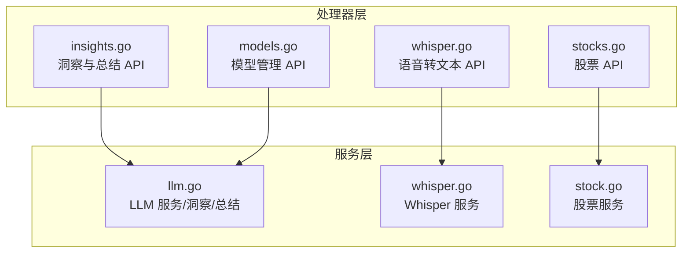
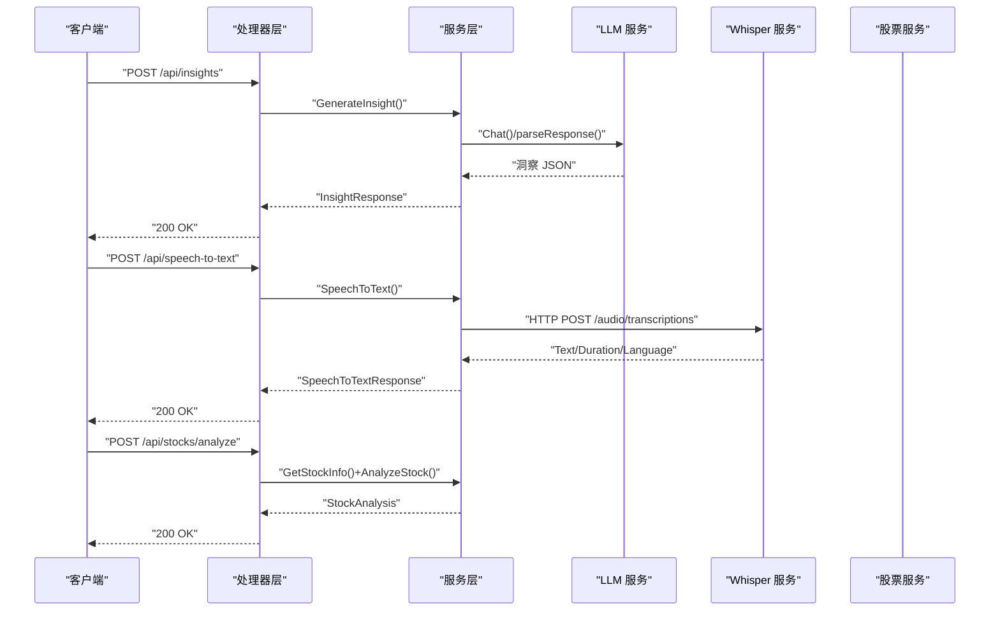
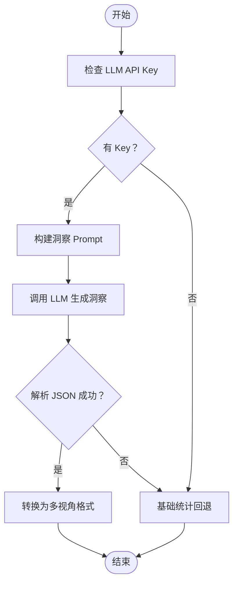
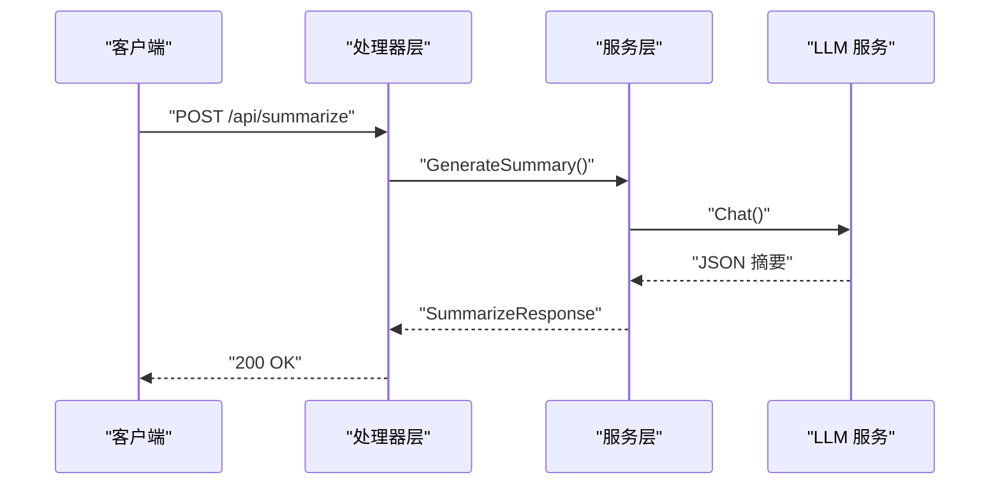
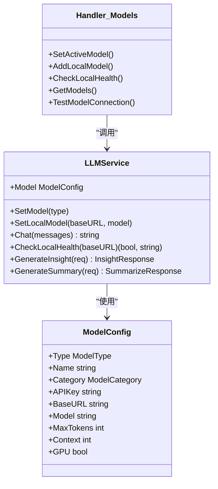
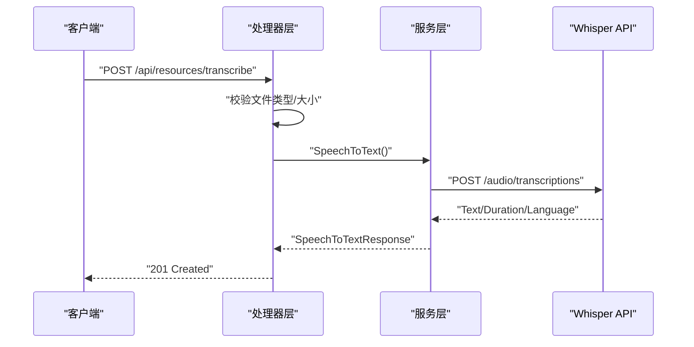
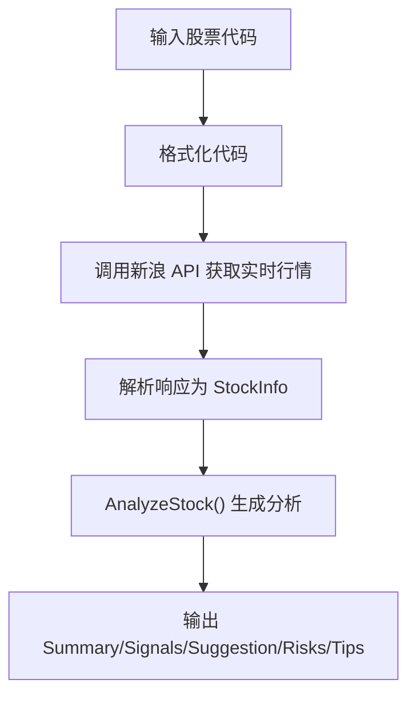
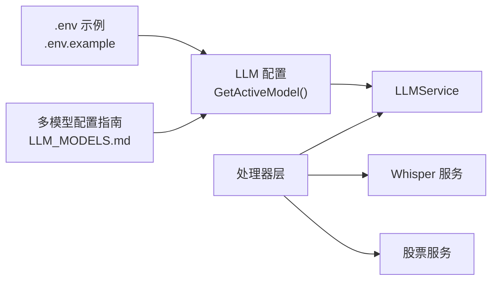

# AI 智能功能

<cite>
**本文引用的文件**
- [backend/services/llm.go](file://backend/services/llm.go)
- [backend/services/whisper.go](file://backend/services/whisper.go)
- [backend/services/stock.go](file://backend/services/stock.go)
- [backend/handlers/insights.go](file://backend/handlers/insights.go)
- [backend/handlers/whisper.go](file://backend/handlers/whisper.go)
- [backend/handlers/stocks.go](file://backend/handlers/stocks.go)
- [backend/handlers/models.go](file://backend/handlers/models.go)
- [docs/LLM_MODELS.md](file://docs/LLM_MODELS.md)
- [.env.example](file://.env.example)
</cite>

## 目录
1. [简介](#简介)
2. [项目结构](#项目结构)
3. [核心组件](#核心组件)
4. [架构总览](#架构总览)
5. [详细组件分析](#详细组件分析)
6. [依赖关系分析](#依赖关系分析)
7. [性能考虑](#性能考虑)
8. [故障排查指南](#故障排查指南)
9. [结论](#结论)
10. [附录](#附录)

## 简介
本文件面向 Memo Studio 的 AI 智能功能，系统性梳理洞察分析、内容总结、多模型支持、语音转文字（Whisper）、股票分析等能力的实现与使用方法。文档涵盖：
- 洞察分析系统：关键词提取、主题/情感/行动等多视角分析、趋势与建议生成
- 内容总结：要点提取、任务建议生成
- 多模型支持：OpenAI、Claude、DeepSeek、智谱、零一万物、阿里通义、月之暗面、讯飞等云端模型，以及 Ollama/LM Studio/LocalAI/AnythingLLM 等本地模型
- 语音转文字：Whisper 模型调用、音频处理、语言检测
- 股票分析：实时行情、历史数据、技术面/成交量/估值信号与投资建议
- 配置方法、API 使用示例、性能优化、错误处理与超时控制、成本控制策略

## 项目结构
AI 相关能力由后端服务层与处理器层共同构成：
- 服务层（services）：封装 LLM、Whisper、股票数据接口与业务逻辑
- 处理器层（handlers）：暴露 REST API，接收请求、校验参数、调用服务层并返回响应
- 文档与配置：提供多模型配置指南与示例环境变量

图表来源
- [backend/handlers/insights.go](file://backend/handlers/insights.go#L68-L206)
- [backend/handlers/whisper.go](file://backend/handlers/whisper.go#L31-L162)
- [backend/handlers/stocks.go](file://backend/handlers/stocks.go#L12-L130)
- [backend/handlers/models.go](file://backend/handlers/models.go#L60-L233)
- [backend/services/llm.go](file://backend/services/llm.go#L377-L641)
- [backend/services/whisper.go](file://backend/services/whisper.go#L45-L138)
- [backend/services/stock.go](file://backend/services/stock.go#L81-L529)

章节来源
- [backend/handlers/insights.go](file://backend/handlers/insights.go#L68-L206)
- [backend/handlers/whisper.go](file://backend/handlers/whisper.go#L31-L162)
- [backend/handlers/stocks.go](file://backend/handlers/stocks.go#L12-L130)
- [backend/handlers/models.go](file://backend/handlers/models.go#L60-L233)
- [backend/services/llm.go](file://backend/services/llm.go#L377-L641)
- [backend/services/whisper.go](file://backend/services/whisper.go#L45-L138)
- [backend/services/stock.go](file://backend/services/stock.go#L81-L529)

## 核心组件
- LLM 服务与洞察分析：统一的 LLMService，支持多厂商与本地模型；提供 GenerateInsight 与 GenerateSummary，分别用于洞察报告与内容总结
- Whisper 语音转文字：封装 OpenAI Whisper API，支持多种音频格式、语言检测、温度参数
- 股票分析服务：实时行情、历史数据、技术面/成交量/估值信号与投资建议
- 模型管理：动态切换云端/本地模型、健康检查、连接测试、可用模型查询

章节来源
- [backend/services/llm.go](file://backend/services/llm.go#L377-L641)
- [backend/services/whisper.go](file://backend/services/whisper.go#L45-L138)
- [backend/services/stock.go](file://backend/services/stock.go#L81-L529)
- [backend/handlers/models.go](file://backend/handlers/models.go#L60-L233)

## 架构总览
AI 功能通过处理器层暴露 REST API，内部调用服务层完成具体任务。多模型支持通过环境变量与模型配置实现动态切换。

图表来源
- [backend/handlers/insights.go](file://backend/handlers/insights.go#L68-L206)
- [backend/handlers/whisper.go](file://backend/handlers/whisper.go#L107-L162)
- [backend/handlers/stocks.go](file://backend/handlers/stocks.go#L90-L130)
- [backend/services/llm.go](file://backend/services/llm.go#L549-L641)
- [backend/services/whisper.go](file://backend/services/whisper.go#L45-L138)
- [backend/services/stock.go](file://backend/services/stock.go#L414-L500)

## 详细组件分析

### 洞察分析系统
- 输入：笔记数组、时间范围、视角集合
- 输出：概览、主题、情感、行动等多视角洞察，以及关键词、趋势、建议
- 实现要点：
  - 通过 LLM 生成严格 JSON 结构的洞察报告，若解析失败则回退为基础统计
  - 支持多视角对比与批量总结
  - 未配置 LLM 时，仍提供基础统计与评分

图表来源
- [backend/handlers/insights.go](file://backend/handlers/insights.go#L68-L119)
- [backend/services/llm.go](file://backend/services/llm.go#L549-L591)

章节来源
- [backend/handlers/insights.go](file://backend/handlers/insights.go#L68-L206)
- [backend/services/llm.go](file://backend/services/llm.go#L549-L591)

### 内容总结功能
- 输入：单条笔记内容或批量笔记
- 输出：总结、要点、可执行任务建议
- 实现要点：
  - 通过 LLM 生成严格 JSON，解析失败时回退为截断摘要
  - 批量总结支持限制条数，逐条调用并聚合结果

图表来源
- [backend/handlers/insights.go](file://backend/handlers/insights.go#L167-L206)
- [backend/services/llm.go](file://backend/services/llm.go#L605-L641)

章节来源
- [backend/handlers/insights.go](file://backend/handlers/insights.go#L167-L263)
- [backend/services/llm.go](file://backend/services/llm.go#L605-L641)

### 多模型支持机制
- 支持厂商：OpenAI、Claude、DeepSeek、智谱、零一万物、阿里通义、月之暗面、讯飞
- 支持本地：Ollama、LM Studio、LocalAI、AnythingLLM
- 切换方式：
  - 环境变量：LLM_API_KEY、LLM_MODEL_TYPE、LLM_BASE_URL、LLM_MODEL
  - 云端 Key：OPENAI_API_KEY、ANTHROPIC_API_KEY、DEEPSEEK_API_KEY、ZHIPU_API_KEY 等
  - 模型管理 API：切换当前模型、添加自定义本地模型、健康检查、连接测试

图表来源
- [backend/services/llm.go](file://backend/services/llm.go#L377-L416)
- [backend/services/llm.go](file://backend/services/llm.go#L418-L531)
- [backend/handlers/models.go](file://backend/handlers/models.go#L60-L162)

章节来源
- [backend/services/llm.go](file://backend/services/llm.go#L14-L33)
- [backend/services/llm.go](file://backend/services/llm.go#L289-L336)
- [backend/handlers/models.go](file://backend/handlers/models.go#L60-L233)
- [docs/LLM_MODELS.md](file://docs/LLM_MODELS.md#L29-L177)

### 语音转文字服务（Whisper）
- 支持格式：mp3、wav、m4a、ogg、webm、flac、mp4
- 关键流程：文件校验 -> 保存到存储 -> 调用 Whisper API -> 解析响应
- 参数：language、prompt、temperature
- 错误处理：API 错误封装为结构化错误，超时控制为 60 秒

图表来源
- [backend/handlers/whisper.go](file://backend/handlers/whisper.go#L31-L104)
- [backend/services/whisper.go](file://backend/services/whisper.go#L45-L138)

章节来源
- [backend/handlers/whisper.go](file://backend/handlers/whisper.go#L31-L162)
- [backend/services/whisper.go](file://backend/services/whisper.go#L45-L138)

### 股票分析服务
- 实时行情：新浪 API 解析，计算涨跌、涨跌幅、市场归属
- 历史数据：K线数据获取与解析
- 技术分析：基于涨跌、成交量、估值（PE）生成信号与建议
- 投资建议：风险提示与通用建议

图表来源
- [backend/services/stock.go](file://backend/services/stock.go#L81-L118)
- [backend/services/stock.go](file://backend/services/stock.go#L230-L277)
- [backend/services/stock.go](file://backend/services/stock.go#L414-L500)

章节来源
- [backend/services/stock.go](file://backend/services/stock.go#L81-L529)
- [backend/handlers/stocks.go](file://backend/handlers/stocks.go#L12-L130)

## 依赖关系分析
- 模型选择与配置：GetActiveModel 依据环境变量与 API Key 选择模型，支持统一 Key 与厂商独立 Key
- 处理器与服务：处理器负责参数绑定、鉴权与错误码，服务层负责业务逻辑与外部 API 调用
- 多模型与本地模型：通过 DefaultModels/LocalModels 与 SetActiveModel/AddLocalModel 管理

图表来源
- [.env.example](file://.env.example#L1-L16)
- [docs/LLM_MODELS.md](file://docs/LLM_MODELS.md#L29-L51)
- [backend/services/llm.go](file://backend/services/llm.go#L289-L336)
- [backend/handlers/models.go](file://backend/handlers/models.go#L60-L104)

章节来源
- [backend/services/llm.go](file://backend/services/llm.go#L289-L336)
- [backend/handlers/models.go](file://backend/handlers/models.go#L60-L104)
- [.env.example](file://.env.example#L1-L16)
- [docs/LLM_MODELS.md](file://docs/LLM_MODELS.md#L29-L51)

## 性能考虑
- LLM 调用超时：默认 120 秒，Whisper 默认 60 秒，可根据网络与模型规模调整
- 本地模型优化：Ollama 环境变量建议（并发与线程），显存需求参考文档建议
- 批量总结限制：处理器层对批量总结设置上限，避免一次性处理过多内容
- 连接健康检查：提供本地模型健康检查与连接测试，降低运行时失败概率

章节来源
- [backend/services/llm.go](file://backend/services/llm.go#L469-L470)
- [backend/services/whisper.go](file://backend/services/whisper.go#L115)
- [backend/handlers/insights.go](file://backend/handlers/insights.go#L225-L228)
- [docs/LLM_MODELS.md](file://docs/LLM_MODELS.md#L259-L277)

## 故障排查指南
- LLM 未配置：当未检测到任一 LLM API Key 时，洞察与总结会回退为基础分析
- Whisper 未配置：未设置 OPENAI_API_KEY 时，返回未配置提示
- API 错误：Whisper 服务将非 200 响应封装为结构化错误，便于前端展示
- 超时与网络：LLM 与 Whisper 均设置超时，网络波动或代理问题可能导致失败
- 本地模型不可达：使用健康检查与连接测试快速定位服务地址与模型名称

章节来源
- [backend/handlers/insights.go](file://backend/handlers/insights.go#L89-L115)
- [backend/handlers/whisper.go](file://backend/handlers/whisper.go#L133-L141)
- [backend/services/whisper.go](file://backend/services/whisper.go#L122-L125)
- [backend/handlers/models.go](file://backend/handlers/models.go#L140-L162)

## 结论
Memo Studio 的 AI 智能功能以模块化方式组织，LLM、Whisper、股票分析分别由服务层封装，处理器层提供统一 API。多模型支持通过环境变量与模型管理 API 实现灵活切换，同时提供健康检查与连接测试保障稳定性。在未配置 LLM 的情况下，系统仍提供基础统计与摘要能力，确保核心体验不受影响。

## 附录

### 配置方法
- 环境变量模板：参考 .env.example
- 多模型配置指南：参考 LLM_MODELS.md，支持统一 Key 与厂商独立 Key，以及本地模型配置
- 模型切换 API：提供获取模型列表、切换当前模型、添加自定义本地模型、健康检查、连接测试等

章节来源
- [.env.example](file://.env.example#L1-L16)
- [docs/LLM_MODELS.md](file://docs/LLM_MODELS.md#L29-L177)
- [backend/handlers/models.go](file://backend/handlers/models.go#L60-L233)

### API 使用示例
- 洞察分析：POST /api/insights、POST /api/insights/:type、POST /api/insights/compare
- 内容总结：POST /api/summarize、POST /api/summarize/batch
- 语音转文字：POST /api/resources/transcribe、POST /api/speech-to-text
- 股票分析：GET /api/stocks/:code、GET /api/stocks/search?q=关键词、GET /api/stocks/hot、GET /api/stocks/:code/history、POST /api/stocks/analyze
- 模型管理：GET /api/models、GET /api/models/cloud、GET /api/models/local、GET /api/models/config、GET /api/models/available、POST /api/models/active、POST /api/models/local、POST /api/models/local/health、POST /api/models/test

章节来源
- [backend/handlers/insights.go](file://backend/handlers/insights.go#L68-L206)
- [backend/handlers/whisper.go](file://backend/handlers/whisper.go#L31-L162)
- [backend/handlers/stocks.go](file://backend/handlers/stocks.go#L12-L130)
- [backend/handlers/models.go](file://backend/handlers/models.go#L164-L371)
- [docs/LLM_MODELS.md](file://docs/LLM_MODELS.md#L209-L258)