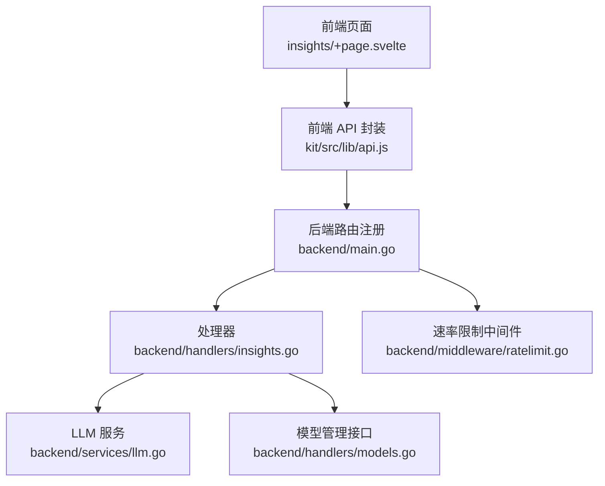
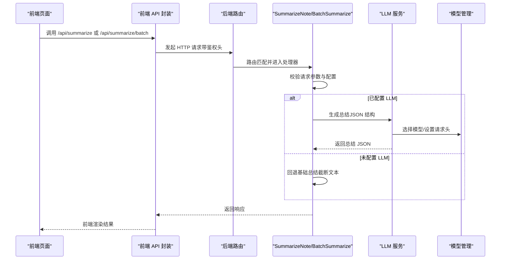
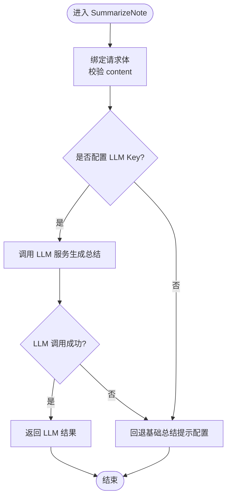
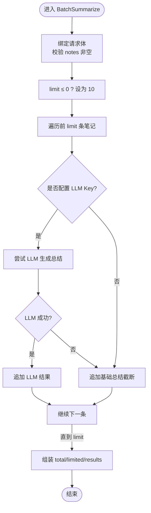
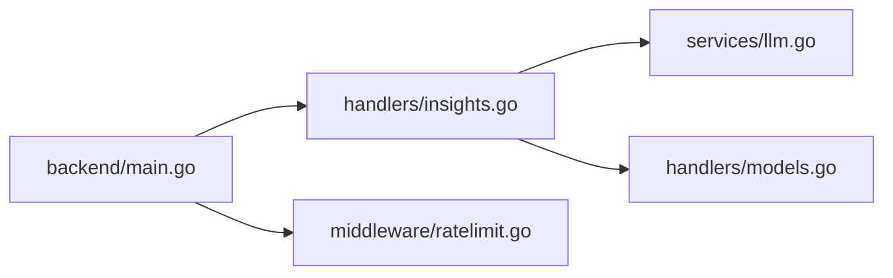

# 内容总结功能

<cite>
**本文引用的文件**
- [backend/handlers/insights.go](file://backend/handlers/insights.go)
- [backend/services/llm.go](file://backend/services/llm.go)
- [backend/handlers/models.go](file://backend/handlers/models.go)
- [backend/middleware/ratelimit.go](file://backend/middleware/ratelimit.go)
- [backend/main.go](file://backend/main.go)
- [kit/src/routes/insights/+page.svelte](file://kit/src/routes/insights/+page.svelte)
- [kit/src/lib/api.js](file://kit/src/lib/api.js)
- [backend/README.md](file://backend/README.md)
- [.env.example](file://.env.example)
</cite>

## 目录
1. [简介](#简介)
2. [项目结构](#项目结构)
3. [核心组件](#核心组件)
4. [架构总览](#架构总览)
5. [详细组件分析](#详细组件分析)
6. [依赖关系分析](#依赖关系分析)
7. [性能考虑](#性能考虑)
8. [故障排查指南](#故障排查指南)
9. [结论](#结论)
10. [附录](#附录)

## 简介
本文件系统性介绍“内容总结功能”的设计与实现，涵盖单条笔记总结与批量笔记总结两个接口，以及 AI 总结与基础总结的切换机制、请求参数结构、响应数据模型、性能优化策略、API 使用示例与最佳实践。目标是帮助开发者与使用者快速理解并正确使用该功能，覆盖从前端调用到后端处理、模型选择与降级策略的全链路。

## 项目结构
内容总结功能涉及前后端协作：
- 前端：SvelteKit 页面负责发起 /api/summarize 与 /api/summarize/batch 请求，并展示结果。
- 后端：Gin 路由处理请求，调用 LLM 服务生成总结；若未配置 LLM，则回退到基础总结。
- LLM 服务：封装模型选择、请求发送、响应解析与错误处理。
- 中间件：提供通用速率限制，保障服务稳定性。

图表来源
- [backend/main.go](file://backend/main.go#L132-L258)
- [backend/handlers/insights.go](file://backend/handlers/insights.go#L167-L263)
- [backend/services/llm.go](file://backend/services/llm.go#L377-L435)
- [backend/handlers/models.go](file://backend/handlers/models.go#L164-L233)
- [backend/middleware/ratelimit.go](file://backend/middleware/ratelimit.go#L1-L142)
- [kit/src/routes/insights/+page.svelte](file://kit/src/routes/insights/+page.svelte#L60-L115)
- [kit/src/lib/api.js](file://kit/src/lib/api.js#L1-L33)

章节来源
- [backend/main.go](file://backend/main.go#L132-L258)
- [backend/handlers/insights.go](file://backend/handlers/insights.go#L167-L263)
- [backend/services/llm.go](file://backend/services/llm.go#L377-L435)
- [backend/handlers/models.go](file://backend/handlers/models.go#L164-L233)
- [backend/middleware/ratelimit.go](file://backend/middleware/ratelimit.go#L1-L142)
- [kit/src/routes/insights/+page.svelte](file://kit/src/routes/insights/+page.svelte#L60-L115)
- [kit/src/lib/api.js](file://kit/src/lib/api.js#L1-L33)

## 核心组件
- 单条笔记总结接口：POST /api/summarize
- 批量笔记总结接口：POST /api/summarize/batch
- LLM 服务：封装模型选择、请求构建、发送与解析
- 模型管理接口：查询/切换/测试模型，支持云端与本地模型
- 速率限制中间件：全局与严格限流，防止滥用
- 前端调用封装：统一添加鉴权头、错误处理与 UI 展示

章节来源
- [backend/handlers/insights.go](file://backend/handlers/insights.go#L167-L263)
- [backend/services/llm.go](file://backend/services/llm.go#L377-L640)
- [backend/handlers/models.go](file://backend/handlers/models.go#L60-L162)
- [backend/middleware/ratelimit.go](file://backend/middleware/ratelimit.go#L88-L142)
- [kit/src/lib/api.js](file://kit/src/lib/api.js#L1-L33)

## 架构总览
内容总结的端到端流程如下：
- 前端页面选择笔记内容，调用 /api/summarize 或 /api/summarize/batch。
- 后端处理器解析请求，检查是否配置了 LLM API Key。
- 若配置有效，调用 LLM 服务生成 JSON 结构的总结；若失败或未配置，回退到基础总结（截断文本）。
- 响应返回给前端，UI 展示摘要、要点与可执行任务。

图表来源
- [kit/src/routes/insights/+page.svelte](file://kit/src/routes/insights/+page.svelte#L60-L115)
- [kit/src/lib/api.js](file://kit/src/lib/api.js#L1-L33)
- [backend/main.go](file://backend/main.go#L153-L158)
- [backend/handlers/insights.go](file://backend/handlers/insights.go#L167-L263)
- [backend/services/llm.go](file://backend/services/llm.go#L377-L435)
- [backend/handlers/models.go](file://backend/handlers/models.go#L164-L233)

## 详细组件分析

### 单条笔记总结（SummarizeNote）
- 接口：POST /api/summarize
- 请求参数
  - content: string（必填，笔记内容）
- 处理逻辑
  - 校验请求体与 content 非空
  - 检测是否存在任一 LLM API Key（OPENAI_API_KEY、LLM_API_KEY、ANTHROPIC_API_KEY 等）
  - 若存在，调用 LLM 服务生成总结；若 LLM 调用失败，回退基础总结（提示配置）
  - 若不存在，直接返回基础总结（提示配置）
- 响应数据结构
  - summary: string（总结内容）
  - highlights: string[]（要点列表）
  - action_items: string[]（可执行任务/建议）

图表来源
- [backend/handlers/insights.go](file://backend/handlers/insights.go#L167-L206)
- [backend/services/llm.go](file://backend/services/llm.go#L605-L640)

章节来源
- [backend/handlers/insights.go](file://backend/handlers/insights.go#L167-L206)
- [backend/services/llm.go](file://backend/services/llm.go#L605-L640)

### 批量笔记总结（BatchSummarize）
- 接口：POST /api/summarize/batch
- 请求参数
  - notes: string[]（必填，笔记内容数组）
  - limit: number（可选，默认 10，限制处理数量）
- 处理逻辑
  - 校验 notes 非空
  - limit ≤ 0 时默认为 10
  - 遍历前 limit 条笔记，逐条尝试 LLM 生成总结；若 LLM 失败则回退到基础总结（截断）
  - 返回 total、limited、results
- 响应数据结构
  - total: number（传入总数）
  - limited: number（实际处理数量）
  - results: 数组，每个元素包含 summary、highlights、action_items

图表来源
- [backend/handlers/insights.go](file://backend/handlers/insights.go#L208-L263)
- [backend/services/llm.go](file://backend/services/llm.go#L605-L640)

章节来源
- [backend/handlers/insights.go](file://backend/handlers/insights.go#L208-L263)
- [backend/services/llm.go](file://backend/services/llm.go#L605-L640)

### AI 总结与基础总结的切换逻辑
- LLM 检测：处理器通过环境变量判断是否配置了任一 LLM Key
- API 密钥验证：LLM 服务在发送请求前按模型类型设置相应请求头
- 降级处理：当 LLM 调用失败或未配置时，返回基础总结（提示配置），或对单条笔记进行截断处理

章节来源
- [backend/handlers/insights.go](file://backend/handlers/insights.go#L183-L206)
- [backend/services/llm.go](file://backend/services/llm.go#L484-L501)

### 模型选择与配置
- 模型类型：支持 OpenAI、Claude、DeepSeek、GLM、Yi、Qwen、Kimi、Spark 等云端模型，以及 Ollama、LocalAI、LM Studio、AnythingLLM 等本地模型
- 模型选择策略：优先读取 LLM_MODEL_TYPE，其次根据 API Key 自动匹配，最后回退到默认模型
- 配置方式：通过环境变量 LLM_API_KEY、LLM_BASE_URL、LLM_MODEL、LLM_MODEL_TYPE 控制
- 模型管理接口：提供查询、切换、测试连接、健康检查等能力

章节来源
- [backend/services/llm.go](file://backend/services/llm.go#L74-L192)
- [backend/services/llm.go](file://backend/services/llm.go#L289-L336)
- [backend/handlers/models.go](file://backend/handlers/models.go#L164-L233)
- [backend/handlers/models.go](file://backend/handlers/models.go#L341-L370)

### 前端调用与展示
- 前端页面提供“单条笔记总结”和“批量总结”按钮，分别调用 /api/summarize 与 /api/summarize/batch
- 前端 API 封装自动附加 Authorization 头（若存在 token）
- UI 展示 summary、highlights、action_items 等字段

章节来源
- [kit/src/routes/insights/+page.svelte](file://kit/src/routes/insights/+page.svelte#L60-L115)
- [kit/src/lib/api.js](file://kit/src/lib/api.js#L1-L33)

## 依赖关系分析
- 路由注册：/api/summarize 与 /api/summarize/batch 在主入口注册
- 处理器依赖：SummarizeNote/BatchSummarize 依赖 LLM 服务与模型管理
- LLM 服务依赖：模型配置、HTTP 请求构建与解析、错误处理
- 中间件：全局速率限制中间件保护接口免受突发流量冲击

图表来源
- [backend/main.go](file://backend/main.go#L132-L258)
- [backend/handlers/insights.go](file://backend/handlers/insights.go#L167-L263)
- [backend/services/llm.go](file://backend/services/llm.go#L377-L435)
- [backend/handlers/models.go](file://backend/handlers/models.go#L164-L233)
- [backend/middleware/ratelimit.go](file://backend/middleware/ratelimit.go#L88-L142)

章节来源
- [backend/main.go](file://backend/main.go#L132-L258)
- [backend/handlers/insights.go](file://backend/handlers/insights.go#L167-L263)
- [backend/services/llm.go](file://backend/services/llm.go#L377-L435)
- [backend/handlers/models.go](file://backend/handlers/models.go#L164-L233)
- [backend/middleware/ratelimit.go](file://backend/middleware/ratelimit.go#L88-L142)

## 性能考虑
- 并发处理：批量总结采用顺序循环处理，未引入 goroutine 并发；若需要更高吞吐，可在保证稳定性的前提下引入并发与限流控制
- 限流控制：全局中间件默认每分钟 50 次，严格中间件每分钟 30 次；可根据部署环境调整
- 错误处理：LLM 调用失败时回退基础总结，避免长时间等待；建议在前端增加重试与超时控制
- 资源开销：LLM 请求耗时较长，建议在前端显示加载态，合理设置超时时间

章节来源
- [backend/middleware/ratelimit.go](file://backend/middleware/ratelimit.go#L88-L142)
- [backend/handlers/insights.go](file://backend/handlers/insights.go#L208-L263)

## 故障排查指南
- 未配置 LLM Key
  - 现象：返回基础总结（提示配置）
  - 处理：设置 LLM_API_KEY 或对应云厂商 API Key
- LLM 请求失败
  - 现象：处理器捕获错误并回退基础总结
  - 处理：检查网络连通性、BaseURL 正确性、模型名称与 Token 权限
- 速率限制触发
  - 现象：返回 429 Too Many Requests
  - 处理：降低请求频率或调整中间件阈值
- 前端鉴权问题
  - 现象：401 未授权
  - 处理：确保本地存储 token 正确传递

章节来源
- [backend/handlers/insights.go](file://backend/handlers/insights.go#L183-L206)
- [backend/services/llm.go](file://backend/services/llm.go#L455-L482)
- [backend/middleware/ratelimit.go](file://backend/middleware/ratelimit.go#L100-L120)
- [kit/src/lib/api.js](file://kit/src/lib/api.js#L17-L33)

## 结论
内容总结功能通过清晰的接口设计与完善的降级策略，在具备 LLM 配置时提供高质量的 JSON 结构化总结，在未配置时仍能提供基础总结能力。配合模型管理与速率限制中间件，系统在易用性与稳定性之间取得平衡。建议在生产环境中结合业务需求调整限流策略，并在前端做好错误提示与用户体验优化。

## 附录

### API 使用示例
- 单条笔记总结
  - 方法：POST /api/summarize
  - 请求体：{ content: "笔记内容" }
  - 响应：{ summary, highlights[], action_items[] }
- 批量笔记总结
  - 方法：POST /api/summarize/batch
  - 请求体：{ notes: ["内容1","内容2",...], limit: 5 }
  - 响应：{ total, limited, results: [{summary, highlights, action_items}] }

章节来源
- [backend/handlers/insights.go](file://backend/handlers/insights.go#L167-L263)
- [kit/src/routes/insights/+page.svelte](file://kit/src/routes/insights/+page.svelte#L60-L115)

### 配置方法
- 环境变量
  - LLM_API_KEY：统一 API Key
  - OPENAI_API_KEY / ANTHROPIC_API_KEY / DEEPSEEK_API_KEY / ZHIPU_API_KEY：各云厂商 Key
  - LLM_BASE_URL：自定义 BaseURL（本地模型）
  - LLM_MODEL：模型名称
  - LLM_MODEL_TYPE：模型类型（如 openai、claude 等）
- 模型管理接口
  - 查询模型：GET /api/models
  - 切换模型：POST /api/models/active
  - 测试连接：POST /api/models/test
  - 健康检查：POST /api/models/local/health

章节来源
- [backend/services/llm.go](file://backend/services/llm.go#L289-L336)
- [backend/handlers/models.go](file://backend/handlers/models.go#L60-L162)
- [backend/handlers/models.go](file://backend/handlers/models.go#L341-L370)
- [.env.example](file://.env.example#L1-L16)

### 最佳实践建议
- 在前端统一处理错误与加载态，提升用户体验
- 合理设置 limit，避免一次性提交过多内容导致超时
- 在生产环境开启速率限制中间件，并根据业务量调整阈值
- 使用模型管理接口定期检查模型可用性与健康状态
- 对于敏感信息，避免将完整笔记内容暴露在日志中

章节来源
- [backend/middleware/ratelimit.go](file://backend/middleware/ratelimit.go#L88-L142)
- [backend/handlers/models.go](file://backend/handlers/models.go#L140-L162)