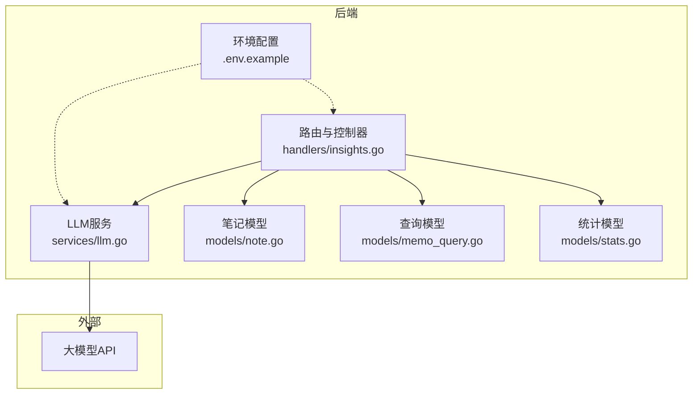
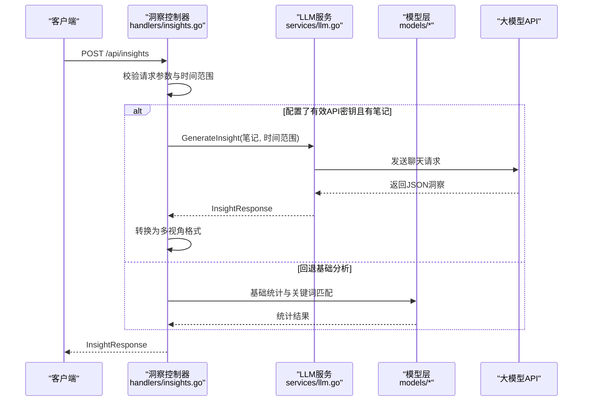
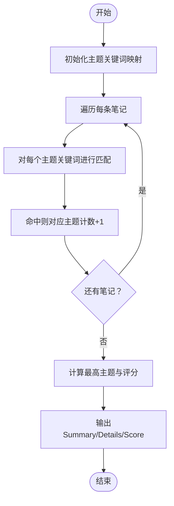
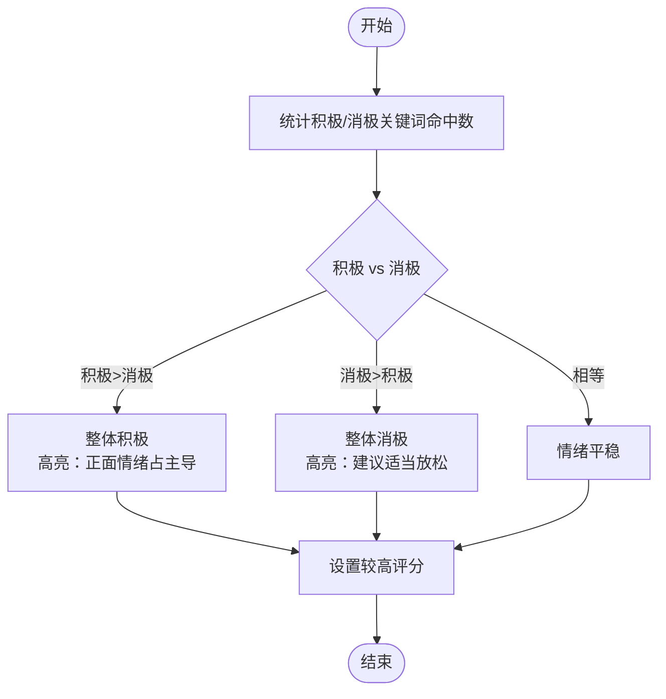
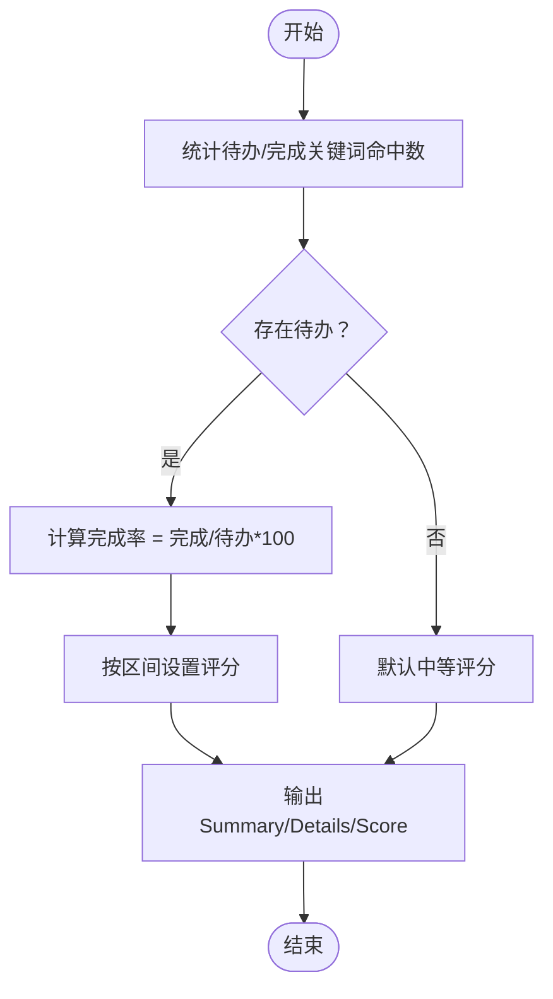
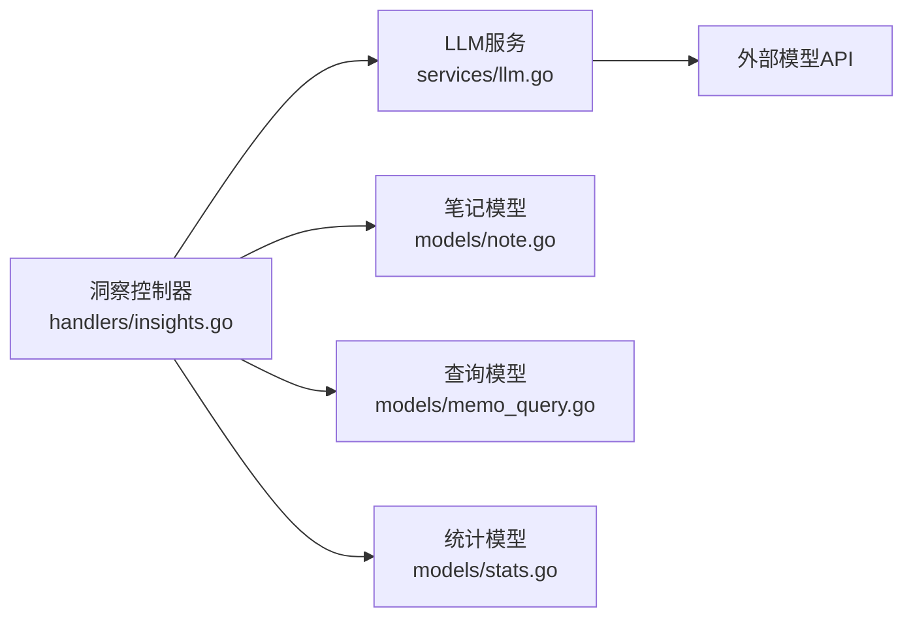

# 洞察分析系统

<cite>
**本文引用的文件**
- [backend/handlers/insights.go](file://backend/handlers/insights.go)
- [backend/services/llm.go](file://backend/services/llm.go)
- [backend/models/memo_query.go](file://backend/models/memo_query.go)
- [backend/models/note.go](file://backend/models/note.go)
- [backend/models/stats.go](file://backend/models/stats.go)
- [backend/main.go](file://backend/main.go)
- [.env.example](file://.env.example)
</cite>

## 目录
1. [简介](#简介)
2. [项目结构](#项目结构)
3. [核心组件](#核心组件)
4. [架构总览](#架构总览)
5. [详细组件分析](#详细组件分析)
6. [依赖关系分析](#依赖关系分析)
7. [性能考量](#性能考量)
8. [故障排除指南](#故障排除指南)
9. [结论](#结论)
10. [附录](#附录)

## 简介
本文件面向“洞察分析系统”的技术文档，聚焦多视角洞察分析的实现原理与接口设计，涵盖概览、时间、主题、情感、行动、关联、频率等七种分析维度。系统采用“AI洞察生成与基础分析双轨制”：当配置有效的API密钥时优先调用LLM生成洞察；若LLM不可用，则回退至本地基础分析。文档同时提供API接口说明、数据模型定义、算法实现细节、配置指南、性能优化建议与故障排除方法，帮助开发者与运维人员快速理解与部署。

## 项目结构
洞察分析系统位于后端模块中，主要涉及以下层次：
- 路由与控制器层：处理HTTP请求，解析参数，调用服务层与模型层，并返回统一响应。
- 服务层：封装LLM服务，负责与外部大模型API交互、模型配置与健康检查。
- 数据模型层：提供笔记、标签、资源、统计等数据结构与查询逻辑。
- 配置与环境：通过环境变量控制LLM接入、CORS、安全头等。

图表来源
- [backend/handlers/insights.go](file://backend/handlers/insights.go#L68-L119)
- [backend/services/llm.go](file://backend/services/llm.go#L377-L435)
- [backend/models/note.go](file://backend/models/note.go#L11-L27)
- [backend/models/memo_query.go](file://backend/models/memo_query.go#L12-L22)
- [backend/models/stats.go](file://backend/models/stats.go#L7-L16)
- [.env.example](file://.env.example#L1-L16)

章节来源
- [backend/handlers/insights.go](file://backend/handlers/insights.go#L68-L119)
- [backend/services/llm.go](file://backend/services/llm.go#L377-L435)
- [backend/models/note.go](file://backend/models/note.go#L11-L27)
- [backend/models/memo_query.go](file://backend/models/memo_query.go#L12-L22)
- [backend/models/stats.go](file://backend/models/stats.go#L7-L16)
- [.env.example](file://.env.example#L1-L16)

## 核心组件
- 洞察请求与响应模型
  - InsightRequest：输入笔记数组与时间范围，用于生成洞察。
  - InsightResponse：统一的洞察响应，包含摘要、多视角洞察、高亮与行动项等。
  - PerspectiveInsight：单个视角的洞察，包含类型、名称、摘要、详情、高亮与评分。
  - DetailItem：详情项，包含标题、内容、图标与计数。
- 视角类型枚举
  - 概览、时间、主题、情感、行动、关联、频率、全部等视角类型常量。
- LLM服务
  - 支持多种云端与本地模型，自动检测环境变量并选择可用模型。
  - 提供洞察生成与总结生成能力，具备错误处理与降级策略。
- 基础分析
  - 概览、主题、情感、行动等视角的基础统计与关键词匹配算法。

章节来源
- [backend/handlers/insights.go](file://backend/handlers/insights.go#L13-L66)
- [backend/handlers/insights.go](file://backend/handlers/insights.go#L316-L360)
- [backend/services/llm.go](file://backend/services/llm.go#L533-L547)
- [backend/services/llm.go](file://backend/services/llm.go#L377-L435)

## 架构总览
洞察分析系统采用“控制器-服务-模型”三层架构：
- 控制器层负责HTTP路由与参数校验，决定是否启用LLM洞察或基础分析。
- 服务层封装LLM调用，处理模型选择、请求构建、响应解析与错误降级。
- 模型层提供笔记、标签、资源与统计等数据结构与查询逻辑，支撑基础分析。

图表来源
- [backend/handlers/insights.go](file://backend/handlers/insights.go#L68-L119)
- [backend/services/llm.go](file://backend/services/llm.go#L549-L591)

章节来源
- [backend/handlers/insights.go](file://backend/handlers/insights.go#L68-L119)
- [backend/services/llm.go](file://backend/services/llm.go#L549-L591)

## 详细组件分析

### 数据模型与接口定义
- InsightRequest
  - 字段：notes（笔记数组）、time_range（时间范围）、perspectives（视角数组）。
- InsightResponse
  - 字段：summary（摘要）、perspectives（多视角洞察数组）、highlights（高亮）、action_items（行动项）、update_time（更新时间）。
- PerspectiveInsight
  - 字段：type（视角类型）、name（显示名称）、summary（摘要）、details（详情数组）、highlights（高亮）、score（评分）。
- DetailItem
  - 字段：title（标题）、content（内容）、icon（图标）、count（计数）。
- SummarizeResponse
  - 字段：summary（摘要）、highlights（高亮）、action_items（行动项）。

章节来源
- [backend/handlers/insights.go](file://backend/handlers/insights.go#L27-L66)

### API 接口文档
- GET /api/insights
  - 功能：获取多视角洞察（概览、主题、情感等）。
  - 请求体：InsightRequest（notes、time_range、perspectives）。
  - 响应：InsightResponse。
  - 示例：见“章节来源”中的路径。
- POST /api/insights/:type
  - 功能：获取特定视角的洞察。
  - 路径参数：type ∈ {overview,time,topic,sentiment,action,connection,frequency,all}。
  - 请求体：{ notes, time_range }。
  - 响应：PerspectiveInsight。
- POST /api/insights/compare
  - 功能：对比两组笔记的洞察差异。
  - 请求体：{ notes1, notes2 }。
  - 响应：包含两个时间段洞察与变化摘要的对象。
- POST /api/summarize
  - 功能：对单条笔记内容进行总结。
  - 请求体：{ content }。
  - 响应：SummarizeResponse。
- POST /api/summarize/batch
  - 功能：批量总结笔记内容（带限制）。
  - 请求体：{ notes, limit }。
  - 响应：包含总数、限制数与结果数组的对象。

章节来源
- [backend/handlers/insights.go](file://backend/handlers/insights.go#L68-L119)
- [backend/handlers/insights.go](file://backend/handlers/insights.go#L121-L142)
- [backend/handlers/insights.go](file://backend/handlers/insights.go#L144-L165)
- [backend/handlers/insights.go](file://backend/handlers/insights.go#L167-L206)
- [backend/handlers/insights.go](file://backend/handlers/insights.go#L208-L263)
- [backend/main.go](file://backend/main.go#L153-L158)

### 双轨制设计与降级策略
- LLM洞察生成
  - 自动检测OPENAI_API_KEY、LLM_API_KEY、ANTHROPIC_API_KEY、DEEPSEEK_API_KEY、ZHIPU_API_KEY等环境变量。
  - 若存在有效密钥且请求包含笔记，则调用LLM服务生成洞察；解析JSON并转换为多视角格式。
- 基础分析
  - 若无有效密钥或无笔记，则回退至本地基础分析，生成概览、主题、情感等视角的统计结果。
- 降级策略
  - LLM调用失败时，自动回退到基础分析；批量总结时若LLM失败则截断内容作为摘要。

章节来源
- [backend/handlers/insights.go](file://backend/handlers/insights.go#L89-L115)
- [backend/handlers/insights.go](file://backend/handlers/insights.go#L208-L263)
- [backend/services/llm.go](file://backend/services/llm.go#L549-L591)

### 主题分析算法实现
- 关键词匹配
  - 定义多个主题类别及其关键词集合（如工作、学习、健康、财务）。
  - 遍历笔记，统计命中次数，输出各主题的条数与占比，给出最高关注主题与综合评分。
- 输出结构
  - Summary：最关注的主题描述。
  - Details：各主题的条数与图标。
  - Score：综合评分（基于命中情况）。

图表来源
- [backend/handlers/insights.go](file://backend/handlers/insights.go#L386-L428)

章节来源
- [backend/handlers/insights.go](file://backend/handlers/insights.go#L386-L428)

### 情感分析算法实现
- 关键词匹配
  - 定义积极与消极情感关键词集合。
  - 遍历笔记，分别统计积极与消极关键词命中次数。
- 结果判定
  - 若积极>消极：整体积极，评分较高并给出正向高亮。
  - 若消极>积极：整体消极，评分较低并给出建议放松的高亮。
  - 否则：情绪平稳，评分中等。

图表来源
- [backend/handlers/insights.go](file://backend/handlers/insights.go#L443-L478)

章节来源
- [backend/handlers/insights.go](file://backend/handlers/insights.go#L443-L478)

### 行动分析算法实现
- 关键词匹配
  - 定义“待办”与“完成”相关关键词集合。
  - 统计待办与完成次数。
- 完成率计算
  - 若存在待办：完成率 = 完成数/待办数*100。
  - 根据完成率区间调整评分（高完成率高分，低完成率低分）。
- 输出结构
  - Summary：完成率描述。
  - Details：待办与完成的条目。
  - Score：综合评分。

图表来源
- [backend/handlers/insights.go](file://backend/handlers/insights.go#L480-L520)

章节来源
- [backend/handlers/insights.go](file://backend/handlers/insights.go#L480-L520)

### LLM服务与模型配置
- 模型类型与分类
  - 支持OpenAI、Claude、DeepSeek、GLM、Yi、Qwen、Kimi、Spark等云端模型，以及Ollama、LocalAI、LMStudio、AnythingLLM等本地模型。
- 模型选择策略
  - 优先读取LLM_MODEL_TYPE环境变量；若未配置则根据可用API Key自动选择默认模型；最后可通过环境变量覆盖BaseURL、Model、API Key。
- 请求与响应
  - 构建ChatRequest，发送至模型BaseURL的/chat/completions端点；解析Choice.Message.Content为最终结果。
- 健康检查
  - 提供本地模型健康检查接口，访问模型服务的/models端点判断可用性。

章节来源
- [backend/services/llm.go](file://backend/services/llm.go#L14-L41)
- [backend/services/llm.go](file://backend/services/llm.go#L289-L336)
- [backend/services/llm.go](file://backend/services/llm.go#L418-L435)
- [backend/services/llm.go](file://backend/services/llm.go#L517-L531)

## 依赖关系分析
- 控制器依赖服务与模型
  - 洞察控制器依赖LLM服务进行AI洞察生成，同时依赖模型层进行基础分析与数据结构定义。
- 服务层依赖外部API
  - LLM服务通过HTTP客户端调用外部模型API，需正确设置请求头与超时。
- 环境变量耦合
  - LLM服务与控制器均依赖环境变量进行模型选择与密钥检测，影响功能开关与行为。

图表来源
- [backend/handlers/insights.go](file://backend/handlers/insights.go#L68-L119)
- [backend/services/llm.go](file://backend/services/llm.go#L377-L435)
- [backend/models/note.go](file://backend/models/note.go#L11-L27)
- [backend/models/memo_query.go](file://backend/models/memo_query.go#L12-L22)
- [backend/models/stats.go](file://backend/models/stats.go#L7-L16)

章节来源
- [backend/handlers/insights.go](file://backend/handlers/insights.go#L68-L119)
- [backend/services/llm.go](file://backend/services/llm.go#L377-L435)
- [backend/models/note.go](file://backend/models/note.go#L11-L27)
- [backend/models/memo_query.go](file://backend/models/memo_query.go#L12-L22)
- [backend/models/stats.go](file://backend/models/stats.go#L7-L16)

## 性能考量
- LLM调用超时与重试
  - LLM服务设置较长超时（120秒），避免长文本或慢响应导致阻塞；建议在网关或反向代理层设置合理的上游超时与重试策略。
- 批量总结限制
  - 批量总结接口支持limit参数，默认限制为10，避免一次性处理过多内容造成内存压力。
- 基础分析复杂度
  - 主题与情感分析采用关键词匹配，时间复杂度与笔记数量线性相关；建议在前端分批提交或后端增加分页与缓存策略。
- 模型选择与上下文
  - 本地模型需考虑Context长度与GPU支持，避免过长上下文导致性能下降；云端模型注意Token限制与成本控制。

[本节为通用指导，不直接分析具体文件]

## 故障排除指南
- LLM无法连接或返回错误
  - 检查环境变量：OPENAI_API_KEY、LLM_API_KEY、ANTHROPIC_API_KEY、DEEPSEEK_API_KEY、ZHIPU_API_KEY是否正确配置。
  - 检查模型BaseURL与模型名称：确保LLM_BASE_URL与LLM_MODEL设置正确。
  - 使用健康检查端点验证本地模型服务状态。
- 响应为空或解析失败
  - LLM返回非JSON或空结果时，系统会回退到基础分析；若仍失败，请检查网络连通性与API配额。
- 基础分析结果异常
  - 确认笔记内容清洗逻辑与关键词集合是否符合预期；必要时扩展关键词库或调整评分阈值。

章节来源
- [backend/services/llm.go](file://backend/services/llm.go#L289-L336)
- [backend/services/llm.go](file://backend/services/llm.go#L517-L531)
- [backend/handlers/insights.go](file://backend/handlers/insights.go#L89-L115)

## 结论
洞察分析系统通过“AI洞察生成与基础分析双轨制”，在保证功能可用性的前提下，最大化发挥LLM的能力。系统围绕多视角洞察展开，提供统一的数据模型与清晰的API接口，便于前端展示与扩展。通过合理的环境变量配置、模型选择与降级策略，系统能够在不同环境下稳定运行。建议在生产环境中完善监控、限流与缓存机制，持续优化关键词库与评分策略，提升洞察质量与用户体验。

[本节为总结性内容，不直接分析具体文件]

## 附录

### 配置指南
- 环境变量
  - JWT密钥：MEMO_JWT_SECRET（建议32+字符）。
  - CORS允许来源：MEMO_CORS_ORIGINS（逗号分隔）。
  - 运行模式：GIN_MODE、MEMO_ENV（production）。
  - LLM相关：LLM_MODEL_TYPE、LLM_API_KEY、LLM_BASE_URL、LLM_MODEL。
  - 云厂商API Key：OPENAI_API_KEY、ANTHROPIC_API_KEY、DEEPSEEK_API_KEY、ZHIPU_API_KEY。
- 示例文件
  - 参考 .env.example 文件进行复制与配置。

章节来源
- [.env.example](file://.env.example#L1-L16)
- [backend/services/llm.go](file://backend/services/llm.go#L289-L336)

### API 端点一览
- GET /api/insights：多视角洞察
- POST /api/insights/:type：特定视角洞察
- POST /api/insights/compare：对比分析
- POST /api/summarize：单条笔记总结
- POST /api/summarize/batch：批量总结

章节来源
- [backend/main.go](file://backend/main.go#L153-L158)
- [backend/handlers/insights.go](file://backend/handlers/insights.go#L68-L119)
- [backend/handlers/insights.go](file://backend/handlers/insights.go#L121-L142)
- [backend/handlers/insights.go](file://backend/handlers/insights.go#L144-L165)
- [backend/handlers/insights.go](file://backend/handlers/insights.go#L167-L206)
- [backend/handlers/insights.go](file://backend/handlers/insights.go#L208-L263)