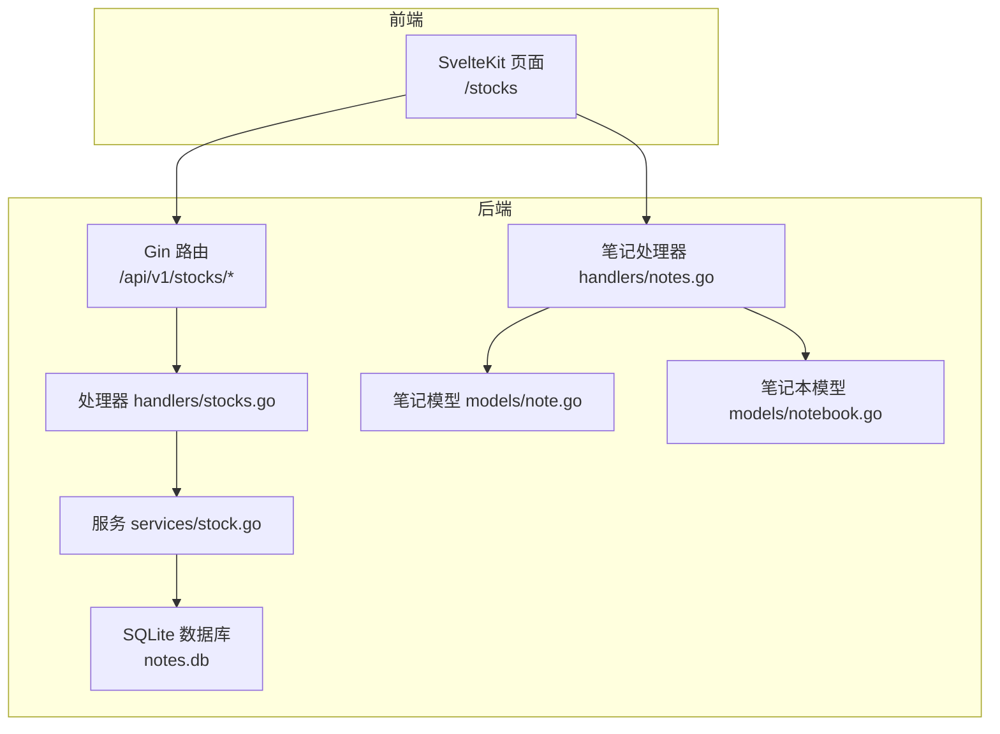
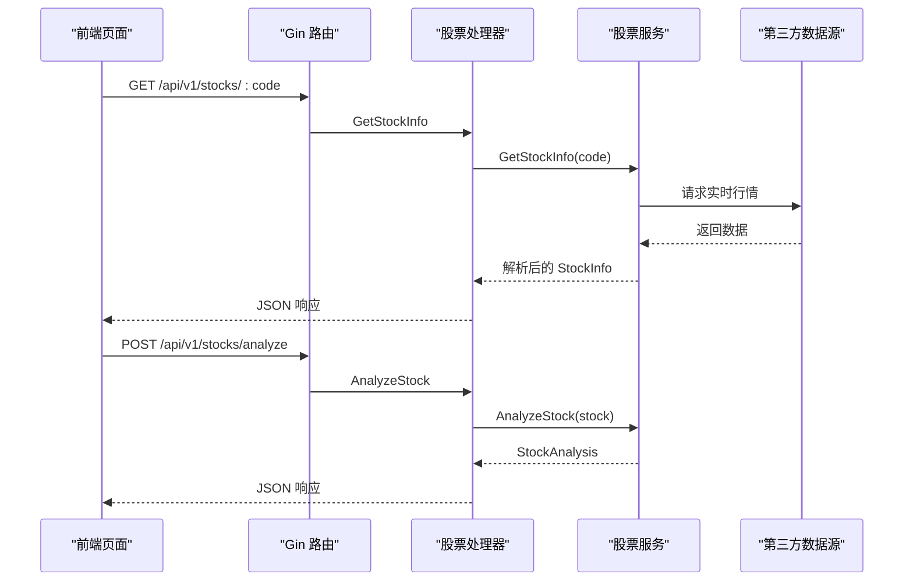
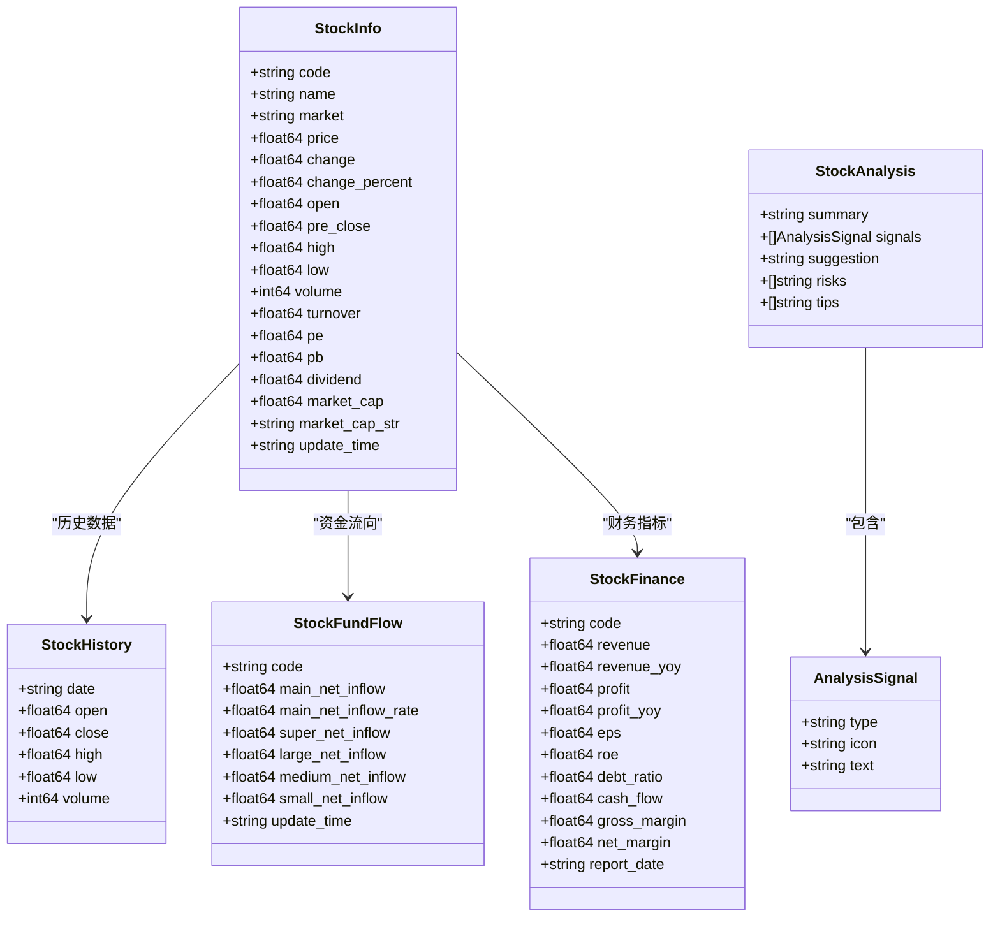
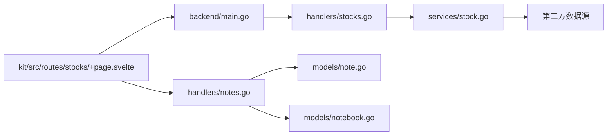

# 股票分析服务

<cite>
**本文引用的文件**
- [backend/main.go](file://backend/main.go)
- [backend/handlers/stocks.go](file://backend/handlers/stocks.go)
- [backend/services/stock.go](file://backend/services/stock.go)
- [backend/models/note.go](file://backend/models/note.go)
- [backend/models/notebook.go](file://backend/models/notebook.go)
- [backend/handlers/notes.go](file://backend/handlers/notes.go)
- [kit/src/routes/stocks/+page.svelte](file://kit/src/routes/stocks/+page.svelte)
- [.env.example](file://.env.example)
- [backend/database/database.go](file://backend/database/database.go)
</cite>

## 目录
1. [简介](#简介)
2. [项目结构](#项目结构)
3. [核心组件](#核心组件)
4. [架构总览](#架构总览)
5. [详细组件分析](#详细组件分析)
6. [依赖关系分析](#依赖关系分析)
7. [性能考量](#性能考量)
8. [故障排查指南](#故障排查指南)
9. [结论](#结论)
10. [附录](#附录)

## 简介
本文件面向“股票分析服务”的使用者与开发者，系统性阐述以下内容：
- 股票行情获取机制：实时行情订阅、历史数据查询、数据更新策略
- 技术分析算法应用：移动平均线、相对强弱指数、布林带等指标的计算与解读
- 投资建议生成逻辑：趋势判断、风险评估、收益预测
- 股票分析 API 的完整接口文档：股票代码查询、技术指标获取、分析报告生成
- 服务配置方法：API 密钥设置、数据源选择、分析参数配置
- 使用示例、最佳实践与注意事项
- 股票分析在个人投资决策中的应用场景与价值
- 与笔记系统的集成方式：投资记录、市场观察、学习笔记等

## 项目结构
后端采用 Go + Gin 框架，前端采用 SvelteKit，数据库使用 SQLite。股票分析服务位于后端 handlers 与 services 层，前端通过 kit 路由提供可视化界面。

图表来源
- [backend/main.go](file://backend/main.go#L179-L184)
- [backend/handlers/stocks.go](file://backend/handlers/stocks.go#L1-L138)
- [backend/services/stock.go](file://backend/services/stock.go#L1-L529)
- [kit/src/routes/stocks/+page.svelte](file://kit/src/routes/stocks/+page.svelte#L1-L622)

章节来源
- [backend/main.go](file://backend/main.go#L179-L184)
- [backend/handlers/stocks.go](file://backend/handlers/stocks.go#L1-L138)
- [backend/services/stock.go](file://backend/services/stock.go#L1-L529)
- [kit/src/routes/stocks/+page.svelte](file://kit/src/routes/stocks/+page.svelte#L1-L622)

## 核心组件
- 股票数据服务层：封装股票数据获取、解析、历史数据拉取与分析逻辑
- 股票分析处理器：提供 REST API，负责参数校验、调用服务层并返回统一响应
- 笔记系统：提供与股票分析结果的集成能力，便于记录投资观察与学习笔记
- 前端页面：提供股票搜索、详情展示、AI 分析与保存到笔记的功能

章节来源
- [backend/services/stock.go](file://backend/services/stock.go#L13-L529)
- [backend/handlers/stocks.go](file://backend/handlers/stocks.go#L12-L138)
- [backend/models/note.go](file://backend/models/note.go#L11-L846)
- [backend/models/notebook.go](file://backend/models/notebook.go#L10-L206)
- [backend/handlers/notes.go](file://backend/handlers/notes.go#L17-L513)
- [kit/src/routes/stocks/+page.svelte](file://kit/src/routes/stocks/+page.svelte#L1-L622)

## 架构总览
后端通过 Gin 路由暴露股票分析 API，处理器将请求委派给服务层，服务层对接第三方数据源（新浪财经、东方财富等），解析并返回结构化数据。前端页面通过 fetch 调用后端 API，并支持将分析结果保存为笔记。

图表来源
- [backend/main.go](file://backend/main.go#L179-L184)
- [backend/handlers/stocks.go](file://backend/handlers/stocks.go#L12-L130)
- [backend/services/stock.go](file://backend/services/stock.go#L81-L118)
- [kit/src/routes/stocks/+page.svelte](file://kit/src/routes/stocks/+page.svelte#L56-L110)

## 详细组件分析

### 股票数据服务层（services/stock.go）
- 股票信息模型：包含实时价格、涨跌额、涨跌幅、开盘/昨收/最高/最低、成交量、成交额、PE/PB/股息率、总市值、更新时间等字段
- 资金流向模型：主力净流入、主力净流入占比等
- 财务指标模型：营业收入、净利润、EPS、ROE、资产负债率、经营现金流、毛利率、净利率等
- 股票搜索模型：返回股票代码、名称、市场
- 历史数据模型：日期、开盘、收盘、最高、最低、成交量
- 分析结果模型：摘要、信号、建议、风险提示、投资小贴士
- 核心函数：
  - GetStockInfo：格式化股票代码，调用新浪财经 API 获取实时行情并解析
  - GetStockHistory：调用新浪 K 线 API 获取历史数据
  - AnalyzeStock：基于涨跌、成交量、市盈率等生成分析结论与建议
  - GetStockList：调用同花顺股票搜索 API
  - GetHotStocks：返回热门股票列表
  - GetStockFundFlow：调用东方财富资金流向 API
  - GetStockFinance：调用新浪财经财务数据 API
  - GetStockHolders：预留主要股东信息获取

图表来源
- [backend/services/stock.go](file://backend/services/stock.go#L13-L72)
- [backend/services/stock.go](file://backend/services/stock.go#L388-L396)
- [backend/services/stock.go](file://backend/services/stock.go#L398-L412)

章节来源
- [backend/services/stock.go](file://backend/services/stock.go#L13-L529)

### 股票分析处理器（handlers/stocks.go）
- GetStockInfo：接收股票代码参数，调用服务层获取实时行情，返回统一 JSON 响应
- SearchStocks：接收关键词查询，调用服务层搜索股票，失败时回退到热门股票
- GetHotStocks：返回热门股票列表
- GetStockHistory：接收 days 参数，调用服务层获取历史数据
- AnalyzeStock：接收股票代码，先尝试获取实时行情，失败时使用模拟数据，然后生成分析结果
- 统一响应结构：StockResponse（可选）

章节来源
- [backend/handlers/stocks.go](file://backend/handlers/stocks.go#L12-L138)

### 前端页面（kit/src/routes/stocks/+page.svelte）
- 提供股票搜索框、热门股票展示、股票详情卡片、AI 分析按钮、保存到笔记按钮
- 调用后端 API 获取实时行情、分析结果
- 本地生成简单分析作为降级方案
- 将分析结果保存为笔记草稿并跳转到笔记编辑页

章节来源
- [kit/src/routes/stocks/+page.svelte](file://kit/src/routes/stocks/+page.svelte#L1-L622)

### 笔记系统集成
- 笔记模型：包含标题、内容、内容类型、是否置顶、标签、资源、笔记本 ID 列表、位置信息等
- 笔记本模型：笔记本名称、颜色、排序、笔记数量统计
- 笔记处理器：提供创建、更新、删除、批量删除、标签管理、笔记本关联等接口
- 与股票分析的集成：前端页面将分析结果保存为笔记草稿，便于后续整理与回顾

章节来源
- [backend/models/note.go](file://backend/models/note.go#L11-L846)
- [backend/models/notebook.go](file://backend/models/notebook.go#L10-L206)
- [backend/handlers/notes.go](file://backend/handlers/notes.go#L17-L513)
- [kit/src/routes/stocks/+page.svelte](file://kit/src/routes/stocks/+page.svelte#L149-L174)

## 依赖关系分析
- 路由到处理器：后端 main.go 注册 /api/v1/stocks/* 路由，映射到 handlers/stocks.go
- 处理器到服务：handlers/stocks.go 调用 services/stock.go 的具体函数
- 服务到数据源：services/stock.go 通过 HTTP 客户端访问第三方数据源
- 前端到后端：kit/src/routes/stocks/+page.svelte 通过 fetch 调用后端 API
- 笔记系统：前端页面将分析结果保存为笔记草稿，后端 handlers/notes.go 提供笔记 CRUD 能力

图表来源
- [backend/main.go](file://backend/main.go#L179-L184)
- [backend/handlers/stocks.go](file://backend/handlers/stocks.go#L1-L138)
- [backend/services/stock.go](file://backend/services/stock.go#L1-L529)
- [kit/src/routes/stocks/+page.svelte](file://kit/src/routes/stocks/+page.svelte#L1-L622)
- [backend/handlers/notes.go](file://backend/handlers/notes.go#L17-L513)
- [backend/models/note.go](file://backend/models/note.go#L11-L846)
- [backend/models/notebook.go](file://backend/models/notebook.go#L10-L206)

章节来源
- [backend/main.go](file://backend/main.go#L179-L184)
- [backend/handlers/stocks.go](file://backend/handlers/stocks.go#L1-L138)
- [backend/services/stock.go](file://backend/services/stock.go#L1-L529)
- [kit/src/routes/stocks/+page.svelte](file://kit/src/routes/stocks/+page.svelte#L1-L622)
- [backend/handlers/notes.go](file://backend/handlers/notes.go#L17-L513)
- [backend/models/note.go](file://backend/models/note.go#L11-L846)
- [backend/models/notebook.go](file://backend/models/notebook.go#L10-L206)

## 性能考量
- 网络请求超时与重试：服务层对第三方 API 请求设置了超时，建议在生产环境中增加重试与熔断策略
- 数据解析与内存：解析响应时使用流式读取，避免一次性加载大响应体
- 历史数据长度：默认获取最近若干交易日的数据，可根据需求调整 days 参数
- 缓存策略：当前未实现缓存，建议对热点股票的实时行情与历史数据增加缓存层，降低第三方 API 压力
- 并发与限流：后端启用了速率限制中间件，建议结合业务场景调整阈值

[本节为通用指导，不直接分析具体文件]

## 故障排查指南
- 实时行情获取失败：检查网络连通性、第三方 API 可用性、User-Agent 与 Referer 设置
- 股票代码格式错误：确认传入代码符合格式要求（如 sh600519 或 sz000001）
- 搜索失败：当第三方搜索 API 失败时，系统会回退到热门股票列表
- 分析结果为空：若实时数据获取失败，前端会使用本地生成的分析结果作为降级方案
- 笔记保存异常：检查笔记处理器的权限与参数校验，确认用户已登录

章节来源
- [backend/services/stock.go](file://backend/services/stock.go#L81-L118)
- [backend/handlers/stocks.go](file://backend/handlers/stocks.go#L32-L50)
- [kit/src/routes/stocks/+page.svelte](file://kit/src/routes/stocks/+page.svelte#L71-L110)
- [backend/handlers/notes.go](file://backend/handlers/notes.go#L176-L230)

## 结论
本项目提供了完整的股票分析服务：从实时行情获取、历史数据查询，到简单的技术分析与建议生成，并与笔记系统深度集成，便于用户沉淀投资观察与学习笔记。建议在生产环境中进一步完善缓存、监控与告警机制，提升稳定性与用户体验。

[本节为总结性内容，不直接分析具体文件]

## 附录

### 股票分析 API 接口文档
- 获取股票实时信息
  - 方法：GET
  - 路径：/api/v1/stocks/:code
  - 参数：code（股票代码）
  - 响应：包含 StockInfo 的 JSON
- 搜索股票
  - 方法：GET
  - 路径：/api/v1/stocks/search
  - 参数：q（关键词）
  - 响应：包含 StockSearch 数组的 JSON
- 获取热门股票
  - 方法：GET
  - 路径：/api/v1/stocks/hot
  - 响应：包含 StockSearch 数组的 JSON
- 获取股票历史数据
  - 方法：GET
  - 路径：/api/v1/stocks/:code/history
  - 参数：code（股票代码）、days（天数，默认 30）
  - 响应：包含 StockHistory 数组的 JSON
- 分析股票
  - 方法：POST
  - 路径：/api/v1/stocks/analyze
  - 请求体：{ code: string }
  - 响应：包含 StockInfo 与 StockAnalysis 的 JSON

章节来源
- [backend/main.go](file://backend/main.go#L179-L184)
- [backend/handlers/stocks.go](file://backend/handlers/stocks.go#L12-L130)
- [backend/services/stock.go](file://backend/services/stock.go#L336-L386)

### 配置方法
- JWT 密钥：MEMO_JWT_SECRET（必须设置）
- 管理员密码：MEMO_ADMIN_PASSWORD（可选，未设置时首次启动会生成随机密码）
- CORS 域名：MEMO_CORS_ORIGINS（可选，生产环境建议显式配置）
- 端口：PORT（默认 9000）
- 数据库路径：MEMO_DB_PATH（默认 ./notes.db）

章节来源
- [.env.example](file://.env.example#L1-L16)
- [backend/database/database.go](file://backend/database/database.go#L21-L60)

### 使用示例与最佳实践
- 使用示例
  - 在前端页面输入股票代码，点击“查看”获取实时行情与分析
  - 点击“AI 分析”按钮生成分析结论
  - 点击“保存分析”将分析结果保存为笔记草稿
- 最佳实践
  - 仅将分析结果作为参考，不构成投资建议
  - 结合基本面与技术面综合判断
  - 设置止损与止盈，控制风险
  - 定期回顾与复盘，沉淀经验

章节来源
- [kit/src/routes/stocks/+page.svelte](file://kit/src/routes/stocks/+page.svelte#L149-L174)
- [backend/services/stock.go](file://backend/services/stock.go#L414-L500)

### 技术分析算法说明
- 移动平均线：当前实现未直接计算 MA，但可扩展为基于历史数据计算短期与长期均线
- 相对强弱指数（RSI）：当前未实现，可基于收盘价序列计算 RSI 指标
- 布林带：当前未实现，可基于历史价格计算均值与标准差，生成上下轨
- 成交量分析：当前使用固定阈值判断活跃度
- 估值分析：当前使用市盈率阈值进行高低估判断

章节来源
- [backend/services/stock.go](file://backend/services/stock.go#L414-L500)
- [backend/services/stock.go](file://backend/services/stock.go#L336-L386)

### 与笔记系统的集成
- 保存分析结果：前端将分析摘要、信号、建议、风险提示与投资小贴士组合为笔记草稿
- 笔记管理：后端提供笔记的创建、更新、删除、批量删除、标签与笔记本关联等能力
- 应用场景：投资记录、市场观察、学习笔记、复盘总结

章节来源
- [kit/src/routes/stocks/+page.svelte](file://kit/src/routes/stocks/+page.svelte#L149-L174)
- [backend/handlers/notes.go](file://backend/handlers/notes.go#L176-L295)
- [backend/models/note.go](file://backend/models/note.go#L47-L105)
- [backend/models/notebook.go](file://backend/models/notebook.go#L130-L150)