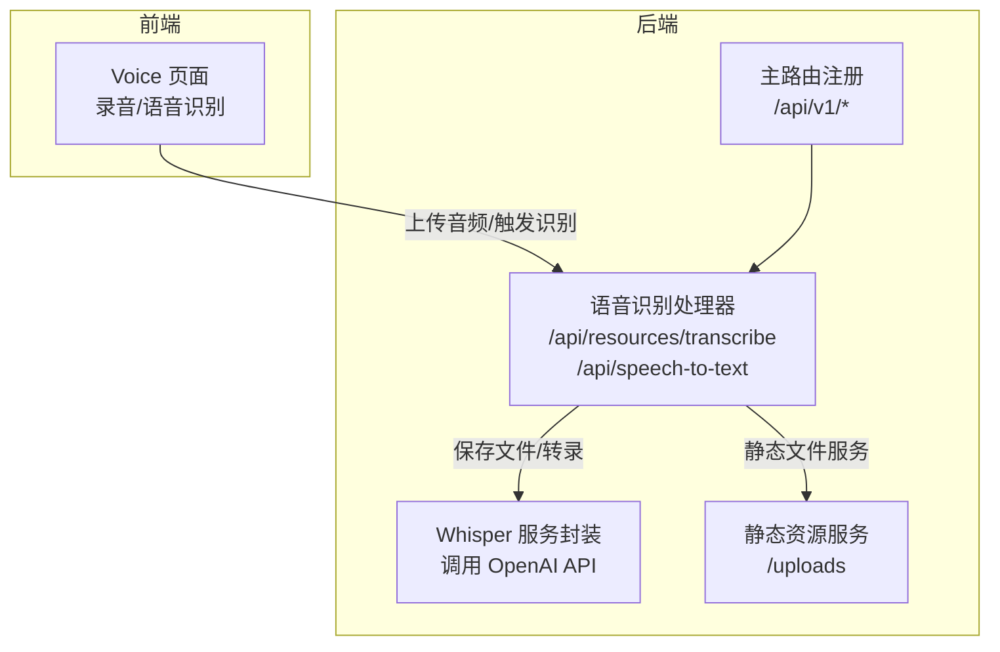
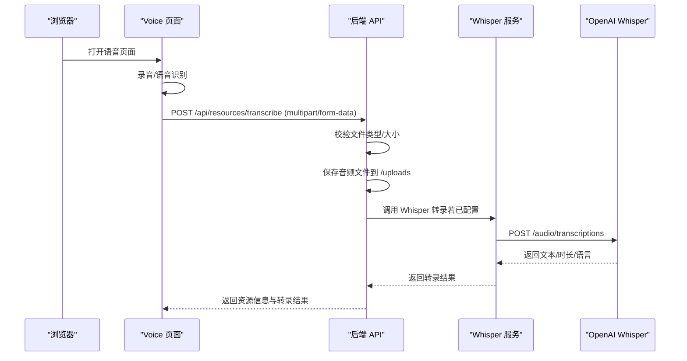
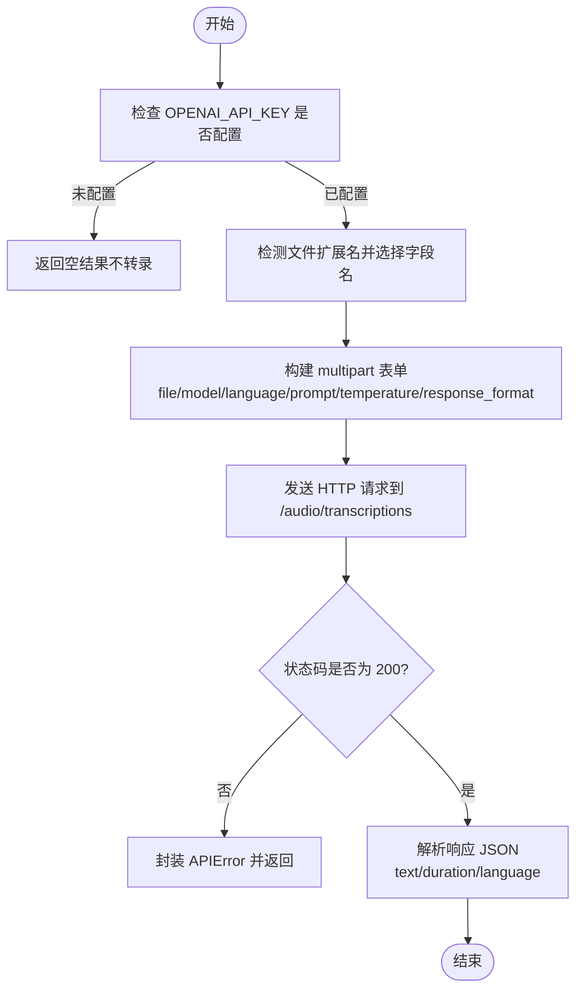
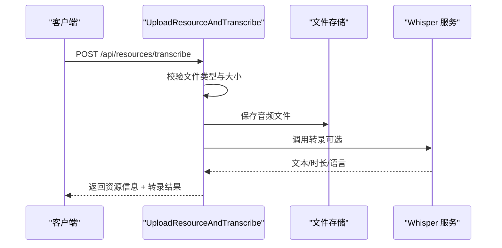
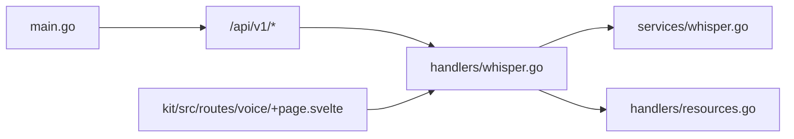

# 语音识别服务

<cite>
**本文引用的文件**
- [backend/services/whisper.go](file://backend/services/whisper.go)
- [backend/handlers/whisper.go](file://backend/handlers/whisper.go)
- [backend/main.go](file://backend/main.go)
- [kit/src/routes/voice/+page.svelte](file://kit/src/routes/voice/+page.svelte)
- [backend/handlers/resources.go](file://backend/handlers/resources.go)
- [docker-compose.yml](file://docker-compose.yml)
- [README.md](file://README.md)
- [.env.example](file://.env.example)
</cite>

## 目录
1. [简介](#简介)
2. [项目结构](#项目结构)
3. [核心组件](#核心组件)
4. [架构总览](#架构总览)
5. [详细组件分析](#详细组件分析)
6. [依赖关系分析](#依赖关系分析)
7. [性能考虑](#性能考虑)
8. [故障排除指南](#故障排除指南)
9. [结论](#结论)
10. [附录](#附录)

## 简介
本文件面向语音识别服务的技术文档，聚焦于基于 OpenAI Whisper 的语音转文本能力在 Memo Studio 中的集成与实现。内容涵盖：
- Whisper 模型的集成方式与调用流程
- 音频文件上传、格式校验、存储与转录
- 语音识别 API 的设计与实现细节
- 支持的音频格式、采样率与语言选项
- 性能优化策略（模型配置、批处理、内存管理等）
- 完整的 API 接口文档（端点、参数、响应、错误码）
- 实际应用场景与最佳实践
- 配置指南、部署建议、调优与故障排除

## 项目结构
语音识别相关的核心代码分布在后端服务层与前端界面层：
- 后端服务层：提供 Whisper 转录逻辑与 HTTP 接口
- 前端界面层：提供语音识别与录音入口，触发上传与转录

图表来源
- [backend/main.go](file://backend/main.go#L136-L141)
- [backend/handlers/whisper.go](file://backend/handlers/whisper.go#L32-L162)
- [backend/services/whisper.go](file://backend/services/whisper.go#L46-L138)

章节来源
- [backend/main.go](file://backend/main.go#L94-L196)
- [backend/handlers/whisper.go](file://backend/handlers/whisper.go#L32-L162)
- [backend/services/whisper.go](file://backend/services/whisper.go#L46-L138)

## 核心组件
- Whisper 服务封装：负责构建 multipart 表单、调用 OpenAI Whisper 接口、解析响应与错误处理
- 语音识别处理器：提供两个端点，分别支持“上传并转录”和“仅转录”
- 资源上传处理器：通用文件上传，用于保存音频文件
- 前端 Voice 页面：提供浏览器内语音识别与录音功能，录音文件上传至后端

章节来源
- [backend/services/whisper.go](file://backend/services/whisper.go#L17-L138)
- [backend/handlers/whisper.go](file://backend/handlers/whisper.go#L32-L162)
- [backend/handlers/resources.go](file://backend/handlers/resources.go#L92-L155)
- [kit/src/routes/voice/+page.svelte](file://kit/src/routes/voice/+page.svelte#L79-L134)

## 架构总览
后端通过 Gin 注册 API v1，其中包含语音识别与资源上传接口。前端 Voice 页面提供录音与语音识别入口，录音文件以 multipart/form-data 上传，后端根据配置决定是否调用 Whisper 进行转录。

图表来源
- [backend/main.go](file://backend/main.go#L136-L141)
- [backend/handlers/whisper.go](file://backend/handlers/whisper.go#L32-L104)
- [backend/services/whisper.go](file://backend/services/whisper.go#L46-L138)

## 详细组件分析

### Whisper 服务封装
- 配置项：API Key、基础 URL、模型、超时
- 请求构建：动态检测文件扩展名，选择合适的字段名（如 audio.mp3、audio.wav 等），构造 multipart 表单
- 参数传递：language、prompt、temperature、response_format（verbose_json）
- 响应解析：解析 text、duration、language 字段
- 错误处理：非 200 状态码时封装为 APIError

图表来源
- [backend/services/whisper.go](file://backend/services/whisper.go#L46-L138)

章节来源
- [backend/services/whisper.go](file://backend/services/whisper.go#L17-L138)

### 语音识别处理器
- UploadResourceAndTranscribe：上传音频并转录，成功后返回资源信息与转录结果
- SpeechToTextOnly：仅转录（不保存），若未配置 API Key 则返回提示信息

图表来源
- [backend/handlers/whisper.go](file://backend/handlers/whisper.go#L32-L104)

章节来源
- [backend/handlers/whisper.go](file://backend/handlers/whisper.go#L32-L162)

### 资源上传处理器
- UploadResource：通用文件上传，支持多部分表单，保存到指定存储目录，返回资源记录
- 与语音识别的关系：录音文件可先上传再转录，或直接走“上传并转录”流程

章节来源
- [backend/handlers/resources.go](file://backend/handlers/resources.go#L92-L155)

### 前端 Voice 页面
- 语音识别：使用浏览器原生 Web Speech API（在线模式）
- 录音：使用 MediaRecorder 录制音频（默认 webm），上传到后端
- 交互：上传成功后显示文件名，若后端未配置 Whisper，则提示资源页面查看

章节来源
- [kit/src/routes/voice/+page.svelte](file://kit/src/routes/voice/+page.svelte#L29-L134)

## 依赖关系分析
- 后端路由注册：主程序在 /api/v1 下注册语音识别与资源相关端点
- 处理器依赖：语音识别处理器依赖 Whisper 服务与资源上传逻辑
- 外部依赖：OpenAI Whisper API（需配置 API Key）

图表来源
- [backend/main.go](file://backend/main.go#L136-L141)
- [backend/handlers/whisper.go](file://backend/handlers/whisper.go#L32-L162)
- [backend/services/whisper.go](file://backend/services/whisper.go#L46-L138)
- [backend/handlers/resources.go](file://backend/handlers/resources.go#L92-L155)
- [kit/src/routes/voice/+page.svelte](file://kit/src/routes/voice/+page.svelte#L79-L134)

章节来源
- [backend/main.go](file://backend/main.go#L94-L196)
- [backend/handlers/whisper.go](file://backend/handlers/whisper.go#L32-L162)
- [backend/services/whisper.go](file://backend/services/whisper.go#L46-L138)
- [backend/handlers/resources.go](file://backend/handlers/resources.go#L92-L155)
- [kit/src/routes/voice/+page.svelte](file://kit/src/routes/voice/+page.svelte#L79-L134)

## 性能考虑
- 模型配置
  - 模型名称：可通过环境变量 WHISPER_MODEL 指定，默认 whisper-1
  - 基础 URL：可通过 OPENAI_BASE_URL 指定，默认 https://api.openai.com/v1
  - API Key：OPENAI_API_KEY 必填，否则后端不会发起转录请求
- 超时控制
  - 服务层与处理器均设置 60 秒超时，避免长时间阻塞
- 内存与 I/O
  - 上传文件大小限制为 20MB，防止过大请求导致内存压力
  - 采用流式写入与 SHA256 校验，降低重复存储风险
- 批处理与并发
  - 当前实现为单请求单转录，未见内置批处理队列
  - 建议在高并发场景引入队列与限流中间件，结合外部缓存减少重复转录
- 存储与静态服务
  - /uploads 静态服务指向 MEMO_STORAGE_DIR（默认 ./storage），容器部署建议挂载持久卷

章节来源
- [backend/services/whisper.go](file://backend/services/whisper.go#L39-L52)
- [backend/handlers/whisper.go](file://backend/handlers/whisper.go#L34-L36)
- [backend/handlers/resources.go](file://backend/handlers/resources.go#L36-L43)
- [docker-compose.yml](file://docker-compose.yml#L16-L16)

## 故障排除指南
- 未配置 API Key
  - 现象：/api/speech-to-text 返回 configured=false，提示设置 OPENAI_API_KEY
  - 处理：在环境变量中设置 OPENAI_API_KEY
- 上传文件类型不支持
  - 现象：返回错误提示仅支持特定音频格式
  - 处理：确认文件扩展名为 mp3、wav、m4a、ogg、webm、flac、mp4
- 上传文件过大
  - 现象：超过 20MB 限制
  - 处理：压缩音频或拆分片段
- Whisper API 返回错误
  - 现象：非 200 状态码，返回 APIError
  - 处理：检查 API Key、网络连通性、模型可用性
- 前端录音不可用
  - 现象：浏览器不支持 MediaRecorder 或权限被拒绝
  - 处理：更换浏览器或授予麦克风权限

章节来源
- [backend/handlers/whisper.go](file://backend/handlers/whisper.go#L134-L141)
- [backend/handlers/whisper.go](file://backend/handlers/whisper.go#L42-L44)
- [backend/handlers/whisper.go](file://backend/handlers/whisper.go#L34-L36)
- [backend/services/whisper.go](file://backend/services/whisper.go#L122-L125)
- [kit/src/routes/voice/+page.svelte](file://kit/src/routes/voice/+page.svelte#L81-L112)

## 结论
本语音识别服务以 OpenAI Whisper 为核心，通过后端处理器与服务封装实现了从音频上传到转录输出的完整链路。前端提供了便捷的录音与语音识别入口，配合后端的文件存储与转录能力，满足语音日记、会议记录、语音备忘录等典型场景。建议在生产环境中合理配置 API Key、存储路径与超时策略，并结合队列与缓存提升吞吐与稳定性。

## 附录

### 技术规格与支持范围
- 支持的音频格式：mp3、wav、m4a、ogg、webm、flac、mp4
- 语言选项：通过 language 参数传入（如 zh、en 等）
- 温度参数：temperature（0-2），用于控制生成多样性
- 响应格式：verbose_json，返回 text、duration、language

章节来源
- [backend/handlers/whisper.go](file://backend/handlers/whisper.go#L166-L175)
- [backend/services/whisper.go](file://backend/services/whisper.go#L25-L30)
- [backend/services/whisper.go](file://backend/services/whisper.go#L201-L221)

### API 接口文档

- 上传并转录
  - 方法与路径：POST /api/resources/transcribe
  - 请求体：multipart/form-data
    - file：必填，音频文件
    - language：可选，语言代码
    - prompt：可选，提示文本
    - temperature：可选，温度（0-2）
  - 成功响应：返回资源信息与转录结果
    - id、filename、storage_path、url、mime_type、size、transcript、duration、language、created_at
  - 失败响应：返回错误信息（如文件类型不支持、读取失败、保存失败等）

- 仅转录（不保存）
  - 方法与路径：POST /api/speech-to-text
  - 请求体：multipart/form-data
    - file：必填，音频文件
    - language：可选
    - prompt：可选
    - temperature：可选
  - 成功响应：
    - text、duration、language、configured=true
  - 未配置响应：
    - configured=false，message 提示设置 OPENAI_API_KEY

- 通用资源上传
  - 方法与路径：POST /api/resources
  - 请求体：multipart/form-data
    - file：必填
  - 成功响应：返回资源记录（含 id、filename、storage_path、url、mime_type、size、sha、created_at 等）

章节来源
- [backend/handlers/whisper.go](file://backend/handlers/whisper.go#L32-L162)
- [backend/handlers/resources.go](file://backend/handlers/resources.go#L92-L155)
- [backend/main.go](file://backend/main.go#L136-L141)

### 配置指南与部署建议
- 环境变量
  - OPENAI_API_KEY：必填，用于调用 Whisper
  - OPENAI_BASE_URL：可选，默认 https://api.openai.com/v1
  - WHISPER_MODEL：可选，默认 whisper-1
  - MEMO_STORAGE_DIR：可选，默认 ./storage（容器建议 /data/storage）
  - MEMO_CORS_ORIGINS：可选，生产环境建议显式配置
  - MEMO_JWT_SECRET：生产环境必须设置
- 容器部署
  - 使用 docker-compose.yml 挂载 /data，设置 MEMO_STORAGE_DIR=/data/storage
  - 建议在生产环境设置 MEMO_ENV=production 与 GIN_MODE=release

章节来源
- [README.md](file://README.md#L129-L144)
- [docker-compose.yml](file://docker-compose.yml#L16-L16)
- [backend/main.go](file://backend/main.go#L324-L329)
- [.env.example](file://.env.example#L4-L6)

### 使用场景与最佳实践
- 语音日记：录音后上传，自动转录为文本，保存为笔记
- 会议记录：录制会议音频，上传并转录，便于检索与摘要
- 语音备忘录：快速录音并转录，结合标签与搜索
- 最佳实践：
  - 在前端提供清晰的错误提示与回退方案（如浏览器不支持时的提示）
  - 对大文件进行压缩与拆分，避免超出上传限制
  - 在高并发场景引入队列与缓存，避免重复转录与 API 限流

章节来源
- [kit/src/routes/voice/+page.svelte](file://kit/src/routes/voice/+page.svelte#L231-L238)
- [backend/handlers/whisper.go](file://backend/handlers/whisper.go#L34-L36)