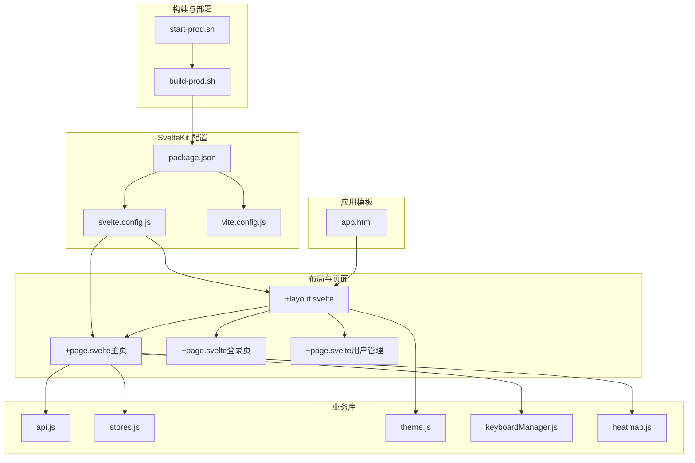
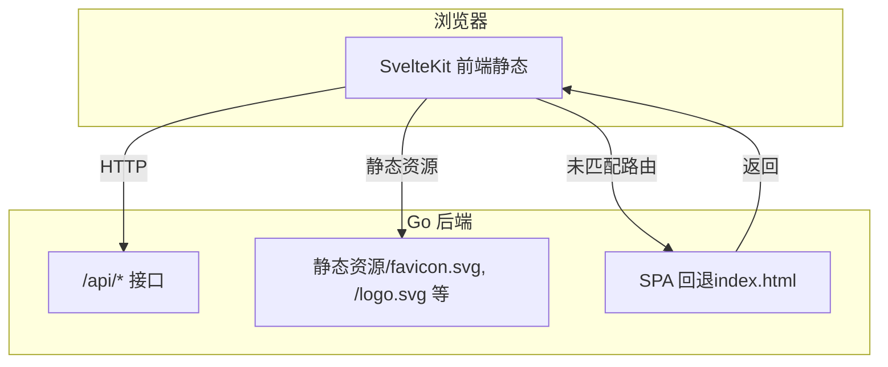
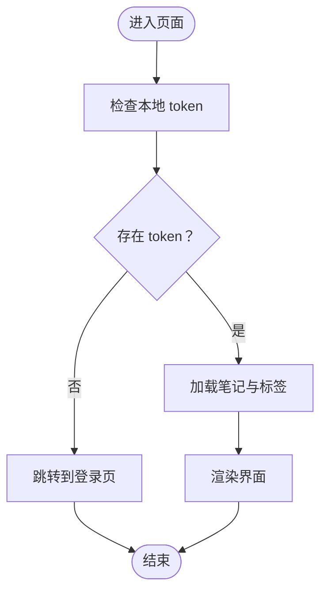
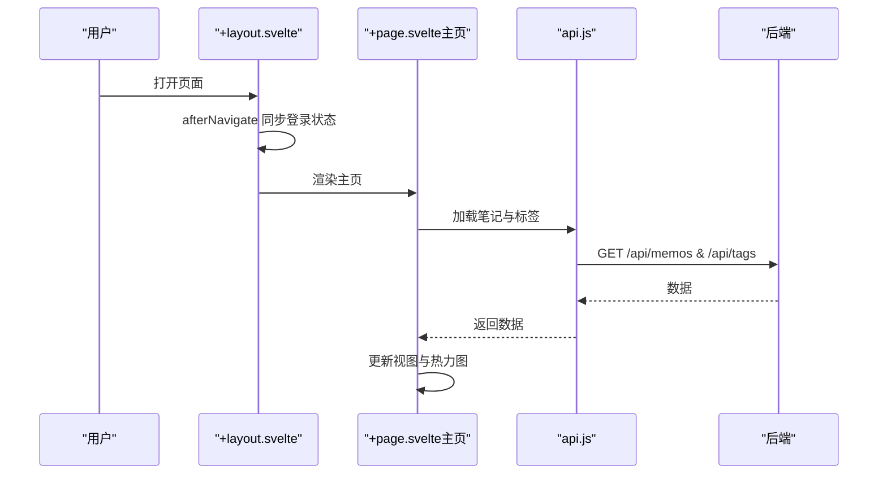
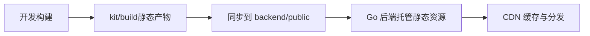
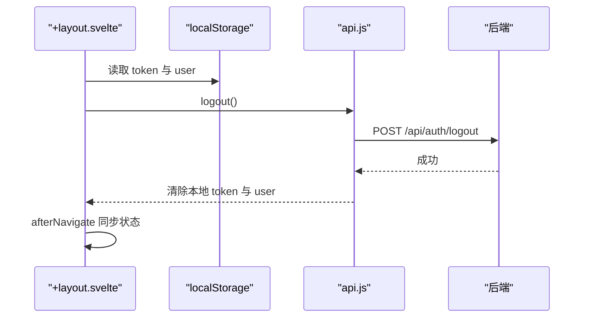
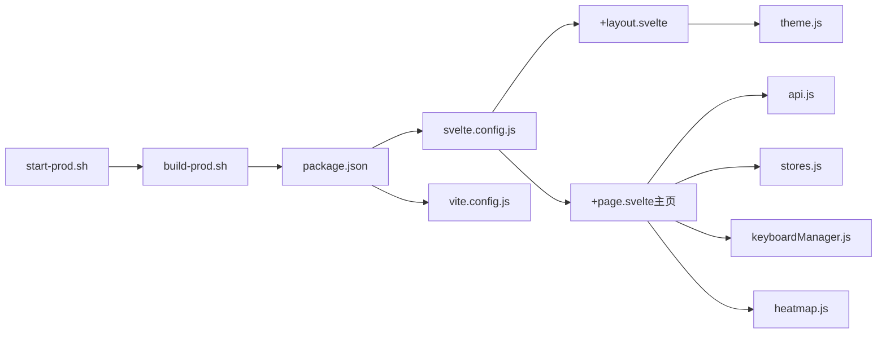

# SvelteKit 静态站点

<cite>
**本文引用的文件**
- [package.json](file://kit/package.json)
- [svelte.config.js](file://kit/svelte.config.js)
- [vite.config.js](file://kit/vite.config.js)
- [+page.svelte（主页）](file://kit/src/routes/+page.svelte)
- [+layout.svelte（布局）](file://kit/src/routes/+layout.svelte)
- [app.html（模板）](file://kit/src/app.html)
- [api.js（API 封装）](file://kit/src/lib/api.js)
- [stores.js（全局状态）](file://kit/src/lib/stores.js)
- [theme.js（主题）](file://kit/src/lib/theme.js)
- [keyboardManager.js（键盘管理）](file://kit/src/lib/keyboardManager.js)
- [heatmap.js（热力图）](file://kit/src/lib/heatmap.js)
- [+page.svelte（登录页）](file://kit/src/routes/login/+page.svelte)
- [+page.svelte（用户管理）](file://kit/src/routes/admin/users/+page.svelte)
- [build-prod.sh（构建脚本）](file://build-prod.sh)
- [start-prod.sh（启动脚本）](file://start-prod.sh)
</cite>

## 目录
1. [简介](#简介)
2. [项目结构](#项目结构)
3. [核心组件](#核心组件)
4. [架构总览](#架构总览)
5. [详细组件分析](#详细组件分析)
6. [依赖关系分析](#依赖关系分析)
7. [性能考量](#性能考量)
8. [故障排查指南](#故障排查指南)
9. [结论](#结论)
10. [附录](#附录)

## 简介
本文件面向 Memo Studio 的 SvelteKit 静态站点生成系统，系统采用 SvelteKit 作为前端框架，通过适配器输出纯静态站点，并结合 Go 后端提供 API 与静态资源托管。本文档覆盖以下主题：
- SvelteKit 配置与使用：静态生成、服务端渲染支持、SEO 优化策略
- 路由系统设计：页面路由定义、参数处理、导航逻辑
- 静态资源管理与优化：构建产物、资源压缩、缓存策略
- 与主应用集成：数据共享、状态同步、页面跳转
- 页面开发最佳实践：组件复用、样式管理、性能优化
- 部署策略与生产环境配置：构建流程、启动流程、容器化建议

## 项目结构
SvelteKit 静态站点位于 kit 目录，核心文件包括：
- 配置：svelte.config.js、vite.config.js、package.json
- 应用模板：src/app.html
- 布局与页面：src/routes/+layout.svelte、src/routes/+page.svelte 及各功能页面
- 业务库：src/lib 下的 API 封装、状态、主题、键盘管理、热力图等工具
- 构建与部署：build-prod.sh、start-prod.sh

**图表来源**
- [package.json](file://kit/package.json#L1-L20)
- [svelte.config.js](file://kit/svelte.config.js#L1-L22)
- [vite.config.js](file://kit/vite.config.js#L1-L16)
- [+layout.svelte](file://kit/src/routes/+layout.svelte#L1-L453)
- [+page.svelte（主页）](file://kit/src/routes/+page.svelte#L1-L1096)
- [+page.svelte（登录页）](file://kit/src/routes/login/+page.svelte#L1-L124)
- [+page.svelte（用户管理）](file://kit/src/routes/admin/users/+page.svelte#L1-L376)
- [app.html](file://kit/src/app.html#L1-L17)
- [api.js](file://kit/src/lib/api.js#L1-L271)
- [stores.js](file://kit/src/lib/stores.js#L1-L32)
- [theme.js](file://kit/src/lib/theme.js#L1-L25)
- [keyboardManager.js](file://kit/src/lib/keyboardManager.js#L1-L115)
- [heatmap.js](file://kit/src/lib/heatmap.js#L1-L38)
- [build-prod.sh](file://build-prod.sh#L1-L33)
- [start-prod.sh](file://start-prod.sh#L1-L63)

**章节来源**
- [package.json](file://kit/package.json#L1-L20)
- [svelte.config.js](file://kit/svelte.config.js#L1-L22)
- [vite.config.js](file://kit/vite.config.js#L1-L16)
- [+layout.svelte](file://kit/src/routes/+layout.svelte#L1-L453)
- [+page.svelte（主页）](file://kit/src/routes/+page.svelte#L1-L1096)
- [app.html](file://kit/src/app.html#L1-L17)
- [build-prod.sh](file://build-prod.sh#L1-L33)
- [start-prod.sh](file://start-prod.sh#L1-L63)

## 核心组件
- 静态生成与适配器：使用 @sveltejs/adapter-static 输出纯静态站点，并提供 SPA 回退（fallback: index.html），便于 Go 侧对未匹配路由进行回退。
- 路由系统：基于约定式路由，页面文件名以 +page.svelte 表示页面，+layout.svelte 提供全局布局与导航。
- API 封装：统一的 API 访问层，自动注入 Authorization 头，集中错误处理。
- 全局状态：基于 Svelte Writable Store 的 notes、tags、toast 状态管理。
- 主题系统：基于 localStorage 的主题持久化与 DOM 属性切换。
- 键盘管理：上下文感知的快捷键注册与分发，支持修饰键组合。
- 热力图：按日期聚合笔记数量，生成可视化热力图。

**章节来源**
- [svelte.config.js](file://kit/svelte.config.js#L1-L22)
- [+layout.svelte](file://kit/src/routes/+layout.svelte#L1-L453)
- [api.js](file://kit/src/lib/api.js#L1-L271)
- [stores.js](file://kit/src/lib/stores.js#L1-L32)
- [theme.js](file://kit/src/lib/theme.js#L1-L25)
- [keyboardManager.js](file://kit/src/lib/keyboardManager.js#L1-L115)
- [heatmap.js](file://kit/src/lib/heatmap.js#L1-L38)

## 架构总览
SvelteKit 静态站点通过适配器生成静态产物，Go 后端负责：
- 提供 REST API（/api 前缀）
- 托管静态资源（/favicon.svg、/logo.svg 等）
- 对未匹配路由回退到 index.html，实现 SPA 导航

**图表来源**
- [svelte.config.js](file://kit/svelte.config.js#L12-L17)
- [vite.config.js](file://kit/vite.config.js#L8-L14)
- [app.html](file://kit/src/app.html#L1-L17)

**章节来源**
- [svelte.config.js](file://kit/svelte.config.js#L1-L22)
- [vite.config.js](file://kit/vite.config.js#L1-L16)
- [app.html](file://kit/src/app.html#L1-L17)

## 详细组件分析

### 静态生成与 SEO 优化
- 静态生成：通过 adapter-static 输出纯静态站点，适合 CDN 分发与边缘加速。
- SPA 回退：fallback: index.html 保证前端路由在后端回退时仍可工作。
- SEO 元信息：app.html 中设置描述与图标，配合后端返回的 index.html 提升搜索引擎可见性。
- 开发代理：vite.config.js 配置 /api 代理至后端，便于开发调试。

**图表来源**
- [+page.svelte（主页）](file://kit/src/routes/+page.svelte#L267-L292)
- [api.js](file://kit/src/lib/api.js#L1-L33)

**章节来源**
- [svelte.config.js](file://kit/svelte.config.js#L12-L17)
- [app.html](file://kit/src/app.html#L6-L11)
- [vite.config.js](file://kit/vite.config.js#L8-L14)
- [+page.svelte（主页）](file://kit/src/routes/+page.svelte#L267-L292)

### 路由系统设计
- 全局布局：+layout.svelte 提供导航栏、主题切换、登录状态同步与侧边菜单。
- 主页：+page.svelte 实现笔记创作、搜索、编辑、删除、图片上传、快捷键等功能。
- 登录页：+page.svelte（登录页）负责认证与跳转。
- 用户管理：+page.svelte（用户管理）提供管理员用户 CRUD。

**图表来源**
- [+layout.svelte](file://kit/src/routes/+layout.svelte#L37-L40)
- [+page.svelte（主页）](file://kit/src/routes/+page.svelte#L48-L64)
- [api.js](file://kit/src/lib/api.js#L83-L128)

**章节来源**
- [+layout.svelte](file://kit/src/routes/+layout.svelte#L1-L453)
- [+page.svelte（主页）](file://kit/src/routes/+page.svelte#L1-L1096)
- [+page.svelte（登录页）](file://kit/src/routes/login/+page.svelte#L1-L124)
- [+page.svelte（用户管理）](file://kit/src/routes/admin/users/+page.svelte#L1-L376)

### 静态资源管理与优化
- 构建产物：kit/build/_app/ 下包含入口、节点与版本信息，适配器输出至 kit/build。
- 资源同步：build-prod.sh 将 kit/build 同步到 backend/public，供 Go 后端托管。
- 缓存策略：生产环境建议通过 CDN 与后端设置合适的 Cache-Control 与 ETag。
- 资源压缩：Vite 默认启用代码分割与压缩，适配器输出静态文件。

**图表来源**
- [build-prod.sh](file://build-prod.sh#L17-L24)

**章节来源**
- [build-prod.sh](file://build-prod.sh#L1-L33)

### 与主应用集成
- 数据共享：前端通过 api.js 统一访问 /api/*，后端返回 JSON 数据。
- 状态同步：+layout.svelte 在 afterNavigate 中同步 localStorage，确保多标签页状态一致。
- 页面跳转：$app/navigation 的 goto 用于前端路由跳转；登录失败或未登录时跳转到 /login。

**图表来源**
- [+layout.svelte](file://kit/src/routes/+layout.svelte#L42-L45)
- [api.js](file://kit/src/lib/api.js#L42-L49)

**章节来源**
- [+layout.svelte](file://kit/src/routes/+layout.svelte#L20-L45)
- [api.js](file://kit/src/lib/api.js#L42-L49)

### 页面开发最佳实践
- 组件复用：将通用 UI 抽象为独立组件（如 Toast、LoadingState、KeyboardHelp、SearchBar），在多个页面复用。
- 样式管理：使用 CSS 变量与主题 store 控制明暗主题，减少重复样式。
- 性能优化：使用防抖搜索、乐观更新、草稿本地存储、图片上传进度提示，提升交互体验。
- 键盘快捷键：keyboardManager.js 提供上下文感知的快捷键注册，支持修饰键组合。

**章节来源**
- [+page.svelte（主页）](file://kit/src/routes/+page.svelte#L10-L13)
- [keyboardManager.js](file://kit/src/lib/keyboardManager.js#L1-L115)
- [theme.js](file://kit/src/lib/theme.js#L1-L25)

## 依赖关系分析
- 配置依赖：package.json 定义构建脚本与依赖；svelte.config.js 与 vite.config.js 决定编译与适配器行为。
- 运行时依赖：+layout.svelte 依赖 theme.js、api.js；+page.svelte 依赖 api.js、stores.js、keyboardManager.js、heatmap.js。
- 构建与部署：build-prod.sh 串联 npm install 与 npm run build，再同步到 backend/public；start-prod.sh 启动 Go 服务并打开浏览器。

**图表来源**
- [package.json](file://kit/package.json#L1-L20)
- [svelte.config.js](file://kit/svelte.config.js#L1-L22)
- [vite.config.js](file://kit/vite.config.js#L1-L16)
- [+layout.svelte](file://kit/src/routes/+layout.svelte#L1-L453)
- [+page.svelte（主页）](file://kit/src/routes/+page.svelte#L1-L1096)
- [api.js](file://kit/src/lib/api.js#L1-L271)
- [stores.js](file://kit/src/lib/stores.js#L1-L32)
- [theme.js](file://kit/src/lib/theme.js#L1-L25)
- [keyboardManager.js](file://kit/src/lib/keyboardManager.js#L1-L115)
- [heatmap.js](file://kit/src/lib/heatmap.js#L1-L38)
- [build-prod.sh](file://build-prod.sh#L1-L33)
- [start-prod.sh](file://start-prod.sh#L1-L63)

**章节来源**
- [package.json](file://kit/package.json#L1-L20)
- [svelte.config.js](file://kit/svelte.config.js#L1-L22)
- [vite.config.js](file://kit/vite.config.js#L1-L16)
- [+layout.svelte](file://kit/src/routes/+layout.svelte#L1-L453)
- [+page.svelte（主页）](file://kit/src/routes/+page.svelte#L1-L1096)
- [api.js](file://kit/src/lib/api.js#L1-L271)
- [stores.js](file://kit/src/lib/stores.js#L1-L32)
- [theme.js](file://kit/src/lib/theme.js#L1-L25)
- [keyboardManager.js](file://kit/src/lib/keyboardManager.js#L1-L115)
- [heatmap.js](file://kit/src/lib/heatmap.js#L1-L38)
- [build-prod.sh](file://build-prod.sh#L1-L33)
- [start-prod.sh](file://start-prod.sh#L1-L63)

## 性能考量
- 代码分割：Vite 与 SvelteKit 自动进行代码分割，减少首屏体积。
- 本地存储：草稿与主题持久化减少网络请求与重绘。
- 乐观更新：提交笔记时先插入临时条目，提升感知速度。
- 防抖搜索：300ms 防抖降低请求频率。
- 缓存策略：建议在 CDN 与后端设置合理的缓存头，静态资源可长期缓存。

## 故障排查指南
- 未登录跳转：主页 onMount 检查 token，不存在则跳转 /login。
- 登录失败：登录页捕获异常并显示错误信息。
- 网络错误：api.js 统一处理非 2xx 响应，抛出可读错误。
- 主题不同步：+layout.svelte 使用 afterNavigate 与 storage 事件同步主题。
- 键盘冲突：keyboardManager.js 区分上下文与输入框，避免干扰原生行为。

**章节来源**
- [+page.svelte（主页）](file://kit/src/routes/+page.svelte#L267-L292)
- [+page.svelte（登录页）](file://kit/src/routes/login/+page.svelte#L31-L36)
- [api.js](file://kit/src/lib/api.js#L28-L33)
- [+layout.svelte](file://kit/src/routes/+layout.svelte#L37-L40)
- [keyboardManager.js](file://kit/src/lib/keyboardManager.js#L32-L75)

## 结论
SvelteKit 静态站点通过适配器与 Go 后端协作，实现了高性能、易部署的前端体验。其路由清晰、状态管理简洁、主题与快捷键体系完善，结合构建与部署脚本，能够稳定地服务于 Memo Studio 的主应用。建议在生产环境中进一步完善 CDN 缓存策略与监控告警，持续优化首屏性能与可访问性。

## 附录
- 构建与启动流程：build-prod.sh 负责前端构建与产物同步，start-prod.sh 负责后端启动与健康检查。
- 代理配置：开发时通过 vite.config.js 将 /api 代理到后端，避免跨域问题。
- SEO 建议：可在 app.html 中补充 Open Graph、Twitter Card 等元信息，提升分享体验。

**章节来源**
- [build-prod.sh](file://build-prod.sh#L1-L33)
- [start-prod.sh](file://start-prod.sh#L1-L63)
- [vite.config.js](file://kit/vite.config.js#L6-L14)
- [app.html](file://kit/src/app.html#L6-L11)