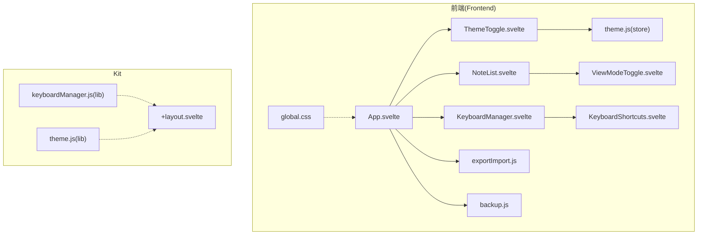
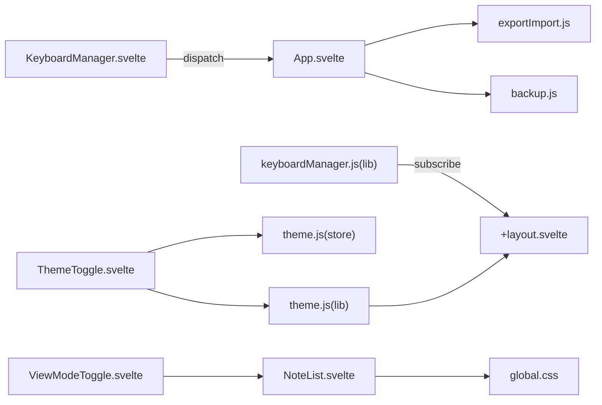
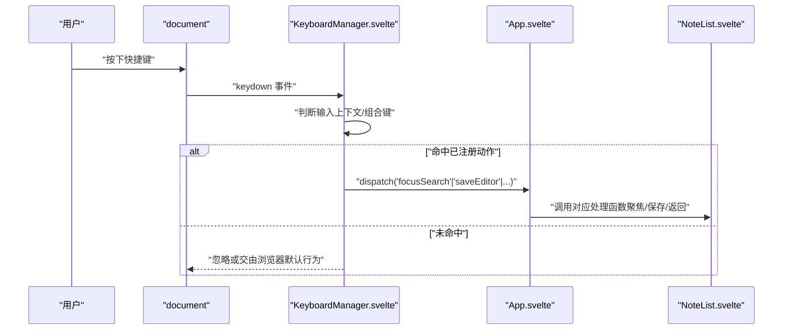
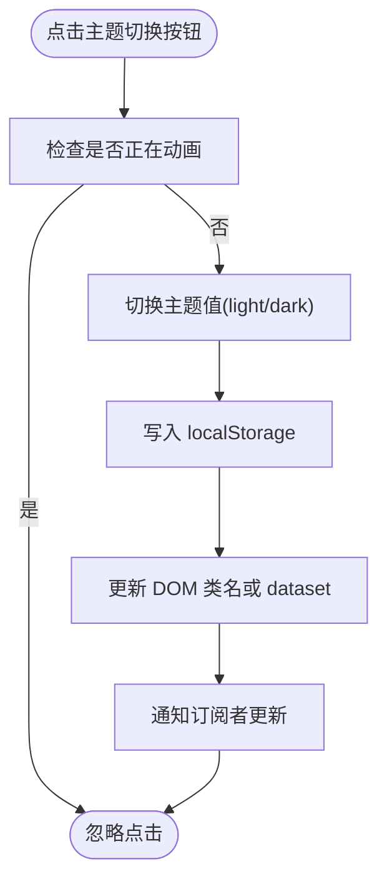
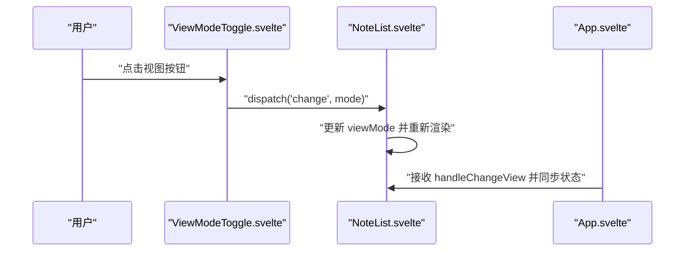
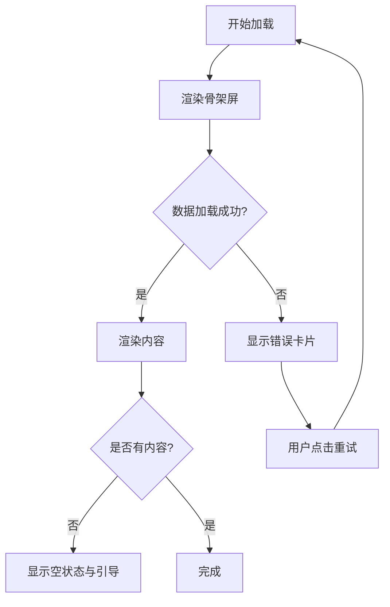
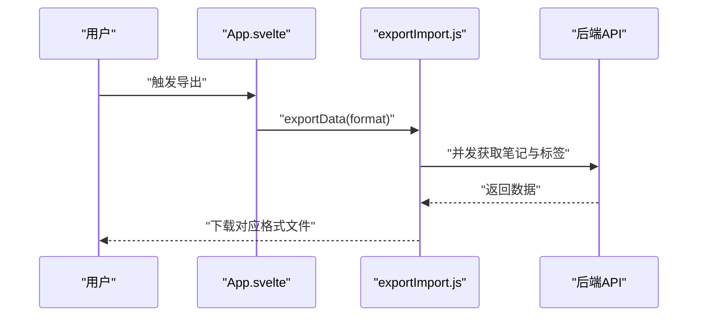
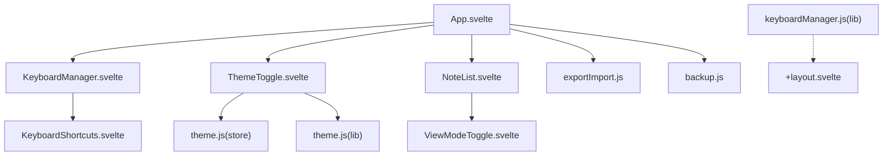

# UI 交互与体验

<cite>
**本文引用的文件**
- [frontend/src/components/KeyboardManager.svelte](file://frontend/src/components/KeyboardManager.svelte)
- [frontend/src/components/KeyboardShortcuts.svelte](file://frontend/src/components/KeyboardShortcuts.svelte)
- [kit/src/lib/keyboardManager.js](file://kit/src/lib/keyboardManager.js)
- [frontend/src/components/ThemeToggle.svelte](file://frontend/src/components/ThemeToggle.svelte)
- [frontend/src/stores/theme.js](file://frontend/src/stores/theme.js)
- [kit/src/lib/theme.js](file://kit/src/lib/theme.js)
- [frontend/src/components/ViewModeToggle.svelte](file://frontend/src/components/ViewModeToggle.svelte)
- [frontend/src/App.svelte](file://frontend/src/App.svelte)
- [frontend/src/components/NoteList.svelte](file://frontend/src/components/NoteList.svelte)
- [frontend/src/styles/global.css](file://frontend/src/styles/global.css)
- [frontend/src/utils/exportImport.js](file://frontend/src/utils/exportImport.js)
- [frontend/src/utils/backup.js](file://frontend/src/utils/backup.js)
- [kit/src/routes/+layout.svelte](file://kit/src/routes/+layout.svelte)
- [frontend/package.json](file://frontend/package.json)
</cite>

## 目录
1. [简介](#简介)
2. [项目结构](#项目结构)
3. [核心组件](#核心组件)
4. [架构总览](#架构总览)
5. [详细组件分析](#详细组件分析)
6. [依赖关系分析](#依赖关系分析)
7. [性能考量](#性能考量)
8. [故障排查指南](#故障排查指南)
9. [结论](#结论)
10. [附录](#附录)

## 简介
本文件面向 Memo Studio 的前端与 Kit 两套 UI 体系，系统化梳理其交互与用户体验设计，覆盖以下主题：
- 键盘快捷键管理与事件处理流程
- 主题切换与 CSS 变量系统、动画效果
- 视图模式切换与响应式布局、移动端优化
- 用户反馈机制、加载状态与错误提示
- 交互设计规范、可用性测试方法与性能优化建议

## 项目结构
前端采用 Svelte 5 + TailwindCSS 架构；Kit 采用 SvelteKit（基于 Svelte 5）路由层。两者共享部分通用能力（如键盘管理、主题、导出导入、草稿与备份），并在各自入口组件中完成事件绑定与视图编排。

图表来源
- [frontend/src/App.svelte](file://frontend/src/App.svelte#L226-L241)
- [frontend/src/components/KeyboardManager.svelte](file://frontend/src/components/KeyboardManager.svelte#L1-L206)
- [frontend/src/components/KeyboardShortcuts.svelte](file://frontend/src/components/KeyboardShortcuts.svelte#L1-L197)
- [frontend/src/components/ThemeToggle.svelte](file://frontend/src/components/ThemeToggle.svelte#L1-L63)
- [frontend/src/stores/theme.js](file://frontend/src/stores/theme.js#L1-L40)
- [frontend/src/components/ViewModeToggle.svelte](file://frontend/src/components/ViewModeToggle.svelte#L1-L50)
- [frontend/src/components/NoteList.svelte](file://frontend/src/components/NoteList.svelte#L1-L507)
- [frontend/src/styles/global.css](file://frontend/src/styles/global.css#L1-L185)
- [frontend/src/utils/exportImport.js](file://frontend/src/utils/exportImport.js#L1-L321)
- [frontend/src/utils/backup.js](file://frontend/src/utils/backup.js#L1-L223)
- [kit/src/lib/keyboardManager.js](file://kit/src/lib/keyboardManager.js#L1-L115)
- [kit/src/routes/+layout.svelte](file://kit/src/routes/+layout.svelte#L1-L453)
- [kit/src/lib/theme.js](file://kit/src/lib/theme.js#L1-L25)

章节来源
- [frontend/src/App.svelte](file://frontend/src/App.svelte#L1-L328)
- [frontend/src/styles/global.css](file://frontend/src/styles/global.css#L1-L185)
- [frontend/package.json](file://frontend/package.json#L1-L25)

## 核心组件
- 键盘管理器：负责全局快捷键捕获、上下文区分、处理器注册与执行、默认快捷键定义与格式化。
- 主题切换：提供主题切换按钮、主题存储与持久化、CSS 变量驱动的主题渲染。
- 视图模式切换：提供瀑布流/时间线视图切换，并在移动端与桌面端进行差异化展示。
- 列表与反馈：提供加载骨架、错误提示、空状态与批量操作反馈。
- 导出导入与草稿备份：提供多格式导出、导入解析与本地草稿/备份持久化。

章节来源
- [frontend/src/components/KeyboardManager.svelte](file://frontend/src/components/KeyboardManager.svelte#L1-L206)
- [kit/src/lib/keyboardManager.js](file://kit/src/lib/keyboardManager.js#L1-L115)
- [frontend/src/components/ThemeToggle.svelte](file://frontend/src/components/ThemeToggle.svelte#L1-L63)
- [frontend/src/stores/theme.js](file://frontend/src/stores/theme.js#L1-L40)
- [kit/src/lib/theme.js](file://kit/src/lib/theme.js#L1-L25)
- [frontend/src/components/ViewModeToggle.svelte](file://frontend/src/components/ViewModeToggle.svelte#L1-L50)
- [frontend/src/components/NoteList.svelte](file://frontend/src/components/NoteList.svelte#L1-L507)
- [frontend/src/utils/exportImport.js](file://frontend/src/utils/exportImport.js#L1-L321)
- [frontend/src/utils/backup.js](file://frontend/src/utils/backup.js#L1-L223)

## 架构总览
前端与 Kit 在“键盘”“主题”“视图”“反馈”四个维度协同工作：
- 键盘：前端以组件事件驱动为主，Kit 提供可复用的键盘管理库；二者通过各自的快捷键定义与事件分发形成互补。
- 主题：前端使用自定义 store 与 localStorage，Kit 使用 SvelteKit writable store 与 dataset 标记；二者均通过 CSS 变量与类名切换实现主题切换。
- 视图：前端提供视图切换按钮与列表组件，Kit 提供布局级样式与移动端断点；二者共同实现响应式布局。
- 反馈：前端统一使用 Tailwind 动画类与语义化提示，Kit 提供移动端专用动画与断点样式。

图表来源
- [frontend/src/components/KeyboardManager.svelte](file://frontend/src/components/KeyboardManager.svelte#L1-L206)
- [frontend/src/App.svelte](file://frontend/src/App.svelte#L226-L241)
- [kit/src/lib/keyboardManager.js](file://kit/src/lib/keyboardManager.js#L1-L115)
- [kit/src/routes/+layout.svelte](file://kit/src/routes/+layout.svelte#L1-L453)
- [frontend/src/components/ThemeToggle.svelte](file://frontend/src/components/ThemeToggle.svelte#L1-L63)
- [frontend/src/stores/theme.js](file://frontend/src/stores/theme.js#L1-L40)
- [kit/src/lib/theme.js](file://kit/src/lib/theme.js#L1-L25)
- [frontend/src/components/ViewModeToggle.svelte](file://frontend/src/components/ViewModeToggle.svelte#L1-L50)
- [frontend/src/components/NoteList.svelte](file://frontend/src/components/NoteList.svelte#L1-L507)
- [frontend/src/styles/global.css](file://frontend/src/styles/global.css#L1-L185)
- [frontend/src/utils/exportImport.js](file://frontend/src/utils/exportImport.js#L1-L321)
- [frontend/src/utils/backup.js](file://frontend/src/utils/backup.js#L1-L223)

## 详细组件分析

### 键盘快捷键管理
- 事件捕获与上下文
  - 前端组件在挂载时监听 document 的 keydown/focusin/focusout，根据目标元素类型与焦点状态决定是否忽略快捷键。
  - 支持组合键（Ctrl/Cmd/Shift/Alt）与方向键、字母、功能键等。
  - 通过事件分发向父组件传递动作（如聚焦搜索、保存、导航、视图切换等）。
- 快捷键帮助
  - 提供快捷键帮助弹窗，支持分类与关键词搜索，ESC 关闭。
- Kit 键盘管理库
  - 提供可订阅的状态（当前上下文、帮助面板显隐），支持按上下文注册/注销处理器。
  - 默认快捷键集合与跨平台修饰键格式化（如 Mac 的 ⌘/⇧/⌥）。

图表来源
- [frontend/src/components/KeyboardManager.svelte](file://frontend/src/components/KeyboardManager.svelte#L16-L143)
- [frontend/src/App.svelte](file://frontend/src/App.svelte#L110-L220)

章节来源
- [frontend/src/components/KeyboardManager.svelte](file://frontend/src/components/KeyboardManager.svelte#L1-L206)
- [frontend/src/components/KeyboardShortcuts.svelte](file://frontend/src/components/KeyboardShortcuts.svelte#L1-L197)
- [kit/src/lib/keyboardManager.js](file://kit/src/lib/keyboardManager.js#L1-L115)

### 主题切换与 CSS 变量系统
- 前端主题
  - 使用自定义 store 与 localStorage，首次加载时从本地恢复主题，并在 DOM 上添加/移除 dark 类名。
  - 切换按钮带动画旋转，防止重复点击。
- Kit 主题
  - 使用 SvelteKit writable store 与 dataset 主题标记，结合 localStorage 与系统偏好，实现主题切换与持久化。
- CSS 变量与动画
  - CSS 变量在 :root 与 .dark 中定义，配合 Tailwind 动画类实现统一的过渡与反馈。

图表来源
- [frontend/src/components/ThemeToggle.svelte](file://frontend/src/components/ThemeToggle.svelte#L6-L11)
- [frontend/src/stores/theme.js](file://frontend/src/stores/theme.js#L23-L35)
- [kit/src/lib/theme.js](file://kit/src/lib/theme.js#L15-L23)
- [frontend/src/styles/global.css](file://frontend/src/styles/global.css#L6-L61)

章节来源
- [frontend/src/components/ThemeToggle.svelte](file://frontend/src/components/ThemeToggle.svelte#L1-L63)
- [frontend/src/stores/theme.js](file://frontend/src/stores/theme.js#L1-L40)
- [kit/src/lib/theme.js](file://kit/src/lib/theme.js#L1-L25)
- [frontend/src/styles/global.css](file://frontend/src/styles/global.css#L1-L185)

### 视图模式切换与响应式布局
- 视图切换
  - 前端提供视图切换按钮，派发 change 事件；父组件接收后更新视图模式。
  - 列表组件根据模式渲染时间线或瀑布流布局，并在移动端隐藏文字、仅保留图标。
- 响应式与移动端优化
  - 侧边栏在移动端默认折叠，支持遮罩层与 ESC 关闭；顶部工具条在小屏下简化为图标按钮。
  - Kit 布局包含移动端断点与动画，保证在不同设备上的可读性与可操作性。

图表来源
- [frontend/src/components/ViewModeToggle.svelte](file://frontend/src/components/ViewModeToggle.svelte#L8-L11)
- [frontend/src/components/NoteList.svelte](file://frontend/src/components/NoteList.svelte#L123-L125)
- [frontend/src/App.svelte](file://frontend/src/App.svelte#L177-L179)

章节来源
- [frontend/src/components/ViewModeToggle.svelte](file://frontend/src/components/ViewModeToggle.svelte#L1-L50)
- [frontend/src/components/NoteList.svelte](file://frontend/src/components/NoteList.svelte#L1-L507)
- [kit/src/routes/+layout.svelte](file://kit/src/routes/+layout.svelte#L299-L390)

### 用户反馈机制与加载/错误状态
- 加载状态：使用 Tailwind 动画类与占位骨架，分组渐进出现，提升感知速度。
- 错误状态：统一的错误卡片与重试按钮，避免页面空白。
- 空状态：动态插图与引导提示，结合快捷键提示，降低学习成本。
- 批量操作：多选与批量删除，提供明确的计数与确认流程。

图表来源
- [frontend/src/components/NoteList.svelte](file://frontend/src/components/NoteList.svelte#L340-L412)

章节来源
- [frontend/src/components/NoteList.svelte](file://frontend/src/components/NoteList.svelte#L340-L412)

### 导出导入与草稿备份
- 导出
  - 支持 Markdown、HTML、纯文本、CSV、JSON 多格式；异步并发拉取笔记与标签，统一下载。
- 导入
  - 支持 JSON、Markdown、TXT；解析为标准结构后逐条创建笔记。
- 草稿与备份
  - 定时自动保存草稿，限制数量；提供本地备份列表与删除、导出、导入备份的能力。

图表来源
- [frontend/src/utils/exportImport.js](file://frontend/src/utils/exportImport.js#L180-L246)
- [frontend/src/App.svelte](file://frontend/src/App.svelte#L196-L219)

章节来源
- [frontend/src/utils/exportImport.js](file://frontend/src/utils/exportImport.js#L1-L321)
- [frontend/src/utils/backup.js](file://frontend/src/utils/backup.js#L1-L223)
- [frontend/src/App.svelte](file://frontend/src/App.svelte#L196-L219)

## 依赖关系分析
- 组件耦合
  - App.svelte 作为顶层容器，聚合键盘、主题、视图、列表等子组件，承担事件桥接职责。
  - NoteList.svelte 与视图切换组件松耦合，通过事件与属性传递实现模式切换。
- 外部依赖
  - TailwindCSS 提供原子化样式与动画类；SvelteKit 提供路由与环境变量。
  - 本地存储用于主题与草稿持久化；浏览器下载 API 用于导出。

图表来源
- [frontend/src/App.svelte](file://frontend/src/App.svelte#L1-L328)
- [frontend/src/components/NoteList.svelte](file://frontend/src/components/NoteList.svelte#L1-L507)
- [frontend/src/components/ThemeToggle.svelte](file://frontend/src/components/ThemeToggle.svelte#L1-L63)
- [frontend/src/stores/theme.js](file://frontend/src/stores/theme.js#L1-L40)
- [kit/src/lib/theme.js](file://kit/src/lib/theme.js#L1-L25)
- [frontend/src/components/KeyboardManager.svelte](file://frontend/src/components/KeyboardManager.svelte#L1-L206)
- [frontend/src/components/KeyboardShortcuts.svelte](file://frontend/src/components/KeyboardShortcuts.svelte#L1-L197)
- [kit/src/lib/keyboardManager.js](file://kit/src/lib/keyboardManager.js#L1-L115)
- [kit/src/routes/+layout.svelte](file://kit/src/routes/+layout.svelte#L1-L453)

章节来源
- [frontend/package.json](file://frontend/package.json#L1-L25)

## 性能考量
- 事件处理
  - 键盘事件在 document 级监听，注意避免重复绑定与内存泄漏；前端组件在卸载时正确移除监听。
- 渲染优化
  - 列表渲染使用分组与延迟动画，减少首屏阻塞；空状态与骨架屏缩短感知等待。
- 存储与网络
  - 导出/导入采用并发请求与本地下载，避免主线程阻塞；草稿定时保存间隔合理设置，兼顾实时性与性能。
- 主题切换
  - 通过 CSS 变量与类名切换实现，避免重排与重绘；Kit 方案使用 dataset，减少 DOM 属性污染。

## 故障排查指南
- 快捷键无效
  - 检查焦点状态：输入框内快捷键通常被忽略，除非允许组合键（如 Ctrl/Cmd+S）。
  - 确认事件链路：前端组件是否正确分发事件到 App.svelte；Kit 键盘库是否处于启用状态。
- 主题不生效
  - 前端：确认 localStorage 是否写入成功，DOM 是否存在 dark 类名。
  - Kit：确认 dataset.theme 是否更新，localStorage 是否保存。
- 视图切换异常
  - 检查事件是否传递到 NoteList；确认视图模式状态是否同步到 App.svelte。
- 导出/导入失败
  - 查看并发请求是否成功；确认文件格式与解析逻辑；捕获并提示错误信息。
- 草稿丢失
  - 检查定时器是否被清理；确认本地存储键名一致；必要时手动清理过期草稿。

章节来源
- [frontend/src/components/KeyboardManager.svelte](file://frontend/src/components/KeyboardManager.svelte#L154-L188)
- [frontend/src/stores/theme.js](file://frontend/src/stores/theme.js#L23-L35)
- [kit/src/lib/theme.js](file://kit/src/lib/theme.js#L15-L23)
- [frontend/src/components/NoteList.svelte](file://frontend/src/components/NoteList.svelte#L123-L125)
- [frontend/src/utils/exportImport.js](file://frontend/src/utils/exportImport.js#L180-L246)
- [frontend/src/utils/backup.js](file://frontend/src/utils/backup.js#L70-L91)

## 结论
Memo Studio 的 UI 交互围绕“键盘优先、主题一致、视图灵活、反馈即时”的原则构建。前端与 Kit 在关键能力上互补：前者强调交互细节与本地体验，后者强调路由与跨端一致性。通过 CSS 变量与动画类统一风格，通过事件与 store 解耦组件，整体具备良好的可维护性与扩展性。

## 附录
- 交互设计规范
  - 键盘：优先使用组合键，避免与浏览器/系统快捷键冲突；提供帮助面板与搜索。
  - 主题：保持明暗对比度与无障碍可达；切换时提供视觉反馈。
  - 视图：移动端优先考虑触摸可达性与信息密度；桌面端提供更丰富的操作。
  - 反馈：加载/错误/空状态三态清晰；批量操作提供确认与撤销路径。
- 可用性测试方法
  - 键盘导航测试：仅使用键盘完成核心任务（新建、编辑、删除、切换视图）。
  - 主题测试：在明/暗主题下检查对比度、可读性与颜色一致性。
  - 响应式测试：在多种屏幕尺寸与横竖屏下验证布局与交互。
  - 离线测试：模拟网络异常，验证草稿与备份的可用性。
- 性能优化建议
  - 合理拆分与懒加载：将重型组件按需加载；减少初始包体积。
  - 事件节流与去抖：对高频事件（滚动、窗口大小变化）进行节流。
  - 图片与资源：压缩与懒加载，使用现代格式（WebP）与合适的尺寸。
  - 缓存策略：利用浏览器缓存与本地存储，减少重复请求。