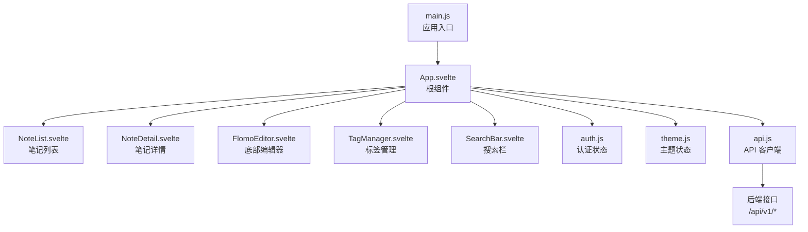
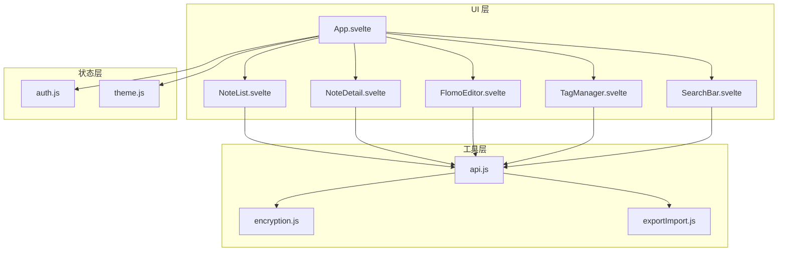
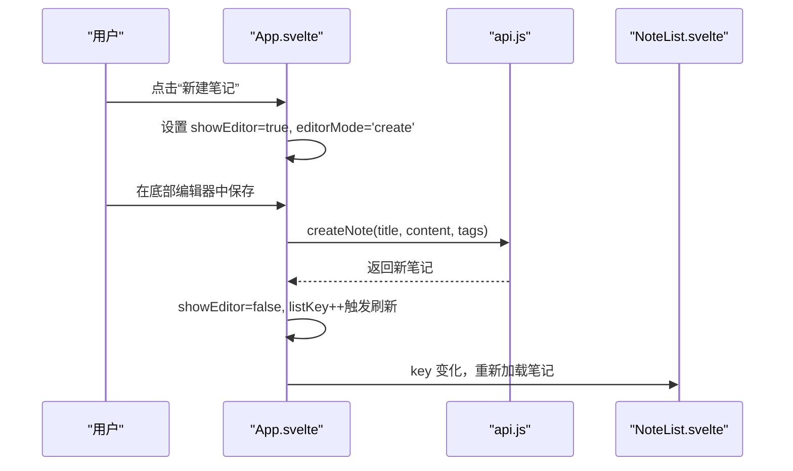
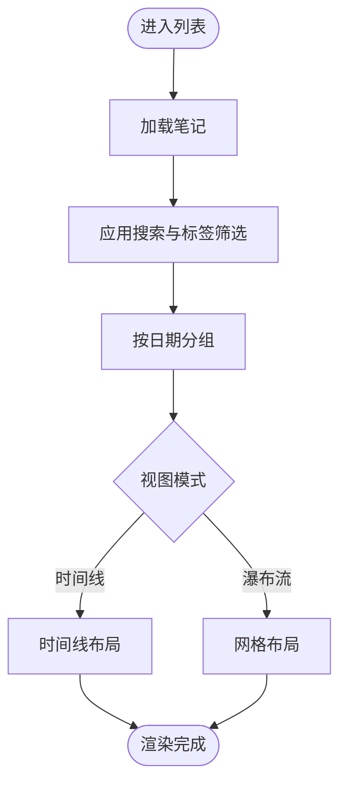
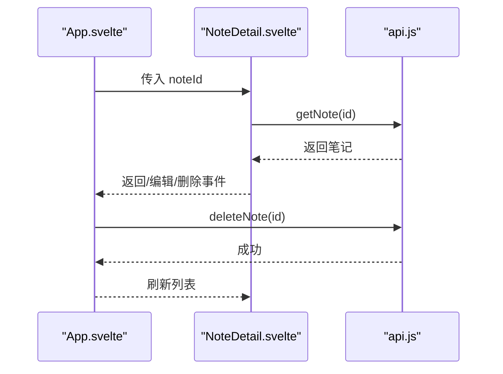
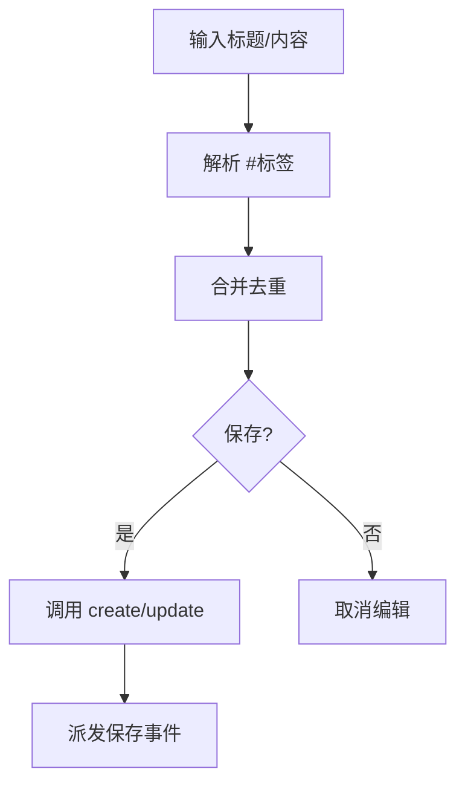
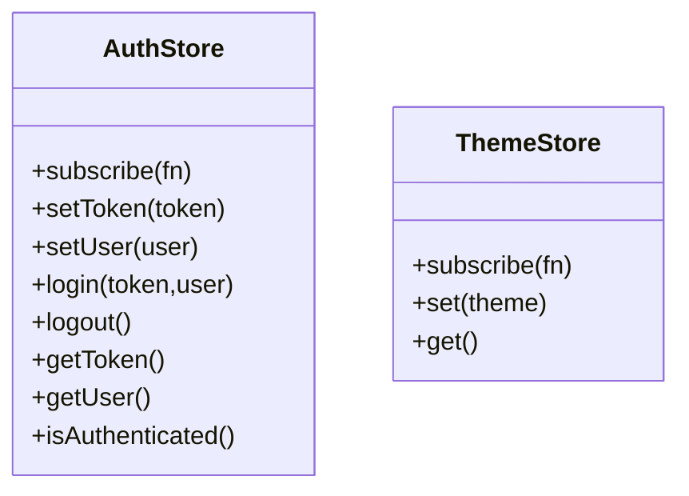
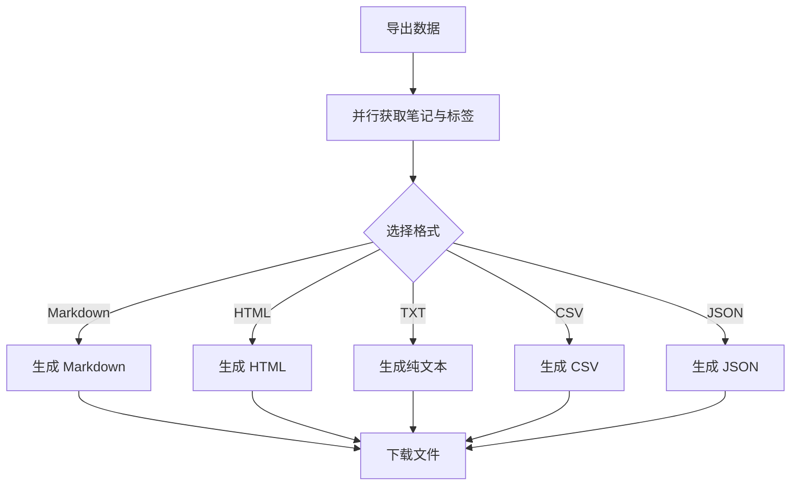
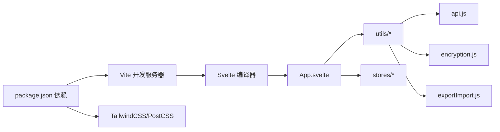

# 前端系统

<cite>
**本文引用的文件**
- [package.json](file://frontend/package.json)
- [vite.config.js](file://frontend/vite.config.js)
- [svelte.config.js](file://frontend/svelte.config.js)
- [main.js](file://frontend/src/main.js)
- [App.svelte](file://frontend/src/App.svelte)
- [auth.js](file://frontend/src/stores/auth.js)
- [theme.js](file://frontend/src/stores/theme.js)
- [api.js](file://frontend/src/utils/api.js)
- [encryption.js](file://frontend/src/utils/encryption.js)
- [exportImport.js](file://frontend/src/utils/exportImport.js)
- [NoteList.svelte](file://frontend/src/components/NoteList.svelte)
- [NoteDetail.svelte](file://frontend/src/components/NoteDetail.svelte)
- [FlomoEditor.svelte](file://frontend/src/components/FlomoEditor.svelte)
- [TagManager.svelte](file://frontend/src/components/TagManager.svelte)
- [SearchBar.svelte](file://frontend/src/components/SearchBar.svelte)
</cite>

## 目录
1. [简介](#简介)
2. [项目结构](#项目结构)
3. [核心组件](#核心组件)
4. [架构总览](#架构总览)
5. [组件详解](#组件详解)
6. [依赖关系分析](#依赖关系分析)
7. [性能考量](#性能考量)
8. [故障排查指南](#故障排查指南)
9. [结论](#结论)
10. [附录](#附录)

## 简介
Memo Studio 前端系统采用 Svelte + Vite 技术栈构建，围绕“笔记”这一核心业务实体，提供完整的笔记列表、详情、编辑与标签管理能力，并通过统一的 API 客户端与后端交互。系统内置轻量级全局状态管理（authStore、themeStore），并提供加密工具、导入导出工具等实用模块，支持多格式导出与标签智能建议输入。

## 项目结构
前端代码位于 frontend 目录，主要由以下层次构成：
- 应用入口与配置：main.js、vite.config.js、svelte.config.js、package.json
- 根组件与路由视图：App.svelte
- 组件库：src/components 下的页面级与功能组件
- 工具模块：src/utils 下的 API、加密、导入导出等工具
- 状态管理：src/stores 下的认证与主题状态
- 样式：src/styles/global.css（由 main.js 引入）

图表来源
- [main.js](file://frontend/src/main.js#L1-L20)
- [App.svelte](file://frontend/src/App.svelte#L1-L328)
- [NoteList.svelte](file://frontend/src/components/NoteList.svelte#L1-L507)
- [NoteDetail.svelte](file://frontend/src/components/NoteDetail.svelte#L1-L223)
- [FlomoEditor.svelte](file://frontend/src/components/FlomoEditor.svelte#L1-L270)
- [TagManager.svelte](file://frontend/src/components/TagManager.svelte#L1-L212)
- [SearchBar.svelte](file://frontend/src/components/SearchBar.svelte#L1-L251)
- [auth.js](file://frontend/src/stores/auth.js#L1-L80)
- [theme.js](file://frontend/src/stores/theme.js#L1-L40)
- [api.js](file://frontend/src/utils/api.js#L1-L316)

章节来源
- [package.json](file://frontend/package.json#L1-L25)
- [vite.config.js](file://frontend/vite.config.js#L1-L25)
- [svelte.config.js](file://frontend/svelte.config.js#L1-L11)
- [main.js](file://frontend/src/main.js#L1-L20)
- [App.svelte](file://frontend/src/App.svelte#L1-L328)

## 核心组件
- 根组件 App.svelte：负责视图切换（列表/详情/资料页）、认证状态监听、键盘快捷键、底部编辑器弹出与保存后的列表刷新。
- 笔记列表 NoteList.svelte：加载笔记、搜索与标签筛选、分组展示、瀑布流/时间线视图切换、批量删除、移动端侧边栏。
- 笔记详情 NoteDetail.svelte：按 ID 加载笔记、编辑/删除、相对时间显示、双击编辑。
- 底部编辑器 FlomoEditor.svelte：标题/内容输入、标签建议、快捷键保存、字数统计、遮罩层交互。
- 标签管理 TagManager.svelte：标签列表、编辑、删除、合并、目标选择。
- 搜索栏 SearchBar.svelte：全局快捷键、建议与最近搜索、高级搜索弹窗。
- 状态管理：auth.js（localStorage 持久化 + 订阅通知）、theme.js（主题切换 + DOM 类名同步）。
- 工具模块：api.js（统一 fetch + 认证拦截 + 错误处理 + 数据清洗）、encryption.js（Web Crypto API 加密/解密 + 本地安全存储）、exportImport.js（多格式导出 + 导入解析 + 批量创建）。

章节来源
- [App.svelte](file://frontend/src/App.svelte#L1-L328)
- [NoteList.svelte](file://frontend/src/components/NoteList.svelte#L1-L507)
- [NoteDetail.svelte](file://frontend/src/components/NoteDetail.svelte#L1-L223)
- [FlomoEditor.svelte](file://frontend/src/components/FlomoEditor.svelte#L1-L270)
- [TagManager.svelte](file://frontend/src/components/TagManager.svelte#L1-L212)
- [SearchBar.svelte](file://frontend/src/components/SearchBar.svelte#L1-L251)
- [auth.js](file://frontend/src/stores/auth.js#L1-L80)
- [theme.js](file://frontend/src/stores/theme.js#L1-L40)
- [api.js](file://frontend/src/utils/api.js#L1-L316)
- [encryption.js](file://frontend/src/utils/encryption.js#L1-L156)
- [exportImport.js](file://frontend/src/utils/exportImport.js#L1-L321)

## 架构总览
系统采用“组件驱动 + 轻状态 + 工具函数”的架构：
- 组件间通过 props 与事件进行通信（如 NoteList -> App -> NoteDetail）。
- 全局状态通过自定义 store（authStore、themeStore）集中管理，订阅者自动更新。
- API 客户端封装统一的认证头注入、拦截器、错误处理与数据清洗。
- 工具模块独立封装加密与导入导出，便于复用与测试。

图表来源
- [App.svelte](file://frontend/src/App.svelte#L1-L328)
- [NoteList.svelte](file://frontend/src/components/NoteList.svelte#L1-L507)
- [NoteDetail.svelte](file://frontend/src/components/NoteDetail.svelte#L1-L223)
- [FlomoEditor.svelte](file://frontend/src/components/FlomoEditor.svelte#L1-L270)
- [TagManager.svelte](file://frontend/src/components/TagManager.svelte#L1-L212)
- [SearchBar.svelte](file://frontend/src/components/SearchBar.svelte#L1-L251)
- [auth.js](file://frontend/src/stores/auth.js#L1-L80)
- [theme.js](file://frontend/src/stores/theme.js#L1-L40)
- [api.js](file://frontend/src/utils/api.js#L1-L316)
- [encryption.js](file://frontend/src/utils/encryption.js#L1-L156)
- [exportImport.js](file://frontend/src/utils/exportImport.js#L1-L321)

## 组件详解

### App.svelte：应用根组件与视图编排
- 视图状态：currentView（list/detail/profile）、selectedNoteId、editingNote、showEditor、editorMode、viewMode、sidebarCollapsed。
- 认证集成：监听 auth-success 事件；启动时验证 token 并设置用户；监听 auth-expired 事件提示重新登录。
- 事件编排：处理笔记点击、新建/编辑、返回、个人资料、登出、保存、取消、快捷键、导航、视图切换、侧边栏开关、标签面板与标签搜索聚焦、导入。
- 列表刷新：保存后通过 listKey 变更触发 NoteList 重新渲染。
- 底部编辑器：根据 showEditor 控制显示，支持保存与取消回调。

图表来源
- [App.svelte](file://frontend/src/App.svelte#L58-L98)
- [api.js](file://frontend/src/utils/api.js#L176-L190)

章节来源
- [App.svelte](file://frontend/src/App.svelte#L1-L328)

### NoteList.svelte：笔记列表与筛选
- 数据加载：调用 api.getNotes()，对返回数据进行清洗与过滤。
- 过滤逻辑：支持搜索关键词（标题/正文纯文本）与标签筛选。
- 分组展示：按创建日期分组，支持“今天/昨天/N天前/具体日期”格式化。
- 视图切换：时间线/瀑布流两种布局。
- 交互功能：单选/多选、批量删除、清空筛选、移动端侧边栏折叠、视图切换按钮。
- 空态与错误态：加载中骨架屏、错误提示、空列表引导。

图表来源
- [NoteList.svelte](file://frontend/src/components/NoteList.svelte#L39-L85)
- [NoteList.svelte](file://frontend/src/components/NoteList.svelte#L153-L171)

章节来源
- [NoteList.svelte](file://frontend/src/components/NoteList.svelte#L1-L507)

### NoteDetail.svelte：笔记详情与操作
- 数据加载：按 noteId 调用 api.getNote()，对 content 进行类型清洗。
- 操作按钮：返回、编辑、删除（二次确认）。
- 信息展示：标题、创建/更新相对时间、标签徽章。
- 内容渲染：@html 输出富文本内容。

图表来源
- [NoteDetail.svelte](file://frontend/src/components/NoteDetail.svelte#L18-L62)
- [api.js](file://frontend/src/utils/api.js#L165-L174)

章节来源
- [NoteDetail.svelte](file://frontend/src/components/NoteDetail.svelte#L1-L223)

### FlomoEditor.svelte：底部编辑器
- 输入能力：标题（可选）、内容（自动高度）、标签建议（#触发）。
- 保存逻辑：提取内容中的 #标签 与手动输入标签，去重合并；区分新建/编辑模式。
- 快捷键：Ctrl+Enter 保存，Esc 取消。
- 状态反馈：加载中状态、字数统计、遮罩层防止误触。

图表来源
- [FlomoEditor.svelte](file://frontend/src/components/FlomoEditor.svelte#L100-L128)
- [api.js](file://frontend/src/utils/api.js#L176-L203)

章节来源
- [FlomoEditor.svelte](file://frontend/src/components/FlomoEditor.svelte#L1-L270)

### TagManager.svelte：标签管理
- 功能：列出标签、编辑（名称/颜色）、删除、合并（选择目标标签）。
- 交互：编辑/合并对话框、取消、更新后刷新列表。

章节来源
- [TagManager.svelte](file://frontend/src/components/TagManager.svelte#L1-L212)

### SearchBar.svelte：搜索栏
- 快捷键：Cmd/Ctrl+K 聚焦；Esc 关闭高级搜索。
- 建议：标签建议与文本搜索建议；最近搜索（localStorage）。
- 事件：向上游派发搜索值。

章节来源
- [SearchBar.svelte](file://frontend/src/components/SearchBar.svelte#L1-L251)

### 状态管理：认证与主题
- 认证状态（authStore）：token/user 持久化到 localStorage，subscribe 订阅变更，提供 login/logout/setUser/setToken/isAuthenticated。
- 主题状态（themeStore）：读取/写入 localStorage，动态切换 documentElement 的 dark 类名，subscribe 订阅变更。

图表来源
- [auth.js](file://frontend/src/stores/auth.js#L20-L75)
- [theme.js](file://frontend/src/stores/theme.js#L17-L39)

章节来源
- [auth.js](file://frontend/src/stores/auth.js#L1-L80)
- [theme.js](file://frontend/src/stores/theme.js#L1-L40)

### 工具模块：API 客户端、加密、导入导出
- API 客户端（api.js）：统一基础路径、认证拦截器、错误处理、数据清洗（cleanContent/cleanNote）、认证过期事件派发。
- 加密工具（encryption.js）：Web Crypto API 生成/导出/导入密钥，AES-GCM 加密/解密，本地安全存储封装，隐私模式检测，敏感数据脱敏。
- 导入导出（exportImport.js）：Markdown/HTML/纯文本/CSV/JSON 多格式导出；解析 JSON/Markdown/文本导入；批量创建笔记。

图表来源
- [exportImport.js](file://frontend/src/utils/exportImport.js#L180-L246)
- [api.js](file://frontend/src/utils/api.js#L155-L163)

章节来源
- [api.js](file://frontend/src/utils/api.js#L1-L316)
- [encryption.js](file://frontend/src/utils/encryption.js#L1-L156)
- [exportImport.js](file://frontend/src/utils/exportImport.js#L1-L321)

## 依赖关系分析
- 构建与开发：Vite 插件 @sveltejs/vite-plugin-svelte，别名 $lib 指向 src/lib；开发服务器代理 /api 到后端。
- 运行时依赖：Svelte 5、clsx、tailwind-merge；TailwindCSS、PostCSS、autoprefixer、@tailwindcss/typography 用于样式。
- 组件通信：App.svelte 作为中枢，向下分发 props 与事件；组件内部通过 utils 与 stores 间接访问外部能力。
- 状态耦合：authStore 与 themeStore 低耦合，仅通过订阅者模式更新 UI；API 客户端与工具模块解耦，便于替换与测试。

图表来源
- [package.json](file://frontend/package.json#L11-L23)
- [vite.config.js](file://frontend/vite.config.js#L1-L25)
- [svelte.config.js](file://frontend/svelte.config.js#L1-L11)

章节来源
- [package.json](file://frontend/package.json#L1-L25)
- [vite.config.js](file://frontend/vite.config.js#L1-L25)
- [svelte.config.js](file://frontend/svelte.config.js#L1-L11)

## 性能考量
- 组件渲染优化
  - 列表渲染：NoteList 使用分组与视图切换，瀑布流采用网格布局以减少长列表滚动压力。
  - NoteDetail：仅在加载完成后渲染内容，避免空白闪烁。
  - 底部编辑器：使用固定定位与遮罩层，避免阻塞主内容。
- 状态更新
  - App.svelte 通过 key 变更（listKey）强制刷新列表，避免深层 diff 的不确定性。
  - 认证与主题状态采用订阅模式，最小化无关组件重渲染。
- 网络与缓存
  - API 客户端统一注入 Authorization，拦截器链路清晰，便于扩展限流与重试。
  - 搜索建议与最近搜索使用 localStorage，降低网络请求。
- 存储与安全
  - 加密工具使用 Web Crypto API，密钥本地存储并可清理；敏感字段脱敏输出。
- 可访问性
  - Svelte 编译器配置忽略部分 a11y 警告，建议在生产构建中补充必要的可访问性属性。

[本节为通用指导，无需特定文件引用]

## 故障排查指南
- 认证过期
  - 现象：触发 auth-expired 事件，localStorage 中 token/user 被清除。
  - 处理：监听事件提示用户重新登录；App.svelte 中已监听并给出日志。
- API 错误
  - 现象：401 登录过期、404 资源不存在、429 请求频繁、其他错误统一抛错。
  - 处理：在调用点捕获错误并提示；必要时回退到列表视图。
- 编辑器保存失败
  - 现象：保存按钮禁用或报错。
  - 处理：检查标题/内容非空规则；查看控制台错误；确认网络连通。
- 标签建议不出现
  - 现象：输入 # 后未出现建议。
  - 处理：确保已加载标签；检查输入位置与空格/逗号分隔符；确认编辑器聚焦状态。
- 导入失败
  - 现象：导入 JSON/Markdown/文本失败。
  - 处理：检查文件格式与结构；确认后端接口可用；查看控制台错误。

章节来源
- [api.js](file://frontend/src/utils/api.js#L16-L50)
- [App.svelte](file://frontend/src/App.svelte#L8-L17)
- [FlomoEditor.svelte](file://frontend/src/components/FlomoEditor.svelte#L75-L84)
- [exportImport.js](file://frontend/src/utils/exportImport.js#L250-L264)

## 结论
Memo Studio 前端系统以 Svelte 为核心，结合 Vite 的高效开发体验，构建了简洁而强大的笔记应用。通过组件化设计、轻量状态管理与工具模块化封装，系统具备良好的可维护性与扩展性。建议后续在生产环境增强可访问性与错误边界处理，并完善 API 客户端的重试与缓存策略。

[本节为总结，无需特定文件引用]

## 附录
- 组件使用示例（路径指引）
  - 新建笔记：App.svelte 中 handleNewNote -> FlomoEditor.svelte -> api.createNote
  - 编辑笔记：NoteDetail.svelte -> FlomoEditor.svelte -> api.updateNote
  - 删除笔记：NoteDetail.svelte -> api.deleteNote -> App.svelte 刷新
  - 导出数据：exportImport.js -> api.getNotes/getTags -> 下载文件
  - 加密存储：encryption.js -> secureSave/secureLoad
- 最佳实践
  - 使用 App.svelte 的 listKey 强制刷新列表，避免状态不一致。
  - 在组件内统一通过 api.js 调用后端接口，保持错误处理一致性。
  - 对用户输入进行清洗与校验，避免空标题/内容导致保存失败。
  - 合理使用 localStorage 存储轻量数据（如最近搜索、主题设置）。
- 性能优化建议
  - 列表分页或虚拟滚动（针对超大数据集）。
  - 图片懒加载与内容裁剪，减少首屏渲染压力。
  - 将高频计算（如标签建议）缓存至内存，避免重复解析。

[本节为通用指导，无需特定文件引用]