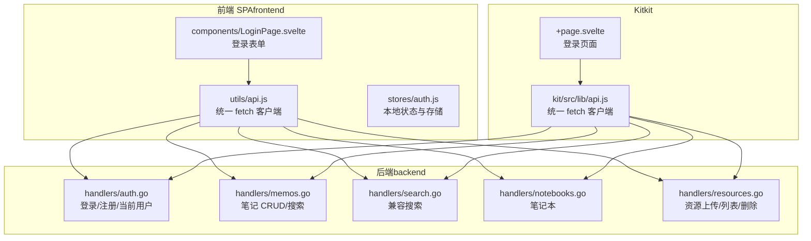
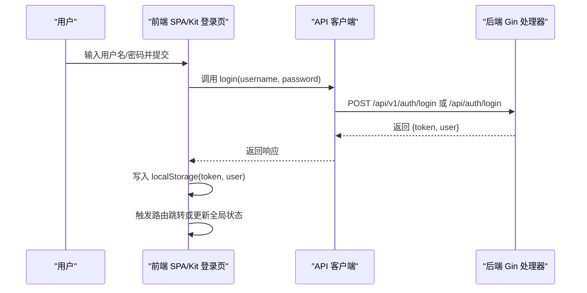
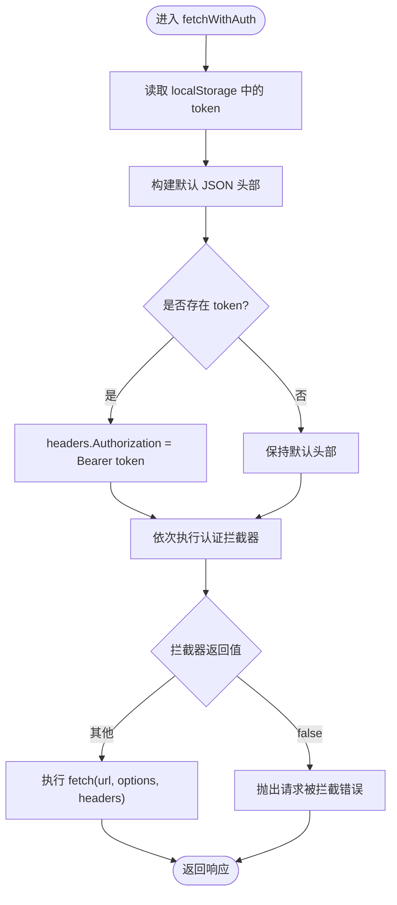
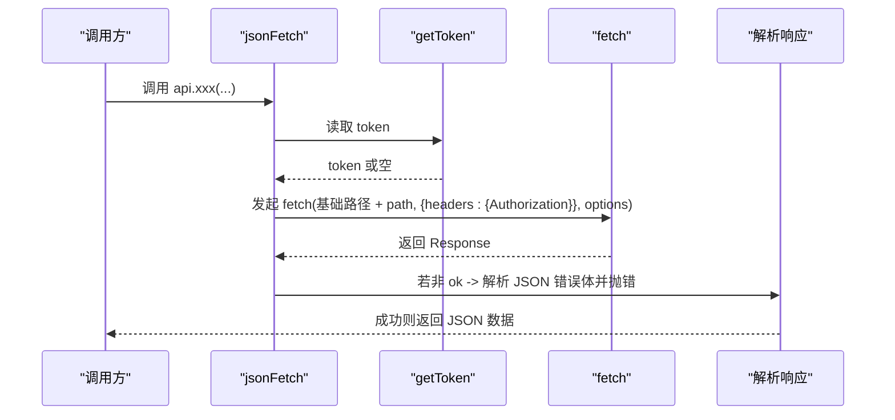
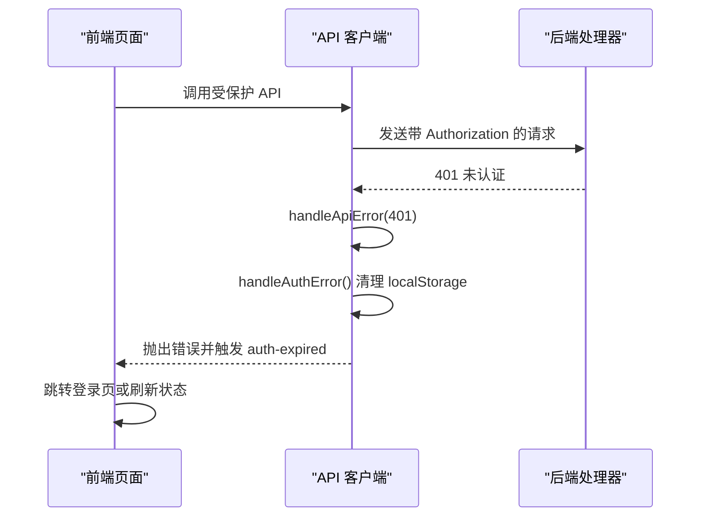
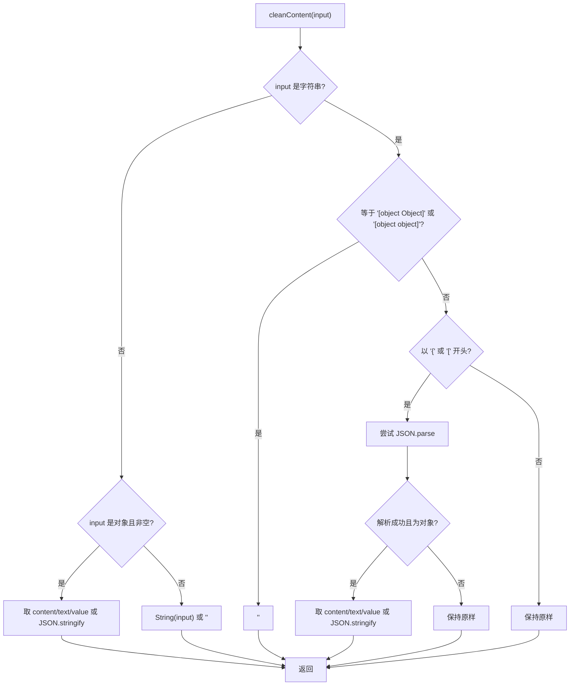
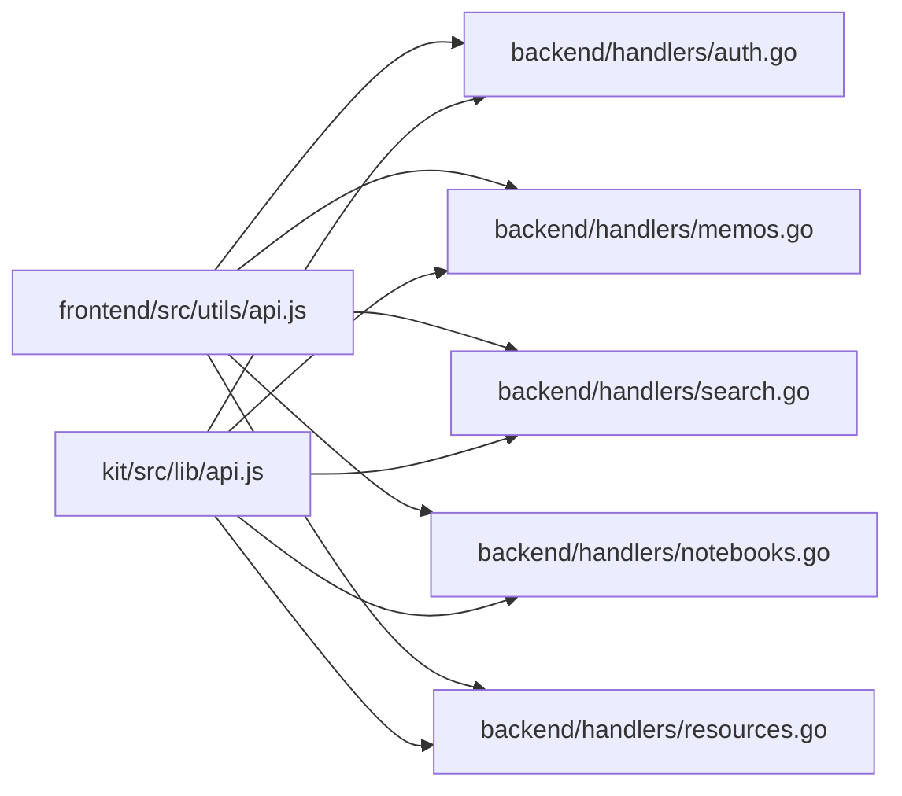

# API 客户端

<cite>
**本文引用的文件**
- [frontend/src/utils/api.js](file://frontend/src/utils/api.js)
- [kit/src/lib/api.js](file://kit/src/lib/api.js)
- [frontend/src/stores/auth.js](file://frontend/src/stores/auth.js)
- [frontend/src/components/LoginPage.svelte](file://frontend/src/components/LoginPage.svelte)
- [kit/src/routes/login/+page.svelte](file://kit/src/routes/login/+page.svelte)
- [backend/handlers/auth.go](file://backend/handlers/auth.go)
- [backend/handlers/memos.go](file://backend/handlers/memos.go)
- [backend/handlers/search.go](file://backend/handlers/search.go)
- [backend/handlers/notebooks.go](file://backend/handlers/notebooks.go)
- [backend/handlers/resources.go](file://backend/handlers/resources.go)
</cite>

## 目录
1. [简介](#简介)
2. [项目结构](#项目结构)
3. [核心组件](#核心组件)
4. [架构总览](#架构总览)
5. [详细组件分析](#详细组件分析)
6. [依赖关系分析](#依赖关系分析)
7. [性能考量](#性能考量)
8. [故障排查指南](#故障排查指南)
9. [结论](#结论)
10. [附录](#附录)

## 简介
本文件面向 Memo Studio 的前端与 Kit 两套前端入口，系统化梳理其基于 fetch 的 API 客户端实现，重点覆盖以下主题：
- 认证拦截器机制与 Token 管理
- 统一错误处理策略与 401 自动登出
- 请求头管理与鉴权传播
- 各类 API 方法实现（用户认证、笔记 CRUD、标签、搜索、笔记本、资源、统计、导入导出等）
- 数据清理函数 cleanContent/cleanNote 的行为与边界
- 使用示例、最佳实践与性能优化建议

## 项目结构
Memo Studio 的前端层包含两套入口：
- 前端 SPA（SvelteKit）：位于 frontend/，通过 utils/api.js 提供统一的 fetch 客户端
- Kit（独立 SvelteKit 应用）：位于 kit/，通过 kit/src/lib/api.js 提供统一的 fetch 客户端
- 后端（Go/Gin）：位于 backend/，提供 REST 接口，涵盖认证、笔记、搜索、笔记本、资源等

图表来源
- [frontend/src/utils/api.js](file://frontend/src/utils/api.js#L1-L316)
- [kit/src/lib/api.js](file://kit/src/lib/api.js#L1-L271)
- [backend/handlers/auth.go](file://backend/handlers/auth.go#L1-L111)
- [backend/handlers/memos.go](file://backend/handlers/memos.go#L1-L280)
- [backend/handlers/search.go](file://backend/handlers/search.go#L1-L45)
- [backend/handlers/notebooks.go](file://backend/handlers/notebooks.go#L1-L161)
- [backend/handlers/resources.go](file://backend/handlers/resources.go#L1-L225)

章节来源
- [frontend/src/utils/api.js](file://frontend/src/utils/api.js#L1-L316)
- [kit/src/lib/api.js](file://kit/src/lib/api.js#L1-L271)

## 核心组件
- 统一 fetch 客户端
  - 前端 SPA：在 utils/api.js 中封装了带认证的 fetchWithAuth、统一错误处理 handleApiError、认证拦截器 add/remove、Token 读取 getAuthToken、以及 cleanContent/cleanNote 数据清理函数
  - Kit：在 kit/src/lib/api.js 中封装了 jsonFetch、requireToken、以及完整的 API 方法集合
- 认证状态与存储
  - 前端 SPA：auth.js 提供 authStore，负责 token/user 的本地持久化与订阅通知
  - 登录页面：LoginPage.svelte 与 kit 的登录页面分别调用对应 api.login 并写入 localStorage
- 后端接口
  - 认证：登录/注册/当前用户
  - 笔记：列表、创建、更新、删除、批量删除、搜索
  - 标签：增删改、合并
  - 笔记本：列表、详情、创建、更新、删除、列出笔记本内的笔记
  - 资源：上传、列表、删除
  - 统计、随机复习、导入导出等

章节来源
- [frontend/src/utils/api.js](file://frontend/src/utils/api.js#L1-L316)
- [kit/src/lib/api.js](file://kit/src/lib/api.js#L1-L271)
- [frontend/src/stores/auth.js](file://frontend/src/stores/auth.js#L1-L80)
- [frontend/src/components/LoginPage.svelte](file://frontend/src/components/LoginPage.svelte#L1-L316)
- [kit/src/routes/login/+page.svelte](file://kit/src/routes/login/+page.svelte#L1-L124)
- [backend/handlers/auth.go](file://backend/handlers/auth.go#L1-L111)
- [backend/handlers/memos.go](file://backend/handlers/memos.go#L1-L280)
- [backend/handlers/search.go](file://backend/handlers/search.go#L1-L45)
- [backend/handlers/notebooks.go](file://backend/handlers/notebooks.go#L1-L161)
- [backend/handlers/resources.go](file://backend/handlers/resources.go#L1-L225)

## 架构总览
下面的序列图展示了“登录”流程在两套前端中的典型调用链路与鉴权传播。

图表来源
- [frontend/src/components/LoginPage.svelte](file://frontend/src/components/LoginPage.svelte#L23-L41)
- [kit/src/routes/login/+page.svelte](file://kit/src/routes/login/+page.svelte#L21-L36)
- [frontend/src/utils/api.js](file://frontend/src/utils/api.js#L117-L129)
- [kit/src/lib/api.js](file://kit/src/lib/api.js#L36-L41)
- [backend/handlers/auth.go](file://backend/handlers/auth.go#L28-L53)

## 详细组件分析

### 组件 A：前端 SPA API 客户端（utils/api.js）
- 认证拦截器
  - 通过 addAuthInterceptor/removeAuthInterceptor 注册/移除拦截器，拦截器接收 {url, options, headers}，若返回 false 则取消请求
  - 在 fetchWithAuth 中按序执行拦截器，随后发起 fetch
- Token 管理
  - getAuthToken 从 localStorage 读取 token，并在请求头自动附加 Authorization: Bearer
- 统一错误处理
  - handleApiError 针对 401 自动清除本地 token 与 user，并触发自定义事件通知应用进行登出
  - 对 404、429、4xx 等错误抛出带明确信息的 Error
- 数据清理
  - cleanContent：对字符串、JSON 字符串、对象进行清洗，避免 "[object Object]" 等异常值
  - cleanNote：对 note 的 content/title 进行清洗与类型转换
- API 方法
  - 认证：login/register/getCurrentUser
  - 笔记：getNotes/getNote/createNote/updateNote/deleteNote/deleteNotes
  - 标签：getTags/createTag/updateTag/deleteTag/mergeTags
  - 搜索：searchNotes
  - 批量删除：deleteNotes(ids)

图表来源
- [frontend/src/utils/api.js](file://frontend/src/utils/api.js#L53-L76)

章节来源
- [frontend/src/utils/api.js](file://frontend/src/utils/api.js#L1-L316)

### 组件 B：Kit API 客户端（kit/src/lib/api.js）
- Token 读取与强制校验
  - getToken/requireToken：在需要鉴权的接口中强制要求 token 存在
- 统一 fetch 封装
  - jsonFetch：自动拼接 API 基础路径、注入 Authorization 头、解析响应体并在非 OK 时抛错
- 资源上传
  - uploadResource：使用 FormData，单独处理 multipart 上传并携带 Authorization
- 导出/导入
  - exportNotes：支持 JSON/Markdown 两种格式，Markdown 时返回 {blob, filename}
  - importNotes：向后端导入笔记
- 其他 API
  - 用户：me/updateMe/changePassword
  - 管理员：adminListUsers/adminCreateUser/adminUpdateUser/adminDeleteUser
  - 笔记：listNotes/createNote/updateNote/deleteNote
  - 标签：listTags/createTag/updateTag/deleteTag/mergeTags
  - 笔记本：listNotebooks/getNotebook/createNotebook/updateNotebook/deleteNotebook/listNotebookNotes
  - 资源：listResources/deleteResource/uploadResource
  - 统计：getStats
  - 随机复习：randomReview

图表来源
- [kit/src/lib/api.js](file://kit/src/lib/api.js#L17-L33)

章节来源
- [kit/src/lib/api.js](file://kit/src/lib/api.js#L1-L271)

### 组件 C：认证流程与 401 处理
- 前端 SPA
  - 登录成功后写入 localStorage(token, user)，后续所有受保护请求自动携带 Authorization
  - 401 时 handleApiError 调用 handleAuthError 清理本地存储并触发 auth-expired 事件
- Kit
  - 登录成功后写入 localStorage(token, user)，随后跳转首页
  - requireToken 强制要求 token 存在，否则抛错

图表来源
- [frontend/src/utils/api.js](file://frontend/src/utils/api.js#L34-L50)
- [frontend/src/utils/api.js](file://frontend/src/utils/api.js#L16-L23)
- [frontend/src/stores/auth.js](file://frontend/src/stores/auth.js#L48-L65)
- [kit/src/lib/api.js](file://kit/src/lib/api.js#L11-L15)

章节来源
- [frontend/src/utils/api.js](file://frontend/src/utils/api.js#L1-L316)
- [frontend/src/stores/auth.js](file://frontend/src/stores/auth.js#L1-L80)
- [kit/src/lib/api.js](file://kit/src/lib/api.js#L1-L271)

### 组件 D：数据清理 cleanContent 与 cleanNote
- cleanContent
  - 处理字符串 "[object Object]"、"[object object]"
  - 若为 JSON 字符串，尝试解析并提取 content/text/value，否则回退为原始字符串
  - 对对象与非空值进行字符串化
- cleanNote
  - 对 note.content 调用 cleanContent
  - 对 note.title 进行字符串化并保证非空

图表来源
- [frontend/src/utils/api.js](file://frontend/src/utils/api.js#L79-L104)

章节来源
- [frontend/src/utils/api.js](file://frontend/src/utils/api.js#L78-L112)

### 组件 E：API 方法实现概览
- 认证
  - 前端 SPA：login/register/getCurrentUser
  - 后端：handlers/auth.go Login/Register/GetCurrentUser
- 笔记
  - 前端 SPA：getNotes/getNote/createNote/updateNote/deleteNote/deleteNotes/searchNotes
  - 后端：handlers/memos.go ListMemos/CreateMemo/UpdateMemo/DeleteMemo；handlers/search.go SearchNotes（兼容旧接口）
- 标签
  - 前端 SPA：getTags/createTag/updateTag/deleteTag/mergeTags
- 笔记本
  - 前端 SPA：listNotebooks/getNotebook/createNotebook/updateNotebook/deleteNotebook/listNotebookNotes
  - 后端：handlers/notebooks.go
- 资源
  - 前端 SPA：uploadResource/listResources/deleteResource
  - 后端：handlers/resources.go
- 其他
  - 统计、随机复习、导入导出等由 Kit 客户端提供

章节来源
- [frontend/src/utils/api.js](file://frontend/src/utils/api.js#L115-L310)
- [kit/src/lib/api.js](file://kit/src/lib/api.js#L35-L271)
- [backend/handlers/auth.go](file://backend/handlers/auth.go#L28-L111)
- [backend/handlers/memos.go](file://backend/handlers/memos.go#L78-L280)
- [backend/handlers/search.go](file://backend/handlers/search.go#L14-L43)
- [backend/handlers/notebooks.go](file://backend/handlers/notebooks.go#L12-L161)
- [backend/handlers/resources.go](file://backend/handlers/resources.go#L91-L225)

## 依赖关系分析
- 前端 SPA 客户端依赖后端 Gin 处理器，通过 /api/v1 或 /api 路径访问
- Kit 客户端同样依赖后端接口，但路径与参数略有差异（如 memos/tags/notebooks 等）
- 认证拦截器与 Token 管理在前端 SPA 中集中处理，Kit 客户端通过 requireToken 与 jsonFetch 统一封装

图表来源
- [frontend/src/utils/api.js](file://frontend/src/utils/api.js#L1-L316)
- [kit/src/lib/api.js](file://kit/src/lib/api.js#L1-L271)
- [backend/handlers/auth.go](file://backend/handlers/auth.go#L1-L111)
- [backend/handlers/memos.go](file://backend/handlers/memos.go#L1-L280)
- [backend/handlers/search.go](file://backend/handlers/search.go#L1-L45)
- [backend/handlers/notebooks.go](file://backend/handlers/notebooks.go#L1-L161)
- [backend/handlers/resources.go](file://backend/handlers/resources.go#L1-L225)

章节来源
- [frontend/src/utils/api.js](file://frontend/src/utils/api.js#L1-L316)
- [kit/src/lib/api.js](file://kit/src/lib/api.js#L1-L271)

## 性能考量
- 请求头复用与拦截器链
  - 在 fetchWithAuth 中统一注入 Authorization，减少重复逻辑
  - 拦截器顺序固定，避免多次修改 headers 导致的额外开销
- 错误早返回
  - 非 OK 响应尽早解析错误体并抛错，避免后续不必要的处理
- 数据清理
  - cleanContent/cleanNote 在前端侧做轻量级清洗，降低后端压力
- 批量操作
  - deleteNotes(ids) 通过批量删除接口减少往返次数
- 上传与导出
  - 资源上传使用 FormData，Kit 的导出支持 Markdown 直接返回 Blob，减少中间转换成本

[本节为通用建议，不直接分析具体文件]

## 故障排查指南
- 登录后仍提示未登录
  - 检查 localStorage 是否写入 token 与 user
  - 确认请求头是否包含 Authorization
  - 参考前端 SPA 的 handleAuthError 与 Kit 的 requireToken
- 401 错误频繁出现
  - 检查服务端 JWT 生成与过期策略
  - 确认客户端是否正确传递 Authorization
  - 关注拦截器是否意外返回 false
- 搜索结果异常
  - 前端 SPA 使用 searchNotes，Kit 使用 memos?q=...；确认查询参数与后端兼容层
- 笔记内容显示异常
  - 检查 cleanContent 是否正确清洗 content/title
- 批量删除失败
  - 确认传入 ids 为非空数组

章节来源
- [frontend/src/utils/api.js](file://frontend/src/utils/api.js#L34-L50)
- [frontend/src/utils/api.js](file://frontend/src/utils/api.js#L16-L23)
- [kit/src/lib/api.js](file://kit/src/lib/api.js#L11-L15)
- [frontend/src/utils/api.js](file://frontend/src/utils/api.js#L301-L309)

## 结论
Memo Studio 的 API 客户端在前端 SPA 与 Kit 中分别提供了统一、可扩展的 fetch 封装：
- 通过认证拦截器与 Token 管理，确保受保护接口的安全访问
- 通过统一错误处理与 401 自动登出，提升用户体验与安全性
- 通过 cleanContent/cleanNote 保障数据质量
- 通过清晰的 API 方法划分与后端 Handlers 对应，便于维护与扩展

[本节为总结，不直接分析具体文件]

## 附录

### 使用示例（路径指引）
- 登录
  - 前端 SPA：调用 api.login(username, password)，成功后写入 localStorage 并触发登录成功事件
  - 参考：[frontend/src/components/LoginPage.svelte](file://frontend/src/components/LoginPage.svelte#L23-L41)
- 获取当前用户
  - 前端 SPA：api.getCurrentUser()
  - 参考：[frontend/src/utils/api.js](file://frontend/src/utils/api.js#L145-L152)
- 创建笔记
  - 前端 SPA：api.createNote(title, content, tags)
  - 参考：[frontend/src/utils/api.js](file://frontend/src/utils/api.js#L176-L190)
- 搜索笔记
  - 前端 SPA：api.searchNotes(query)
  - 参考：[frontend/src/utils/api.js](file://frontend/src/utils/api.js#L301-L309)
- 资源上传（Kit）
  - 调用 api.uploadResource(file)
  - 参考：[kit/src/lib/api.js](file://kit/src/lib/api.js#L166-L181)

### 最佳实践
- 在发起受保护请求前，确保 localStorage 中存在有效 token
- 使用拦截器进行统一的请求预处理（如动态 headers），但避免阻断正常请求
- 对用户输入与后端返回数据进行清洗，防止异常值进入 UI
- 对批量操作与大文件上传，合理设置超时与重试策略

[本节为通用建议，不直接分析具体文件]