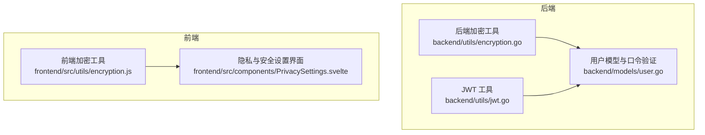
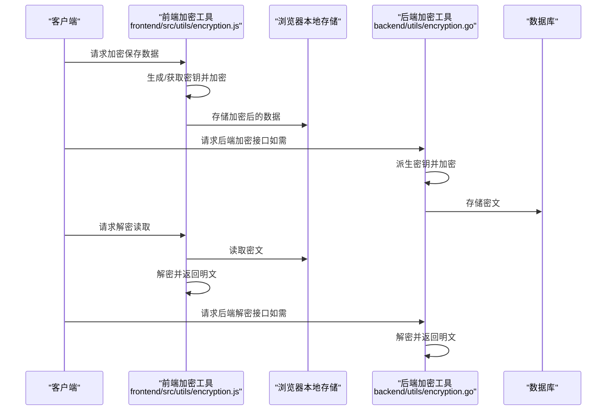
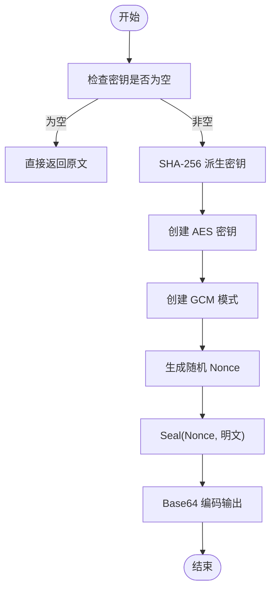
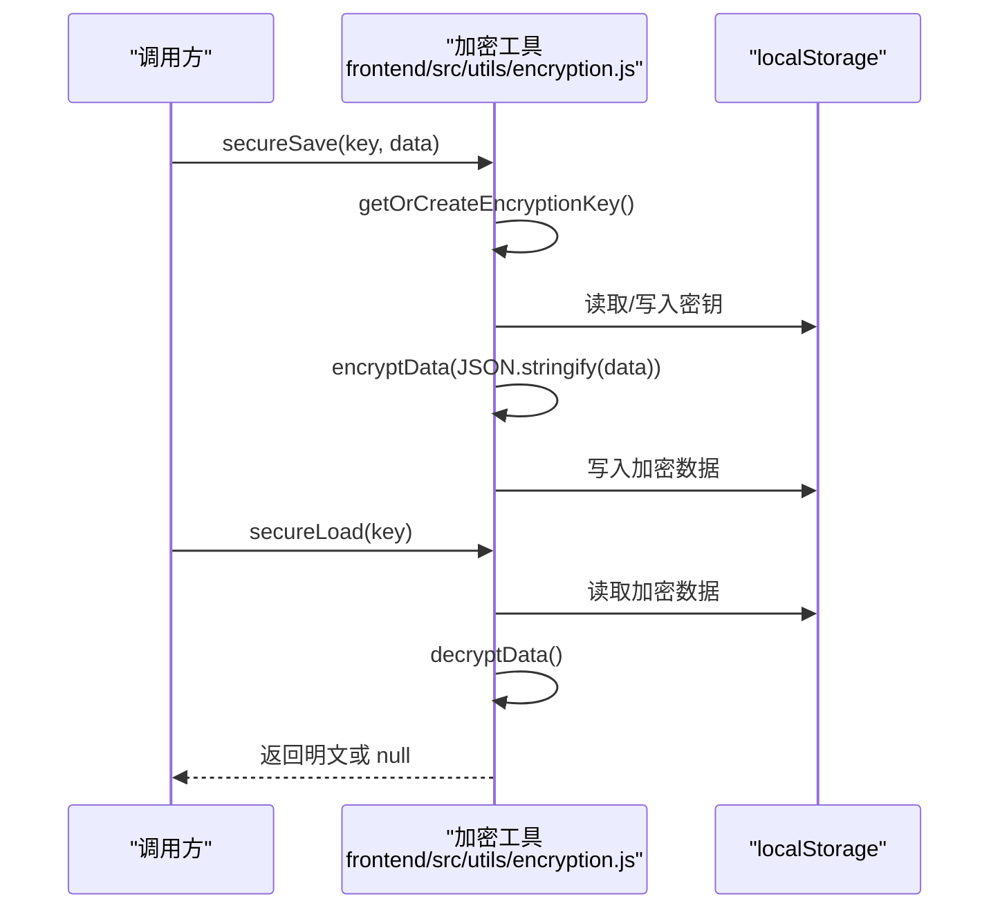
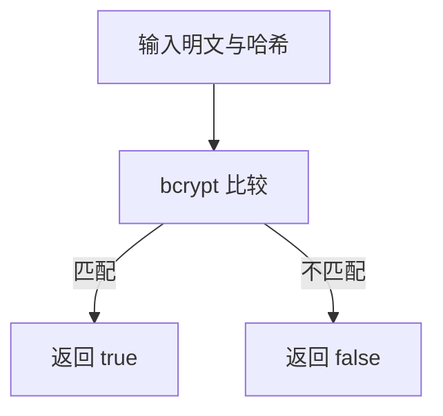
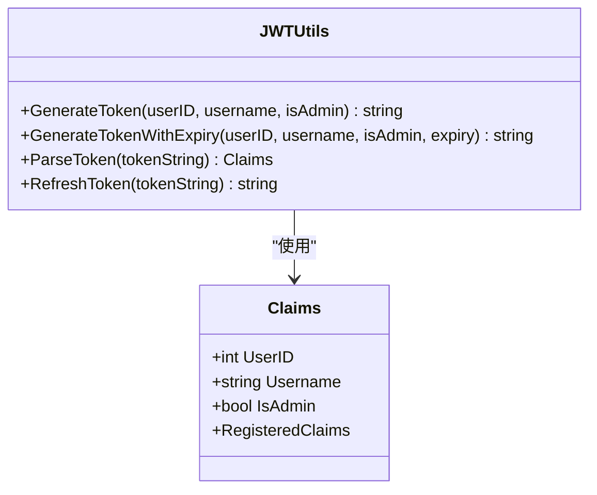
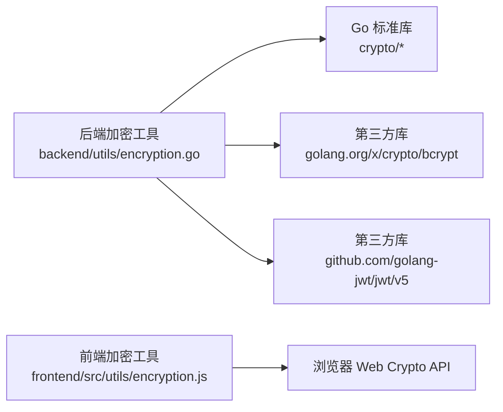

# 加密工具

<cite>
**本文引用的文件列表**
- [backend/utils/encryption.go](file://backend/utils/encryption.go)
- [frontend/src/utils/encryption.js](file://frontend/src/utils/encryption.js)
- [backend/utils/jwt.go](file://backend/utils/jwt.go)
- [backend/go.mod](file://backend/go.mod)
- [frontend/package.json](file://frontend/package.json)
- [backend/models/user.go](file://backend/models/user.go)
- [frontend/src/components/PrivacySettings.svelte](file://frontend/src/components/PrivacySettings.svelte)
- [docs/security-optimization.md](file://docs/security-optimization.md)
</cite>

## 目录
1. [简介](#简介)
2. [项目结构](#项目结构)
3. [核心组件](#核心组件)
4. [架构总览](#架构总览)
5. [组件详解](#组件详解)
6. [依赖关系分析](#依赖关系分析)
7. [性能考量](#性能考量)
8. [故障排查指南](#故障排查指南)
9. [结论](#结论)
10. [附录](#附录)

## 简介
本文件面向 Memo Studio 的加密工具模块，系统性梳理后端与前端的加密实现、密钥管理策略、安全传输机制与错误处理流程，并结合用户认证、数据存储与传输安全的应用场景，提供使用示例、安全最佳实践、性能优化建议以及安全强度评估与密钥轮换策略。目标是帮助开发者正确使用加密功能并理解安全设计原则。

## 项目结构
加密能力由前后端协同实现：
- 后端采用 Go 实现对称加密（AES-256-GCM）、口令哈希（bcrypt）与 JWT 签发/解析。
- 前端采用 Web Crypto API 实现浏览器侧对称加密（AES-GCM），并提供本地存储加密封装。
- 两者均强调随机数生成、完整性校验与错误处理。

图表来源
- [backend/utils/encryption.go](file://backend/utils/encryption.go#L1-L107)
- [backend/utils/jwt.go](file://backend/utils/jwt.go#L1-L76)
- [backend/models/user.go](file://backend/models/user.go#L78-L110)
- [frontend/src/utils/encryption.js](file://frontend/src/utils/encryption.js#L1-L156)
- [frontend/src/components/PrivacySettings.svelte](file://frontend/src/components/PrivacySettings.svelte#L92-L98)

章节来源
- [backend/utils/encryption.go](file://backend/utils/encryption.go#L1-L107)
- [frontend/src/utils/encryption.js](file://frontend/src/utils/encryption.js#L1-L156)
- [backend/utils/jwt.go](file://backend/utils/jwt.go#L1-L76)
- [backend/models/user.go](file://backend/models/user.go#L78-L110)
- [frontend/src/components/PrivacySettings.svelte](file://frontend/src/components/PrivacySettings.svelte#L92-L98)

## 核心组件
- 对称加密（AES-256-GCM）
  - 后端：EncryptData/DecryptData，使用随机 Nonce（GCM 随机 12 字节），密钥通过 SHA-256 派生。
  - 前端：generateEncryptionKey/encryptData/decryptData，使用 Web Crypto API 的 AES-GCM，随机 IV（12 字节），密钥在内存中管理并通过 localStorage 存储导出后的原始密钥。
- 口令哈希与验证（bcrypt）
  - 后端：HashPassword/VerifyPassword；用户模型中也使用 bcrypt 验证登录。
- JWT 签发与解析
  - 后端：GenerateToken/ParseToken/RefreshToken，支持自定义有效期，生产环境需设置 MEMO_JWT_SECRET 环境变量。
- 本地存储加密封装
  - 前端：secureSave/secureLoad，基于浏览器本地存储，提供密钥生成、导入导出与隐私模式检测。

章节来源
- [backend/utils/encryption.go](file://backend/utils/encryption.go#L16-L106)
- [frontend/src/utils/encryption.js](file://frontend/src/utils/encryption.js#L3-L125)
- [backend/utils/jwt.go](file://backend/utils/jwt.go#L22-L75)
- [backend/models/user.go](file://backend/models/user.go#L78-L110)

## 架构总览
整体安全架构围绕“密钥管理 + 数据保护 + 认证授权”展开：
- 密钥管理
  - 后端：用户提供的 master key 经 SHA-256 派生为 32 字节密钥，用于 AES-GCM。
  - 前端：每用户生成独立 AES-GCM 密钥，导出为 raw key 并以 base64 形式存于 localStorage，首次访问自动生成。
- 数据保护
  - 后端：对敏感字段进行加密存储；解密时进行完整性校验与错误包装。
  - 前端：对本地敏感数据进行加密存储；解密失败返回空值并记录日志。
- 认证授权
  - 用户登录成功后签发 JWT，携带用户标识与权限；刷新 token 时重新签发新 token。

图表来源
- [frontend/src/utils/encryption.js](file://frontend/src/utils/encryption.js#L95-L120)
- [backend/utils/encryption.go](file://backend/utils/encryption.go#L16-L76)

## 组件详解

### 后端对称加密（AES-256-GCM）
- 算法与模式
  - AES-256-GCM，随机 Nonce（GCM 默认 12 字节），密钥通过 SHA-256 派生为 32 字节。
- 关键函数
  - EncryptData(明文, 密钥) -> 密文字符串（Base64 编码）
  - DecryptData(密文, 密钥) -> 明文字符串（失败返回错误）
  - deriveKey(主密钥) -> 32 字节密钥
- 参数与返回
  - 参数：明文/密文为字符串；密钥为主密钥字符串。
  - 返回：加密成功返回 Base64 字符串；解密成功返回明文；失败返回错误对象。
- 错误处理
  - 输入为空密钥时直接返回原文（透传），避免无密钥时的异常。
  - 解码失败、密文过短、GCM 开启失败、解密失败均包装为明确错误信息。
- 安全要点
  - GCM 提供机密性与完整性；Nonce 必须随机且不可重复。
  - 派生密钥使用 SHA-256，确保固定长度密钥。

图表来源
- [backend/utils/encryption.go](file://backend/utils/encryption.go#L16-L40)

章节来源
- [backend/utils/encryption.go](file://backend/utils/encryption.go#L16-L82)

### 前端对称加密（AES-GCM + Web Crypto API）
- 算法与模式
  - AES-GCM，随机 IV（12 字节），密钥在内存中管理，仅以 raw key 形式导出并存储于 localStorage。
- 关键函数
  - generateEncryptionKey() -> CryptoKey
  - exportKey(CryptoKey) -> base64 字符串
  - importKey(base64) -> CryptoKey
  - encryptData(明文, CryptoKey) -> JSON 字符串（包含 iv 与 data）
  - decryptData(JSON, CryptoKey) -> 明文（失败返回 null）
  - getOrCreateEncryptionKey() -> CryptoKey（首次生成并缓存）
  - secureSave(key, data) -> boolean（加密后写入 localStorage）
  - secureLoad(key) -> 解密后的对象或 null
- 参数与返回
  - 明文为字符串；CryptoKey 为 Web Crypto Key；JSON 结构包含 iv 与 data 数组。
  - 返回值：加密/解密成功返回字符串或对象；失败返回 null 或抛出异常被捕获。
- 错误处理
  - 解密失败捕获异常并返回 null，同时打印错误日志。
  - 本地存储读取不到数据时返回 null。
- 安全要点
  - 密钥仅在内存中存在，导出后以 base64 存储，便于跨会话复用。
  - 通过隐私模式检测提示用户私密浏览下的风险。

图表来源
- [frontend/src/utils/encryption.js](file://frontend/src/utils/encryption.js#L95-L120)

章节来源
- [frontend/src/utils/encryption.js](file://frontend/src/utils/encryption.js#L3-L125)

### 口令哈希与验证（bcrypt）
- 后端
  - HashPassword(明文) -> 哈希字符串
  - VerifyPassword(明文, 哈希) -> 布尔
- 用户模型
  - 登录时查询用户并使用 bcrypt 验证密码，失败返回未找到。
- 安全要点
  - bcrypt 自带成本因子，默认成本；适合存储口令哈希。
  - 验证失败返回未找到，避免泄露“用户不存在”的信息。

图表来源
- [backend/utils/encryption.go](file://backend/utils/encryption.go#L93-L106)
- [backend/models/user.go](file://backend/models/user.go#L78-L110)

章节来源
- [backend/utils/encryption.go](file://backend/utils/encryption.go#L93-L106)
- [backend/models/user.go](file://backend/models/user.go#L78-L110)

### JWT 签发与解析
- 关键函数
  - GenerateToken(userID, username, isAdmin) -> token（默认 24 小时）
  - GenerateTokenWithExpiry(userID, username, isAdmin, expiry) -> token
  - ParseToken(token) -> Claims 或错误
  - RefreshToken(token) -> 新 token
- Claims 字段
  - 包含用户 ID、用户名、是否管理员以及标准声明（过期、签发、生效时间）。
- 安全要点
  - 秘钥通过环境变量 MEMO_JWT_SECRET 注入；生产环境必须设置，否则启动即致命错误。
  - HS256 签名算法，密钥在内存中，不暴露于前端。

图表来源
- [backend/utils/jwt.go](file://backend/utils/jwt.go#L22-L75)

章节来源
- [backend/utils/jwt.go](file://backend/utils/jwt.go#L11-L75)

### 本地存储加密封装与隐私模式
- 功能
  - secureSave/secureLoad：对任意对象进行加密存储与读取。
  - getOrCreateEncryptionKey：首次生成密钥并缓存。
  - clearSecureData：清除密钥与加密数据。
  - isPrivateBrowsing：检测私密浏览模式。
  - maskSensitiveData：对敏感字段进行脱敏显示。
- 安全要点
  - 重新生成密钥会导致旧数据无法解密，界面提供警告提示。
  - 私密浏览模式下 localStorage 可能不可用，应提示用户风险。

章节来源
- [frontend/src/utils/encryption.js](file://frontend/src/utils/encryption.js#L84-L138)
- [frontend/src/components/PrivacySettings.svelte](file://frontend/src/components/PrivacySettings.svelte#L92-L98)

## 依赖关系分析
- 后端依赖
  - crypto/aes、cipher、rand、sha256、bcrypt、encoding/base64、encoding/hex、io。
  - go.mod 中引入 golang.org/x/crypto 与 github.com/golang-jwt/jwt/v5。
- 前端依赖
  - 浏览器原生 Web Crypto API（crypto.subtle）。
  - package.json 中为 Svelte 应用依赖，加密工具为独立工具模块。

图表来源
- [backend/go.mod](file://backend/go.mod#L5-L11)
- [frontend/package.json](file://frontend/package.json#L11-L23)
- [backend/utils/encryption.go](file://backend/utils/encryption.go#L3-L14)

章节来源
- [backend/go.mod](file://backend/go.mod#L5-L11)
- [frontend/package.json](file://frontend/package.json#L11-L23)

## 性能考量
- AES-256-GCM
  - GCM 为流式 AEAD，加解密开销较低；随机 Nonce/IV 生成与 Base64 编解码带来少量 CPU 与内存开销。
  - 建议批量处理时复用 CryptoKey（前端）或派生后的密钥（后端），避免重复派生。
- bcrypt
  - 成本因子默认，适合登录验证；若业务对登录延迟敏感，可在安全允许范围内调整成本因子。
- JWT
  - HS256 签发/解析快速；建议控制 token 体积，避免冗余字段。
- 前端本地存储
  - localStorage 为同步 API，大对象频繁加解密可能阻塞 UI；建议异步化或分片处理。

[本节为通用性能建议，不直接分析具体文件]

## 故障排查指南
- 后端
  - 解密失败：检查密钥是否一致、密文是否被篡改、Nonce/IV 是否正确传递。
  - 密文过短：确认密文包含完整的 Nonce 与密文部分。
  - 派生密钥问题：确保主密钥一致且未被截断。
- 前端
  - 解密返回 null：检查密钥是否正确导入、localStorage 是否可用、数据是否被篡改。
  - 无法读取数据：确认 secureLoad 的 key 是否与 secureSave 一致。
  - 私密浏览：isPrivateBrowsing 返回 true 时，localStorage 不可用，需提示用户切换普通窗口。
- JWT
  - 解析失败：确认 MEMO_JWT_SECRET 是否正确设置，token 是否过期或签名无效。
  - 刷新失败：ParseToken 失败则 RefreshToken 无法生成新 token。

章节来源
- [backend/utils/encryption.go](file://backend/utils/encryption.go#L42-L76)
- [frontend/src/utils/encryption.js](file://frontend/src/utils/encryption.js#L48-L67)
- [backend/utils/jwt.go](file://backend/utils/jwt.go#L51-L66)

## 结论
Memo Studio 的加密工具在后端与前端分别实现了对称加密、口令哈希与 JWT 认证，形成“密钥管理 + 数据保护 + 认证授权”的闭环。后端侧重服务端密钥派生与完整性校验，前端侧重浏览器侧密钥生成与本地存储加密封装。配合严格的错误处理与安全提示，能够满足日常开发与部署的安全需求。建议在生产环境中严格管理密钥与 JWT 秘钥，定期轮换密钥并监控漏洞。

[本节为总结性内容，不直接分析具体文件]

## 附录

### 使用示例（路径指引）
- 后端
  - 加密：参考 [EncryptData](file://backend/utils/encryption.go#L16-L40)
  - 解密：参考 [DecryptData](file://backend/utils/encryption.go#L42-L76)
  - 口令哈希：参考 [HashPassword](file://backend/utils/encryption.go#L93-L99)
  - 口令验证：参考 [VerifyPassword](file://backend/utils/encryption.go#L102-L106)
  - JWT：参考 [GenerateToken](file://backend/utils/jwt.go#L29-L32)、[ParseToken](file://backend/utils/jwt.go#L51-L66)
- 前端
  - 生成密钥：参考 [generateEncryptionKey](file://frontend/src/utils/encryption.js#L3-L11)
  - 导入/导出密钥：参考 [exportKey](file://frontend/src/utils/encryption.js#L13-L17)、[importKey](file://frontend/src/utils/encryption.js#L19-L29)
  - 加密/解密：参考 [encryptData](file://frontend/src/utils/encryption.js#L31-L46)、[decryptData](file://frontend/src/utils/encryption.js#L48-L67)
  - 本地存储封装：参考 [secureSave](file://frontend/src/utils/encryption.js#L94-L105)、[secureLoad](file://frontend/src/utils/encryption.js#L107-L120)

### 安全最佳实践
- 密钥管理
  - 后端：主密钥应安全存储，避免硬编码；派生密钥仅在内存中使用。
  - 前端：密钥仅在内存中存在，导出后以 base64 存储；提供密钥重生成入口并提示风险。
- 传输安全
  - 使用 HTTPS；JWT 仅在受保护通道传输；避免在 URL 中传递敏感数据。
- 数据保护
  - 对敏感字段（如口令、令牌、邮箱、电话）进行最小化存储与脱敏展示。
- 日志与审计
  - 记录关键安全事件（如密钥重生成、解密失败），但避免记录明文敏感数据。

### 性能优化建议
- 复用密钥：前端复用 CryptoKey，后端复用派生后的密钥。
- 异步处理：localStorage 读写与加密解密尽量异步化，避免阻塞 UI。
- 批量处理：对大量数据进行分批加解密，降低单次峰值开销。

### 安全强度评估与密钥轮换策略
- 安全强度
  - AES-256-GCM：机密性与完整性保障良好；随机 Nonce/IV 有效防止重放与篡改。
  - bcrypt：成本因子默认，适合口令存储；建议根据硬件能力适当调整。
  - JWT HS256：签发/解析快速；秘钥需妥善保管。
- 密钥轮换
  - 后端：通过更换主密钥并重新加密历史数据实现轮换；注意兼容旧密钥过渡期。
  - 前端：提供“重新生成密钥”入口，提示用户旧数据将无法解密，引导备份与迁移。
- 漏洞防范
  - 定期更新依赖与运行时镜像，参考 [Docker 安全优化说明](file://docs/security-optimization.md#L1-L88)。
  - 生产环境强制设置 MEMO_JWT_SECRET，避免启动失败。

章节来源
- [frontend/src/components/PrivacySettings.svelte](file://frontend/src/components/PrivacySettings.svelte#L92-L98)
- [docs/security-optimization.md](file://docs/security-optimization.md#L1-L88)