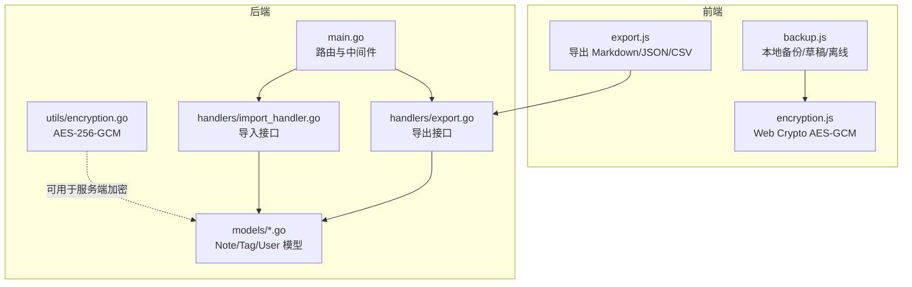
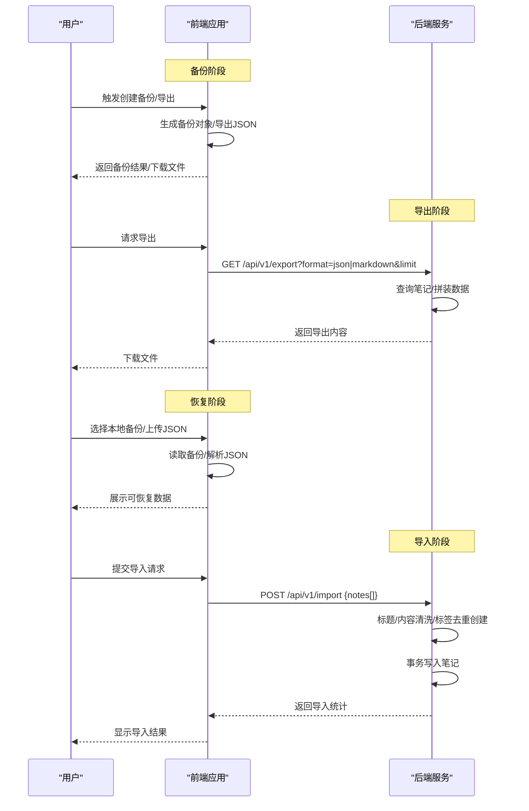
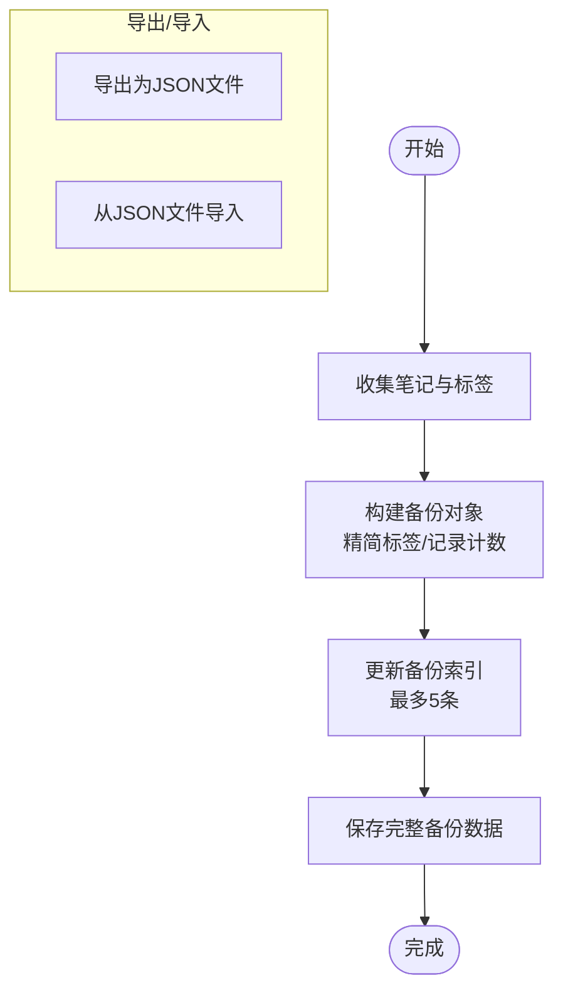
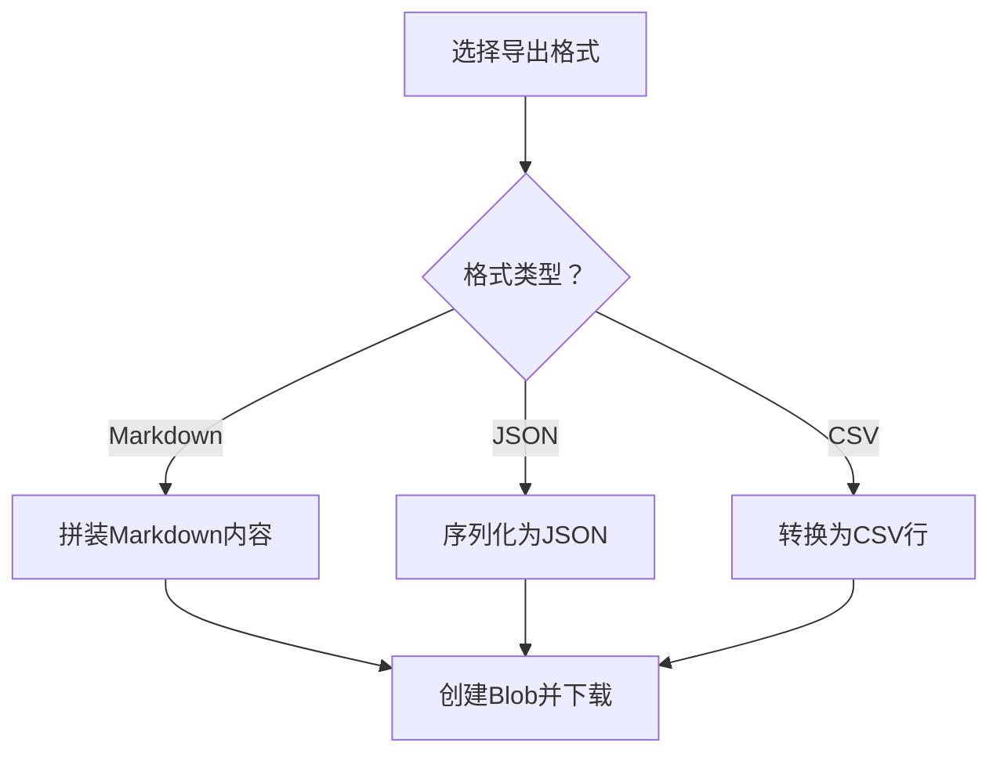
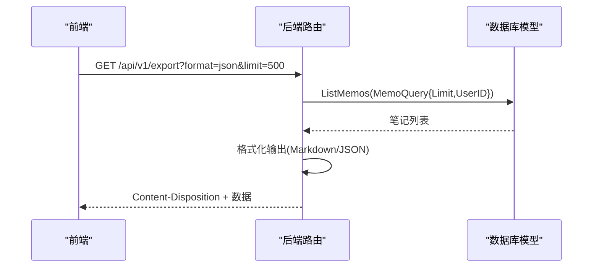
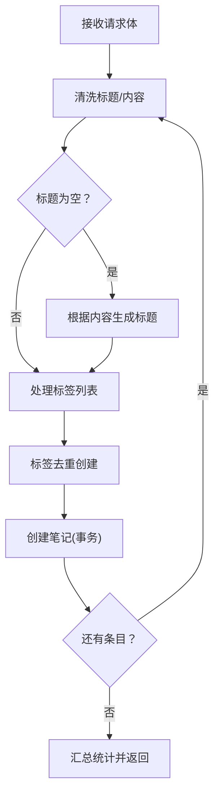
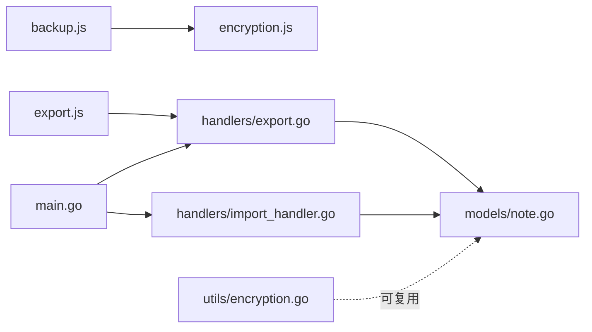

# 备份恢复

<cite>
**本文引用的文件**
- [frontend/src/utils/backup.js](file://frontend/src/utils/backup.js)
- [frontend/src/utils/encryption.js](file://frontend/src/utils/encryption.js)
- [frontend/src/utils/export.js](file://frontend/src/utils/export.js)
- [backend/handlers/export.go](file://backend/handlers/export.go)
- [backend/handlers/import_handler.go](file://backend/handlers/import_handler.go)
- [backend/utils/encryption.go](file://backend/utils/encryption.go)
- [backend/main.go](file://backend/main.go)
- [backend/models/note.go](file://backend/models/note.go)
- [backend/models/user.go](file://backend/models/user.go)
</cite>

## 目录
1. [简介](#简介)
2. [项目结构](#项目结构)
3. [核心组件](#核心组件)
4. [架构总览](#架构总览)
5. [组件详解](#组件详解)
6. [依赖关系分析](#依赖关系分析)
7. [性能考量](#性能考量)
8. [故障排查指南](#故障排查指南)
9. [结论](#结论)
10. [附录](#附录)

## 简介
本文件面向 Memo Studio 的备份与恢复能力，系统化梳理前端与后端的数据备份策略、存储格式、导入导出接口、数据完整性与一致性保障、以及安全与兼容性要点。文档同时给出流程图与时序图，帮助开发者快速理解端到端的备份恢复机制，并提供实践建议与排障指引。

## 项目结构
Memo Studio 的备份与恢复涉及前后端协作：
- 前端负责本地草稿与备份的创建、持久化与导出；通过 Web Crypto API 实现本地数据加密封存。
- 后端提供统一的导出与导入接口，支持 Markdown 与 JSON 格式；导入时进行数据清洗与标签去重创建。

图表来源
- [frontend/src/utils/backup.js](file://frontend/src/utils/backup.js#L1-L223)
- [frontend/src/utils/encryption.js](file://frontend/src/utils/encryption.js#L1-L156)
- [frontend/src/utils/export.js](file://frontend/src/utils/export.js#L1-L103)
- [backend/main.go](file://backend/main.go#L94-L196)
- [backend/handlers/export.go](file://backend/handlers/export.go#L15-L81)
- [backend/handlers/import_handler.go](file://backend/handlers/import_handler.go#L24-L84)
- [backend/models/note.go](file://backend/models/note.go#L11-L27)
- [backend/utils/encryption.go](file://backend/utils/encryption.go#L16-L40)

章节来源
- [frontend/src/utils/backup.js](file://frontend/src/utils/backup.js#L1-L223)
- [frontend/src/utils/encryption.js](file://frontend/src/utils/encryption.js#L1-L156)
- [frontend/src/utils/export.js](file://frontend/src/utils/export.js#L1-L103)
- [backend/main.go](file://backend/main.go#L94-L196)
- [backend/handlers/export.go](file://backend/handlers/export.go#L15-L81)
- [backend/handlers/import_handler.go](file://backend/handlers/import_handler.go#L24-L84)
- [backend/models/note.go](file://backend/models/note.go#L11-L27)
- [backend/utils/encryption.go](file://backend/utils/encryption.go#L16-L40)

## 核心组件
- 前端备份与草稿
  - 本地备份：创建备份、列出备份、删除备份、导出为 JSON 文件、从 JSON 文件导入。
  - 草稿管理：定时自动保存、草稿数量上限、草稿读取与删除。
  - 加密存储：基于 Web Crypto API 的 AES-GCM，密钥本地持久化。
- 后端导出与导入
  - 导出接口：支持 JSON 与 Markdown，带分页与大小限制。
  - 导入接口：批量导入，标题/内容清洗、标签去重创建、事务写入。
- 数据模型
  - Note/Tag/User 模型支撑导出/导入的数据结构与业务规则。

章节来源
- [frontend/src/utils/backup.js](file://frontend/src/utils/backup.js#L97-L194)
- [frontend/src/utils/encryption.js](file://frontend/src/utils/encryption.js#L94-L125)
- [backend/handlers/export.go](file://backend/handlers/export.go#L15-L81)
- [backend/handlers/import_handler.go](file://backend/handlers/import_handler.go#L24-L84)
- [backend/models/note.go](file://backend/models/note.go#L11-L27)

## 架构总览
备份恢复端到端流程分为“备份”和“恢复”两大阶段：
- 备份阶段
  - 前端：收集笔记与标签，生成备份对象，写入本地索引与备份数据；同时可导出为 JSON 文件。
  - 后端：提供导出接口，支持 Markdown/JSON 下载。
- 恢复阶段
  - 前端：从本地索引选择备份，读取备份数据，或从 JSON 文件导入。
  - 后端：提供导入接口，接收 JSON 并写入数据库。

图表来源
- [frontend/src/utils/backup.js](file://frontend/src/utils/backup.js#L97-L194)
- [frontend/src/utils/export.js](file://frontend/src/utils/export.js#L76-L102)
- [backend/handlers/export.go](file://backend/handlers/export.go#L15-L81)
- [backend/handlers/import_handler.go](file://backend/handlers/import_handler.go#L24-L84)
- [backend/main.go](file://backend/main.go#L149-L151)

## 组件详解

### 前端备份与草稿组件
- 本地备份
  - 备份对象包含唯一 ID、创建时间、版本号与精简数据（笔记含标签 ID 列表，标签列表完整）。
  - 备份索引仅保留最近 5 条记录，避免无限增长。
  - 支持导出为 JSON 文件与从 JSON 文件导入。
- 草稿管理
  - 30 秒自动保存一次，最多保留 10 份草稿。
  - 支持草稿读取、删除与清空。
- 加密存储
  - 使用 Web Crypto API 的 AES-GCM，密钥在首次使用时生成并持久化。
  - 草稿与备份均通过加密封装写入 localStorage。

图表来源
- [frontend/src/utils/backup.js](file://frontend/src/utils/backup.js#L97-L134)
- [frontend/src/utils/backup.js](file://frontend/src/utils/backup.js#L161-L194)

章节来源
- [frontend/src/utils/backup.js](file://frontend/src/utils/backup.js#L97-L194)
- [frontend/src/utils/encryption.js](file://frontend/src/utils/encryption.js#L94-L125)

### 前端导出组件
- 支持 Markdown、JSON、CSV 三种格式导出。
- 导出内容包含时间戳、总数与笔记明细（标题、内容、标签、时间）。
- 提供统一下载函数，自动构造 Blob 与下载链接。

图表来源
- [frontend/src/utils/export.js](file://frontend/src/utils/export.js#L3-L102)

章节来源
- [frontend/src/utils/export.js](file://frontend/src/utils/export.js#L1-L103)

### 后端导出接口
- 路由：GET /api/v1/export
- 参数：format(json|markdown)，limit（默认 500，上限 2000）
- 输出：Markdown 或 JSON，包含导出时间、数量与数据主体。
- 标题清洗：去除换行符，避免 Markdown 标题异常。

图表来源
- [backend/main.go](file://backend/main.go#L149-L151)
- [backend/handlers/export.go](file://backend/handlers/export.go#L15-L81)
- [backend/models/note.go](file://backend/models/note.go#L268-L327)

章节来源
- [backend/main.go](file://backend/main.go#L149-L151)
- [backend/handlers/export.go](file://backend/handlers/export.go#L15-L81)
- [backend/models/note.go](file://backend/models/note.go#L268-L327)

### 后端导入接口
- 路由：POST /api/v1/import
- 请求体：notes[]（title、content、tags）
- 逻辑：
  - 标题为空但内容非空时，截断生成标题。
  - 标题仍为空时，赋予默认值。
  - 标签去重创建，返回标签 ID 列表。
  - 逐条创建笔记，事务写入，返回创建/失败/总数统计。

图表来源
- [backend/handlers/import_handler.go](file://backend/handlers/import_handler.go#L24-L84)
- [backend/models/note.go](file://backend/models/note.go#L46-L105)

章节来源
- [backend/handlers/import_handler.go](file://backend/handlers/import_handler.go#L24-L84)
- [backend/models/note.go](file://backend/models/note.go#L46-L105)

### 数据模型与一致性
- Note/Tag/Resource/Notebook 等模型定义了笔记、标签、资源与笔记本的关系。
- 导入时通过 CreateTagIfNotExists 保证标签存在性，避免重复。
- 更新笔记时采用事务，先清理旧关联再建立新关联，确保一致性。

章节来源
- [backend/models/note.go](file://backend/models/note.go#L11-L27)
- [backend/models/note.go](file://backend/models/note.go#L594-L629)
- [backend/models/note.go](file://backend/models/note.go#L107-L168)

### 安全与加密
- 前端本地加密
  - 使用 Web Crypto API 的 AES-GCM，随机 IV，密钥在 localStorage 中持久化。
  - 草稿与备份均通过 secureSave/secureLoad 进行加密封存。
- 后端通用加密
  - 提供 EncryptData/DecryptData（AES-256-GCM），deriveKey 基于 SHA-256。
  - 密码使用 bcrypt 存储与校验。
- 安全响应头与 CORS
  - 后端设置安全响应头，配置 CORS 与速率限制中间件。

章节来源
- [frontend/src/utils/encryption.js](file://frontend/src/utils/encryption.js#L32-L67)
- [frontend/src/utils/encryption.js](file://frontend/src/utils/encryption.js#L94-L125)
- [backend/utils/encryption.go](file://backend/utils/encryption.go#L16-L76)
- [backend/models/user.go](file://backend/models/user.go#L78-L110)
- [backend/main.go](file://backend/main.go#L46-L80)

## 依赖关系分析
- 前端 backup.js 依赖 encryption.js 提供的加密封装。
- 导出/导入接口依赖 models 层的 Note/Tag/User 模型。
- 后端主入口 main.go 注册路由组与中间件，串联导出/导入处理器。

图表来源
- [frontend/src/utils/backup.js](file://frontend/src/utils/backup.js#L1-L1)
- [frontend/src/utils/encryption.js](file://frontend/src/utils/encryption.js#L1-L1)
- [frontend/src/utils/export.js](file://frontend/src/utils/export.js#L1-L1)
- [backend/main.go](file://backend/main.go#L94-L196)
- [backend/handlers/export.go](file://backend/handlers/export.go#L15-L81)
- [backend/handlers/import_handler.go](file://backend/handlers/import_handler.go#L24-L84)
- [backend/models/note.go](file://backend/models/note.go#L11-L27)
- [backend/utils/encryption.go](file://backend/utils/encryption.go#L16-L40)

章节来源
- [frontend/src/utils/backup.js](file://frontend/src/utils/backup.js#L1-L1)
- [frontend/src/utils/encryption.js](file://frontend/src/utils/encryption.js#L1-L1)
- [frontend/src/utils/export.js](file://frontend/src/utils/export.js#L1-L1)
- [backend/main.go](file://backend/main.go#L94-L196)
- [backend/handlers/export.go](file://backend/handlers/export.go#L15-L81)
- [backend/handlers/import_handler.go](file://backend/handlers/import_handler.go#L24-L84)
- [backend/models/note.go](file://backend/models/note.go#L11-L27)
- [backend/utils/encryption.go](file://backend/utils/encryption.go#L16-L40)

## 性能考量
- 前端导出
  - limit 参数限制单次导出数量，避免一次性传输过多数据。
  - Markdown 拼接在浏览器端完成，注意大文本渲染性能。
- 前端备份
  - 备份索引仅保留最近 5 条，避免 localStorage 膨胀。
  - 草稿自动保存间隔 30 秒，数量上限 10 份，降低频繁写入。
- 后端导入
  - 单次导入上限 500 条，逐条创建并事务提交，平衡吞吐与一致性。
  - 标签去重创建减少重复写入。

章节来源
- [backend/handlers/export.go](file://backend/handlers/export.go#L21-L31)
- [frontend/src/utils/backup.js](file://frontend/src/utils/backup.js#L5-L6)
- [frontend/src/utils/backup.js](file://frontend/src/utils/backup.js#L122-L125)
- [backend/handlers/import_handler.go](file://backend/handlers/import_handler.go#L38-L41)
- [backend/handlers/import_handler.go](file://backend/handlers/import_handler.go#L72-L78)

## 故障排查指南
- 导入失败
  - 检查请求体格式与字段完整性；确认单次导入条数不超过上限。
  - 查看后端返回的 created/failed/total 统计，定位失败原因。
- 导出为空
  - 确认 limit 参数合理；检查用户权限与查询条件。
- 本地备份不可用
  - 检查浏览器隐私模式（localStorage 可能受限）；确认备份索引与备份数据键是否存在。
- 解密失败
  - 前端：确认密钥存在且未被清除；检查加密/解密流程。
  - 后端：确认密钥派生与加解密参数一致。

章节来源
- [backend/handlers/import_handler.go](file://backend/handlers/import_handler.go#L30-L41)
- [backend/handlers/import_handler.go](file://backend/handlers/import_handler.go#L79-L83)
- [backend/handlers/export.go](file://backend/handlers/export.go#L32-L43)
- [frontend/src/utils/backup.js](file://frontend/src/utils/backup.js#L137-L142)
- [frontend/src/utils/encryption.js](file://frontend/src/utils/encryption.js#L127-L138)
- [frontend/src/utils/encryption.js](file://frontend/src/utils/encryption.js#L108-L120)

## 结论
Memo Studio 的备份恢复体系以“前端本地备份 + 后端统一导出/导入”为核心路径，结合 Web Crypto API 的本地加密与后端 AES-GCM 的通用加密，兼顾易用性与安全性。通过严格的参数限制、事务写入与索引裁剪，系统在可用性与性能之间取得平衡。建议在生产环境中：
- 明确备份策略（如每日/每周全量 + 增量导出）；
- 强制启用 HTTPS 与安全响应头；
- 对导入数据进行二次校验与审计日志；
- 在跨设备迁移时优先使用 JSON 导出/导入。

## 附录

### 备份数据存储格式与字段说明
- 备份对象
  - id：备份唯一标识
  - createdAt：备份创建时间
  - version：备份格式版本
  - data.notes：笔记数组（标签字段为精简结构）
  - data.tags：标签数组
- 备份索引
  - id、createdAt、noteCount、tagCount

章节来源
- [frontend/src/utils/backup.js](file://frontend/src/utils/backup.js#L99-L111)
- [frontend/src/utils/backup.js](file://frontend/src/utils/backup.js#L114-L127)

### 增量备份机制说明
- 当前实现为全量备份与导出。若需引入增量备份，可在前端维护“上次导出时间戳”，后端据此提供“自某时刻以来变更”的导出接口，并在导入时进行冲突合并策略（如基于时间戳或内容哈希）。

[本节为概念性建议，不直接对应具体代码实现]

### 恢复流程与数据验证
- 本地恢复：从备份索引选择备份，读取完整备份数据，进行基本字段校验（版本、时间、计数）。
- JSON 恢复：解析 JSON，校验 exportDate/version 与 notes/tags 结构，再调用导入接口写入数据库。
- 冲突解决：建议基于“笔记内容哈希 + 时间戳”判定重复，或提供“跳过已存在/覆盖/合并”选项。
- 版本回滚：当前未提供版本回滚功能，可通过导出历史备份并在需要时重新导入实现。

章节来源
- [frontend/src/utils/backup.js](file://frontend/src/utils/backup.js#L146-L152)
- [frontend/src/utils/backup.js](file://frontend/src/utils/backup.js#L179-L194)
- [backend/handlers/import_handler.go](file://backend/handlers/import_handler.go#L44-L78)

### 备份调度与存储空间管理
- 调度策略：建议在前端提供“一键导出”按钮与“定时导出”开关（基于浏览器后台任务或用户行为触发），后端提供按时间范围的导出接口。
- 存储空间：前端通过索引裁剪与草稿上限控制；后端通过 limit 与单次导入上限限制数据量。

章节来源
- [frontend/src/utils/backup.js](file://frontend/src/utils/backup.js#L122-L125)
- [frontend/src/utils/backup.js](file://frontend/src/utils/backup.js#L5-L6)
- [backend/handlers/export.go](file://backend/handlers/export.go#L25-L31)
- [backend/handlers/import_handler.go](file://backend/handlers/import_handler.go#L38-L41)

### 备份数据清理机制
- 前端：删除备份时同步清理索引；草稿清空时移除本地存储。
- 后端：未提供专门的备份清理接口，建议在导入成功后由前端执行清理操作。

章节来源
- [frontend/src/utils/backup.js](file://frontend/src/utils/backup.js#L154-L159)
- [frontend/src/utils/backup.js](file://frontend/src/utils/backup.js#L65-L67)

### 使用示例（操作步骤）
- 导出数据
  - 前端：打开导出对话框，选择导出范围与格式，点击导出。
  - 后端：调用 /api/v1/export，指定 format 与 limit。
- 导入数据
  - 准备 JSON：包含 exportDate/version/notes/tags。
  - 调用 /api/v1/import，提交 notes 数组。
- 本地备份
  - 创建备份：生成备份对象并写入索引与数据。
  - 删除备份：移除索引与数据键。

章节来源
- [frontend/src/components/ExportDialog.svelte](file://frontend/src/components/ExportDialog.svelte#L20-L42)
- [frontend/src/utils/export.js](file://frontend/src/utils/export.js#L76-L102)
- [backend/handlers/export.go](file://backend/handlers/export.go#L15-L81)
- [backend/handlers/import_handler.go](file://backend/handlers/import_handler.go#L24-L84)
- [frontend/src/utils/backup.js](file://frontend/src/utils/backup.js#L97-L134)

### 安全性与跨平台兼容性
- 安全性
  - 前端：AES-GCM 加密，密钥本地持久化；建议在隐私模式下提示风险。
  - 后端：bcrypt 密码存储；安全响应头与 CORS 配置。
- 跨平台兼容性
  - 前端：依赖 Web Crypto API 与 localStorage；在部分隐私模式可能受限。
  - 后端：Go 标准库与 SQLite，部署灵活。

章节来源
- [frontend/src/utils/encryption.js](file://frontend/src/utils/encryption.js#L32-L67)
- [frontend/src/utils/encryption.js](file://frontend/src/utils/encryption.js#L127-L138)
- [backend/utils/encryption.go](file://backend/utils/encryption.go#L93-L106)
- [backend/main.go](file://backend/main.go#L46-L80)