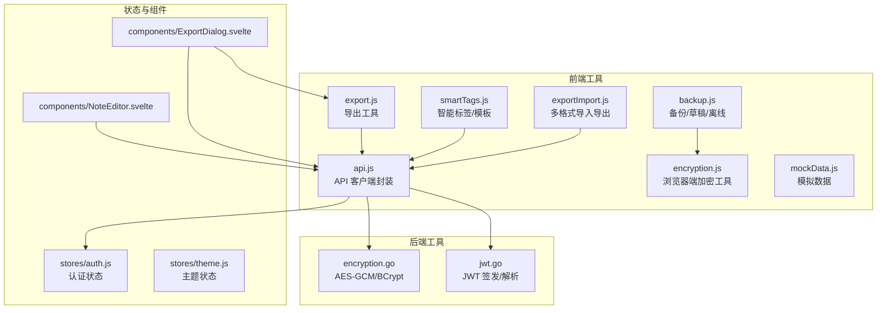
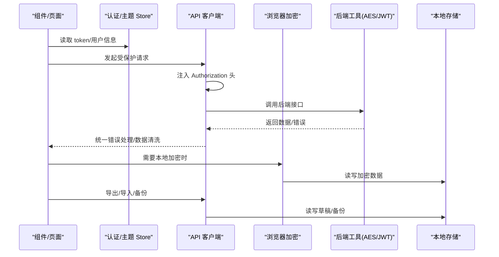
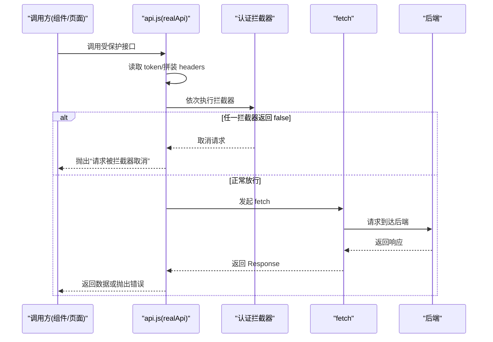
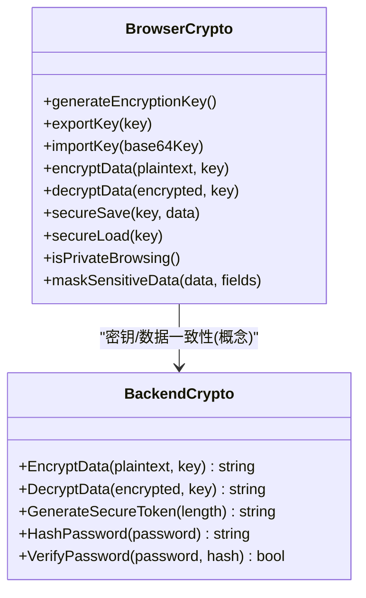
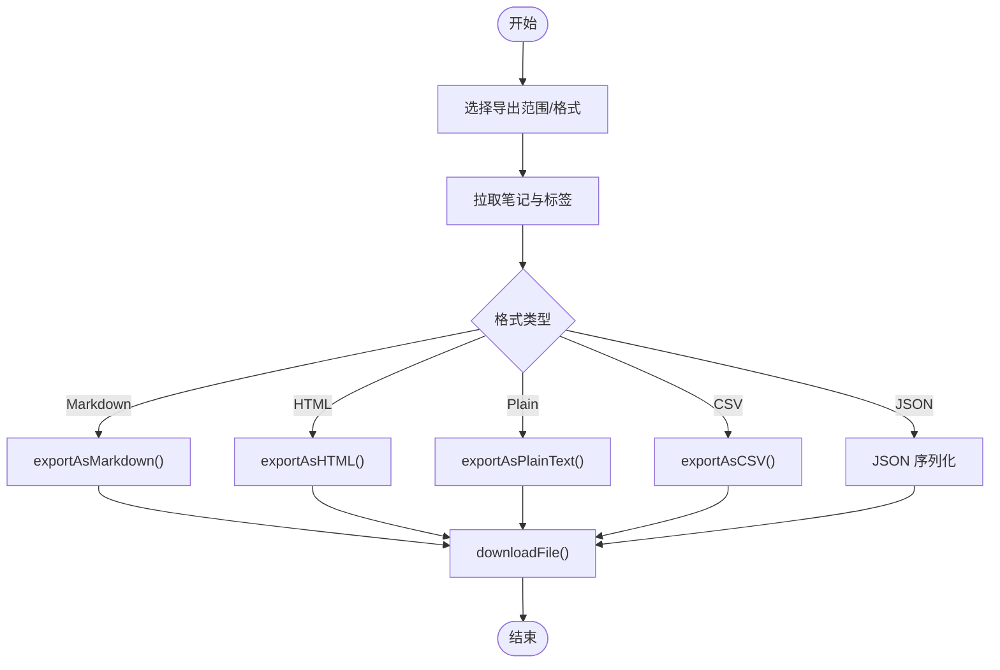
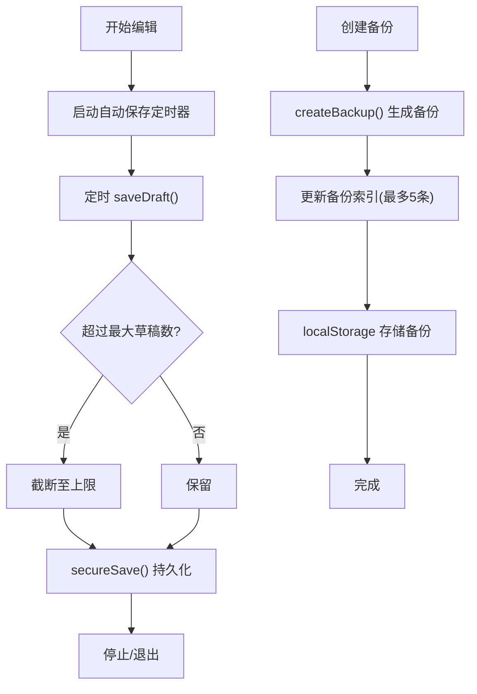
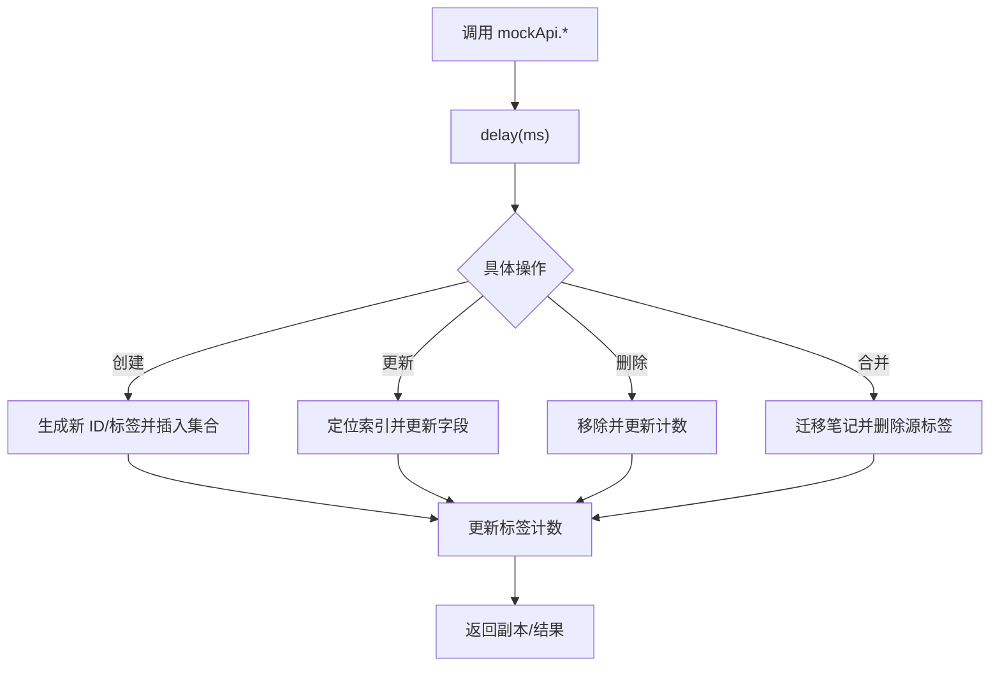
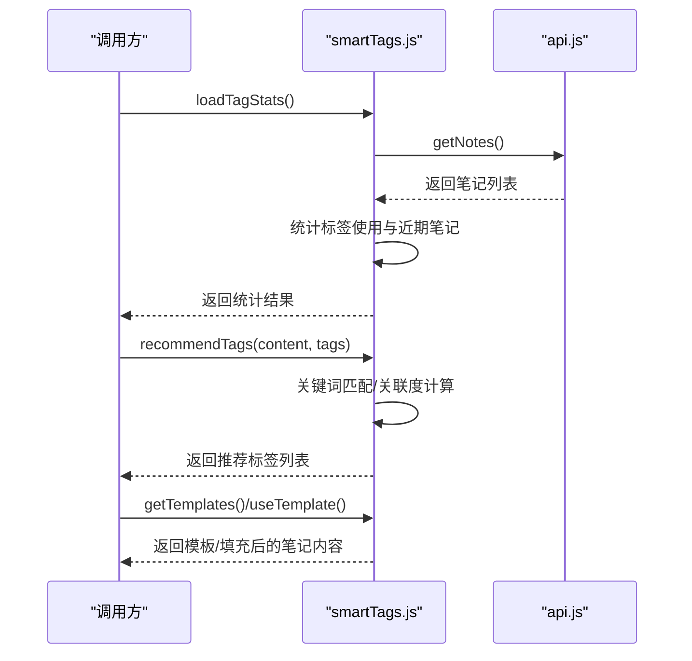
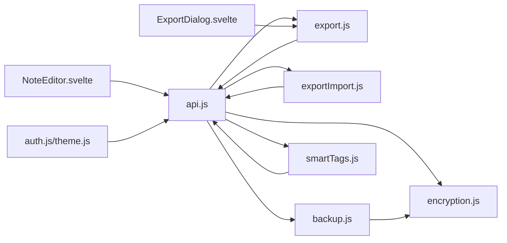

# 工具函数

<cite>
**本文引用的文件**
- [frontend/src/utils/api.js](file://frontend/src/utils/api.js)
- [frontend/src/utils/encryption.js](file://frontend/src/utils/encryption.js)
- [frontend/src/utils/export.js](file://frontend/src/utils/export.js)
- [frontend/src/utils/backup.js](file://frontend/src/utils/backup.js)
- [frontend/src/utils/mockData.js](file://frontend/src/utils/mockData.js)
- [frontend/src/utils/smartTags.js](file://frontend/src/utils/smartTags.js)
- [frontend/src/utils/exportImport.js](file://frontend/src/utils/exportImport.js)
- [backend/utils/encryption.go](file://backend/utils/encryption.go)
- [backend/utils/jwt.go](file://backend/utils/jwt.go)
- [frontend/src/stores/auth.js](file://frontend/src/stores/auth.js)
- [frontend/src/stores/theme.js](file://frontend/src/stores/theme.js)
- [frontend/src/components/ExportDialog.svelte](file://frontend/src/components/ExportDialog.svelte)
- [frontend/src/components/NoteEditor.svelte](file://frontend/src/components/NoteEditor.svelte)
- [frontend/src/utils/api.test.js](file://frontend/src/utils/api.test.js)
</cite>

## 目录
1. [简介](#简介)
2. [项目结构](#项目结构)
3. [核心组件](#核心组件)
4. [架构总览](#架构总览)
5. [详细组件分析](#详细组件分析)
6. [依赖关系分析](#依赖关系分析)
7. [性能考量](#性能考量)
8. [故障排查指南](#故障排查指南)
9. [结论](#结论)
10. [附录](#附录)

## 简介
本文件系统性梳理 Memo Studio 的前端工具函数库，覆盖以下能力域：
- API 客户端封装与认证拦截器、统一错误处理
- 数据加密解密（浏览器端 Web Crypto API 与后端 AES-GCM）
- 数据导入导出（多格式）、备份恢复、离线支持
- 模拟数据生成（用于开发与演示）
- 智能标签处理（使用统计、关键词推荐、模板化）

文档对每个工具函数的职责、参数、返回值、错误处理进行说明，并给出调用流程图、类图与序列图，帮助开发者快速上手与扩展。

## 项目结构
前端工具函数集中于 frontend/src/utils 目录，按功能模块划分；后端工具位于 backend/utils，提供加密与 JWT 工具。组件通过这些工具函数实现业务逻辑。

图表来源
- [frontend/src/utils/api.js](file://frontend/src/utils/api.js#L1-L316)
- [frontend/src/utils/encryption.js](file://frontend/src/utils/encryption.js#L1-L156)
- [frontend/src/utils/export.js](file://frontend/src/utils/export.js#L1-L103)
- [frontend/src/utils/backup.js](file://frontend/src/utils/backup.js#L1-L223)
- [frontend/src/utils/mockData.js](file://frontend/src/utils/mockData.js#L1-L255)
- [frontend/src/utils/smartTags.js](file://frontend/src/utils/smartTags.js#L1-L345)
- [frontend/src/utils/exportImport.js](file://frontend/src/utils/exportImport.js#L1-L321)
- [backend/utils/encryption.go](file://backend/utils/encryption.go#L1-L107)
- [backend/utils/jwt.go](file://backend/utils/jwt.go#L1-L76)
- [frontend/src/stores/auth.js](file://frontend/src/stores/auth.js#L1-L80)
- [frontend/src/stores/theme.js](file://frontend/src/stores/theme.js#L1-L40)
- [frontend/src/components/ExportDialog.svelte](file://frontend/src/components/ExportDialog.svelte#L1-L103)
- [frontend/src/components/NoteEditor.svelte](file://frontend/src/components/NoteEditor.svelte#L1-L200)

章节来源
- [frontend/src/utils/api.js](file://frontend/src/utils/api.js#L1-L316)
- [frontend/src/utils/encryption.js](file://frontend/src/utils/encryption.js#L1-L156)
- [frontend/src/utils/export.js](file://frontend/src/utils/export.js#L1-L103)
- [frontend/src/utils/backup.js](file://frontend/src/utils/backup.js#L1-L223)
- [frontend/src/utils/mockData.js](file://frontend/src/utils/mockData.js#L1-L255)
- [frontend/src/utils/smartTags.js](file://frontend/src/utils/smartTags.js#L1-L345)
- [frontend/src/utils/exportImport.js](file://frontend/src/utils/exportImport.js#L1-L321)
- [backend/utils/encryption.go](file://backend/utils/encryption.go#L1-L107)
- [backend/utils/jwt.go](file://backend/utils/jwt.go#L1-L76)
- [frontend/src/stores/auth.js](file://frontend/src/stores/auth.js#L1-L80)
- [frontend/src/stores/theme.js](file://frontend/src/stores/theme.js#L1-L40)
- [frontend/src/components/ExportDialog.svelte](file://frontend/src/components/ExportDialog.svelte#L1-L103)
- [frontend/src/components/NoteEditor.svelte](file://frontend/src/components/NoteEditor.svelte#L1-L200)

## 核心组件
- API 客户端封装：统一认证头注入、拦截器链、统一错误处理、内容清洗、批量操作。
- 浏览器端加密：基于 Web Crypto API 的 AES-GCM 对称加密、密钥生成与持久化、隐私模式检测、敏感数据脱敏。
- 导出工具：Markdown/JSON/CSV 导出、下载封装、批量导出。
- 备份与草稿：本地加密存储草稿、自动保存定时器、备份索引与数据分离、离线检测与 Service Worker 注册。
- 模拟数据：内存态笔记/标签集合、标签计数、延迟模拟、标签合并与更新。
- 智能标签：标签使用统计、关键词推荐、模板库与动态填充。
- 导入导出（多格式）：支持 JSON/Markdown/纯文本/HTML/CSV，解析与批量创建。
- 后端加密与 JWT：AES-GCM 加密、BCrypt 密码哈希、JWT 签发/解析/刷新。

章节来源
- [frontend/src/utils/api.js](file://frontend/src/utils/api.js#L1-L316)
- [frontend/src/utils/encryption.js](file://frontend/src/utils/encryption.js#L1-L156)
- [frontend/src/utils/export.js](file://frontend/src/utils/export.js#L1-L103)
- [frontend/src/utils/backup.js](file://frontend/src/utils/backup.js#L1-L223)
- [frontend/src/utils/mockData.js](file://frontend/src/utils/mockData.js#L1-L255)
- [frontend/src/utils/smartTags.js](file://frontend/src/utils/smartTags.js#L1-L345)
- [frontend/src/utils/exportImport.js](file://frontend/src/utils/exportImport.js#L1-L321)
- [backend/utils/encryption.go](file://backend/utils/encryption.go#L1-L107)
- [backend/utils/jwt.go](file://backend/utils/jwt.go#L1-L76)

## 架构总览
前端工具函数围绕“API 客户端”为中心，向上提供“加密/导出/备份/智能标签/导入导出”，向下与后端“加密/鉴权”协作。组件通过 store 管理认证与主题状态，驱动工具函数执行业务动作。

图表来源
- [frontend/src/utils/api.js](file://frontend/src/utils/api.js#L53-L76)
- [frontend/src/stores/auth.js](file://frontend/src/stores/auth.js#L20-L75)
- [frontend/src/utils/encryption.js](file://frontend/src/utils/encryption.js#L95-L120)
- [backend/utils/encryption.go](file://backend/utils/encryption.go#L16-L76)
- [backend/utils/jwt.go](file://backend/utils/jwt.go#L29-L66)
- [frontend/src/utils/backup.js](file://frontend/src/utils/backup.js#L12-L67)

## 详细组件分析

### API 客户端封装
- 设计模式
  - 单例式导出 realApi，支持开关 Mock。
  - 认证拦截器链：add/remove，支持在请求前校验/阻断。
  - 统一错误处理：401 清理本地 token 并触发 auth-expired 事件；404/429/其他错误抛出可读错误。
  - 内容清洗：cleanContent/cleanNote，兼容字符串、JSON 字符串化对象、富文本标记清理。
- 请求流程
  - fetchWithAuth 自动注入 Authorization 头，调用拦截器链，再发起 fetch。
  - 所有受保护接口均走 fetchWithAuth，未认证时统一处理。
- 批量操作
  - deleteNotes(ids) 参数校验，批量删除。
- 错误处理
  - 登录/注册/获取当前用户/笔记/标签/搜索等均包含错误分支与用户提示。
- 测试
  - 单元测试验证 Authorization 头注入行为。

图表来源
- [frontend/src/utils/api.js](file://frontend/src/utils/api.js#L5-L76)
- [frontend/src/utils/api.js](file://frontend/src/utils/api.js#L115-L310)
- [frontend/src/utils/api.test.js](file://frontend/src/utils/api.test.js#L19-L36)

章节来源
- [frontend/src/utils/api.js](file://frontend/src/utils/api.js#L1-L316)
- [frontend/src/utils/api.test.js](file://frontend/src/utils/api.test.js#L1-L38)

### 数据加密与解密
- 浏览器端（Web Crypto API）
  - AES-GCM 256 位，随机 IV，iv+data 以 JSON 形式存储。
  - 密钥生成/导出/导入，首次使用自动生成并持久化。
  - secureSave/secureLoad 提供本地加密存取。
  - isPrivateBrowsing 检测隐私模式。
  - maskSensitiveData 对常见敏感字段做脱敏。
- 后端（Go）
  - AES-GCM 加密/解密，密钥派生 SHA-256。
  - BCrypt 密码哈希与校验。
  - JWT 签发/解析/刷新，支持自定义过期时间。

图表来源
- [frontend/src/utils/encryption.js](file://frontend/src/utils/encryption.js#L1-L156)
- [backend/utils/encryption.go](file://backend/utils/encryption.go#L16-L106)

章节来源
- [frontend/src/utils/encryption.js](file://frontend/src/utils/encryption.js#L1-L156)
- [backend/utils/encryption.go](file://backend/utils/encryption.go#L1-L107)

### 数据导入导出
- 导出工具（export.js）
  - exportToMarkdown/JSON/CSV，downloadFile 下载。
  - exportNotes(format) 主入口，支持 markdown/json/csv。
- 多格式导入导出（exportImport.js）
  - exportAsMarkdown/HTML/PlainText/CSV，exportData(format) 主导出。
  - parseImportFile(file) 解析 JSON/Markdown/文本。
  - createNotesFromImport(data, apiClient) 批量创建笔记。
- 组件集成
  - ExportDialog.svelte 调用 export.js 导出所选/全部笔记。
  - NoteEditor.svelte 保存笔记时进行内容清洗与标签提取。

图表来源
- [frontend/src/utils/export.js](file://frontend/src/utils/export.js#L3-L102)
- [frontend/src/utils/exportImport.js](file://frontend/src/utils/exportImport.js#L52-L246)
- [frontend/src/components/ExportDialog.svelte](file://frontend/src/components/ExportDialog.svelte#L20-L42)

章节来源
- [frontend/src/utils/export.js](file://frontend/src/utils/export.js#L1-L103)
- [frontend/src/utils/exportImport.js](file://frontend/src/utils/exportImport.js#L1-L321)
- [frontend/src/components/ExportDialog.svelte](file://frontend/src/components/ExportDialog.svelte#L1-L103)
- [frontend/src/components/NoteEditor.svelte](file://frontend/src/components/NoteEditor.svelte#L66-L109)

### 备份与恢复
- 草稿
  - saveDraft/getDrafts/getDraft/deleteDraft/clearDrafts。
  - startAutoSave/stopAutoSave 定时保存，限制数量与时间间隔。
- 备份
  - createBackup 生成备份并维护索引，最多保留最近 5 个。
  - getBackupList/getBackup/deleteBackup 导出/导入 JSON 文件。
- 离线支持
  - isOnline/registerOfflineListener 监听在线状态。
  - registerServiceWorker 注册 SW。

图表来源
- [frontend/src/utils/backup.js](file://frontend/src/utils/backup.js#L69-L91)
- [frontend/src/utils/backup.js](file://frontend/src/utils/backup.js#L97-L134)
- [frontend/src/utils/backup.js](file://frontend/src/utils/backup.js#L137-L159)

章节来源
- [frontend/src/utils/backup.js](file://frontend/src/utils/backup.js#L1-L223)

### 模拟数据生成
- mockApi 提供 getNotes/getNote/createNote/updateNote/deleteNote/deleteNotes 等 CRUD。
- 标签自动创建与计数更新，mergeTags 合并标签并迁移笔记。
- delay 模拟网络延迟，便于演示与测试。

图表来源
- [frontend/src/utils/mockData.js](file://frontend/src/utils/mockData.js#L54-L244)

章节来源
- [frontend/src/utils/mockData.js](file://frontend/src/utils/mockData.js#L1-L255)

### 智能标签处理
- loadTagStats 基于历史笔记统计标签使用频次与近期笔记关联。
- getFrequentlyUsedTags 返回常用标签子集。
- recommendTags 基于关键词映射与现有标签关联度推荐标签。
- 模板系统：内置模板与自定义模板，支持占位符替换生成笔记草稿。

图表来源
- [frontend/src/utils/smartTags.js](file://frontend/src/utils/smartTags.js#L8-L31)
- [frontend/src/utils/smartTags.js](file://frontend/src/utils/smartTags.js#L43-L125)
- [frontend/src/utils/smartTags.js](file://frontend/src/utils/smartTags.js#L282-L344)

章节来源
- [frontend/src/utils/smartTags.js](file://frontend/src/utils/smartTags.js#L1-L345)

### 认证与主题状态
- 认证状态（auth.js）
  - 从 localStorage 初始化 token/user，subscribe 订阅变化，提供 login/logout/setToken/setUser。
- 主题状态（theme.js）
  - 从 localStorage 初始化主题，订阅变更并同步 DOM 类名。

章节来源
- [frontend/src/stores/auth.js](file://frontend/src/stores/auth.js#L1-L80)
- [frontend/src/stores/theme.js](file://frontend/src/stores/theme.js#L1-L40)

## 依赖关系分析
- 前端工具函数之间耦合度低，通过明确的导出接口相互协作。
- API 客户端依赖后端加密与 JWT 工具（概念层面），实际交互由后端接口承担。
- 组件通过 store 与工具函数解耦，便于测试与替换。

图表来源
- [frontend/src/utils/api.js](file://frontend/src/utils/api.js#L1-L316)
- [frontend/src/utils/encryption.js](file://frontend/src/utils/encryption.js#L1-L156)
- [frontend/src/utils/export.js](file://frontend/src/utils/export.js#L1-L103)
- [frontend/src/utils/exportImport.js](file://frontend/src/utils/exportImport.js#L1-L321)
- [frontend/src/utils/backup.js](file://frontend/src/utils/backup.js#L1-L223)
- [frontend/src/utils/smartTags.js](file://frontend/src/utils/smartTags.js#L1-L345)
- [frontend/src/stores/auth.js](file://frontend/src/stores/auth.js#L1-L80)
- [frontend/src/stores/theme.js](file://frontend/src/stores/theme.js#L1-L40)
- [frontend/src/components/ExportDialog.svelte](file://frontend/src/components/ExportDialog.svelte#L1-L103)
- [frontend/src/components/NoteEditor.svelte](file://frontend/src/components/NoteEditor.svelte#L1-L200)

## 性能考量
- 批量操作
  - 导出/导入采用 Promise 并行拉取数据（如导出时并行获取笔记与标签）。
  - 导入时逐条创建笔记，建议在 UI 层增加进度反馈与失败重试。
- 网络与离线
  - 自动保存间隔 30 秒，避免频繁写入；离线时可结合 Service Worker 提升可用性。
- 加密开销
  - 浏览器端加密为轻量操作；大量数据建议分批处理与节流。
- UI 响应
  - 组件内对富文本进行正则清理与换行处理，注意大文本性能，必要时采用虚拟滚动与懒渲染。

## 故障排查指南
- 认证相关
  - 401 统一清理本地 token 并触发 auth-expired 事件；检查后端 JWT 密钥与签名有效性。
  - 拦截器返回 false 会直接抛错，确认拦截器逻辑。
- 导出失败
  - 检查导出格式与文件名生成；确保浏览器允许下载与跨域。
- 加密异常
  - 浏览器端解密失败返回 null，检查密钥是否一致、数据是否被篡改。
  - 后端解密失败返回错误，检查密文格式与密钥派生。
- 模拟数据
  - 合并标签时若源/目标标签缺失会抛错，先确保标签存在。
- 离线与 Service Worker
  - 注册失败通常为路径或 HTTPS 限制，检查 sw.js 路径与部署环境。

章节来源
- [frontend/src/utils/api.js](file://frontend/src/utils/api.js#L33-L50)
- [frontend/src/utils/encryption.js](file://frontend/src/utils/encryption.js#L48-L67)
- [backend/utils/encryption.go](file://backend/utils/encryption.go#L42-L76)
- [frontend/src/utils/mockData.js](file://frontend/src/utils/mockData.js#L215-L244)
- [frontend/src/utils/backup.js](file://frontend/src/utils/backup.js#L210-L222)

## 结论
Memo Studio 的工具函数库以“API 客户端为核心”，围绕“加密、导入导出、备份、智能标签、模拟数据”形成完整的前端工具链。通过清晰的职责划分、统一的错误处理与可测试的模块化设计，既满足日常使用，也为扩展与维护提供了良好基础。

## 附录
- 使用示例与集成建议
  - API 客户端：在组件中引入 api.js，通过 addAuthInterceptor 注入通用逻辑；对受保护接口统一走 fetchWithAuth。
  - 加密：使用 secureSave/secureLoad 进行本地敏感数据存取；结合 isPrivateBrowsing 提示用户。
  - 导出：在对话框组件中调用 export.js 的 exportNotes；或在业务中使用 exportImport.js 的多格式导出。
  - 备份：在编辑器中调用 startAutoSave/stopAutoSave；备份通过 createBackup 生成并持久化。
  - 智能标签：在编辑器中调用 recommendTags 与 getTemplates/useTemplate 生成笔记草稿。
- 测试方法
  - 单元测试：参考 api.test.js 中对 Authorization 头注入的断言。
  - 集成测试：Mock window/localStorage/fetch，验证拦截器与错误处理链路。
- 最佳实践
  - 对外暴露稳定接口，内部实现可替换（如 Mock 开关）。
  - 对大对象与富文本进行必要的清洗与分页处理。
  - 对关键路径（保存、导出、导入）增加重试与回滚策略。