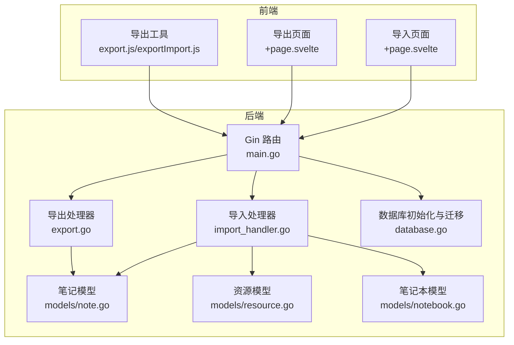
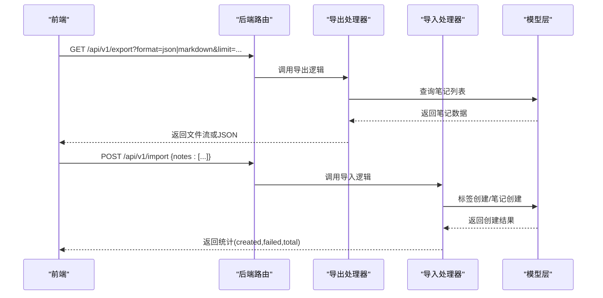
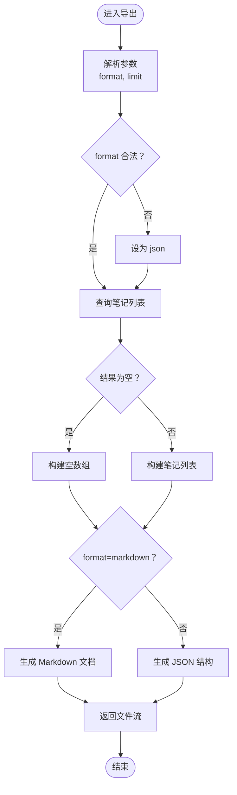
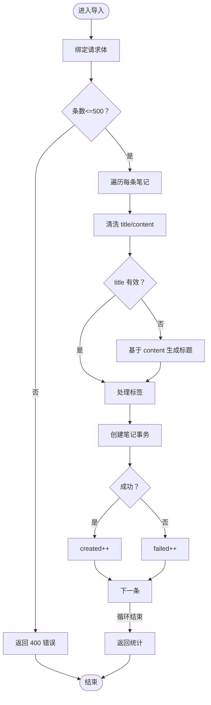
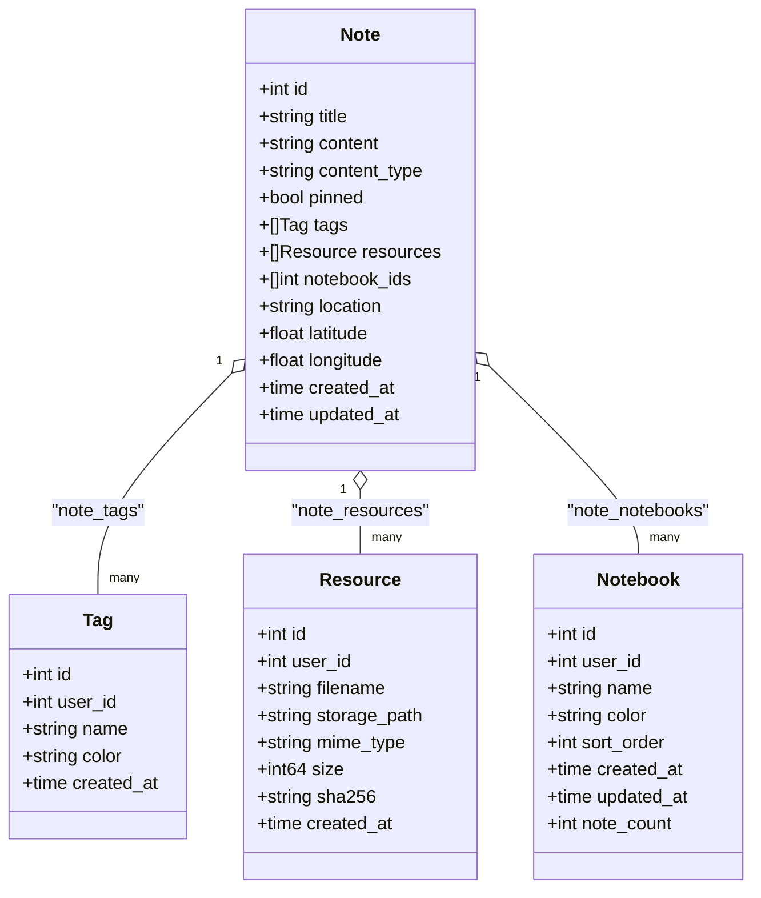
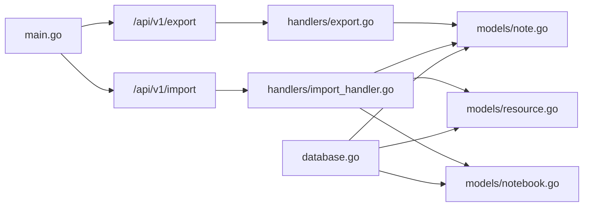

# 数据导入导出

<cite>
**本文引用的文件**
- [backend/main.go](file://backend/main.go)
- [backend/handlers/export.go](file://backend/handlers/export.go)
- [backend/handlers/import_handler.go](file://backend/handlers/import_handler.go)
- [backend/models/note.go](file://backend/models/note.go)
- [backend/models/resource.go](file://backend/models/resource.go)
- [backend/models/notebook.go](file://backend/models/notebook.go)
- [backend/database/database.go](file://backend/database/database.go)
- [frontend/src/utils/export.js](file://frontend/src/utils/export.js)
- [frontend/src/utils/exportImport.js](file://frontend/src/utils/exportImport.js)
- [frontend/src/components/ExportDialog.svelte](file://frontend/src/components/ExportDialog.svelte)
- [kit/src/routes/export/+page.svelte](file://kit/src/routes/export/+page.svelte)
- [kit/src/routes/import/+page.svelte](file://kit/src/routes/import/+page.svelte)
- [frontend/src/utils/backup.js](file://frontend/src/utils/backup.js)
</cite>

## 目录
1. [简介](#简介)
2. [项目结构](#项目结构)
3. [核心组件](#核心组件)
4. [架构总览](#架构总览)
5. [详细组件分析](#详细组件分析)
6. [依赖关系分析](#依赖关系分析)
7. [性能考量](#性能考量)
8. [故障排查指南](#故障排查指南)
9. [结论](#结论)
10. [附录](#附录)

## 简介
本章节概述 Memo Studio 的数据导入导出能力，包括支持的格式、文件结构、批量处理策略、错误恢复与进度跟踪、备份恢复策略、版本兼容性与大规模数据优化建议。文档面向开发者与运维人员，既提供代码级实现细节，也给出使用示例与最佳实践。

## 项目结构
- 后端采用 Go + Gin 框架，提供 /api/v1 导出与导入接口，以及配套的笔记、标签、资源、笔记本等模型层。
- 前端提供两种导出路径：浏览器侧工具函数导出（CSV/JSON/Markdown）与 SvelteKit 页面导出（JSON/Markdown）。
- 导入支持 JSON/Markdown/TXT，前端解析后调用后端导入接口进行批量入库。
- 数据库采用 SQLite，内置多版本迁移与多用户隔离、标签唯一性约束、笔记本与资源表等结构。

图表来源
- [backend/main.go](file://backend/main.go#L94-L196)
- [backend/handlers/export.go](file://backend/handlers/export.go#L15-L81)
- [backend/handlers/import_handler.go](file://backend/handlers/import_handler.go#L24-L84)
- [backend/models/note.go](file://backend/models/note.go#L46-L105)
- [backend/models/resource.go](file://backend/models/resource.go#L36-L76)
- [backend/models/notebook.go](file://backend/models/notebook.go#L67-L106)
- [backend/database/database.go](file://backend/database/database.go#L20-L60)

章节来源
- [backend/main.go](file://backend/main.go#L94-L196)
- [backend/handlers/export.go](file://backend/handlers/export.go#L15-L81)
- [backend/handlers/import_handler.go](file://backend/handlers/import_handler.go#L24-L84)
- [backend/models/note.go](file://backend/models/note.go#L46-L105)
- [backend/models/resource.go](file://backend/models/resource.go#L36-L76)
- [backend/models/notebook.go](file://backend/models/notebook.go#L67-L106)
- [backend/database/database.go](file://backend/database/database.go#L20-L60)

## 核心组件
- 导出接口
  - 支持格式：JSON、Markdown
  - 参数：format=json|markdown，limit=1..2000
  - 返回：服务端生成文件流或 JSON 结构
- 导入接口
  - 请求体：notes=[{title,content,tags}]
  - 单次上限：500 条
  - 标题补全：当 title 缺失但 content 存在时，截断 content 作为标题
  - 标签处理：若标签不存在则自动创建
  - 成功/失败统计：返回 created、failed、total
- 前端导出工具
  - 提供 Markdown/JSON/CSV 三格式导出函数与下载封装
  - 支持按选中笔记或全部笔记导出
- 前端导入工具
  - 支持 JSON/MD/TXT 解析
  - 将解析结果批量创建笔记

章节来源
- [backend/handlers/export.go](file://backend/handlers/export.go#L15-L81)
- [backend/handlers/import_handler.go](file://backend/handlers/import_handler.go#L24-L84)
- [frontend/src/utils/export.js](file://frontend/src/utils/export.js#L76-L102)
- [frontend/src/utils/exportImport.js](file://frontend/src/utils/exportImport.js#L179-L246)
- [frontend/src/components/ExportDialog.svelte](file://frontend/src/components/ExportDialog.svelte#L20-L42)

## 架构总览
后端通过 Gin 路由暴露 /api/v1/export 与 /api/v1/import，分别委托给导出与导入处理器。处理器读取模型层数据，构造响应并返回。前端提供两类导出入口：页面导出（SvelteKit）与工具函数导出（浏览器侧）。导入流程由前端解析文件后调用后端导入接口完成。

图表来源
- [backend/main.go](file://backend/main.go#L149-L151)
- [backend/handlers/export.go](file://backend/handlers/export.go#L15-L81)
- [backend/handlers/import_handler.go](file://backend/handlers/import_handler.go#L24-L84)
- [backend/models/note.go](file://backend/models/note.go#L46-L105)

## 详细组件分析

### 导出组件分析
- 接口行为
  - format 参数仅接受 json 或 markdown，默认 json
  - limit 限制范围 1..2000，超出范围将被裁剪
  - Markdown 导出：生成带标题、标签、内容与分隔线的文档
  - JSON 导出：包含 exported_at、count、notes 字段
- 文件生成
  - Markdown：设置 Content-Type 为 text/markdown，Content-Disposition 为 .md 文件
  - JSON：设置 Content-Type 为 application/json，文件名为 memo-export-YYYYMMDD-HHMMSS.json
- 错误处理
  - 查询失败返回 500 与错误信息
  - notes 为空时返回空数组

图表来源
- [backend/handlers/export.go](file://backend/handlers/export.go#L15-L81)

章节来源
- [backend/handlers/export.go](file://backend/handlers/export.go#L15-L81)

### 导入组件分析
- 请求体结构
  - notes: 数组，元素包含 title、content、tags
- 导入规则
  - 单次最多 500 条
  - 标题为空但内容非空：截断前 77 字符作为标题
  - 标题仍为空：使用“未命名”
  - 标签去重与自动创建：CreateTagIfNotExists
  - 笔记创建：CreateNote（事务内插入笔记、标签关联、资源关联）
- 统计输出
  - created：成功创建数量
  - failed：失败数量
  - total：提交条数

图表来源
- [backend/handlers/import_handler.go](file://backend/handlers/import_handler.go#L24-L84)
- [backend/models/note.go](file://backend/models/note.go#L46-L105)

章节来源
- [backend/handlers/import_handler.go](file://backend/handlers/import_handler.go#L24-L84)
- [backend/models/note.go](file://backend/models/note.go#L46-L105)

### 前端导出工具分析
- 工具函数导出
  - exportToMarkdown/exportToJSON/exportToCSV：生成对应格式字符串
  - downloadFile：Blob 下载封装
  - exportNotes：根据 format 选择导出并触发下载
- SvelteKit 页面导出
  - +page.svelte：提供 format 与 limit 控件，调用 API 导出并下载
- 导出页面（ExportDialog.svelte）
  - 支持导出全部或选中笔记，支持 Markdown/JSON/CSV

章节来源
- [frontend/src/utils/export.js](file://frontend/src/utils/export.js#L3-L102)
- [frontend/src/utils/exportImport.js](file://frontend/src/utils/exportImport.js#L179-L246)
- [frontend/src/components/ExportDialog.svelte](file://frontend/src/components/ExportDialog.svelte#L20-L42)
- [kit/src/routes/export/+page.svelte](file://kit/src/routes/export/+page.svelte#L17-L53)

### 前端导入工具分析
- parseImportFile：根据扩展名解析 JSON/MD/TXT
- parseMarkdown：解析 Markdown 中的标题、标签与内容
- createNotesFromImport：逐条调用后端创建笔记接口

章节来源
- [frontend/src/utils/exportImport.js](file://frontend/src/utils/exportImport.js#L250-L320)

### 数据模型与关系
- 笔记 Note：包含标题、内容、类型、标签、资源、笔记本 ID 列表、位置信息、时间戳
- 标签 Tag：用户隔离、唯一性约束（user_id,name）
- 资源 Resource：文件名、存储路径、MIME、大小、SHA256、URL
- 笔记本 Notebook：用户、名称、颜色、排序、笔记计数

图表来源
- [backend/models/note.go](file://backend/models/note.go#L11-L27)
- [backend/models/notebook.go](file://backend/models/notebook.go#L10-L19)
- [backend/models/resource.go](file://backend/models/resource.go#L10-L20)

章节来源
- [backend/models/note.go](file://backend/models/note.go#L11-L27)
- [backend/models/notebook.go](file://backend/models/notebook.go#L10-L19)
- [backend/models/resource.go](file://backend/models/resource.go#L10-L20)

## 依赖关系分析
- 路由与处理器
  - main.go 注册 /api/v1/export 与 /api/v1/import
  - 导出处理器依赖模型层 ListMemos
  - 导入处理器依赖 CreateNote、CreateTagIfNotExists
- 数据库迁移
  - database.go 包含 v1..v9 迁移，涵盖笔记扩展字段、资源表、用户权限、多用户隔离、笔记本与位置字段等
- 前后端交互
  - 前端导出页面通过 API 获取数据并下载
  - 前端导入页面解析文件后调用导入接口

图表来源
- [backend/main.go](file://backend/main.go#L149-L151)
- [backend/handlers/export.go](file://backend/handlers/export.go#L15-L81)
- [backend/handlers/import_handler.go](file://backend/handlers/import_handler.go#L24-L84)
- [backend/models/note.go](file://backend/models/note.go#L46-L105)
- [backend/models/resource.go](file://backend/models/resource.go#L36-L76)
- [backend/models/notebook.go](file://backend/models/notebook.go#L67-L106)
- [backend/database/database.go](file://backend/database/database.go#L62-L177)

章节来源
- [backend/main.go](file://backend/main.go#L149-L151)
- [backend/database/database.go](file://backend/database/database.go#L62-L177)

## 性能考量
- 导出
  - limit 上限 2000，避免一次性拉取过多数据造成内存压力
  - Markdown 导出为流式拼接，JSON 导出为对象序列化
- 导入
  - 单次最多 500 条，减少事务开销与网络往返
  - 标签创建使用按需创建策略，避免重复查询
- 数据库
  - WAL 模式、外键开启、超时设置提升并发与稳定性
  - 多版本迁移确保 schema 一致与向前兼容
- 前端
  - 导出工具使用 Blob 下载，避免大字符串在内存中驻留过久
  - 导入解析采用流式行处理（Markdown）

章节来源
- [backend/handlers/export.go](file://backend/handlers/export.go#L21-L31)
- [backend/handlers/import_handler.go](file://backend/handlers/import_handler.go#L38-L41)
- [backend/database/database.go](file://backend/database/database.go#L45-L52)
- [frontend/src/utils/export.js](file://frontend/src/utils/export.js#L64-L74)

## 故障排查指南
- 导出失败
  - 检查 limit 是否超过 2000
  - 确认用户身份与权限
  - 查看后端日志与响应错误信息
- 导入失败
  - 确认请求体格式正确，notes 数组非空
  - 单次导入不超过 500 条
  - 标题为空时 content 是否过长（将被截断）
  - 标签是否重复或为空
- 前端下载异常
  - 检查浏览器下载权限与弹窗拦截
  - 确认 MIME 类型与文件扩展名匹配
- 数据库迁移
  - 若出现 schema 不一致，确认 user_version 与迁移顺序
  - 检查 SQLite 版本与 FTS5 支持情况

章节来源
- [backend/handlers/export.go](file://backend/handlers/export.go#L37-L40)
- [backend/handlers/import_handler.go](file://backend/handlers/import_handler.go#L30-L41)
- [frontend/src/utils/export.js](file://frontend/src/utils/export.js#L64-L74)
- [backend/database/database.go](file://backend/database/database.go#L62-L177)

## 结论
Memo Studio 的导入导出体系以简洁的接口与清晰的数据模型为核心，支持多种格式与批量处理，并通过数据库迁移与多用户隔离保障数据完整性与版本兼容性。前端提供了灵活的导出入口与导入解析工具，满足日常备份与迁移需求。建议在生产环境中配合合理的限流、鉴权与监控策略，确保大规模数据处理的稳定性。

## 附录

### 使用示例与格式规范
- 导出
  - JSON：包含 exported_at、count、notes 字段
  - Markdown：包含标题、标签、内容与分隔线
  - 页面导出：支持 JSON/Markdown，limit 最大 2000
- 导入
  - JSON：notes 数组，每条包含 title、content、tags
  - Markdown：按行解析标题、标签与内容
  - TXT：按行解析标题、标签与内容
  - 单次最多 500 条

章节来源
- [backend/handlers/export.go](file://backend/handlers/export.go#L74-L81)
- [frontend/src/utils/exportImport.js](file://frontend/src/utils/exportImport.js#L250-L297)
- [kit/src/routes/export/+page.svelte](file://kit/src/routes/export/+page.svelte#L74-L89)

### 备份恢复策略
- 前端本地备份
  - 导出为 JSON 文件，包含 notes 与 tags
  - 支持从 JSON 文件导入
- 数据库层面
  - SQLite 文件即备份，可直接复制 notes.db
  - 迁移脚本确保 schema 向后兼容

章节来源
- [frontend/src/utils/backup.js](file://frontend/src/utils/backup.js#L161-L194)
- [backend/database/database.go](file://backend/database/database.go#L62-L177)

### 版本兼容性与迁移
- 迁移版本（v1..v9）
  - 基础 schema、笔记扩展字段、资源表、用户权限、多用户隔离、标签唯一性、笔记本、位置字段
- 建议
  - 升级前备份 notes.db
  - 使用默认迁移脚本，避免手动修改 schema

章节来源
- [backend/database/database.go](file://backend/database/database.go#L62-L177)