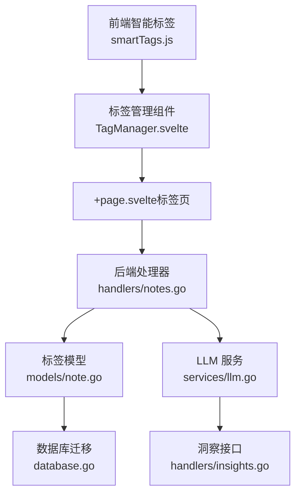
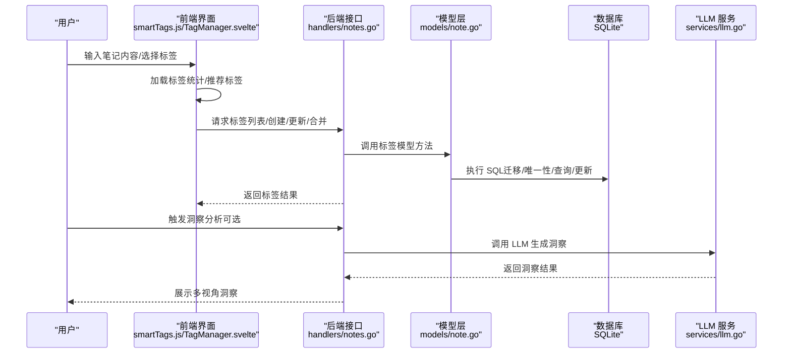
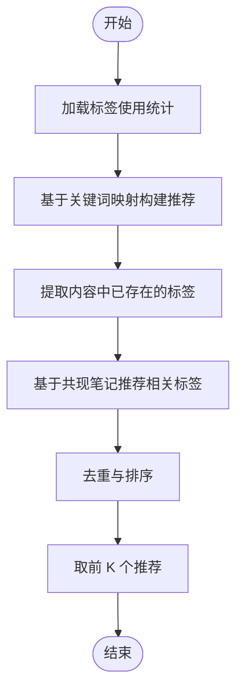
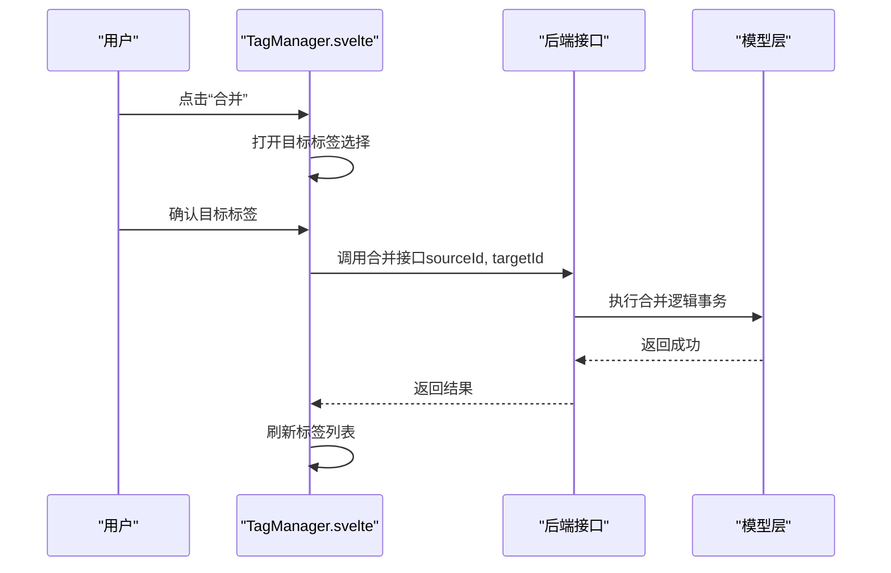
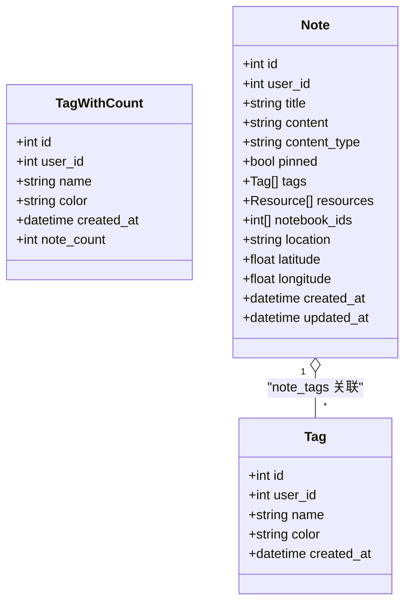
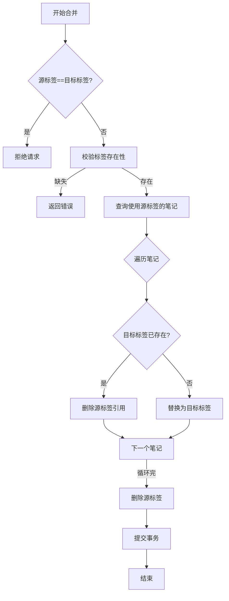
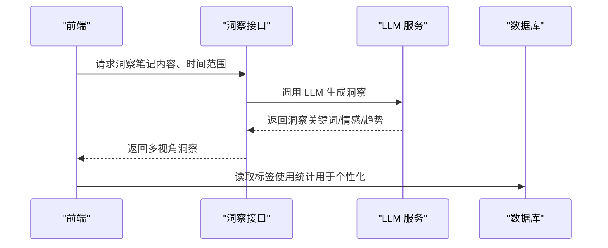
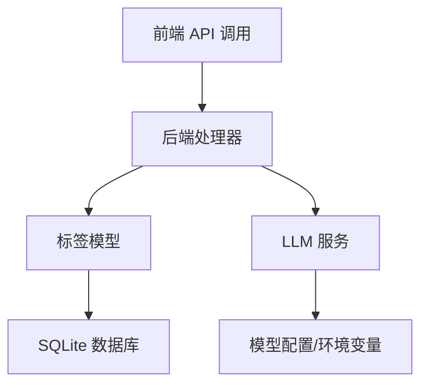

# 智能标签处理

<cite>
**本文引用的文件**
- [smartTags.js](file://frontend/src/utils/smartTags.js)
- [TagManager.svelte](file://frontend/src/components/TagManager.svelte)
- [+page.svelte（标签页面）](file://kit/src/routes/tags/+page.svelte)
- [notes.go（模型）](file://backend/models/note.go)
- [notes.go（处理器）](file://backend/handlers/notes.go)
- [database.go（迁移）](file://backend/database/database.go)
- [llm.go（服务）](file://backend/services/llm.go)
- [insights.go（处理器）](file://backend/handlers/insights.go)
- [mockData.js（模拟数据）](file://frontend/src/utils/mockData.js)
</cite>

## 目录
1. [简介](#简介)
2. [项目结构](#项目结构)
3. [核心组件](#核心组件)
4. [架构总览](#架构总览)
5. [详细组件分析](#详细组件分析)
6. [依赖关系分析](#依赖关系分析)
7. [性能考量](#性能考量)
8. [故障排查指南](#故障排查指南)
9. [结论](#结论)
10. [附录](#附录)

## 简介
本技术文档围绕 Memo Studio 的“智能标签处理”能力展开，系统性阐述标签自动识别、智能建议、标签合并、冲突检测与修复、历史标签迁移、以及标签语义分析与个性化推荐策略。文档结合前端智能推荐模块、后端标签模型与处理器、数据库迁移脚本、以及 LLM 洞察服务，给出端到端的实现机制与扩展建议。

## 项目结构
- 前端智能标签与标签管理
  - 智能推荐与模板：frontend/src/utils/smartTags.js
  - 标签管理界面（Kit 路由）：kit/src/routes/tags/+page.svelte
  - 标签管理界面（通用组件）：frontend/src/components/TagManager.svelte
- 后端标签模型与接口
  - 标签模型与操作：backend/models/note.go
  - 标签相关 API：backend/handlers/notes.go
  - 数据库迁移（含标签唯一性与多用户隔离）：backend/database/database.go
- LLM 洞察与语义分析
  - LLM 服务封装：backend/services/llm.go
  - 洞察接口与多视角输出：backend/handlers/insights.go
- 模拟数据与合并逻辑验证
  - 前端模拟数据与标签合并流程：frontend/src/utils/mockData.js

图表来源
- [smartTags.js](file://frontend/src/utils/smartTags.js#L1-L345)
- [TagManager.svelte](file://frontend/src/components/TagManager.svelte#L1-L212)
- [+page.svelte（标签页面）](file://kit/src/routes/tags/+page.svelte#L1-L457)
- [notes.go（处理器）](file://backend/handlers/notes.go#L355-L513)
- [notes.go（模型）](file://backend/models/note.go#L394-L729)
- [database.go（迁移）](file://backend/database/database.go#L62-L178)
- [llm.go（服务）](file://backend/services/llm.go#L533-L641)
- [insights.go（处理器）](file://backend/handlers/insights.go#L68-L142)

章节来源
- [smartTags.js](file://frontend/src/utils/smartTags.js#L1-L345)
- [TagManager.svelte](file://frontend/src/components/TagManager.svelte#L1-L212)
- [+page.svelte（标签页面）](file://kit/src/routes/tags/+page.svelte#L1-L457)
- [notes.go（处理器）](file://backend/handlers/notes.go#L355-L513)
- [notes.go（模型）](file://backend/models/note.go#L394-L729)
- [database.go（迁移）](file://backend/database/database.go#L62-L178)
- [llm.go（服务）](file://backend/services/llm.go#L533-L641)
- [insights.go（处理器）](file://backend/handlers/insights.go#L68-L142)

## 核心组件
- 智能标签推荐引擎（前端）
  - 基于内容关键词映射与已有标签关联的推荐函数，支持去重与排序。
  - 提供标签使用统计加载与常用标签筛选，支撑个性化推荐。
- 标签管理界面（前端）
  - 提供编辑、删除、合并标签的交互，触发后端对应 API。
- 标签模型与处理器（后端）
  - 提供标签增删改查、标签合并、标签计数查询等能力。
  - 支持多用户隔离与标签唯一性约束迁移。
- LLM 洞察与语义分析（后端）
  - 提供主题、情感等多视角洞察，作为标签语义分析与上下文理解的补充。
- 数据库迁移（后端）
  - 实现标签唯一性从全局到“用户+名称”的迁移，确保多用户隔离。

章节来源
- [smartTags.js](file://frontend/src/utils/smartTags.js#L9-L125)
- [TagManager.svelte](file://frontend/src/components/TagManager.svelte#L28-L93)
- [+page.svelte（标签页面）](file://kit/src/routes/tags/+page.svelte#L25-L127)
- [notes.go（模型）](file://backend/models/note.go#L394-L729)
- [notes.go（处理器）](file://backend/handlers/notes.go#L355-L513)
- [database.go（迁移）](file://backend/database/database.go#L133-L177)
- [llm.go（服务）](file://backend/services/llm.go#L533-L641)
- [insights.go（处理器）](file://backend/handlers/insights.go#L68-L142)

## 架构总览
智能标签处理贯穿“前端推荐—后端模型—数据库—LLM洞察”的全链路：

图表来源
- [smartTags.js](file://frontend/src/utils/smartTags.js#L9-L125)
- [TagManager.svelte](file://frontend/src/components/TagManager.svelte#L28-L93)
- [notes.go（处理器）](file://backend/handlers/notes.go#L355-L513)
- [notes.go（模型）](file://backend/models/note.go#L394-L729)
- [database.go（迁移）](file://backend/database/database.go#L133-L177)
- [llm.go（服务）](file://backend/services/llm.go#L533-L641)

## 详细组件分析

### 组件A：智能标签推荐引擎（前端）
- 功能要点
  - 加载标签使用统计，构建标签计数与最近笔记集合。
  - 基于关键词映射与内容中的已有标签，计算推荐分数并去重排序。
  - 支持“常用标签”筛选，便于快速插入。
- 复杂度与性能
  - 统计构建：遍历所有笔记，时间复杂度 O(N_notes)，空间复杂度 O(N_tags)。
  - 推荐过程：关键词映射与内容匹配，时间复杂度近似 O(N_tags*N_keywords)。
- 可扩展点
  - 引入 TF-IDF 或向量相似度提升跨笔记语义关联。
  - 结合 LLM 输出的主题词增强关键词映射。

图表来源
- [smartTags.js](file://frontend/src/utils/smartTags.js#L9-L125)

章节来源
- [smartTags.js](file://frontend/src/utils/smartTags.js#L9-L125)

### 组件B：标签管理界面（前端）
- 功能要点
  - 编辑标签名称与颜色，删除标签（从笔记中移除但保留笔记）。
  - 合并标签：将源标签的所有笔记归并到目标标签并删除源标签。
- 交互流程
  - 用户点击“合并”，弹出目标标签选择，确认后调用后端合并接口。
  - 合并完成后刷新列表并触发更新事件。

图表来源
- [TagManager.svelte](file://frontend/src/components/TagManager.svelte#L79-L93)
- [notes.go（处理器）](file://backend/handlers/notes.go#L480-L513)
- [notes.go（模型）](file://backend/models/note.go#L670-L729)

章节来源
- [TagManager.svelte](file://frontend/src/components/TagManager.svelte#L28-L93)
- [+page.svelte（标签页面）](file://kit/src/routes/tags/+page.svelte#L59-L127)
- [notes.go（处理器）](file://backend/handlers/notes.go#L480-L513)
- [notes.go（模型）](file://backend/models/note.go#L670-L729)

### 组件C：标签模型与处理器（后端）
- 核心能力
  - 标签增删改查、标签计数查询、根据名称获取标签、创建标签（若不存在）。
  - 合并标签：事务内处理“已有目标标签则删除源标签，否则替换”。
- 数据一致性
  - 合并过程通过事务保证原子性，避免脏数据。
- 多用户隔离
  - 迁移 v6 将标签加入 user_id 字段并迁移历史数据。
  - 迁移 v7 将 tags.name 的全局唯一约束改为 (user_id, name) 唯一索引。

图表来源
- [notes.go（模型）](file://backend/models/note.go#L11-L44)

章节来源
- [notes.go（模型）](file://backend/models/note.go#L394-L729)
- [notes.go（处理器）](file://backend/handlers/notes.go#L355-L513)
- [database.go（迁移）](file://backend/database/database.go#L133-L177)

### 组件D：标签合并与冲突检测（后端）
- 合并策略
  - 对每个使用源标签的笔记：若目标标签已存在则仅删除源标签，否则将源标签替换为目标标签。
  - 最终删除源标签，保证无孤立引用。
- 冲突检测与修复
  - 若源标签与目标标签相同，接口直接拒绝。
  - 若标签不存在，接口返回错误。
- 历史标签迁移
  - 迁移 v6 将历史 notes/tags 的 user_id 从 NULL 迁移到主用户，避免“所有人共享数据”。

图表来源
- [notes.go（模型）](file://backend/models/note.go#L670-L729)
- [notes.go（处理器）](file://backend/handlers/notes.go#L480-L513)
- [database.go（迁移）](file://backend/database/database.go#L564-L591)

章节来源
- [notes.go（模型）](file://backend/models/note.go#L670-L729)
- [notes.go（处理器）](file://backend/handlers/notes.go#L480-L513)
- [database.go（迁移）](file://backend/database/database.go#L564-L591)

### 组件E：标签语义分析与个性化推荐（LLM）
- 语义分析
  - LLM 服务封装多种云端/本地模型，支持洞察生成与总结。
  - 洞察接口支持多视角输出（主题、情感等），可作为标签语义分析的补充。
- 个性化推荐策略
  - 前端可结合 LLM 的关键词与类别输出，动态扩展关键词映射，提升推荐准确性。
  - 基于用户历史标签使用统计与 LLM 主题洞察，形成“内容—主题—标签”的三层匹配。

图表来源
- [insights.go（处理器）](file://backend/handlers/insights.go#L68-L142)
- [llm.go（服务）](file://backend/services/llm.go#L533-L641)
- [smartTags.js](file://frontend/src/utils/smartTags.js#L9-L31)

章节来源
- [insights.go（处理器）](file://backend/handlers/insights.go#L68-L142)
- [llm.go（服务）](file://backend/services/llm.go#L533-L641)
- [smartTags.js](file://frontend/src/utils/smartTags.js#L9-L31)

## 依赖关系分析
- 前端依赖
  - smartTags.js 依赖后端标签接口（通过 api.js），并在本地维护标签使用统计。
  - 标签管理组件依赖后端标签 CRUD 与合并接口。
- 后端依赖
  - 标签处理器依赖标签模型，标签模型依赖数据库连接与迁移脚本。
  - 洞察接口依赖 LLM 服务，LLM 服务依赖模型配置与网络请求。
- 数据库依赖
  - 迁移脚本确保标签唯一性与多用户隔离，影响标签模型与处理器的行为。

图表来源
- [notes.go（处理器）](file://backend/handlers/notes.go#L355-L513)
- [notes.go（模型）](file://backend/models/note.go#L394-L729)
- [database.go（迁移）](file://backend/database/database.go#L62-L178)
- [llm.go（服务）](file://backend/services/llm.go#L289-L336)

章节来源
- [notes.go（处理器）](file://backend/handlers/notes.go#L355-L513)
- [notes.go（模型）](file://backend/models/note.go#L394-L729)
- [database.go（迁移）](file://backend/database/database.go#L62-L178)
- [llm.go（服务）](file://backend/services/llm.go#L289-L336)

## 性能考量
- 前端推荐
  - 标签统计加载建议在应用启动时异步执行，避免频繁重复请求。
  - 推荐算法可引入缓存与增量更新，减少重复计算。
- 后端合并
  - 合并操作使用事务，确保一致性；对大量笔记的合并建议分批处理并提供进度反馈。
- 数据库
  - 迁移脚本一次性执行，生产环境需在低峰期进行；SQLite 的 WAL 模式与超时设置有助于并发稳定性。
- LLM
  - 洞察与总结接口建议增加超时控制与错误降级（基础分析），避免阻塞前端体验。

## 故障排查指南
- 标签合并失败
  - 检查源标签与目标标签是否相同，检查标签是否存在。
  - 查看后端日志定位事务执行错误。
- 标签唯一性冲突
  - 确认迁移是否完成，确保 (user_id, name) 唯一索引生效。
- LLM 未返回洞察
  - 检查环境变量（API Key/BaseURL/Model）是否正确配置。
  - 网络连通性与超时设置是否合理。
- 前端推荐异常
  - 确认标签统计加载成功，检查关键词映射是否覆盖目标标签。

章节来源
- [notes.go（处理器）](file://backend/handlers/notes.go#L480-L513)
- [database.go（迁移）](file://backend/database/database.go#L133-L177)
- [llm.go（服务）](file://backend/services/llm.go#L289-L336)
- [smartTags.js](file://frontend/src/utils/smartTags.js#L9-L125)

## 结论
Memo Studio 的智能标签处理以“前端推荐 + 后端模型 + 数据库迁移 + LLM 洞察”为核心，实现了从标签自动识别、智能建议、合并修复到语义分析与个性化推荐的闭环。通过事务化的标签合并与多用户隔离的迁移策略，系统在一致性与扩展性上具备良好基础。未来可在关键词映射、向量相似度、LLM 主题增强等方面进一步优化，提升推荐准确度与用户体验。

## 附录
- 使用示例
  - 在笔记编辑器中输入内容，前端将自动加载标签统计并推荐相关标签。
  - 在标签页中编辑/删除/合并标签，后端通过事务保证数据一致。
- 配置选项
  - LLM 模型与密钥：通过环境变量配置（LLM_MODEL_TYPE/LLM_API_KEY/LLM_BASE_URL/LLM_MODEL）。
  - 数据库路径：通过环境变量 MEMO_DB_PATH 指定。
- 性能调优
  - 前端：缓存标签统计、延迟加载、分页展示。
  - 后端：合并批处理、索引优化、WAL 模式与超时设置。
- 扩展建议
  - 引入 TF-IDF/向量相似度与 LLM 主题词，增强跨笔记语义关联。
  - 提供标签冲突可视化与自动修复建议（基于 LLM）。