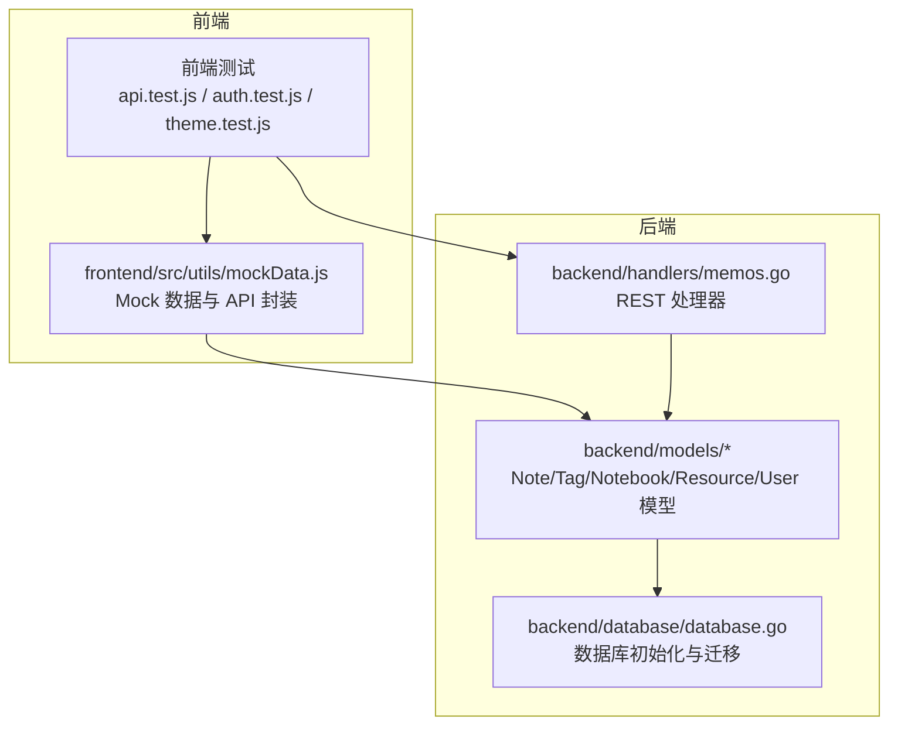
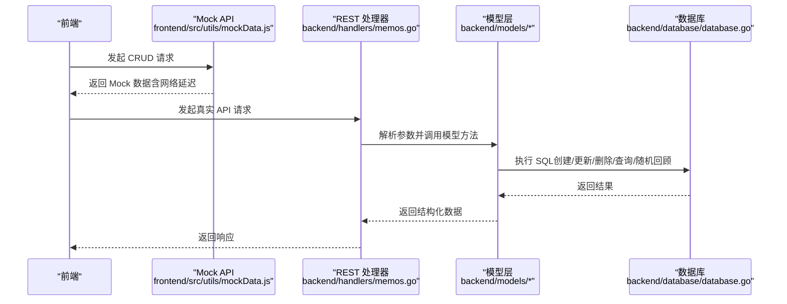
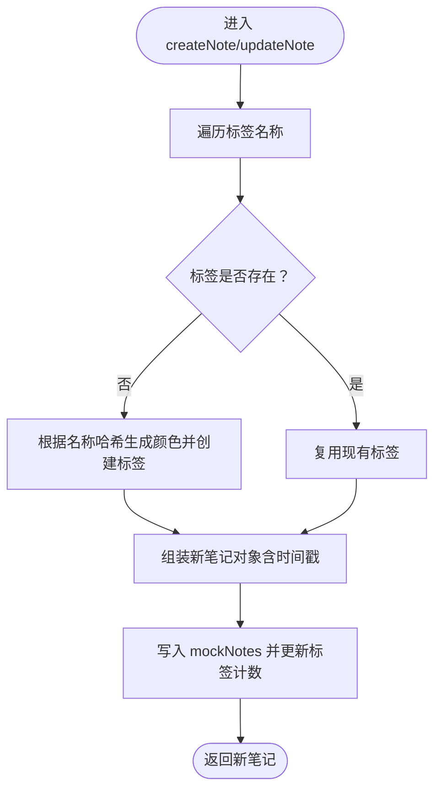
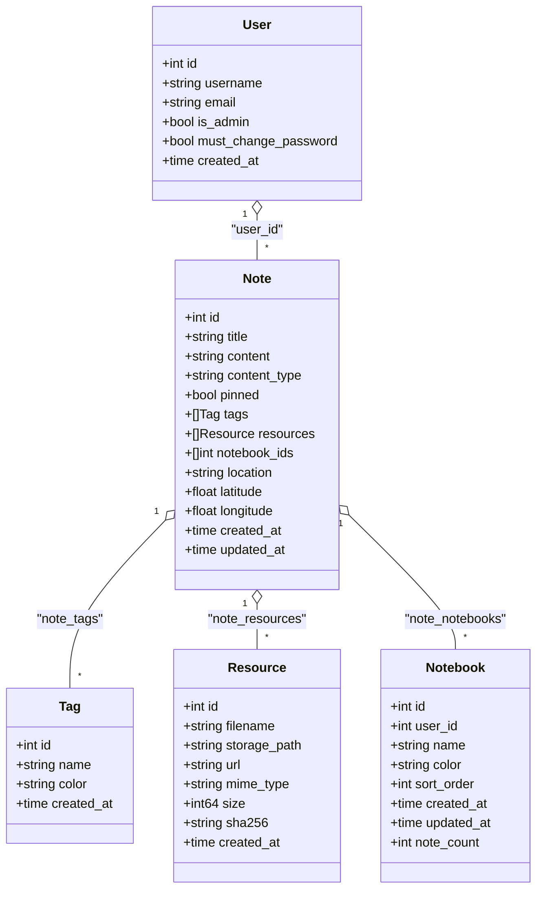
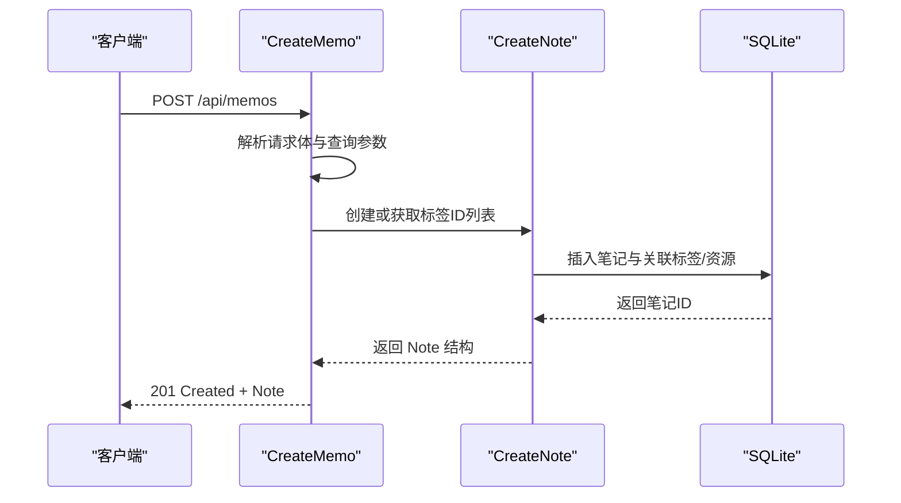
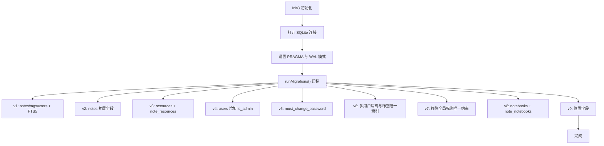
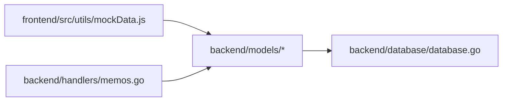

# 模拟数据生成

<cite>
**本文引用的文件**
- [frontend/src/utils/mockData.js](file://frontend/src/utils/mockData.js)
- [backend/models/note.go](file://backend/models/note.go)
- [backend/models/notebook.go](file://backend/models/notebook.go)
- [backend/models/resource.go](file://backend/models/resource.go)
- [backend/models/user.go](file://backend/models/user.go)
- [backend/handlers/memos.go](file://backend/handlers/memos.go)
- [backend/database/database.go](file://backend/database/database.go)
- [frontend/src/utils/api.test.js](file://frontend/src/utils/api.test.js)
- [kit/src/lib/api.test.js](file://kit/src/lib/api.test.js)
- [frontend/src/stores/auth.test.js](file://frontend/src/stores/auth.test.js)
- [frontend/src/stores/theme.test.js](file://frontend/src/stores/theme.test.js)
</cite>

## 目录
1. [简介](#简介)
2. [项目结构](#项目结构)
3. [核心组件](#核心组件)
4. [架构总览](#架构总览)
5. [详细组件分析](#详细组件分析)
6. [依赖分析](#依赖分析)
7. [性能考虑](#性能考虑)
8. [故障排查指南](#故障排查指南)
9. [结论](#结论)
10. [附录](#附录)

## 简介
本文件面向 Memo Studio 的“模拟数据生成”能力，系统性梳理前端 Mock 数据与后端真实数据模型之间的映射关系、随机数据生成策略、测试场景下的数据准备与批量生成、数据清洗与关联关系处理，以及在单元测试、集成测试、UI 测试中的应用方式。文档旨在帮助开发者高效生成测试数据并进行功能验证。

## 项目结构
- 前端提供轻量 Mock 数据与 API 封装，便于本地开发与前端测试。
- 后端提供完整的数据模型、处理器与数据库初始化逻辑，支持真实数据的创建、更新、删除、查询与随机回顾等能力。
- 测试文件覆盖前端 API、Kit API、鉴权与主题等模块，验证模拟数据与真实数据在不同场景下的行为一致性。

图表来源
- [frontend/src/utils/mockData.js](file://frontend/src/utils/mockData.js#L1-L255)
- [backend/models/note.go](file://backend/models/note.go#L1-L846)
- [backend/models/notebook.go](file://backend/models/notebook.go#L1-L206)
- [backend/models/resource.go](file://backend/models/resource.go#L1-L187)
- [backend/models/user.go](file://backend/models/user.go#L1-L233)
- [backend/handlers/memos.go](file://backend/handlers/memos.go#L1-L280)
- [backend/database/database.go](file://backend/database/database.go#L1-L677)

章节来源
- [frontend/src/utils/mockData.js](file://frontend/src/utils/mockData.js#L1-L255)
- [backend/models/note.go](file://backend/models/note.go#L1-L846)
- [backend/models/notebook.go](file://backend/models/notebook.go#L1-L206)
- [backend/models/resource.go](file://backend/models/resource.go#L1-L187)
- [backend/models/user.go](file://backend/models/user.go#L1-L233)
- [backend/handlers/memos.go](file://backend/handlers/memos.go#L1-L280)
- [backend/database/database.go](file://backend/database/database.go#L1-L677)

## 核心组件
- 前端 Mock 数据与 API 封装：提供笔记、标签的增删改查与合并标签等操作，内置网络延迟模拟，便于前端联调与测试。
- 后端数据模型：定义 Note、Tag、Notebook、Resource、User 等实体及关联关系，提供创建、更新、删除、查询与随机回顾等方法。
- REST 处理器：接收前端请求，解析参数，调用模型层完成业务处理。
- 数据库初始化与迁移：负责 SQLite 初始化、FTS5 全文检索、多版本迁移与安全随机密码生成等。

章节来源
- [frontend/src/utils/mockData.js](file://frontend/src/utils/mockData.js#L54-L245)
- [backend/models/note.go](file://backend/models/note.go#L11-L27)
- [backend/handlers/memos.go](file://backend/handlers/memos.go#L16-L32)
- [backend/database/database.go](file://backend/database/database.go#L20-L60)

## 架构总览
下图展示从前端 Mock 数据到后端模型与数据库的整体流程，包括数据准备、批量生成、数据清洗与关联关系处理的关键节点。

图表来源
- [frontend/src/utils/mockData.js](file://frontend/src/utils/mockData.js#L54-L245)
- [backend/handlers/memos.go](file://backend/handlers/memos.go#L78-L280)
- [backend/models/note.go](file://backend/models/note.go#L46-L105)
- [backend/database/database.go](file://backend/database/database.go#L20-L60)

## 详细组件分析

### 前端 Mock 数据与 API 封装
- 数据结构
  - 笔记：包含 id、标题、内容、标签数组、创建/更新时间等字段。
  - 标签：包含 id、名称、颜色、创建时间、计数等字段。
- 随机数据生成策略
  - 标签颜色：基于标签名称字符哈希映射到预设颜色集合，保证同一名称稳定取色。
  - 自增 ID：nextNoteId、nextTagId 递增，确保唯一性。
  - 时间戳：使用当前时间或相对偏移时间，模拟历史笔记。
- 关联关系处理
  - 创建/更新笔记时，若标签不存在则创建；若存在则复用。
  - 合并标签时，将源标签替换为目标标签或删除重复，随后删除源标签。
  - 删除笔记/标签时同步更新计数与引用。
- 网络延迟与错误处理
  - 统一延迟函数模拟网络耗时。
  - 不存在资源时抛出错误，便于前端提示。

图表来源
- [frontend/src/utils/mockData.js](file://frontend/src/utils/mockData.js#L71-L104)
- [frontend/src/utils/mockData.js](file://frontend/src/utils/mockData.js#L106-L139)

章节来源
- [frontend/src/utils/mockData.js](file://frontend/src/utils/mockData.js#L1-L255)

### 后端数据模型与随机数据生成
- 数据模型
  - Note：包含标题、内容、类型、是否置顶、标签、资源、笔记本 ID 列表、位置信息、创建/更新时间等。
  - Tag：包含名称、颜色、创建时间等。
  - Notebook：包含名称、颜色、排序、笔记数量等。
  - Resource：包含文件名、存储路径、URL、MIME 类型、大小、SHA256 等。
  - User：包含用户名、邮箱、是否管理员、是否必须改密、创建时间等。
- 随机数据生成策略
  - 标签颜色：基于标签名称字符哈希计算，映射到固定颜色集合，保证稳定性。
  - 随机回顾：按用户隔离，支持按标签过滤与按天数过滤，使用 SQL 随机排序限制条数。
- 关联关系处理
  - 笔记与标签：通过 note_tags 关联表维护多对多关系。
  - 笔记与笔记本：通过 note_notebooks 关联表维护多对多关系。
  - 笔记与资源：通过 note_resources 关联表维护多对多关系。
- 数据清洗
  - 对 content 与 title 中的 “[object Object]” 字符串进行清理，避免脏数据污染。

图表来源
- [backend/models/note.go](file://backend/models/note.go#L11-L27)
- [backend/models/notebook.go](file://backend/models/notebook.go#L10-L19)
- [backend/models/resource.go](file://backend/models/resource.go#L10-L20)
- [backend/models/user.go](file://backend/models/user.go#L13-L20)

章节来源
- [backend/models/note.go](file://backend/models/note.go#L11-L27)
- [backend/models/notebook.go](file://backend/models/notebook.go#L10-L19)
- [backend/models/resource.go](file://backend/models/resource.go#L10-L20)
- [backend/models/user.go](file://backend/models/user.go#L13-L20)

### REST 处理器与数据准备
- 请求解析与参数校验：支持分页、标签、时间范围、置顶、内容类型等查询参数。
- 认证与权限：从上下文提取用户 ID，校验笔记所有权或允许公开访问。
- 标签处理：若标签不存在则创建，确保标签唯一性与颜色生成策略一致。
- 批量生成：支持批量删除笔记，减少多次往返开销。
- 错误处理：对参数格式、认证状态、权限不足等情况返回明确错误信息。

图表来源
- [backend/handlers/memos.go](file://backend/handlers/memos.go#L139-L188)
- [backend/models/note.go](file://backend/models/note.go#L46-L105)

章节来源
- [backend/handlers/memos.go](file://backend/handlers/memos.go#L78-L280)
- [backend/models/note.go](file://backend/models/note.go#L46-L105)

### 数据库初始化与迁移
- 初始化：打开 SQLite 连接、设置 PRAGMA、运行迁移。
- 迁移：按版本逐步创建表、添加列、建立索引与触发器，支持 FTS5 全文检索与多用户隔离。
- 安全随机密码：在无管理员时生成随机密码并记录日志，提升安全性。
- 位置字段：为笔记表新增位置相关字段，支持地理信息查询。

图表来源
- [backend/database/database.go](file://backend/database/database.go#L20-L60)
- [backend/database/database.go](file://backend/database/database.go#L62-L178)
- [backend/database/database.go](file://backend/database/database.go#L180-L241)

章节来源
- [backend/database/database.go](file://backend/database/database.go#L20-L60)
- [backend/database/database.go](file://backend/database/database.go#L62-L178)
- [backend/database/database.go](file://backend/database/database.go#L180-L241)

## 依赖分析
- 前端 Mock 与后端模型的字段映射：前端 mockData.js 中的 Note/Tag 字段与后端 models 中的结构保持一致，便于在不同环境间切换。
- 处理器与模型的耦合：handlers/memos.go 依赖 models 层的创建、更新、删除与查询方法，形成清晰的分层。
- 数据库迁移与模型演进：database.go 的迁移脚本确保 schema 与模型定义同步演进，避免版本不一致导致的问题。

图表来源
- [frontend/src/utils/mockData.js](file://frontend/src/utils/mockData.js#L1-L255)
- [backend/models/note.go](file://backend/models/note.go#L1-L846)
- [backend/handlers/memos.go](file://backend/handlers/memos.go#L1-L280)
- [backend/database/database.go](file://backend/database/database.go#L1-L677)

章节来源
- [frontend/src/utils/mockData.js](file://frontend/src/utils/mockData.js#L1-L255)
- [backend/models/note.go](file://backend/models/note.go#L1-L846)
- [backend/handlers/memos.go](file://backend/handlers/memos.go#L1-L280)
- [backend/database/database.go](file://backend/database/database.go#L1-L677)

## 性能考虑
- 前端 Mock
  - 使用延迟函数模拟网络，便于前端调试与 UI 响应测试。
  - 标签颜色哈希映射与自增 ID 降低冲突概率，提高生成效率。
- 后端模型
  - 随机回顾使用 SQL 随机排序与 LIMIT 控制输出规模，避免大结果集扫描。
  - FTS5 全文检索与索引优化，提升搜索性能。
- 数据库
  - WAL 模式与 PRAGMA 设置提升并发与稳定性。
  - 迁移脚本集中执行 DDL，避免 schema 不一致带来的性能问题。

[本节为通用指导，无需列出具体文件来源]

## 故障排查指南
- 前端测试
  - 鉴权测试：验证未登录时抛出错误，登录后携带 Bearer Token。
  - 主题测试：验证主题切换更新 localStorage 与 DOM class。
  - API 测试：验证前端 API 在存在 token 时附加 Authorization。
- 后端测试
  - 处理器测试：验证参数解析、权限校验与错误返回。
- 常见问题
  - 标签颜色不一致：确认标签名称哈希算法与颜色集合一致。
  - 随机回顾无结果：检查 withinDays 与 tagName 参数是否正确。
  - 数据库迁移失败：检查 PRAGMA 设置与迁移顺序。

章节来源
- [frontend/src/utils/api.test.js](file://frontend/src/utils/api.test.js#L19-L36)
- [kit/src/lib/api.test.js](file://kit/src/lib/api.test.js#L18-L37)
- [frontend/src/stores/auth.test.js](file://frontend/src/stores/auth.test.js#L21-L40)
- [frontend/src/stores/theme.test.js](file://frontend/src/stores/theme.test.js#L37-L48)

## 结论
Memo Studio 的模拟数据生成体系从前端 Mock 到后端模型与数据库形成闭环，既满足本地开发与前端联调需求，又能在真实环境中通过处理器与模型层完成复杂的数据准备、批量生成与数据清洗。配合完善的测试用例，开发者可以高效地验证功能并在不同测试场景中稳定运行。

[本节为总结性内容，无需列出具体文件来源]

## 附录
- 使用示例
  - 前端：通过 mockApi 的 createNote/updateNote/deleteNote 等方法快速生成与修改笔记数据。
  - 后端：通过 handlers/memos.go 提供的接口进行批量导入与随机回顾测试。
- 自定义配置
  - 标签颜色：可通过修改哈希映射的颜色集合来自定义配色策略。
  - 随机回顾：调整 limit、tagName、withinDays 参数控制输出规模与筛选条件。
- 扩展方法
  - 新增字段：在 models 层扩展结构体并在 database.go 中添加迁移脚本。
  - 批量操作：在 handlers 层增加批量导入/导出接口，结合 models 的批量方法提升效率。

[本节为通用指导，无需列出具体文件来源]