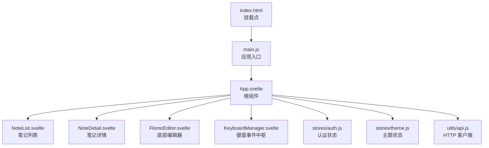
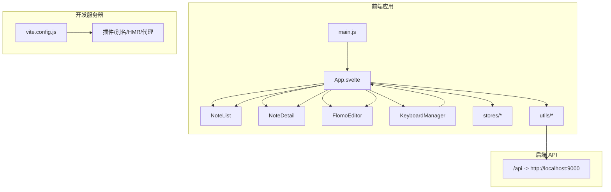
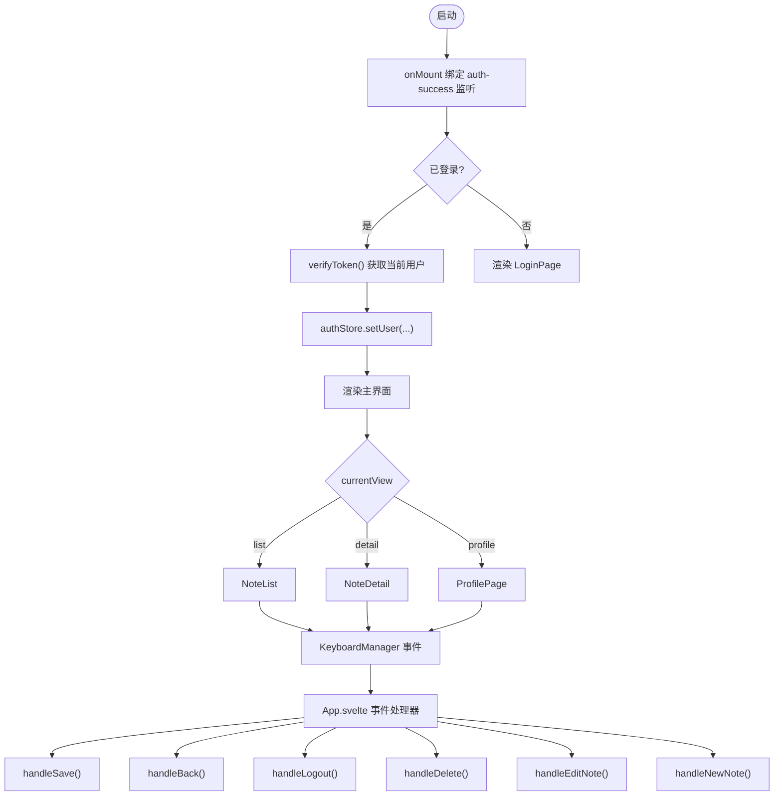
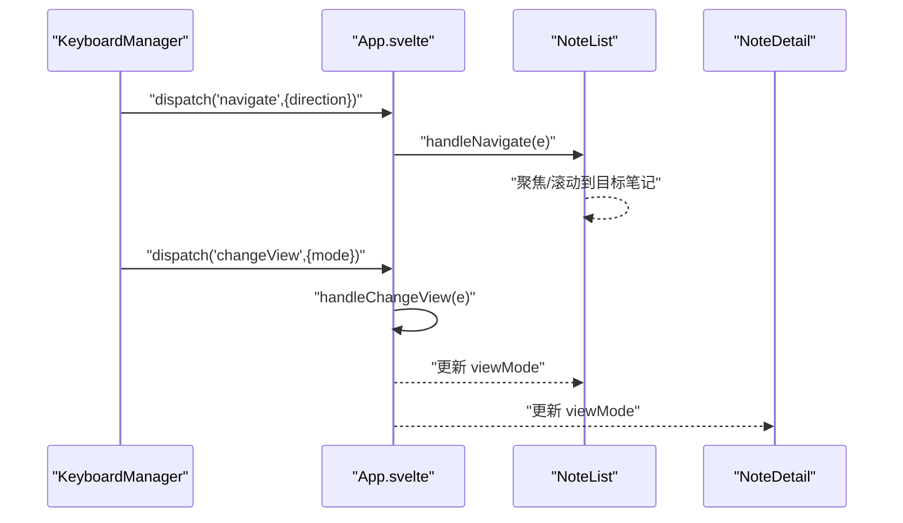
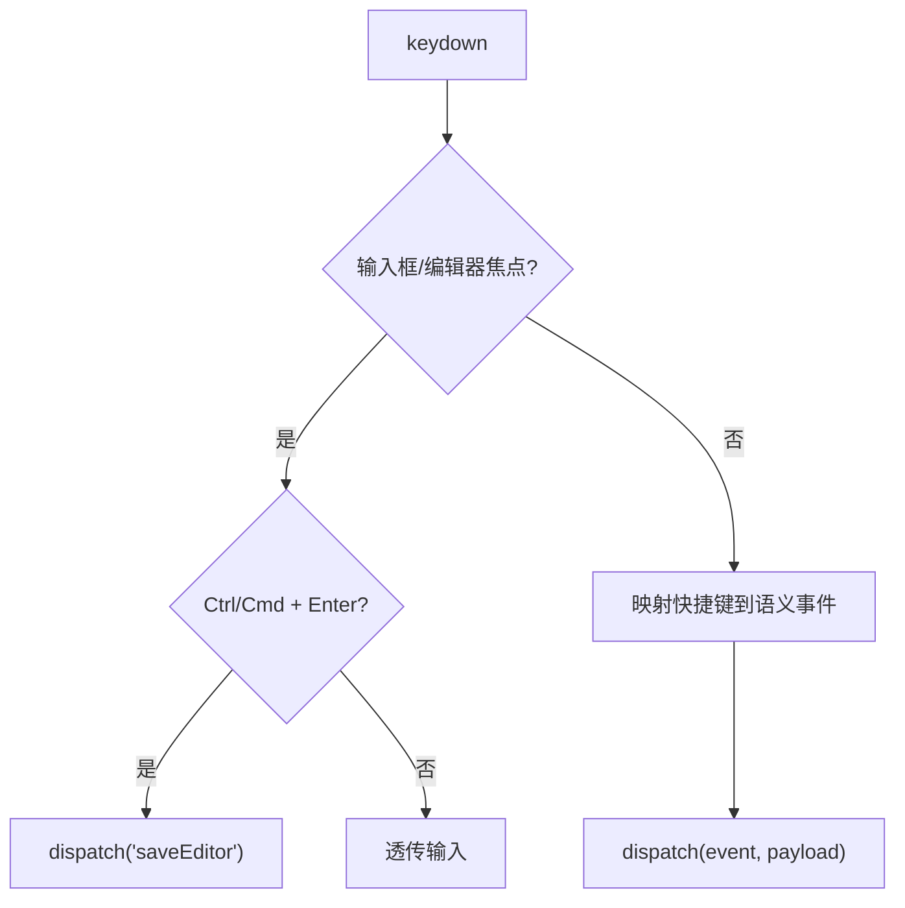
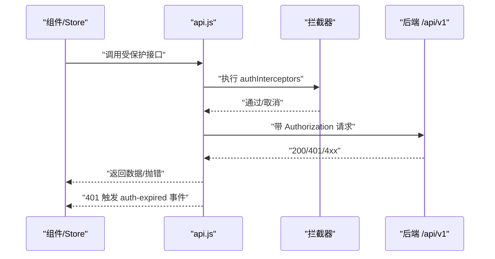
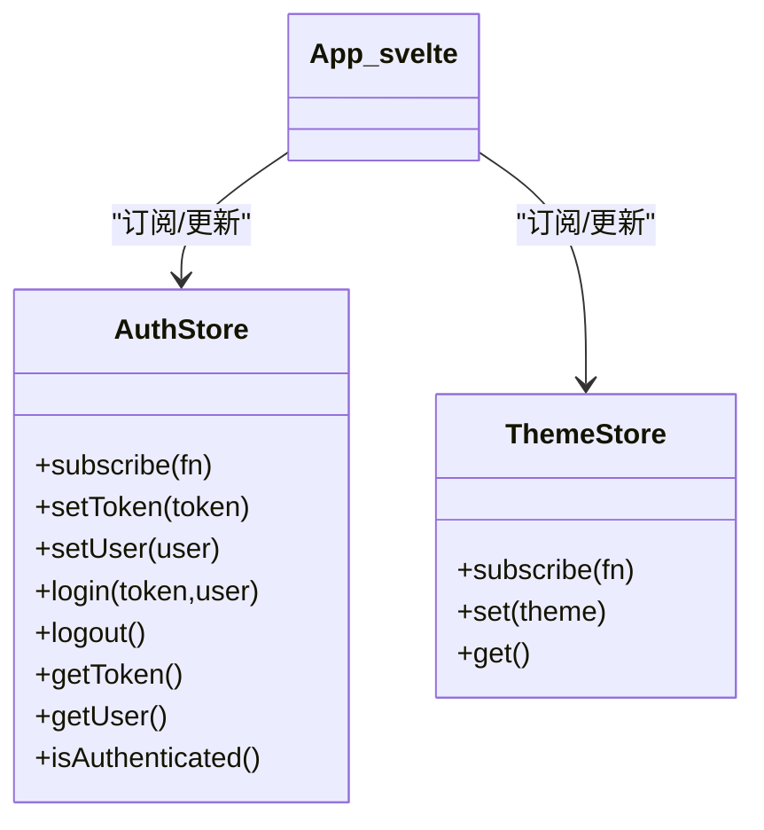
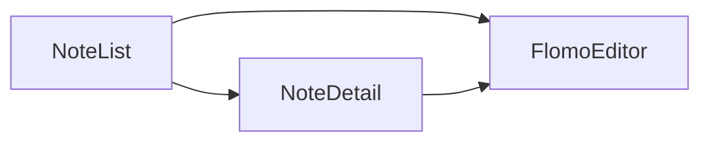
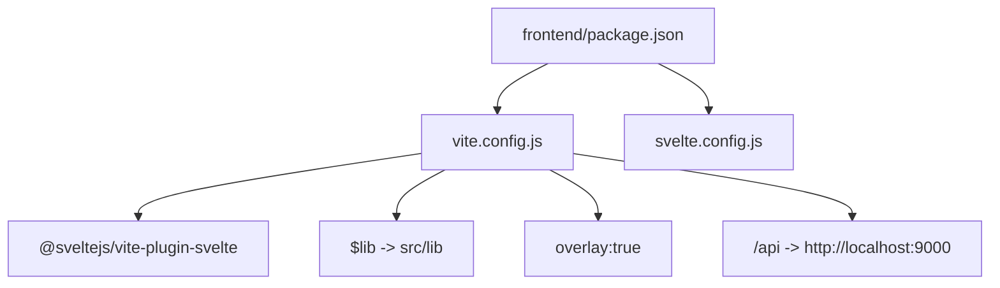

# 应用架构

<cite>
**本文引用的文件**
- [frontend/src/main.js](file://frontend/src/main.js)
- [frontend/src/App.svelte](file://frontend/src/App.svelte)
- [frontend/vite.config.js](file://frontend/vite.config.js)
- [frontend/package.json](file://frontend/package.json)
- [frontend/svelte.config.js](file://frontend/svelte.config.js)
- [frontend/src/stores/auth.js](file://frontend/src/stores/auth.js)
- [frontend/src/stores/theme.js](file://frontend/src/stores/theme.js)
- [frontend/src/utils/api.js](file://frontend/src/utils/api.js)
- [frontend/src/components/NoteList.svelte](file://frontend/src/components/NoteList.svelte)
- [frontend/src/components/NoteDetail.svelte](file://frontend/src/components/NoteDetail.svelte)
- [frontend/src/components/FlomoEditor.svelte](file://frontend/src/components/FlomoEditor.svelte)
- [frontend/src/components/KeyboardManager.svelte](file://frontend/src/components/KeyboardManager.svelte)
- [frontend/src/lib/utils.js](file://frontend/src/lib/utils.js)
- [frontend/index.html](file://frontend/index.html)
- [kit/package.json](file://kit/package.json)
</cite>

## 目录
1. [简介](#简介)
2. [项目结构](#项目结构)
3. [核心组件](#核心组件)
4. [架构总览](#架构总览)
5. [组件详解](#组件详解)
6. [依赖关系分析](#依赖关系分析)
7. [性能考量](#性能考量)
8. [故障排查指南](#故障排查指南)
9. [结论](#结论)
10. [附录](#附录)

## 简介
本文件面向 Memo Studio 前端团队与贡献者，系统性梳理基于 Svelte 5 + Vite 的现代前端架构。重点覆盖应用入口与启动流程、主应用组件 App.svelte 的视图切换与状态管理、组件间通信与事件传递、键盘快捷键体系、构建与开发服务器配置、环境与代理策略等。文档通过多类图示直观呈现架构关系与数据流，帮助读者快速理解并高效扩展。

## 项目结构
前端工程位于 frontend 目录，采用 Svelte 5 + Vite 技术栈；kit 目录为独立的 SvelteKit 服务端渲染/静态导出方案（与前端 SPA 并行存在）。核心目录与职责如下：
- src：源代码
  - components：页面级与业务组件
  - stores：轻量全局状态（认证、主题）
  - utils：API 封装、备份与导出等工具
  - App.svelte：根组件，负责视图切换、事件编排与状态集成
  - main.js：应用挂载入口
- vite.config.js：开发服务器、HMR、代理与别名配置
- package.json：脚本与依赖
- index.html：应用挂载点

**图表来源**
- [frontend/index.html](file://frontend/index.html#L1-L13)
- [frontend/src/main.js](file://frontend/src/main.js#L1-L20)
- [frontend/src/App.svelte](file://frontend/src/App.svelte#L1-L328)
- [frontend/src/components/NoteList.svelte](file://frontend/src/components/NoteList.svelte#L1-L507)
- [frontend/src/components/NoteDetail.svelte](file://frontend/src/components/NoteDetail.svelte#L1-L223)
- [frontend/src/components/FlomoEditor.svelte](file://frontend/src/components/FlomoEditor.svelte#L1-L270)
- [frontend/src/components/KeyboardManager.svelte](file://frontend/src/components/KeyboardManager.svelte#L1-L206)
- [frontend/src/stores/auth.js](file://frontend/src/stores/auth.js#L1-L80)
- [frontend/src/stores/theme.js](file://frontend/src/stores/theme.js#L1-L40)
- [frontend/src/utils/api.js](file://frontend/src/utils/api.js#L1-L316)

**章节来源**
- [frontend/index.html](file://frontend/index.html#L1-L13)
- [frontend/src/main.js](file://frontend/src/main.js#L1-L20)
- [frontend/package.json](file://frontend/package.json#L1-L25)

## 核心组件
- 应用入口 main.js：创建 App 实例并挂载到 DOM，监听认证过期事件以提示用户重新登录。
- 主应用组件 App.svelte：集中管理视图状态（列表/详情/资料/编辑器）、用户认证状态、键盘事件桥接、侧边栏与视图模式切换、导入导出等。
- 状态管理 stores：
  - 认证状态 authStore：令牌与用户持久化、订阅通知、登录/登出。
  - 主题状态 themeStore：本地存储与 DOM 类切换。
- 工具模块 utils：
  - api.js：统一 fetchWithAuth、拦截器、鉴权错误处理、内容清洗、笔记/标签/搜索 API。
  - lib/utils.js：Tailwind 合并工具函数。
- 组件：
  - NoteList：加载/筛选/分组/批量删除笔记，支持移动端侧边栏与视图模式。
  - NoteDetail：加载/编辑/删除单条笔记。
  - FlomoEditor：底部浮动编辑器，支持标签建议、自动高度、快捷键保存。
  - KeyboardManager：全局键盘事件捕获与派发，统一快捷键体系。

**章节来源**
- [frontend/src/main.js](file://frontend/src/main.js#L1-L20)
- [frontend/src/App.svelte](file://frontend/src/App.svelte#L1-L328)
- [frontend/src/stores/auth.js](file://frontend/src/stores/auth.js#L1-L80)
- [frontend/src/stores/theme.js](file://frontend/src/stores/theme.js#L1-L40)
- [frontend/src/utils/api.js](file://frontend/src/utils/api.js#L1-L316)
- [frontend/src/lib/utils.js](file://frontend/src/lib/utils.js#L1-L7)

## 架构总览
Svelte 5 采用声明式响应式与编译时优化；Vite 提供快速开发体验与热更新。应用采用“根组件集中编排 + 轻量 store”的前端架构，组件间通过 props 与事件进行松耦合通信，键盘事件由 KeyboardManager 统一收集并转发至对应视图。

**图表来源**
- [frontend/src/main.js](file://frontend/src/main.js#L1-L20)
- [frontend/src/App.svelte](file://frontend/src/App.svelte#L1-L328)
- [frontend/src/components/KeyboardManager.svelte](file://frontend/src/components/KeyboardManager.svelte#L1-L206)
- [frontend/src/components/NoteList.svelte](file://frontend/src/components/NoteList.svelte#L1-L507)
- [frontend/src/components/NoteDetail.svelte](file://frontend/src/components/NoteDetail.svelte#L1-L223)
- [frontend/src/components/FlomoEditor.svelte](file://frontend/src/components/FlomoEditor.svelte#L1-L270)
- [frontend/src/stores/auth.js](file://frontend/src/stores/auth.js#L1-L80)
- [frontend/src/stores/theme.js](file://frontend/src/stores/theme.js#L1-L40)
- [frontend/src/utils/api.js](file://frontend/src/utils/api.js#L1-L316)
- [frontend/vite.config.js](file://frontend/vite.config.js#L1-L25)

## 组件详解

### 主应用组件 App.svelte 架构
- 视图切换机制：通过 currentView 控制渲染列表、详情、资料页；编辑器通过 showEditor 与 editorMode 管理底部浮动编辑器。
- 状态管理集成：订阅 authStore 与 themeStore，实现登录态与主题同步；在 onMount 中校验令牌并设置用户。
- 事件处理系统：集中处理笔记点击、新建/编辑、返回、登出、保存、删除、键盘导航、视图切换、侧边栏开关、标签面板与导入等。
- 键盘事件桥接：通过 KeyboardManager 统一捕获快捷键，派发到对应处理器（如 focusSearch、saveEditor、navigate、changeView 等）。

**图表来源**
- [frontend/src/App.svelte](file://frontend/src/App.svelte#L1-L328)
- [frontend/src/stores/auth.js](file://frontend/src/stores/auth.js#L1-L80)
- [frontend/src/stores/theme.js](file://frontend/src/stores/theme.js#L1-L40)
- [frontend/src/utils/api.js](file://frontend/src/utils/api.js#L1-L316)

**章节来源**
- [frontend/src/App.svelte](file://frontend/src/App.svelte#L1-L328)

### 组件间通信与事件传递
- 事件派发：子组件使用 createEventDispatcher 派发自定义事件（如 NoteList 的 noteClick、onQuickEdit；NoteDetail 的 edit/back/deleted；FlomoEditor 的 save/cancel）。
- 事件接收：父组件在模板中通过 on: 语法绑定，或在脚本中通过 createEventDispatcher 接收来自 KeyboardManager 的导航与操作事件。
- 数据流：props 单向向下传递，事件向上冒泡，store 在根组件订阅并驱动 UI 响应。

**图表来源**
- [frontend/src/components/KeyboardManager.svelte](file://frontend/src/components/KeyboardManager.svelte#L1-L206)
- [frontend/src/App.svelte](file://frontend/src/App.svelte#L151-L179)
- [frontend/src/components/NoteList.svelte](file://frontend/src/components/NoteList.svelte#L123-L125)

**章节来源**
- [frontend/src/components/NoteList.svelte](file://frontend/src/components/NoteList.svelte#L1-L507)
- [frontend/src/components/NoteDetail.svelte](file://frontend/src/components/NoteDetail.svelte#L1-L223)
- [frontend/src/components/KeyboardManager.svelte](file://frontend/src/components/KeyboardManager.svelte#L1-L206)

### 键盘管理器 KeyboardManager
- 全局捕获：在 onMount 绑定 document 的 keydown/focusin/focusout，识别输入焦点状态与编辑器上下文。
- 快捷键映射：涵盖搜索、保存、新建、编辑、删除、导航、视图切换、侧边栏、标签面板、导入导出等。
- 事件派发：将快捷键转换为语义化事件，交由 App.svelte 或子组件处理。

**图表来源**
- [frontend/src/components/KeyboardManager.svelte](file://frontend/src/components/KeyboardManager.svelte#L16-L143)

**章节来源**
- [frontend/src/components/KeyboardManager.svelte](file://frontend/src/components/KeyboardManager.svelte#L1-L206)

### API 与认证拦截
- 统一拦截：fetchWithAuth 自动附加 Authorization 头，并执行 authInterceptors。
- 鉴权错误：401 触发本地清理与 auth-expired 事件，引导重新登录。
- 内容清洗：cleanContent/cleanNote 规范化后端返回的数据类型，避免渲染异常。
- 批量操作：支持批量删除与标签合并等。

**图表来源**
- [frontend/src/utils/api.js](file://frontend/src/utils/api.js#L53-L76)
- [frontend/src/utils/api.js](file://frontend/src/utils/api.js#L145-L152)
- [frontend/src/main.js](file://frontend/src/main.js#L9-L16)

**章节来源**
- [frontend/src/utils/api.js](file://frontend/src/utils/api.js#L1-L316)
- [frontend/src/main.js](file://frontend/src/main.js#L1-L20)

### 状态管理 stores
- 认证状态 authStore：提供 subscribe、login/logout/setUser 等方法，持久化于 localStorage。
- 主题状态 themeStore：读取/写入 localStorage，动态切换 documentElement 的 dark 类。

**图表来源**
- [frontend/src/stores/auth.js](file://frontend/src/stores/auth.js#L20-L75)
- [frontend/src/stores/theme.js](file://frontend/src/stores/theme.js#L17-L39)
- [frontend/src/App.svelte](file://frontend/src/App.svelte#L27-L42)

**章节来源**
- [frontend/src/stores/auth.js](file://frontend/src/stores/auth.js#L1-L80)
- [frontend/src/stores/theme.js](file://frontend/src/stores/theme.js#L1-L40)

### 页面与编辑器组件
- NoteList：加载笔记、搜索与标签筛选、分组展示、批量删除、视图模式切换、移动端侧边栏。
- NoteDetail：加载/编辑/删除单条笔记，格式化时间与标签展示。
- FlomoEditor：底部浮动编辑器，自动高度、标签建议、快捷键保存、草稿与导入导出能力由工具模块提供。

**图表来源**
- [frontend/src/components/NoteList.svelte](file://frontend/src/components/NoteList.svelte#L1-L507)
- [frontend/src/components/NoteDetail.svelte](file://frontend/src/components/NoteDetail.svelte#L1-L223)
- [frontend/src/components/FlomoEditor.svelte](file://frontend/src/components/FlomoEditor.svelte#L1-L270)

**章节来源**
- [frontend/src/components/NoteList.svelte](file://frontend/src/components/NoteList.svelte#L1-L507)
- [frontend/src/components/NoteDetail.svelte](file://frontend/src/components/NoteDetail.svelte#L1-L223)
- [frontend/src/components/FlomoEditor.svelte](file://frontend/src/components/FlomoEditor.svelte#L1-L270)

## 依赖关系分析
- 构建与运行：package.json 定义 dev/build/test/preview 脚本；svelte.config.js 配置编译选项与 a11y 警告过滤；vite.config.js 提供插件、路径别名、HMR 与 /api 代理。
- 组件别名：$lib 指向 src/lib，便于 UI 组件复用。
- 开发服务器：端口 9001，HMR 覆盖层开启，/api 代理到后端 9000 端口。

**图表来源**
- [frontend/package.json](file://frontend/package.json#L1-L25)
- [frontend/svelte.config.js](file://frontend/svelte.config.js#L1-L11)
- [frontend/vite.config.js](file://frontend/vite.config.js#L1-L25)

**章节来源**
- [frontend/package.json](file://frontend/package.json#L1-L25)
- [frontend/svelte.config.js](file://frontend/svelte.config.js#L1-L11)
- [frontend/vite.config.js](file://frontend/vite.config.js#L1-L25)

## 性能考量
- 响应式计算：App.svelte 中大量使用 Svelte 响应式声明（$:）进行派生状态计算，减少重复渲染。
- 列表渲染：NoteList 对笔记进行分组与虚拟滚动友好布局，避免一次性渲染过多节点。
- 事件节流：键盘事件在 KeyboardManager 中集中处理，避免重复绑定与冲突。
- 资源懒加载：组件内部按需加载（如标签建议），降低首屏压力。
- CSS 注入：svelte.config.js 设置 css: "injected"，减少额外样式文件体积。

[本节为通用性能指导，不直接分析具体文件，故无“章节来源”]

## 故障排查指南
- 认证过期
  - 现象：触发 auth-expired 事件，localStorage 清理，提示重新登录。
  - 排查：检查后端 JWT 过期策略与 /api/v1/auth/me 返回值。
- 接口 401/404/429
  - 现象：统一错误处理抛出错误消息。
  - 排查：确认 Authorization 头是否正确附加、URL 是否正确、网络连通性。
- 编辑器无法保存
  - 现象：保存按钮禁用或报错。
  - 排查：检查标题/内容合法性、标签提取逻辑、网络状态。
- 键盘快捷键无效
  - 现象：某些快捷键无响应。
  - 排查：确认焦点不在输入框内、是否被浏览器默认行为阻止、是否被拦截器取消。

**章节来源**
- [frontend/src/utils/api.js](file://frontend/src/utils/api.js#L34-L50)
- [frontend/src/main.js](file://frontend/src/main.js#L9-L16)
- [frontend/src/components/FlomoEditor.svelte](file://frontend/src/components/FlomoEditor.svelte#L100-L128)
- [frontend/src/components/KeyboardManager.svelte](file://frontend/src/components/KeyboardManager.svelte#L16-L143)

## 结论
Memo Studio 前端采用清晰的分层架构：根组件集中编排、轻量 store 管理关键状态、组件通过事件与 props 解耦通信、统一的 API 层与拦截器保障安全与一致性。配合完善的键盘快捷键体系与现代化构建配置，整体具备良好的可维护性与扩展性。

## 附录
- 启动流程
  - index.html 引入 /src/main.js
  - main.js 创建 App 实例并挂载到 #app
  - App.svelte onMount 绑定事件、校验令牌、渲染主界面
- 依赖注入机制
  - 通过 $lib 别名与 utils 模块提供共享能力（API、备份、导出）
  - store 作为全局单例在根组件订阅，实现跨组件状态同步

**章节来源**
- [frontend/index.html](file://frontend/index.html#L1-L13)
- [frontend/src/main.js](file://frontend/src/main.js#L1-L20)
- [frontend/src/App.svelte](file://frontend/src/App.svelte#L1-L328)
- [frontend/src/lib/utils.js](file://frontend/src/lib/utils.js#L1-L7)