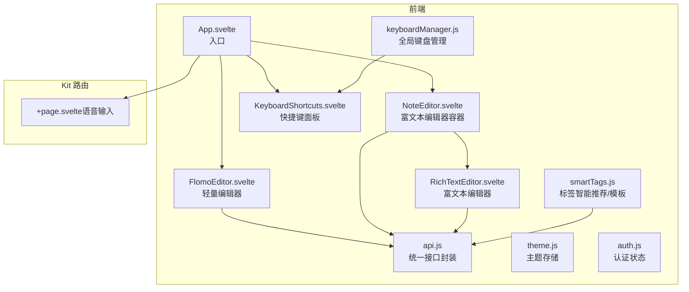
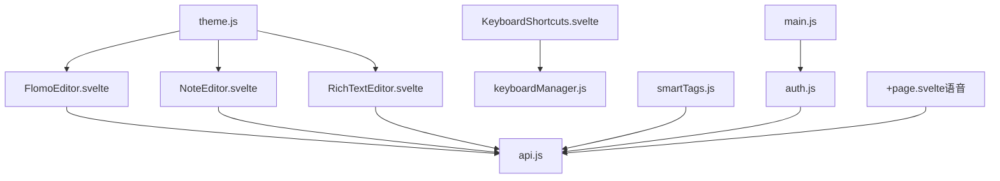
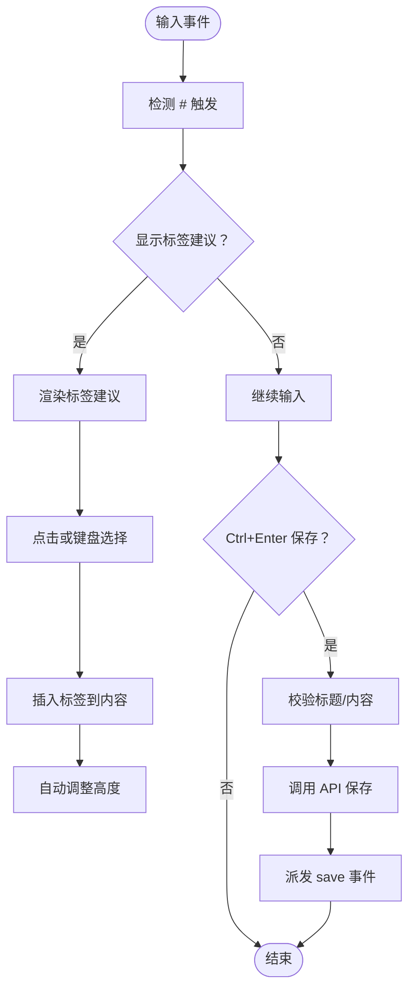
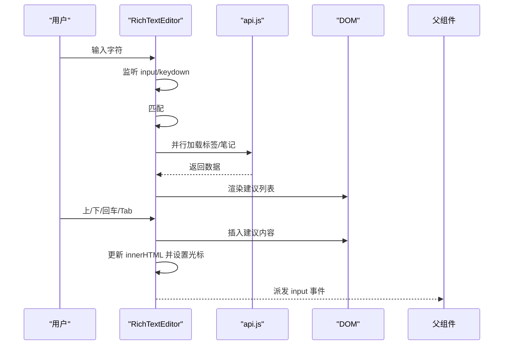
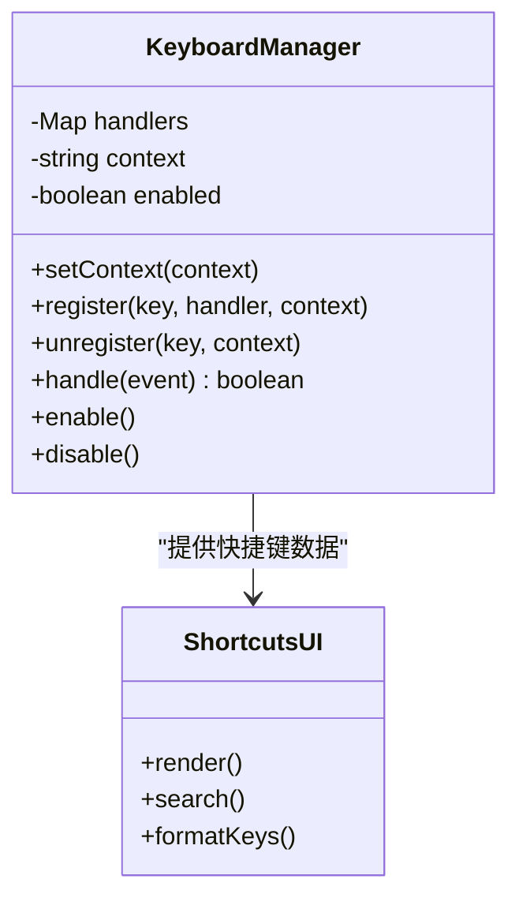
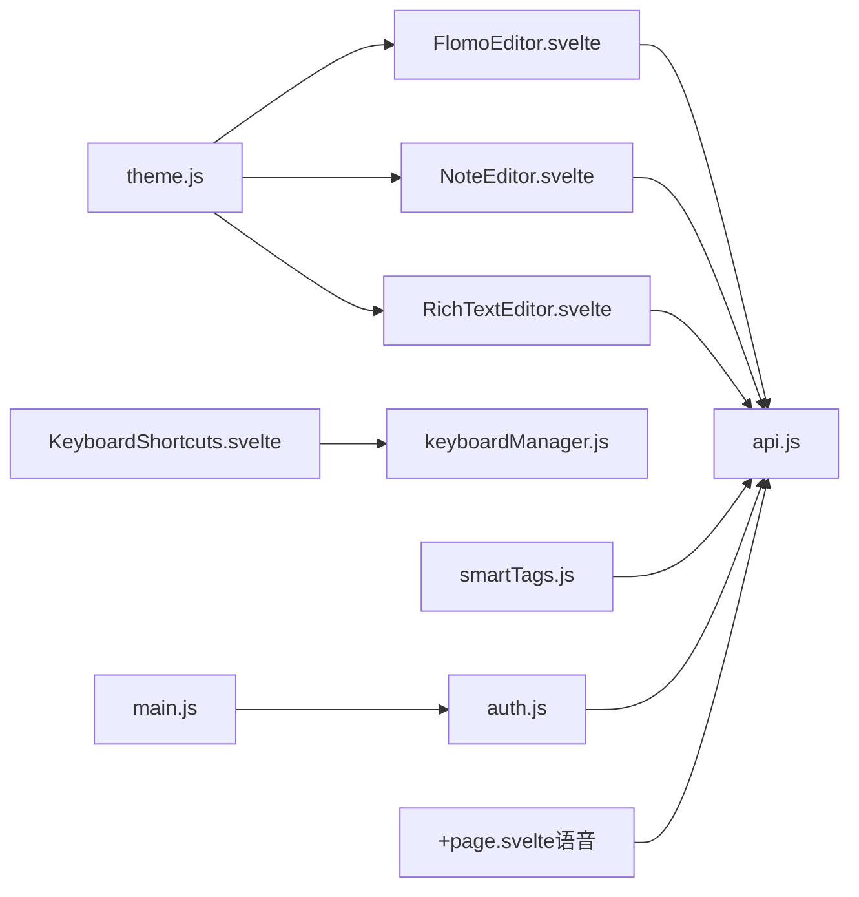

# Flomo 编辑器

<cite>
**本文引用的文件**
- [FlomoEditor.svelte](file://frontend/src/components/FlomoEditor.svelte)
- [RichTextEditor.svelte](file://frontend/src/components/RichTextEditor.svelte)
- [NoteEditor.svelte](file://frontend/src/components/NoteEditor.svelte)
- [KeyboardShortcuts.svelte](file://frontend/src/components/KeyboardShortcuts.svelte)
- [keyboardManager.js](file://kit/src/lib/keyboardManager.js)
- [smartTags.js](file://frontend/src/utils/smartTags.js)
- [api.js](file://frontend/src/utils/api.js)
- [theme.js](file://frontend/src/stores/theme.js)
- [auth.js](file://frontend/src/stores/auth.js)
- [main.js](file://frontend/src/main.js)
- [miniMarkdown.js](file://kit/src/lib/miniMarkdown.js)
- [+page.svelte（语音输入）](file://kit/src/routes/voice/+page.svelte)
</cite>

## 目录
1. [简介](#简介)
2. [项目结构](#项目结构)
3. [核心组件](#核心组件)
4. [架构总览](#架构总览)
5. [详细组件分析](#详细组件分析)
6. [依赖关系分析](#依赖关系分析)
7. [性能考量](#性能考量)
8. [故障排查指南](#故障排查指南)
9. [结论](#结论)
10. [附录](#附录)

## 简介
本技术文档围绕 Flomo 风格编辑器组件进行系统性梳理，覆盖设计理念、交互体验、内容处理、响应式适配、快捷键体系、标签与模板生态、与系统能力（剪贴板、语音输入、相机）的集成，以及性能优化与内存管理策略。文档面向开发者与产品/运营读者，既提供高层概览也包含代码级细节与可视化图表。

## 项目结构
前端采用 Svelte 技术栈，编辑器相关的核心文件集中在 frontend/src/components 与 frontend/src/utils，键盘与快捷键由 kit/src/lib 提供，路由与页面级功能位于 kit/src/routes。整体以“组件-工具-路由”分层组织，便于模块化扩展与维护。

**图表来源**
- [FlomoEditor.svelte](file://frontend/src/components/FlomoEditor.svelte#L1-L270)
- [NoteEditor.svelte](file://frontend/src/components/NoteEditor.svelte#L1-L280)
- [RichTextEditor.svelte](file://frontend/src/components/RichTextEditor.svelte#L1-L333)
- [KeyboardShortcuts.svelte](file://frontend/src/components/KeyboardShortcuts.svelte#L1-L197)
- [keyboardManager.js](file://kit/src/lib/keyboardManager.js#L1-L115)
- [smartTags.js](file://frontend/src/utils/smartTags.js#L1-L345)
- [api.js](file://frontend/src/utils/api.js#L1-L316)
- [+page.svelte（语音输入）](file://kit/src/routes/voice/+page.svelte#L41-L198)

**章节来源**
- [main.js](file://frontend/src/main.js#L1-L20)

## 核心组件
- 轻量编辑器（FlomoEditor.svelte）：专注快速输入与即时保存，支持标题、内容、标签、自动高度、标签建议、快捷键保存与取消。
- 富文本编辑器（RichTextEditor.svelte）：基于 contenteditable 的富文本输入，支持 #标签与 @笔记引用的实时建议、上下键导航、回车/Tab 插入。
- 富文本编辑器容器（NoteEditor.svelte）：提供标题、标签、富文本编辑器的整体布局与保存流程。
- 快捷键系统（KeyboardShortcuts.svelte + keyboardManager.js）：全局快捷键注册、上下文切换、默认快捷键映射与格式化展示。
- 标签与模板（smartTags.js）：标签使用统计、关键词推荐、智能模板与本地持久化。
- API 封装（api.js）：统一认证头、拦截器、错误处理、内容清洗、笔记/标签 CRUD。
- 主题与认证（theme.js、auth.js）：主题持久化与切换、认证状态持久化与订阅通知。
- 语音输入（+page.svelte）：Web Speech API 与 MediaRecorder 集成，支持在线语音识别与录音保存。

**章节来源**
- [FlomoEditor.svelte](file://frontend/src/components/FlomoEditor.svelte#L1-L270)
- [RichTextEditor.svelte](file://frontend/src/components/RichTextEditor.svelte#L1-L333)
- [NoteEditor.svelte](file://frontend/src/components/NoteEditor.svelte#L1-L280)
- [KeyboardShortcuts.svelte](file://frontend/src/components/KeyboardShortcuts.svelte#L1-L197)
- [keyboardManager.js](file://kit/src/lib/keyboardManager.js#L1-L115)
- [smartTags.js](file://frontend/src/utils/smartTags.js#L1-L345)
- [api.js](file://frontend/src/utils/api.js#L1-L316)
- [theme.js](file://frontend/src/stores/theme.js#L1-L40)
- [auth.js](file://frontend/src/stores/auth.js#L1-L80)
- [+page.svelte（语音输入）](file://kit/src/routes/voice/+page.svelte#L41-L198)

## 架构总览
编辑器采用“组件驱动 + 工具函数 + 全局状态”的分层架构：
- 视图层：Svelte 组件负责 UI 与交互，如 FlomoEditor、RichTextEditor、NoteEditor、KeyboardShortcuts。
- 逻辑层：keyboardManager 提供全局快捷键；smartTags 提供标签与模板；api.js 提供统一接口。
- 状态层：theme.js 与 auth.js 提供主题与认证状态订阅；main.js 监听认证过期事件。
- 路由层：kit/src/routes 提供页面级功能（如语音输入）。

**图表来源**
- [FlomoEditor.svelte](file://frontend/src/components/FlomoEditor.svelte#L1-L270)
- [NoteEditor.svelte](file://frontend/src/components/NoteEditor.svelte#L1-L280)
- [RichTextEditor.svelte](file://frontend/src/components/RichTextEditor.svelte#L1-L333)
- [KeyboardShortcuts.svelte](file://frontend/src/components/KeyboardShortcuts.svelte#L1-L197)
- [keyboardManager.js](file://kit/src/lib/keyboardManager.js#L1-L115)
- [smartTags.js](file://frontend/src/utils/smartTags.js#L1-L345)
- [api.js](file://frontend/src/utils/api.js#L1-L316)
- [theme.js](file://frontend/src/stores/theme.js#L1-L40)
- [auth.js](file://frontend/src/stores/auth.js#L1-L80)
- [main.js](file://frontend/src/main.js#L1-L20)
- [+page.svelte（语音输入）](file://kit/src/routes/voice/+page.svelte#L41-L198)

## 详细组件分析

### 轻量编辑器（FlomoEditor.svelte）
- 设计理念：极简输入、即时保存、标签即显、自动高度、时间问候语。
- 交互特性：
  - 自动调整 textarea 高度，最大高度限制。
  - 检测 # 触发标签建议，支持点击插入与键盘导航。
  - Ctrl+Enter 保存、Escape 取消。
  - 标题可选，内容必填校验。
- 内容处理：
  - 提取 #标签，去重合并手动与内容标签。
  - 保存前 trim，避免空内容提交。
- 响应式与样式：
  - 固定底部面板、遮罩层、动画入场。
  - 滚动条样式定制。

**图表来源**
- [FlomoEditor.svelte](file://frontend/src/components/FlomoEditor.svelte#L53-L128)

**章节来源**
- [FlomoEditor.svelte](file://frontend/src/components/FlomoEditor.svelte#L1-L270)

### 富文本编辑器（RichTextEditor.svelte）
- 设计理念：所见即所得、低侵入、高扩展。
- 交互特性：
  - contenteditable 容器，实时监听 input/keydown/click/mousemove。
  - # 触发标签建议，@ 触发笔记引用建议，支持上下箭头导航与回车/Tab 插入。
  - 建议定位跟随光标坐标，隐藏时机合理。
- 内容处理：
  - 建议项插入后更新 innerHTML 并恢复光标位置。
  - 输出值通过事件派发给父组件。
- 性能与安全：
  - 建议过滤基于本地缓存（标签/笔记），减少网络请求。
  - 建议列表滚动可视区控制。

**图表来源**
- [RichTextEditor.svelte](file://frontend/src/components/RichTextEditor.svelte#L31-L247)
- [api.js](file://frontend/src/utils/api.js#L232-L309)

**章节来源**
- [RichTextEditor.svelte](file://frontend/src/components/RichTextEditor.svelte#L1-L333)

### 富文本编辑器容器（NoteEditor.svelte）
- 设计理念：在富文本编辑器之上提供标题、标签、时间戳、保存与取消。
- 交互特性：
  - 标题输入、标签输入（逗号分隔）、标签建议。
  - 富文本编辑器作为子组件，接收/派发内容。
  - 保存时提取内容中的 #标签，合并手动标签，去重。
- 错误处理：
  - 标题与内容同时为空时阻止保存并提示。

**章节来源**
- [NoteEditor.svelte](file://frontend/src/components/NoteEditor.svelte#L1-L280)

### 快捷键系统（KeyboardShortcuts.svelte + keyboardManager.js）
- 设计理念：全局上下文感知、可扩展、易维护。
- 交互特性：
  - keyboardManager 维护 handlers Map，支持按上下文注册/注销。
  - 默认快捷键映射与格式化展示。
  - KeyboardShortcuts 展示分类、搜索、ESC 关闭。
- 使用方式：
  - 在组件中通过 keyboardManager.register 注册键位处理器。
  - 通过 keyboardState 控制帮助面板显示与上下文切换。

**图表来源**
- [keyboardManager.js](file://kit/src/lib/keyboardManager.js#L8-L86)
- [KeyboardShortcuts.svelte](file://frontend/src/components/KeyboardShortcuts.svelte#L17-L103)

**章节来源**
- [keyboardManager.js](file://kit/src/lib/keyboardManager.js#L1-L115)
- [KeyboardShortcuts.svelte](file://frontend/src/components/KeyboardShortcuts.svelte#L1-L197)

### 标签与模板（smartTags.js）
- 设计理念：提升标签使用效率与内容创作效率。
- 功能点：
  - 标签使用统计与高频标签推荐。
  - 基于关键词与已有标签的相关性推荐。
  - 内置模板集合与本地持久化自定义模板。
  - 模板变量替换（日期、标题、周期等）。
- 性能：
  - 本地缓存与去重，避免重复计算。

**章节来源**
- [smartTags.js](file://frontend/src/utils/smartTags.js#L1-L345)

### API 封装（api.js）
- 设计理念：统一认证、拦截器、错误处理、内容清洗。
- 功能点：
  - 认证拦截器与过期处理。
  - 笔记：创建、更新、删除、批量删除、查询列表与详情。
  - 标签：增删改查、合并。
  - 搜索：全文检索。
  - 内容清洗：兼容多种输入类型，排除异常字符串。
- 错误处理：
  - 401 自动登出、404 资源不存在、429 频繁请求、通用错误消息。

**章节来源**
- [api.js](file://frontend/src/utils/api.js#L1-L316)

### 主题与认证（theme.js、auth.js、main.js）
- 主题：
  - 本地持久化，DOM 类名切换，订阅者通知。
- 认证：
  - 本地持久化 token 与用户信息，订阅者通知。
  - 登录/注册/登出接口。
- 认证过期事件：
  - main.js 监听 auth-expired，输出日志（可扩展为跳转或提示）。

**章节来源**
- [theme.js](file://frontend/src/stores/theme.js#L1-L40)
- [auth.js](file://frontend/src/stores/auth.js#L1-L80)
- [main.js](file://frontend/src/main.js#L1-L20)

### 语音输入（+page.svelte）
- 设计理念：便捷语音录入与音频资源管理。
- 功能点：
  - Web Speech API：在线语音识别，区分最终/中间结果。
  - MediaRecorder：录音并保存至资源库。
  - 保存为笔记：将识别结果作为内容创建带“语音”标签的笔记。
- 浏览器兼容性：
  - 检测支持性，不支持时提示。

**章节来源**
- [+page.svelte（语音输入）](file://kit/src/routes/voice/+page.svelte#L41-L198)

## 依赖关系分析
- 组件间依赖：
  - FlomoEditor 与 NoteEditor 均依赖 api.js 进行 CRUD。
  - RichTextEditor 依赖 api.js 获取标签/笔记数据，依赖 keyboardManager 的上下文能力（通过全局注册）。
  - KeyboardShortcuts 依赖 keyboardManager 的默认映射与格式化。
- 状态依赖：
  - theme.js 与 auth.js 被多个组件间接使用（主题切换、认证状态）。
- 路由依赖：
  - 语音输入页面独立，但复用 api.js 与主题/认证状态。

**图表来源**
- [FlomoEditor.svelte](file://frontend/src/components/FlomoEditor.svelte#L1-L270)
- [NoteEditor.svelte](file://frontend/src/components/NoteEditor.svelte#L1-L280)
- [RichTextEditor.svelte](file://frontend/src/components/RichTextEditor.svelte#L1-L333)
- [KeyboardShortcuts.svelte](file://frontend/src/components/KeyboardShortcuts.svelte#L1-L197)
- [keyboardManager.js](file://kit/src/lib/keyboardManager.js#L1-L115)
- [smartTags.js](file://frontend/src/utils/smartTags.js#L1-L345)
- [api.js](file://frontend/src/utils/api.js#L1-L316)
- [theme.js](file://frontend/src/stores/theme.js#L1-L40)
- [auth.js](file://frontend/src/stores/auth.js#L1-L80)
- [main.js](file://frontend/src/main.js#L1-L20)
- [+page.svelte（语音输入）](file://kit/src/routes/voice/+page.svelte#L41-L198)

## 性能考量
- 渲染与 DOM：
  - FlomoEditor 使用 textarea 自动高度，限制最大高度，避免长内容撑破布局。
  - RichTextEditor 仅在失焦或必要时更新 innerHTML，减少重排。
- 异步与并发：
  - 标签/笔记建议并行加载，降低等待时间。
- 内存管理：
  - 建议列表与索引在每次输入后重置，避免累积。
  - 销毁时移除事件监听（onDestroy 在组件中使用，确保清理）。
- 网络与缓存：
  - smartTags.js 对标签使用统计进行本地缓存，减少重复请求。
  - api.js 对内容进行清洗，避免无效/异常数据导致的二次渲染。
- 主题与认证：
  - theme.js 与 auth.js 使用订阅者模式，仅在变更时通知，避免不必要的重渲染。

[本节为通用性能指导，无需特定文件引用]

## 故障排查指南
- 保存失败：
  - 检查 api.js 的错误处理分支，确认 401/404/429 场景与提示。
  - 确认 FlomoEditor/NoteEditor 的内容与标题校验逻辑。
- 标签建议不出现：
  - 确认输入触发条件（# 后无空格/逗号）与 focus/blur 状态。
  - 检查 api.getTags 是否返回数据。
- 快捷键无效：
  - 确认 keyboardManager 的上下文与 enable/disable 状态。
  - 检查是否在 input/textarea 中被默认行为阻止。
- 语音输入异常：
  - 检查浏览器支持与权限（麦克风）。
  - 确认 SpeechRecognition/MediaRecorder 初始化与错误回调。

**章节来源**
- [api.js](file://frontend/src/utils/api.js#L34-L50)
- [FlomoEditor.svelte](file://frontend/src/components/FlomoEditor.svelte#L100-L128)
- [keyboardManager.js](file://kit/src/lib/keyboardManager.js#L32-L75)
- [+page.svelte（语音输入）](file://kit/src/routes/voice/+page.svelte#L41-L77)

## 结论
Flomo 风格编辑器通过“轻量输入 + 富文本增强 + 智能标签与模板 + 全局快捷键 + 系统能力集成”的组合，实现了快速、简洁、高效的创作体验。其模块化设计与清晰的职责划分，使得扩展新功能（如语音、相机、剪贴板清理）具备良好可维护性与可演进性。

## 附录

### 使用指南与配置
- 快速输入
  - 打开轻量编辑器，输入内容即可自动保存；支持 Ctrl+Enter 保存、Escape 取消。
- 标签输入
  - 输入 # 触发标签建议，支持点击或上下键+回车插入。
- 模板与标签
  - 使用 smartTags.js 的模板与标签推荐，提高内容质量与一致性。
- 快捷键
  - 打开快捷键面板查看与搜索；可在组件中注册自定义上下文快捷键。

**章节来源**
- [FlomoEditor.svelte](file://frontend/src/components/FlomoEditor.svelte#L75-L84)
- [RichTextEditor.svelte](file://frontend/src/components/RichTextEditor.svelte#L75-L155)
- [KeyboardShortcuts.svelte](file://frontend/src/components/KeyboardShortcuts.svelte#L17-L78)
- [smartTags.js](file://frontend/src/utils/smartTags.js#L127-L345)

### 与系统能力集成
- 剪贴板清理
  - 在隐私设置中开启自动清理，并配置等待时间。
- 语音输入
  - 通过语音页面使用 Web Speech API 与 MediaRecorder，支持识别与录音。
- 相机拍照
  - 可在现有 MediaRecorder 基础上扩展拍照能力（需在页面中接入设备访问与上传逻辑）。

**章节来源**
- [PrivacySettings.svelte（剪贴板清理）](file://frontend/src/components/PrivacySettings.svelte#L200-L243)
- [+page.svelte（语音输入）](file://kit/src/routes/voice/+page.svelte#L41-L198)

### 内容处理机制
- 纯文本输入
  - FlomoEditor 以纯文本为主，自动高度与标签解析。
- 标签解析
  - 正则提取 #标签，合并手动与内容标签，去重。
- 时间戳添加
  - 轻量编辑器头部显示问候语与日期；富文本编辑器容器可格式化时间戳。
- 草稿保存
  - 建议在业务层增加本地草稿存储（localStorage/sessionStorage），结合 api.js 的保存接口。

**章节来源**
- [FlomoEditor.svelte](file://frontend/src/components/FlomoEditor.svelte#L100-L128)
- [NoteEditor.svelte](file://frontend/src/components/NoteEditor.svelte#L66-L109)
- [RichTextEditor.svelte](file://frontend/src/components/RichTextEditor.svelte#L157-L187)

### 响应式设计与移动端适配
- 移动端适配
  - 使用固定底部面板与遮罩层，保证触控操作空间。
  - 自动高度与滚动条样式适配小屏。
- 触摸优化
  - 建议在富文本编辑器中增加触摸拖拽选择与长按菜单（可扩展）。
- 屏幕尺寸适配
  - 使用 max-width 与居中布局，配合 Tailwind 类名实现响应式。

**章节来源**
- [FlomoEditor.svelte](file://frontend/src/components/FlomoEditor.svelte#L160-L254)
- [RichTextEditor.svelte](file://frontend/src/components/RichTextEditor.svelte#L250-L333)

### 扩展方法
- 新增快捷键
  - 使用 keyboardManager.register 注册键位处理器，设置上下文。
- 新增标签模板
  - 通过 smartTags.js 的模板 API 增加/删除模板，持久化至 localStorage。
- 新增系统能力
  - 语音：参考 +page.svelte 的实现；剪贴板：参考隐私设置组件；相机：在页面中接入设备访问与上传。

**章节来源**
- [keyboardManager.js](file://kit/src/lib/keyboardManager.js#L19-L30)
- [smartTags.js](file://frontend/src/utils/smartTags.js#L282-L312)
- [+page.svelte（语音输入）](file://kit/src/routes/voice/+page.svelte#L79-L155)