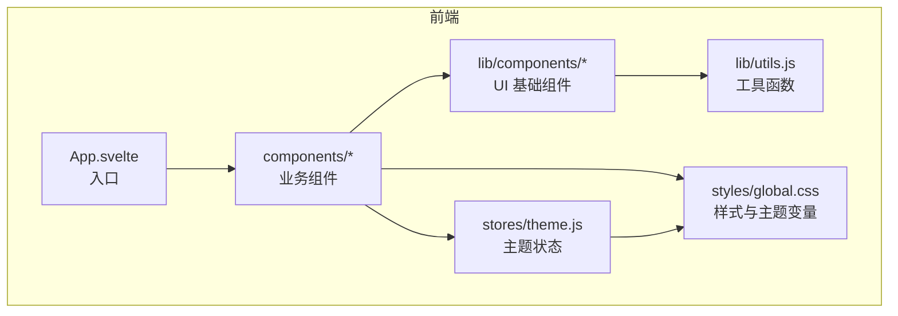
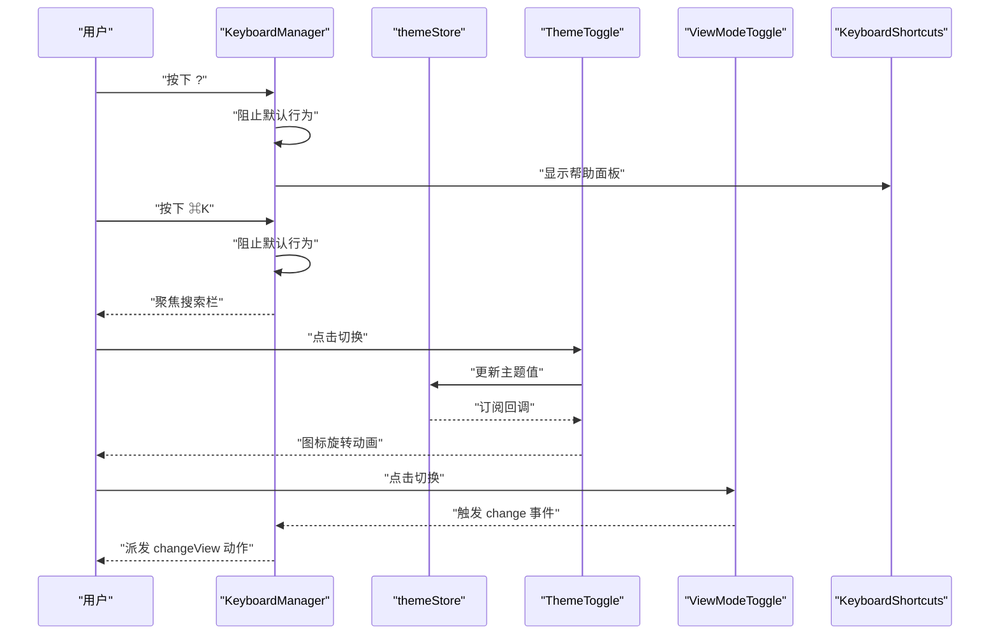
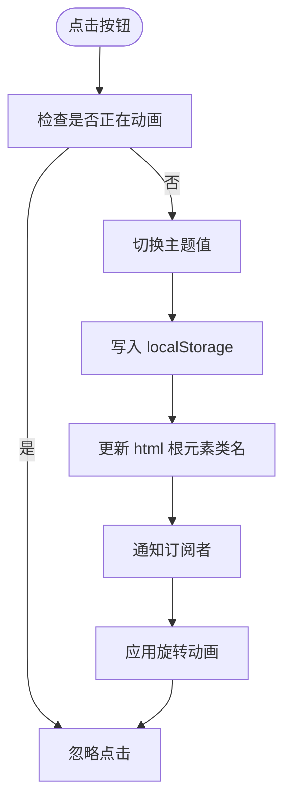
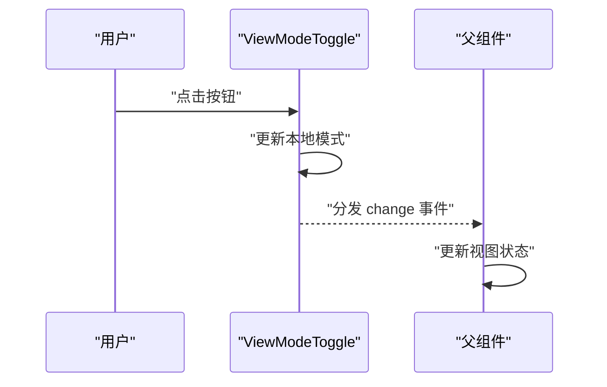
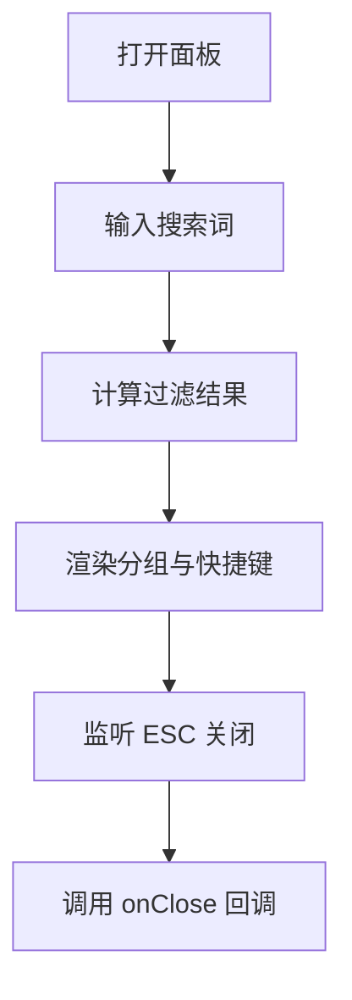
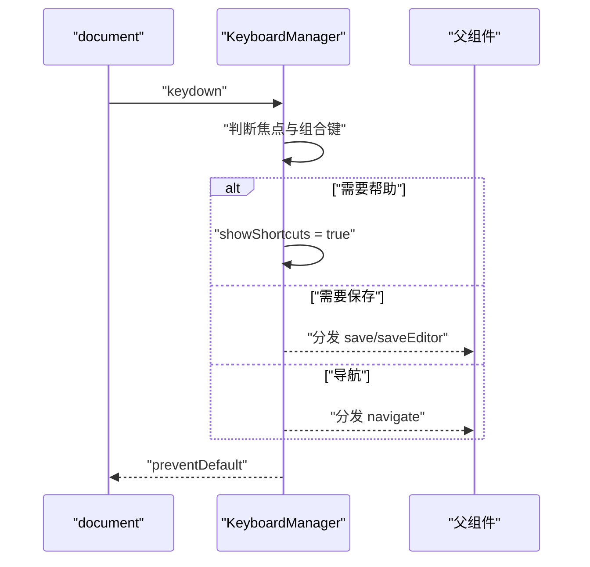
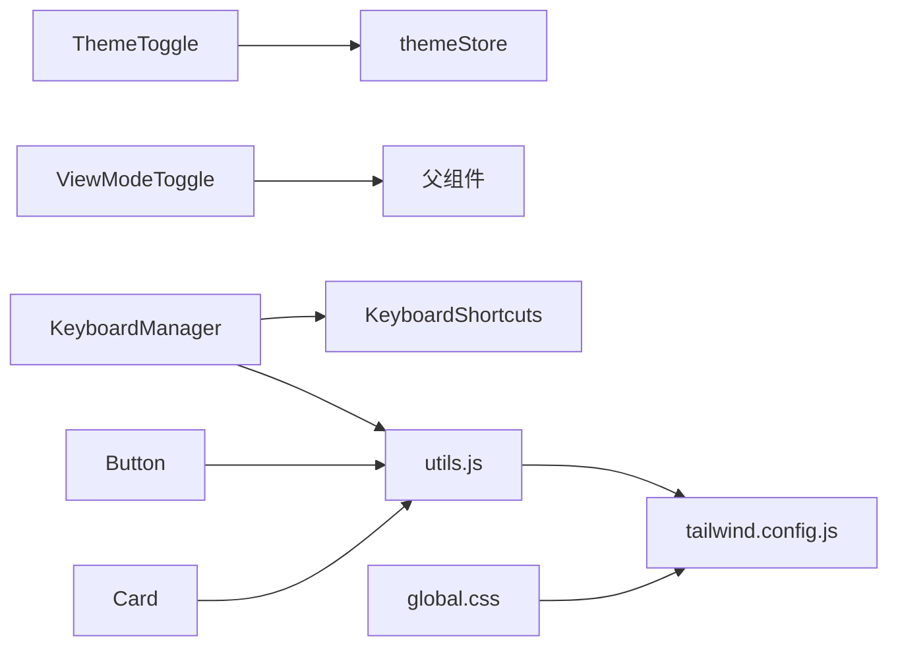

# UI 基础组件

<cite>
**本文引用的文件**
- [ThemeToggle.svelte](file://frontend/src/components/ThemeToggle.svelte)
- [ViewModeToggle.svelte](file://frontend/src/components/ViewModeToggle.svelte)
- [KeyboardShortcuts.svelte](file://frontend/src/components/KeyboardShortcuts.svelte)
- [KeyboardManager.svelte](file://frontend/src/components/KeyboardManager.svelte)
- [theme.js](file://frontend/src/stores/theme.js)
- [button.svelte](file://frontend/src/lib/components/ui/button/button.svelte)
- [card.svelte](file://frontend/src/lib/components/ui/card/card.svelte)
- [global.css](file://frontend/src/styles/global.css)
- [utils.js](file://frontend/src/lib/utils.js)
- [main.js](file://frontend/src/main.js)
- [svelte.config.js](file://frontend/svelte.config.js)
- [tailwind.config.js](file://frontend/tailwind.config.js)
- [package.json](file://frontend/package.json)
- [NoteCard.svelte](file://frontend/src/components/NoteCard.svelte)
- [NoteList.svelte](file://frontend/src/components/NoteList.svelte)
- [SearchBar.svelte](file://frontend/src/components/SearchBar.svelte)
</cite>

## 目录
1. [简介](#简介)
2. [项目结构](#项目结构)
3. [核心组件](#核心组件)
4. [架构总览](#架构总览)
5. [组件详解](#组件详解)
6. [依赖关系分析](#依赖关系分析)
7. [性能考量](#性能考量)
8. [故障排查指南](#故障排查指南)
9. [结论](#结论)
10. [附录](#附录)

## 简介
本文件面向 Memo Studio 的前端 UI 基础组件，重点覆盖主题切换器、视图模式切换器、键盘快捷键提示与管理等通用组件。文档从功能特性、使用场景、配置选项、扩展方法、样式系统（主题适配、响应式设计、动画效果）、事件处理机制（状态变化、用户交互、回调函数）、与全局状态管理的集成、数据绑定策略、可访问性与国际化、跨浏览器兼容性等方面进行系统化说明，并提供使用示例、最佳实践与性能优化建议。

## 项目结构
前端采用 Svelte 5 + TailwindCSS 架构，组件位于 frontend/src/components 与 frontend/src/lib/components 中，样式集中在 frontend/src/styles/global.css，主题状态通过自研轻量 store 管理，工具函数统一在 frontend/src/lib/utils.js 中。

图表来源
- [main.js](file://frontend/src/main.js#L1-L20)
- [global.css](file://frontend/src/styles/global.css#L1-L185)
- [theme.js](file://frontend/src/stores/theme.js#L1-L40)

章节来源
- [main.js](file://frontend/src/main.js#L1-L20)
- [package.json](file://frontend/package.json#L1-L25)

## 核心组件
- 主题切换器 ThemeToggle：提供明暗主题切换、旋转动画与无障碍标签。
- 视图模式切换器 ViewModeToggle：提供瀑布流/时间线视图切换，使用事件分发。
- 键盘快捷键提示 KeyboardShortcuts：展示分组快捷键、搜索过滤、ESC 关闭。
- 键盘管理器 KeyboardManager：全局快捷键注册、焦点检测、事件派发与帮助面板联动。
- UI 基础组件库 button、card：提供一致的样式变体、尺寸与交互反馈。
- 样式系统：基于 CSS 变量的主题色板、Tailwind 扩展、动画工具类与响应式断点。

章节来源
- [ThemeToggle.svelte](file://frontend/src/components/ThemeToggle.svelte#L1-L63)
- [ViewModeToggle.svelte](file://frontend/src/components/ViewModeToggle.svelte#L1-L50)
- [KeyboardShortcuts.svelte](file://frontend/src/components/KeyboardShortcuts.svelte#L1-L197)
- [KeyboardManager.svelte](file://frontend/src/components/KeyboardManager.svelte#L1-L206)
- [button.svelte](file://frontend/src/lib/components/ui/button/button.svelte#L1-L57)
- [card.svelte](file://frontend/src/lib/components/ui/card/card.svelte#L1-L10)
- [global.css](file://frontend/src/styles/global.css#L1-L185)

## 架构总览
组件间通过事件与状态协同工作：KeyboardManager 全局监听按键，根据焦点状态与组合键派发动作；ThemeToggle 通过 themeStore 切换明暗主题并持久化；ViewModeToggle 通过事件通知父组件视图变更；KeyboardShortcuts 提供帮助面板与搜索过滤。

图表来源
- [KeyboardManager.svelte](file://frontend/src/components/KeyboardManager.svelte#L16-L143)
- [theme.js](file://frontend/src/stores/theme.js#L17-L39)
- [ThemeToggle.svelte](file://frontend/src/components/ThemeToggle.svelte#L6-L11)
- [ViewModeToggle.svelte](file://frontend/src/components/ViewModeToggle.svelte#L8-L11)
- [KeyboardShortcuts.svelte](file://frontend/src/components/KeyboardShortcuts.svelte#L105-L114)

## 组件详解

### 主题切换器 ThemeToggle
- 功能特性
  - 切换明/暗主题，带防抖动画状态，点击后 300ms 内重复点击无效。
  - 图标随主题变化，切换时执行 360° 旋转动画。
  - 无障碍：aria-label 提示“切换主题”。
- 使用场景
  - 顶部工具栏、设置面板、悬浮按钮等位置。
- 配置选项
  - 无外部 props，内部维护 isAnimating 控制状态。
- 扩展方法
  - 可增加主题过渡动画、手势切换、系统跟随等能力。
- 样式系统
  - 基于 CSS 变量的主题色板，明/暗模式切换通过给 html 根元素添加/移除 dark 类实现。
  - 支持 hover、active、transition 等交互态。
- 事件处理机制
  - 点击事件 -> 切换主题值 -> 订阅者回调 -> 触发动画 -> DOM 类同步。
- 与全局状态集成
  - 依赖 themeStore，set 会写入 localStorage 并更新根元素类名。
- 性能优化
  - 防抖 isAnimating，避免频繁切换导致的重绘抖动。
- 可访问性与国际化
  - aria-label 已本地化为中文；图标语义明确。
- 跨浏览器兼容性
  - 使用标准 CSS 变量与现代浏览器动画，兼容性良好。

图表来源
- [ThemeToggle.svelte](file://frontend/src/components/ThemeToggle.svelte#L6-L11)
- [theme.js](file://frontend/src/stores/theme.js#L23-L34)

章节来源
- [ThemeToggle.svelte](file://frontend/src/components/ThemeToggle.svelte#L1-L63)
- [theme.js](file://frontend/src/stores/theme.js#L1-L40)
- [global.css](file://frontend/src/styles/global.css#L35-L61)

### 视图模式切换器 ViewModeToggle
- 功能特性
  - 提供“瀑布流/时间线”两种视图模式切换。
  - 使用事件分发 change，携带新模式字符串。
- 使用场景
  - 列表头部工具区、视图控制面板。
- 配置选项
  - mode: 初始模式（默认 waterfall）。
- 扩展方法
  - 可新增网格/日历等模式，或支持持久化用户偏好。
- 样式系统
  - 使用 Tailwind 变体类实现选中态与悬停态，响应式隐藏文本。
- 事件处理机制
  - 点击按钮 -> 更新本地模式 -> 分发 change 事件 -> 父组件接收并更新状态。
- 与全局状态集成
  - 作为纯 UI 组件，通常由父组件持有并消费事件。
- 性能优化
  - 仅在模式变化时触发分发，避免多余渲染。
- 可访问性与国际化
  - 文本为中文“瀑布流/时间线”，可扩展多语言。
- 跨浏览器兼容性
  - Tailwind 原子类广泛兼容。

图表来源
- [ViewModeToggle.svelte](file://frontend/src/components/ViewModeToggle.svelte#L8-L11)

章节来源
- [ViewModeToggle.svelte](file://frontend/src/components/ViewModeToggle.svelte#L1-L50)

### 键盘快捷键提示 KeyboardShortcuts
- 功能特性
  - 展示分组快捷键（笔记、搜索、标签、编辑器、列表、视图、隐私与数据）。
  - 支持搜索过滤，ESC 关闭，点击卡片阻止冒泡。
  - 将“Ctrl/Meta/Shift/Alt”映射为平台友好符号。
- 使用场景
  - 全局帮助面板、快捷键参考页。
- 配置选项
  - onClose: 关闭回调。
- 扩展方法
  - 可注入动态快捷键、按类别分组、支持键盘高亮。
- 样式系统
  - 使用 Card 组件与 Tailwind 原子类，支持最大高度与滚动。
- 事件处理机制
  - onMount 绑定全局 keydown 监听，ESC 关闭；点击卡片阻止事件冒泡。
- 与全局状态集成
  - 作为独立弹层组件，通过 props 接收关闭回调。
- 性能优化
  - 过滤计算在每一帧进行，建议在大量分组时考虑虚拟化。
- 可访问性与国际化
  - 文本为中文；可扩展为多语言资源。
- 跨浏览器兼容性
  - 使用标准 DOM API，兼容性良好。

图表来源
- [KeyboardShortcuts.svelte](file://frontend/src/components/KeyboardShortcuts.svelte#L80-L93)
- [KeyboardShortcuts.svelte](file://frontend/src/components/KeyboardShortcuts.svelte#L105-L114)

章节来源
- [KeyboardShortcuts.svelte](file://frontend/src/components/KeyboardShortcuts.svelte#L1-L197)

### 键盘管理器 KeyboardManager
- 功能特性
  - 全局 keydown 监听，区分输入焦点与编辑器焦点，派发多种动作。
  - 支持注册/注销编辑器快捷键处理器。
  - 显示浮动快捷键提示（按 ? 查看帮助）。
- 使用场景
  - 应用主界面，统一处理快捷键。
- 配置选项
  - 无外部 props，内部维护 showShortcuts、焦点状态等。
- 扩展方法
  - 可扩展更多组合键、支持插件式注册处理器。
- 样式系统
  - 浮动提示使用 backdrop-blur 与边框阴影，提升可读性。
- 事件处理机制
  - onMount 绑定 document 级监听；handleFocusIn/Out 检测焦点；根据键位派发事件。
- 与全局状态集成
  - 通过 createEventDispatcher 向父组件派发动作，父组件决定具体行为。
- 性能优化
  - 使用 Map 存储编辑器处理器，避免重复绑定；焦点检测延迟清理减少抖动。
- 可访问性与国际化
  - 文本为中文；可扩展为多语言。
- 跨浏览器兼容性
  - 使用现代浏览器 API，兼容主流桌面浏览器。

图表来源
- [KeyboardManager.svelte](file://frontend/src/components/KeyboardManager.svelte#L16-L143)
- [KeyboardManager.svelte](file://frontend/src/components/KeyboardManager.svelte#L154-L176)

章节来源
- [KeyboardManager.svelte](file://frontend/src/components/KeyboardManager.svelte#L1-L206)

### UI 基础组件库
- Button
  - 提供多种变体（default、destructive、outline、secondary、ghost、link、gradient）与尺寸（default、sm、lg、icon）。
  - 支持 loading、disabled、事件派发。
- Card
  - 统一样式容器，支持 className 扩展。

章节来源
- [button.svelte](file://frontend/src/lib/components/ui/button/button.svelte#L1-L57)
- [card.svelte](file://frontend/src/lib/components/ui/card/card.svelte#L1-L10)
- [utils.js](file://frontend/src/lib/utils.js#L1-L7)

## 依赖关系分析
- 组件依赖
  - ThemeToggle 依赖 themeStore；ViewModeToggle 依赖父组件事件；KeyboardManager 依赖 KeyboardShortcuts 与工具模块。
- 样式依赖
  - global.css 定义 CSS 变量与动画；tailwind.config.js 扩展颜色、圆角、阴影与动画；button/card 组件使用 cn 工具合并类名。
- 构建与运行
  - package.json 指定 Svelte 5 与 Tailwind；svelte.config.js 配置编译器与警告过滤。

图表来源
- [ThemeToggle.svelte](file://frontend/src/components/ThemeToggle.svelte#L2-L2)
- [ViewModeToggle.svelte](file://frontend/src/components/ViewModeToggle.svelte#L3-L3)
- [KeyboardManager.svelte](file://frontend/src/components/KeyboardManager.svelte#L3-L5)
- [global.css](file://frontend/src/styles/global.css#L1-L185)
- [tailwind.config.js](file://frontend/tailwind.config.js#L1-L100)
- [utils.js](file://frontend/src/lib/utils.js#L1-L7)

章节来源
- [package.json](file://frontend/package.json#L1-L25)
- [svelte.config.js](file://frontend/svelte.config.js#L1-L11)

## 性能考量
- 防抖与节流
  - ThemeToggle 使用 isAnimating 防止快速重复切换；KeyboardManager 在焦点变化后延迟清理，降低抖动。
- 渲染优化
  - KeyboardShortcuts 对分组与快捷键进行按需渲染；NoteList 使用分组与过滤逻辑，避免不必要重排。
- 动画与过渡
  - 使用 CSS 变量与 Tailwind 动画类，减少 JS 动画开销。
- 样式体积
  - Tailwind 按需扫描路径，避免引入未使用样式。

## 故障排查指南
- 主题切换无效
  - 检查 themeStore 是否正确订阅；确认 localStorage 是否被禁用；核对 html 根元素是否包含 dark 类。
- 快捷键不生效
  - 确认焦点不在输入框；检查 KeyboardManager 是否正确挂载；验证组合键是否被浏览器拦截。
- 帮助面板无法关闭
  - 确认 ESC 监听是否绑定；检查点击卡片是否阻止了事件冒泡。
- 样式异常
  - 检查 global.css 是否正确引入；确认 Tailwind 配置与构建产物一致。

章节来源
- [theme.js](file://frontend/src/stores/theme.js#L5-L13)
- [KeyboardManager.svelte](file://frontend/src/components/KeyboardManager.svelte#L178-L188)
- [KeyboardShortcuts.svelte](file://frontend/src/components/KeyboardShortcuts.svelte#L117-L114)

## 结论
本项目的基础 UI 组件以简洁、可复用为核心目标：ThemeToggle 与 ViewModeToggle 提供直观的视图控制；KeyboardManager 与 KeyboardShortcuts 构建高效的人机交互；UI 基础组件库确保风格一致性。通过 CSS 变量与 Tailwind 扩展，组件具备良好的主题适配、响应式与动画体验。建议后续增强国际化、可访问性与可测试性，持续优化性能与可维护性。

## 附录

### 使用示例与最佳实践
- 主题切换
  - 在应用入口引入 ThemeToggle，确保 themeStore 初始化完成后再渲染组件。
  - 建议在路由切换时保持主题一致性，避免闪烁。
- 视图切换
  - 将 ViewModeToggle 放置于列表头部工具区，配合父组件状态驱动渲染。
  - 可持久化用户偏好至 localStorage 或后端。
- 快捷键
  - 在页面根节点挂载 KeyboardManager，确保全局可用。
  - 为编辑器区域单独注册处理器，避免与全局冲突。
  - 提供浮动提示与帮助面板，降低学习成本。
- 样式与主题
  - 使用 CSS 变量与 Tailwind 扩展，避免硬编码颜色。
  - 为移动端与平板提供合适的断点与交互尺寸。

### 可访问性与国际化
- 可访问性
  - 为交互元素提供 aria-label；确保键盘可达；为动画提供偏好设置。
- 国际化
  - 将文案集中管理，支持多语言切换；快捷键符号可根据平台映射。

### 跨浏览器兼容性
- 使用现代浏览器 API 与 CSS 变量；对旧版本浏览器提供降级方案（如 polyfill）。
- 在 CI 中验证关键浏览器的渲染与交互一致性。