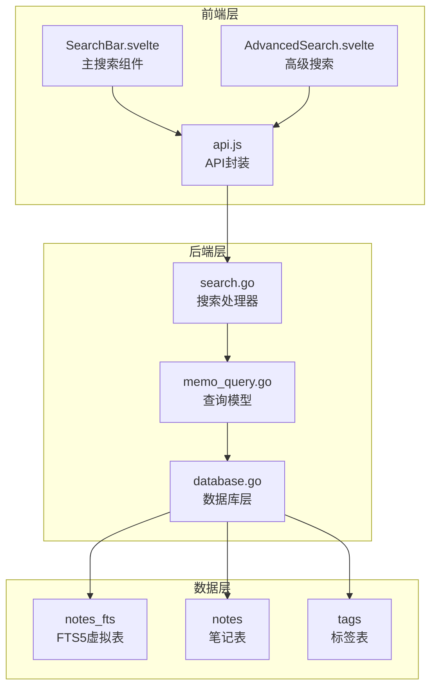
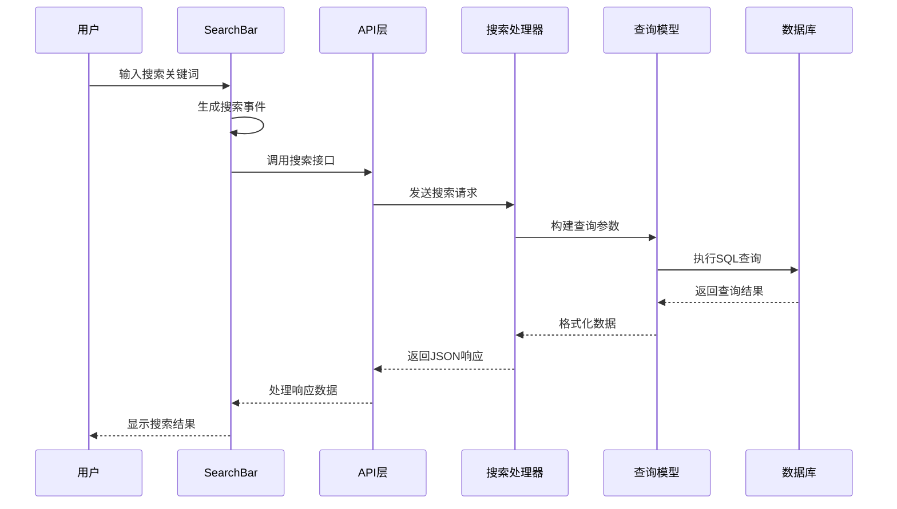
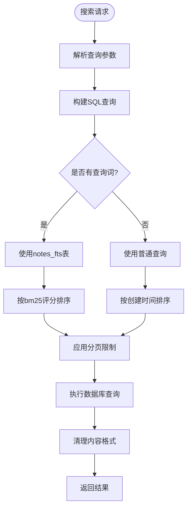
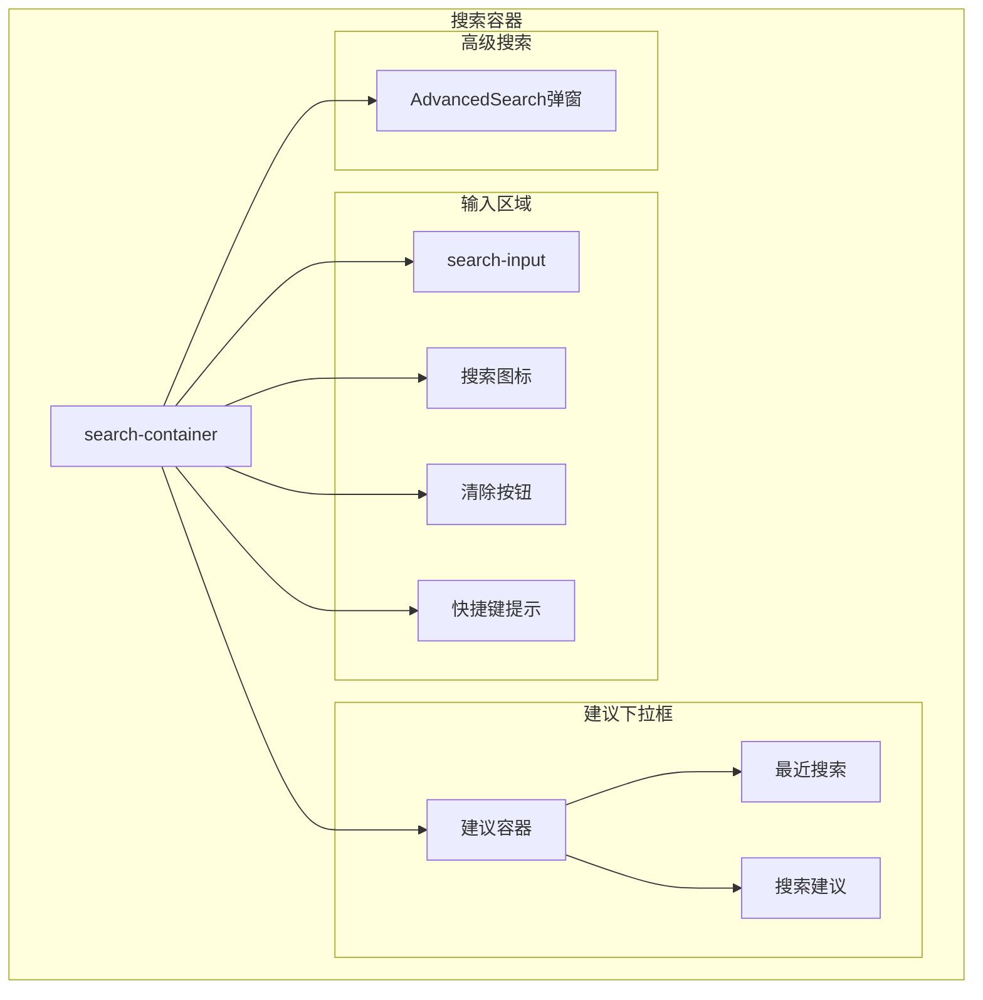
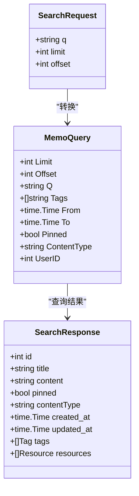
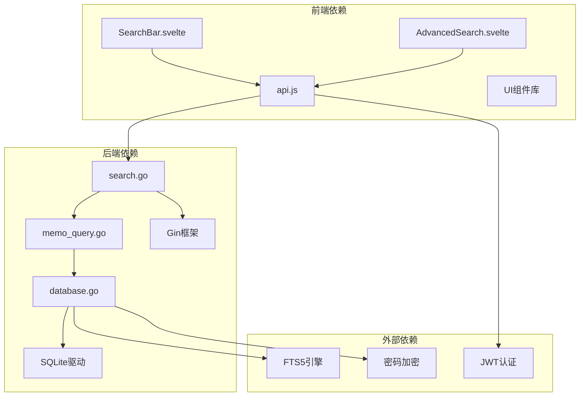

# 搜索栏组件

<cite>
**本文档引用的文件**
- [SearchBar.svelte](file://frontend/src/components/SearchBar.svelte)
- [AdvancedSearch.svelte](file://frontend/src/components/AdvancedSearch.svelte)
- [api.js](file://frontend/src/utils/api.js)
- [search.go](file://backend/handlers/search.go)
- [memo_query.go](file://backend/models/memo_query.go)
- [database.go](file://backend/database/database.go)
</cite>

## 目录
1. [简介](#简介)
2. [项目结构](#项目结构)
3. [核心组件](#核心组件)
4. [架构概览](#架构概览)
5. [详细组件分析](#详细组件分析)
6. [依赖关系分析](#依赖关系分析)
7. [性能考虑](#性能考虑)
8. [故障排除指南](#故障排除指南)
9. [结论](#结论)

## 简介

搜索栏组件是 Memo Studio 应用中的核心功能模块，提供了完整的全文搜索解决方案。该组件实现了现代化的搜索体验，包括实时搜索、智能建议、快捷键支持、搜索历史管理等功能。系统采用 SQLite FTS5 全文搜索引擎，结合 Go Gin Web 框架构建高性能的搜索服务。

## 项目结构

搜索功能涉及前后端多个层次的协作：

**图表来源**
- [SearchBar.svelte](file://frontend/src/components/SearchBar.svelte#L1-L251)
- [AdvancedSearch.svelte](file://frontend/src/components/AdvancedSearch.svelte#L1-L181)
- [api.js](file://frontend/src/utils/api.js#L1-L316)
- [search.go](file://backend/handlers/search.go#L1-L45)
- [memo_query.go](file://backend/models/memo_query.go#L1-L217)
- [database.go](file://backend/database/database.go#L243-L374)

**章节来源**
- [SearchBar.svelte](file://frontend/src/components/SearchBar.svelte#L1-L251)
- [AdvancedSearch.svelte](file://frontend/src/components/AdvancedSearch.svelte#L1-L181)
- [api.js](file://frontend/src/utils/api.js#L1-L316)
- [search.go](file://backend/handlers/search.go#L1-L45)
- [memo_query.go](file://backend/models/memo_query.go#L1-L217)
- [database.go](file://backend/database/database.go#L243-L374)

## 核心组件

### 主搜索组件 (SearchBar.svelte)

主搜索组件提供了完整的搜索界面和交互逻辑：

- **实时搜索**: 输入时即时触发搜索事件
- **搜索建议**: 基于输入生成智能建议
- **搜索历史**: 本地存储最近搜索记录
- **快捷键支持**: 支持 Cmd/Ctrl + K 打开搜索
- **高级搜索**: 通过弹窗提供复杂查询条件

### 高级搜索组件 (AdvancedSearch.svelte)

高级搜索组件支持复杂的查询条件：

- **关键词搜索**: 支持精确匹配和模糊搜索
- **时间范围**: 按创建时间或更新时间筛选
- **标签过滤**: 多标签组合筛选
- **排序控制**: 支多种排序方式和顺序
- **快捷键帮助**: 内置快捷键参考

### API 封装 (api.js)

统一的 API 访问层：

- **认证拦截**: 自动添加 Bearer Token
- **错误处理**: 标准化的错误响应处理
- **内容清理**: 自动清理和格式化返回数据
- **搜索接口**: 提供搜索笔记的统一方法

**章节来源**
- [SearchBar.svelte](file://frontend/src/components/SearchBar.svelte#L1-L251)
- [AdvancedSearch.svelte](file://frontend/src/components/AdvancedSearch.svelte#L1-L181)
- [api.js](file://frontend/src/utils/api.js#L1-L316)

## 架构概览

搜索系统的整体架构采用分层设计：

**图表来源**
- [SearchBar.svelte](file://frontend/src/components/SearchBar.svelte#L57-L96)
- [api.js](file://frontend/src/utils/api.js#L300-L310)
- [search.go](file://backend/handlers/search.go#L13-L43)
- [memo_query.go](file://backend/models/memo_query.go#L24-L152)

## 详细组件分析

### 搜索算法实现

#### 全文搜索 (FTS5)

系统采用 SQLite FTS5 虚拟表实现高效的全文搜索：

**图表来源**
- [memo_query.go](file://backend/models/memo_query.go#L24-L152)
- [database.go](file://backend/database/database.go#L254-L276)

#### 模糊匹配算法

系统支持多种匹配模式：

- **精确匹配**: 完整匹配整个查询词
- **前缀匹配**: 匹配以查询词开头的文本
- **包含匹配**: 匹配包含查询词的文本
- **多词匹配**: 支持多个关键词的组合查询

#### 搜索权重计算

搜索结果按照以下权重进行排序：

1. **置顶笔记**: `pinned = 1` 的笔记优先
2. **相关性评分**: 使用 BM25 算法计算文本相关性
3. **时间因素**: 最新创建的笔记排在前面
4. **ID 排序**: 作为最后的稳定排序依据

**章节来源**
- [memo_query.go](file://backend/models/memo_query.go#L103-L107)
- [database.go](file://backend/database/database.go#L254-L276)

### 搜索界面设计

#### 搜索栏界面元素

**图表来源**
- [SearchBar.svelte](file://frontend/src/components/SearchBar.svelte#L121-L234)

#### 交互状态管理

组件维护多种交互状态：

- **焦点状态**: 输入框获得焦点时的视觉反馈
- **建议状态**: 控制建议下拉框的显示/隐藏
- **高级搜索状态**: 管理高级搜索弹窗的开关
- **搜索历史状态**: 管理最近搜索记录的展示

**章节来源**
- [SearchBar.svelte](file://frontend/src/components/SearchBar.svelte#L1-L251)

### 搜索数据处理机制

#### 搜索缓存策略

系统采用多层次的缓存机制：

- **本地存储**: 使用 localStorage 缓存搜索历史
- **内存缓存**: 组件内部缓存最近的搜索结果
- **浏览器缓存**: 利用浏览器的 HTTP 缓存机制

#### 防抖处理

为了优化性能，系统实现了防抖机制：

- **输入防抖**: 防止频繁的搜索请求
- **建议延迟**: 延迟生成搜索建议
- **自动完成**: 智能的自动完成功能

#### 搜索结果排序

搜索结果按照以下优先级排序：

1. **置顶笔记**: `pinned = 1` 的笔记优先
2. **相关性评分**: 使用 BM25 算法计算的文本相关性
3. **创建时间**: 最新创建的笔记排在前面
4. **ID 排序**: 作为最后的稳定排序依据

**章节来源**
- [SearchBar.svelte](file://frontend/src/components/SearchBar.svelte#L23-L38)
- [memo_query.go](file://backend/models/memo_query.go#L93-L107)

### 搜索配置选项

#### 前端配置参数

| 参数 | 类型 | 默认值 | 描述 |
|------|------|--------|------|
| value | string | '' | 搜索框的初始值 |
| placeholder | string | '搜索笔记、标签...' | 输入框占位符文本 |
| isFocused | boolean | false | 控制输入框焦点状态 |
| showAdvanced | boolean | false | 控制高级搜索弹窗显示 |

#### 后端查询参数

| 参数 | 类型 | 默认值 | 描述 |
|------|------|--------|------|
| q | string | '' | 搜索关键词 |
| limit | int | 50 | 结果数量限制 |
| offset | int | 0 | 分页偏移量 |
| tags | []string | [] | 标签过滤条件 |
| from | time.Time | nil | 开始时间范围 |
| to | time.Time | nil | 结束时间范围 |
| pinned | *bool | nil | 置顶过滤条件 |
| contentType | string | '' | 内容类型过滤 |

**章节来源**
- [SearchBar.svelte](file://frontend/src/components/SearchBar.svelte#L7-L21)
- [memo_query.go](file://backend/models/memo_query.go#L12-L22)

### 后端 API 集成

#### 搜索接口规范

系统提供统一的搜索 API：

- **URL**: `/api/v1/search`
- **方法**: GET
- **参数**: `q` (必需), `limit`, `offset`
- **响应**: JSON 格式的笔记列表

#### 数据传输协议

**图表来源**
- [api.js](file://frontend/src/utils/api.js#L300-L310)
- [search.go](file://backend/handlers/search.go#L13-L43)
- [memo_query.go](file://backend/models/memo_query.go#L12-L22)

**章节来源**
- [api.js](file://frontend/src/utils/api.js#L300-L310)
- [search.go](file://backend/handlers/search.go#L13-L43)

### 扩展方法

#### 自定义搜索规则

系统支持灵活的搜索规则定制：

- **字段过滤**: 支持按特定字段进行过滤
- **权重调整**: 可调整不同字段的搜索权重
- **排序定制**: 支持自定义排序规则
- **结果限制**: 可设置最大返回结果数量

#### 第三方搜索服务集成

系统设计支持集成第三方搜索服务：

- **接口抽象**: 统一的搜索接口定义
- **配置切换**: 支持本地搜索与云搜索的切换
- **性能监控**: 集成搜索性能指标收集
- **错误处理**: 标准化的第三方服务错误处理

**章节来源**
- [memo_query.go](file://backend/models/memo_query.go#L12-L22)
- [database.go](file://backend/database/database.go#L254-L276)

## 依赖关系分析

**图表来源**
- [SearchBar.svelte](file://frontend/src/components/SearchBar.svelte#L1-L6)
- [AdvancedSearch.svelte](file://frontend/src/components/AdvancedSearch.svelte#L1-L5)
- [api.js](file://frontend/src/utils/api.js#L1-L10)
- [search.go](file://backend/handlers/search.go#L1-L11)
- [memo_query.go](file://backend/models/memo_query.go#L1-L10)
- [database.go](file://backend/database/database.go#L3-L16)

**章节来源**
- [SearchBar.svelte](file://frontend/src/components/SearchBar.svelte#L1-L6)
- [AdvancedSearch.svelte](file://frontend/src/components/AdvancedSearch.svelte#L1-L5)
- [api.js](file://frontend/src/utils/api.js#L1-L10)
- [search.go](file://backend/handlers/search.go#L1-L11)
- [memo_query.go](file://backend/models/memo_query.go#L1-L10)
- [database.go](file://backend/database/database.go#L3-L16)

## 性能考虑

### 数据库优化

系统采用多种数据库优化策略：

- **FTS5 虚拟表**: 使用 SQLite 的全文搜索功能
- **触发器同步**: 自动维护 FTS 表与主表的数据一致性
- **索引优化**: 为常用查询字段建立适当的索引
- **连接池管理**: 合理的数据库连接池配置

### 前端性能优化

- **懒加载**: 搜索结果的延迟加载
- **虚拟滚动**: 大量结果的高效渲染
- **防抖机制**: 减少不必要的搜索请求
- **缓存策略**: 多层次的数据缓存

### 网络优化

- **HTTP 缓存**: 利用浏览器缓存机制
- **压缩传输**: Gzip 压缩减少传输数据量
- **连接复用**: HTTP/2 连接复用提高效率
- **错误重试**: 智能的网络错误重试机制

## 故障排除指南

### 常见问题及解决方案

#### 搜索无结果

**可能原因**:
- FTS5 功能未正确启用
- 数据库初始化失败
- 搜索关键词过短

**解决方法**:
1. 检查 SQLite 编译参数是否包含 FTS5 支持
2. 验证数据库连接和表结构
3. 确认搜索关键词长度至少为2个字符

#### 搜索速度慢

**可能原因**:
- 数据库表缺少必要的索引
- 查询条件过于复杂
- 数据量过大

**解决方法**:
1. 为常用查询字段添加索引
2. 简化查询条件
3. 考虑分页查询和结果限制

#### 权限问题

**可能原因**:
- 用户未登录或会话过期
- 权限不足访问某些笔记
- 认证令牌无效

**解决方法**:
1. 检查用户登录状态
2. 验证用户权限设置
3. 重新获取认证令牌

**章节来源**
- [database.go](file://backend/database/database.go#L254-L276)
- [api.js](file://frontend/src/utils/api.js#L34-L50)

## 结论

搜索栏组件是一个功能完整、性能优异的搜索解决方案。它结合了现代前端技术和高效的后端搜索算法，为用户提供流畅的搜索体验。系统的主要优势包括：

- **高性能**: 基于 SQLite FTS5 的全文搜索
- **易用性**: 直观的用户界面和丰富的交互功能
- **可扩展性**: 模块化的架构设计支持功能扩展
- **可靠性**: 完善的错误处理和性能优化

通过合理的配置和优化，该搜索组件能够满足各种规模应用的搜索需求，并为未来的功能扩展奠定了良好的基础。