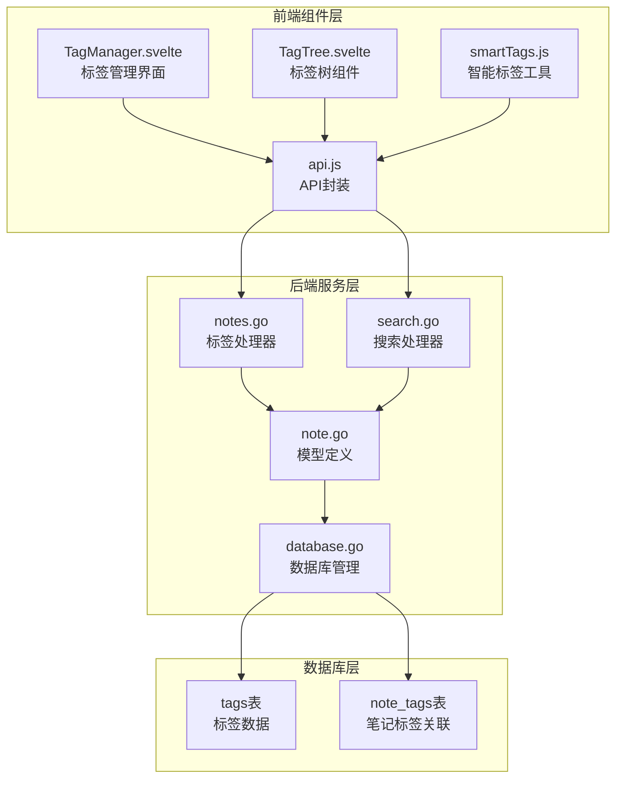
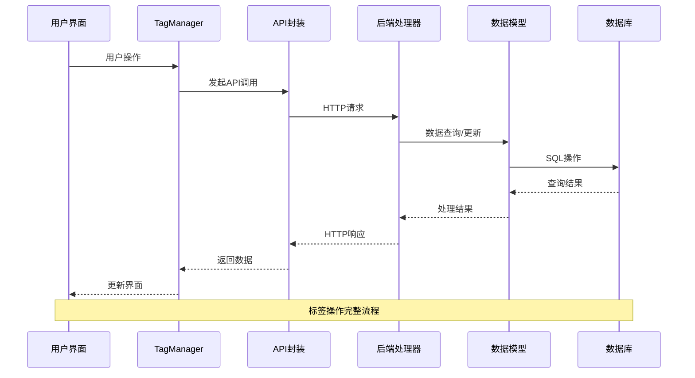
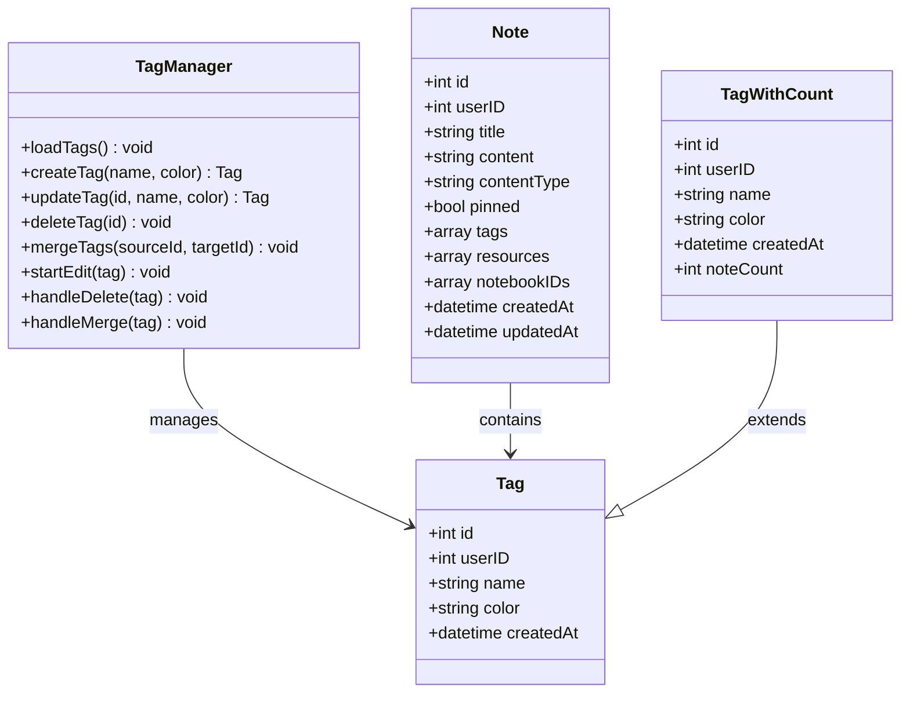
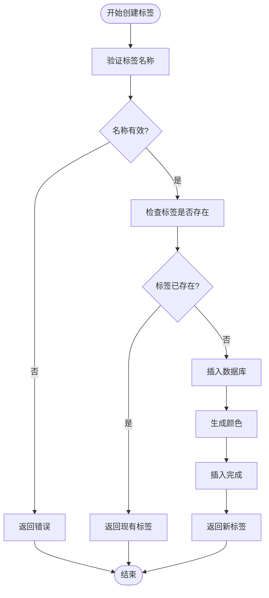
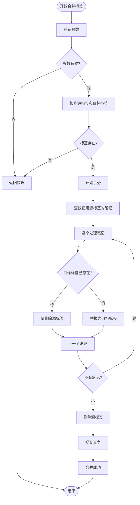
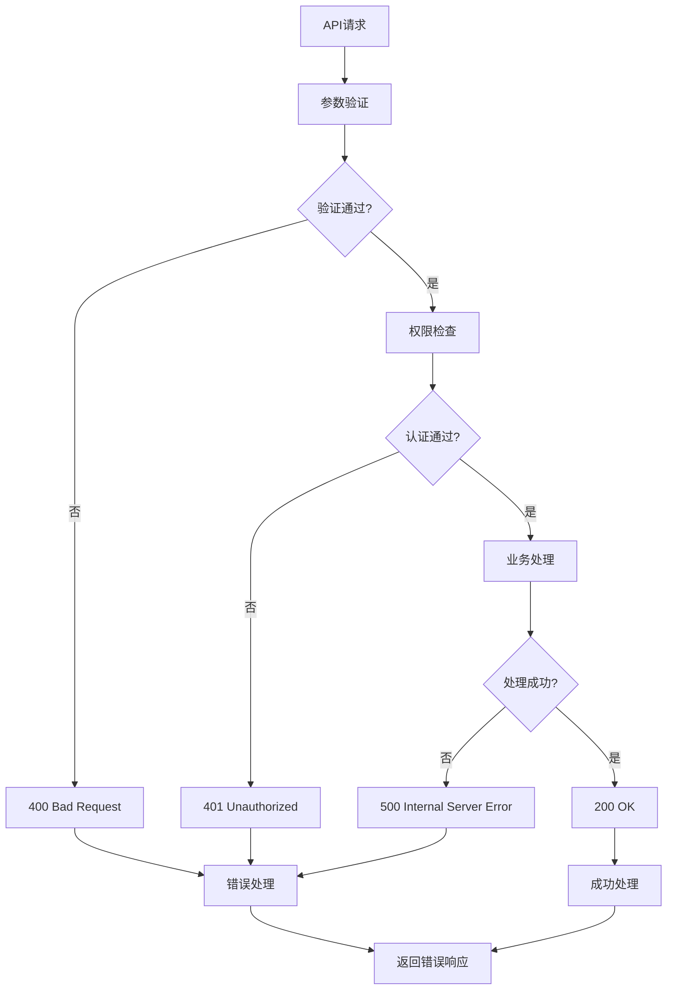
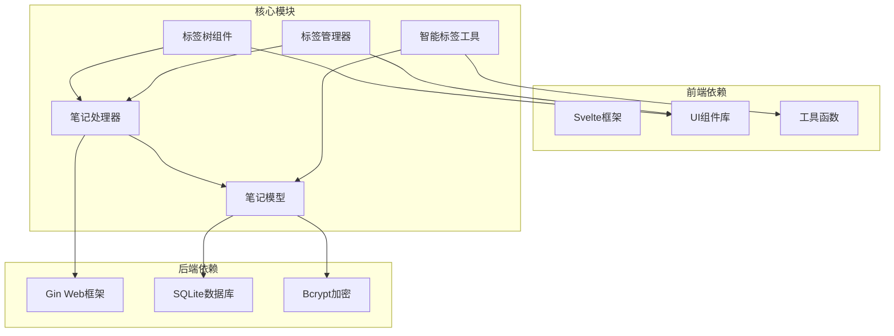

# 标签管理组件

<cite>
**本文档引用的文件**
- [frontend/src/components/TagManager.svelte](file://frontend/src/components/TagManager.svelte)
- [frontend/src/components/TagTree.svelte](file://frontend/src/components/TagTree.svelte)
- [frontend/src/utils/smartTags.js](file://frontend/src/utils/smartTags.js)
- [frontend/src/utils/api.js](file://frontend/src/utils/api.js)
- [backend/handlers/notes.go](file://backend/handlers/notes.go)
- [backend/handlers/search.go](file://backend/handlers/search.go)
- [backend/models/note.go](file://backend/models/note.go)
- [backend/database/database.go](file://backend/database/database.go)
</cite>

## 目录
1. [简介](#简介)
2. [项目结构](#项目结构)
3. [核心组件](#核心组件)
4. [架构概览](#架构概览)
5. [详细组件分析](#详细组件分析)
6. [依赖关系分析](#依赖关系分析)
7. [性能考虑](#性能考虑)
8. [故障排除指南](#故障排除指南)
9. [结论](#结论)
10. [附录](#附录)

## 简介

标签管理组件是 Memo Studio 笔记系统中的核心功能模块，负责管理用户的标签体系。该组件提供了完整的标签生命周期管理，包括标签的创建、编辑、删除、合并等核心功能，以及高级的标签树展示和交互逻辑。

标签系统采用多对多关系设计，支持标签的颜色管理、使用频率统计、智能推荐等功能特性。通过前后端分离的架构设计，实现了高效的数据同步和实时更新机制。

## 项目结构

标签管理组件主要分布在前端和后端两个层面：

**图表来源**
- [frontend/src/components/TagManager.svelte](file://frontend/src/components/TagManager.svelte#L1-L212)
- [frontend/src/components/TagTree.svelte](file://frontend/src/components/TagTree.svelte#L1-L81)
- [frontend/src/utils/smartTags.js](file://frontend/src/utils/smartTags.js#L1-L345)
- [frontend/src/utils/api.js](file://frontend/src/utils/api.js#L1-L316)
- [backend/handlers/notes.go](file://backend/handlers/notes.go#L360-L513)
- [backend/models/note.go](file://backend/models/note.go#L29-L789)
- [backend/database/database.go](file://backend/database/database.go#L279-L297)

**章节来源**
- [frontend/src/components/TagManager.svelte](file://frontend/src/components/TagManager.svelte#L1-L212)
- [frontend/src/components/TagTree.svelte](file://frontend/src/components/TagTree.svelte#L1-L81)
- [frontend/src/utils/smartTags.js](file://frontend/src/utils/smartTags.js#L1-L345)
- [frontend/src/utils/api.js](file://frontend/src/utils/api.js#L1-L316)
- [backend/handlers/notes.go](file://backend/handlers/notes.go#L360-L513)
- [backend/models/note.go](file://backend/models/note.go#L29-L789)
- [backend/database/database.go](file://backend/database/database.go#L279-L297)

## 核心组件

### 标签管理器 (TagManager)

TagManager 是标签管理的主要界面组件，提供完整的标签 CRUD 操作：

- **标签列表展示**：显示所有标签及其使用次数
- **编辑功能**：支持标签名称和颜色的修改
- **删除功能**：安全删除标签并从所有笔记中移除
- **合并功能**：将重复或相似的标签合并到目标标签
- **对话框交互**：提供模态对话框进行确认操作

### 标签树组件 (TagTree)

TagTree 提供层级化的标签浏览体验：

- **折叠展开**：支持标签树的折叠和展开功能
- **使用计数**：显示每个标签的使用频率
- **选中状态**：高亮显示当前选中的标签
- **交互式选择**：点击标签触发选择事件

### 智能标签工具 (smartTags)

智能标签工具集成了标签使用统计和推荐算法：

- **使用统计**：分析标签使用频率和最近使用情况
- **智能推荐**：基于内容关键词和上下文关系推荐标签
- **模板系统**：提供预设的标签模板和自定义模板支持

**章节来源**
- [frontend/src/components/TagManager.svelte](file://frontend/src/components/TagManager.svelte#L1-L212)
- [frontend/src/components/TagTree.svelte](file://frontend/src/components/TagTree.svelte#L1-L81)
- [frontend/src/utils/smartTags.js](file://frontend/src/utils/smartTags.js#L1-L345)

## 架构概览

标签管理系统采用分层架构设计，实现了清晰的关注点分离：

**图表来源**
- [frontend/src/utils/api.js](file://frontend/src/utils/api.js#L232-L298)
- [backend/handlers/notes.go](file://backend/handlers/notes.go#L388-L512)
- [backend/models/note.go](file://backend/models/note.go#L594-L729)

系统架构的关键特点：

1. **前后端分离**：前端组件通过 API 封装与后端通信
2. **数据持久化**：采用 SQLite 数据库存储标签和关联关系
3. **事务处理**：关键操作（如标签合并）使用数据库事务保证数据一致性
4. **权限控制**：基于用户 ID 的多用户隔离机制

**章节来源**
- [frontend/src/utils/api.js](file://frontend/src/utils/api.js#L1-L316)
- [backend/handlers/notes.go](file://backend/handlers/notes.go#L360-L513)
- [backend/database/database.go](file://backend/database/database.go#L564-L647)

## 详细组件分析

### 标签数据模型

标签系统的核心数据结构定义如下：

**图表来源**
- [backend/models/note.go](file://backend/models/note.go#L29-L44)
- [frontend/src/components/TagManager.svelte](file://frontend/src/components/TagManager.svelte#L16-L105)

### 标签操作流程

#### 标签创建流程

**图表来源**
- [backend/handlers/notes.go](file://backend/handlers/notes.go#L388-L422)
- [backend/models/note.go](file://backend/models/note.go#L594-L629)

#### 标签合并流程

**图表来源**
- [backend/handlers/notes.go](file://backend/handlers/notes.go#L480-L512)
- [backend/models/note.go](file://backend/models/note.go#L670-L729)

### API 接口定义

标签管理组件提供以下 REST API 接口：

| 方法 | 端点 | 描述 | 请求体 | 响应 |
|------|------|------|--------|------|
| GET | `/api/v1/tags` | 获取标签列表 | - | `Tag[]` |
| POST | `/api/v1/tags` | 创建新标签 | `{name, color}` | `Tag` |
| PUT | `/api/v1/tags/:id` | 更新标签 | `{name, color}` | `Tag` |
| DELETE | `/api/v1/tags/:id` | 删除标签 | - | `{success: true}` |
| POST | `/api/v1/tags/merge` | 合并标签 | `{sourceId, targetId}` | `{success: true, message: string}` |

**章节来源**
- [frontend/src/utils/api.js](file://frontend/src/utils/api.js#L232-L298)
- [backend/handlers/notes.go](file://backend/handlers/notes.go#L360-L512)

### 错误处理策略

系统采用统一的错误处理机制：

**图表来源**
- [frontend/src/utils/api.js](file://frontend/src/utils/api.js#L33-L50)
- [backend/handlers/notes.go](file://backend/handlers/notes.go#L388-L422)

**章节来源**
- [frontend/src/utils/api.js](file://frontend/src/utils/api.js#L33-L50)
- [backend/handlers/notes.go](file://backend/handlers/notes.go#L388-L422)

## 依赖关系分析

标签管理组件的依赖关系图：

**图表来源**
- [frontend/src/components/TagManager.svelte](file://frontend/src/components/TagManager.svelte#L1-L14)
- [frontend/src/utils/smartTags.js](file://frontend/src/utils/smartTags.js#L1-L3)
- [backend/handlers/notes.go](file://backend/handlers/notes.go#L1-L11)
- [backend/models/note.go](file://backend/models/note.go#L1-L9)

**章节来源**
- [frontend/src/components/TagManager.svelte](file://frontend/src/components/TagManager.svelte#L1-L14)
- [frontend/src/utils/smartTags.js](file://frontend/src/utils/smartTags.js#L1-L3)
- [backend/handlers/notes.go](file://backend/handlers/notes.go#L1-L11)
- [backend/models/note.go](file://backend/models/note.go#L1-L9)

## 性能考虑

### 数据库优化

1. **索引策略**：为 `tags(user_id, name)` 建立唯一索引，确保标签名称的唯一性和查询性能
2. **事务处理**：标签合并操作使用数据库事务，保证数据一致性和回滚能力
3. **连接池配置**：SQLite 默认连接池配置，支持并发访问

### 前端性能优化

1. **懒加载**：标签树组件支持折叠展开，减少一次性渲染的数据量
2. **虚拟滚动**：对于大量标签的情况，可以考虑实现虚拟滚动
3. **缓存策略**：API 层面实现响应缓存，减少重复请求

### 大数据量处理

1. **分页查询**：标签列表支持分页，避免一次性加载过多数据
2. **增量更新**：标签使用计数采用增量计算，避免全量扫描
3. **智能推荐**：使用局部变量缓存标签使用统计，提高推荐算法性能

## 故障排除指南

### 常见问题及解决方案

| 问题类型 | 症状 | 可能原因 | 解决方案 |
|----------|------|----------|----------|
| 标签创建失败 | 返回 400 错误 | 标签名称为空 | 检查前端验证逻辑 |
| 权限错误 | 返回 401 错误 | Token 过期或无效 | 重新登录获取新 Token |
| 标签合并失败 | 数据不一致 | 源标签或目标标签不存在 | 验证标签 ID 的有效性 |
| 性能问题 | 页面加载缓慢 | 标签数量过多 | 实施分页和懒加载策略 |

### 调试技巧

1. **网络请求监控**：使用浏览器开发者工具监控 API 请求和响应
2. **数据库查询分析**：通过 SQLite 日志分析慢查询
3. **前端状态检查**：使用 Svelte DevTools 检查组件状态变化

**章节来源**
- [frontend/src/utils/api.js](file://frontend/src/utils/api.js#L33-L50)
- [backend/handlers/notes.go](file://backend/handlers/notes.go#L480-L512)

## 结论

标签管理组件通过精心设计的架构和实现，为用户提供了完整的标签管理体系。系统具备以下优势：

1. **功能完整性**：涵盖标签生命周期的所有核心功能
2. **用户体验**：直观的界面设计和流畅的交互体验
3. **数据一致性**：通过事务处理和权限控制保证数据安全
4. **扩展性**：模块化设计便于功能扩展和维护

未来可以考虑的功能增强包括：标签层级结构支持、标签导入导出、更丰富的统计分析功能等。

## 附录

### 最佳实践指南

1. **标签命名规范**
   - 使用简洁明确的标签名称
   - 避免创建重复或相似的标签
   - 建议使用统一的标签分类体系

2. **标签使用建议**
   - 合理控制标签数量，避免过度标签化
   - 定期清理不使用的标签
   - 利用标签合并功能整理重复标签

3. **性能优化建议**
   - 对于大量标签的场景，启用分页和懒加载
   - 定期维护数据库索引
   - 使用智能推荐功能提高标签使用效率

4. **安全注意事项**
   - 定期更新密码，避免使用默认密码
   - 合理设置标签权限，保护敏感信息
   - 定期备份数据库，防止数据丢失