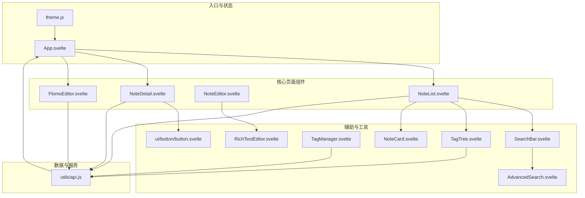
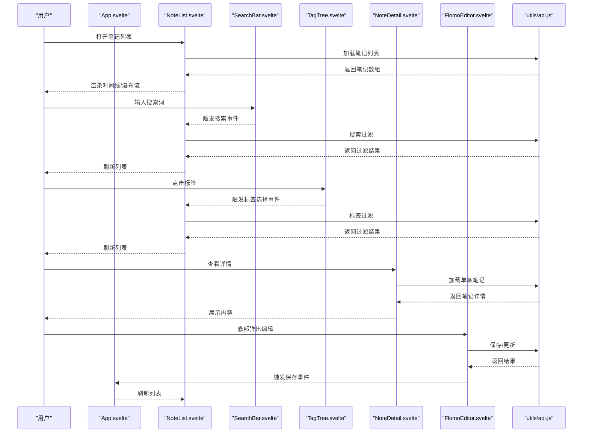
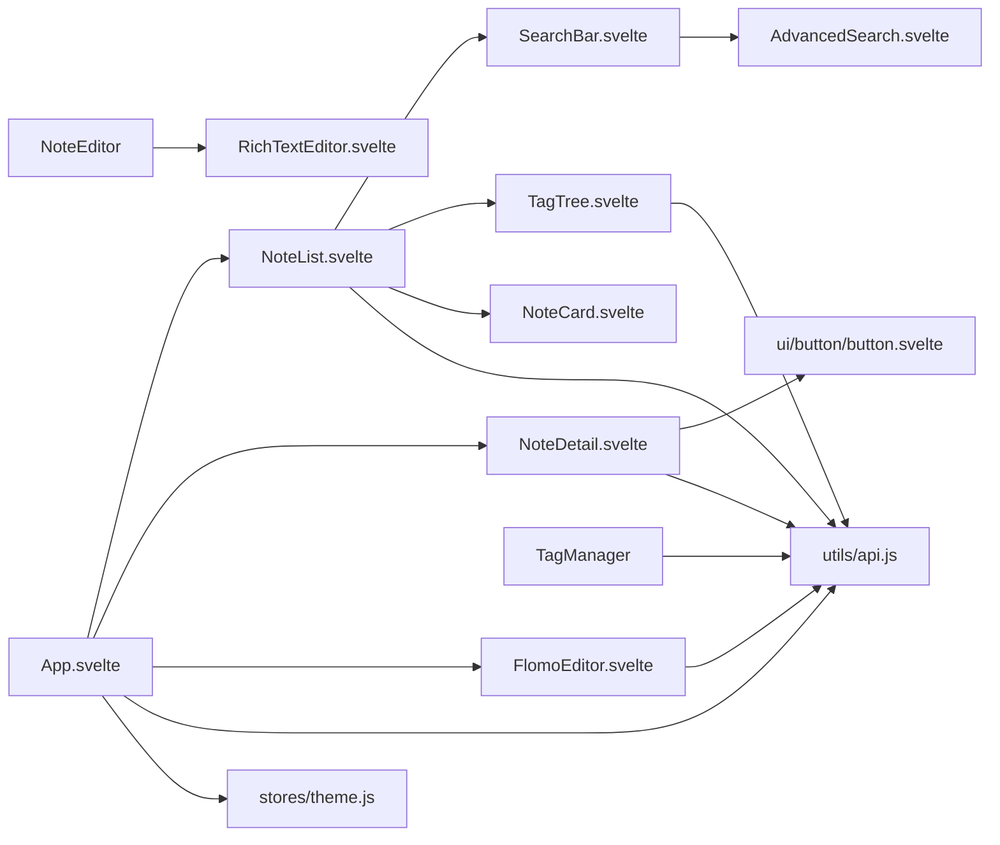

# 核心组件

<cite>
**本文档引用的文件**
- [frontend/src/components/NoteList.svelte](file://frontend/src/components/NoteList.svelte)
- [frontend/src/components/NoteDetail.svelte](file://frontend/src/components/NoteDetail.svelte)
- [frontend/src/components/NoteEditor.svelte](file://frontend/src/components/NoteEditor.svelte)
- [frontend/src/components/FlomoEditor.svelte](file://frontend/src/components/FlomoEditor.svelte)
- [frontend/src/components/SearchBar.svelte](file://frontend/src/components/SearchBar.svelte)
- [frontend/src/components/AdvancedSearch.svelte](file://frontend/src/components/AdvancedSearch.svelte)
- [frontend/src/components/TagManager.svelte](file://frontend/src/components/TagManager.svelte)
- [frontend/src/components/TagTree.svelte](file://frontend/src/components/TagTree.svelte)
- [frontend/src/components/NoteCard.svelte](file://frontend/src/components/NoteCard.svelte)
- [frontend/src/components/RichTextEditor.svelte](file://frontend/src/components/RichTextEditor.svelte)
- [frontend/src/utils/api.js](file://frontend/src/utils/api.js)
- [frontend/src/stores/theme.js](file://frontend/src/stores/theme.js)
- [frontend/src/App.svelte](file://frontend/src/App.svelte)
- [frontend/src/lib/components/ui/button/button.svelte](file://frontend/src/lib/components/ui/button/button.svelte)
- [frontend/package.json](file://frontend/package.json)
</cite>

## 目录
1. [简介](#简介)
2. [项目结构](#项目结构)
3. [核心组件](#核心组件)
4. [架构总览](#架构总览)
5. [组件详解](#组件详解)
6. [依赖关系分析](#依赖关系分析)
7. [性能与可用性](#性能与可用性)
8. [故障排查指南](#故障排查指南)
9. [结论](#结论)
10. [附录](#附录)

## 简介
本文件面向 Memo Studio 的前端核心组件体系，围绕笔记列表、笔记详情、笔记编辑器、Flomo 风格编辑器、标签管理器、搜索栏等关键组件，系统梳理其功能实现、属性接口、事件处理、状态管理、生命周期钩子、组件间通信与数据流，并给出可复用设计、参数配置、样式定制、使用示例、最佳实践与性能优化建议。目标是帮助开发者快速理解并高效扩展这些组件。

## 项目结构
前端采用 Svelte 5 技术栈，组件集中在 frontend/src/components，通用 UI 组件位于 frontend/src/lib/components/ui，工具函数与 API 封装在 utils，全局状态通过 stores 管理，入口在 App.svelte。

图表来源
- [frontend/src/App.svelte](file://frontend/src/App.svelte#L1-L328)
- [frontend/src/components/NoteList.svelte](file://frontend/src/components/NoteList.svelte#L1-L507)
- [frontend/src/components/NoteDetail.svelte](file://frontend/src/components/NoteDetail.svelte#L1-L223)
- [frontend/src/components/NoteEditor.svelte](file://frontend/src/components/NoteEditor.svelte#L1-L280)
- [frontend/src/components/FlomoEditor.svelte](file://frontend/src/components/FlomoEditor.svelte#L1-L270)
- [frontend/src/components/SearchBar.svelte](file://frontend/src/components/SearchBar.svelte#L1-L251)
- [frontend/src/components/AdvancedSearch.svelte](file://frontend/src/components/AdvancedSearch.svelte#L1-L181)
- [frontend/src/components/TagTree.svelte](file://frontend/src/components/TagTree.svelte#L1-L81)
- [frontend/src/components/TagManager.svelte](file://frontend/src/components/TagManager.svelte#L1-L212)
- [frontend/src/components/RichTextEditor.svelte](file://frontend/src/components/RichTextEditor.svelte#L1-L333)
- [frontend/src/components/NoteCard.svelte](file://frontend/src/components/NoteCard.svelte#L1-L133)
- [frontend/src/utils/api.js](file://frontend/src/utils/api.js#L1-L316)
- [frontend/src/stores/theme.js](file://frontend/src/stores/theme.js#L1-L40)

章节来源
- [frontend/src/App.svelte](file://frontend/src/App.svelte#L1-L328)
- [frontend/package.json](file://frontend/package.json#L1-L25)

## 核心组件
- 笔记列表组件：负责加载、筛选、分组展示笔记，支持时间线与瀑布流视图，提供批量选择与删除、侧边栏与移动端交互。
- 笔记详情组件：展示单条笔记的标题、时间、标签与内容，支持返回、编辑、删除。
- 笔记编辑器：富文本编辑器封装，支持标签输入、Markdown 提示、内容校验与保存。
- Flomo 风格编辑器：底部弹出式编辑器，支持自动高度、快捷键、标签建议、保存与取消。
- 搜索栏：支持全局快捷键、建议与最近搜索、高级搜索弹窗。
- 标签管理器：提供标签的编辑、删除、合并与使用统计。
- 标签树：侧边栏标签筛选，按使用次数展示。
- 笔记卡片：列表项预览，支持标签点击、双击编辑提示。
- 富文本编辑器：内容可编辑区域，支持 #标签与 @笔记引用建议。
- API 工具：统一认证、错误处理、内容清洗与笔记/标签 CRUD。
- 主题存储：主题订阅与持久化。

章节来源
- [frontend/src/components/NoteList.svelte](file://frontend/src/components/NoteList.svelte#L1-L507)
- [frontend/src/components/NoteDetail.svelte](file://frontend/src/components/NoteDetail.svelte#L1-L223)
- [frontend/src/components/NoteEditor.svelte](file://frontend/src/components/NoteEditor.svelte#L1-L280)
- [frontend/src/components/FlomoEditor.svelte](file://frontend/src/components/FlomoEditor.svelte#L1-L270)
- [frontend/src/components/SearchBar.svelte](file://frontend/src/components/SearchBar.svelte#L1-L251)
- [frontend/src/components/AdvancedSearch.svelte](file://frontend/src/components/AdvancedSearch.svelte#L1-L181)
- [frontend/src/components/TagManager.svelte](file://frontend/src/components/TagManager.svelte#L1-L212)
- [frontend/src/components/TagTree.svelte](file://frontend/src/components/TagTree.svelte#L1-L81)
- [frontend/src/components/NoteCard.svelte](file://frontend/src/components/NoteCard.svelte#L1-L133)
- [frontend/src/components/RichTextEditor.svelte](file://frontend/src/components/RichTextEditor.svelte#L1-L333)
- [frontend/src/utils/api.js](file://frontend/src/utils/api.js#L1-L316)
- [frontend/src/stores/theme.js](file://frontend/src/stores/theme.js#L1-L40)

## 架构总览
组件间通过事件与 props 进行松耦合通信，状态主要由父组件 App.svelte 统一调度，NoteList 作为中枢协调搜索、标签、视图模式与笔记列表渲染；FlomoEditor 以浮层形式与主界面解耦；API 工具集中处理认证与错误。

图表来源
- [frontend/src/App.svelte](file://frontend/src/App.svelte#L53-L107)
- [frontend/src/components/NoteList.svelte](file://frontend/src/components/NoteList.svelte#L39-L85)
- [frontend/src/components/SearchBar.svelte](file://frontend/src/components/SearchBar.svelte#L57-L96)
- [frontend/src/components/TagTree.svelte](file://frontend/src/components/TagTree.svelte#L37-L43)
- [frontend/src/components/NoteDetail.svelte](file://frontend/src/components/NoteDetail.svelte#L22-L40)
- [frontend/src/components/FlomoEditor.svelte](file://frontend/src/components/FlomoEditor.svelte#L100-L128)
- [frontend/src/utils/api.js](file://frontend/src/utils/api.js#L154-L229)

## 组件详解

### 笔记列表组件（NoteList）
- 职责：加载笔记、搜索过滤、标签过滤、分组展示、视图切换、批量选择与删除、侧边栏与移动端交互。
- 关键属性与事件
  - 属性：onQuickEdit（可选回调，用于双击快速编辑）
  - 事件：noteClick（携带 noteId）、内部事件（如 clearFilters、handleViewModeChange）
- 状态管理
  - notes、filteredNotes、loading、error、searchQuery、selectedTags、viewMode、selectedNoteIds、sidebarCollapsed、mobileMenuOpen
- 生命周期
  - onMount：初始化加载、窗口尺寸监听、移动端侧边栏控制
- 数据流
  - 通过 api.getNotes() 获取数据，filterNotes() 进行搜索与标签过滤，$: groupedNotes 基于 created_at 分组
- 交互要点
  - 支持时间线与瀑布流两种视图，移动端侧边栏折叠/展开，批量删除确认与刷新
- 可复用性
  - 通过 onQuickEdit 与事件分发实现与上层的解耦；视图模式与筛选状态可外部传入

章节来源
- [frontend/src/components/NoteList.svelte](file://frontend/src/components/NoteList.svelte#L1-L507)
- [frontend/src/utils/api.js](file://frontend/src/utils/api.js#L154-L163)

### 笔记详情组件（NoteDetail）
- 职责：展示单条笔记的标题、时间、标签与内容，提供返回、编辑、删除操作。
- 关键属性与事件
  - 属性：noteId
  - 事件：back、edit（携带笔记对象）、deleted
- 状态管理
  - note、loading、error、isHovered
- 生命周期
  - onMount：加载笔记，内容类型兼容处理
- 数据流
  - 通过 api.getNote(noteId) 获取详情，格式化时间与相对时间
- 无障碍与交互
  - 卡片悬停高亮、返回按钮、编辑/删除按钮，删除前二次确认

章节来源
- [frontend/src/components/NoteDetail.svelte](file://frontend/src/components/NoteDetail.svelte#L1-L223)
- [frontend/src/utils/api.js](file://frontend/src/utils/api.js#L165-L174)

### 笔记编辑器（NoteEditor）
- 职责：标题输入、标签管理、富文本编辑、保存与取消。
- 关键属性与事件
  - 属性：note（可选，编辑模式时传入）
  - 事件：save、cancel
- 状态管理
  - title、content、tags、allTags、loading、showTagSuggestions
- 生命周期
  - onMount：初始化标题/内容/标签，加载全部标签
- 数据流
  - 富文本变更通过 handleContentChange 回传，保存时提取 #标签，调用 api.createNote 或 api.updateNote
- 交互要点
  - 标签输入支持逗号分隔与点击建议，内容为空校验，保存按钮 loading 状态

章节来源
- [frontend/src/components/NoteEditor.svelte](file://frontend/src/components/NoteEditor.svelte#L1-L280)
- [frontend/src/components/RichTextEditor.svelte](file://frontend/src/components/RichTextEditor.svelte#L1-L333)
- [frontend/src/utils/api.js](file://frontend/src/utils/api.js#L176-L203)

### Flomo 风格编辑器（FlomoEditor）
- 职责：底部弹出式编辑器，自动高度、快捷键、标签建议、保存与取消。
- 关键属性与事件
  - 属性：note（可选）、mode（'create' | 'edit'）
  - 事件：save、cancel
- 状态管理
  - content、title、tags、allTags、loading、textareaRef、showTags、tagInputFocused
- 生命周期
  - onMount：填充内容、自动聚焦、加载标签
- 数据流
  - handleInput 中检测 # 触发标签建议，handleKeydown 支持 Ctrl+Enter 保存，handleSave 调用 api.createNote/updateNote
- 交互要点
  - ESC 取消，标签建议下拉，字数统计，禁用保存按钮条件判断

章节来源
- [frontend/src/components/FlomoEditor.svelte](file://frontend/src/components/FlomoEditor.svelte#L1-L270)
- [frontend/src/utils/api.js](file://frontend/src/utils/api.js#L176-L203)

### 搜索栏（SearchBar）
- 职责：全局快捷键、建议与最近搜索、触发高级搜索。
- 关键属性与事件
  - 属性：value（受控）
  - 事件：search（携带查询值）
- 状态管理
  - inputValue、isFocused、showAdvanced、showSuggestions、suggestions、recentSearches
- 生命周期
  - onMount：加载 localStorage 最近搜索，绑定全局 Cmd/Ctrl+K 快捷键
- 数据流
  - 输入时派发 search 事件，生成建议与最近搜索，提交后写入 localStorage
- 交互要点
  - ESC 关闭高级搜索，清除按钮、快捷键提示

章节来源
- [frontend/src/components/SearchBar.svelte](file://frontend/src/components/SearchBar.svelte#L1-L251)
- [frontend/src/components/AdvancedSearch.svelte](file://frontend/src/components/AdvancedSearch.svelte#L1-L181)

### 高级搜索（AdvancedSearch）
- 职责：关键词、日期范围、排序方式与顺序的高级筛选。
- 关键事件
  - search（携带 keyword/tags/dateFrom/dateTo/sortBy/sortOrder）
  - clear
- 交互要点
  - ? 显示快捷键帮助，Esc 关闭帮助

章节来源
- [frontend/src/components/AdvancedSearch.svelte](file://frontend/src/components/AdvancedSearch.svelte#L1-L181)

### 标签管理器（TagManager）
- 职责：标签的编辑、删除、合并，显示使用次数。
- 关键事件
  - updated（标签变更后通知上层刷新）
- 状态管理
  - tags、editingTag、showEditDialog、editName、editColor、mergeSource、showMergeDialog
- 数据流
  - 通过 api.getTags、api.updateTag、api.deleteTag、api.mergeTags 管理标签

章节来源
- [frontend/src/components/TagManager.svelte](file://frontend/src/components/TagManager.svelte#L1-L212)
- [frontend/src/utils/api.js](file://frontend/src/utils/api.js#L232-L298)

### 标签树（TagTree）
- 职责：侧边栏标签筛选，计算使用次数并展示。
- 关键属性与事件
  - 属性：selectedTags（受控）
  - 事件：tagSelect（携带 tag）
- 状态管理
  - tags、collapsed
- 数据流
  - 加载标签与笔记，计算每个标签的使用次数

章节来源
- [frontend/src/components/TagTree.svelte](file://frontend/src/components/TagTree.svelte#L1-L81)
- [frontend/src/utils/api.js](file://frontend/src/utils/api.js#L232-L240)

### 笔记卡片（NoteCard）
- 职责：列表项预览，支持标签点击、双击编辑提示。
- 关键事件
  - click、doubleClick、tagClick（携带 tag 与事件）
- 状态管理
  - isHovered
- 交互要点
  - 标签点击阻止冒泡，格式化时间与相对时间，双击编辑提示

章节来源
- [frontend/src/components/NoteCard.svelte](file://frontend/src/components/NoteCard.svelte#L1-L133)

### 富文本编辑器（RichTextEditor）
- 职责：内容可编辑区域，支持 #标签与 @笔记引用建议。
- 关键属性与事件
  - 属性：value、placeholder
  - 事件：input（携带 HTML 内容）
- 状态管理
  - editorElement、suggestionElement、allTags、allNotes、showTagSuggestions、showNoteSuggestions、suggestions、suggestionIndex、triggerPosition、currentTrigger、suggestionPosition
- 数据流
  - 加载标签与笔记，根据光标位置检测 # 与 @，插入建议并更新值
- 交互要点
  - 键盘上下移动、回车/Tab 插入选中项，Esc 隐藏建议

章节来源
- [frontend/src/components/RichTextEditor.svelte](file://frontend/src/components/RichTextEditor.svelte#L1-L333)
- [frontend/src/utils/api.js](file://frontend/src/utils/api.js#L232-L240)

### API 工具（utils/api.js）
- 职责：统一认证拦截、错误处理、内容清洗、笔记/标签/搜索 CRUD。
- 关键能力
  - 认证拦截器 add/remove、鉴权错误处理、fetchWithAuth、cleanContent/cleanNote
  - 笔记：getNotes/getNote/createNote/updateNote/deleteNote/deleteNotes
  - 标签：getTags/createTag/updateTag/deleteTag/mergeTags
  - 搜索：searchNotes
- 错误处理
  - 401 清理本地 token 并触发 auth-expired 事件，429 请求频繁提示，其他错误抛出友好消息

章节来源
- [frontend/src/utils/api.js](file://frontend/src/utils/api.js#L1-L316)

### 主题存储（stores/theme.js）
- 职责：主题订阅与持久化，DOM 类名切换。
- 关键方法
  - subscribe(fn)、set(value)、get()

章节来源
- [frontend/src/stores/theme.js](file://frontend/src/stores/theme.js#L1-L40)

### UI 按钮（lib/components/ui/button/button.svelte）
- 职责：通用按钮组件，支持 variant/size/loading/disabled/type。
- 关键事件
  - click（仅在非 disabled/loading 时触发）

章节来源
- [frontend/src/lib/components/ui/button/button.svelte](file://frontend/src/lib/components/ui/button/button.svelte#L1-L57)

## 依赖关系分析

图表来源
- [frontend/src/App.svelte](file://frontend/src/App.svelte#L1-L328)
- [frontend/src/components/NoteList.svelte](file://frontend/src/components/NoteList.svelte#L1-L507)
- [frontend/src/components/NoteDetail.svelte](file://frontend/src/components/NoteDetail.svelte#L1-L223)
- [frontend/src/components/NoteEditor.svelte](file://frontend/src/components/NoteEditor.svelte#L1-L280)
- [frontend/src/components/FlomoEditor.svelte](file://frontend/src/components/FlomoEditor.svelte#L1-L270)
- [frontend/src/components/SearchBar.svelte](file://frontend/src/components/SearchBar.svelte#L1-L251)
- [frontend/src/components/AdvancedSearch.svelte](file://frontend/src/components/AdvancedSearch.svelte#L1-L181)
- [frontend/src/components/TagTree.svelte](file://frontend/src/components/TagTree.svelte#L1-L81)
- [frontend/src/components/TagManager.svelte](file://frontend/src/components/TagManager.svelte#L1-L212)
- [frontend/src/components/NoteCard.svelte](file://frontend/src/components/NoteCard.svelte#L1-L133)
- [frontend/src/components/RichTextEditor.svelte](file://frontend/src/components/RichTextEditor.svelte#L1-L333)
- [frontend/src/utils/api.js](file://frontend/src/utils/api.js#L1-L316)
- [frontend/src/stores/theme.js](file://frontend/src/stores/theme.js#L1-L40)

章节来源
- [frontend/src/App.svelte](file://frontend/src/App.svelte#L1-L328)
- [frontend/src/utils/api.js](file://frontend/src/utils/api.js#L1-L316)

## 性能与可用性
- 性能优化
  - 列表渲染：NoteList 使用分组与视图切换，瀑布流使用网格布局，避免不必要的重排。
  - 搜索与标签：本地过滤与建议，减少重复网络请求；TagTree 预计算使用次数。
  - 编辑器：RichTextEditor 仅在失焦或必要时更新 innerHTML，避免频繁重绘。
  - 批量操作：NoteList 批量删除前二次确认，减少误操作成本。
- 响应式设计
  - 移动端侧边栏折叠、按钮尺寸与间距自适应，卡片网格随屏幕宽度变化。
- 无障碍访问
  - 按钮与交互元素具备 aria-label 与键盘可访问性（如 NoteCard 的 Enter 键激活）。
- 跨浏览器兼容
  - 使用标准 DOM API 与现代 CSS，避免依赖实验特性；UI 组件提供默认样式变量。

[本节为通用指导，无需特定文件来源]

## 故障排查指南
- 登录过期或鉴权失败
  - 现象：401 错误，本地 token 被清理，触发 auth-expired 事件。
  - 处理：跳转登录页或重新登录，确保 Authorization 头正确。
- 笔记内容异常
  - 现象：NoteDetail 对 content 非字符串进行兼容处理。
  - 处理：检查后端返回结构，必要时在 api.cleanNote 中完善清洗规则。
- 保存失败
  - 现象：标题与内容同时为空、网络错误、429 频繁请求。
  - 处理：前端校验与提示，后端限流策略配合前端退避重试。
- 标签建议不显示
  - 现象：输入 # 未触发建议。
  - 处理：检查输入焦点、光标位置与 RichTextEditor 的触发逻辑。

章节来源
- [frontend/src/utils/api.js](file://frontend/src/utils/api.js#L34-L50)
- [frontend/src/components/NoteDetail.svelte](file://frontend/src/components/NoteDetail.svelte#L22-L32)
- [frontend/src/components/NoteEditor.svelte](file://frontend/src/components/NoteEditor.svelte#L66-L109)
- [frontend/src/components/RichTextEditor.svelte](file://frontend/src/components/RichTextEditor.svelte#L75-L129)

## 结论
Memo Studio 的核心组件以 NoteList 为中心，通过事件与 props 实现清晰的单向数据流与松耦合通信；API 工具提供统一的认证与错误处理；Flomo 编辑器与富文本编辑器分别满足快速记录与富文本编辑场景。整体设计注重可复用性、可维护性与用户体验，适合进一步扩展与定制。

[本节为总结，无需特定文件来源]

## 附录

### 组件使用示例与最佳实践
- 在 App.svelte 中通过事件驱动切换视图与处理保存/取消
  - 示例路径：[frontend/src/App.svelte](file://frontend/src/App.svelte#L53-L107)
- 在 NoteList 中使用 onQuickEdit 实现双击快速编辑
  - 示例路径：[frontend/src/components/NoteList.svelte](file://frontend/src/components/NoteList.svelte#L127-L133)
- 在 NoteEditor 中使用 RichTextEditor 并监听 input 事件
  - 示例路径：[frontend/src/components/NoteEditor.svelte](file://frontend/src/components/NoteEditor.svelte#L264-L269)
- 在 FlomoEditor 中处理 Ctrl+Enter 保存与 ESC 取消
  - 示例路径：[frontend/src/components/FlomoEditor.svelte](file://frontend/src/components/FlomoEditor.svelte#L75-L84)
- 在 SearchBar 中绑定全局快捷键 Cmd/Ctrl+K
  - 示例路径：[frontend/src/components/SearchBar.svelte](file://frontend/src/components/SearchBar.svelte#L40-L50)

### 参数配置与样式定制
- UI 按钮组件支持 variant/size/loading/disabled/type 等属性
  - 示例路径：[frontend/src/lib/components/ui/button/button.svelte](file://frontend/src/lib/components/ui/button/button.svelte#L5-L11)
- 主题切换通过 themeStore 订阅与持久化
  - 示例路径：[frontend/src/stores/theme.js](file://frontend/src/stores/theme.js#L17-L39)

### 组件间通信机制
- 事件冒泡与分发：NoteCard -> NoteList、SearchBar -> NoteList、TagTree -> NoteList、NoteDetail -> App、FlomoEditor -> App
- 状态提升：App.svelte 统一管理 currentView、selectedNoteId、editingNote、showEditor 等状态
- 示例路径：
  - [frontend/src/components/NoteList.svelte](file://frontend/src/components/NoteList.svelte#L127-L133)
  - [frontend/src/components/NoteDetail.svelte](file://frontend/src/components/NoteDetail.svelte#L42-L48)
  - [frontend/src/App.svelte](file://frontend/src/App.svelte#L53-L107)