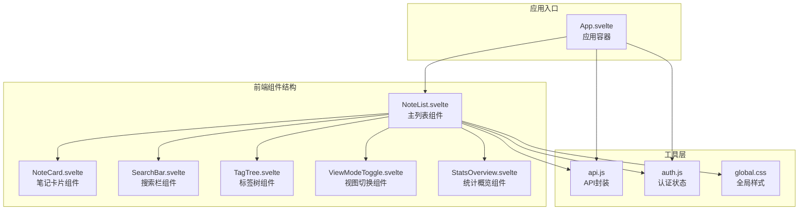
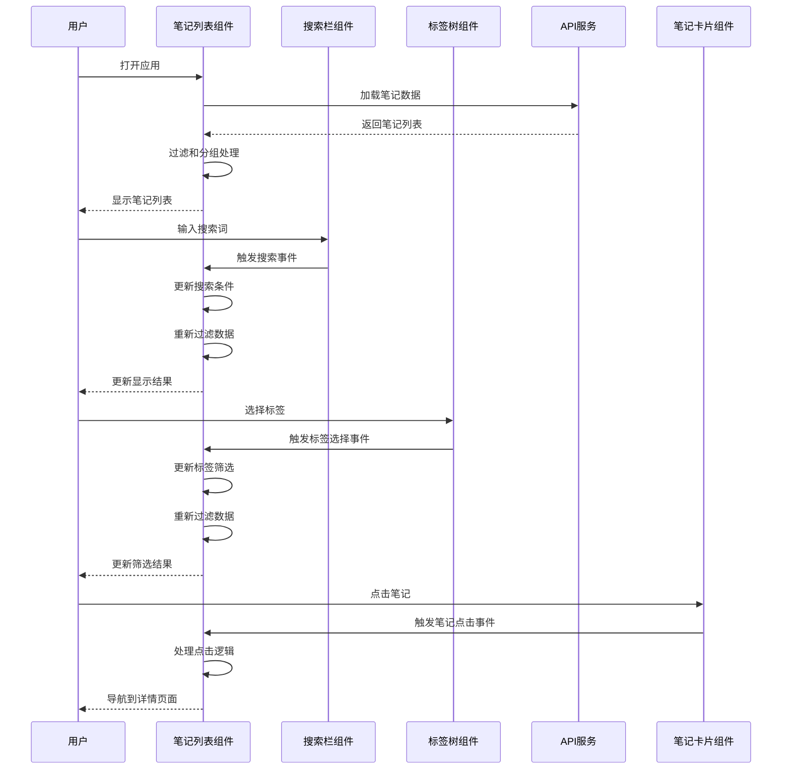
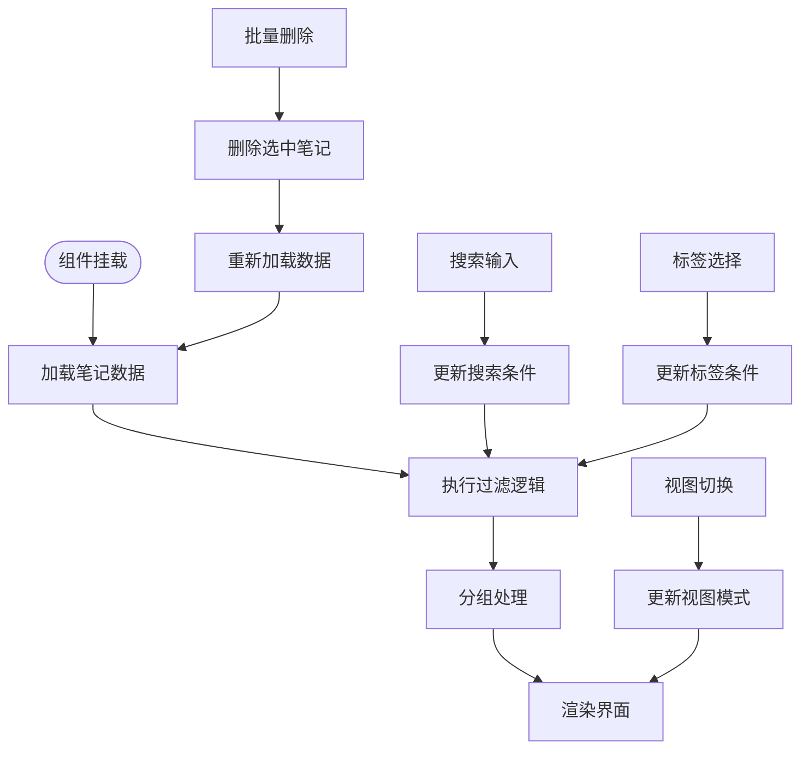
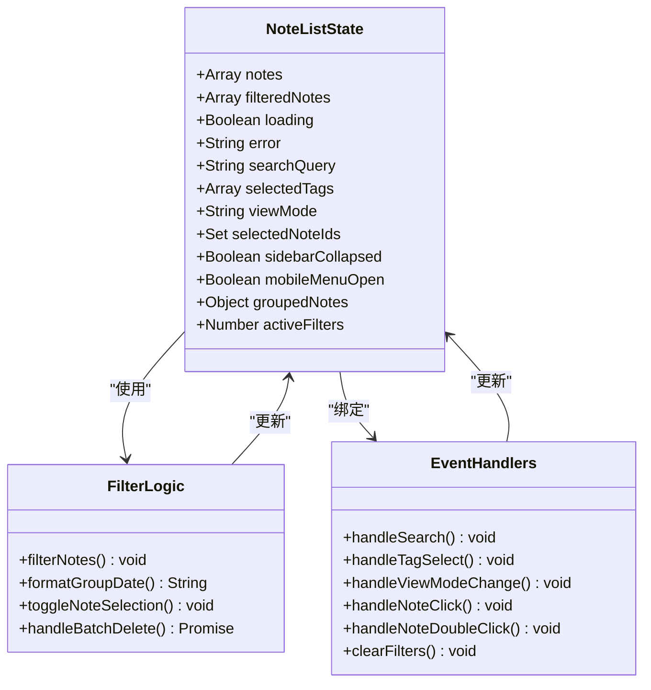
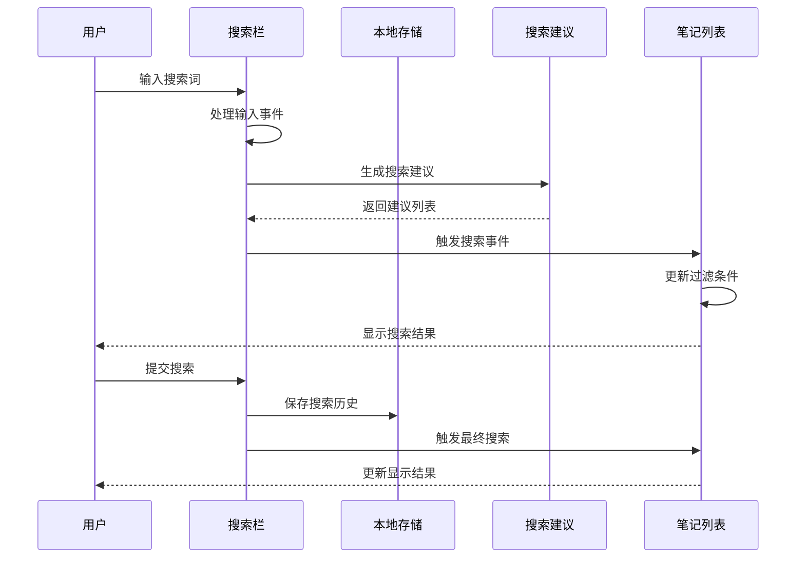
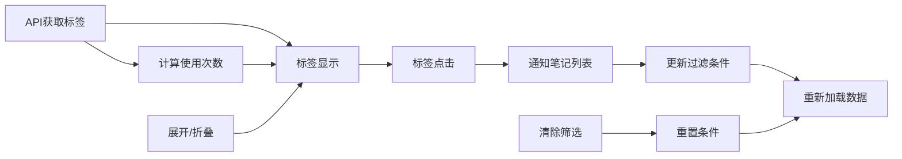
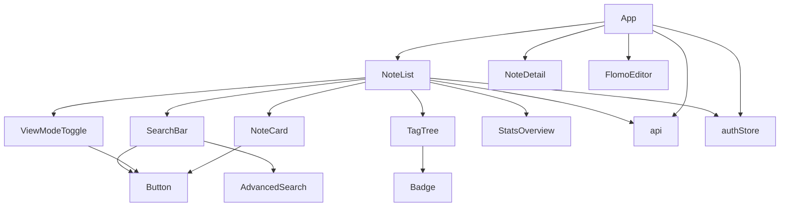

# 笔记列表组件

<cite>
**本文档引用的文件**
- [NoteList.svelte](file://frontend/src/components/NoteList.svelte)
- [SearchBar.svelte](file://frontend/src/components/SearchBar.svelte)
- [TagTree.svelte](file://frontend/src/components/TagTree.svelte)
- [ViewModeToggle.svelte](file://frontend/src/components/ViewModeToggle.svelte)
- [NoteCard.svelte](file://frontend/src/components/NoteCard.svelte)
- [StatsOverview.svelte](file://frontend/src/components/StatsOverview.svelte)
- [api.js](file://frontend/src/utils/api.js)
- [auth.js](file://frontend/src/stores/auth.js)
- [App.svelte](file://frontend/src/App.svelte)
- [global.css](file://frontend/src/styles/global.css)
- [package.json](file://frontend/package.json)
</cite>

## 目录
1. [简介](#简介)
2. [项目结构](#项目结构)
3. [核心组件](#核心组件)
4. [架构概览](#架构概览)
5. [详细组件分析](#详细组件分析)
6. [依赖关系分析](#依赖关系分析)
7. [性能考虑](#性能考虑)
8. [故障排除指南](#故障排除指南)
9. [结论](#结论)
10. [附录](#附录)

## 简介
笔记列表组件是 Memo Studio 应用的核心界面组件，负责展示用户的笔记集合。该组件实现了完整的笔记浏览、搜索、筛选、分组和视图切换功能，支持移动端和桌面端的响应式布局设计。组件采用 Svelte 5 构建，利用其声明式语法和细粒度响应系统，提供了流畅的用户体验。

## 项目结构
笔记列表组件位于前端项目的组件目录中，与相关的辅助组件共同构成了完整的笔记管理系统。



**图表来源**
- [NoteList.svelte](file://frontend/src/components/NoteList.svelte#L1-L507)
- [api.js](file://frontend/src/utils/api.js#L1-L316)
- [App.svelte](file://frontend/src/App.svelte#L1-L328)

**章节来源**
- [NoteList.svelte](file://frontend/src/components/NoteList.svelte#L1-L507)
- [package.json](file://frontend/package.json#L1-L25)

## 核心组件
笔记列表组件包含以下主要子组件和功能模块：

### 主要功能特性
- **笔记数据加载**：通过 API 接口获取笔记数据，支持错误处理和加载状态管理
- **智能搜索过滤**：支持标题和内容的全文搜索，包含搜索建议和历史记录
- **标签筛选**：基于标签树的多标签筛选机制，支持动态标签统计
- **分组显示**：按日期对笔记进行智能分组，提供时间线视图
- **视图切换**：支持瀑布流和时间线两种视图模式
- **响应式布局**：移动端侧边栏控制，自适应不同屏幕尺寸
- **批量操作**：支持笔记选择和批量删除功能

### 状态管理
组件维护以下关键状态：
- `notes`: 完整的笔记数组
- `filteredNotes`: 过滤后的笔记数组
- `loading`: 加载状态标志
- `error`: 错误信息存储
- `searchQuery`: 当前搜索条件
- `selectedTags`: 已选择的标签ID数组
- `viewMode`: 当前视图模式（timeline/waterfall）
- `selectedNoteIds`: 已选择笔记的ID集合
- `sidebarCollapsed`: 侧边栏折叠状态
- `mobileMenuOpen`: 移动端菜单开关状态

**章节来源**
- [NoteList.svelte](file://frontend/src/components/NoteList.svelte#L14-L23)
- [NoteList.svelte](file://frontend/src/components/NoteList.svelte#L59-L85)

## 架构概览
笔记列表组件采用组件化架构，通过事件驱动的方式实现组件间的通信。



**图表来源**
- [NoteList.svelte](file://frontend/src/components/NoteList.svelte#L109-L133)
- [SearchBar.svelte](file://frontend/src/components/SearchBar.svelte#L57-L88)
- [TagTree.svelte](file://frontend/src/components/TagTree.svelte#L37-L43)

## 详细组件分析

### 笔记列表组件 (NoteList.svelte)
主组件负责协调所有子组件和数据处理逻辑。

#### 数据处理流程


**图表来源**
- [NoteList.svelte](file://frontend/src/components/NoteList.svelte#L39-L57)
- [NoteList.svelte](file://frontend/src/components/NoteList.svelte#L59-L85)
- [NoteList.svelte](file://frontend/src/components/NoteList.svelte#L123-L125)

#### 状态管理机制
组件采用 Svelte 的响应式声明 `$:` 来管理派生状态：



**图表来源**
- [NoteList.svelte](file://frontend/src/components/NoteList.svelte#L14-L23)
- [NoteList.svelte](file://frontend/src/components/NoteList.svelte#L59-L139)

**章节来源**
- [NoteList.svelte](file://frontend/src/components/NoteList.svelte#L1-L507)

### 搜索栏组件 (SearchBar.svelte)
提供智能搜索功能，支持快捷键、搜索建议和历史记录。

#### 搜索功能实现


**图表来源**
- [SearchBar.svelte](file://frontend/src/components/SearchBar.svelte#L57-L96)
- [SearchBar.svelte](file://frontend/src/components/SearchBar.svelte#L105-L108)

#### 快捷键支持
组件支持多种键盘快捷键：
- `Cmd/Ctrl + K`: 打开搜索栏
- `Enter`: 提交搜索
- `Escape`: 关闭高级搜索
- `Tab`: 导航到下一个元素

**章节来源**
- [SearchBar.svelte](file://frontend/src/components/SearchBar.svelte#L1-L251)

### 标签树组件 (TagTree.svelte)
实现标签的层次化管理和筛选功能。

#### 标签数据流


**图表来源**
- [TagTree.svelte](file://frontend/src/components/TagTree.svelte#L17-L31)
- [TagTree.svelte](file://frontend/src/components/TagTree.svelte#L37-L43)

**章节来源**
- [TagTree.svelte](file://frontend/src/components/TagTree.svelte#L1-L81)

### 视图切换组件 (ViewModeToggle.svelte)
提供瀑布流和时间线两种视图模式的切换功能。

#### 视图模式对比
| 视图模式 | 网格布局 | 时间线布局 | 适用场景 |
|---------|----------|------------|----------|
| 瀑布流 (waterfall) | 2列(小屏) | 4列(大屏) | 快速浏览、卡片展示 |
| 时间线 (timeline) | 单列 | 单列 | 深度阅读、时间顺序 |

**章节来源**
- [ViewModeToggle.svelte](file://frontend/src/components/ViewModeToggle.svelte#L1-L50)

### 笔记卡片组件 (NoteCard.svelte)
单个笔记的可视化表示，支持交互操作。

#### 卡片交互功能
```mermaid
stateDiagram-v2
[*] --> Normal
Normal --> Hover : 鼠标悬停
Hover --> Normal : 离开悬停
Normal --> Click : 点击
Click --> Detail : 导航详情
Normal --> DoubleClick : 双击
DoubleClick --> Edit : 打开编辑器
Normal --> TagClick : 标签点击
TagClick --> Filter : 应用标签筛选
Filter --> Normal : 返回列表
```

**图表来源**
- [NoteCard.svelte](file://frontend/src/components/NoteCard.svelte#L22-L28)
- [NoteCard.svelte](file://frontend/src/components/NoteCard.svelte#L30-L33)

**章节来源**
- [NoteCard.svelte](file://frontend/src/components/NoteCard.svelte#L1-L133)

### 统计概览组件 (StatsOverview.svelte)
显示笔记相关的统计数据，提供快速概览。

#### 统计指标
- **总笔记数**: 所有笔记的总数
- **今日笔记**: 当天创建的笔记数量
- **本周笔记**: 本周创建的笔记数量  
- **标签总数**: 系统中标签的总数

**章节来源**
- [StatsOverview.svelte](file://frontend/src/components/StatsOverview.svelte#L1-L134)

## 依赖关系分析

### 外部依赖
组件使用的主要依赖库：
- **Svelte 5**: 前端框架，提供响应式组件系统
- **Tailwind CSS**: CSS 框架，用于样式构建
- **clsx**: 类名组合工具
- **tailwind-merge**: Tailwind CSS 类名合并

### 内部依赖关系


**图表来源**
- [NoteList.svelte](file://frontend/src/components/NoteList.svelte#L1-L11)
- [App.svelte](file://frontend/src/App.svelte#L1-L16)

**章节来源**
- [package.json](file://frontend/package.json#L11-L23)

## 性能考虑

### 优化策略
1. **虚拟滚动**: 对于大量笔记数据，可考虑实现虚拟滚动以减少 DOM 元素数量
2. **懒加载**: 图片和长内容可采用懒加载策略
3. **缓存机制**: 搜索结果和标签数据可添加缓存层
4. **防抖处理**: 搜索输入可添加防抖以减少 API 调用频率
5. **组件卸载**: 确保组件销毁时清理事件监听器和定时器

### 内存管理
- 使用 `onDestroy` 生命周期钩子清理事件监听器
- 及时清理定时器和异步操作
- 合理使用 `Set` 和 `Map` 数据结构

### 网络优化
- 实现请求去重，避免重复的 API 调用
- 添加请求超时和重试机制
- 使用 HTTP 缓存头优化静态资源

## 故障排除指南

### 常见问题及解决方案

#### 笔记加载失败
**症状**: 页面显示加载错误信息
**可能原因**:
- 网络连接问题
- 认证令牌过期
- 服务器异常

**解决方法**:
1. 检查网络连接状态
2. 重新登录获取新令牌
3. 刷新页面重试
4. 查看浏览器开发者工具的网络面板

#### 搜索无结果
**症状**: 搜索后显示空状态
**可能原因**:
- 搜索条件过于严格
- 笔记内容为空或格式异常
- 标签筛选条件冲突

**解决方法**:
1. 清除搜索条件
2. 尝试更宽松的搜索关键词
3. 检查标签筛选状态
4. 使用清除筛选功能

#### 视图切换异常
**症状**: 视图切换后布局错乱
**可能原因**:
- 响应式断点计算错误
- CSS 样式冲突
- 组件状态不同步

**解决方法**:
1. 刷新页面重新渲染
2. 检查浏览器控制台是否有错误
3. 确认组件状态同步
4. 清除浏览器缓存

**章节来源**
- [NoteList.svelte](file://frontend/src/components/NoteList.svelte#L44-L56)
- [api.js](file://frontend/src/utils/api.js#L34-L50)

## 结论
笔记列表组件是一个功能完整、架构清晰的 Svelte 组件，具备以下特点：

1. **功能完整性**: 实现了笔记浏览、搜索、筛选、分组、视图切换等核心功能
2. **用户体验**: 提供流畅的交互体验，支持多种快捷键和手势操作
3. **响应式设计**: 适配移动端和桌面端的不同屏幕尺寸
4. **可扩展性**: 模块化设计便于功能扩展和维护
5. **性能优化**: 采用合理的状态管理和渲染策略

该组件为 Memo Studio 应用提供了坚实的基础，为用户提供了高效、直观的笔记管理体验。

## 附录

### API 接口说明

#### 笔记相关接口
| 接口 | 方法 | URL | 功能 |
|------|------|-----|------|
| 获取笔记列表 | GET | `/api/v1/notes` | 获取所有笔记 |
| 获取单个笔记 | GET | `/api/v1/notes/:id` | 获取指定笔记 |
| 创建笔记 | POST | `/api/v1/notes` | 创建新笔记 |
| 更新笔记 | PUT | `/api/v1/notes/:id` | 更新现有笔记 |
| 删除笔记 | DELETE | `/api/v1/notes/:id` | 删除指定笔记 |
| 批量删除 | DELETE | `/api/v1/notes/batch` | 批量删除笔记 |

#### 标签相关接口
| 接口 | 方法 | URL | 功能 |
|------|------|-----|------|
| 获取标签列表 | GET | `/api/v1/tags` | 获取所有标签 |
| 创建标签 | POST | `/api/v1/tags` | 创建新标签 |
| 更新标签 | PUT | `/api/v1/tags/:id` | 更新现有标签 |
| 删除标签 | DELETE | `/api/v1/tags/:id` | 删除指定标签 |
| 合并标签 | POST | `/api/v1/tags/merge` | 合并两个标签 |

### 组件使用示例

#### 基本使用
```svelte
<NoteList 
  on:noteClick={(e) => handleNoteClick(e.detail)}
  onQuickEdit={handleQuickEdit}
/>
```

#### 高级配置
```svelte
<NoteList 
  viewMode="waterfall"
  sidebarCollapsed={false}
  on:noteClick={(e) => handleNoteClick(e.detail)}
  onQuickEdit={handleQuickEdit}
/>
```

### 最佳实践建议
1. **状态管理**: 使用组件内部状态管理简单数据，复杂状态使用外部 store
2. **错误处理**: 为所有异步操作添加适当的错误处理
3. **性能监控**: 定期检查组件渲染性能，必要时进行优化
4. **测试覆盖**: 为关键功能编写单元测试和集成测试
5. **文档维护**: 保持代码注释和文档的及时更新