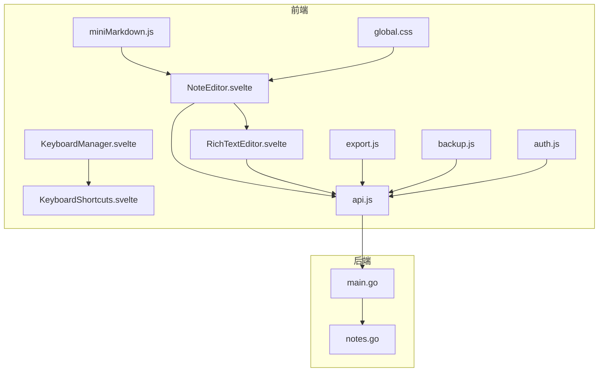
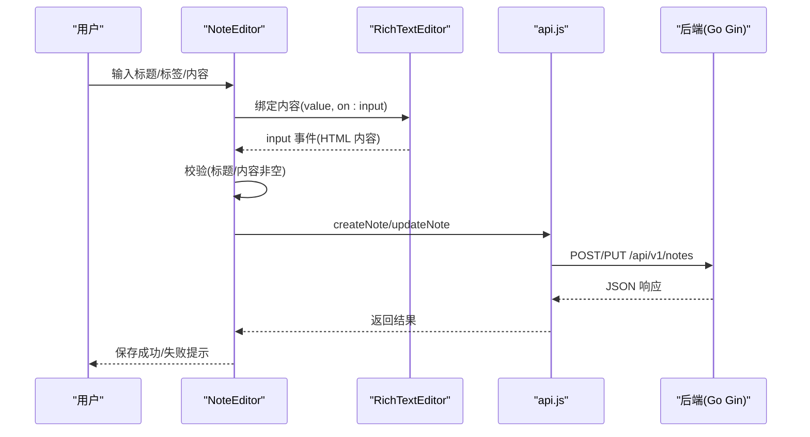
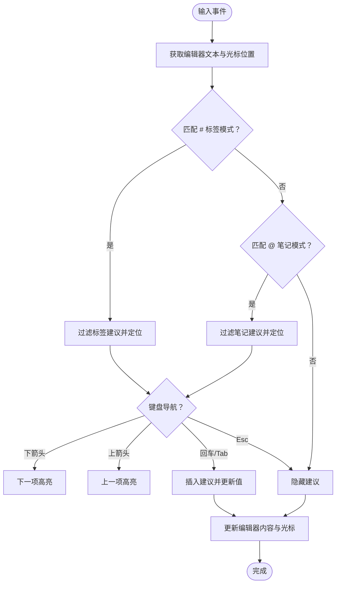
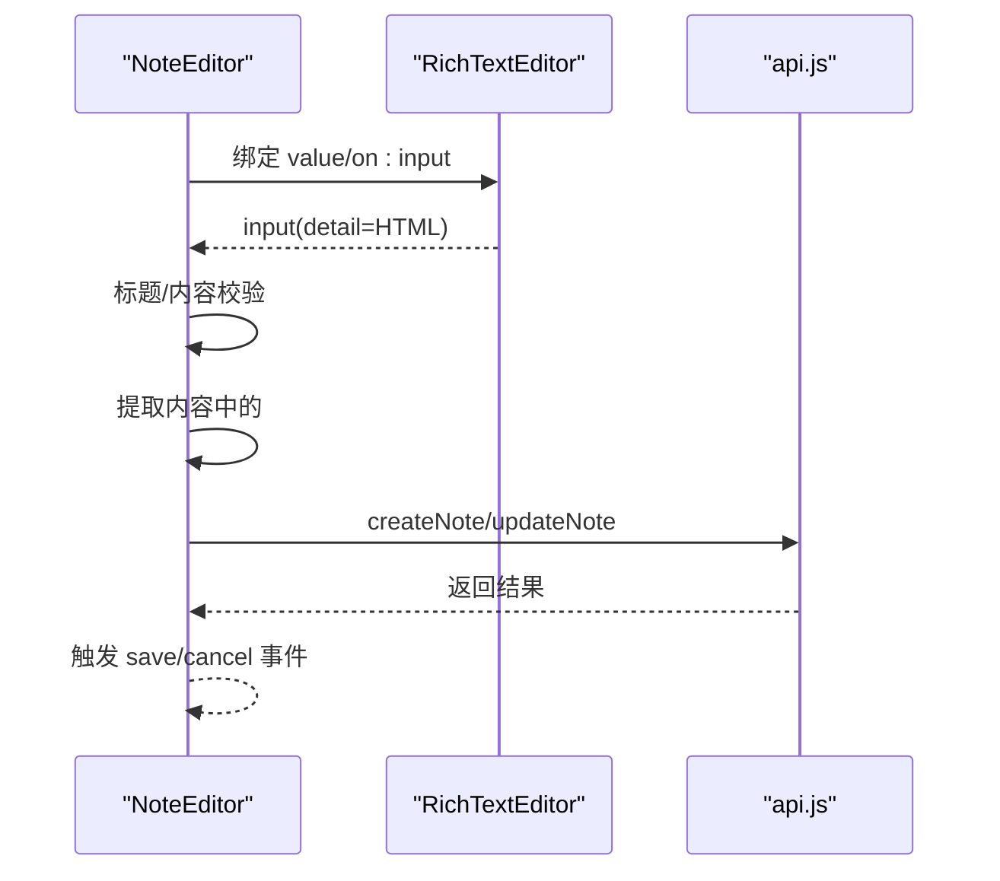
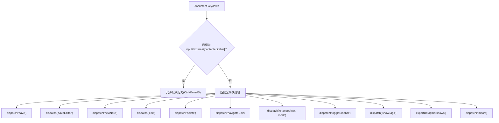
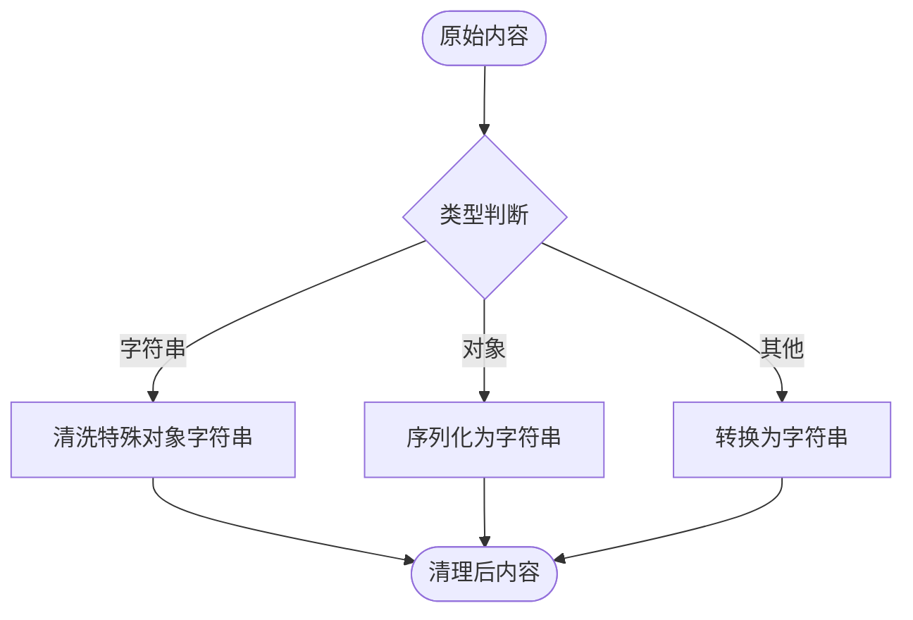
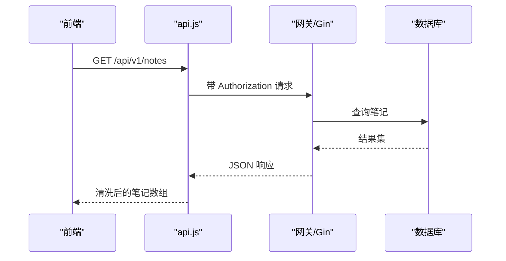
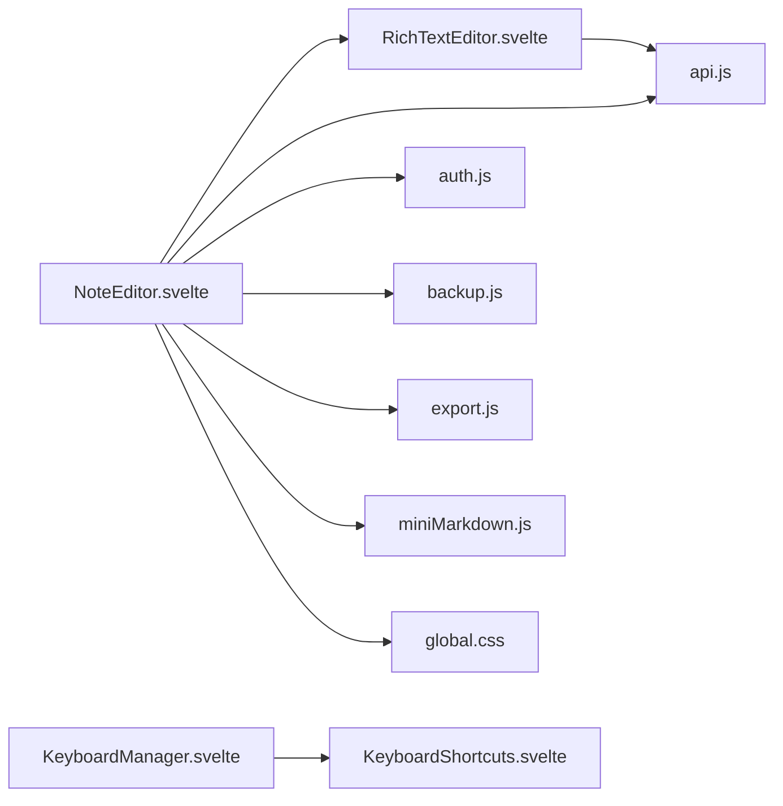

# 笔记编辑器

<cite>
**本文档引用的文件**
- [RichTextEditor.svelte](file://frontend/src/components/RichTextEditor.svelte)
- [NoteEditor.svelte](file://frontend/src/components/NoteEditor.svelte)
- [KeyboardManager.svelte](file://frontend/src/components/KeyboardManager.svelte)
- [KeyboardShortcuts.svelte](file://frontend/src/components/KeyboardShortcuts.svelte)
- [api.js](file://frontend/src/utils/api.js)
- [auth.js](file://frontend/src/stores/auth.js)
- [miniMarkdown.js](file://kit/src/lib/miniMarkdown.js)
- [export.js](file://frontend/src/utils/export.js)
- [backup.js](file://frontend/src/utils/backup.js)
- [global.css](file://frontend/src/styles/global.css)
- [package.json](file://frontend/package.json)
- [svelte.config.js](file://frontend/svelte.config.js)
- [main.go](file://backend/main.go)
- [notes.go](file://backend/handlers/notes.go)
</cite>

## 目录
1. [简介](#简介)
2. [项目结构](#项目结构)
3. [核心组件](#核心组件)
4. [架构总览](#架构总览)
5. [组件详解](#组件详解)
6. [依赖关系分析](#依赖关系分析)
7. [性能考量](#性能考量)
8. [故障排查指南](#故障排查指南)
9. [结论](#结论)
10. [附录](#附录)

## 简介
本技术文档围绕“笔记编辑器”组件进行深入剖析，涵盖富文本编辑器的实现原理、功能特性（内容编辑、格式化、标签/笔记建议、快捷键、自动保存）、配置选项、数据处理机制（内容序列化、HTML 解析、Markdown 支持、预览渲染）、事件系统（内容变更监听、焦点管理、输入法支持），以及与后端 API 的交互方式、数据同步策略、性能优化与用户体验改进方案。文档同时提供集成示例、自定义配置与扩展开发指南。

## 项目结构
前端采用 Svelte 5 技术栈，编辑器相关的核心文件集中在 frontend/src/components 与 frontend/src/utils 中；后端基于 Go Gin 提供 REST API，统一版本为 /api/v1。整体结构清晰，组件职责明确，便于扩展与维护。

**图表来源**
- [RichTextEditor.svelte](file://frontend/src/components/RichTextEditor.svelte#L1-L333)
- [NoteEditor.svelte](file://frontend/src/components/NoteEditor.svelte#L1-L280)
- [KeyboardManager.svelte](file://frontend/src/components/KeyboardManager.svelte#L1-L206)
- [KeyboardShortcuts.svelte](file://frontend/src/components/KeyboardShortcuts.svelte#L1-L197)
- [api.js](file://frontend/src/utils/api.js#L1-L316)
- [auth.js](file://frontend/src/stores/auth.js#L1-L80)
- [miniMarkdown.js](file://kit/src/lib/miniMarkdown.js#L1-L79)
- [export.js](file://frontend/src/utils/export.js#L1-L103)
- [backup.js](file://frontend/src/utils/backup.js#L1-L223)
- [global.css](file://frontend/src/styles/global.css#L1-L185)
- [main.go](file://backend/main.go#L1-L200)
- [notes.go](file://backend/handlers/notes.go#L1-L200)

**章节来源**
- [package.json](file://frontend/package.json#L1-L25)
- [svelte.config.js](file://frontend/svelte.config.js#L1-L11)

## 核心组件
- 富文本编辑器组件：负责内容编辑、标签与笔记建议、光标定位与输入事件处理。
- 笔记编辑器容器：负责标题、标签、内容三者联动，保存逻辑与校验。
- 键盘管理器：全局快捷键与焦点检测，派发保存、导航、视图切换等事件。
- API 工具：封装认证、鉴权拦截器、统一错误处理、内容清理与笔记 CRUD。
- 数据备份与导出：自动保存草稿、备份、离线支持与多种导出格式。
- Markdown 渲染：轻量级 Markdown 到 HTML 的渲染工具，用于预览或摘要展示。

**章节来源**
- [RichTextEditor.svelte](file://frontend/src/components/RichTextEditor.svelte#L1-L333)
- [NoteEditor.svelte](file://frontend/src/components/NoteEditor.svelte#L1-L280)
- [KeyboardManager.svelte](file://frontend/src/components/KeyboardManager.svelte#L1-L206)
- [api.js](file://frontend/src/utils/api.js#L1-L316)
- [backup.js](file://frontend/src/utils/backup.js#L1-L223)
- [miniMarkdown.js](file://kit/src/lib/miniMarkdown.js#L1-L79)

## 架构总览
编辑器采用“组件-工具-后端”的分层架构：组件负责 UI 与交互，工具负责数据处理与网络请求，后端提供稳定 API。编辑器与后端通过 /api/v1 进行交互，支持认证、笔记增删改查、标签管理、搜索等。

**图表来源**
- [NoteEditor.svelte](file://frontend/src/components/NoteEditor.svelte#L62-L109)
- [RichTextEditor.svelte](file://frontend/src/components/RichTextEditor.svelte#L75-L129)
- [api.js](file://frontend/src/utils/api.js#L176-L229)
- [main.go](file://backend/main.go#L94-L196)
- [notes.go](file://backend/handlers/notes.go#L175-L200)

## 组件详解

### 富文本编辑器 RichTextEditor
- 内容编辑与占位符：使用 contenteditable 区域承载富文本，支持 placeholder 属性与 CSS 样式。
- 输入事件与建议触发：监听 input 事件，基于光标位置识别 # 标签与 @ 笔记引用模式，动态过滤建议并定位提示框。
- 建议选择与插入：支持上下箭头选择、Enter/Tab 插入、Esc 关闭；插入后更新编辑器内容并恢复光标位置。
- 光标定位：通过 Range 与 Selection API 精确计算与设置光标位置，保证输入体验。
- 值同步：将编辑器 HTML 同步到父组件，并通过事件分发 value。

**图表来源**
- [RichTextEditor.svelte](file://frontend/src/components/RichTextEditor.svelte#L75-L155)
- [RichTextEditor.svelte](file://frontend/src/components/RichTextEditor.svelte#L157-L187)

**章节来源**
- [RichTextEditor.svelte](file://frontend/src/components/RichTextEditor.svelte#L1-L333)

### 笔记编辑器 NoteEditor
- 标题与标签：标题输入框与标签输入框，支持标签建议下拉与手动输入。
- 内容编辑：嵌入 RichTextEditor，接收 input 事件并同步内容。
- 保存逻辑：对标题与内容进行非空校验，提取内容中的 # 标签名并合并手动标签，调用 API 创建/更新笔记。
- 时间格式化：显示最后修改时间，增强可追溯性。

**图表来源**
- [NoteEditor.svelte](file://frontend/src/components/NoteEditor.svelte#L62-L109)
- [api.js](file://frontend/src/utils/api.js#L176-L229)

**章节来源**
- [NoteEditor.svelte](file://frontend/src/components/NoteEditor.svelte#L1-L280)

### 键盘管理与快捷键
- 全局快捷键：支持 Ctrl/Cmd + K（聚焦搜索）、?（显示帮助）、Ctrl/Cmd + S（保存）、Ctrl/Cmd + Enter（保存编辑器）、N/E/D（新建/编辑/删除）、J/K/方向键（导航）、1/2（视图切换）、B/T（侧边栏/标签）、Ctrl/Cmd + E/I（导出/导入）等。
- 焦点检测：区分编辑器、输入框与搜索框焦点，避免快捷键冲突。
- 快捷键帮助：可搜索快捷键描述与按键组合，ESC 关闭。

**图表来源**
- [KeyboardManager.svelte](file://frontend/src/components/KeyboardManager.svelte#L16-L143)
- [KeyboardShortcuts.svelte](file://frontend/src/components/KeyboardShortcuts.svelte#L17-L78)

**章节来源**
- [KeyboardManager.svelte](file://frontend/src/components/KeyboardManager.svelte#L1-L206)
- [KeyboardShortcuts.svelte](file://frontend/src/components/KeyboardShortcuts.svelte#L1-L197)

### 数据处理与序列化
- 内容清理：对来自不同来源的内容进行清洗，避免对象字符串污染，确保 content 为有效字符串。
- HTML 与纯文本：编辑器内部使用 HTML 存储富文本，保存时可提取纯文本用于校验与搜索。
- Markdown 支持：提供轻量级 Markdown 渲染工具，支持链接、加粗、斜体、行内代码与简单列表渲染，用于预览或摘要展示。

**图表来源**
- [api.js](file://frontend/src/utils/api.js#L78-L112)
- [miniMarkdown.js](file://kit/src/lib/miniMarkdown.js#L18-L77)

**章节来源**
- [api.js](file://frontend/src/utils/api.js#L78-L112)
- [miniMarkdown.js](file://kit/src/lib/miniMarkdown.js#L1-L79)

### 事件系统与焦点管理
- 内容变更监听：RichTextEditor 通过 input 事件向父组件传递 HTML 内容；NoteEditor 接收并进行校验与保存。
- 焦点检测：KeyboardManager 检测输入焦点区域，避免快捷键误触发；编辑器内焦点变化时，仅在编辑器内生效。
- 输入法支持：编辑器使用 contenteditable，天然支持输入法组合输入与候选词选择。

**章节来源**
- [RichTextEditor.svelte](file://frontend/src/components/RichTextEditor.svelte#L75-L129)
- [KeyboardManager.svelte](file://frontend/src/components/KeyboardManager.svelte#L154-L176)

### 自动保存与离线支持
- 自动保存：定时将当前笔记草稿写入安全存储，最多保留固定数量，支持回调通知。
- 草稿管理：支持获取、删除、清空草稿，以及根据笔记 ID 或草稿 ID 查询。
- 备份与导入：生成结构化备份，限制备份数量；支持 JSON 导出与导入。
- 离线监听：注册 online/offline 事件，提供服务工作者注册能力。

**章节来源**
- [backup.js](file://frontend/src/utils/backup.js#L11-L91)
- [backup.js](file://frontend/src/utils/backup.js#L98-L177)
- [backup.js](file://frontend/src/utils/backup.js#L198-L222)

### 与后端 API 的交互
- 认证与拦截：统一添加 Authorization 头，支持拦截器链路；401 自动清除本地 token 并触发认证过期事件。
- 笔记 CRUD：提供创建、更新、删除、批量删除、获取列表与详情接口；内容清理与校验在前后端共同保障。
- 标签管理：获取标签列表、创建/更新/删除标签、合并标签。
- 搜索：支持全文搜索，返回清理后的笔记列表。

**图表来源**
- [api.js](file://frontend/src/utils/api.js#L154-L163)
- [main.go](file://backend/main.go#L94-L196)
- [notes.go](file://backend/handlers/notes.go#L131-L150)

**章节来源**
- [api.js](file://frontend/src/utils/api.js#L1-L316)
- [main.go](file://backend/main.go#L1-L200)
- [notes.go](file://backend/handlers/notes.go#L1-L200)

## 依赖关系分析
- 组件耦合：NoteEditor 依赖 RichTextEditor 与 API 工具；RichTextEditor 依赖 API 工具与 UI 组件库。
- 工具模块：api.js 作为统一入口，auth.js 管理认证状态，backup.js 提供持久化能力，export.js 提供导出能力。
- 样式与构建：Tailwind 与自定义动画类，Svelte 5 编译器配置忽略部分 a11y 警告。

**图表来源**
- [NoteEditor.svelte](file://frontend/src/components/NoteEditor.svelte#L1-L280)
- [RichTextEditor.svelte](file://frontend/src/components/RichTextEditor.svelte#L1-L333)
- [api.js](file://frontend/src/utils/api.js#L1-L316)
- [auth.js](file://frontend/src/stores/auth.js#L1-L80)
- [backup.js](file://frontend/src/utils/backup.js#L1-L223)
- [export.js](file://frontend/src/utils/export.js#L1-L103)
- [miniMarkdown.js](file://kit/src/lib/miniMarkdown.js#L1-L79)
- [global.css](file://frontend/src/styles/global.css#L1-L185)
- [KeyboardManager.svelte](file://frontend/src/components/KeyboardManager.svelte#L1-L206)
- [KeyboardShortcuts.svelte](file://frontend/src/components/KeyboardShortcuts.svelte#L1-L197)

**章节来源**
- [package.json](file://frontend/package.json#L1-L25)
- [svelte.config.js](file://frontend/svelte.config.js#L1-L11)

## 性能考量
- 编辑器渲染：contenteditable 区域在输入时仅更新必要节点，避免整树重绘；建议在大量内容场景下分段渲染或虚拟滚动。
- 建议列表：过滤算法基于数组遍历，建议限制标签/笔记数量或引入索引结构提升性能。
- 自动保存：30 秒间隔写入本地存储，避免频繁 IO；可结合节流/防抖减少写入频率。
- 离线支持：服务工作者与离线事件监听可提升弱网体验，建议缓存关键资源与 API 响应。
- 样式与动画：使用 Tailwind 与 CSS 动画，注意移动端性能，避免复杂阴影与大尺寸滤镜。

[本节为通用指导，无需列出具体文件来源]

## 故障排查指南
- 保存失败：检查标题与内容非空校验；查看 API 返回的错误信息；确认网络连通与认证状态。
- 建议不出现：确认光标位置与触发字符；检查标签/笔记数据加载是否成功；验证建议定位坐标计算。
- 快捷键无效：确认焦点不在输入框；检查全局快捷键映射；查看是否被浏览器扩展拦截。
- 自动保存异常：检查本地存储权限；确认定时器是否正确启动/停止；查看日志输出。
- 导出/导入问题：确认文件格式与编码；检查 JSON 结构完整性；验证导入文件是否被篡改。

**章节来源**
- [NoteEditor.svelte](file://frontend/src/components/NoteEditor.svelte#L66-L109)
- [RichTextEditor.svelte](file://frontend/src/components/RichTextEditor.svelte#L31-L40)
- [KeyboardManager.svelte](file://frontend/src/components/KeyboardManager.svelte#L16-L143)
- [backup.js](file://frontend/src/utils/backup.js#L11-L91)
- [export.js](file://frontend/src/utils/export.js#L76-L102)

## 结论
该笔记编辑器组件以 Svelte 为核心，结合轻量级工具与后端 API，实现了从内容编辑、建议触发、快捷键、自动保存到导出备份的完整闭环。通过清晰的组件边界与统一的工具层，具备良好的可扩展性与可维护性。建议在后续迭代中进一步完善性能优化、国际化与无障碍支持，并持续完善后端接口与数据库设计。

[本节为总结性内容，无需列出具体文件来源]

## 附录

### 集成示例
- 在页面中直接使用 NoteEditor 组件，传入 note 对象即可进入编辑态；保存后通过事件回调刷新列表。
- 在自定义页面中嵌入 RichTextEditor，通过 on:input 监听内容变化，自行处理保存逻辑。
- 通过 KeyboardManager 注入全局快捷键，结合应用状态管理实现跨页面统一操作。

**章节来源**
- [NoteEditor.svelte](file://frontend/src/components/NoteEditor.svelte#L1-L280)
- [RichTextEditor.svelte](file://frontend/src/components/RichTextEditor.svelte#L1-L333)
- [KeyboardManager.svelte](file://frontend/src/components/KeyboardManager.svelte#L1-L206)

### 自定义配置与扩展
- 工具栏设置：可在 NoteEditor 中扩展按钮组，调用 api.js 的对应接口实现更多操作。
- 快捷键绑定：通过 KeyboardManager 的注册函数扩展编辑器内快捷键处理器。
- 内容验证：在 NoteEditor 的保存逻辑中增加业务规则，如长度限制、敏感词过滤等。
- 上传处理：结合后端资源上传接口，扩展图片/文件插入能力。

**章节来源**
- [api.js](file://frontend/src/utils/api.js#L176-L229)
- [KeyboardManager.svelte](file://frontend/src/components/KeyboardManager.svelte#L145-L152)

### 数据同步策略
- 前端优先：编辑器本地状态与后端状态双向同步，优先保证编辑体验；离线时自动保存草稿，联网后自动补丁式同步。
- 批量操作：支持批量删除与合并标签，减少网络往返。
- 搜索与预览：后端提供搜索接口，前端可结合 miniMarkdown 进行轻量预览渲染。

**章节来源**
- [api.js](file://frontend/src/utils/api.js#L300-L309)
- [miniMarkdown.js](file://kit/src/lib/miniMarkdown.js#L40-L77)
- [backup.js](file://frontend/src/utils/backup.js#L98-L134)