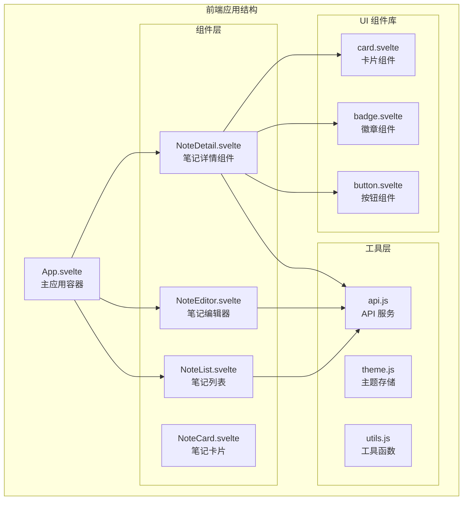
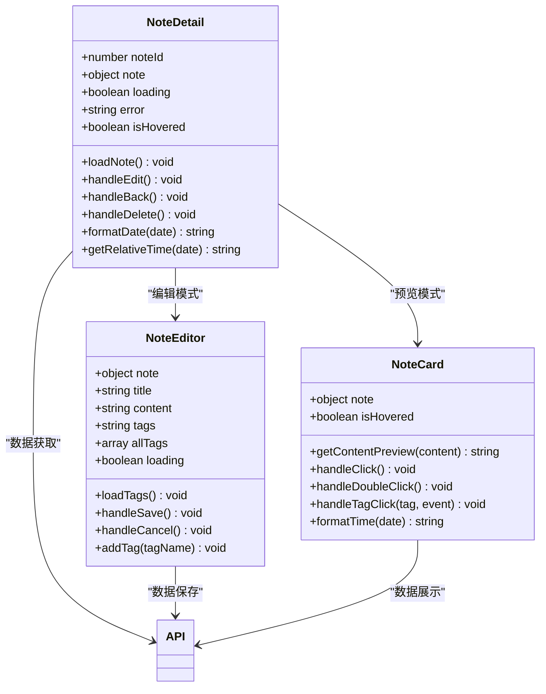
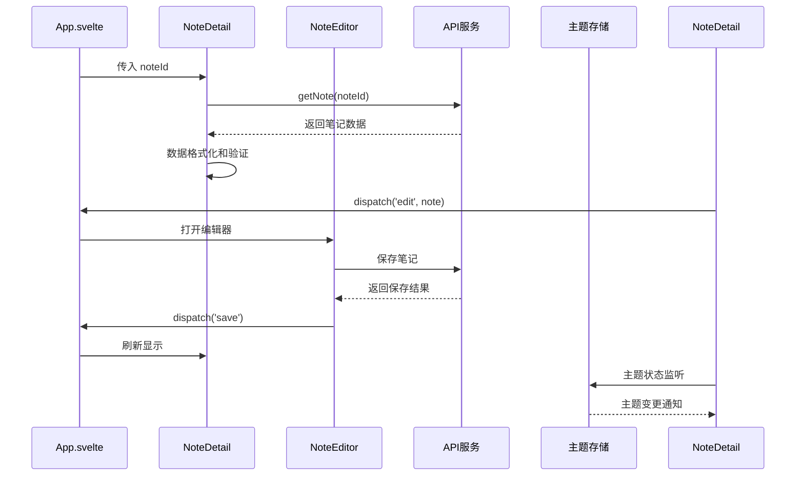
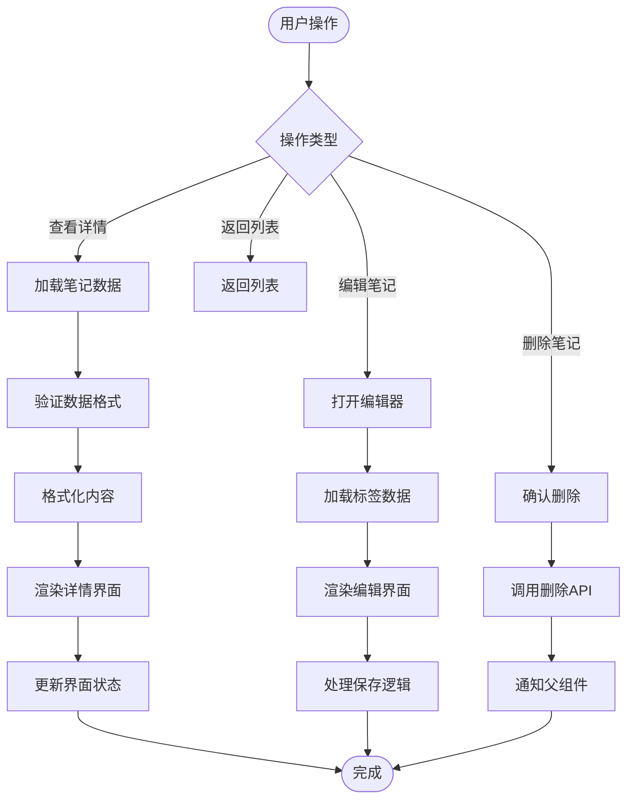
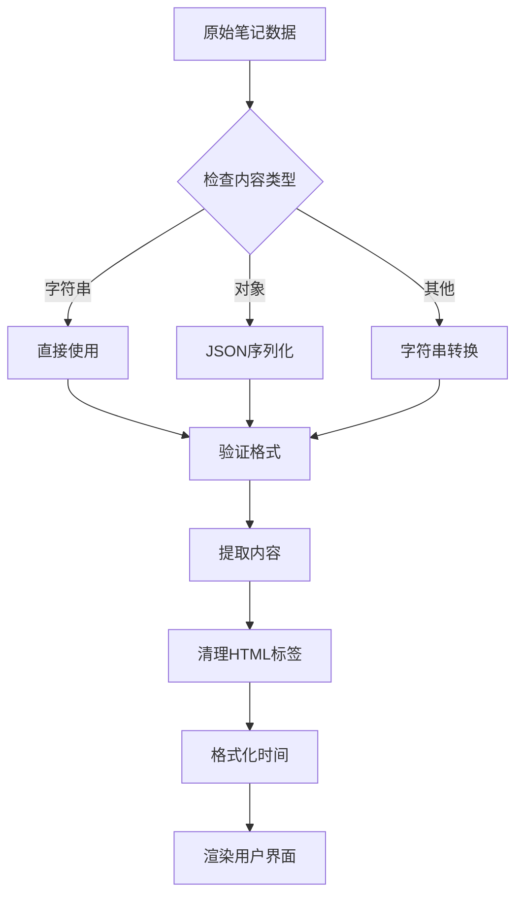
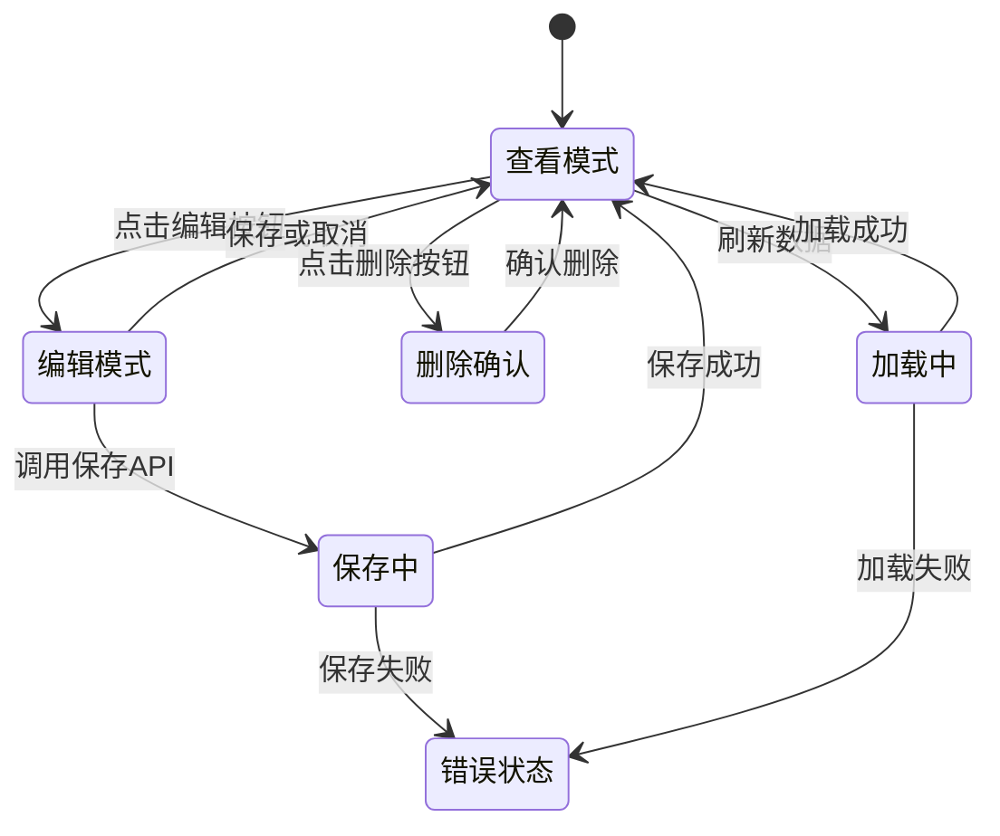
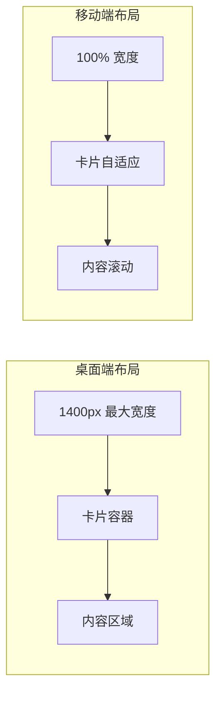
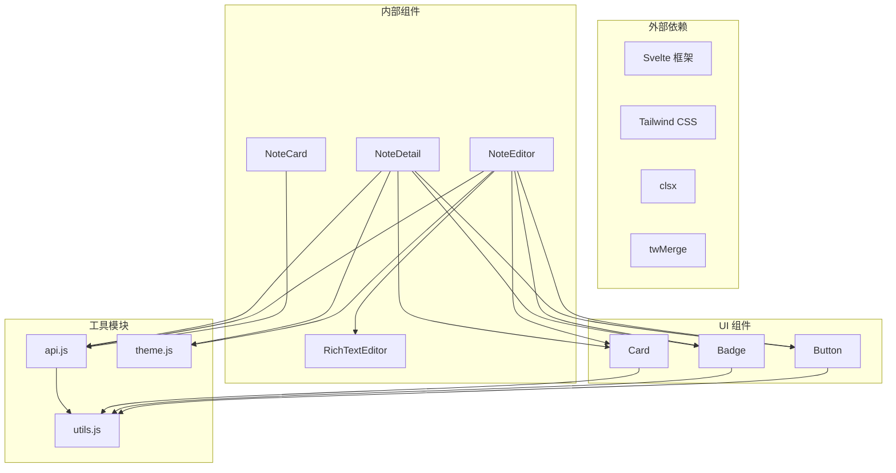

# 笔记详情组件

<cite>
**本文档引用的文件**
- [NoteDetail.svelte](file://frontend/src/components/NoteDetail.svelte)
- [NoteEditor.svelte](file://frontend/src/components/NoteEditor.svelte)
- [NoteCard.svelte](file://frontend/src/components/NoteCard.svelte)
- [App.svelte](file://frontend/src/App.svelte)
- [api.js](file://frontend/src/utils/api.js)
- [theme.js](file://frontend/src/stores/theme.js)
- [RichTextEditor.svelte](file://frontend/src/components/RichTextEditor.svelte)
- [NoteList.svelte](file://frontend/src/components/NoteList.svelte)
- [card.svelte](file://frontend/src/lib/components/ui/card/card.svelte)
- [badge.svelte](file://frontend/src/lib/components/ui/badge/badge.svelte)
- [button.svelte](file://frontend/src/lib/components/ui/button/button.svelte)
- [utils.js](file://frontend/src/lib/utils.js)
- [global.css](file://frontend/src/styles/global.css)
- [miniMarkdown.js](file://kit/src/lib/miniMarkdown.js)
</cite>

## 目录
1. [简介](#简介)
2. [项目结构](#项目结构)
3. [核心组件](#核心组件)
4. [架构概览](#架构概览)
5. [详细组件分析](#详细组件分析)
6. [依赖关系分析](#依赖关系分析)
7. [性能考虑](#性能考虑)
8. [故障排除指南](#故障排除指南)
9. [结论](#结论)
10. [附录](#附录)

## 简介

笔记详情组件是 Memo Studio 笔记应用中的核心展示组件，负责以美观、直观的方式呈现单条笔记的完整信息。该组件实现了完整的笔记详情展示功能，包括标题显示、内容渲染、标签系统、元数据展示、交互操作等特性。

组件采用现代化的 Svelte 架构，结合 Tailwind CSS 样式系统和自定义 UI 组件库，提供了优秀的用户体验和响应式设计。通过事件驱动的架构模式，组件能够与父组件进行高效的数据传递和状态同步。

## 项目结构

前端项目采用模块化架构，笔记详情组件位于组件目录中，与其他核心组件协同工作：



**图表来源**
- [App.svelte](file://frontend/src/App.svelte#L1-L328)
- [NoteDetail.svelte](file://frontend/src/components/NoteDetail.svelte#L1-L223)

**章节来源**
- [App.svelte](file://frontend/src/App.svelte#L1-L328)
- [NoteDetail.svelte](file://frontend/src/components/NoteDetail.svelte#L1-L223)

## 核心组件

### 笔记详情组件架构

笔记详情组件采用响应式设计，支持多种交互模式和状态管理：



**图表来源**
- [NoteDetail.svelte](file://frontend/src/components/NoteDetail.svelte#L1-L223)
- [NoteEditor.svelte](file://frontend/src/components/NoteEditor.svelte#L1-L280)
- [NoteCard.svelte](file://frontend/src/components/NoteCard.svelte#L1-L133)

### 数据绑定机制

组件采用双向数据绑定和事件驱动的架构模式：

1. **属性绑定**: 通过 `export let` 定义外部传入的属性
2. **状态管理**: 使用本地状态变量管理组件内部状态
3. **事件通信**: 通过 `createEventDispatcher` 发送自定义事件
4. **生命周期**: 利用 `onMount` 进行初始化和数据加载

**章节来源**
- [NoteDetail.svelte](file://frontend/src/components/NoteDetail.svelte#L10-L40)
- [NoteEditor.svelte](file://frontend/src/components/NoteEditor.svelte#L13-L52)

## 架构概览

### 组件间通信流程



**图表来源**
- [App.svelte](file://frontend/src/App.svelte#L279-L287)
- [NoteDetail.svelte](file://frontend/src/components/NoteDetail.svelte#L42-L62)
- [theme.js](file://frontend/src/stores/theme.js#L17-L39)

### 数据流架构



**图表来源**
- [NoteDetail.svelte](file://frontend/src/components/NoteDetail.svelte#L22-L62)
- [NoteEditor.svelte](file://frontend/src/components/NoteEditor.svelte#L66-L109)

**章节来源**
- [App.svelte](file://frontend/src/App.svelte#L53-L93)
- [api.js](file://frontend/src/utils/api.js#L165-L174)

## 详细组件分析

### 笔记详情组件详细分析

#### 核心功能实现

笔记详情组件实现了以下核心功能：

1. **笔记内容展示**: 通过 `@html` 指令安全渲染富文本内容
2. **标签系统**: 支持彩色标签显示和动态样式生成
3. **元数据展示**: 显示创建时间、更新时间和相对时间格式
4. **交互操作**: 编辑、删除、返回等操作按钮
5. **状态管理**: 加载状态、错误状态、悬停状态

#### 数据处理逻辑



**图表来源**
- [NoteDetail.svelte](file://frontend/src/components/NoteDetail.svelte#L22-L40)

#### 标签显示机制

组件支持动态标签颜色和样式：

- **颜色生成**: 基于标签颜色属性动态计算背景色和边框色
- **样式应用**: 使用内联样式确保标签视觉一致性
- **交互支持**: 标签点击事件处理和冒泡阻止

**章节来源**
- [NoteDetail.svelte](file://frontend/src/components/NoteDetail.svelte#L190-L205)
- [badge.svelte](file://frontend/src/lib/components/ui/badge/badge.svelte#L10-L15)

### 编辑器集成分析

#### 编辑模式切换

编辑器组件与详情组件的协作机制：



**图表来源**
- [NoteDetail.svelte](file://frontend/src/components/NoteDetail.svelte#L42-L62)
- [NoteEditor.svelte](file://frontend/src/components/NoteEditor.svelte#L66-L109)

#### 内容格式化处理

编辑器支持多种内容格式化：

- **Markdown 解析**: 支持基本的 Markdown 语法
- **富文本编辑**: 提供所见即所得的编辑体验
- **标签自动补全**: 支持 `#` 触发的标签建议系统
- **笔记引用**: 支持 `@` 触发的笔记引用功能

**章节来源**
- [RichTextEditor.svelte](file://frontend/src/components/RichTextEditor.svelte#L75-L129)
- [miniMarkdown.js](file://kit/src/lib/miniMarkdown.js#L40-L77)

### 样式设计分析

#### 响应式布局实现

组件采用移动优先的设计理念：



**图表来源**
- [NoteDetail.svelte](file://frontend/src/components/NoteDetail.svelte#L89-L95)
- [global.css](file://frontend/src/styles/global.css#L174-L184)

#### 主题适配机制

组件支持深色和浅色主题自动切换：

- **CSS 变量系统**: 使用 CSS 自定义属性实现主题切换
- **动态类名**: 通过 JavaScript 动态添加/移除 `dark` 类
- **持久化存储**: 主题偏好存储在 localStorage 中

**章节来源**
- [theme.js](file://frontend/src/stores/theme.js#L1-L40)
- [global.css](file://frontend/src/styles/global.css#L35-L61)

## 依赖关系分析

### 组件依赖图



**图表来源**
- [NoteDetail.svelte](file://frontend/src/components/NoteDetail.svelte#L1-L11)
- [NoteEditor.svelte](file://frontend/src/components/NoteEditor.svelte#L1-L14)

### 数据流依赖

组件间的数据传递遵循单向数据流原则：

1. **父组件到子组件**: 通过 props 传递数据和回调函数
2. **子组件到父组件**: 通过事件分发器传递状态变化
3. **全局状态**: 通过 store 管理共享状态

**章节来源**
- [App.svelte](file://frontend/src/App.svelte#L279-L287)
- [api.js](file://frontend/src/utils/api.js#L1-L316)

## 性能考虑

### 优化策略

#### 渲染性能优化

1. **条件渲染**: 使用 `#if` 指令避免不必要的 DOM 操作
2. **懒加载**: 图片和重内容按需加载
3. **虚拟滚动**: 大列表使用虚拟滚动技术
4. **防抖处理**: 输入事件使用防抖减少重绘

#### 内存管理

1. **事件监听器**: 在组件销毁时正确清理事件监听器
2. **定时器清理**: 及时清除定时器和轮询任务
3. **缓存策略**: 合理使用缓存避免重复计算

#### 网络优化

1. **请求去重**: 避免重复的相同请求
2. **分页加载**: 大数据集使用分页加载
3. **CDN 加速**: 静态资源使用 CDN 加速

### 最佳实践

1. **组件拆分**: 将复杂逻辑拆分为多个小组件
2. **状态提升**: 将共享状态提升到最近的公共祖先
3. **错误边界**: 实现错误边界处理异常情况
4. **代码分割**: 使用动态导入实现按需加载

## 故障排除指南

### 常见问题及解决方案

#### 数据加载失败

**问题症状**: 笔记详情页面显示加载错误

**可能原因**:
- 网络连接问题
- API 接口异常
- 认证令牌过期
- 笔记 ID 无效

**解决步骤**:
1. 检查网络连接状态
2. 验证 API 服务可用性
3. 检查用户认证状态
4. 确认笔记 ID 的有效性

#### 内容渲染异常

**问题症状**: 笔记内容显示格式错误或空白

**可能原因**:
- HTML 内容包含恶意脚本
- 内容格式不符合预期
- 编码问题导致乱码

**解决步骤**:
1. 检查内容的 HTML 结构
2. 验证内容编码格式
3. 实施内容清理和转义
4. 使用白名单过滤危险标签

#### 交互功能失效

**问题症状**: 编辑、删除等按钮无法正常工作

**可能原因**:
- 事件监听器未正确绑定
- 权限不足
- 状态管理错误

**解决步骤**:
1. 检查事件处理器绑定
2. 验证用户权限状态
3. 调试状态更新逻辑
4. 确认组件生命周期

**章节来源**
- [NoteDetail.svelte](file://frontend/src/components/NoteDetail.svelte#L96-L109)
- [api.js](file://frontend/src/utils/api.js#L34-L50)

## 结论

笔记详情组件作为 Memo Studio 的核心展示组件，展现了现代前端开发的最佳实践。组件通过清晰的架构设计、完善的错误处理机制、优秀的性能优化策略，为用户提供了流畅的笔记浏览和编辑体验。

组件的主要优势包括：

1. **模块化设计**: 采用单一职责原则，每个组件专注于特定功能
2. **响应式架构**: 支持多种设备和屏幕尺寸
3. **性能优化**: 通过多种技术手段确保良好的用户体验
4. **可扩展性**: 良好的接口设计便于功能扩展和维护

未来可以考虑的改进方向：
- 增加更多的主题定制选项
- 实现离线数据同步功能
- 优化大内容的渲染性能
- 增强无障碍访问支持

## 附录

### 组件配置选项

| 属性名 | 类型 | 默认值 | 描述 |
|--------|------|--------|------|
| noteId | number | - | 要显示的笔记 ID |
| note | object | null | 直接传入的笔记对象 |
| viewMode | string | 'detail' | 显示模式 ('detail' \| 'preview') |

### 事件定义

| 事件名 | 参数 | 描述 |
|--------|------|------|
| edit | note | 用户点击编辑按钮时触发 |
| back | - | 用户点击返回按钮时触发 |
| deleted | - | 笔记删除成功时触发 |
| save | - | 编辑器保存成功时触发 |

### 使用示例

```javascript
// 基本使用
<NoteDetail noteId={selectedNoteId} />

// 与父组件通信
<NoteDetail 
  noteId={selectedNoteId}
  on:edit={(e) => handleEdit(e.detail)}
  on:back={handleBack}
  on:deleted={handleDeleted}
/>
```

### 扩展方法

1. **自定义样式**: 通过 `className` 属性添加自定义样式
2. **主题定制**: 通过 CSS 变量定制组件外观
3. **功能扩展**: 继承基础组件添加新功能
4. **国际化**: 支持多语言环境