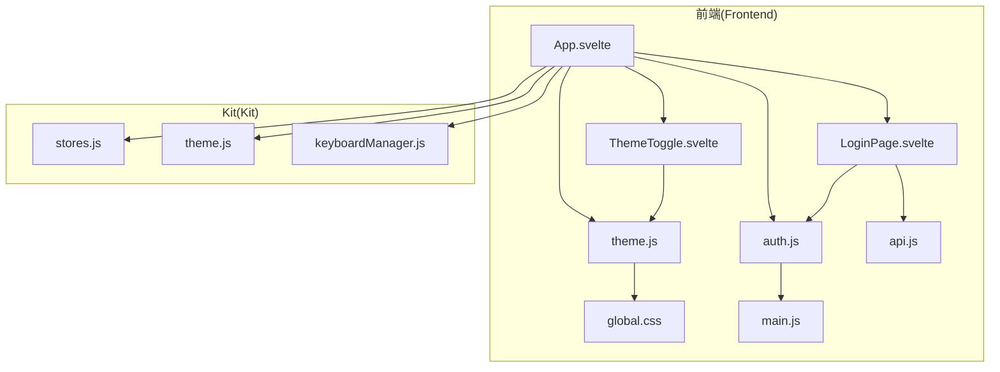
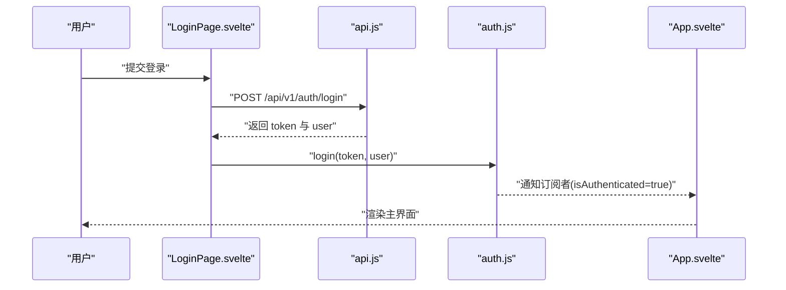
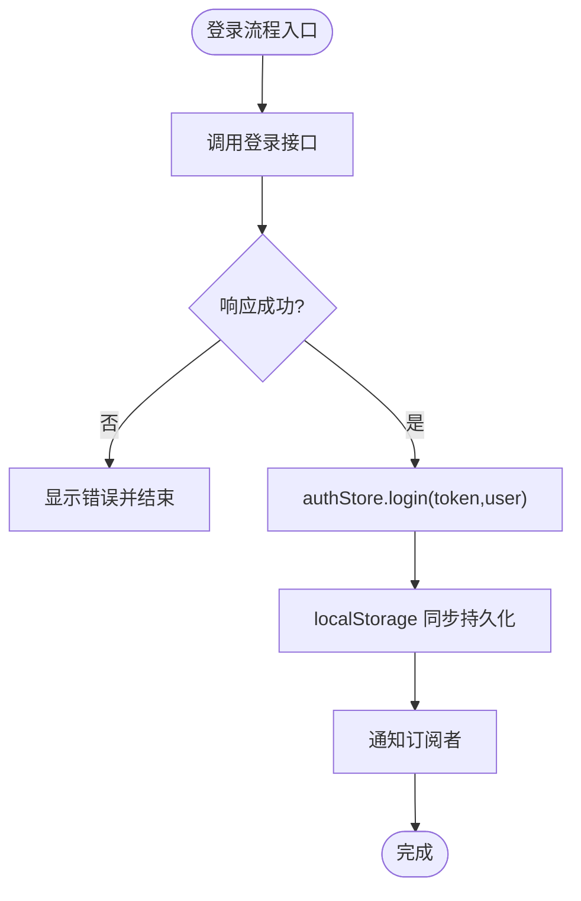
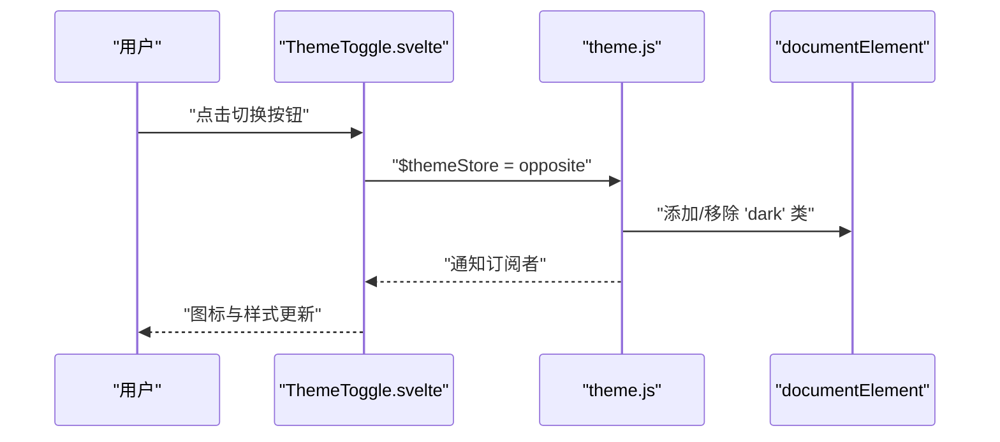
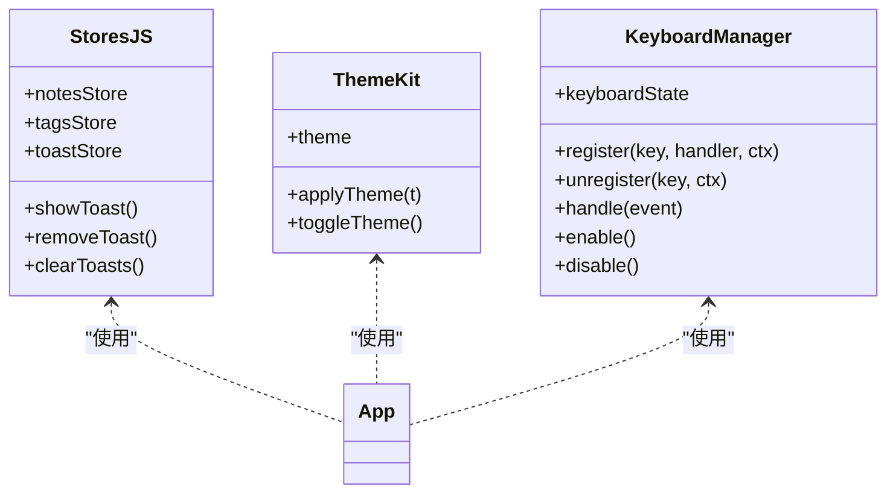
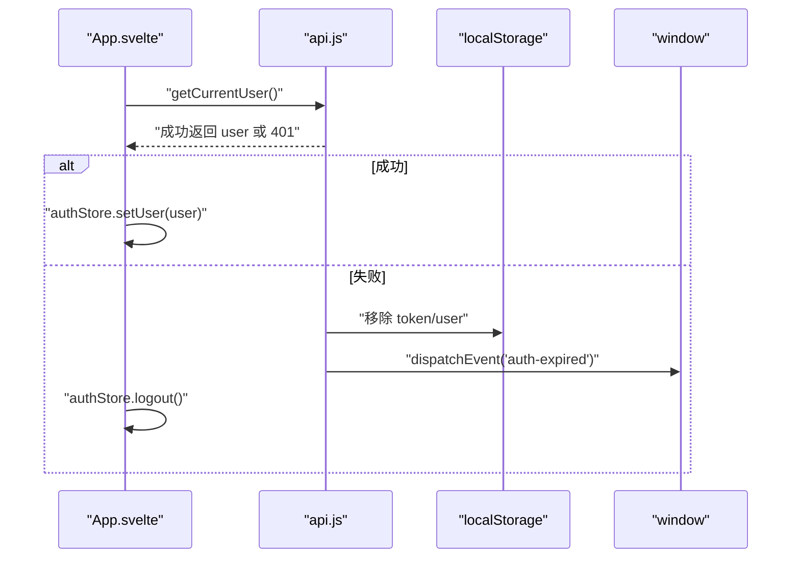
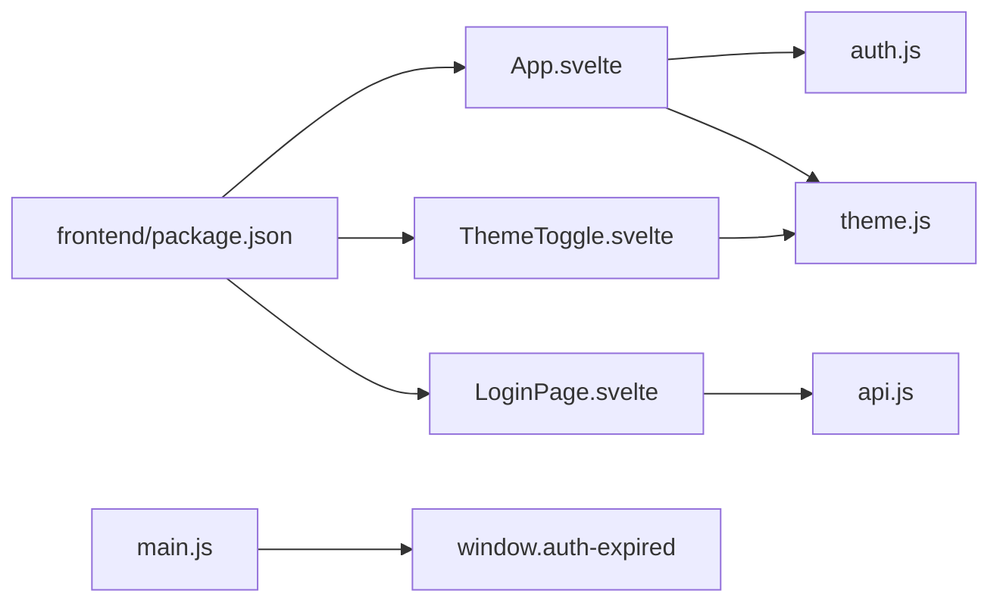

# 状态管理

<cite>
**本文引用的文件**
- [frontend/src/stores/auth.js](file://frontend/src/stores/auth.js)
- [frontend/src/stores/theme.js](file://frontend/src/stores/theme.js)
- [frontend/src/stores/auth.test.js](file://frontend/src/stores/auth.test.js)
- [frontend/src/stores/theme.test.js](file://frontend/src/stores/theme.test.js)
- [frontend/src/App.svelte](file://frontend/src/App.svelte)
- [frontend/src/components/LoginPage.svelte](file://frontend/src/components/LoginPage.svelte)
- [frontend/src/components/ThemeToggle.svelte](file://frontend/src/components/ThemeToggle.svelte)
- [frontend/src/main.js](file://frontend/src/main.js)
- [frontend/src/styles/global.css](file://frontend/src/styles/global.css)
- [frontend/src/utils/api.js](file://frontend/src/utils/api.js)
- [kit/src/lib/stores.js](file://kit/src/lib/stores.js)
- [kit/src/lib/theme.js](file://kit/src/lib/theme.js)
- [kit/src/lib/keyboardManager.js](file://kit/src/lib/keyboardManager.js)
- [frontend/package.json](file://frontend/package.json)
- [kit/package.json](file://kit/package.json)
</cite>

## 目录
1. [简介](#简介)
2. [项目结构](#项目结构)
3. [核心组件](#核心组件)
4. [架构总览](#架构总览)
5. [组件详解](#组件详解)
6. [依赖关系分析](#依赖关系分析)
7. [性能考量](#性能考量)
8. [故障排查指南](#故障排查指南)
9. [结论](#结论)
10. [附录](#附录)

## 简介
本文件系统性梳理 Memo Studio 的前端状态管理方案，围绕基于 Svelte Store 的两类核心状态：认证状态与主题状态，辅以 Kit 中的通用可写状态与键盘管理状态，解释其设计模式、响应式更新机制、持久化策略、订阅与组件更新触发方式，并给出最佳实践、错误处理与测试策略，帮助开发者快速理解并高效扩展状态管理。

## 项目结构
前端状态管理主要分布在以下位置：
- 前端 stores：认证状态与主题状态
- 前端组件：登录页、主题切换按钮、主应用入口
- 全局样式：CSS 变量与明暗主题映射
- 工具层：API 封装与鉴权拦截
- Kit 层：通用可写状态与主题切换（Kit 项目）

**图表来源**
- [frontend/src/App.svelte](file://frontend/src/App.svelte#L1-L328)
- [frontend/src/components/LoginPage.svelte](file://frontend/src/components/LoginPage.svelte#L1-L316)
- [frontend/src/components/ThemeToggle.svelte](file://frontend/src/components/ThemeToggle.svelte#L1-L63)
- [frontend/src/stores/auth.js](file://frontend/src/stores/auth.js#L1-L80)
- [frontend/src/stores/theme.js](file://frontend/src/stores/theme.js#L1-L40)
- [frontend/src/utils/api.js](file://frontend/src/utils/api.js#L1-L316)
- [frontend/src/styles/global.css](file://frontend/src/styles/global.css#L1-L185)
- [frontend/src/main.js](file://frontend/src/main.js#L1-L20)
- [kit/src/lib/stores.js](file://kit/src/lib/stores.js#L1-L32)
- [kit/src/lib/theme.js](file://kit/src/lib/theme.js#L1-L25)
- [kit/src/lib/keyboardManager.js](file://kit/src/lib/keyboardManager.js#L1-L115)

**章节来源**
- [frontend/src/stores/auth.js](file://frontend/src/stores/auth.js#L1-L80)
- [frontend/src/stores/theme.js](file://frontend/src/stores/theme.js#L1-L40)
- [frontend/src/App.svelte](file://frontend/src/App.svelte#L1-L328)
- [frontend/src/components/LoginPage.svelte](file://frontend/src/components/LoginPage.svelte#L1-L316)
- [frontend/src/components/ThemeToggle.svelte](file://frontend/src/components/ThemeToggle.svelte#L1-L63)
- [frontend/src/utils/api.js](file://frontend/src/utils/api.js#L1-L316)
- [frontend/src/styles/global.css](file://frontend/src/styles/global.css#L1-L185)
- [frontend/src/main.js](file://frontend/src/main.js#L1-L20)
- [kit/src/lib/stores.js](file://kit/src/lib/stores.js#L1-L32)
- [kit/src/lib/theme.js](file://kit/src/lib/theme.js#L1-L25)
- [kit/src/lib/keyboardManager.js](file://kit/src/lib/keyboardManager.js#L1-L115)

## 核心组件
- 认证状态管理（auth.js）
  - 提供订阅、登录、登出、设置 token 与用户信息等方法，支持本地持久化与通知分发。
- 主题状态管理（theme.js）
  - 提供订阅、设置、获取主题值，持久化至 localStorage 并同步到 documentElement 的类名，实现明/暗主题切换。
- Kit 通用状态（stores.js）
  - 基于 Svelte writable 的笔记、标签、Toast 列表状态，以及 Toast 工具函数。
- Kit 主题（theme.js）
  - 基于 Svelte writable 的主题 store，支持初始主题检测、切换与持久化。
- 键盘管理（keyboardManager.js）
  - 基于 Svelte writable 的键盘状态与全局键盘管理器，支持上下文区分、修饰键组合与默认快捷键。

**章节来源**
- [frontend/src/stores/auth.js](file://frontend/src/stores/auth.js#L1-L80)
- [frontend/src/stores/theme.js](file://frontend/src/stores/theme.js#L1-L40)
- [kit/src/lib/stores.js](file://kit/src/lib/stores.js#L1-L32)
- [kit/src/lib/theme.js](file://kit/src/lib/theme.js#L1-L25)
- [kit/src/lib/keyboardManager.js](file://kit/src/lib/keyboardManager.js#L1-L115)

## 架构总览
Memo Studio 的状态管理采用“自定义轻量 store + Svelte writable”的混合架构：
- 自定义 store（auth.js、theme.js）：手动维护状态与订阅者集合，提供最小 API，便于直接持久化与 DOM 同步。
- Svelte writable store（kit/src/lib/stores.js、kit/src/lib/theme.js）：利用 Svelte 的响应式特性，简化复杂状态的声明与更新。
- 组件层通过 $store 语法或 subscribe 订阅，实现视图与状态的自动联动。
- API 层在鉴权失败时触发全局事件，驱动应用进行登出与跳转。

**图表来源**
- [frontend/src/components/LoginPage.svelte](file://frontend/src/components/LoginPage.svelte#L23-L41)
- [frontend/src/utils/api.js](file://frontend/src/utils/api.js#L117-L129)
- [frontend/src/stores/auth.js](file://frontend/src/stores/auth.js#L48-L56)
- [frontend/src/App.svelte](file://frontend/src/App.svelte#L27-L31)

**章节来源**
- [frontend/src/App.svelte](file://frontend/src/App.svelte#L27-L51)
- [frontend/src/components/LoginPage.svelte](file://frontend/src/components/LoginPage.svelte#L23-L41)
- [frontend/src/utils/api.js](file://frontend/src/utils/api.js#L117-L129)
- [frontend/src/stores/auth.js](file://frontend/src/stores/auth.js#L48-L75)

## 组件详解

### 认证状态管理（auth.js）
- 设计要点
  - 内部状态：token 与 user
  - 初始化：从 localStorage 恢复 token 与 user
  - 订阅：首次回调当前状态，返回取消订阅函数
  - 更新：setToken/setUser/login/logout 后统一 notify 分发
  - 持久化：每次更新均同步到 localStorage
- 生命周期
  - 登录：login 设置 token 与 user，并持久化
  - 登出：logout 清空 token 与 user，并移除持久化
  - 验证：App 在挂载后验证 token 并更新 user
- 错误处理
  - API 层 401 时清理 localStorage 并派发 auth-expired 事件
  - App 监听该事件并执行登出流程

**图表来源**
- [frontend/src/components/LoginPage.svelte](file://frontend/src/components/LoginPage.svelte#L23-L41)
- [frontend/src/stores/auth.js](file://frontend/src/stores/auth.js#L48-L56)

**章节来源**
- [frontend/src/stores/auth.js](file://frontend/src/stores/auth.js#L1-L80)
- [frontend/src/App.svelte](file://frontend/src/App.svelte#L44-L51)
- [frontend/src/utils/api.js](file://frontend/src/utils/api.js#L16-L23)

### 主题状态管理（theme.js）
- 设计要点
  - 初始化：从 localStorage 读取主题；若无则回退到 light
  - DOM 同步：设置主题时同步给 documentElement.classList 添加/移除 'dark'
  - 订阅：首次回调当前主题值
  - 持久化：每次 set 同步写入 localStorage
- 切换逻辑
  - ThemeToggle 通过 $themeStore 切换 'light'/'dark'，触发订阅者更新
  - App 顶部 Header 引入 ThemeToggle，实现全局主题切换

**图表来源**
- [frontend/src/components/ThemeToggle.svelte](file://frontend/src/components/ThemeToggle.svelte#L6-L11)
- [frontend/src/stores/theme.js](file://frontend/src/stores/theme.js#L23-L35)

**章节来源**
- [frontend/src/stores/theme.js](file://frontend/src/stores/theme.js#L1-L40)
- [frontend/src/components/ThemeToggle.svelte](file://frontend/src/components/ThemeToggle.svelte#L1-L63)
- [frontend/src/styles/global.css](file://frontend/src/styles/global.css#L35-L61)

### Kit 通用状态与主题
- 通用状态（stores.js）
  - notesStore/tagsStore/toastStore：基于 writable 的可写状态
  - showToast/removeToast/clearToasts：Toast 管理工具，支持自动过期
- Kit 主题（theme.js）
  - 基于 Svelte writable 的主题 store，支持初始主题检测与切换
- 键盘管理（keyboardManager.js）
  - keyboardState：当前上下文与帮助显示状态
  - KeyboardManager：注册/注销快捷键处理器，支持上下文与修饰键组合

**图表来源**
- [kit/src/lib/stores.js](file://kit/src/lib/stores.js#L1-L32)
- [kit/src/lib/theme.js](file://kit/src/lib/theme.js#L1-L25)
- [kit/src/lib/keyboardManager.js](file://kit/src/lib/keyboardManager.js#L1-L115)

**章节来源**
- [kit/src/lib/stores.js](file://kit/src/lib/stores.js#L1-L32)
- [kit/src/lib/theme.js](file://kit/src/lib/theme.js#L1-L25)
- [kit/src/lib/keyboardManager.js](file://kit/src/lib/keyboardManager.js#L1-L115)

### 认证生命周期与权限控制
- 登录成功后，App 通过 CustomEvent('auth-success') 切换视图
- 验证流程：App 挂载后调用 getCurrentUser，成功则更新 user，失败则 logout
- 权限控制：API 层对 401 进行拦截，清理本地 token 与 user，并派发 auth-expired
- 应用层监听 auth-expired，提示用户重新登录

**图表来源**
- [frontend/src/App.svelte](file://frontend/src/App.svelte#L44-L51)
- [frontend/src/utils/api.js](file://frontend/src/utils/api.js#L145-L152)
- [frontend/src/utils/api.js](file://frontend/src/utils/api.js#L16-L23)
- [frontend/src/main.js](file://frontend/src/main.js#L8-L17)

**章节来源**
- [frontend/src/App.svelte](file://frontend/src/App.svelte#L27-L51)
- [frontend/src/utils/api.js](file://frontend/src/utils/api.js#L145-L152)
- [frontend/src/main.js](file://frontend/src/main.js#L8-L17)

### 用户信息缓存与权限控制机制
- 缓存策略
  - localStorage：token 与 user 持久化，应用初始化时恢复
  - 认证状态 store：内存中维护最新状态，subscribe 首次回调确保组件即时感知
- 权限控制
  - 所有受保护接口统一走 fetchWithAuth，自动附加 Authorization 头
  - 401 时统一清理本地数据并触发 auth-expired，避免继续发送无效请求

**章节来源**
- [frontend/src/stores/auth.js](file://frontend/src/stores/auth.js#L5-L16)
- [frontend/src/utils/api.js](file://frontend/src/utils/api.js#L52-L76)
- [frontend/src/utils/api.js](file://frontend/src/utils/api.js#L33-L50)

### 主题切换逻辑与 CSS 变量管理
- 切换逻辑
  - theme.js：set 时写入 localStorage 并同步 documentElement.classList
  - ThemeToggle：通过 $themeStore 切换值，触发订阅者更新
- CSS 变量与暗黑模式
  - global.css 定义 CSS 变量；.dark 类切换变量值，实现明/暗主题
  - 无需引入额外 CSS 文件，纯 CSS 变量与类名切换即可

**章节来源**
- [frontend/src/stores/theme.js](file://frontend/src/stores/theme.js#L23-L35)
- [frontend/src/styles/global.css](file://frontend/src/styles/global.css#L5-L61)

### 状态订阅机制与组件更新触发
- 自定义 store
  - subscribe(fn)：首次回调当前状态，返回取消订阅函数
  - notify：遍历订阅者集合，推送最新状态
- Svelte writable store
  - $store 语法自动订阅与解绑，适合复杂状态与跨模块共享
- 组件更新
  - App.svelte 中 $: isAuthenticated = $authStore.isAuthenticated
  - ThemeToggle 与 LoginPage 通过 $themeStore/$authStore 订阅更新 UI

**章节来源**
- [frontend/src/stores/auth.js](file://frontend/src/stores/auth.js#L20-L25)
- [frontend/src/stores/auth.js](file://frontend/src/stores/auth.js#L77-L79)
- [frontend/src/App.svelte](file://frontend/src/App.svelte#L27-L27)
- [frontend/src/components/ThemeToggle.svelte](file://frontend/src/components/ThemeToggle.svelte#L8-L11)

### 性能优化策略
- 最小化订阅范围：仅在必要组件订阅，避免过度响应
- 批量更新：对多次状态变更尽量合并，减少重复渲染
- 本地持久化：减少网络往返，提升首屏体验
- 事件驱动：通过 CustomEvent 解耦鉴权失效处理，避免阻塞主线程
- CSS 变量切换：主题切换仅操作类名与变量，避免重排重绘

[本节为通用指导，不直接分析具体文件]

## 依赖关系分析
- 前端包管理
  - frontend/package.json：Svelte 5、Tailwind 等
  - kit/package.json：Svelte Kit、静态适配器等
- 组件依赖
  - App 依赖 auth.js、theme.js、LoginPage、ThemeToggle
  - LoginPage 依赖 api.js 与 auth.js
  - ThemeToggle 依赖 theme.js
  - main.js 监听 auth-expired 事件

**图表来源**
- [frontend/package.json](file://frontend/package.json#L1-L25)
- [kit/package.json](file://kit/package.json#L1-L20)
- [frontend/src/App.svelte](file://frontend/src/App.svelte#L1-L16)
- [frontend/src/components/LoginPage.svelte](file://frontend/src/components/LoginPage.svelte#L1-L12)
- [frontend/src/components/ThemeToggle.svelte](file://frontend/src/components/ThemeToggle.svelte#L1-L12)
- [frontend/src/stores/auth.js](file://frontend/src/stores/auth.js#L1-L80)
- [frontend/src/stores/theme.js](file://frontend/src/stores/theme.js#L1-L40)
- [frontend/src/utils/api.js](file://frontend/src/utils/api.js#L1-L316)
- [frontend/src/main.js](file://frontend/src/main.js#L8-L17)

**章节来源**
- [frontend/package.json](file://frontend/package.json#L1-L25)
- [kit/package.json](file://kit/package.json#L1-L20)

## 性能考量
- 减少不必要的渲染
  - 将大对象拆分为多个小 store，按需订阅
  - 对高频更新状态使用 throttle/debounce
- 存储与网络
  - 优先使用 localStorage 缓存轻量数据
  - 对长耗时请求使用 loading 状态与超时控制
- 主题切换
  - 仅切换类名与变量，避免重排重绘
- 键盘管理
  - 通过上下文与修饰键精确匹配，避免全局监听导致的性能问题

[本节为通用指导，不直接分析具体文件]

## 故障排查指南
- 登录后无法进入主界面
  - 检查 LoginPage 是否正确调用 authStore.login
  - 确认 App 是否监听并处理 'auth-success' 事件
- 主题切换无效
  - 检查 theme.js 的 set 是否写入 localStorage 并更新 documentElement.classList
  - 确认 global.css 中 CSS 变量与 .dark 类存在
- 鉴权失效但未登出
  - 检查 api.js 的 handleAuthError 是否被调用
  - 确认 main.js 是否监听 'auth-expired' 并执行登出
- 单元测试
  - auth.test.js：验证 login/logout 对订阅者与 localStorage 的影响
  - theme.test.js：验证 set 对 localStorage 与 DOM 类的影响

**章节来源**
- [frontend/src/components/LoginPage.svelte](file://frontend/src/components/LoginPage.svelte#L32-L41)
- [frontend/src/App.svelte](file://frontend/src/App.svelte#L27-L31)
- [frontend/src/stores/auth.js](file://frontend/src/stores/auth.js#L48-L75)
- [frontend/src/stores/theme.js](file://frontend/src/stores/theme.js#L23-L35)
- [frontend/src/utils/api.js](file://frontend/src/utils/api.js#L16-L23)
- [frontend/src/main.js](file://frontend/src/main.js#L8-L17)
- [frontend/src/stores/auth.test.js](file://frontend/src/stores/auth.test.js#L21-L40)
- [frontend/src/stores/theme.test.js](file://frontend/src/stores/theme.test.js#L37-L48)

## 结论
Memo Studio 的状态管理以“自定义轻量 store + Svelte writable”为核心，结合 localStorage 持久化与 CSS 变量主题系统，实现了简洁、可控且高性能的状态流。认证状态通过明确的生命周期与鉴权拦截保障了安全性，主题状态通过类名切换与变量映射实现了平滑体验。建议在扩展新状态时遵循最小 API、明确订阅边界与持久化策略，确保一致性与可维护性。

## 附录
- 最佳实践
  - 将轻量状态放入自定义 store，复杂状态放入 Svelte writable
  - 所有受保护接口统一走带鉴权头的封装函数
  - 主题与布局状态尽量使用 CSS 变量与类名切换
  - 对高频状态变更进行节流/去抖
- 测试策略
  - 使用 Node 测试环境模拟 window、localStorage、document
  - 针对订阅者回调次数与状态一致性进行断言
  - 覆盖登录/登出、主题切换、鉴权失效等关键路径

[本节为通用指导，不直接分析具体文件]