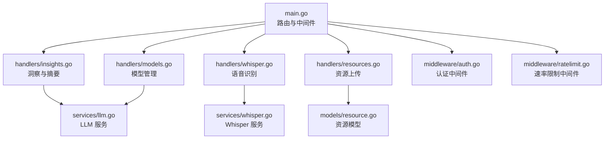
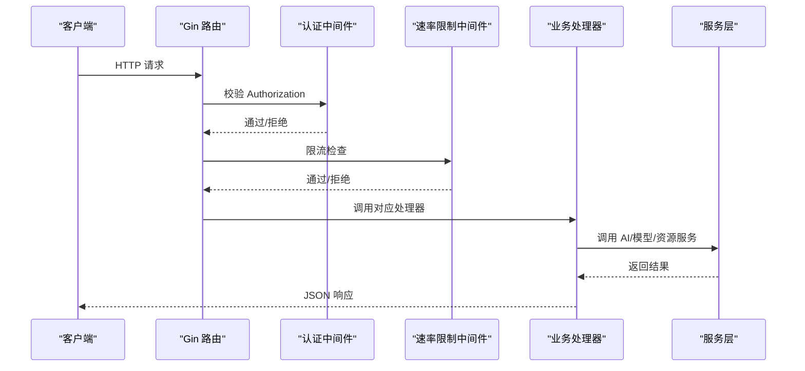
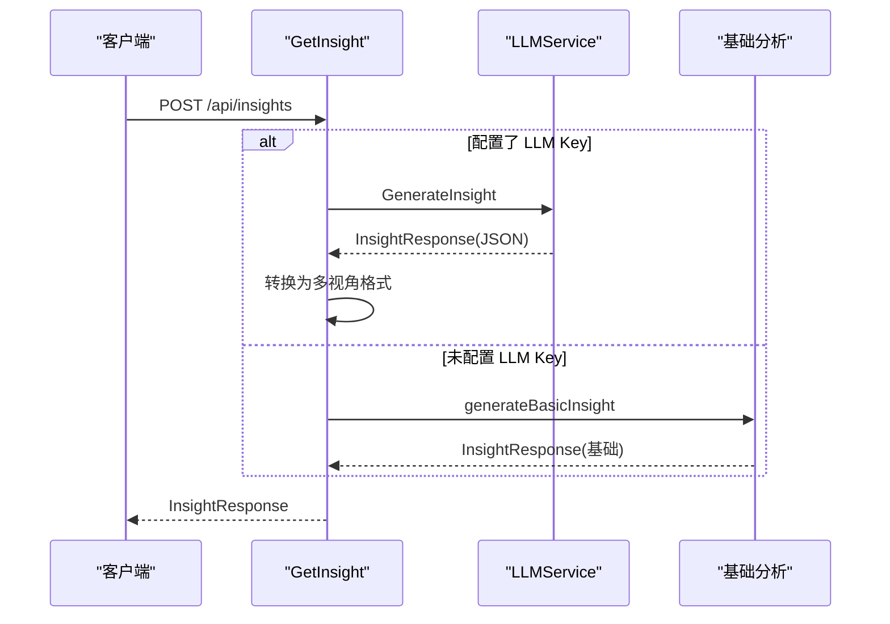
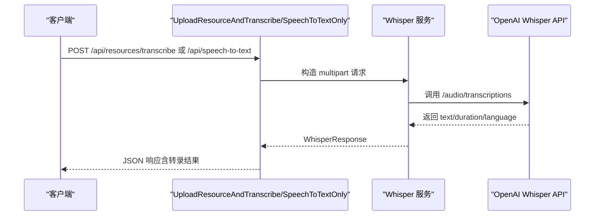
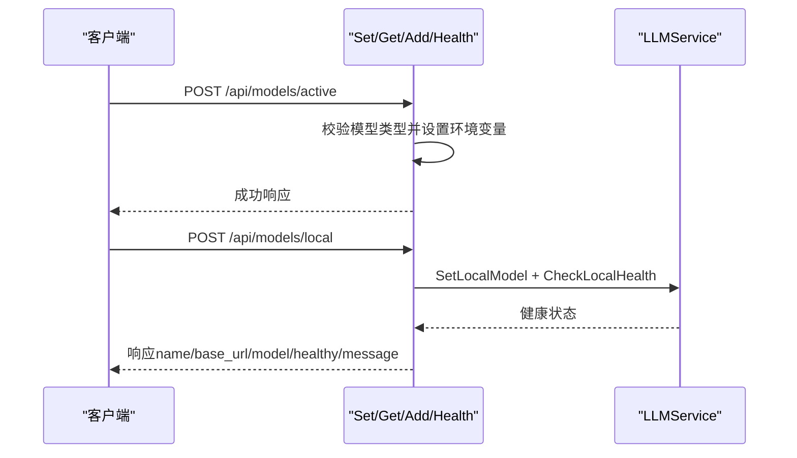
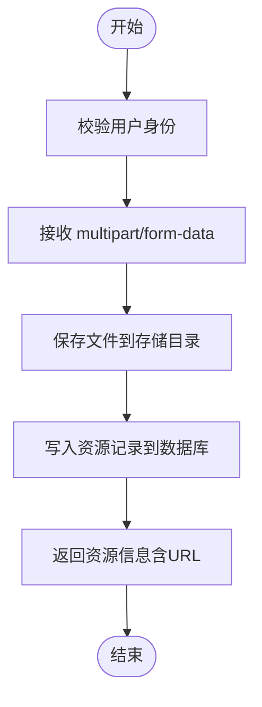
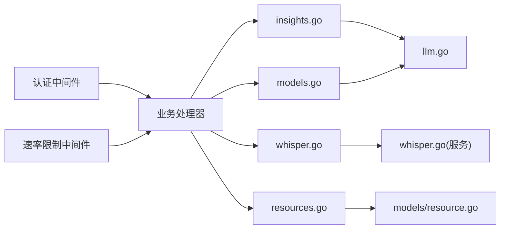

# AI 智能服务接口

<cite>
**本文引用的文件**
- [backend/main.go](file://backend/main.go)
- [backend/handlers/insights.go](file://backend/handlers/insights.go)
- [backend/handlers/whisper.go](file://backend/handlers/whisper.go)
- [backend/services/llm.go](file://backend/services/llm.go)
- [backend/services/whisper.go](file://backend/services/whisper.go)
- [backend/handlers/models.go](file://backend/handlers/models.go)
- [docs/LLM_MODELS.md](file://docs/LLM_MODELS.md)
- [backend/middleware/auth.go](file://backend/middleware/auth.go)
- [backend/middleware/ratelimit.go](file://backend/middleware/ratelimit.go)
- [backend/handlers/resources.go](file://backend/handlers/resources.go)
- [backend/models/resource.go](file://backend/models/resource.go)
</cite>

## 目录
1. [简介](#简介)
2. [项目结构](#项目结构)
3. [核心组件](#核心组件)
4. [架构总览](#架构总览)
5. [详细组件分析](#详细组件分析)
6. [依赖关系分析](#依赖关系分析)
7. [性能考虑](#性能考虑)
8. [故障排查指南](#故障排查指南)
9. [结论](#结论)
10. [附录](#附录)

## 简介
本文件为 Memo Studio 的 AI 智能服务接口文档，涵盖以下能力：
- 洞察分析接口：内容分析、关键词提取、情感分析、主题分类、智能摘要生成
- 内容审查接口：敏感内容检测、合规性检查、风险评估、自动标记（注：仓库中未发现专门的“内容审查”接口，但可结合洞察与资源管理实现相关内容的合规与风险评估）
- 语音识别接口：音频转文字、语音质量评估、多语言支持、实时转录
- 模型管理接口：LLM 模型配置、API 密钥管理、模型切换、性能监控

文档提供请求/响应示例、AI 模型说明、费用与计费策略、错误处理机制，并给出配置指南、性能优化与成本控制策略。

## 项目结构
后端采用 Go + Gin 框架，API 路由集中在主入口，按功能拆分为多个 handler 与 service 层：
- 路由与中间件：认证、速率限制、CORS、安全头
- 洞察与摘要：insights.go
- 语音识别：whisper.go
- 模型管理：models.go + llm.go
- 资源管理：resources.go + models/resource.go

图表来源
- [backend/main.go](file://backend/main.go#L94-L196)
- [backend/handlers/insights.go](file://backend/handlers/insights.go#L68-L263)
- [backend/handlers/whisper.go](file://backend/handlers/whisper.go#L31-L162)
- [backend/handlers/models.go](file://backend/handlers/models.go#L60-L370)
- [backend/services/llm.go](file://backend/services/llm.go#L377-L641)
- [backend/services/whisper.go](file://backend/services/whisper.go#L45-L138)
- [backend/handlers/resources.go](file://backend/handlers/resources.go#L91-L155)
- [backend/models/resource.go](file://backend/models/resource.go#L36-L56)
- [backend/middleware/auth.go](file://backend/middleware/auth.go#L12-L52)
- [backend/middleware/ratelimit.go](file://backend/middleware/ratelimit.go#L96-L121)

章节来源
- [backend/main.go](file://backend/main.go#L94-L196)

## 核心组件
- 洞察与摘要服务：提供多视角洞察、关键词、情感、主题、趋势与建议；支持单条与批量总结
- 语音识别服务：支持上传音频并转录，或仅转录不保存；支持语言、提示词、温度等参数
- 模型管理服务：支持云端与本地模型配置、切换、健康检查与连接测试
- 资源管理：支持附件上传、分页查询、删除与安全命名

章节来源
- [backend/handlers/insights.go](file://backend/handlers/insights.go#L68-L263)
- [backend/handlers/whisper.go](file://backend/handlers/whisper.go#L31-L162)
- [backend/services/llm.go](file://backend/services/llm.go#L377-L641)
- [backend/handlers/models.go](file://backend/handlers/models.go#L60-L370)
- [backend/handlers/resources.go](file://backend/handlers/resources.go#L91-L155)

## 架构总览
后端通过 Gin 路由暴露 REST API，认证与速率限制中间件贯穿公开与私有路由。AI 能力通过服务层封装外部 LLM 与 Whisper API，模型管理提供统一配置入口。

图表来源
- [backend/main.go](file://backend/main.go#L94-L196)
- [backend/middleware/auth.go](file://backend/middleware/auth.go#L12-L52)
- [backend/middleware/ratelimit.go](file://backend/middleware/ratelimit.go#L96-L121)

## 详细组件分析

### 洞察分析接口
- 功能概述
  - 多视角洞察：概览、主题、情感、行动、频率等
  - 智能摘要：单条与批量摘要
  - 对比分析：两组笔记的对比洞察
- 关键数据结构
  - 请求体：notes、time_range、perspectives
  - 响应体：summary、perspectives、highlights、action_items、update_time
- 能力实现
  - 若配置了 LLM API Key，则调用 LLM 生成洞察与摘要；否则回退到基础统计分析
  - 支持将 LLM 结果转换为多视角格式

图表来源
- [backend/handlers/insights.go](file://backend/handlers/insights.go#L68-L119)
- [backend/services/llm.go](file://backend/services/llm.go#L549-L591)

章节来源
- [backend/handlers/insights.go](file://backend/handlers/insights.go#L68-L263)
- [backend/services/llm.go](file://backend/services/llm.go#L533-L641)

请求/响应示例（路径参考）
- 综合洞察：POST /api/insights
- 特定视角：POST /api/insights/:type
- 对比分析：POST /api/insights/compare
- 单条总结：POST /api/summarize
- 批量总结：POST /api/summarize/batch

### 语音识别接口
- 功能概述
  - 上传并转录：保存文件并返回转录文本、时长、语言
  - 仅转录：不保存文件，直接返回转录结果
  - 支持语言、提示词、温度等参数
- 关键数据结构
  - WhisperConfig：APIKey、BaseURL、Model
  - WhisperResponse：text、duration、language
- 能力实现
  - 优先使用 OPENAI_API_KEY；若未配置则返回未启用提示
  - 支持多种音频格式（mp3、wav、m4a、ogg、webm、flac、mp4）

图表来源
- [backend/handlers/whisper.go](file://backend/handlers/whisper.go#L31-L162)
- [backend/services/whisper.go](file://backend/services/whisper.go#L45-L138)

章节来源
- [backend/handlers/whisper.go](file://backend/handlers/whisper.go#L31-L162)
- [backend/services/whisper.go](file://backend/services/whisper.go#L45-L138)

请求/响应示例（路径参考）
- 上传并转录：POST /api/resources/transcribe
- 仅转录：POST /api/speech-to-text

### 模型管理接口
- 功能概述
  - 获取模型列表：按 cloud/local/all 分类
  - 获取当前模型配置
  - 设置当前模型（云端/本地）
  - 添加自定义本地模型
  - 健康检查与连接测试
- 关键数据结构
  - ModelConfig：type、name、category、api_key、base_url、model、max_tokens、context、gpu
  - ActiveModelInfo：当前激活模型信息
- 能力实现
  - 通过环境变量统一或分别配置 API Key
  - 支持本地模型服务（Ollama、LM Studio、LocalAI、AnythingLLM）

图表来源
- [backend/handlers/models.go](file://backend/handlers/models.go#L60-L162)
- [backend/services/llm.go](file://backend/services/llm.go#L377-L416)

章节来源
- [backend/handlers/models.go](file://backend/handlers/models.go#L60-L370)
- [backend/services/llm.go](file://backend/services/llm.go#L14-L336)

请求/响应示例（路径参考）
- 获取模型列表：GET /api/models
- 获取云端模型：GET /api/models/cloud
- 获取本地模型：GET /api/models/local
- 设置当前模型：POST /api/models/active
- 添加本地模型：POST /api/models/local
- 健康检查：POST /api/models/local/health
- 连接测试：POST /api/models/test
- 获取当前配置：GET /api/models/config

### 资源管理接口
- 功能概述
  - 上传附件（multipart/form-data），支持最大 20MB
  - 列出当前用户资源（分页）
  - 删除资源
- 关键数据结构
  - Resource：id、user_id、filename、storage_path、url、mime_type、size、sha256、created_at
- 能力实现
  - 文件名安全清洗，按日期与用户隔离存储
  - 数据库存储资源元数据，URL 映射至 /uploads

图表来源
- [backend/handlers/resources.go](file://backend/handlers/resources.go#L91-L155)
- [backend/models/resource.go](file://backend/models/resource.go#L36-L56)

章节来源
- [backend/handlers/resources.go](file://backend/handlers/resources.go#L91-L172)
- [backend/models/resource.go](file://backend/models/resource.go#L36-L169)

请求/响应示例（路径参考）
- 上传资源：POST /api/resources
- 列出资源：GET /api/resources
- 删除资源：DELETE /api/resources/:id

## 依赖关系分析
- 路由与中间件
  - 认证中间件：校验 Bearer Token，注入用户信息
  - 速率限制中间件：全局每分钟 50 次，严格模式每分钟 30 次
- 处理器与服务
  - 洞察与摘要：依赖 LLMService
  - 语音识别：依赖 Whisper 服务
  - 模型管理：依赖 LLMService 与环境变量
  - 资源管理：依赖文件系统与数据库

图表来源
- [backend/middleware/auth.go](file://backend/middleware/auth.go#L12-L52)
- [backend/middleware/ratelimit.go](file://backend/middleware/ratelimit.go#L96-L121)
- [backend/handlers/insights.go](file://backend/handlers/insights.go#L68-L119)
- [backend/handlers/whisper.go](file://backend/handlers/whisper.go#L31-L162)
- [backend/handlers/models.go](file://backend/handlers/models.go#L60-L162)
- [backend/services/llm.go](file://backend/services/llm.go#L377-L641)
- [backend/services/whisper.go](file://backend/services/whisper.go#L45-L138)
- [backend/handlers/resources.go](file://backend/handlers/resources.go#L91-L155)
- [backend/models/resource.go](file://backend/models/resource.go#L36-L56)

章节来源
- [backend/middleware/auth.go](file://backend/middleware/auth.go#L12-L52)
- [backend/middleware/ratelimit.go](file://backend/middleware/ratelimit.go#L96-L121)

## 性能考虑
- 速率限制
  - 全局每分钟 50 次，严格模式每分钟 30 次；可通过中间件调整
- 上传限制
  - 上传文件最大 20MB，避免过大请求导致内存压力
- 语音转录
  - 默认超时 60 秒；建议合理设置语言、提示词与温度以提升准确率
- 模型选择
  - 云端模型：按需选择合适模型，注意并发与延迟
  - 本地模型：根据显存与 CPU 配置选择合适模型，Ollama 可通过环境变量优化并发与线程数

章节来源
- [backend/middleware/ratelimit.go](file://backend/middleware/ratelimit.go#L96-L121)
- [backend/handlers/whisper.go](file://backend/handlers/whisper.go#L218-L261)
- [docs/LLM_MODELS.md](file://docs/LLM_MODELS.md#L259-L277)

## 故障排查指南
- 认证失败
  - 检查 Authorization 头是否为 Bearer Token 格式
- 速率限制触发
  - 等待重试时间或降低请求频率；查看 X-RateLimit-* 响应头
- 语音转录未启用
  - 未配置 OPENAI_API_KEY 时，返回未启用提示；请设置后重试
- 模型切换失败
  - 确认模型类型有效；本地模型需提供 base_url 与 model
- 资源上传失败
  - 检查文件大小、MIME 类型与存储目录权限

章节来源
- [backend/middleware/auth.go](file://backend/middleware/auth.go#L12-L52)
- [backend/middleware/ratelimit.go](file://backend/middleware/ratelimit.go#L96-L121)
- [backend/handlers/whisper.go](file://backend/handlers/whisper.go#L133-L162)
- [backend/handlers/models.go](file://backend/handlers/models.go#L60-L104)
- [backend/handlers/resources.go](file://backend/handlers/resources.go#L91-L155)

## 结论
Memo Studio 的 AI 智能服务接口提供了从内容洞察、摘要生成到语音识别与模型管理的完整能力。通过统一的模型配置与中间件体系，既保证了易用性，也兼顾了安全与性能。建议在生产环境中：
- 明确配置 LLM 与 Whisper 的 API Key
- 合理设置速率限制与模型选择
- 对资源上传与存储进行容量规划
- 结合日志与监控持续优化体验

## 附录

### API 一览与示例（路径参考）
- 洞察分析
  - POST /api/insights
  - POST /api/insights/:type
  - POST /api/insights/compare
  - POST /api/summarize
  - POST /api/summarize/batch
- 语音识别
  - POST /api/resources/transcribe
  - POST /api/speech-to-text
- 模型管理
  - GET /api/models
  - GET /api/models/cloud
  - GET /api/models/local
  - GET /api/models/config
  - POST /api/models/active
  - POST /api/models/local
  - POST /api/models/local/health
  - POST /api/models/test
- 资源管理
  - POST /api/resources
  - GET /api/resources
  - DELETE /api/resources/:id

章节来源
- [backend/main.go](file://backend/main.go#L132-L196)
- [docs/LLM_MODELS.md](file://docs/LLM_MODELS.md#L209-L258)

### AI 模型说明与配置
- 支持的云端模型与环境变量
  - OpenAI、Claude、DeepSeek、智谱、零一万物、阿里云、月之暗面、讯飞
- 本地模型服务
  - Ollama、LM Studio、LocalAI、AnythingLLM
- 模型切换与测试
  - 通过 /api/models/active 与 /api/models/test 实现

章节来源
- [docs/LLM_MODELS.md](file://docs/LLM_MODELS.md#L1-L277)
- [backend/services/llm.go](file://backend/services/llm.go#L14-L336)
- [backend/handlers/models.go](file://backend/handlers/models.go#L60-L370)

### 费用与计费策略
- 云端模型计费
  - 依据所选模型与调用次数/Token 数量计费，具体以各平台为准
- 本地模型成本
  - 无外部 API 费用，主要为硬件与维护成本
- 建议
  - 优先使用本地模型进行高频调用；对复杂任务再选用云端高阶模型

章节来源
- [docs/LLM_MODELS.md](file://docs/LLM_MODELS.md#L259-L277)

### 配置指南
- 环境变量
  - LLM_API_KEY：统一 API Key
  - OPENAI_API_KEY、ANTHROPIC_API_KEY、DEEPSEEK_API_KEY、ZHIPU_API_KEY 等：按模型分别配置
  - OPENAI_BASE_URL：自定义 OpenAI 兼容服务地址
  - WHISPER_MODEL：语音模型名称
  - MEMO_STORAGE_DIR：资源存储根目录
  - MEMO_CORS_ORIGINS：CORS 允许的来源
  - GIN_MODE、MEMO_ENV：运行模式与环境
- Docker 部署
  - 在 docker-compose 中设置上述环境变量

章节来源
- [docs/LLM_MODELS.md](file://docs/LLM_MODELS.md#L29-L207)
- [backend/main.go](file://backend/main.go#L55-L80)