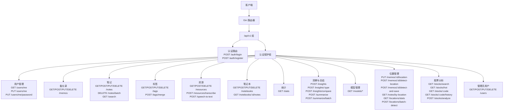
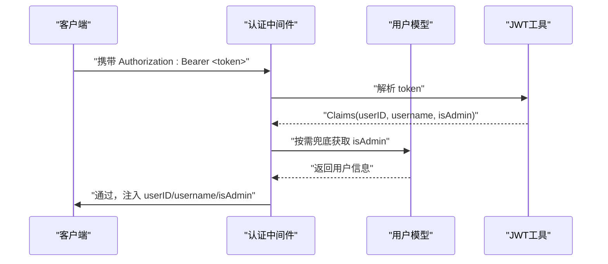
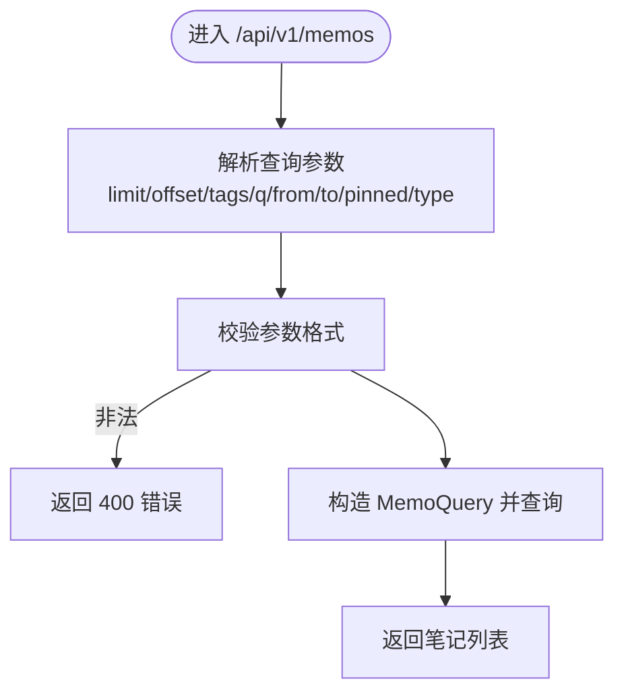
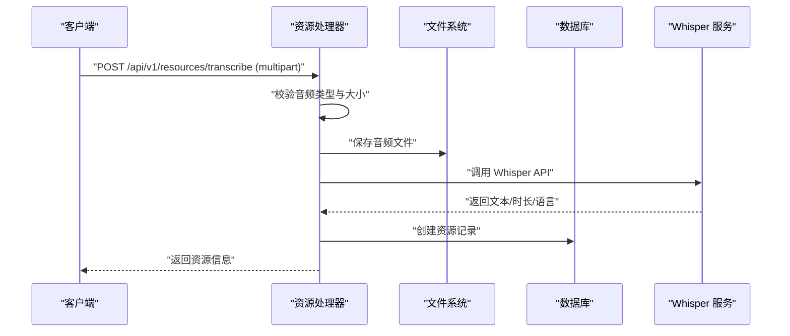
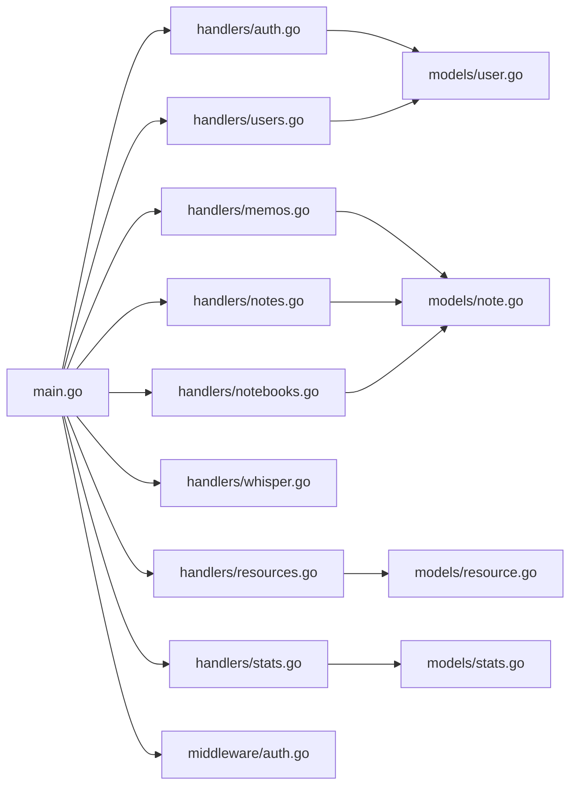

# API 接口设计

<cite>
**本文引用的文件**
- [backend/main.go](file://backend/main.go)
- [backend/handlers/auth.go](file://backend/handlers/auth.go)
- [backend/handlers/users.go](file://backend/handlers/users.go)
- [backend/handlers/memos.go](file://backend/handlers/memos.go)
- [backend/handlers/notes.go](file://backend/handlers/notes.go)
- [backend/handlers/search.go](file://backend/handlers/search.go)
- [backend/handlers/resources.go](file://backend/handlers/resources.go)
- [backend/handlers/whisper.go](file://backend/handlers/whisper.go)
- [backend/handlers/notebooks.go](file://backend/handlers/notebooks.go)
- [backend/handlers/stats.go](file://backend/handlers/stats.go)
- [backend/middleware/auth.go](file://backend/middleware/auth.go)
- [backend/models/user.go](file://backend/models/user.go)
- [backend/models/note.go](file://backend/models/note.go)
- [backend/models/resource.go](file://backend/models/resource.go)
- [backend/models/stats.go](file://backend/models/stats.go)
</cite>

## 目录
1. [简介](#简介)
2. [项目结构](#项目结构)
3. [核心组件](#核心组件)
4. [架构总览](#架构总览)
5. [详细组件分析](#详细组件分析)
6. [依赖关系分析](#依赖关系分析)
7. [性能考虑](#性能考虑)
8. [故障排查指南](#故障排查指南)
9. [结论](#结论)
10. [附录](#附录)

## 简介
本文件为 Memo Studio 的 RESTful API 接口设计文档，覆盖认证与用户管理、笔记与备忘录管理、标签系统、文件与语音资源、统计分析、位置管理、股票分析、AI 洞察与总结、模型管理等模块。文档提供接口规范、请求/响应示例、错误码说明、认证方式、参数校验规则，并给出 API 版本兼容性与迁移指南。

## 项目结构
后端采用 Go + Gin 框架，路由在主入口集中注册，按版本分组（/api/v1），并保留旧版兼容路由（/api）。认证中间件负责提取 JWT 并注入用户上下文，管理员中间件用于权限控制。

图表来源
- [backend/main.go](file://backend/main.go#L94-L196)

章节来源
- [backend/main.go](file://backend/main.go#L28-L352)

## 核心组件
- 认证与授权
  - 登录/注册：接收用户名、密码，返回 JWT 令牌与用户信息。
  - 用户信息：获取当前用户信息，更新个人信息，修改密码。
  - 管理员：用户增删改查。
- 笔记与备忘录
  - 备忘录：分页、筛选、创建、更新、删除。
  - 笔记：富文本/Markdown，标签、笔记本、资源关联，批量删除。
- 标签系统
  - 标签 CRUD、合并。
- 文件与语音
  - 资源上传（multipart）、列表、删除；语音转文本（Whisper）。
- 统计分析
  - 使用统计（数量、7 天新增/更新）。
- 位置与股票
  - 位置标注、批量检测、统计；股票检索、热门、历史、分析。
- AI 与模型
  - 洞察、总结、批量子句；模型列表、健康检查、连接测试。

章节来源
- [backend/handlers/auth.go](file://backend/handlers/auth.go#L27-L110)
- [backend/handlers/users.go](file://backend/handlers/users.go#L37-L171)
- [backend/handlers/memos.go](file://backend/handlers/memos.go#L78-L278)
- [backend/handlers/notes.go](file://backend/handlers/notes.go#L131-L512)
- [backend/handlers/notes.go](file://backend/handlers/notes.go#L355-L512)
- [backend/handlers/resources.go](file://backend/handlers/resources.go#L91-L224)
- [backend/handlers/whisper.go](file://backend/handlers/whisper.go#L31-L162)
- [backend/handlers/stats.go](file://backend/handlers/stats.go#L11-L23)
- [backend/middleware/auth.go](file://backend/middleware/auth.go#L12-L70)

## 架构总览
认证流程基于 Bearer Token，JWT 由服务端签发，包含用户标识与管理员标记。中间件解析令牌，注入 userID、username、isAdmin 到上下文，后续处理器直接读取。

图表来源
- [backend/middleware/auth.go](file://backend/middleware/auth.go#L12-L70)
- [backend/models/user.go](file://backend/models/user.go#L63-L110)

章节来源
- [backend/middleware/auth.go](file://backend/middleware/auth.go#L12-L70)
- [backend/models/user.go](file://backend/models/user.go#L63-L110)

## 详细组件分析

### 认证与用户管理

- 认证接口
  - POST /api/v1/auth/login
    - 请求体：用户名、密码
    - 成功：返回 token 与用户对象
    - 失败：401（用户名或密码错误）
  - POST /api/v1/auth/register
    - 请求体：用户名、密码、邮箱（可选）
    - 校验：用户名≥3，密码≥6
    - 成功：201，返回 token 与用户对象
    - 失败：400（用户名已存在/参数错误）
  - GET /api/v1/auth/me 或 /api/v1/users/me
    - 返回当前用户信息
    - 未认证：401
  - PUT /api/v1/users/me
    - 更新用户名、邮箱（用户名唯一）
    - 失败：400/500
  - PUT /api/v1/users/me/password
    - 请求体：旧密码、新密码（≥6）
    - 失败：400（旧密码不正确）

- 管理员接口（需管理员权限）
  - GET /api/v1/users
  - POST /api/v1/users
  - PUT /api/v1/users/:id
  - DELETE /api/v1/users/:id

章节来源
- [backend/handlers/auth.go](file://backend/handlers/auth.go#L27-L110)
- [backend/handlers/users.go](file://backend/handlers/users.go#L37-L171)
- [backend/middleware/auth.go](file://backend/middleware/auth.go#L54-L70)
- [backend/models/user.go](file://backend/models/user.go#L22-L149)

### 笔记与备忘录管理

- 备忘录（Memos）
  - GET /api/v1/memos
    - 查询参数：limit、offset、q、tags、from、to、pinned、content_type
    - content_type 仅支持 markdown
    - 未认证：401
  - POST /api/v1/memos
    - 请求体：title、content、tags、pinned、content_type、resource_ids
    - 标题与内容不能同时为空
  - PUT /api/v1/memos/:id
    - 标签与资源会重建关联
  - DELETE /api/v1/memos/:id

- 笔记（Notes）
  - GET /api/v1/notes
  - GET /api/v1/notes/:id
  - POST /api/v1/notes
  - PUT /api/v1/notes/:id
  - DELETE /api/v1/notes/:id
  - DELETE /api/v1/notes/batch
    - 请求体：ids（必填）
  - GET /api/v1/search
    - 兼容旧接口，现统一走 /api/v1/memos?q=...

- 权限与校验
  - 仅笔记作者或历史公开数据可访问
  - 旧数据 user_id 为空时允许操作

图表来源
- [backend/handlers/memos.go](file://backend/handlers/memos.go#L78-L137)

章节来源
- [backend/handlers/memos.go](file://backend/handlers/memos.go#L78-L278)
- [backend/handlers/notes.go](file://backend/handlers/notes.go#L131-L512)
- [backend/handlers/search.go](file://backend/handlers/search.go#L13-L43)

### 标签系统

- 接口
  - GET /api/v1/tags
    - withCount=1 时返回带计数的标签列表
  - POST /api/v1/tags
  - PUT /api/v1/tags/:id
  - DELETE /api/v1/tags/:id
  - POST /api/v1/tags/merge
    - 请求体：sourceId、targetId

- 数据模型
  - 标签实体包含名称、颜色、创建时间；支持按用户隔离与合并。

章节来源
- [backend/handlers/notes.go](file://backend/handlers/notes.go#L355-L512)
- [backend/models/note.go](file://backend/models/note.go#L29-L44)
- [backend/models/note.go](file://backend/models/note.go#L594-L729)

### 文件与语音资源

- 资源上传
  - POST /api/v1/resources
    - multipart/form-data，字段 file
    - 单文件大小上限 20MB
    - 返回资源对象（含 URL）
  - GET /api/v1/resources?limit=&offset=
  - DELETE /api/v1/resources/:id

- 语音转文本
  - POST /api/v1/resources/transcribe
    - 上传音频并调用 Whisper API，返回转录文本、时长、语言
  - POST /api/v1/speech-to-text
    - 仅转录，不保存文件
    - 未配置 API Key 时返回提示

- 存储策略
  - 以用户维度分目录（public/u{id}/年/月/日/文件）
  - 生成随机文件名与 SHA256 校验值

图表来源
- [backend/handlers/resources.go](file://backend/handlers/resources.go#L91-L155)
- [backend/handlers/whisper.go](file://backend/handlers/whisper.go#L31-L162)

章节来源
- [backend/handlers/resources.go](file://backend/handlers/resources.go#L91-L224)
- [backend/handlers/whisper.go](file://backend/handlers/whisper.go#L31-L330)
- [backend/models/resource.go](file://backend/models/resource.go#L36-L186)

### 统计分析

- GET /api/v1/stats
  - 返回当前用户的统计：笔记总数、标签数、资源数、笔记本数、置顶数、近7天新增/更新数

章节来源
- [backend/handlers/stats.go](file://backend/handlers/stats.go#L11-L23)
- [backend/models/stats.go](file://backend/models/stats.go#L18-L65)

### 位置管理

- 接口
  - PUT /api/v1/memos/:id/location
  - POST /api/v1/memos/:id/detect-location
  - POST /api/v1/memos/:id/detect-and-save
  - GET /api/v1/notes/by-location
  - GET /api/v1/locations/stats
  - POST /api/v1/locations/batch-detect

- 数据模型
  - 笔记支持 location、latitude、longitude 字段

章节来源
- [backend/models/note.go](file://backend/models/note.go#L11-L27)
- [backend/models/note.go](file://backend/models/note.go#L751-L799)

### 股票分析

- 接口
  - GET /api/v1/stocks/search
  - GET /api/v1/stocks/hot
  - GET /api/v1/stocks/:code
  - GET /api/v1/stocks/:code/history
  - POST /api/v1/stocks/analyze

章节来源
- [backend/handlers/stocks.go](file://backend/handlers/stocks.go)

### AI 洞察与总结

- 接口
  - POST /api/v1/insights
  - POST /api/v1/insights/:type
  - POST /api/v1/insights/compare
  - POST /api/v1/summarize
  - POST /api/v1/summarize/batch

章节来源
- [backend/handlers/insights.go](file://backend/handlers/insights.go)
- [backend/handlers/review.go](file://backend/handlers/review.go)

### 模型管理

- 接口
  - GET /api/v1/models
  - GET /api/v1/models/cloud
  - GET /api/v1/models/local
  - GET /api/v1/models/available
  - GET /api/v1/models/config
  - POST /api/v1/models/active
  - POST /api/v1/models/local
  - POST /api/v1/models/local/health
  - POST /api/v1/models/test

章节来源
- [backend/handlers/models.go](file://backend/handlers/models.go)

### 笔记本管理

- 接口
  - GET /api/v1/notebooks
  - GET /api/v1/notebooks/:id
  - POST /api/v1/notebooks
  - PUT /api/v1/notebooks/:id
  - DELETE /api/v1/notebooks/:id
  - GET /api/v1/notebooks/:id/notes?limit=&offset=

章节来源
- [backend/handlers/notebooks.go](file://backend/handlers/notebooks.go#L12-L160)

### 导出与导入

- GET /api/v1/export
- POST /api/v1/import

章节来源
- [backend/handlers/export.go](file://backend/handlers/export.go)
- [backend/handlers/import_handler.go](file://backend/handlers/import_handler.go)

## 依赖关系分析

图表来源
- [backend/main.go](file://backend/main.go#L94-L196)
- [backend/handlers/auth.go](file://backend/handlers/auth.go#L27-L110)
- [backend/handlers/users.go](file://backend/handlers/users.go#L37-L171)
- [backend/handlers/memos.go](file://backend/handlers/memos.go#L78-L278)
- [backend/handlers/notes.go](file://backend/handlers/notes.go#L131-L512)
- [backend/handlers/resources.go](file://backend/handlers/resources.go#L91-L224)
- [backend/handlers/whisper.go](file://backend/handlers/whisper.go#L31-L330)
- [backend/handlers/notebooks.go](file://backend/handlers/notebooks.go#L12-L160)
- [backend/handlers/stats.go](file://backend/handlers/stats.go#L11-L23)
- [backend/middleware/auth.go](file://backend/middleware/auth.go#L12-L70)
- [backend/models/user.go](file://backend/models/user.go#L22-L233)
- [backend/models/note.go](file://backend/models/note.go#L46-L800)
- [backend/models/resource.go](file://backend/models/resource.go#L36-L187)
- [backend/models/stats.go](file://backend/models/stats.go#L18-L65)

章节来源
- [backend/main.go](file://backend/main.go#L94-L196)

## 性能考虑
- 速率限制：公开路由（登录/注册）启用速率限制中间件。
- CORS：可配置允许来源，默认开发放通，生产建议明确配置。
- 文件上传：限制最大 20MB，避免内存溢出。
- 全文搜索：使用 SQLite FTS5，注意索引与查询复杂度。
- N+1 查询：笔记列表加载标签与资源时可能产生多次查询，建议在高并发场景引入缓存或聚合查询。

[本节为通用指导，无需特定文件来源]

## 故障排查指南
- 认证失败
  - 未提供 Authorization 或格式错误：401
  - 令牌无效或过期：401
  - 未认证访问受保护接口：401
- 参数错误
  - JSON 绑定失败：400
  - 时间参数格式错误：400
  - 标签/笔记 ID 无效：400
- 权限不足
  - 非管理员访问管理员接口：403
  - 非本人笔记：404（语义上视为“笔记不存在”）
- 业务异常
  - 用户名已存在：400
  - 旧密码不正确：400
  - 资源不存在或无权删除：404
  - 未配置 Whisper API Key：返回提示而非 500

章节来源
- [backend/middleware/auth.go](file://backend/middleware/auth.go#L12-L70)
- [backend/handlers/memos.go](file://backend/handlers/memos.go#L34-L110)
- [backend/handlers/notes.go](file://backend/handlers/notes.go#L113-L129)
- [backend/handlers/resources.go](file://backend/handlers/resources.go#L174-L195)
- [backend/handlers/whisper.go](file://backend/handlers/whisper.go#L133-L161)

## 结论
本 API 设计围绕用户、笔记、标签、资源与统计展开，提供完善的 CRUD、搜索、批量操作与扩展能力（位置、股票、AI 洞察、模型管理）。通过 JWT 认证与中间件权限控制，确保接口安全与数据隔离。建议在生产环境配置 CORS 与 JWT Secret，并对高频接口进行缓存与限流优化。

[本节为总结，无需特定文件来源]

## 附录

### 认证方式与头部
- Authorization: Bearer <token>
- 管理员权限：需要 is_admin=true

章节来源
- [backend/middleware/auth.go](file://backend/middleware/auth.go#L12-L70)

### API 版本与迁移
- 新版本：/api/v1
- 旧版本：/api（已废弃，保留兼容）
- 迁移建议
  - 将前端与客户端请求路径从 /api 替换为 /api/v1
  - 保持 /api/v1 的现有行为不变，逐步淘汰 /api

章节来源
- [backend/main.go](file://backend/main.go#L198-L283)

### 错误码一览
- 400：请求参数错误、格式错误、业务异常
- 401：未认证、令牌无效
- 403：无权限（非管理员）
- 404：资源不存在（或笔记不存在）
- 500：服务器内部错误

章节来源
- [backend/handlers/auth.go](file://backend/handlers/auth.go#L27-L110)
- [backend/handlers/users.go](file://backend/handlers/users.go#L37-L171)
- [backend/handlers/memos.go](file://backend/handlers/memos.go#L78-L278)
- [backend/handlers/notes.go](file://backend/handlers/notes.go#L131-L512)
- [backend/handlers/resources.go](file://backend/handlers/resources.go#L91-L224)
- [backend/handlers/whisper.go](file://backend/handlers/whisper.go#L31-L330)