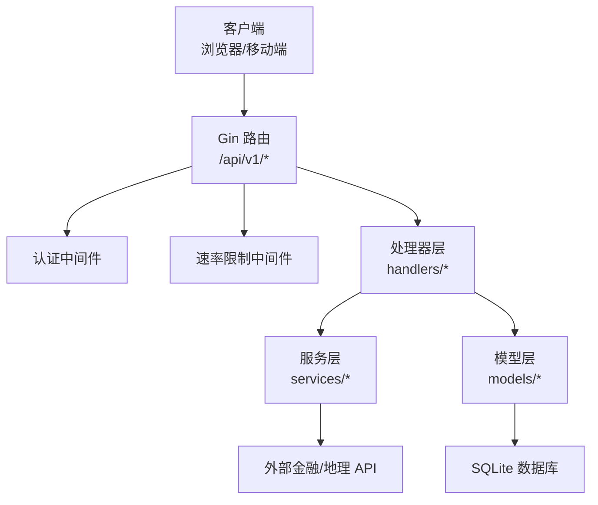
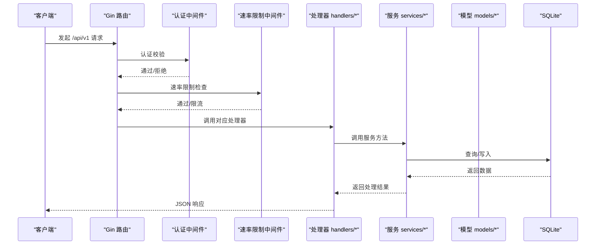
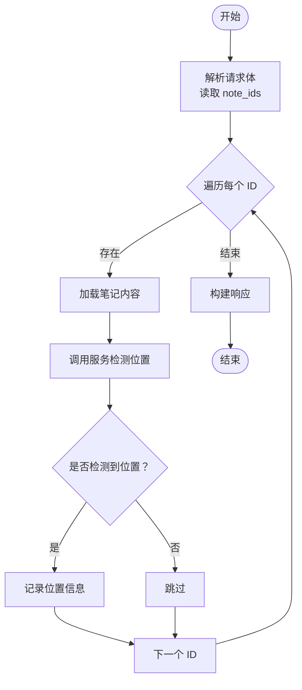
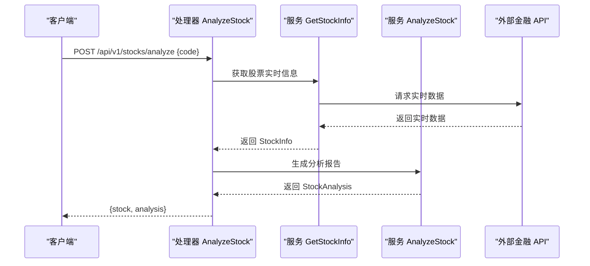
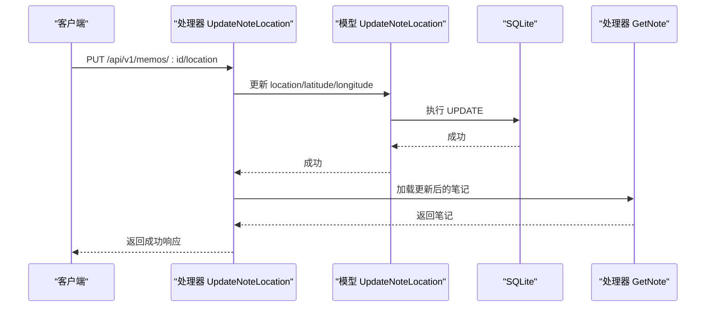
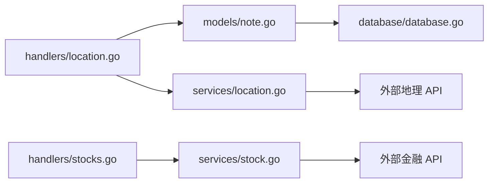

# 位置与股票服务接口

<cite>
**本文档引用的文件**
- [backend/main.go](file://backend/main.go)
- [backend/handlers/location.go](file://backend/handlers/location.go)
- [backend/handlers/stocks.go](file://backend/handlers/stocks.go)
- [backend/services/location.go](file://backend/services/location.go)
- [backend/services/stock.go](file://backend/services/stock.go)
- [backend/models/note.go](file://backend/models/note.go)
- [backend/models/stats.go](file://backend/models/stats.go)
- [backend/middleware/ratelimit.go](file://backend/middleware/ratelimit.go)
- [backend/database/database.go](file://backend/database/database.go)
</cite>

## 目录
1. [简介](#简介)
2. [项目结构](#项目结构)
3. [核心组件](#核心组件)
4. [架构总览](#架构总览)
5. [详细组件分析](#详细组件分析)
6. [依赖关系分析](#依赖关系分析)
7. [性能考虑](#性能考虑)
8. [故障排除指南](#故障排除指南)
9. [结论](#结论)

## 简介
本文件为 Memo Studio 的位置与股票服务接口的完整 API 文档，覆盖以下主题：
- 位置服务接口：GPS 坐标获取、地理编码、反向地理编码、位置历史查询、批量位置检测
- 股票分析接口：实时股价查询、历史数据获取、技术指标与投资建议生成、风险评估、市场趋势分析
- 位置统计接口：位置使用频率、常用地点分析、地理分布统计
- 数据同步与一致性：位置数据更新、股票数据缓存、离线处理策略
- 请求参数、API 限制、错误处理、性能优化建议
- 位置隐私保护与金融数据安全最佳实践

## 项目结构
后端采用 Go + Gin 框架，API 路由集中在主入口文件中，按功能拆分至 handlers、services、models 层，数据库通过 SQLite 管理。

图表来源
- [backend/main.go](file://backend/main.go#L95-L196)
- [backend/middleware/ratelimit.go](file://backend/middleware/ratelimit.go#L97-L121)

章节来源
- [backend/main.go](file://backend/main.go#L95-L196)

## 核心组件
- 位置服务处理器：负责位置更新、位置检测、批量检测、按位置筛选、统计查询
- 股票服务处理器：负责股票信息查询、搜索、热门股票、历史数据、分析
- 服务层：封装外部 API 调用、解析与业务逻辑
- 模型层：数据库访问、位置统计、笔记查询
- 中间件：认证、速率限制
- 数据库：SQLite，支持全文检索与多用户隔离

章节来源
- [backend/handlers/location.go](file://backend/handlers/location.go#L13-L204)
- [backend/handlers/stocks.go](file://backend/handlers/stocks.go#L12-L138)
- [backend/services/location.go](file://backend/services/location.go#L1-L233)
- [backend/services/stock.go](file://backend/services/stock.go#L1-L529)
- [backend/models/note.go](file://backend/models/note.go#L818-L845)
- [backend/middleware/ratelimit.go](file://backend/middleware/ratelimit.go#L1-L143)
- [backend/database/database.go](file://backend/database/database.go#L21-L60)

## 架构总览
下图展示位置与股票服务在系统中的交互关系：

图表来源
- [backend/main.go](file://backend/main.go#L95-L196)
- [backend/middleware/ratelimit.go](file://backend/middleware/ratelimit.go#L97-L121)

## 详细组件分析

### 位置服务接口

#### 接口定义与参数
- 更新笔记位置
  - 方法与路径：PUT /api/v1/memos/:id/location
  - 路径参数：id（笔记 ID）
  - 请求体 JSON 字段：
    - location：地点名称
    - latitude：纬度
    - longitude：经度
  - 响应：返回更新后的笔记对象及位置信息
  - 错误：无效 ID、请求格式错误、内部错误

- 检测笔记中的位置（仅返回 AI 识别结果，不保存）
  - 方法与路径：POST /api/v1/memos/:id/detect-location
  - 路径参数：id（笔记 ID）
  - 响应：detected（是否识别到）、location、latitude、longitude、suggest（建议保存）

- 检测并保存位置
  - 方法与路径：POST /api/v1/memos/:id/detect-and-save
  - 路径参数：id（笔记 ID）
  - 响应：success、message、location、latitude、longitude

- 按位置筛选笔记
  - 方法与路径：GET /api/v1/notes/by-location
  - 查询参数：location（地点名称）
  - 响应：location、count、notes

- 批量检测位置
  - 方法与路径：POST /api/v1/locations/batch-detect
  - 请求体 JSON 字段：note_ids（笔记 ID 数组）
  - 响应：total、detected、locations（映射：笔记ID->位置信息）

- 获取位置统计
  - 方法与路径：GET /api/v1/locations/stats
  - 响应：locations（数组，包含 location、count）

章节来源
- [backend/handlers/location.go](file://backend/handlers/location.go#L13-L204)
- [backend/models/note.go](file://backend/models/note.go#L818-L845)

#### 位置服务处理流程（批量检测）

图表来源
- [backend/handlers/location.go](file://backend/handlers/location.go#L169-L203)
- [backend/services/location.go](file://backend/services/location.go#L204-L232)

#### 地理编码与坐标获取
- 服务层提供坐标查询函数，当前为模拟数据（城市坐标字典）。实际部署中可接入高德/百度/谷歌等地理编码 API。
- 坐标缺失时返回经纬度为 0 的占位信息，便于前端展示但不参与精确计算。

章节来源
- [backend/services/location.go](file://backend/services/location.go#L164-L221)

#### 位置统计与查询
- 统计接口基于 SQL 聚合查询，按 location 分组统计数量，降序排列。
- 按位置筛选接口直接查询 notes 表 location 字段。

章节来源
- [backend/models/note.go](file://backend/models/note.go#L818-L845)
- [backend/handlers/location.go](file://backend/handlers/location.go#L133-L167)

### 股票分析接口

#### 接口定义与参数
- 获取股票信息
  - 方法与路径：GET /api/v1/stocks/:code
  - 路径参数：code（股票代码）
  - 响应：stock（股票信息对象）

- 搜索股票
  - 方法与路径：GET /api/v1/stocks/search?q=关键词
  - 查询参数：q（关键词）
  - 响应：results（股票列表）

- 获取热门股票
  - 方法与路径：GET /api/v1/stocks/hot
  - 响应：stocks（热门股票列表）

- 获取股票历史数据
  - 方法与路径：GET /api/v1/stocks/:code/history?days=N
  - 路径参数：code（股票代码）
  - 查询参数：days（天数，默认 30）
  - 响应：code、days、history（历史 K 线数据）

- 分析股票
  - 方法与路径：POST /api/v1/stocks/analyze
  - 请求体 JSON 字段：code（股票代码）
  - 响应：stock、analysis（分析结果）

章节来源
- [backend/handlers/stocks.go](file://backend/handlers/stocks.go#L12-L138)

#### 股票服务处理流程（分析）

图表来源
- [backend/handlers/stocks.go](file://backend/handlers/stocks.go#L90-L130)
- [backend/services/stock.go](file://backend/services/stock.go#L82-L118)
- [backend/services/stock.go](file://backend/services/stock.go#L414-L500)

#### 股票数据模型
- 股票信息（StockInfo）：包含代码、名称、市场、价格、涨跌、成交量、市盈率、市值等字段
- 历史数据（StockHistory）：包含日期、开盘、收盘、最高、最低、成交量
- 分析结果（StockAnalysis）：摘要、信号、建议、风险提示、投资小贴士

章节来源
- [backend/services/stock.go](file://backend/services/stock.go#L13-L80)
- [backend/services/stock.go](file://backend/services/stock.go#L388-L412)

#### 股票搜索与热门榜
- 搜索接口调用第三方搜索 API，失败时回退到热门股票列表
- 热门股票列表为预设的常用股票集合

章节来源
- [backend/handlers/stocks.go](file://backend/handlers/stocks.go#L32-L59)
- [backend/services/stock.go](file://backend/services/stock.go#L514-L528)

### 位置统计接口

#### 接口定义与参数
- 获取位置统计
  - 方法与路径：GET /api/v1/locations/stats
  - 响应：locations（数组，元素包含 location、count）

#### 实现细节
- 统计查询按 location 分组计数，过滤空值，按数量降序排序
- 返回结构体数组，便于前端直接渲染

章节来源
- [backend/models/note.go](file://backend/models/note.go#L818-L845)
- [backend/handlers/location.go](file://backend/handlers/location.go#L155-L167)

### 数据同步与一致性

#### 位置数据更新流程

图表来源
- [backend/handlers/location.go](file://backend/handlers/location.go#L13-L52)
- [backend/models/note.go](file://backend/models/note.go#L751-L758)

#### 股票数据缓存与离线处理
- 实时数据通过外部 API 获取，解析新浪/东方财富等接口
- 解析失败时提供模拟数据与本地分析，保障用户体验
- 历史数据按天数参数返回，便于前端绘制图表

章节来源
- [backend/services/stock.go](file://backend/services/stock.go#L82-L118)
- [backend/services/stock.go](file://backend/services/stock.go#L336-L386)
- [backend/services/stock.go](file://backend/services/stock.go#L414-L500)

## 依赖关系分析

图表来源
- [backend/handlers/location.go](file://backend/handlers/location.go#L1-L204)
- [backend/handlers/stocks.go](file://backend/handlers/stocks.go#L1-L138)
- [backend/models/note.go](file://backend/models/note.go#L1-L845)
- [backend/services/location.go](file://backend/services/location.go#L1-L233)
- [backend/services/stock.go](file://backend/services/stock.go#L1-L529)
- [backend/database/database.go](file://backend/database/database.go#L21-L60)

## 性能考虑
- 速率限制：全局每分钟 50 次，登录/注册等公开接口使用独立中间件；可通过环境变量调整
- 数据库：启用外键约束、WAL 模式、busy_timeout，提升并发与稳定性
- 股票历史数据：按天数参数限制返回长度，避免超大数据包
- 位置统计：按 location 分组聚合，建议在 location 字段建立索引（当前 schema 已包含相关索引）

章节来源
- [backend/middleware/ratelimit.go](file://backend/middleware/ratelimit.go#L88-L94)
- [backend/database/database.go](file://backend/database/database.go#L45-L52)
- [backend/handlers/stocks.go](file://backend/handlers/stocks.go#L61-L88)

## 故障排除指南
- 常见错误码
  - 400：请求参数缺失或格式错误（如无效笔记 ID、缺少 location/code）
  - 401：未认证或令牌无效
  - 403：权限不足（管理员接口）
  - 429：请求过于频繁（触发速率限制）
  - 500：服务器内部错误（数据库异常、外部 API 超时等）
- 位置相关
  - 未检测到位置：返回 detected=false，提示未检测到地点
  - 保存位置失败：检查笔记是否存在、数据库连接状态
- 股票相关
  - 实时数据获取失败：返回模拟数据与错误提示，前端可降级展示
  - 搜索失败：回退到热门股票列表
- 诊断步骤
  - 检查速率限制头：X-RateLimit-Limit、X-RateLimit-Remaining
  - 查看服务器日志与健康检查端点 /health
  - 确认外部 API 可达性与超时设置

章节来源
- [backend/handlers/location.go](file://backend/handlers/location.go#L15-L52)
- [backend/handlers/stocks.go](file://backend/handlers/stocks.go#L12-L30)
- [backend/middleware/ratelimit.go](file://backend/middleware/ratelimit.go#L100-L121)

## 结论
Memo Studio 的位置与股票服务接口提供了从数据采集、处理到展示的完整链路。位置服务侧重于自然语言识别与统计分析，股票服务强调实时数据与本地分析结合。通过中间件与数据库层面的安全与性能优化，系统在易用性与可靠性之间取得平衡。建议在生产环境中：
- 配置 CORS 与 JWT 密钥，启用严格的速率限制
- 集成权威地理与金融数据源，完善坐标与财务数据
- 增加位置隐私控制与金融数据脱敏策略
- 持续监控外部 API 健康状况与响应延迟