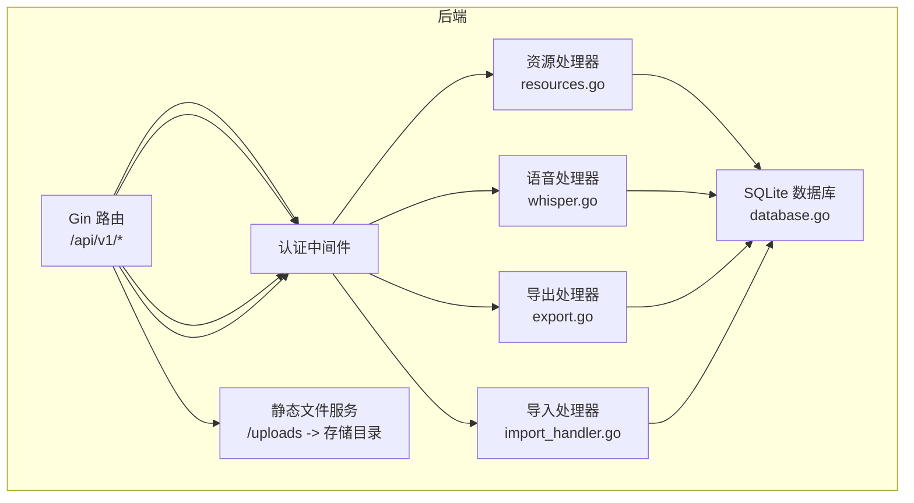
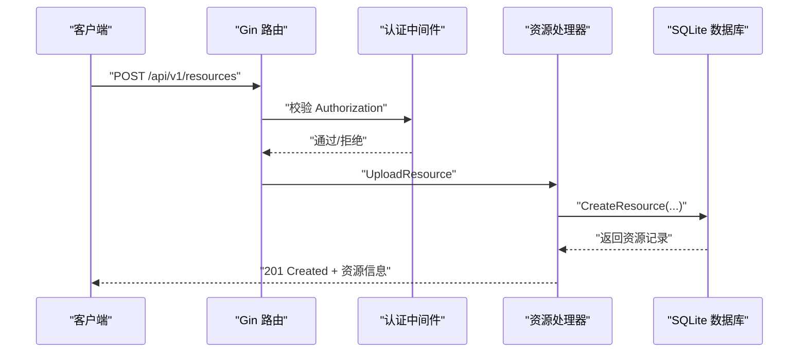
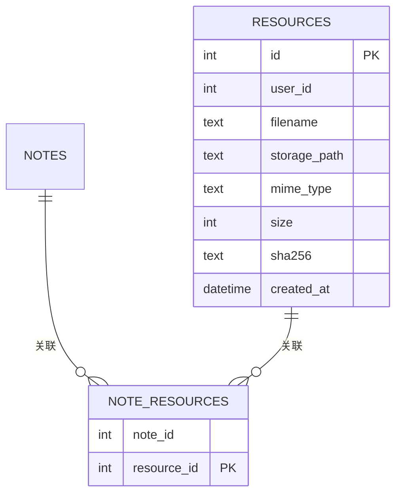
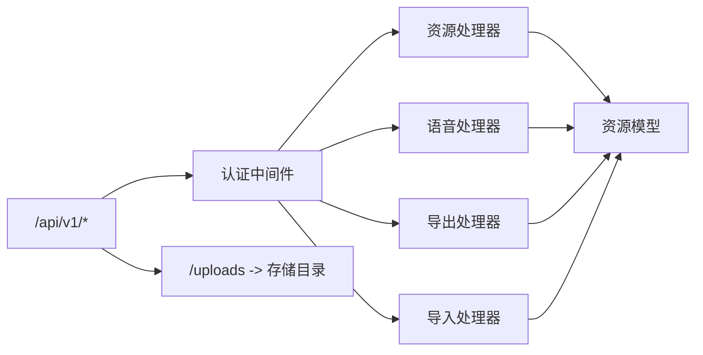

# 文件资源管理接口

<cite>
**本文引用的文件**
- [backend/main.go](file://backend/main.go)
- [backend/handlers/resources.go](file://backend/handlers/resources.go)
- [backend/handlers/whisper.go](file://backend/handlers/whisper.go)
- [backend/handlers/export.go](file://backend/handlers/export.go)
- [backend/handlers/import_handler.go](file://backend/handlers/import_handler.go)
- [backend/models/resource.go](file://backend/models/resource.go)
- [backend/database/database.go](file://backend/database/database.go)
- [backend/middleware/auth.go](file://backend/middleware/auth.go)
- [frontend/src/utils/api.js](file://frontend/src/utils/api.js)
- [kit/src/lib/api.js](file://kit/src/lib/api.js)
- [backend/handlers/api_test.go](file://backend/handlers/api_test.go)
</cite>

## 目录
1. [简介](#简介)
2. [项目结构](#项目结构)
3. [核心组件](#核心组件)
4. [架构总览](#架构总览)
5. [详细组件分析](#详细组件分析)
6. [依赖关系分析](#依赖关系分析)
7. [性能考虑](#性能考虑)
8. [故障排查指南](#故障排查指南)
9. [结论](#结论)
10. [附录](#附录)

## 简介
本文件面向 Memo Studio 的文件资源管理接口，提供系统化、可操作的技术文档。内容覆盖：
- 文件上传接口：多文件上传、文件类型与大小限制、存储路径生成策略
- 语音转文字接口：音频文件处理、ASR 服务调用、转录结果获取
- 资源下载接口：文件访问与下载、权限控制
- 导入导出接口：数据格式转换、批量导入、备份与恢复
- 安全与性能：文件安全、性能优化与存储成本控制最佳实践

## 项目结构
后端采用 Gin 框架，API v1 路由组下集中暴露资源管理相关端点；静态资源通过 /uploads 暴露至存储目录；数据库通过 SQLite 迁移脚本创建 resources 表及关联表。

图表来源
- [backend/main.go](file://backend/main.go#L87-L93)
- [backend/handlers/resources.go](file://backend/handlers/resources.go#L91-L155)
- [backend/handlers/whisper.go](file://backend/handlers/whisper.go#L31-L104)
- [backend/handlers/export.go](file://backend/handlers/export.go#L15-L81)
- [backend/handlers/import_handler.go](file://backend/handlers/import_handler.go#L24-L84)
- [backend/database/database.go](file://backend/database/database.go#L408-L438)

章节来源
- [backend/main.go](file://backend/main.go#L87-L93)
- [backend/database/database.go](file://backend/database/database.go#L408-L438)

## 核心组件
- 资源上传与管理：负责文件上传、存储路径生成、资源记录入库、列表与删除
- 语音转文字：支持上传音频并调用外部 ASR 服务，返回转录文本、时长与语言
- 导入导出：支持 JSON/Markdown 导出与批量导入
- 权限与安全：基于 JWT 的认证中间件，限制未认证访问
- 存储与静态服务：/uploads 暴露存储目录，支持文件下载

章节来源
- [backend/handlers/resources.go](file://backend/handlers/resources.go#L91-L195)
- [backend/handlers/whisper.go](file://backend/handlers/whisper.go#L31-L162)
- [backend/handlers/export.go](file://backend/handlers/export.go#L15-L81)
- [backend/handlers/import_handler.go](file://backend/handlers/import_handler.go#L24-L84)
- [backend/middleware/auth.go](file://backend/middleware/auth.go#L12-L52)

## 架构总览
后端通过 Gin 路由注册资源管理相关端点，所有受保护端点需携带 Bearer Token；静态文件通过 /uploads 暴露到存储目录，便于浏览器直接下载。

图表来源
- [backend/main.go](file://backend/main.go#L134-L137)
- [backend/middleware/auth.go](file://backend/middleware/auth.go#L12-L52)
- [backend/handlers/resources.go](file://backend/handlers/resources.go#L91-L155)
- [backend/models/resource.go](file://backend/models/resource.go#L36-L56)

## 详细组件分析

### 文件上传接口
- 端点
  - POST /api/v1/resources
  - 支持多文件上传（multipart/form-data），字段名为 file
- 限制
  - 请求体大小上限：20 MB
  - 文件大小必须大于 0
- 存储策略
  - 存储根目录可通过环境变量 MEMO_STORAGE_DIR 指定，默认 ./storage
  - 路径组织：按用户隔离（公共/用户ID）+ 年/月/日 三级目录
  - 文件名：原始名称清洗 + 随机十六进制后缀 + 原扩展名
- 安全与完整性
  - 保存时计算 SHA256 并入库
  - 失败回滚：入库失败时删除已写入的物理文件
- 响应
  - 成功返回资源对象（包含 URL）

请求示例
- 方法与路径：POST /api/v1/resources
- 头部：Content-Type: multipart/form-data
- 表单字段：file（二进制文件）
- 认证：Authorization: Bearer <token>

响应示例
- 成功：201 Created，返回资源对象（包含 id、filename、storage_path、url、mime_type、size、sha256、created_at）

章节来源
- [backend/handlers/resources.go](file://backend/handlers/resources.go#L36-L43)
- [backend/handlers/resources.go](file://backend/handlers/resources.go#L91-L155)
- [backend/models/resource.go](file://backend/models/resource.go#L28-L34)
- [backend/models/resource.go](file://backend/models/resource.go#L36-L56)

### 语音转文字接口
- 端点
  - POST /api/v1/resources/transcribe：上传并转录（保存文件 + 调用 ASR）
  - POST /api/v1/speech-to-text：仅转录（不保存）
- 支持音频类型
  - mp3、wav、m4a、ogg、webm、flac、mp4（作为音频处理）
- 参数
  - language、prompt、temperature（可选）
- ASR 配置
  - 通过环境变量 OPENAI_API_KEY、OPENAI_BASE_URL、WHISPER_MODEL 控制
  - 默认 BaseURL 为 https://api.openai.com/v1，模型默认 whisper-1
- 响应
  - transcribe：返回资源信息 + 转录文本、时长、语言
  - speech-to-text：返回文本、时长、语言与配置状态

请求示例
- 上传并转录：POST /api/v1/resources/transcribe，multipart/form-data，字段 file，可选 language/prompt/temperature
- 仅转录：POST /api/v1/speech-to-text，multipart/form-data，字段 file，可选 language/prompt/temperature

响应示例
- 上传并转录：201 Created，包含 filename、storage_path、url、mime_type、size、transcript、duration、language、created_at
- 仅转录：200 OK，包含 text、duration、language、configured

章节来源
- [backend/handlers/whisper.go](file://backend/handlers/whisper.go#L31-L104)
- [backend/handlers/whisper.go](file://backend/handlers/whisper.go#L106-L162)
- [backend/handlers/whisper.go](file://backend/handlers/whisper.go#L166-L175)
- [backend/handlers/whisper.go](file://backend/handlers/whisper.go#L210-L216)

### 资源下载接口
- 端点
  - GET /api/v1/resources：分页列出当前用户资源
  - DELETE /api/v1/resources/:id：删除资源
  - GET /uploads/{相对存储路径}：静态下载（由 /uploads 映射）
- 权限控制
  - 列表与删除需认证；静态下载由 /uploads 暴露，不进行额外鉴权
- 下载统计
  - 当前实现未内置下载次数统计；如需统计可在静态服务层或代理层增加

请求示例
- 列表：GET /api/v1/resources?limit=20&offset=0
- 删除：DELETE /api/v1/resources/:id
- 下载：GET /uploads/{相对存储路径}

章节来源
- [backend/main.go](file://backend/main.go#L87-L93)
- [backend/main.go](file://backend/main.go#L134-L137)
- [backend/handlers/resources.go](file://backend/handlers/resources.go#L157-L195)
- [backend/models/resource.go](file://backend/models/resource.go#L117-L169)

### 导入导出接口
- 导出
  - GET /api/v1/export?format=json|markdown&limit=500
  - 支持 JSON 与 Markdown 两种格式
  - 限制：limit 最大 2000，默认 500
- 导入
  - POST /api/v1/import
  - 请求体：notes[]，每项包含 title、content、tags[]
  - 单次最多 500 条
  - 自动去空白、缺失标题时从内容截断生成

请求示例
- 导出：GET /api/v1/export?format=markdown&limit=500
- 导入：POST /api/v1/import，JSON 数组 notes

响应示例
- 导出：200 OK，JSON 或 Markdown 文件（含 Content-Disposition）
- 导入：200 OK，返回 created、failed、total

章节来源
- [backend/handlers/export.go](file://backend/handlers/export.go#L15-L81)
- [backend/handlers/import_handler.go](file://backend/handlers/import_handler.go#L24-L84)

### 数据模型与存储策略
- 资源模型
  - 字段：id、user_id、filename、storage_path、url、mime_type、size、sha256、created_at
  - URL 由 /uploads + storage_path 组成
- 数据库表
  - resources：资源元数据
  - note_resources：笔记与资源的多对多关联
- 存储目录
  - 通过 MEMO_STORAGE_DIR 指定；默认 ./storage
  - 结构：public 或 u{user_id}/{yyyy}/{MM}/{dd}/

图表来源
- [backend/database/database.go](file://backend/database/database.go#L408-L438)
- [backend/models/resource.go](file://backend/models/resource.go#L10-L20)
- [backend/models/resource.go](file://backend/models/resource.go#L78-L109)

章节来源
- [backend/models/resource.go](file://backend/models/resource.go#L10-L76)
- [backend/database/database.go](file://backend/database/database.go#L408-L438)

## 依赖关系分析
- 路由与中间件
  - /api/v1 下所有资源相关端点均受认证中间件保护
  - /uploads 静态服务映射到存储目录
- 处理器与模型
  - 资源处理器依赖资源模型进行数据库操作
  - 语音处理器依赖外部 ASR 服务（OpenAI Whisper）
- 前端集成
  - kit/src/lib/api.js 提供上传、导出、导入等方法
  - 前端通过 /api/v1 调用后端接口

图表来源
- [backend/main.go](file://backend/main.go#L134-L141)
- [backend/middleware/auth.go](file://backend/middleware/auth.go#L12-L52)
- [backend/handlers/resources.go](file://backend/handlers/resources.go#L91-L155)
- [backend/handlers/whisper.go](file://backend/handlers/whisper.go#L31-L104)
- [backend/handlers/export.go](file://backend/handlers/export.go#L15-L81)
- [backend/handlers/import_handler.go](file://backend/handlers/import_handler.go#L24-L84)

章节来源
- [backend/main.go](file://backend/main.go#L134-L141)
- [backend/middleware/auth.go](file://backend/middleware/auth.go#L12-L52)

## 性能考虑
- 上传与存储
  - 20 MB 上限限制，避免过大文件占用带宽与磁盘
  - 采用 io.Copy 并行写入与哈希计算，减少内存峰值
- 数据库查询
  - 资源列表分页限制（limit 最大 100），offset 最小 0
  - 导出 limit 最大 2000，避免一次性导出过多数据
- 静态服务
  - /uploads 直接映射存储目录，利用操作系统缓存与内核零拷贝能力
- ASR 调用
  - 语音转文字接口超时控制（60 秒），避免长时间阻塞
- 建议
  - 对于大文件，建议拆分上传或采用分片上传策略
  - 对外网暴露 /uploads 时建议配合 CDN 与防盗链策略

[本节为通用性能建议，不直接分析具体文件]

## 故障排查指南
- 上传失败
  - 检查文件大小是否超过 20 MB
  - 确认上传字段为 file，Content-Type 为 multipart/form-data
  - 查看存储目录权限与磁盘空间
- 语音转文字失败
  - 确认 OPENAI_API_KEY、OPENAI_BASE_URL、WHISPER_MODEL 环境变量配置
  - 检查网络连通性与 ASR 服务可用性
- 导入失败
  - 单次导入条数不超过 500
  - 确认请求体格式正确（notes[]）
- 下载异常
  - 确认 storage 目录映射正确（/uploads -> 存储目录）
  - 检查文件是否存在与权限

章节来源
- [backend/handlers/resources.go](file://backend/handlers/resources.go#L95-L101)
- [backend/handlers/whisper.go](file://backend/handlers/whisper.go#L133-L141)
- [backend/handlers/import_handler.go](file://backend/handlers/import_handler.go#L38-L41)
- [backend/main.go](file://backend/main.go#L87-L93)

## 结论
Memo Studio 的文件资源管理接口围绕“上传-存储-关联-下载-转录-导入导出”的完整链路构建，具备明确的权限控制、安全策略与可扩展的存储目录。通过合理的限制与静态服务映射，兼顾了易用性与性能。建议在生产环境中完善访问审计、下载统计与存储成本控制策略。

[本节为总结性内容，不直接分析具体文件]

## 附录

### 请求与响应示例（路径定位）
- 上传资源
  - 请求：POST /api/v1/resources
  - 响应：201 Created，返回资源对象
  - 参考：[backend/handlers/resources.go](file://backend/handlers/resources.go#L91-L155)
- 上传并转录
  - 请求：POST /api/v1/resources/transcribe
  - 响应：201 Created，包含转录结果
  - 参考：[backend/handlers/whisper.go](file://backend/handlers/whisper.go#L31-L104)
- 仅转录
  - 请求：POST /api/v1/speech-to-text
  - 响应：200 OK，包含转录结果
  - 参考：[backend/handlers/whisper.go](file://backend/handlers/whisper.go#L106-L162)
- 列表与删除资源
  - 请求：GET /api/v1/resources?limit=20&offset=0
  - 请求：DELETE /api/v1/resources/:id
  - 响应：200 OK 或 201 Created
  - 参考：[backend/handlers/resources.go](file://backend/handlers/resources.go#L157-L195)
- 导出
  - 请求：GET /api/v1/export?format=json|markdown&limit=500
  - 响应：200 OK，JSON 或 Markdown 文件
  - 参考：[backend/handlers/export.go](file://backend/handlers/export.go#L15-L81)
- 导入
  - 请求：POST /api/v1/import
  - 响应：200 OK，返回 created/failed/total
  - 参考：[backend/handlers/import_handler.go](file://backend/handlers/import_handler.go#L24-L84)

### 文件类型支持列表
- 上传接口：任意文件类型（受业务约束）
- 语音转文字：mp3、wav、m4a、ogg、webm、flac、mp4（作为音频处理）
- 参考：
  - [backend/handlers/whisper.go](file://backend/handlers/whisper.go#L166-L175)

### 存储策略说明
- 存储根目录：MEMO_STORAGE_DIR（默认 ./storage）
- 路径组织：public 或 u{user_id}/{yyyy}/{MM}/{dd}/
- 文件名：原始名称清洗 + 随机十六进制后缀 + 原扩展名
- URL 生成：/uploads + 相对存储路径
- 参考：
  - [backend/handlers/resources.go](file://backend/handlers/resources.go#L38-L43)
  - [backend/handlers/resources.go](file://backend/handlers/resources.go#L120-L137)
  - [backend/models/resource.go](file://backend/models/resource.go#L28-L34)

### 错误处理机制
- 认证失败：401 Unauthorized
- 权限不足：403 Forbidden
- 请求体过大：413 Payload Too Large（由 http.MaxBytesReader 限制）
- 参数错误：400 Bad Request
- 资源不存在或无权删除：404 Not Found
- 服务器内部错误：500 Internal Server Error
- 参考：
  - [backend/middleware/auth.go](file://backend/middleware/auth.go#L12-L52)
  - [backend/handlers/resources.go](file://backend/handlers/resources.go#L95-L101)
  - [backend/handlers/resources.go](file://backend/handlers/resources.go#L186-L194)
  - [backend/handlers/whisper.go](file://backend/handlers/whisper.go#L238-L252)

### 文件安全管理最佳实践
- 上传限制：20 MB；建议对图片/视频增加更严格限制
- 文件名清洗：仅允许安全字符，避免路径穿越
- 存储隔离：按用户 ID 分目录，避免跨用户访问
- 静态服务：对外暴露 /uploads 时建议添加防盗链与访问控制
- 参考：
  - [backend/handlers/resources.go](file://backend/handlers/resources.go#L36-L37)
  - [backend/handlers/resources.go](file://backend/handlers/resources.go#L197-L223)
  - [backend/main.go](file://backend/main.go#L87-L93)

### 性能优化与存储成本控制
- 上传：io.Copy 并行写入与哈希，降低内存占用
- 导出：限制最大条数与并发，避免一次性导出过多数据
- 静态服务：/uploads 直接映射，结合 CDN 缓存
- 建议：对大文件采用分片上传与断点续传
- 参考：
  - [backend/handlers/resources.go](file://backend/handlers/resources.go#L61-L78)
  - [backend/handlers/export.go](file://backend/handlers/export.go#L25-L31)
  - [backend/main.go](file://backend/main.go#L87-L93)