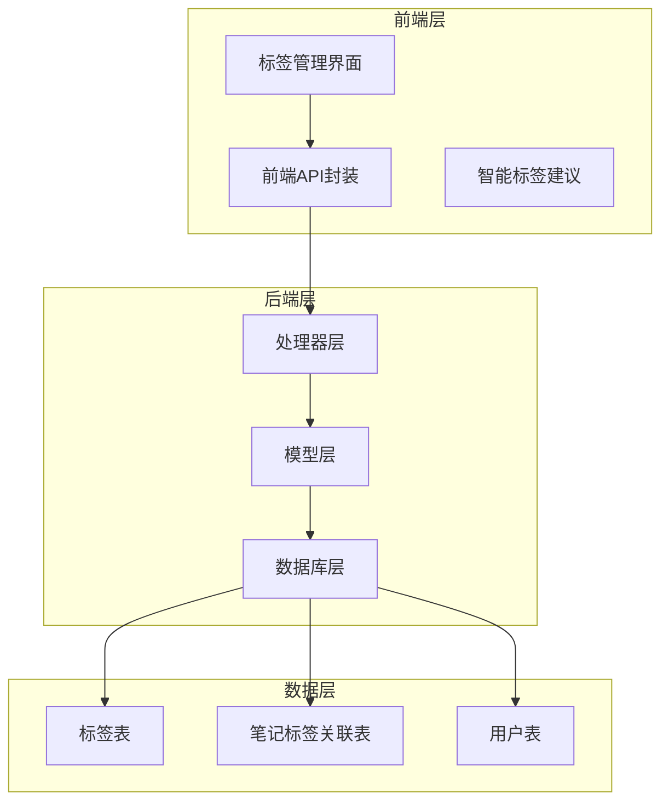
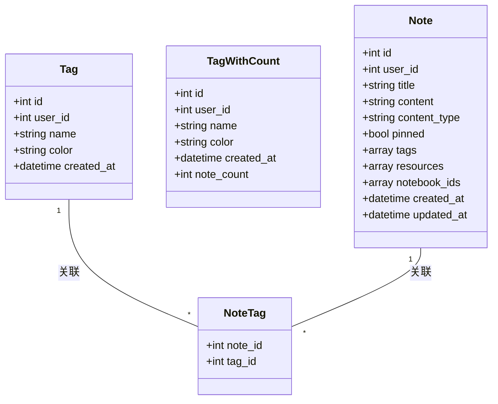
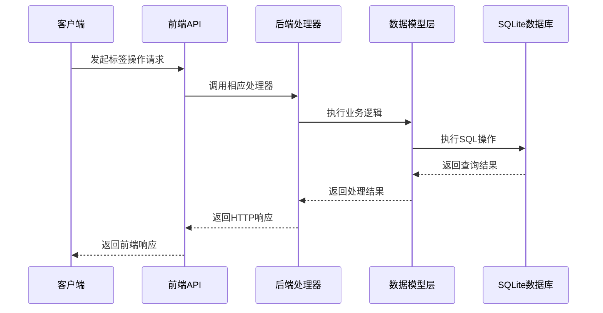
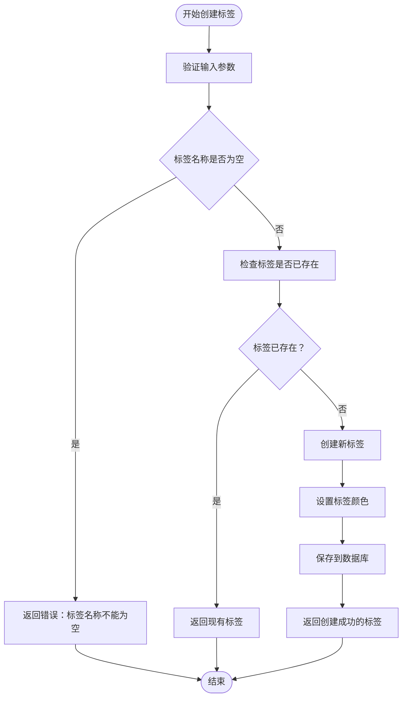
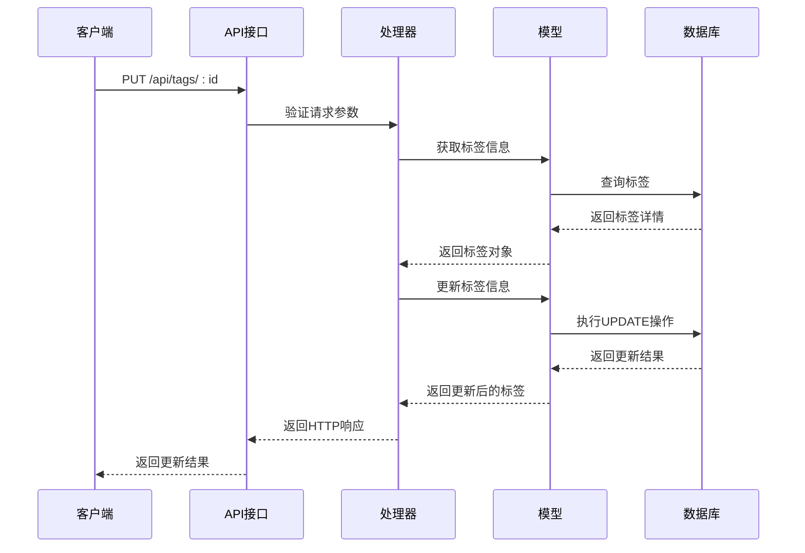
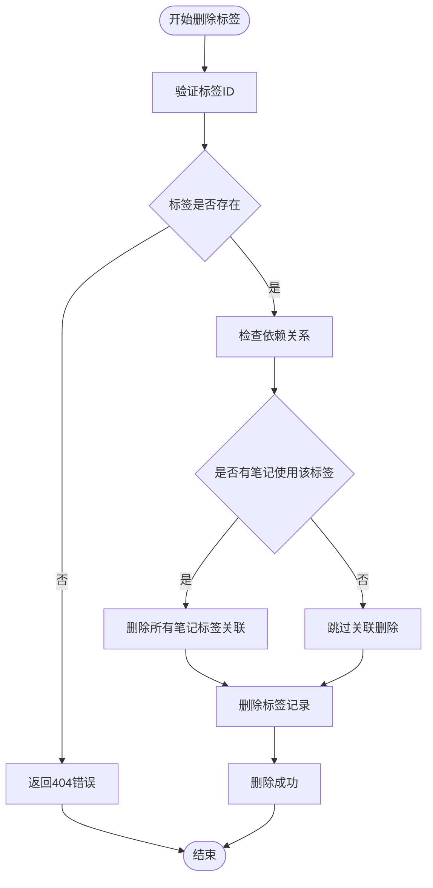
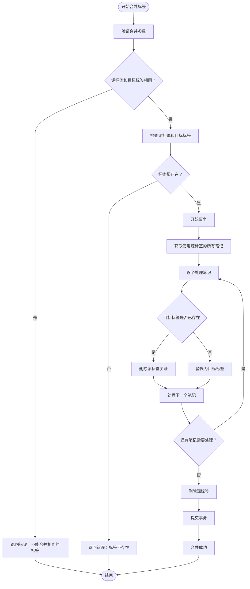
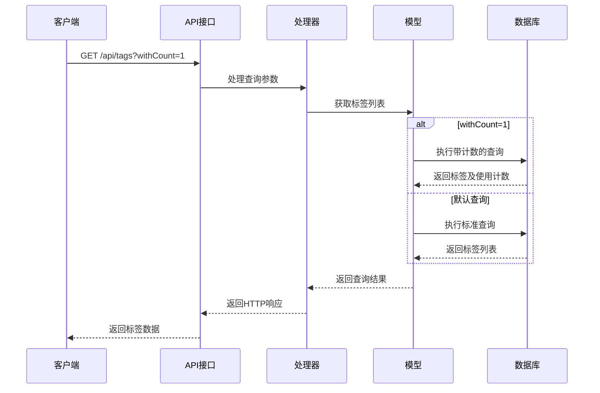
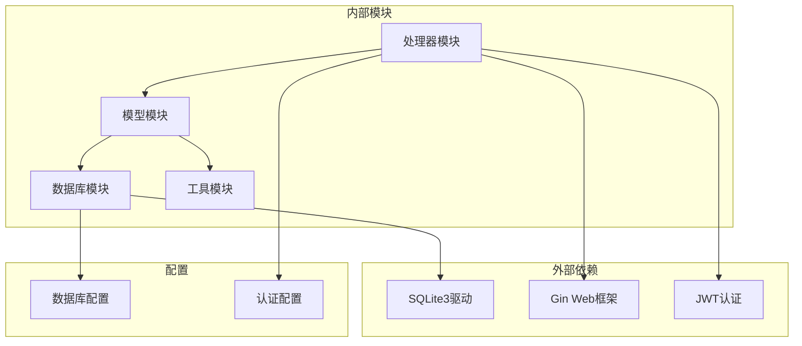

# 标签系统接口

<cite>
**本文档引用的文件**
- [backend/handlers/notes.go](file://backend/handlers/notes.go)
- [backend/models/note.go](file://backend/models/note.go)
- [backend/database/database.go](file://backend/database/database.go)
- [frontend/src/utils/api.js](file://frontend/src/utils/api.js)
- [frontend/src/components/TagManager.svelte](file://frontend/src/components/TagManager.svelte)
- [backend/handlers/api_test.go](file://backend/handlers/api_test.go)
</cite>

## 目录
1. [简介](#简介)
2. [项目结构](#项目结构)
3. [核心组件](#核心组件)
4. [架构概览](#架构概览)
5. [详细组件分析](#详细组件分析)
6. [依赖关系分析](#依赖关系分析)
7. [性能考虑](#性能考虑)
8. [故障排除指南](#故障排除指南)
9. [结论](#结论)

## 简介

Memo Studio 的标签系统是一个完整的标签管理解决方案，支持多用户隔离、标签创建、更新、删除、合并等功能。该系统采用前后端分离架构，后端使用 Go 语言开发，前端使用 Svelte 构建用户界面。

标签系统的核心特性包括：
- 多用户隔离的标签管理
- 标签颜色自动生成机制
- 标签合并和去重功能
- 标签使用统计和热门标签展示
- 完整的 CRUD 操作支持

## 项目结构



**图表来源**
- [frontend/src/utils/api.js](file://frontend/src/utils/api.js#L1-L316)
- [backend/handlers/notes.go](file://backend/handlers/notes.go#L1-L513)
- [backend/models/note.go](file://backend/models/note.go#L1-L846)

**章节来源**
- [frontend/src/utils/api.js](file://frontend/src/utils/api.js#L1-L316)
- [backend/handlers/notes.go](file://backend/handlers/notes.go#L1-L513)
- [backend/models/note.go](file://backend/models/note.go#L1-L846)

## 核心组件

### 数据模型

标签系统的核心数据模型包括三个主要实体：



**图表来源**
- [backend/models/note.go](file://backend/models/note.go#L29-L44)

### API 接口定义

标签系统提供以下主要 API 接口：

| 方法 | 路径 | 功能描述 |
|------|------|----------|
| GET | `/api/tags` | 获取标签列表 |
| POST | `/api/tags` | 创建新标签 |
| PUT | `/api/tags/:id` | 更新标签信息 |
| DELETE | `/api/tags/:id` | 删除标签 |
| POST | `/api/tags/merge` | 合并标签 |

**章节来源**
- [backend/handlers/notes.go](file://backend/handlers/notes.go#L355-L512)
- [frontend/src/utils/api.js](file://frontend/src/utils/api.js#L231-L298)

## 架构概览



**图表来源**
- [frontend/src/utils/api.js](file://frontend/src/utils/api.js#L242-L280)
- [backend/handlers/notes.go](file://backend/handlers/notes.go#L388-L422)

## 详细组件分析

### 标签创建接口

标签创建接口支持基本的标签创建和颜色设置功能：



**图表来源**
- [backend/handlers/notes.go](file://backend/handlers/notes.go#L388-L422)
- [backend/models/note.go](file://backend/models/note.go#L594-L629)

**章节来源**
- [backend/handlers/notes.go](file://backend/handlers/notes.go#L388-L422)
- [backend/models/note.go](file://backend/models/note.go#L594-L629)

### 标签更新接口

标签更新接口提供完整的标签信息修改功能：



**图表来源**
- [backend/handlers/notes.go](file://backend/handlers/notes.go#L424-L455)
- [backend/models/note.go](file://backend/models/note.go#L631-L655)

**章节来源**
- [backend/handlers/notes.go](file://backend/handlers/notes.go#L424-L455)
- [backend/models/note.go](file://backend/models/note.go#L631-L655)

### 标签删除接口

标签删除接口支持单个标签删除和依赖检查：



**图表来源**
- [backend/handlers/notes.go](file://backend/handlers/notes.go#L457-L478)
- [backend/models/note.go](file://backend/models/note.go#L657-L668)

**章节来源**
- [backend/handlers/notes.go](file://backend/handlers/notes.go#L457-L478)
- [backend/models/note.go](file://backend/models/note.go#L657-L668)

### 标签合并接口

标签合并接口提供智能的标签合并功能：



**图表来源**
- [backend/handlers/notes.go](file://backend/handlers/notes.go#L480-L512)
- [backend/models/note.go](file://backend/models/note.go#L670-L729)

**章节来源**
- [backend/handlers/notes.go](file://backend/handlers/notes.go#L480-L512)
- [backend/models/note.go](file://backend/models/note.go#L670-L729)

### 标签查询接口

标签查询接口支持多种查询模式：



**图表来源**
- [backend/handlers/notes.go](file://backend/handlers/notes.go#L355-L386)
- [backend/models/note.go](file://backend/models/note.go#L394-L424)

**章节来源**
- [backend/handlers/notes.go](file://backend/handlers/notes.go#L355-L386)
- [backend/models/note.go](file://backend/models/note.go#L394-L424)

## 依赖关系分析



**图表来源**
- [backend/database/database.go](file://backend/database/database.go#L1-L677)
- [backend/handlers/notes.go](file://backend/handlers/notes.go#L1-L513)

**章节来源**
- [backend/database/database.go](file://backend/database/database.go#L1-L677)
- [backend/handlers/notes.go](file://backend/handlers/notes.go#L1-L513)

## 性能考虑

### 数据库优化策略

1. **索引优化**
   - 标签表使用 `(user_id, name)` 唯一索引
   - 笔记标签关联表使用复合主键 `(note_id, tag_id)`

2. **查询优化**
   - 使用 `LEFT JOIN` 获取标签及其使用计数
   - 支持分页查询，限制返回数量

3. **事务处理**
   - 标签合并操作使用事务确保数据一致性
   - 批量操作使用预编译语句

### 前端性能优化

1. **缓存策略**
   - 标签列表缓存，减少重复请求
   - 错误状态处理，避免重复错误请求

2. **UI优化**
   - 按需加载标签数据
   - 合并操作的确认对话框，避免误操作

## 故障排除指南

### 常见错误及解决方案

| 错误类型 | 错误码 | 描述 | 解决方案 |
|----------|--------|------|----------|
| 认证失败 | 401 | 未登录或令牌过期 | 重新登录获取新令牌 |
| 参数错误 | 400 | 请求参数无效 | 检查请求格式和必填字段 |
| 资源不存在 | 404 | 标签或笔记不存在 | 确认ID有效性 |
| 服务器错误 | 500 | 服务器内部错误 | 检查服务器日志，重试操作 |

### 调试技巧

1. **API测试**
   ```bash
   # 测试标签创建
   curl -X POST /api/tags \
        -H "Authorization: Bearer YOUR_TOKEN" \
        -H "Content-Type: application/json" \
        -d '{"name":"测试标签","color":"#FF6B6B"}'
   ```

2. **数据库检查**
   ```sql
   -- 检查标签表结构
   PRAGMA table_info(tags);
   
   -- 查看标签使用情况
   SELECT t.name, COUNT(nt.note_id) as count 
   FROM tags t 
   LEFT JOIN note_tags nt ON t.id = nt.tag_id 
   GROUP BY t.id;
   ```

**章节来源**
- [frontend/src/utils/api.js](file://frontend/src/utils/api.js#L34-L50)
- [backend/handlers/notes.go](file://backend/handlers/notes.go#L388-L422)

## 结论

Memo Studio 的标签系统提供了完整、可靠的标签管理功能。系统采用清晰的分层架构，支持多用户隔离、智能标签合并、完整的 CRUD 操作和丰富的查询选项。

关键优势包括：
- **数据一致性**：通过事务和外键约束确保数据完整性
- **性能优化**：合理的索引设计和查询优化
- **用户体验**：直观的前端界面和智能标签建议
- **扩展性**：模块化设计便于功能扩展和维护

该系统为 Memo Studio 提供了强大的标签管理能力，支持用户高效地组织和管理笔记内容。