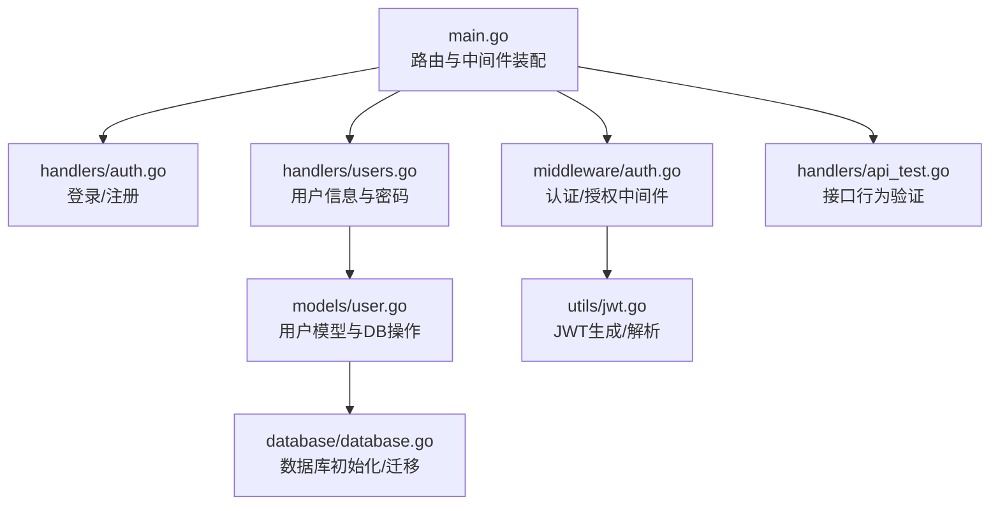
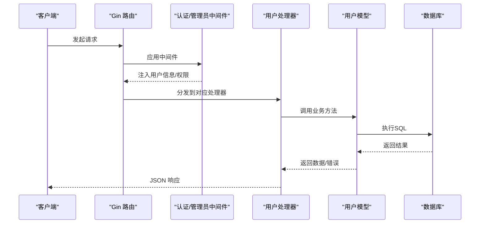
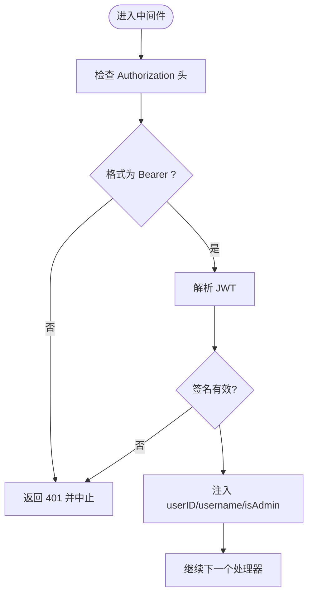
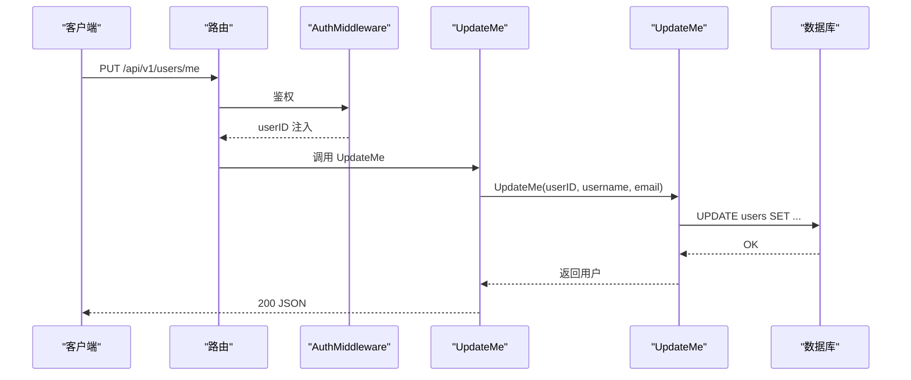
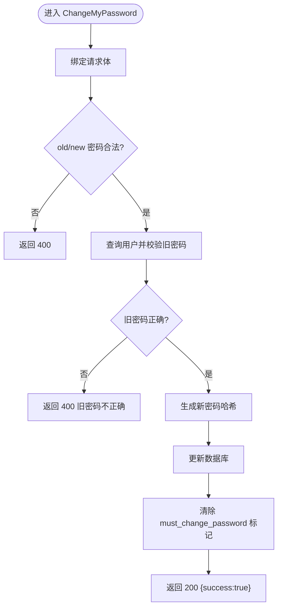
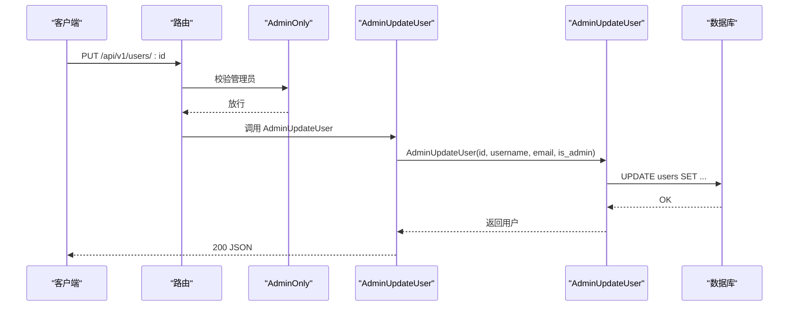
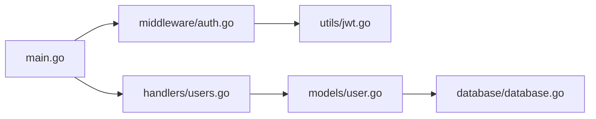

# 用户管理接口

<cite>
**本文引用的文件**
- [backend/main.go](file://backend/main.go)
- [backend/handlers/users.go](file://backend/handlers/users.go)
- [backend/handlers/auth.go](file://backend/handlers/auth.go)
- [backend/models/user.go](file://backend/models/user.go)
- [backend/middleware/auth.go](file://backend/middleware/auth.go)
- [backend/utils/jwt.go](file://backend/utils/jwt.go)
- [backend/database/database.go](file://backend/database/database.go)
- [backend/handlers/api_test.go](file://backend/handlers/api_test.go)
</cite>

## 目录
1. [简介](#简介)
2. [项目结构](#项目结构)
3. [核心组件](#核心组件)
4. [架构总览](#架构总览)
5. [详细组件分析](#详细组件分析)
6. [依赖关系分析](#依赖关系分析)
7. [性能考量](#性能考量)
8. [故障排查指南](#故障排查指南)
9. [结论](#结论)
10. [附录](#附录)

## 简介
本文件为 Memo Studio 的用户管理接口提供系统化、可操作的 API 文档，覆盖以下主题：
- 用户信息更新接口：基本信息修改、头像上传、个人设置更新
- 密码修改接口：旧密码验证、新密码强度检查、密码重置流程
- 管理员功能接口：用户列表查询、用户状态管理、权限分配、批量操作
- 用户数据查询接口：按条件筛选、分页查询、排序功能
- 请求/响应示例、字段说明、权限验证规则、数据验证策略
- 最佳实践与安全考虑

## 项目结构
后端采用 Go + Gin 框架，遵循“路由-处理器-模型-中间件-工具”的分层组织。用户管理相关代码主要分布在：
- 路由与入口：backend/main.go
- 用户业务处理：backend/handlers/users.go
- 认证与登录：backend/handlers/auth.go
- 数据模型与数据库访问：backend/models/user.go
- 权限中间件：backend/middleware/auth.go
- JWT 工具：backend/utils/jwt.go
- 数据库初始化与迁移：backend/database/database.go
- 接口测试：backend/handlers/api_test.go

图表来源
- [backend/main.go](file://backend/main.go#L94-L196)
- [backend/handlers/users.go](file://backend/handlers/users.go#L1-L173)
- [backend/handlers/auth.go](file://backend/handlers/auth.go#L1-L111)
- [backend/middleware/auth.go](file://backend/middleware/auth.go#L1-L71)
- [backend/models/user.go](file://backend/models/user.go#L1-L233)
- [backend/utils/jwt.go](file://backend/utils/jwt.go#L1-L76)
- [backend/database/database.go](file://backend/database/database.go#L1-L677)
- [backend/handlers/api_test.go](file://backend/handlers/api_test.go#L62-L84)

章节来源
- [backend/main.go](file://backend/main.go#L94-L196)

## 核心组件
- 路由与权限
  - /api/v1/auth/login、/api/v1/auth/register：公开接口，带速率限制
  - /api/v1/auth/me、/api/v1/users/me、/api/v1/users/me/password：需认证
  - /api/v1/users（管理员组）：仅管理员可访问
- 用户处理器
  - GetMe、UpdateMe、ChangeMyPassword：普通用户操作
  - AdminListUsers、AdminCreateUser、AdminUpdateUser、AdminDeleteUser：管理员操作
- 中间件
  - AuthMiddleware：提取 Authorization Bearer Token，注入 userID/username/isAdmin
  - AdminOnly：校验是否管理员
- 模型与数据库
  - User 结构体、用户 CRUD、密码哈希与验证
  - 数据库初始化与多版本迁移，含用户表结构演进

章节来源
- [backend/main.go](file://backend/main.go#L94-L196)
- [backend/handlers/users.go](file://backend/handlers/users.go#L37-L173)
- [backend/middleware/auth.go](file://backend/middleware/auth.go#L12-L71)
- [backend/models/user.go](file://backend/models/user.go#L13-L233)

## 架构总览
下图展示用户管理相关的关键交互路径：客户端请求经路由进入处理器，处理器调用模型层进行数据操作，模型层通过数据库层持久化，认证中间件负责鉴权与授权。

图表来源
- [backend/main.go](file://backend/main.go#L94-L196)
- [backend/middleware/auth.go](file://backend/middleware/auth.go#L12-L71)
- [backend/handlers/users.go](file://backend/handlers/users.go#L37-L173)
- [backend/models/user.go](file://backend/models/user.go#L112-L233)

## 详细组件分析

### 路由与权限
- 公开接口（速率限制）
  - POST /api/v1/auth/login
  - POST /api/v1/auth/register
- 需认证接口
  - GET /api/v1/auth/me
  - GET /api/v1/users/me
  - PUT /api/v1/users/me
  - PUT /api/v1/users/me/password
- 管理员接口（需管理员）
  - GET /api/v1/users
  - POST /api/v1/users
  - PUT /api/v1/users/:id
  - DELETE /api/v1/users/:id

章节来源
- [backend/main.go](file://backend/main.go#L94-L196)

### 认证与授权中间件
- AuthMiddleware
  - 从 Authorization 头提取 Bearer Token
  - 解析 JWT，注入 userID、username、isAdmin
  - 若旧版 Token 缺少 isAdmin，从数据库兜底
- AdminOnly
  - 校验 isAdmin 是否为 true，否则返回 403

图表来源
- [backend/middleware/auth.go](file://backend/middleware/auth.go#L12-L71)
- [backend/utils/jwt.go](file://backend/utils/jwt.go#L51-L66)

章节来源
- [backend/middleware/auth.go](file://backend/middleware/auth.go#L12-L71)
- [backend/utils/jwt.go](file://backend/utils/jwt.go#L22-L66)

### 用户信息更新接口
- 获取当前用户信息
  - 方法：GET /api/v1/auth/me
  - 权限：需认证
  - 响应：用户对象（不含密码）
- 获取/更新个人信息
  - 获取：GET /api/v1/users/me
  - 更新：PUT /api/v1/users/me
  - 请求体字段：
    - username：必填，长度 3-50
    - email：选填，最大长度 200
  - 响应：更新后的用户对象
  - 错误：
    - 400：用户名重复（UNIQUE 冲突）
    - 401：未认证
    - 500：其他错误

图表来源
- [backend/handlers/users.go](file://backend/handlers/users.go#L51-L73)
- [backend/models/user.go](file://backend/models/user.go#L112-L126)

章节来源
- [backend/handlers/users.go](file://backend/handlers/users.go#L37-L73)
- [backend/models/user.go](file://backend/models/user.go#L112-L126)

### 密码修改接口
- 修改密码
  - 方法：PUT /api/v1/users/me/password
  - 权限：需认证
  - 请求体字段：
    - old_password：必填
    - new_password：必填，长度 ≥ 6
  - 行为：
    - 校验旧密码（bcrypt）
    - 生成新密码哈希并更新
    - 成功后清除 must_change_password 标记
  - 响应：{"success": true}
  - 错误：
    - 400：旧密码不正确（sql.ErrNoRows）
    - 401：未认证
    - 500：其他错误

图表来源
- [backend/handlers/users.go](file://backend/handlers/users.go#L75-L96)
- [backend/models/user.go](file://backend/models/user.go#L128-L149)

章节来源
- [backend/handlers/users.go](file://backend/handlers/users.go#L75-L96)
- [backend/models/user.go](file://backend/models/user.go#L128-L149)

### 管理员功能接口
- 列表查询
  - 方法：GET /api/v1/users
  - 权限：管理员
  - 响应：用户数组（按 id 升序）
- 创建用户
  - 方法：POST /api/v1/users
  - 权限：管理员
  - 请求体字段：
    - username：必填，长度 3-50
    - password：必填，长度 ≥ 6
    - email：选填，最大长度 200
    - is_admin：布尔
  - 响应：创建的用户对象
  - 错误：用户名重复（UNIQUE）、参数错误、其他错误
- 更新用户
  - 方法：PUT /api/v1/users/:id
  - 权限：管理员
  - 请求体字段：
    - username：必填，长度 3-50
    - email：选填，最大长度 200
    - is_admin：布尔
  - 响应：更新后的用户对象
- 删除用户
  - 方法：DELETE /api/v1/users/:id
  - 权限：管理员
  - 行为：禁止删除默认管理员（admin）

图表来源
- [backend/main.go](file://backend/main.go#L186-L195)
- [backend/handlers/users.go](file://backend/handlers/users.go#L135-L157)
- [backend/models/user.go](file://backend/models/user.go#L206-L221)

章节来源
- [backend/main.go](file://backend/main.go#L186-L195)
- [backend/handlers/users.go](file://backend/handlers/users.go#L98-L171)
- [backend/models/user.go](file://backend/models/user.go#L189-L232)

### 用户数据查询接口
- 当前实现
  - GET /api/v1/users：管理员可列出所有用户（按 id 升序）
  - GET /api/v1/users/me：获取当前用户信息
- 查询能力现状
  - 未提供按条件筛选、分页、排序等高级查询接口
  - 如需扩展，可在模型层增加查询参数并在处理器中解析

章节来源
- [backend/handlers/users.go](file://backend/handlers/users.go#L98-L109)
- [backend/models/user.go](file://backend/models/user.go#L189-L204)

### 头像上传与个人设置
- 头像上传
  - 当前未提供专门的头像上传接口
  - 可复用资源上传接口（/api/v1/resources）作为通用附件上传通道
- 个人设置
  - 个人信息字段：username、email
  - 未提供独立的“个人设置”字段集合接口
  - 可通过更新个人信息接口满足基本需求

章节来源
- [backend/main.go](file://backend/main.go#L134-L137)
- [backend/handlers/users.go](file://backend/handlers/users.go#L14-L17)

### 密码重置流程
- 当前实现
  - 未提供“忘记密码”或“管理员重置密码”的专用接口
  - 可通过管理员接口更新用户密码
- 建议流程（概念性）
  - 客户端发起“重置请求”
  - 管理员调用管理员更新接口修改密码
  - 或在后续版本中新增“重置令牌”机制

章节来源
- [backend/handlers/users.go](file://backend/handlers/users.go#L135-L157)

## 依赖关系分析
- 组件耦合
  - 路由依赖中间件与处理器
  - 处理器依赖模型层
  - 模型层依赖数据库层
  - 中间件依赖 JWT 工具
- 关键依赖链
  - main.go → middleware.auth → utils.jwt → handlers.users → models.user → database

图表来源
- [backend/main.go](file://backend/main.go#L94-L196)
- [backend/middleware/auth.go](file://backend/middleware/auth.go#L12-L71)
- [backend/utils/jwt.go](file://backend/utils/jwt.go#L22-L66)
- [backend/handlers/users.go](file://backend/handlers/users.go#L1-L173)
- [backend/models/user.go](file://backend/models/user.go#L1-L233)
- [backend/database/database.go](file://backend/database/database.go#L1-L677)

章节来源
- [backend/main.go](file://backend/main.go#L94-L196)
- [backend/middleware/auth.go](file://backend/middleware/auth.go#L12-L71)
- [backend/utils/jwt.go](file://backend/utils/jwt.go#L22-L66)
- [backend/handlers/users.go](file://backend/handlers/users.go#L1-L173)
- [backend/models/user.go](file://backend/models/user.go#L1-L233)
- [backend/database/database.go](file://backend/database/database.go#L1-L677)

## 性能考量
- 数据库连接与事务
  - 使用 SQLite，建议保持短事务，避免长连接阻塞
- 索引与查询
  - 用户表按 id 排序查询，适合小规模数据
  - 如需按用户名搜索，可考虑添加索引
- 中间件与序列化
  - 仅在必要处进行 JSON 绑定与序列化
- 速率限制
  - 登录/注册接口已应用速率限制，建议对敏感接口进一步细化

## 故障排查指南
- 401 未认证
  - 检查 Authorization 头是否为 Bearer <token>
  - 确认 JWT 未过期
- 403 无权限
  - 确认当前用户为管理员（is_admin=true）
- 400 参数错误
  - username/email/new_password 长度或格式不符合约束
  - 用户名重复（UNIQUE 冲突）
- 404 用户不存在
  - 查询用户 ID 不存在
- 500 服务器内部错误
  - 数据库异常、哈希生成失败等

章节来源
- [backend/handlers/users.go](file://backend/handlers/users.go#L57-L71)
- [backend/handlers/users.go](file://backend/handlers/users.go#L124-L132)
- [backend/middleware/auth.go](file://backend/middleware/auth.go#L12-L71)

## 结论
Memo Studio 的用户管理接口以简洁清晰的方式实现了用户信息更新、密码修改与管理员功能。当前未提供头像上传与高级查询接口，但可通过现有资源上传接口与后续扩展满足需求。建议在生产环境中强化 JWT 密钥管理、引入更细粒度的速率限制与审计日志，并在未来版本中补充“忘记密码”与高级查询能力。

## 附录

### 请求/响应示例与字段说明

- 获取当前用户信息
  - 请求：GET /api/v1/auth/me
  - 响应字段：id、username、email、is_admin、must_change_password、created_at
- 获取/更新个人信息
  - 请求：PUT /api/v1/users/me
  - 请求体：username（必填，3-50）、email（选填，≤200）
  - 响应：同上
- 修改密码
  - 请求：PUT /api/v1/users/me/password
  - 请求体：old_password（必填）、new_password（必填，≥6）
  - 响应：{"success": true}
- 管理员：列出用户
  - 请求：GET /api/v1/users
  - 响应：用户数组（按 id 升序）
- 管理员：创建用户
  - 请求：POST /api/v1/users
  - 请求体：username（必填，3-50）、password（必填，≥6）、email（选填，≤200）、is_admin（布尔）
  - 响应：创建的用户对象
- 管理员：更新用户
  - 请求：PUT /api/v1/users/:id
  - 请求体：username（必填，3-50）、email（选填，≤200）、is_admin（布尔）
  - 响应：更新后的用户对象
- 管理员：删除用户
  - 请求：DELETE /api/v1/users/:id
  - 响应：{"success": true}

章节来源
- [backend/handlers/users.go](file://backend/handlers/users.go#L37-L171)
- [backend/models/user.go](file://backend/models/user.go#L13-L20)

### 权限验证规则
- 需认证接口：必须携带有效的 Bearer Token
- 管理员接口：必须为管理员（is_admin=true）
- 默认管理员保护：禁止删除内置管理员账户

章节来源
- [backend/middleware/auth.go](file://backend/middleware/auth.go#L12-L71)
- [backend/models/user.go](file://backend/models/user.go#L223-L232)

### 数据验证策略
- 输入绑定与约束
  - username/email/new_password 的长度与必填性
  - UNIQUE 约束冲突检测
- 密码策略
  - bcrypt 哈希存储
  - 旧密码验证
  - must_change_password 标记用于强制首次登录后修改密码

章节来源
- [backend/handlers/users.go](file://backend/handlers/users.go#L14-L35)
- [backend/models/user.go](file://backend/models/user.go#L128-L149)

### 最佳实践与安全考虑
- JWT 安全
  - 生产环境必须设置 MEMO_JWT_SECRET
  - 控制 Token 有效期，建议短期有效并支持刷新
- 速率限制
  - 对登录/注册接口启用速率限制，防止暴力破解
- 数据库安全
  - 使用参数化 SQL，避免注入
  - 严格区分管理员与普通用户权限
- 日志与监控
  - 记录关键操作（登录、密码修改、用户变更）
  - 监控异常请求与错误率

章节来源
- [backend/utils/jwt.go](file://backend/utils/jwt.go#L11-L20)
- [backend/main.go](file://backend/main.go#L324-L329)
- [backend/handlers/api_test.go](file://backend/handlers/api_test.go#L335-L361)