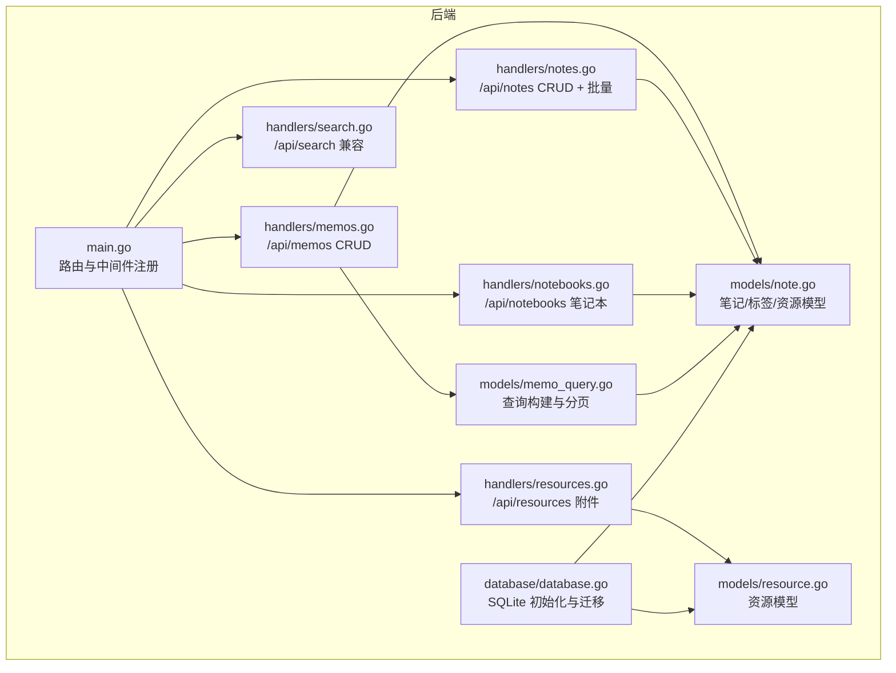
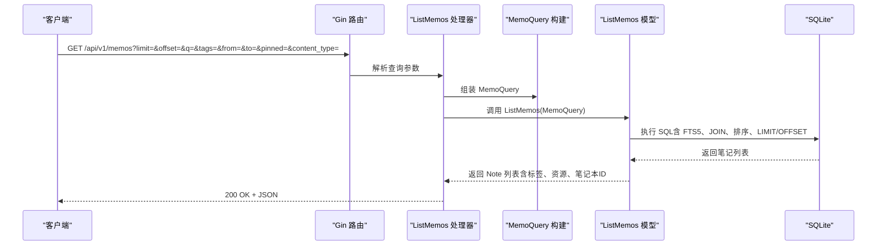
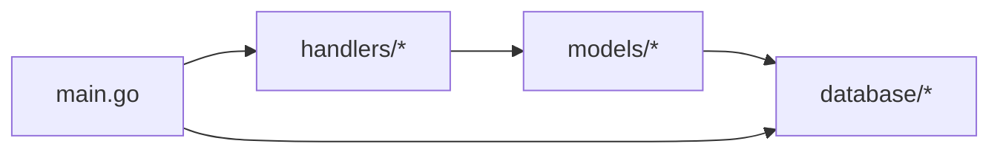

# 笔记管理接口

<cite>
**本文引用的文件**
- [backend/main.go](file://backend/main.go)
- [backend/handlers/memos.go](file://backend/handlers/memos.go)
- [backend/handlers/notes.go](file://backend/handlers/notes.go)
- [backend/handlers/search.go](file://backend/handlers/search.go)
- [backend/handlers/resources.go](file://backend/handlers/resources.go)
- [backend/handlers/notebooks.go](file://backend/handlers/notebooks.go)
- [backend/models/memo_query.go](file://backend/models/memo_query.go)
- [backend/models/note.go](file://backend/models/note.go)
- [backend/models/resource.go](file://backend/models/resource.go)
- [backend/database/database.go](file://backend/database/database.go)
</cite>

## 目录
1. [简介](#简介)
2. [项目结构](#项目结构)
3. [核心组件](#核心组件)
4. [架构总览](#架构总览)
5. [详细组件分析](#详细组件分析)
6. [依赖关系分析](#依赖关系分析)
7. [性能考量](#性能考量)
8. [故障排查指南](#故障排查指南)
9. [结论](#结论)
10. [附录](#附录)

## 简介
本文件为 Memo Studio 的笔记管理接口文档，覆盖笔记的创建、读取、更新、删除（CRUD）、列表查询、详情获取、批量操作、标签与笔记本关联、资源附件、全文搜索等功能。文档面向开发者与产品使用者，提供接口定义、参数规范、响应示例、错误处理与性能优化建议，并给出工作流程与最佳实践。

## 项目结构
后端采用 Go + Gin 框架，SQLite 作为持久化存储，提供 RESTful API。核心模块如下：
- 路由与入口：在主程序中注册路由组与中间件，暴露 /api/v1 与旧版 /api 兼容路由。
- 处理器（Handlers）：负责请求解析、鉴权、调用模型层、返回响应。
- 模型（Models）：封装数据访问逻辑，包括笔记、标签、资源、笔记本、查询构建等。
- 数据库（Database）：初始化 SQLite、迁移表结构、维护版本。

图表来源
- [backend/main.go](file://backend/main.go#L94-L196)
- [backend/handlers/memos.go](file://backend/handlers/memos.go#L78-L137)
- [backend/handlers/notes.go](file://backend/handlers/notes.go#L131-L353)
- [backend/handlers/search.go](file://backend/handlers/search.go#L13-L43)
- [backend/handlers/resources.go](file://backend/handlers/resources.go#L91-L225)
- [backend/handlers/notebooks.go](file://backend/handlers/notebooks.go#L12-L161)
- [backend/models/memo_query.go](file://backend/models/memo_query.go#L24-L152)
- [backend/models/note.go](file://backend/models/note.go#L11-L27)
- [backend/models/resource.go](file://backend/models/resource.go#L10-L20)
- [backend/database/database.go](file://backend/database/database.go#L20-L60)

章节来源
- [backend/main.go](file://backend/main.go#L94-L196)

## 核心组件
- API 路由与鉴权
  - /api/v1 下的受保护路由均需携带有效 JWT；公开路由（登录/注册）提供速率限制。
  - 旧版 /api 路由保持兼容，建议逐步迁移至 /api/v1。
- 笔记模型
  - Note 包含标题、内容、内容类型、是否置顶、标签、资源、笔记本ID列表、位置信息、创建/更新时间等字段。
- 查询模型
  - MemoQuery 支持分页、全文检索、标签过滤、时间范围、置顶筛选、用户隔离等。
- 资源模型
  - Resource 提供文件名、存储路径、URL、MIME 类型、大小、SHA256、创建时间等。
- 数据库与迁移
  - 初始化 SQLite，启用外键、WAL、超时等；按版本迁移，支持多用户隔离、笔记本、位置字段等。

章节来源
- [backend/models/note.go](file://backend/models/note.go#L11-L27)
- [backend/models/memo_query.go](file://backend/models/memo_query.go#L12-L22)
- [backend/models/resource.go](file://backend/models/resource.go#L10-L20)
- [backend/database/database.go](file://backend/database/database.go#L20-L60)

## 架构总览
以下序列图展示笔记列表查询的典型流程，从客户端发起请求到数据库查询与结果组装。

图表来源
- [backend/handlers/memos.go](file://backend/handlers/memos.go#L78-L137)
- [backend/models/memo_query.go](file://backend/models/memo_query.go#L24-L152)
- [backend/models/note.go](file://backend/models/note.go#L518-L548)

## 详细组件分析

### 笔记 CRUD 接口
- 列表查询（/api/v1/memos）
  - 方法：GET
  - 查询参数：
    - limit：每页数量，默认 50，最大 200
    - offset：偏移量，默认 0
    - q：全文检索关键词（FTS5）
    - tags：标签名列表（逗号/空格/分号分隔，去重，最多 64 字）
    - from/to：创建时间范围（支持 RFC3339、YYYY-MM-DD、YYYY-MM-DD HH:MM:SS）
    - pinned：是否置顶（1/true/y 或 0/false/n）
    - content_type：内容类型（目前仅支持 markdown）
    - type：兼容旧参数别名
  - 认证：需要 JWT
  - 响应：Note 数组（包含标签、资源、笔记本ID、位置信息）
  - 错误：400 参数格式错误；401 未认证；500 查询异常
  - 示例：
    - 请求：GET /api/v1/memos?limit=20&offset=0&q=Go&tags=Go,编程
    - 响应：200 [{"id":1,"title":"...","content":"...","tags":[...],"resources":[...],"notebook_ids":[...]}, ...]

- 创建笔记（/api/v1/memos）
  - 方法：POST
  - 请求体：
    - title：标题（必填，最大 200）
    - content：内容（最大 50000）
    - tags：标签数组（最多 50）
    - pinned：是否置顶（布尔）
    - content_type：内容类型（目前仅支持 markdown）
    - resource_ids：资源ID数组（最多 50）
  - 认证：需要 JWT
  - 响应：创建成功的 Note
  - 错误：400 参数错误；401 未认证；500 创建失败
  - 示例：
    - 请求：{"title":"Go 学习","content":"学习 Go 语言","tags":["Go","学习"],"pinned":false,"content_type":"markdown","resource_ids":[1,2]}
    - 响应：201 {"id":...,"title":"Go 学习","content":"学习 Go 语言",...}

- 更新笔记（/api/v1/memos/:id）
  - 方法：PUT
  - 路径参数：id（正整数）
  - 请求体：同创建，支持部分字段更新
  - 认证：需要 JWT
  - 权限：仅笔记作者或历史公开数据可更新
  - 响应：更新后的 Note
  - 错误：400/401/403/404/500
  - 示例：
    - 请求：{"title":"Go 进阶","content":"深入理解并发"}
    - 响应：200 {"id":...,"title":"Go 进阶",...}

- 删除笔记（/api/v1/memos/:id）
  - 方法：DELETE
  - 权限：仅笔记作者或历史公开数据可删除
  - 响应：200 {"success":true}
  - 错误：400/401/403/404/500

- 旧接口（/api/notes 与 /api/search）
  - /api/notes：提供 /api/v1/notes 的兼容实现（GET/POST/PUT/DELETE）
  - /api/search：兼容旧前端，内部委托给 /api/v1/memos?q=...

章节来源
- [backend/handlers/memos.go](file://backend/handlers/memos.go#L78-L278)
- [backend/handlers/notes.go](file://backend/handlers/notes.go#L131-L353)
- [backend/handlers/search.go](file://backend/handlers/search.go#L13-L43)

### 笔记详情接口
- 获取单个笔记（/api/v1/notes/:id 或 /api/v1/memos/:id）
  - 方法：GET
  - 权限：仅笔记作者或历史公开数据可见
  - 响应：完整的 Note（包含标签、资源、笔记本ID、位置信息、创建/更新时间）
  - 错误：400/401/403/404/500
  - 示例：
    - 响应：200 {"id":1,"title":"...","content":"...","tags":[{"id":1,"name":"Go"}],"resources":[{"id":1,"filename":"...","url":"/uploads/..."}],"notebook_ids":[1,2],"location":"...","latitude":...,"longitude":...,"created_at":"...","updated_at":"..."}

章节来源
- [backend/handlers/memos.go](file://backend/handlers/memos.go#L190-L251)
- [backend/handlers/notes.go](file://backend/handlers/notes.go#L152-L173)
- [backend/models/note.go](file://backend/models/note.go#L212-L266)

### 批量操作接口
- 批量删除笔记（/api/v1/notes/batch）
  - 方法：DELETE
  - 请求体：{"ids":[1,2,3,...]}（至少一个）
  - 权限：仅删除当前用户拥有的笔记
  - 响应：200 {"success":true,"deleted":N}
  - 错误：400/401/500

章节来源
- [backend/handlers/notes.go](file://backend/handlers/notes.go#L322-L353)

### 标签管理接口
- 获取标签列表（/api/v1/tags）
  - 方法：GET
  - 查询参数：withCount=1 时返回每个标签的笔记数量
  - 响应：Tag 数组或 TagWithCount 数组
  - 错误：401/500

- 创建标签（/api/v1/tags）
  - 方法：POST
  - 请求体：{"name":"标签名","color":"#RRGGBB"}
  - 响应：创建的 Tag
  - 错误：400/401/500

- 更新标签（/api/v1/tags/:id）
  - 方法：PUT
  - 请求体：{"name":"新名称","color":"#RRGGBB"}
  - 响应：更新后的 Tag
  - 错误：400/401/404/500

- 删除标签（/api/v1/tags/:id）
  - 方法：DELETE
  - 响应：{"success":true,"message":"标签已删除"}
  - 错误：400/401/404/500

- 合并标签（/api/v1/tags/merge）
  - 方法：POST
  - 请求体：{"sourceId":1,"targetId":2}
  - 响应：{"success":true,"message":"标签合并成功"}
  - 错误：400/401/404/500

章节来源
- [backend/handlers/notes.go](file://backend/handlers/notes.go#L355-L512)
- [backend/models/note.go](file://backend/models/note.go#L394-L424)

### 笔记本管理接口
- 获取笔记本列表（/api/v1/notebooks）
- 获取笔记本详情（/api/v1/notebooks/:id）
- 创建笔记本（/api/v1/notebooks）
- 更新笔记本（/api/v1/notebooks/:id）
- 删除笔记本（/api/v1/notebooks/:id）
- 获取笔记本下的笔记（/api/v1/notebooks/:id/notes）

章节来源
- [backend/handlers/notebooks.go](file://backend/handlers/notebooks.go#L12-L161)

### 资源（附件）管理接口
- 上传资源（/api/v1/resources）
  - 方法：POST
  - 上传格式：multipart/form-data，字段 file
  - 限制：最大 20MB
  - 响应：创建的 Resource（包含 URL）
  - 错误：400/401/500

- 列出资源（/api/v1/resources）
  - 方法：GET
  - 查询参数：limit、offset
  - 响应：ListResourcesResult（items + total）
  - 错误：401/500

- 删除资源（/api/v1/resources/:id）
  - 方法：DELETE
  - 响应：{"success":true,"message":"已删除"}
  - 错误：400/401/404/500

章节来源
- [backend/handlers/resources.go](file://backend/handlers/resources.go#L91-L225)
- [backend/models/resource.go](file://backend/models/resource.go#L10-L187)

### 全文搜索接口
- 兼容旧接口（/api/search）
  - 方法：GET
  - 查询参数：q、limit、offset
  - 实现：内部委托给 /api/v1/memos?q=...
  - 响应：Note 数组
  - 错误：401/500

章节来源
- [backend/handlers/search.go](file://backend/handlers/search.go#L13-L43)

## 依赖关系分析
- 处理器依赖模型层进行业务逻辑与数据访问。
- 模型层依赖数据库层进行 SQL 执行与迁移。
- 路由层在 main.go 中集中注册，区分 /api/v1 与 /api 兼容层。

图表来源
- [backend/main.go](file://backend/main.go#L94-L196)
- [backend/handlers/memos.go](file://backend/handlers/memos.go#L78-L137)
- [backend/models/memo_query.go](file://backend/models/memo_query.go#L24-L152)
- [backend/database/database.go](file://backend/database/database.go#L20-L60)

## 性能考量
- 分页与排序
  - 默认 limit 为 50，最大 200；offset 默认 0。
  - 列表默认按置顶优先、创建时间倒序、ID 倒序排序。
- 全文检索
  - 使用 SQLite FTS5，支持 bm25 排序；当存在搜索词时优先按 bm25 排序。
- N+1 查询
  - 列表场景对每个笔记单独查询标签与资源，当前规模可接受；建议后续聚合优化。
- 数据库优化
  - 启用外键、WAL、busy_timeout；按版本迁移，确保索引与约束。
- 附件存储
  - 上传文件按日期分目录存放，支持 URL 映射；注意磁盘空间与清理策略。

章节来源
- [backend/models/memo_query.go](file://backend/models/memo_query.go#L24-L152)
- [backend/models/note.go](file://backend/models/note.go#L268-L327)
- [backend/database/database.go](file://backend/database/database.go#L45-L52)

## 故障排查指南
- 400 参数错误
  - 检查请求体字段类型与长度限制；确认 content_type 仅支持 markdown；确认时间格式正确。
- 401 未认证
  - 确认携带有效的 Authorization 头与 JWT；检查中间件是否正确应用。
- 403 无权限
  - 确认笔记归属当前用户或历史公开数据；旧数据 user_id 为空时允许访问。
- 404 笔记/标签/资源不存在
  - 检查 ID 是否正确；确认资源是否已被删除。
- 500 查询失败
  - 检查数据库连接与迁移状态；查看日志定位具体 SQL 错误。

章节来源
- [backend/handlers/memos.go](file://backend/handlers/memos.go#L139-L278)
- [backend/handlers/notes.go](file://backend/handlers/notes.go#L175-L353)
- [backend/handlers/resources.go](file://backend/handlers/resources.go#L91-L225)

## 结论
Memo Studio 的笔记管理接口围绕 SQLite 与 Gin 提供了完善的 CRUD、查询、搜索、标签与资源管理能力。通过明确的参数规范、鉴权与权限控制、以及合理的分页与排序策略，满足个人与团队的知识管理需求。建议在生产环境中配置 CORS、JWT 密钥与存储目录，关注 N+1 查询优化与附件清理策略，持续提升性能与稳定性。

## 附录

### 数据模型说明
- Note
  - 字段：id、user_id、title、content、content_type、pinned、tags、resources、notebook_ids、location、latitude、longitude、created_at、updated_at
- Tag
  - 字段：id、user_id、name、color、created_at
- TagWithCount
  - 字段：id、user_id、name、color、created_at、note_count
- Resource
  - 字段：id、user_id、filename、storage_path、url、mime_type、size、sha256、created_at

章节来源
- [backend/models/note.go](file://backend/models/note.go#L11-L44)
- [backend/models/resource.go](file://backend/models/resource.go#L10-L20)

### 工作流程与最佳实践
- 创建笔记
  - 建议先上传资源，获得 resource_ids 后再创建笔记，确保资源与笔记关联一致。
- 标签与笔记本
  - 标签按用户隔离，建议统一命名风格；笔记本用于组织笔记，便于分组浏览。
- 搜索与过滤
  - 使用 tags、from/to、pinned、content_type 等参数组合过滤，提升检索效率。
- 批量操作
  - 批量删除前确认 ID 列表与权限；合并标签前确保目标标签存在。
- 附件管理
  - 控制文件大小与类型；定期清理无用资源；注意存储目录权限与磁盘配额。