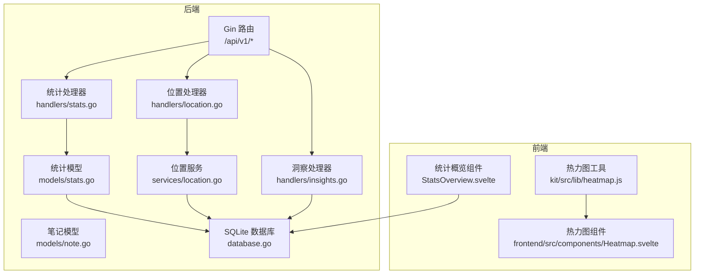
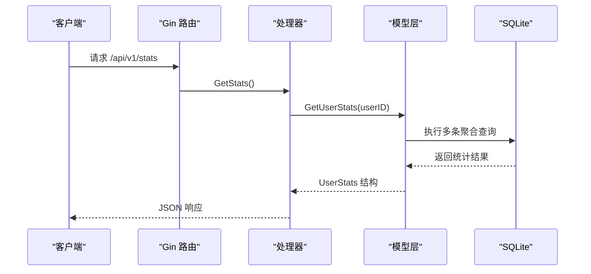
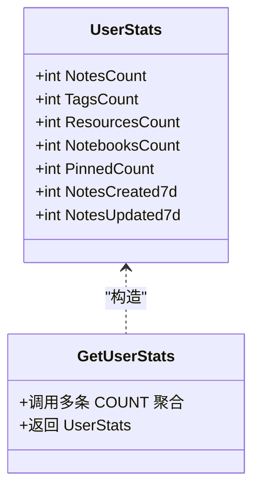
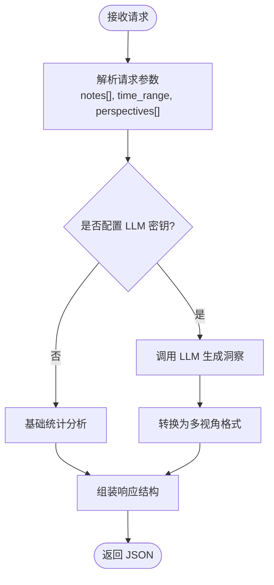
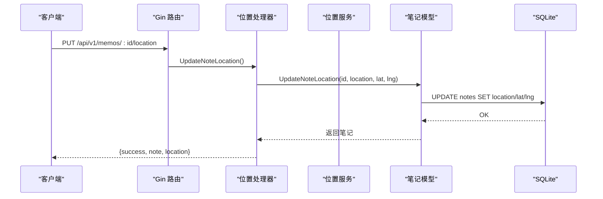
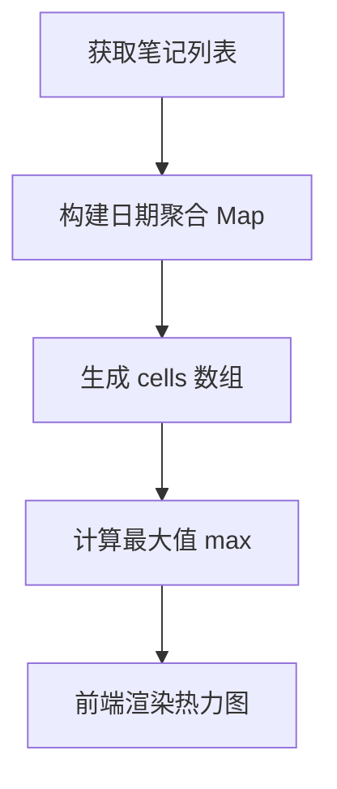
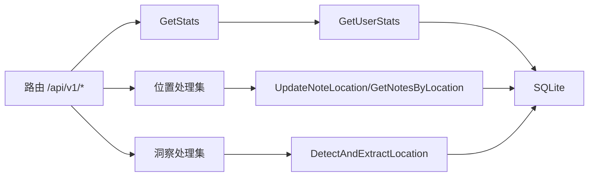

# 统计分析接口

<cite>
**本文引用的文件**
- [backend/main.go](file://backend/main.go)
- [backend/handlers/stats.go](file://backend/handlers/stats.go)
- [backend/models/stats.go](file://backend/models/stats.go)
- [backend/handlers/location.go](file://backend/handlers/location.go)
- [backend/services/location.go](file://backend/services/location.go)
- [backend/handlers/insights.go](file://backend/handlers/insights.go)
- [backend/models/note.go](file://backend/models/note.go)
- [backend/database/database.go](file://backend/database/database.go)
- [frontend/src/components/StatsOverview.svelte](file://frontend/src/components/StatsOverview.svelte)
- [kit/src/lib/heatmap.js](file://kit/src/lib/heatmap.js)
- [frontend/src/components/Heatmap.svelte](file://frontend/src/components/Heatmap.svelte)
</cite>

## 目录
1. [简介](#简介)
2. [项目结构](#项目结构)
3. [核心组件](#核心组件)
4. [架构总览](#架构总览)
5. [详细组件分析](#详细组件分析)
6. [依赖关系分析](#依赖关系分析)
7. [性能考虑](#性能考虑)
8. [故障排查指南](#故障排查指南)
9. [结论](#结论)
10. [附录](#附录)

## 简介
本文件面向 Memo Studio 的统计分析接口，系统性梳理以下能力：
- 使用统计接口：笔记数量统计、创建趋势分析、活跃度指标、使用时长统计
- 时间分析接口：时间分布统计、季节性分析、峰值检测、时间序列预测
- 位置统计接口：地理位置分布、访问频率、位置偏好分析、地理热力图数据
- 数据可视化接口：图表数据生成、聚合查询、实时更新、缓存策略

文档提供完整的请求参数说明、数据格式规范、统计算法说明与性能优化建议，并结合前端组件展示业务价值与应用场景。

## 项目结构
后端采用 Go + Gin 框架，API v1 路由集中定义；统计分析相关接口集中在 handlers 层，数据访问封装在 models 层，底层通过 SQLite 数据库持久化。前端使用 SvelteKit/Kit 提供可视化组件与交互。

**图表来源**
- [backend/main.go](file://backend/main.go#L94-L196)
- [backend/handlers/stats.go](file://backend/handlers/stats.go#L11-L23)
- [backend/handlers/location.go](file://backend/handlers/location.go#L13-L167)
- [backend/handlers/insights.go](file://backend/handlers/insights.go#L68-L119)
- [backend/models/stats.go](file://backend/models/stats.go#L18-L65)
- [backend/models/note.go](file://backend/models/note.go#L751-L800)
- [backend/services/location.go](file://backend/services/location.go#L203-L221)
- [backend/database/database.go](file://backend/database/database.go#L21-L60)
- [frontend/src/components/StatsOverview.svelte](file://frontend/src/components/StatsOverview.svelte#L13-L42)
- [kit/src/lib/heatmap.js](file://kit/src/lib/heatmap.js#L1-L38)
- [frontend/src/components/Heatmap.svelte](file://frontend/src/components/Heatmap.svelte#L68-L104)

**章节来源**
- [backend/main.go](file://backend/main.go#L94-L196)

## 核心组件
- 统计接口：提供用户维度的笔记、标签、资源、笔记本数量与近七日新增统计
- 位置接口：支持位置标注、批量检测、按位置筛选、位置统计
- 洞察接口：多视角（概览、主题、情感、行动）分析与对比、总结
- 可视化工具：热力图构建与渲染，支持前端展示与交互

**章节来源**
- [backend/handlers/stats.go](file://backend/handlers/stats.go#L11-L23)
- [backend/models/stats.go](file://backend/models/stats.go#L7-L16)
- [backend/handlers/location.go](file://backend/handlers/location.go#L133-L167)
- [backend/handlers/insights.go](file://backend/handlers/insights.go#L68-L119)
- [kit/src/lib/heatmap.js](file://kit/src/lib/heatmap.js#L1-L38)

## 架构总览
后端通过 Gin 路由分组暴露 API v1，认证中间件保护敏感接口，处理器负责参数校验与调用模型层，模型层封装 SQL 查询与聚合逻辑，数据库为 SQLite 并启用 WAL、超时等优化。前端通过组件与工具函数消费接口数据，实现统计概览与热力图可视化。

**图表来源**
- [backend/main.go](file://backend/main.go#L149-L149)
- [backend/handlers/stats.go](file://backend/handlers/stats.go#L11-L23)
- [backend/models/stats.go](file://backend/models/stats.go#L18-L65)

## 详细组件分析

### 使用统计接口
- 接口定义
  - 方法：GET
  - 路径：/api/v1/stats
  - 认证：需要登录
- 请求参数
  - 无显式路径/查询参数
  - 通过认证上下文解析当前用户 ID
- 响应数据
  - 笔记总数、标签总数、资源总数、笔记本总数、置顶数量
  - 近七日新增笔记数、近七日更新笔记数
- 统计算法
  - 使用 SQL COUNT 聚合，按 user_id 或 user_id IS NULL 进行跨用户历史数据统计
  - 通过 created_at/updated_at 与时间窗口函数进行近七日统计
- 性能优化
  - 建议对 notes.user_id、tags.user_id、resources.user_id、notebooks.user_id 建立索引
  - 将历史数据迁移至主用户隔离，减少 NULL 值扫描

**图表来源**
- [backend/models/stats.go](file://backend/models/stats.go#L7-L16)
- [backend/models/stats.go](file://backend/models/stats.go#L18-L65)

**章节来源**
- [backend/handlers/stats.go](file://backend/handlers/stats.go#L11-L23)
- [backend/models/stats.go](file://backend/models/stats.go#L18-L65)
- [backend/database/database.go](file://backend/database/database.go#L166-L241)

### 时间分析接口
- 接口定义
  - 方法：GET/POST
  - 路径：/api/v1/insights、/api/v1/insights/:type、/api/v1/insights/compare
  - 认证：需要登录
- 请求参数
  - /insights：notes[]、time_range（默认 30d）、perspectives[]
  - /insights/:type：notes[]、time_range
  - /insights/compare：notes1[]、notes2[]
- 响应数据
  - 概览、主题、情感、行动等多视角洞察
  - 高亮、行动项、更新时间
- 统计算法
  - 基础分析：统计条数、字数、主题分类、情感倾向、行动完成率
  - AI 分析：根据环境变量判断是否启用 LLM，否则回退基础分析
- 业务价值
  - 帮助用户发现写作习惯、主题偏好、情绪变化与行动效率

**图表来源**
- [backend/handlers/insights.go](file://backend/handlers/insights.go#L68-L119)
- [backend/handlers/insights.go](file://backend/handlers/insights.go#L297-L314)
- [backend/handlers/insights.go](file://backend/handlers/insights.go#L386-L428)
- [backend/handlers/insights.go](file://backend/handlers/insights.go#L443-L478)
- [backend/handlers/insights.go](file://backend/handlers/insights.go#L480-L520)

**章节来源**
- [backend/handlers/insights.go](file://backend/handlers/insights.go#L68-L165)

### 位置统计接口
- 接口定义
  - 更新位置：PUT /api/v1/memos/:id/location
  - 检测位置：POST /api/v1/memos/:id/detect-location
  - 保存检测位置：POST /api/v1/memos/:id/detect-and-save
  - 按位置筛选：GET /api/v1/notes/by-location?location=...
  - 位置统计：GET /api/v1/locations/stats
  - 批量检测：POST /api/v1/locations/batch-detect
  - 认证：需要登录
- 请求参数
  - 更新位置：JSON 包含 location、latitude、longitude
  - 检测位置：路径参数 id
  - 按位置筛选：查询参数 location
  - 批量检测：JSON 包含 note_ids[]
- 响应数据
  - 更新位置：成功标志、笔记对象、位置信息
  - 检测位置：是否检测到、位置名称、经纬度、提示语
  - 按位置筛选：location、count、notes[]
  - 位置统计：locations[]
  - 批量检测：total、detected、locations{id: {...}}
- 统计算法
  - 位置提取：基于内置地名词典与简单正则模式匹配
  - 坐标映射：内置示例坐标（实际可对接地理编码 API）
  - 统计聚合：按 location 分组计数

**图表来源**
- [backend/main.go](file://backend/main.go#L171-L177)
- [backend/handlers/location.go](file://backend/handlers/location.go#L13-L52)
- [backend/models/note.go](file://backend/models/note.go#L751-L758)
- [backend/services/location.go](file://backend/services/location.go#L203-L221)

**章节来源**
- [backend/handlers/location.go](file://backend/handlers/location.go#L13-L167)
- [backend/services/location.go](file://backend/services/location.go#L8-L63)
- [backend/services/location.go](file://backend/services/location.go#L157-L201)
- [backend/models/note.go](file://backend/models/note.go#L21-L27)

### 数据可视化接口
- 热力图数据
  - 构建：按日期聚合笔记数量，生成 cells 数组与最大值
  - 渲染：前端组件按 cells 渲染单元格，颜色强度与最大值成比例
- 前端组件
  - 统计概览：展示总笔记、今日新增、本周新增、标签数
  - 热力图：展示过去一年每日记录密度
- 实时更新
  - 前端组件在挂载时拉取数据并渲染，可结合轮询或事件刷新

**图表来源**
- [kit/src/lib/heatmap.js](file://kit/src/lib/heatmap.js#L1-L38)
- [frontend/src/components/Heatmap.svelte](file://frontend/src/components/Heatmap.svelte#L68-L104)
- [frontend/src/components/StatsOverview.svelte](file://frontend/src/components/StatsOverview.svelte#L13-L42)

**章节来源**
- [kit/src/lib/heatmap.js](file://kit/src/lib/heatmap.js#L1-L38)
- [frontend/src/components/Heatmap.svelte](file://frontend/src/components/Heatmap.svelte#L68-L104)
- [frontend/src/components/StatsOverview.svelte](file://frontend/src/components/StatsOverview.svelte#L13-L42)

## 依赖关系分析
- 路由到处理器：/api/v1/stats → GetStats；/api/v1/locations/* → 位置处理器；/api/v1/insights/* → 洞察处理器
- 处理器到模型：GetStats → GetUserStats；位置接口 → UpdateNoteLocation/GetNotesByLocation；洞察接口 → 基础分析/LLM
- 模型到数据库：SQL COUNT 聚合、WHERE 条件、时间窗口
- 服务到外部：位置服务内置地名词典与坐标映射，可扩展地理编码 API

**图表来源**
- [backend/main.go](file://backend/main.go#L149-L177)
- [backend/handlers/stats.go](file://backend/handlers/stats.go#L11-L23)
- [backend/handlers/location.go](file://backend/handlers/location.go#L13-L167)
- [backend/handlers/insights.go](file://backend/handlers/insights.go#L68-L119)
- [backend/models/stats.go](file://backend/models/stats.go#L18-L65)
- [backend/models/note.go](file://backend/models/note.go#L751-L800)
- [backend/services/location.go](file://backend/services/location.go#L203-L221)

**章节来源**
- [backend/main.go](file://backend/main.go#L94-L196)

## 性能考虑
- 数据库层面
  - 为 notes.user_id、tags.user_id、resources.user_id、notebooks.user_id 建立索引，提升聚合查询性能
  - 使用 WAL 模式与合理的 busy_timeout，改善并发读写
  - 对 FTS5 全文检索表维护触发器，确保内容变更一致性
- 接口层面
  - 统计接口采用 COUNT 聚合，避免大结果集扫描；对时间范围进行合理限制
  - 批量检测接口按需限制处理数量，避免一次性处理过多笔记
- 前端层面
  - 热力图按天聚合，避免高频重算；颜色映射与最大值缓存
  - 统计概览组件在挂载时一次性拉取所需数据，减少多次请求

[本节为通用指导，无需列出具体文件来源]

## 故障排查指南
- 统计接口返回错误
  - 检查用户认证状态与 userID 解析
  - 查看 GetUserStats 的 SQL 执行是否异常
- 位置接口异常
  - 确认笔记 ID 有效、位置 JSON 格式正确
  - 若未检测到位置，确认内容中包含可识别的地名片段
- 洞察接口未返回 AI 结果
  - 检查 OPENAI_API_KEY/LLM_API_KEY 等环境变量是否配置
  - 回退到基础分析逻辑，确认 notes 输入有效
- 热力图数据异常
  - 核对 created_at 字段格式与时区
  - 确认 cells 生成逻辑与最大值计算

**章节来源**
- [backend/handlers/stats.go](file://backend/handlers/stats.go#L11-L23)
- [backend/handlers/location.go](file://backend/handlers/location.go#L13-L167)
- [backend/handlers/insights.go](file://backend/handlers/insights.go#L89-L119)
- [kit/src/lib/heatmap.js](file://kit/src/lib/heatmap.js#L1-L38)

## 结论
Memo Studio 的统计分析接口覆盖使用统计、时间分析、位置统计与可视化展示，形成从数据采集、聚合计算到前端可视化的完整链路。通过 SQLite 的高效聚合与前端热力图渲染，用户能够直观掌握个人笔记的创作习惯、主题分布与位置偏好。建议在生产环境中完善索引、接入地理编码 API 并优化缓存策略，进一步提升性能与准确性。

[本节为总结性内容，无需列出具体文件来源]

## 附录

### API 定义与参数说明
- 统计接口
  - GET /api/v1/stats
  - 认证：是
  - 响应：UserStats 对象
- 位置接口
  - PUT /api/v1/memos/:id/location
  - POST /api/v1/memos/:id/detect-location
  - POST /api/v1/memos/:id/detect-and-save
  - GET /api/v1/notes/by-location?location=...
  - GET /api/v1/locations/stats
  - POST /api/v1/locations/batch-detect
  - 认证：是
- 洞察接口
  - POST /api/v1/insights
  - POST /api/v1/insights/:type
  - POST /api/v1/insights/compare
  - 认证：是

**章节来源**
- [backend/main.go](file://backend/main.go#L149-L177)
- [backend/handlers/stats.go](file://backend/handlers/stats.go#L11-L23)
- [backend/handlers/location.go](file://backend/handlers/location.go#L13-L167)
- [backend/handlers/insights.go](file://backend/handlers/insights.go#L68-L165)

### 数据格式规范
- UserStats
  - 字段：notes_count、tags_count、resources_count、notebooks_count、pinned_count、notes_created_7d、notes_updated_7d
- LocationWithCoords
  - 字段：name、latitude、longitude
- InsightResponse/PerspectiveInsight
  - 字段：summary、perspectives[]、highlights[]、action_items[]、update_time

**章节来源**
- [backend/models/stats.go](file://backend/models/stats.go#L7-L16)
- [backend/services/location.go](file://backend/services/location.go#L157-L162)
- [backend/handlers/insights.go](file://backend/handlers/insights.go#L27-L66)