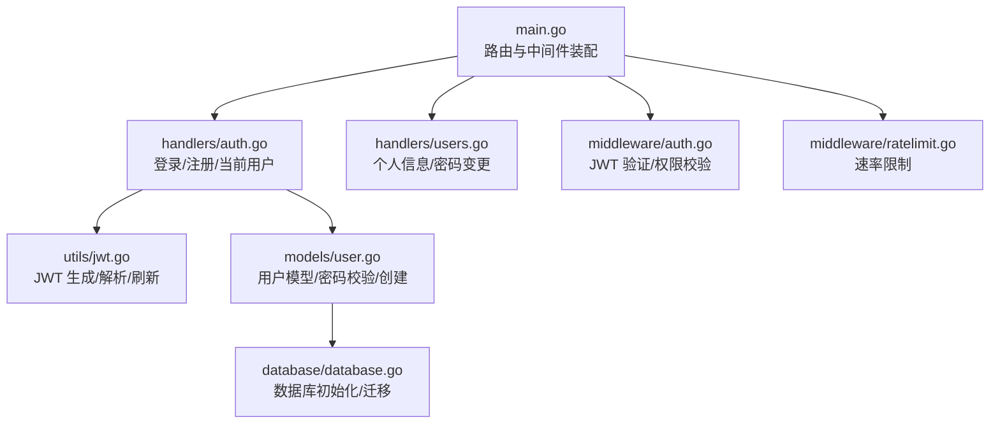
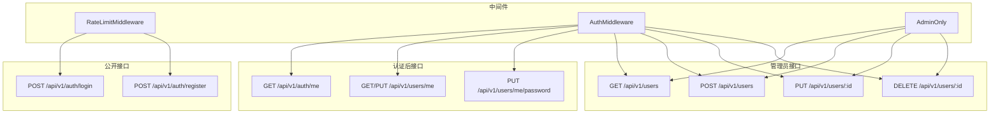
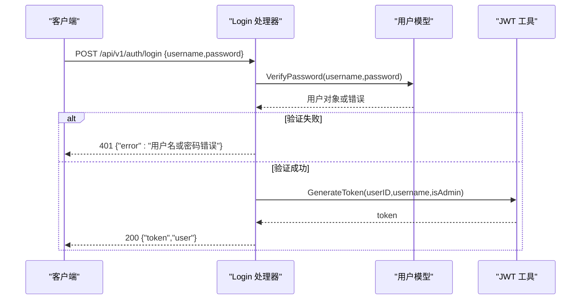
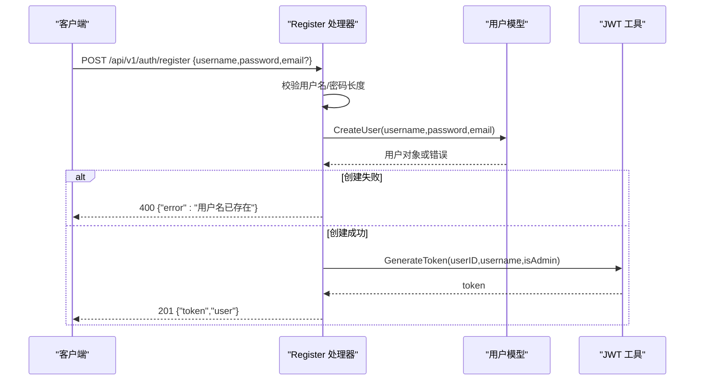
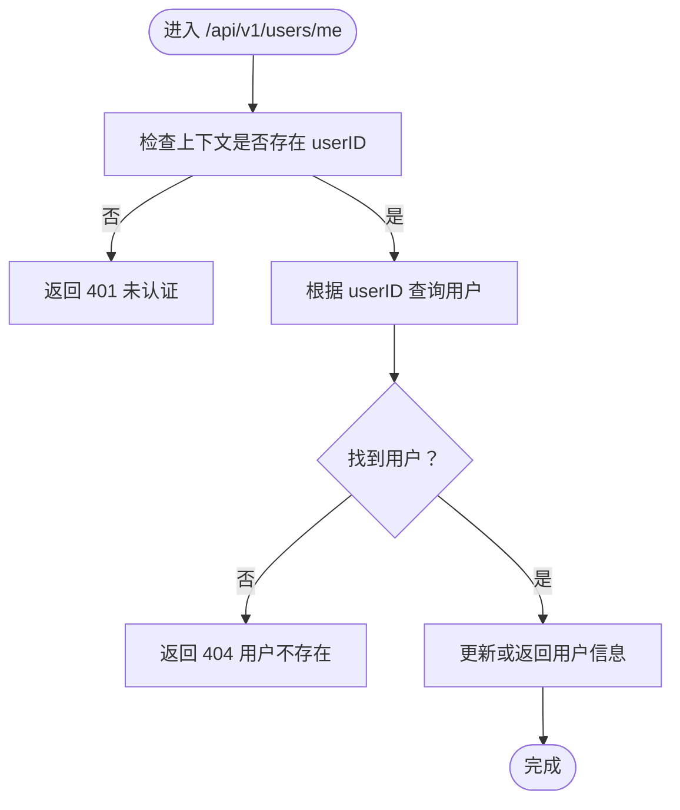
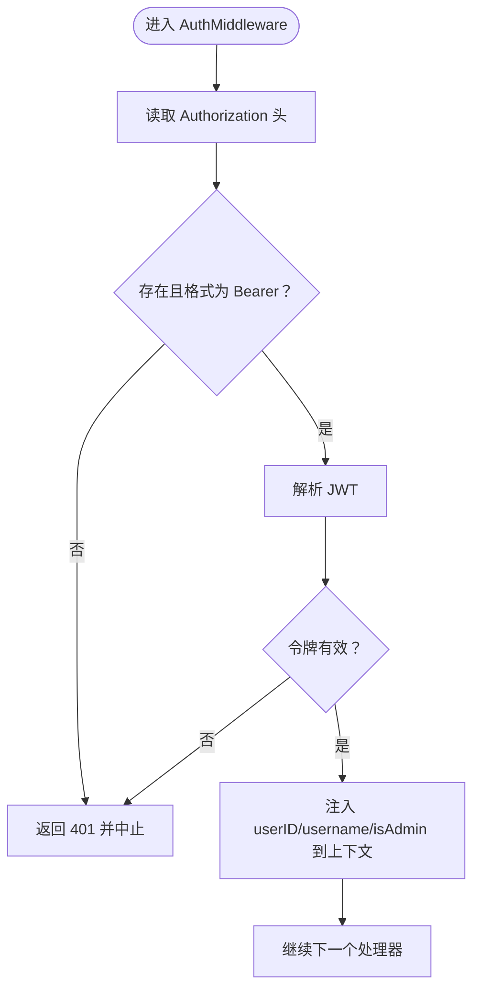
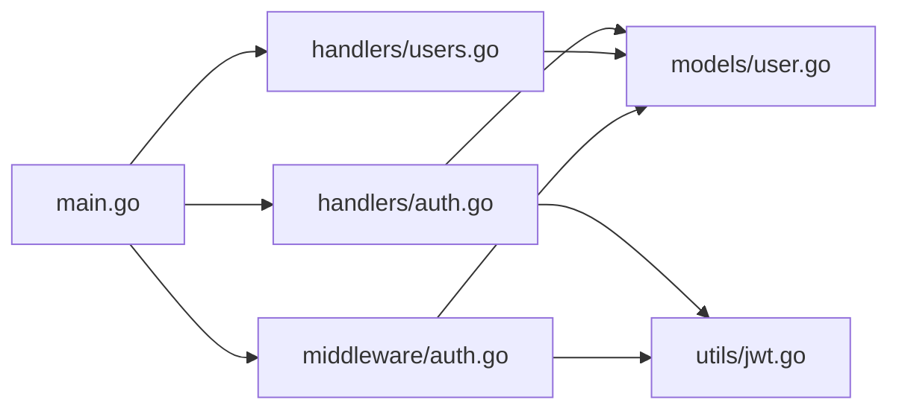
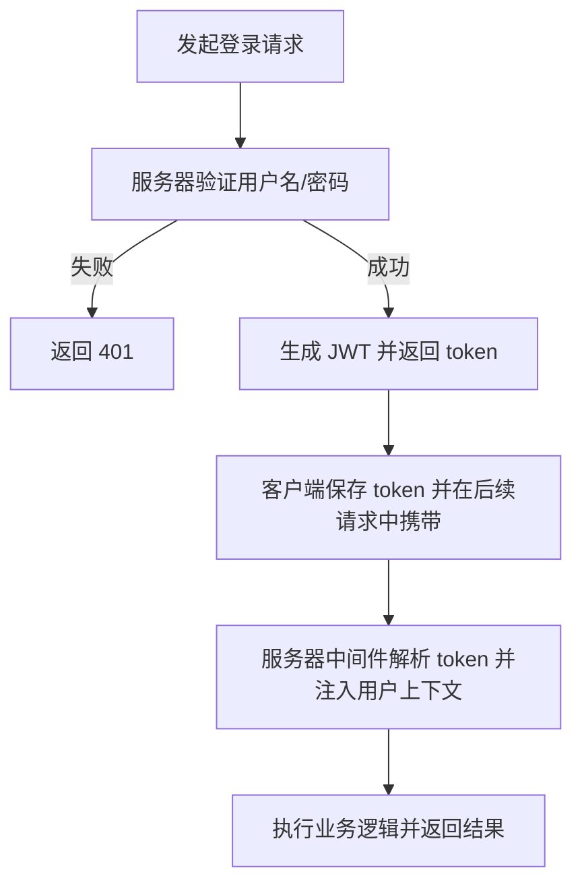

# 认证相关接口

<cite>
**本文引用的文件**
- [backend/main.go](file://backend/main.go)
- [backend/handlers/auth.go](file://backend/handlers/auth.go)
- [backend/handlers/users.go](file://backend/handlers/users.go)
- [backend/middleware/auth.go](file://backend/middleware/auth.go)
- [backend/middleware/ratelimit.go](file://backend/middleware/ratelimit.go)
- [backend/utils/jwt.go](file://backend/utils/jwt.go)
- [backend/models/user.go](file://backend/models/user.go)
- [backend/database/database.go](file://backend/database/database.go)
- [backend/handlers/api_test.go](file://backend/handlers/api_test.go)
</cite>

## 目录
1. [简介](#简介)
2. [项目结构](#项目结构)
3. [核心组件](#核心组件)
4. [架构总览](#架构总览)
5. [详细组件分析](#详细组件分析)
6. [依赖关系分析](#依赖关系分析)
7. [性能考量](#性能考量)
8. [故障排查指南](#故障排查指南)
9. [结论](#结论)
10. [附录](#附录)

## 简介
本文件面向 Memo Studio 的认证相关接口，提供从登录、注册到用户信息查询与中间件鉴权的完整文档。内容涵盖：
- 用户登录：用户名密码认证、JWT 令牌签发与过期处理
- 用户注册：新用户创建、密码加密、邮箱字段处理
- 用户信息：个人资料查询、权限检查、用户状态管理
- 中间件：JWT 验证、权限校验、请求拦截机制
- 请求/响应示例、错误码说明、认证失败处理与安全最佳实践
- 认证流程图与常见问题解决方案

## 项目结构
认证相关代码主要分布在以下模块：
- 路由与入口：backend/main.go
- 认证处理器：backend/handlers/auth.go、backend/handlers/users.go
- 中间件：backend/middleware/auth.go、backend/middleware/ratelimit.go
- 工具与模型：backend/utils/jwt.go、backend/models/user.go、backend/database/database.go
- 测试：backend/handlers/api_test.go

图表来源
- [backend/main.go](file://backend/main.go#L94-L196)
- [backend/handlers/auth.go](file://backend/handlers/auth.go#L27-L110)
- [backend/handlers/users.go](file://backend/handlers/users.go#L37-L171)
- [backend/middleware/auth.go](file://backend/middleware/auth.go#L12-L70)
- [backend/middleware/ratelimit.go](file://backend/middleware/ratelimit.go#L96-L142)
- [backend/utils/jwt.go](file://backend/utils/jwt.go#L29-L75)
- [backend/models/user.go](file://backend/models/user.go#L22-L110)
- [backend/database/database.go](file://backend/database/database.go#L20-L60)

章节来源
- [backend/main.go](file://backend/main.go#L94-L196)

## 核心组件
- 登录接口：接收用户名/密码，验证后签发 JWT
- 注册接口：校验用户名/密码长度，创建用户并签发 JWT
- 当前用户接口：基于中间件注入的用户信息返回用户对象
- 个人信息接口：允许更新用户名/邮箱，支持管理员批量操作
- 密码变更接口：校验旧密码并更新为新密码
- 认证中间件：从 Authorization 头提取 Bearer Token，解析并注入用户上下文
- 管理员中间件：校验是否具备管理员权限
- 速率限制中间件：对公开接口进行限流保护

章节来源
- [backend/handlers/auth.go](file://backend/handlers/auth.go#L27-L110)
- [backend/handlers/users.go](file://backend/handlers/users.go#L37-L171)
- [backend/middleware/auth.go](file://backend/middleware/auth.go#L12-L70)
- [backend/middleware/ratelimit.go](file://backend/middleware/ratelimit.go#L96-L142)

## 架构总览
认证系统采用“公开接口 + 中间件保护”的分层设计：
- 公开接口组：/api/v1/auth/login、/api/v1/auth/register
- 需认证接口组：/api/v1/users/me、/api/v1/auth/me 等
- 管理员专用接口组：/api/v1/users（受 AdminOnly 中间件保护）

图表来源
- [backend/main.go](file://backend/main.go#L94-L196)
- [backend/middleware/auth.go](file://backend/middleware/auth.go#L12-L70)
- [backend/middleware/ratelimit.go](file://backend/middleware/ratelimit.go#L96-L142)

## 详细组件分析

### 登录接口
- 功能：接收用户名/密码，调用模型层验证，成功后生成 JWT 并返回 token 与用户信息
- 输入结构：LoginRequest（用户名、密码）
- 输出结构：AuthResponse（token、user）
- 错误码：
  - 400：请求体绑定失败
  - 401：用户名或密码错误
  - 500：令牌生成失败
- 安全要点：
  - 密码使用 bcrypt 校验
  - 令牌默认有效期 24 小时，可通过刷新接口延长

图表来源
- [backend/handlers/auth.go](file://backend/handlers/auth.go#L27-L53)
- [backend/models/user.go](file://backend/models/user.go#L78-L110)
- [backend/utils/jwt.go](file://backend/utils/jwt.go#L29-L49)

章节来源
- [backend/handlers/auth.go](file://backend/handlers/auth.go#L27-L53)
- [backend/models/user.go](file://backend/models/user.go#L78-L110)
- [backend/utils/jwt.go](file://backend/utils/jwt.go#L29-L49)

### 注册接口
- 功能：校验用户名/密码长度，创建用户并签发 JWT
- 输入结构：RegisterRequest（用户名、密码、可选邮箱）
- 输出结构：AuthResponse（token、user）
- 错误码：
  - 400：请求体绑定失败、用户名长度不足、密码长度不足、用户名已存在
  - 500：令牌生成失败
- 安全要点：
  - 密码使用 bcrypt 加密存储
  - 默认非管理员角色

图表来源
- [backend/handlers/auth.go](file://backend/handlers/auth.go#L55-L93)
- [backend/models/user.go](file://backend/models/user.go#L22-L44)
- [backend/utils/jwt.go](file://backend/utils/jwt.go#L29-L49)

章节来源
- [backend/handlers/auth.go](file://backend/handlers/auth.go#L55-L93)
- [backend/models/user.go](file://backend/models/user.go#L22-L44)

### 用户信息接口
- 当前用户：GET /api/v1/auth/me，基于中间件注入的 userID 查询用户
- 个人信息：GET/PUT /api/v1/users/me，支持更新用户名/邮箱
- 密码变更：PUT /api/v1/users/me/password，校验旧密码并更新
- 管理员接口：GET/POST/PUT/DELETE /api/v1/users（AdminOnly 保护）

图表来源
- [backend/handlers/users.go](file://backend/handlers/users.go#L37-L96)
- [backend/models/user.go](file://backend/models/user.go#L63-L76)

章节来源
- [backend/handlers/users.go](file://backend/handlers/users.go#L37-L96)
- [backend/models/user.go](file://backend/models/user.go#L63-L76)

### 认证中间件与权限校验
- AuthMiddleware：
  - 从 Authorization 头提取 Bearer Token
  - 解析 JWT，注入 userID、username、isAdmin 到上下文
  - 兼容旧 token：若 claim 缺失 isAdmin，则回查数据库兜底
- AdminOnly：
  - 校验上下文中 isAdmin 是否为 true，否则返回 403

图表来源
- [backend/middleware/auth.go](file://backend/middleware/auth.go#L12-L52)

章节来源
- [backend/middleware/auth.go](file://backend/middleware/auth.go#L12-L70)

### 速率限制中间件
- 对公开接口组（登录/注册）应用限流，默认每分钟 50 次
- 超限时返回 429，并设置 Retry-After 与速率限制头

章节来源
- [backend/middleware/ratelimit.go](file://backend/middleware/ratelimit.go#L96-L142)

### JWT 令牌生成与解析
- Claims 包含 user_id、username、is_admin、过期/签发/生效时间
- 默认有效期 24 小时，支持刷新接口延长有效期
- 生产环境必须设置 MEMO_JWT_SECRET 环境变量

章节来源
- [backend/utils/jwt.go](file://backend/utils/jwt.go#L22-L75)

### 数据模型与数据库
- 用户模型包含 id、username、email、is_admin、must_change_password、created_at
- 密码使用 bcrypt 加密存储
- 数据库初始化时自动执行迁移，包含用户表与管理员字段

章节来源
- [backend/models/user.go](file://backend/models/user.go#L13-L21)
- [backend/models/user.go](file://backend/models/user.go#L22-L110)
- [backend/database/database.go](file://backend/database/database.go#L440-L540)

## 依赖关系分析
- handlers.auth 依赖 models.user 与 utils.jwt
- handlers.users 依赖 models.user
- middleware.auth 依赖 utils.jwt 与 models.user
- main.go 将中间件挂载到路由组

图表来源
- [backend/handlers/auth.go](file://backend/handlers/auth.go#L1-L11)
- [backend/handlers/users.go](file://backend/handlers/users.go#L1-L12)
- [backend/middleware/auth.go](file://backend/middleware/auth.go#L1-L10)
- [backend/main.go](file://backend/main.go#L94-L196)

## 性能考量
- 速率限制：对公开接口进行限流，防止暴力破解与滥用
- JWT 解析：轻量内存计算，解析失败即短路返回
- 数据库：bcrypt 密码哈希成本较高，建议在高并发场景下配合缓存与异步任务优化
- 中间件顺序：认证中间件在路由组内尽早执行，减少后续处理器的重复校验

## 故障排查指南
- 401 未提供认证令牌
  - 检查 Authorization 头是否为 Bearer <token> 格式
  - 确认 token 未过期
- 401 无效的认证令牌
  - 检查 MEMO_JWT_SECRET 是否正确设置
  - 确认 token 未被篡改
- 401 未认证
  - 当前请求未携带有效 token 或上下文未注入 userID
- 403 无权限
  - 非管理员访问管理员接口
- 400 请求参数错误
  - 登录/注册时用户名/密码长度不符合要求
  - 更新个人信息时用户名为空或邮箱重复
- 404 用户不存在
  - 查询用户信息时 userID 无效
- 429 请求过于频繁
  - 触发速率限制，等待冷却时间

章节来源
- [backend/middleware/auth.go](file://backend/middleware/auth.go#L16-L36)
- [backend/handlers/auth.go](file://backend/handlers/auth.go#L29-L40)
- [backend/handlers/auth.go](file://backend/handlers/auth.go#L58-L73)
- [backend/handlers/users.go](file://backend/handlers/users.go#L58-L71)
- [backend/middleware/ratelimit.go](file://backend/middleware/ratelimit.go#L104-L112)

## 结论
Memo Studio 的认证体系以 JWT 为核心，结合速率限制与严格的权限校验，提供了安全可靠的用户认证与授权能力。通过清晰的路由分层与中间件装配，实现了登录/注册、用户信息管理与管理员操作的完整闭环。生产部署时务必配置 MEMO_JWT_SECRET 与 CORS 等安全参数，以满足安全合规要求。

## 附录

### 请求/响应示例（路径参考）
- 登录
  - 请求：POST /api/v1/auth/login
  - 成功响应：200 { token, user }
  - 失败响应：401 {"error":"用户名或密码错误"}
- 注册
  - 请求：POST /api/v1/auth/register
  - 成功响应：201 { token, user }
  - 失败响应：400 {"error":"用户名已存在"}
- 当前用户
  - 请求：GET /api/v1/auth/me
  - 成功响应：200 用户对象
  - 失败响应：401 {"error":"未认证"}
- 个人信息
  - 请求：GET/PUT /api/v1/users/me
  - 成功响应：200 用户对象
  - 失败响应：400/401/404
- 管理员接口
  - 请求：GET/POST/PUT/DELETE /api/v1/users
  - 成功响应：200/201
  - 失败响应：403/400/500

章节来源
- [backend/handlers/auth.go](file://backend/handlers/auth.go#L27-L110)
- [backend/handlers/users.go](file://backend/handlers/users.go#L37-L171)
- [backend/middleware/auth.go](file://backend/middleware/auth.go#L12-L70)

### 错误码一览
- 400：请求参数错误、用户名/密码长度不足、用户名已存在
- 401：未提供认证令牌、认证令牌格式错误、无效的认证令牌、用户名或密码错误、未认证
- 403：无权限
- 404：用户不存在
- 429：请求过于频繁
- 500：内部错误（如令牌生成失败）

章节来源
- [backend/handlers/auth.go](file://backend/handlers/auth.go#L29-L40)
- [backend/handlers/auth.go](file://backend/handlers/auth.go#L58-L73)
- [backend/handlers/auth.go](file://backend/handlers/auth.go#L98-L101)
- [backend/middleware/auth.go](file://backend/middleware/auth.go#L16-L36)
- [backend/middleware/ratelimit.go](file://backend/middleware/ratelimit.go#L104-L112)

### 安全最佳实践
- 生产环境必须设置 MEMO_JWT_SECRET
- 启用 HTTPS 并限制 CORS 源
- 对敏感接口启用速率限制
- 定期轮换密钥并监控异常登录行为
- 管理员账户应强制修改默认密码

章节来源
- [backend/utils/jwt.go](file://backend/utils/jwt.go#L13-L20)
- [backend/main.go](file://backend/main.go#L324-L329)

### 认证流程图（概念）
