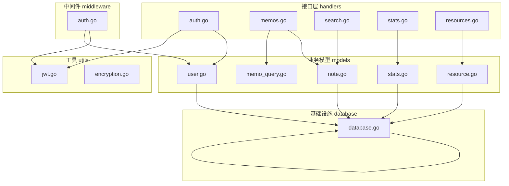
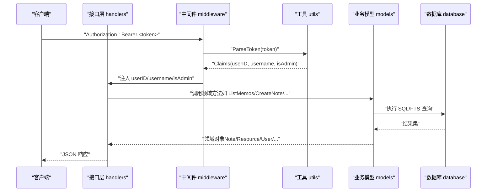
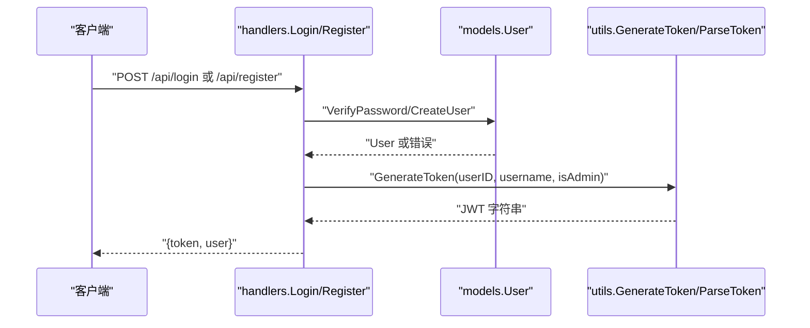
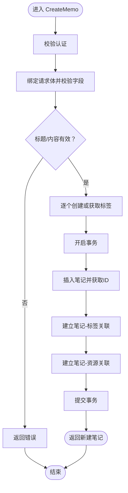
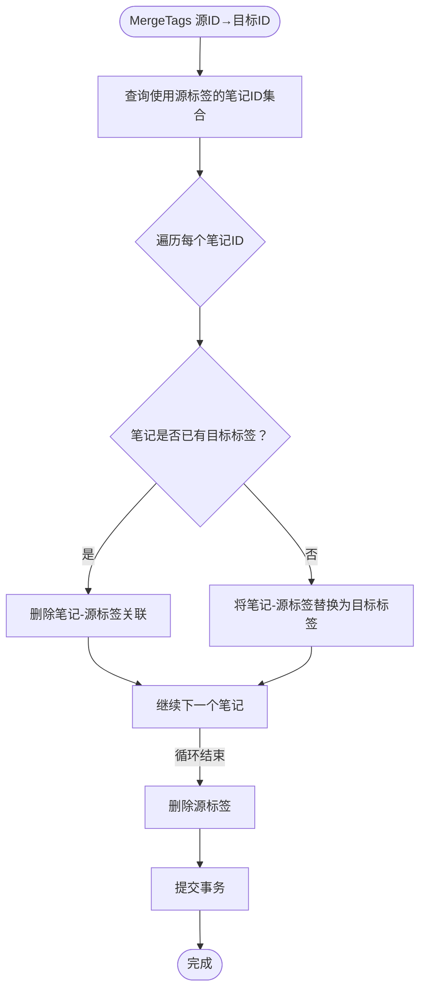
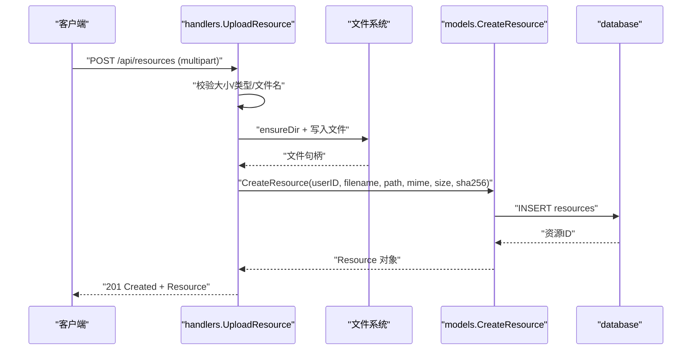
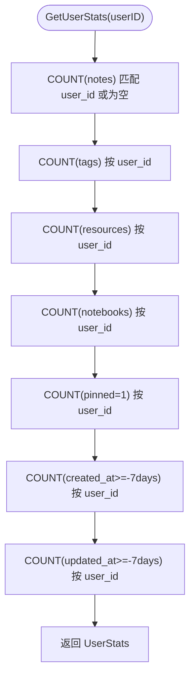
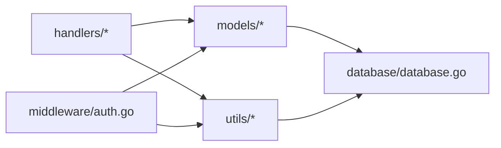

# 业务逻辑层

<cite>
**本文引用的文件**
- [backend/handlers/auth.go](file://backend/handlers/auth.go)
- [backend/handlers/memos.go](file://backend/handlers/memos.go)
- [backend/handlers/search.go](file://backend/handlers/search.go)
- [backend/handlers/stats.go](file://backend/handlers/stats.go)
- [backend/handlers/resources.go](file://backend/handlers/resources.go)
- [backend/middleware/auth.go](file://backend/middleware/auth.go)
- [backend/utils/encryption.go](file://backend/utils/encryption.go)
- [backend/utils/jwt.go](file://backend/utils/jwt.go)
- [backend/models/user.go](file://backend/models/user.go)
- [backend/models/note.go](file://backend/models/note.go)
- [backend/models/memo_query.go](file://backend/models/memo_query.go)
- [backend/models/resource.go](file://backend/models/resource.go)
- [backend/models/stats.go](file://backend/models/stats.go)
- [backend/database/database.go](file://backend/database/database.go)
</cite>

## 目录
1. [简介](#简介)
2. [项目结构](#项目结构)
3. [核心组件](#核心组件)
4. [架构总览](#架构总览)
5. [详细组件分析](#详细组件分析)
6. [依赖关系分析](#依赖关系分析)
7. [性能考量](#性能考量)
8. [故障排查指南](#故障排查指南)
9. [结论](#结论)

## 简介
本文件面向 Memo Studio 的业务逻辑层，系统性梳理并解释以下关键能力：
- 用户认证服务：密码加密、JWT 令牌生成与解析、权限校验与中间件集成
- 笔记管理服务：笔记创建、更新、删除、搜索的业务规则与数据处理
- 标签管理服务：标签创建、更新、删除、合并算法与颜色派生策略
- 文件处理服务：文件上传、类型与大小限制、存储路径与 URL 生成
- 统计计算服务：使用统计、时间窗口统计、位置聚合
- 业务规则与异常处理：参数校验、数据完整性、权限控制与错误响应

## 项目结构
业务逻辑层主要分布在以下模块：
- handlers：HTTP 请求入口与参数解析、调用 models 层并返回响应
- middleware：认证与授权中间件，注入用户上下文
- models：领域模型与数据访问，封装 SQL 与业务规则
- utils：通用工具，如 JWT、加密与令牌生成
- database：数据库初始化与迁移，确保 schema 与 FTS5 支持

图表来源
- [backend/handlers/auth.go](file://backend/handlers/auth.go#L1-L111)
- [backend/handlers/memos.go](file://backend/handlers/memos.go#L1-L280)
- [backend/handlers/search.go](file://backend/handlers/search.go#L1-L45)
- [backend/handlers/stats.go](file://backend/handlers/stats.go#L1-L24)
- [backend/handlers/resources.go](file://backend/handlers/resources.go#L1-L225)
- [backend/middleware/auth.go](file://backend/middleware/auth.go#L1-L71)
- [backend/utils/jwt.go](file://backend/utils/jwt.go#L1-L76)
- [backend/utils/encryption.go](file://backend/utils/encryption.go#L1-L107)
- [backend/models/user.go](file://backend/models/user.go#L1-L233)
- [backend/models/note.go](file://backend/models/note.go#L1-L846)
- [backend/models/memo_query.go](file://backend/models/memo_query.go#L1-L217)
- [backend/models/resource.go](file://backend/models/resource.go#L1-L187)
- [backend/models/stats.go](file://backend/models/stats.go#L1-L66)
- [backend/database/database.go](file://backend/database/database.go#L1-L677)

章节来源
- [backend/handlers/auth.go](file://backend/handlers/auth.go#L1-L111)
- [backend/handlers/memos.go](file://backend/handlers/memos.go#L1-L280)
- [backend/handlers/resources.go](file://backend/handlers/resources.go#L1-L225)
- [backend/middleware/auth.go](file://backend/middleware/auth.go#L1-L71)
- [backend/models/note.go](file://backend/models/note.go#L1-L846)
- [backend/models/memo_query.go](file://backend/models/memo_query.go#L1-L217)
- [backend/models/resource.go](file://backend/models/resource.go#L1-L187)
- [backend/models/stats.go](file://backend/models/stats.go#L1-L66)
- [backend/database/database.go](file://backend/database/database.go#L1-L677)

## 核心组件
- 认证与授权
  - 登录/注册：参数校验、密码哈希、JWT 生成
  - 中间件：提取 Authorization Bearer Token、解析并注入用户上下文
- 笔记管理
  - 列表/创建/更新/删除：参数清洗、标签创建与关联、资源关联、权限校验
  - 搜索：全文检索（FTS5）与多维筛选（时间、标签、置顶、类型）
- 标签管理
  - 标签创建、更新、删除、合并：事务保障、去重与冲突处理
  - 颜色派生：基于标签名的稳定哈希颜色
- 文件处理
  - 上传：大小限制、类型与文件名清洗、存储路径组织、SHA256 校验、URL 生成
- 统计计算
  - 用户维度统计：笔记数、标签数、资源数、笔记本数、置顶数、近七日新增/更新

章节来源
- [backend/handlers/auth.go](file://backend/handlers/auth.go#L27-L93)
- [backend/middleware/auth.go](file://backend/middleware/auth.go#L12-L71)
- [backend/handlers/memos.go](file://backend/handlers/memos.go#L78-L278)
- [backend/models/memo_query.go](file://backend/models/memo_query.go#L24-L152)
- [backend/models/note.go](file://backend/models/note.go#L46-L168)
- [backend/handlers/resources.go](file://backend/handlers/resources.go#L91-L155)
- [backend/models/resource.go](file://backend/models/resource.go#L36-L169)
- [backend/handlers/stats.go](file://backend/handlers/stats.go#L11-L23)
- [backend/models/stats.go](file://backend/models/stats.go#L18-L65)

## 架构总览
业务逻辑层采用“接口层 → 中间件 → 业务模型 → 数据库”的分层设计，接口层负责参数解析与响应封装，中间件负责认证与权限注入，业务模型封装领域规则与数据访问，数据库负责持久化与迁移。

图表来源
- [backend/middleware/auth.go](file://backend/middleware/auth.go#L12-L52)
- [backend/utils/jwt.go](file://backend/utils/jwt.go#L51-L66)
- [backend/handlers/memos.go](file://backend/handlers/memos.go#L78-L137)
- [backend/models/memo_query.go](file://backend/models/memo_query.go#L24-L152)
- [backend/database/database.go](file://backend/database/database.go#L20-L60)

## 详细组件分析

### 用户认证服务
- 密码加密与校验
  - 注册与登录均使用 bcrypt 进行密码哈希与比对
  - 用户模型提供创建、按用户名/ID 查询与密码验证
- JWT 令牌
  - 生成：包含用户 ID、用户名、是否管理员、签发/过期时间
  - 解析：校验签名与有效期，支持刷新
  - 安全：生产环境必须设置 MEMO_JWT_SECRET
- 权限校验
  - 中间件从 Authorization 提取 Bearer Token，解析后注入上下文
  - 管理员权限兜底：若 token 缺失 is_admin 字段，从数据库补全

图表来源
- [backend/handlers/auth.go](file://backend/handlers/auth.go#L27-L93)
- [backend/models/user.go](file://backend/models/user.go#L22-L110)
- [backend/utils/jwt.go](file://backend/utils/jwt.go#L29-L49)

章节来源
- [backend/handlers/auth.go](file://backend/handlers/auth.go#L11-L93)
- [backend/models/user.go](file://backend/models/user.go#L22-L110)
- [backend/utils/jwt.go](file://backend/utils/jwt.go#L11-L76)
- [backend/middleware/auth.go](file://backend/middleware/auth.go#L12-L71)

### 笔记管理服务
- 业务规则
  - 标题与内容不能同时为空
  - content_type 仅支持 markdown
  - 标签自动创建（去空白、去重、用户隔离）
  - 资源 ID 自动关联（忽略非正整数）
  - 权限校验：笔记 user_id 必须匹配当前用户，或历史数据为空时允许
- 数据处理
  - 列表：支持分页、标签过滤、时间范围、置顶优先、FTS5 排序
  - 搜索：兼容旧接口，统一走 memos 查询
  - 创建/更新：事务包裹标签与资源关联，确保一致性
  - 删除：支持单条与批量删除

图表来源
- [backend/handlers/memos.go](file://backend/handlers/memos.go#L139-L188)
- [backend/models/note.go](file://backend/models/note.go#L46-L105)
- [backend/models/memo_query.go](file://backend/models/memo_query.go#L24-L152)

章节来源
- [backend/handlers/memos.go](file://backend/handlers/memos.go#L78-L278)
- [backend/models/note.go](file://backend/models/note.go#L46-L168)
- [backend/models/memo_query.go](file://backend/models/memo_query.go#L24-L152)
- [backend/handlers/search.go](file://backend/handlers/search.go#L13-L43)

### 标签管理服务
- 标签创建与更新
  - CreateTagIfNotExists：按用户隔离，不存在则创建并分配颜色
  - UpdateTag：更新名称与颜色
  - DeleteTag：先解除笔记关联，再删除标签
- 标签合并算法
  - 获取使用源标签的所有笔记
  - 对每篇笔记：若已有目标标签则仅删除源标签，否则替换为目标标签
  - 删除源标签，提交事务

图表来源
- [backend/models/note.go](file://backend/models/note.go#L670-L729)

章节来源
- [backend/models/note.go](file://backend/models/note.go#L594-L729)

### 文件处理服务
- 上传流程
  - 限制最大 20MB，multipart/form-data
  - 文件名清洗（仅保留安全字符），生成随机后缀
  - 存储路径按“用户段/日期段/文件名”，支持公共与私有区分
  - 计算 SHA256，写入数据库资源记录
  - 返回资源对象（包含 URL）
- 资源列表与删除
  - 分页列出当前用户资源
  - 删除仅删除数据库记录（物理文件可由定时任务清理）

图表来源
- [backend/handlers/resources.go](file://backend/handlers/resources.go#L91-L155)
- [backend/models/resource.go](file://backend/models/resource.go#L36-L56)

章节来源
- [backend/handlers/resources.go](file://backend/handlers/resources.go#L91-L225)
- [backend/models/resource.go](file://backend/models/resource.go#L22-L187)

### 统计计算服务
- 用户统计
  - 总笔记数、标签数、资源数、笔记本数、置顶数
  - 近七日新增/更新数量（按 created_at/updated_at）
- 实现要点
  - 覆盖历史数据：notes.user_id 可为空，仍计入统计
  - 时间窗口：使用 SQLite datetime 函数进行区间计算

图表来源
- [backend/models/stats.go](file://backend/models/stats.go#L18-L65)
- [backend/handlers/stats.go](file://backend/handlers/stats.go#L11-L23)

章节来源
- [backend/models/stats.go](file://backend/models/stats.go#L7-L66)
- [backend/handlers/stats.go](file://backend/handlers/stats.go#L11-L23)

### 业务规则与异常处理
- 参数校验
  - 登录/注册：必填字段、长度校验
  - 列表/创建/更新：字段长度、布尔值解析、时间格式解析
- 数据完整性
  - 事务：笔记创建/更新、标签合并
  - FTS5：全文索引与触发器维护
- 权限控制
  - 中间件：未提供/格式错误/无效令牌统一 401
  - 管理员：AdminOnly 中间件
- 错误处理
  - 统一返回 JSON 错误消息，状态码与错误类型明确

章节来源
- [backend/handlers/auth.go](file://backend/handlers/auth.go#L27-L93)
- [backend/handlers/memos.go](file://backend/handlers/memos.go#L78-L278)
- [backend/middleware/auth.go](file://backend/middleware/auth.go#L12-L71)
- [backend/database/database.go](file://backend/database/database.go#L243-L374)

## 依赖关系分析
- 组件耦合
  - handlers 依赖 models 与 utils，低耦合高内聚
  - middleware 仅依赖 utils 与 models 的用户查询
- 外部依赖
  - SQLite（go-sqlite3）、FTS5（需编译 tag）、bcrypt、JWT 库
- 数据库演进
  - 通过迁移脚本逐步添加列与表，确保向后兼容与多用户隔离

图表来源
- [backend/handlers/memos.go](file://backend/handlers/memos.go#L1-L14)
- [backend/middleware/auth.go](file://backend/middleware/auth.go#L1-L10)
- [backend/models/note.go](file://backend/models/note.go#L1-L9)
- [backend/database/database.go](file://backend/database/database.go#L1-L16)

章节来源
- [backend/handlers/memos.go](file://backend/handlers/memos.go#L1-L14)
- [backend/middleware/auth.go](file://backend/middleware/auth.go#L1-L10)
- [backend/models/note.go](file://backend/models/note.go#L1-L9)
- [backend/database/database.go](file://backend/database/database.go#L62-L178)

## 性能考量
- 查询优化
  - 列表查询支持 LIMIT/OFFSET 与多维过滤，FTS5 按 bm25 排序
  - 标签过滤时使用 DISTINCT 避免重复行
- I/O 与并发
  - 上传文件采用流式写入与 SHA256 同步计算，减少内存占用
  - SQLite 使用 WAL 模式与 busy_timeout，提升并发稳定性
- 建议
  - 大列表场景增加索引覆盖（如 content_type、pinned、created_at）
  - 资源列表可考虑缓存热点数据

## 故障排查指南
- 认证相关
  - 未提供/格式错误/无效令牌：检查 Authorization 头与 JWT Secret 设置
  - 管理员权限缺失：确认 is_admin 字段或数据库兜底
- 笔记相关
  - 权限拒绝：确认笔记 user_id 与当前用户一致
  - 搜索无结果：确认 FTS5 是否启用（编译 tag）
- 文件上传
  - 文件过大/类型不符：检查上传大小限制与 Content-Type
  - 路径写入失败：确认存储目录权限与磁盘空间
- 统计异常
  - 时间窗口不正确：核对 SQLite datetime 表达式与时区设置

章节来源
- [backend/middleware/auth.go](file://backend/middleware/auth.go#L12-L71)
- [backend/handlers/memos.go](file://backend/handlers/memos.go#L62-L76)
- [backend/database/database.go](file://backend/database/database.go#L254-L276)
- [backend/handlers/resources.go](file://backend/handlers/resources.go#L91-L155)
- [backend/models/stats.go](file://backend/models/stats.go#L18-L65)

## 结论
Memo Studio 业务逻辑层以清晰的分层与完善的中间件机制为基础，结合 SQLite 的轻量特性与 FTS5 的全文检索能力，实现了从认证、笔记、标签、文件到统计的完整闭环。通过事务、参数校验与权限控制，保障了数据一致性与安全性。建议在生产环境中强化 JWT 密钥管理、监控数据库性能并持续优化查询路径。