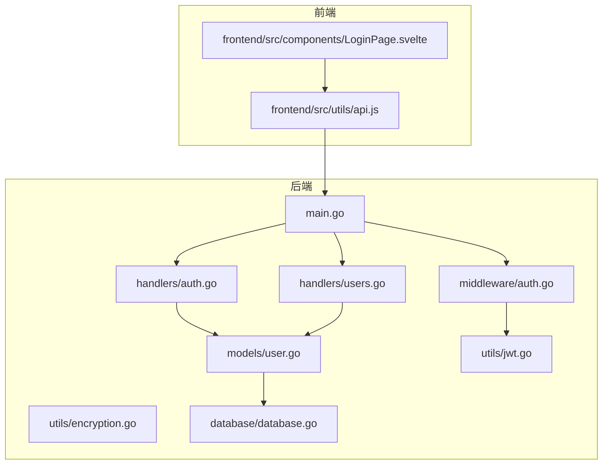
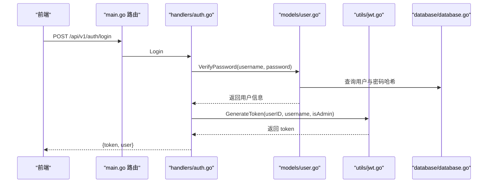
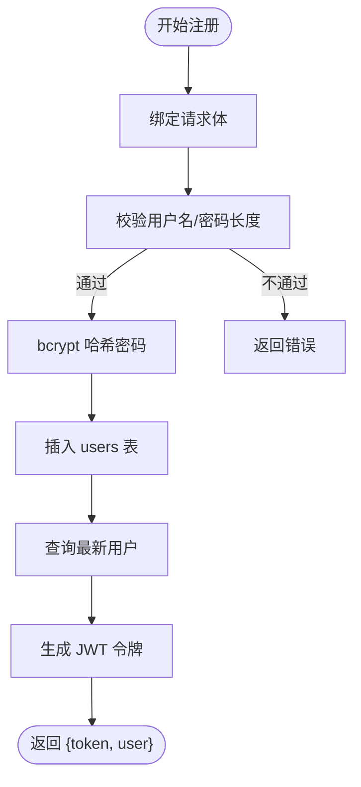
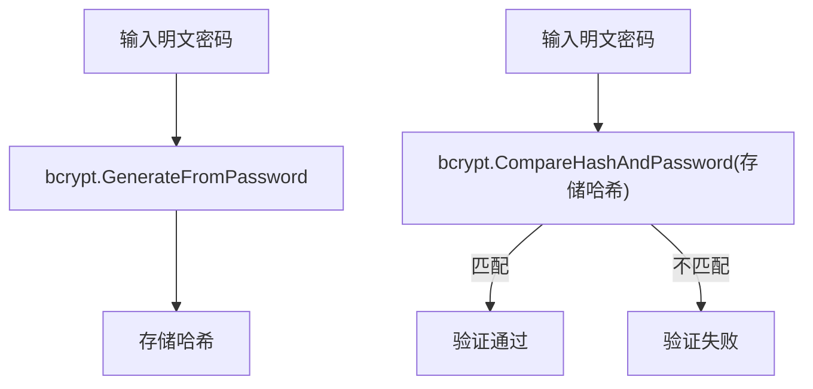
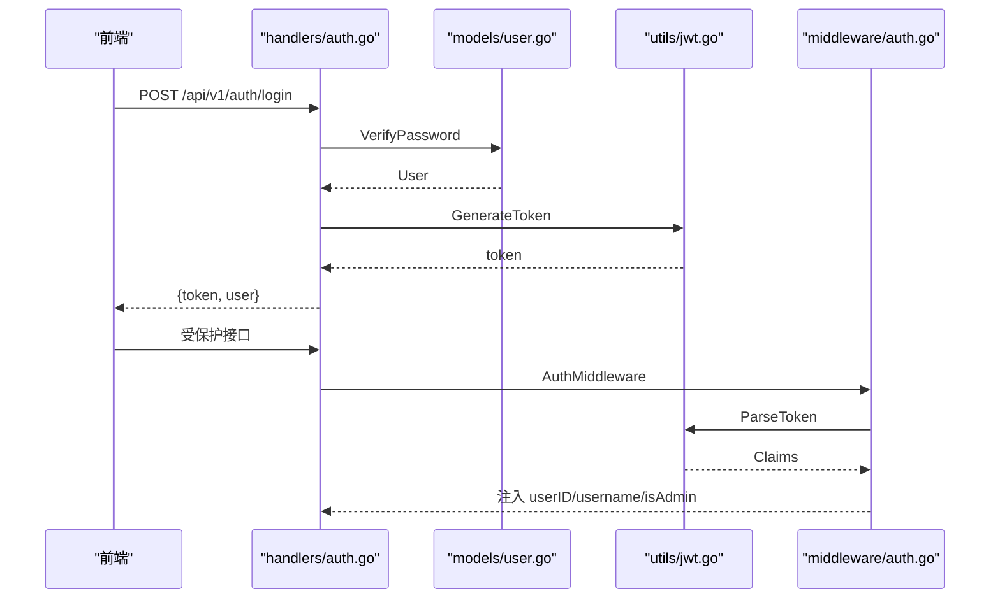
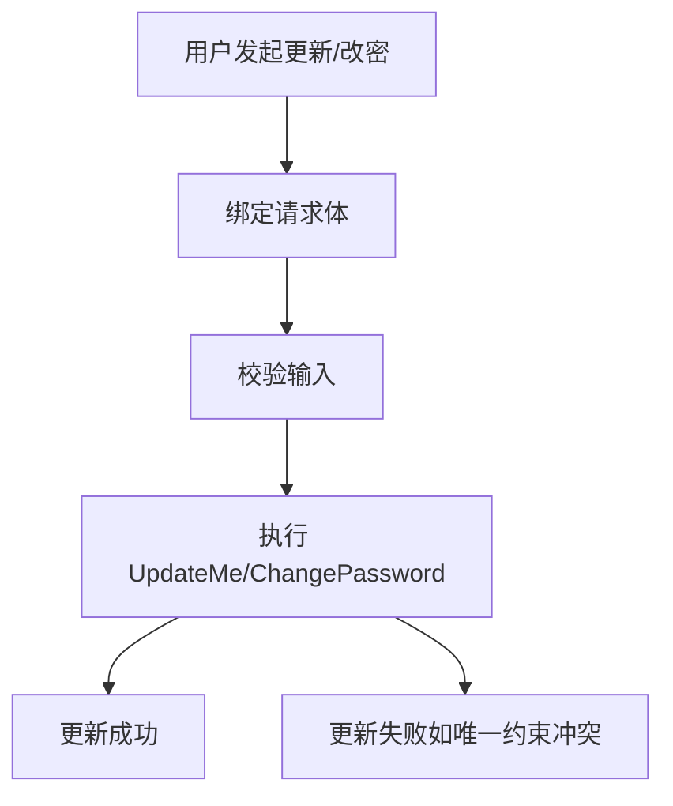
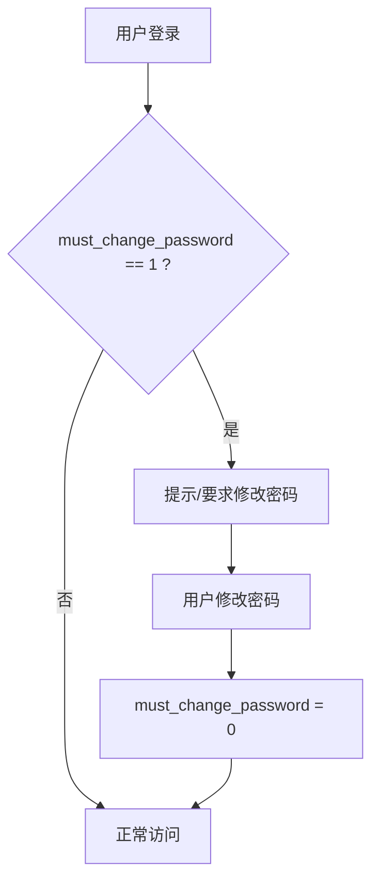
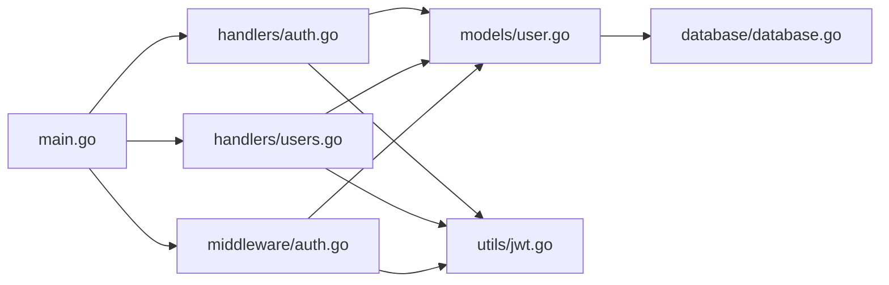

# 用户服务

<cite>
**本文引用的文件**
- [backend/models/user.go](file://backend/models/user.go)
- [backend/handlers/auth.go](file://backend/handlers/auth.go)
- [backend/handlers/users.go](file://backend/handlers/users.go)
- [backend/utils/jwt.go](file://backend/utils/jwt.go)
- [backend/utils/encryption.go](file://backend/utils/encryption.go)
- [backend/middleware/auth.go](file://backend/middleware/auth.go)
- [backend/database/database.go](file://backend/database/database.go)
- [backend/main.go](file://backend/main.go)
- [frontend/src/utils/api.js](file://frontend/src/utils/api.js)
- [frontend/src/components/LoginPage.svelte](file://frontend/src/components/LoginPage.svelte)
</cite>

## 目录
1. [简介](#简介)
2. [项目结构](#项目结构)
3. [核心组件](#核心组件)
4. [架构总览](#架构总览)
5. [详细组件分析](#详细组件分析)
6. [依赖关系分析](#依赖关系分析)
7. [性能考量](#性能考量)
8. [故障排查指南](#故障排查指南)
9. [结论](#结论)
10. [附录](#附录)

## 简介
本文件面向 Memo Studio 的用户服务模块，系统化梳理用户认证与授权、密码加密、用户信息管理、权限控制与安全最佳实践。重点覆盖以下方面：
- 用户注册流程与输入校验
- 密码加密机制（bcrypt）与验证流程
- 登录验证、JWT 令牌生成与会话管理
- 个人信息更新、密码修改
- 管理员用户管理能力
- 权限控制（普通用户 vs 管理员）与 must_change_password 字段的作用
- 错误处理策略与安全建议

## 项目结构
用户服务涉及后端 Go 语言实现与前端 Svelte 组件协同，核心文件分布如下：
- 后端
  - 数据模型与业务逻辑：backend/models/user.go
  - 认证与用户接口：backend/handlers/auth.go、backend/handlers/users.go
  - JWT 与加密工具：backend/utils/jwt.go、backend/utils/encryption.go
  - 中间件：backend/middleware/auth.go
  - 数据库初始化与迁移：backend/database/database.go
  - 路由与入口：backend/main.go
- 前端
  - API 调用封装：frontend/src/utils/api.js
  - 登录/注册界面：frontend/src/components/LoginPage.svelte

图表来源
- [backend/main.go](file://backend/main.go#L94-L196)
- [backend/middleware/auth.go](file://backend/middleware/auth.go#L12-L52)
- [backend/utils/jwt.go](file://backend/utils/jwt.go#L22-L66)
- [backend/handlers/auth.go](file://backend/handlers/auth.go#L27-L53)
- [backend/handlers/users.go](file://backend/handlers/users.go#L37-L96)
- [backend/models/user.go](file://backend/models/user.go#L22-L149)
- [backend/database/database.go](file://backend/database/database.go#L299-L307)
- [frontend/src/utils/api.js](file://frontend/src/utils/api.js#L115-L143)
- [frontend/src/components/LoginPage.svelte](file://frontend/src/components/LoginPage.svelte#L23-L71)

章节来源
- [backend/main.go](file://backend/main.go#L94-L196)

## 核心组件
- 用户模型与业务逻辑
  - 用户实体字段：ID、用户名、邮箱、是否管理员、must_change_password、创建时间
  - 核心方法：CreateUser、VerifyPassword、UpdateMe、ChangePassword、AdminCreateUser、AdminListUsers、AdminUpdateUser、AdminDeleteUser
- 认证与用户接口
  - 登录/注册处理器：Login、Register、GetCurrentUser
  - 用户信息接口：GetMe、UpdateMe、ChangeMyPassword
  - 管理员接口：AdminListUsers、AdminCreateUser、AdminUpdateUser、AdminDeleteUser
- JWT 与加密工具
  - JWT Claims 结构、令牌生成与解析、刷新
  - bcrypt 密码哈希与验证
- 中间件
  - AuthMiddleware：提取 Authorization 头、解析 JWT、注入用户上下文
  - AdminOnly：管理员权限校验
- 数据库初始化与迁移
  - users 表结构、is_admin、must_change_password 字段迁移与引导
- 前端集成
  - 登录/注册 UI 与 API 调用封装

章节来源
- [backend/models/user.go](file://backend/models/user.go#L13-L20)
- [backend/handlers/auth.go](file://backend/handlers/auth.go#L27-L93)
- [backend/handlers/users.go](file://backend/handlers/users.go#L37-L171)
- [backend/utils/jwt.go](file://backend/utils/jwt.go#L22-L76)
- [backend/utils/encryption.go](file://backend/utils/encryption.go#L93-L106)
- [backend/middleware/auth.go](file://backend/middleware/auth.go#L12-L70)
- [backend/database/database.go](file://backend/database/database.go#L440-L498)

## 架构总览
用户服务采用分层架构：
- 路由层：main.go 定义公开与受保护路由组，绑定 handlers
- 中间件层：AuthMiddleware 校验 JWT，AdminOnly 限制管理员操作
- 控制器层：handlers/auth.go 与 handlers/users.go 处理请求与响应
- 业务层：models/user.go 实现用户相关业务逻辑
- 工具层：utils/jwt.go 与 utils/encryption.go 提供 JWT 与 bcrypt 能力
- 数据访问层：database/database.go 负责数据库初始化与迁移

图表来源
- [backend/main.go](file://backend/main.go#L94-L102)
- [backend/handlers/auth.go](file://backend/handlers/auth.go#L27-L53)
- [backend/models/user.go](file://backend/models/user.go#L78-L110)
- [backend/utils/jwt.go](file://backend/utils/jwt.go#L29-L49)
- [backend/database/database.go](file://backend/database/database.go#L440-L498)

## 详细组件分析

### 用户注册流程
- 输入校验
  - 前端：用户名长度至少 3，密码长度至少 6
  - 后端：用户名长度至少 3，密码长度至少 6
- 密码加密
  - 使用 bcrypt 生成哈希
- 数据持久化
  - 插入 users 表，is_admin 默认 0，must_change_password 默认 0
- 返回
  - 成功返回新用户与 JWT 令牌

图表来源
- [backend/handlers/auth.go](file://backend/handlers/auth.go#L55-L93)
- [backend/models/user.go](file://backend/models/user.go#L22-L44)
- [backend/utils/jwt.go](file://backend/utils/jwt.go#L29-L49)

章节来源
- [frontend/src/components/LoginPage.svelte](file://frontend/src/components/LoginPage.svelte#L43-L71)
- [backend/handlers/auth.go](file://backend/handlers/auth.go#L55-L93)
- [backend/models/user.go](file://backend/models/user.go#L22-L44)

### 密码加密机制（bcrypt）
- 生成哈希
  - 注册与管理员创建用户时，使用 bcrypt.DefaultCost 生成密码哈希
- 验证哈希
  - 登录时查询用户密码哈希并使用 bcrypt.CompareHashAndPassword 校验
- 修改密码
  - ChangePassword 先校验旧密码，再生成新哈希并更新；成功后清零 must_change_password

图表来源
- [backend/models/user.go](file://backend/models/user.go#L25-L28)
- [backend/models/user.go](file://backend/models/user.go#L97-L100)
- [backend/models/user.go](file://backend/models/user.go#L140-L148)
- [backend/utils/encryption.go](file://backend/utils/encryption.go#L93-L106)

章节来源
- [backend/models/user.go](file://backend/models/user.go#L22-L44)
- [backend/models/user.go](file://backend/models/user.go#L78-L110)
- [backend/models/user.go](file://backend/models/user.go#L128-L149)

### 用户登录验证与 JWT 令牌
- 登录流程
  - handlers/auth.go 接收用户名与密码
  - models/user.go 验证密码并返回用户信息
  - utils/jwt.go 生成 JWT 令牌（默认 24 小时有效）
- 会话管理
  - 前端通过 localStorage 存储 token
  - api.js 自动在请求头添加 Authorization: Bearer token
  - 中间件 AuthMiddleware 解析 JWT 并注入 userID、username、isAdmin

图表来源
- [backend/handlers/auth.go](file://backend/handlers/auth.go#L27-L53)
- [backend/models/user.go](file://backend/models/user.go#L78-L110)
- [backend/utils/jwt.go](file://backend/utils/jwt.go#L29-L66)
- [backend/middleware/auth.go](file://backend/middleware/auth.go#L12-L52)
- [frontend/src/utils/api.js](file://frontend/src/utils/api.js#L115-L143)

章节来源
- [backend/handlers/auth.go](file://backend/handlers/auth.go#L27-L53)
- [backend/utils/jwt.go](file://backend/utils/jwt.go#L29-L66)
- [backend/middleware/auth.go](file://backend/middleware/auth.go#L12-L52)
- [frontend/src/utils/api.js](file://frontend/src/utils/api.js#L52-L76)

### 用户信息管理
- 个人信息更新（UpdateMe）
  - 仅允许当前用户更新自己的用户名与邮箱
  - 前端调用 PUT /api/v1/users/me
- 密码修改（ChangeMyPassword）
  - 校验旧密码，生成新哈希并更新
  - 成功后清零 must_change_password
- 管理员用户管理
  - 列表：GET /api/v1/users
  - 创建：POST /api/v1/users（可指定 is_admin）
  - 更新：PUT /api/v1/users/:id（可变更 is_admin）
  - 删除：DELETE /api/v1/users/:id（禁止删除默认管理员）

图表来源
- [backend/handlers/users.go](file://backend/handlers/users.go#L51-L96)
- [backend/models/user.go](file://backend/models/user.go#L112-L149)
- [backend/handlers/users.go](file://backend/handlers/users.go#L98-L171)
- [backend/models/user.go](file://backend/models/user.go#L158-L187)

章节来源
- [backend/handlers/users.go](file://backend/handlers/users.go#L51-L96)
- [backend/models/user.go](file://backend/models/user.go#L112-L149)
- [backend/handlers/users.go](file://backend/handlers/users.go#L98-L171)
- [backend/models/user.go](file://backend/models/user.go#L158-L187)

### 权限控制与 must_change_password 字段
- 权限控制
  - AuthMiddleware：解析 JWT 并注入 userID/username/isAdmin
  - AdminOnly：校验 isAdmin=true，否则返回 403
- must_change_password
  - 数据库迁移引入 must_change_password 字段
  - 注册与管理员创建用户默认为 0；修改密码成功后清零
  - 用于强制用户首次登录后修改密码的策略（可在前端或业务层扩展）

图表来源
- [backend/database/database.go](file://backend/database/database.go#L454-L462)
- [backend/models/user.go](file://backend/models/user.go#L145-L147)
- [backend/middleware/auth.go](file://backend/middleware/auth.go#L54-L70)

章节来源
- [backend/database/database.go](file://backend/database/database.go#L454-L462)
- [backend/models/user.go](file://backend/models/user.go#L145-L147)
- [backend/middleware/auth.go](file://backend/middleware/auth.go#L54-L70)

### 核心方法使用示例（路径指引）
- CreateUser
  - 路径：[backend/models/user.go](file://backend/models/user.go#L22-L44)
  - 用途：注册时创建用户并返回用户信息
- VerifyPassword
  - 路径：[backend/models/user.go](file://backend/models/user.go#L78-L110)
  - 用途：登录时验证用户名与密码
- UpdateMe
  - 路径：[backend/models/user.go](file://backend/models/user.go#L112-L126)
  - 用途：当前用户更新个人信息
- ChangePassword
  - 路径：[backend/models/user.go](file://backend/models/user.go#L128-L149)
  - 用途：当前用户修改密码

章节来源
- [backend/models/user.go](file://backend/models/user.go#L22-L44)
- [backend/models/user.go](file://backend/models/user.go#L78-L110)
- [backend/models/user.go](file://backend/models/user.go#L112-L126)
- [backend/models/user.go](file://backend/models/user.go#L128-L149)

## 依赖关系分析
- 组件耦合
  - handlers 依赖 models 与 utils
  - models 依赖 database
  - middleware 依赖 utils 与 models
  - main.go 组织路由、中间件与 handlers
- 外部依赖
  - JWT：github.com/golang-jwt/jwt/v5
  - bcrypt：golang.org/x/crypto/bcrypt
  - SQLite：mattn/go-sqlite3
- 潜在循环依赖
  - 当前结构清晰，无明显循环导入

图表来源
- [backend/main.go](file://backend/main.go#L94-L196)
- [backend/middleware/auth.go](file://backend/middleware/auth.go#L12-L52)
- [backend/handlers/auth.go](file://backend/handlers/auth.go#L27-L53)
- [backend/handlers/users.go](file://backend/handlers/users.go#L37-L96)
- [backend/models/user.go](file://backend/models/user.go#L22-L149)
- [backend/database/database.go](file://backend/database/database.go#L299-L307)
- [backend/utils/jwt.go](file://backend/utils/jwt.go#L29-L66)

章节来源
- [backend/main.go](file://backend/main.go#L94-L196)
- [backend/middleware/auth.go](file://backend/middleware/auth.go#L12-L52)
- [backend/handlers/auth.go](file://backend/handlers/auth.go#L27-L53)
- [backend/handlers/users.go](file://backend/handlers/users.go#L37-L96)
- [backend/models/user.go](file://backend/models/user.go#L22-L149)
- [backend/database/database.go](file://backend/database/database.go#L299-L307)
- [backend/utils/jwt.go](file://backend/utils/jwt.go#L29-L66)

## 性能考量
- 密码哈希成本
  - bcrypt.DefaultCost 已平衡安全与性能；若硬件资源紧张，可考虑降低成本但需权衡风险
- 数据库连接与事务
  - 迁移与 DDL 使用单连接避免 schema 可见性问题，减少并发迁移风险
- JWT 体积与解析
  - Claims 字段精简，避免携带冗余信息；解析失败快速返回
- 前端请求头
  - 统一添加 Authorization 头，减少重复逻辑

[本节为通用指导，不直接分析具体文件]

## 故障排查指南
- 登录失败
  - 检查用户名/密码是否正确；确认 bcrypt 哈希匹配
  - 查看 handlers/auth.go 的错误响应
- 注册失败
  - 检查用户名唯一性与长度、密码长度；查看 models/user.go 的 CreateUser 返回
- 更新失败
  - UpdateMe/ChangeMyPassword 返回 400 或 500，检查唯一约束冲突或数据库错误
- 权限不足
  - 管理员接口返回 403，确认 is_admin 标志与 AdminOnly 中间件
- JWT 无效
  - 检查 MEMO_JWT_SECRET 环境变量；确认 Authorization 头格式为 Bearer token

章节来源
- [backend/handlers/auth.go](file://backend/handlers/auth.go#L27-L53)
- [backend/handlers/auth.go](file://backend/handlers/auth.go#L55-L93)
- [backend/handlers/users.go](file://backend/handlers/users.go#L51-L96)
- [backend/middleware/auth.go](file://backend/middleware/auth.go#L54-L70)
- [backend/utils/jwt.go](file://backend/utils/jwt.go#L13-L20)

## 结论
Memo Studio 用户服务模块以清晰的分层设计实现了完整的认证与授权流程，结合 bcrypt 密码哈希与 JWT 令牌机制，提供了安全可靠的用户管理能力。通过 must_change_password 字段与管理员权限控制，进一步增强了系统的安全策略。建议在生产环境中严格配置 JWT 密钥与 CORS 策略，并持续监控与审计用户行为。

[本节为总结性内容，不直接分析具体文件]

## 附录

### API 定义与使用要点
- 登录
  - 方法：POST /api/v1/auth/login
  - 请求体：{ username, password }
  - 响应：{ token, user }
- 注册
  - 方法：POST /api/v1/auth/register
  - 请求体：{ username, password, email? }
  - 响应：{ token, user }
- 获取当前用户
  - 方法：GET /api/v1/auth/me
  - 需要：Authorization: Bearer token
- 更新个人信息
  - 方法：PUT /api/v1/users/me
  - 请求体：{ username, email }
- 修改密码
  - 方法：PUT /api/v1/users/me/password
  - 请求体：{ old_password, new_password }
- 管理员：列出用户
  - 方法：GET /api/v1/users
  - 需要：管理员权限
- 管理员：创建用户
  - 方法：POST /api/v1/users
  - 请求体：{ username, password, email?, is_admin? }
- 管理员：更新用户
  - 方法：PUT /api/v1/users/:id
  - 请求体：{ username, email, is_admin }
- 管理员：删除用户
  - 方法：DELETE /api/v1/users/:id

章节来源
- [backend/main.go](file://backend/main.go#L94-L196)
- [backend/handlers/auth.go](file://backend/handlers/auth.go#L27-L93)
- [backend/handlers/users.go](file://backend/handlers/users.go#L37-L171)