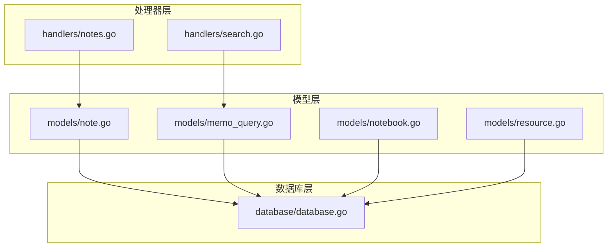
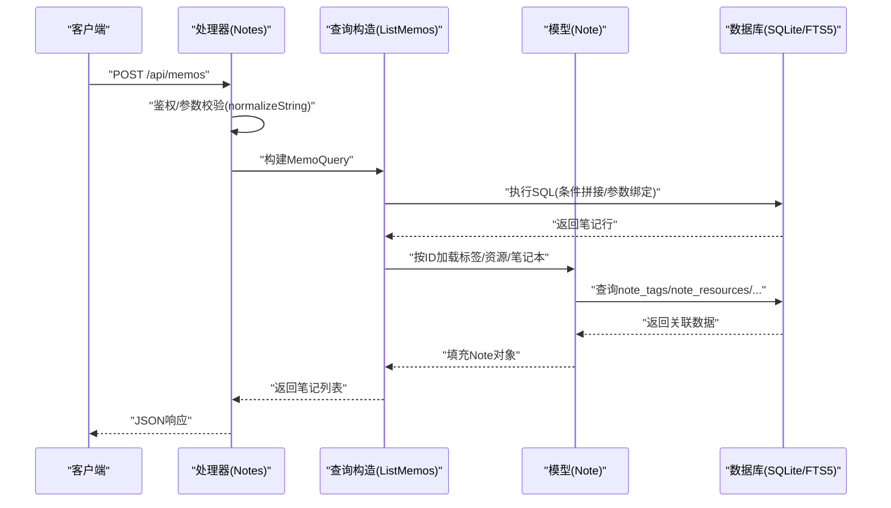
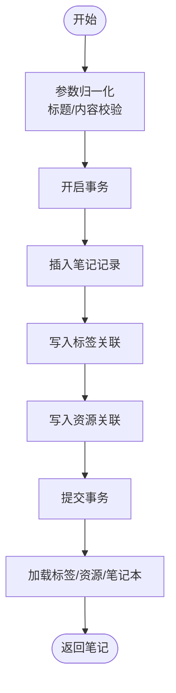
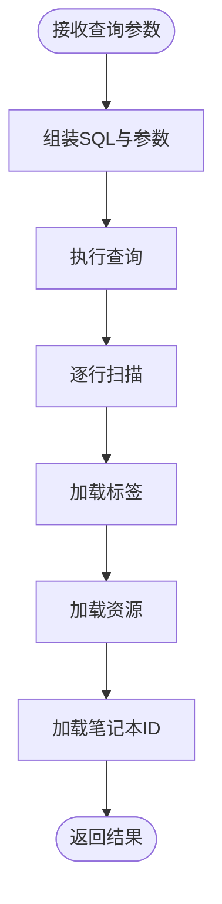
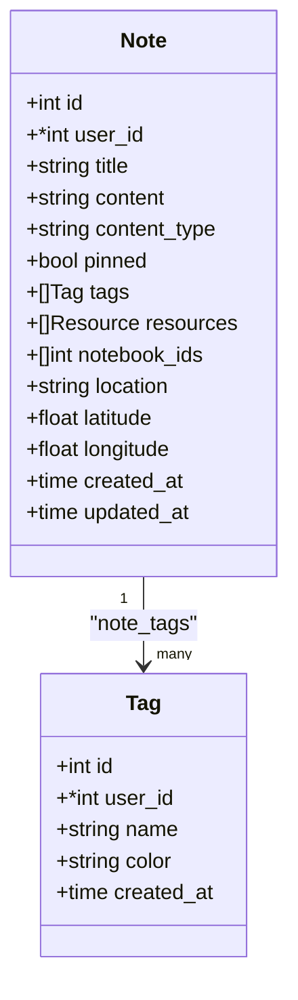
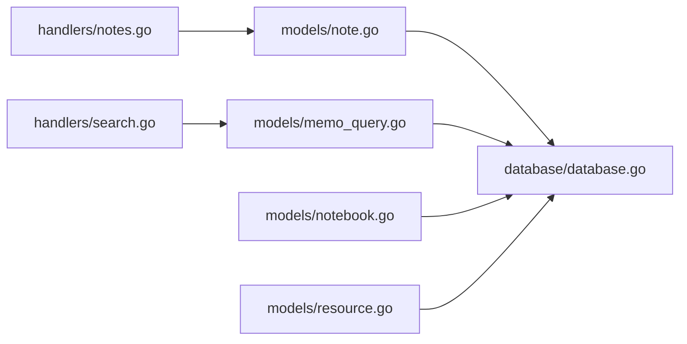

# 笔记服务

<cite>
**本文引用的文件**
- [backend/models/note.go](file://backend/models/note.go)
- [backend/handlers/notes.go](file://backend/handlers/notes.go)
- [backend/handlers/search.go](file://backend/handlers/search.go)
- [backend/models/memo_query.go](file://backend/models/memo_query.go)
- [backend/database/database.go](file://backend/database/database.go)
- [backend/models/notebook.go](file://backend/models/notebook.go)
- [backend/models/resource.go](file://backend/models/resource.go)
- [frontend/src/utils/backup.js](file://frontend/src/utils/backup.js)
- [kit/src/lib/miniMarkdown.js](file://kit/src/lib/miniMarkdown.js)
</cite>

## 目录
1. [简介](#简介)
2. [项目结构](#项目结构)
3. [核心组件](#核心组件)
4. [架构总览](#架构总览)
5. [详细组件分析](#详细组件分析)
6. [依赖分析](#依赖分析)
7. [性能考虑](#性能考虑)
8. [故障排查指南](#故障排查指南)
9. [结论](#结论)
10. [附录](#附录)

## 简介
本文件面向 Memo Studio 的笔记服务模块，系统化梳理笔记 CRUD、搜索、状态管理、标签与内容处理等能力，给出数据流、调用链路、关键算法与优化建议，帮助开发者快速理解与扩展。

## 项目结构
- 后端采用分层设计：处理器层负责路由与参数校验，模型层封装数据库访问与业务逻辑，数据库层负责初始化与迁移。
- 笔记服务涉及的核心文件：
  - 处理器：notes.go、search.go
  - 模型：note.go、memo_query.go、notebook.go、resource.go
  - 数据库：database.go（SQLite + FTS5）

图表来源
- [backend/handlers/notes.go](file://backend/handlers/notes.go#L1-L513)
- [backend/handlers/search.go](file://backend/handlers/search.go#L1-L45)
- [backend/models/note.go](file://backend/models/note.go#L1-L846)
- [backend/models/memo_query.go](file://backend/models/memo_query.go#L1-L217)
- [backend/models/notebook.go](file://backend/models/notebook.go#L1-L206)
- [backend/models/resource.go](file://backend/models/resource.go#L1-L187)
- [backend/database/database.go](file://backend/database/database.go#L1-L677)

章节来源
- [backend/handlers/notes.go](file://backend/handlers/notes.go#L1-L513)
- [backend/handlers/search.go](file://backend/handlers/search.go#L1-L45)
- [backend/models/note.go](file://backend/models/note.go#L1-L846)
- [backend/models/memo_query.go](file://backend/models/memo_query.go#L1-L217)
- [backend/models/notebook.go](file://backend/models/notebook.go#L1-L206)
- [backend/models/resource.go](file://backend/models/resource.go#L1-L187)
- [backend/database/database.go](file://backend/database/database.go#L1-L677)

## 核心组件
- 笔记模型与 CRUD
  - 笔记实体包含标题、内容、类型、置顶、标签、资源、笔记本集合、位置信息及时间戳。
  - 提供创建、更新、删除、批量删除、查询单个与全部笔记的方法。
- 搜索与筛选
  - 支持全文检索（FTS5）、标签过滤、时间范围、置顶优先、内容类型过滤、用户隔离。
- 标签系统
  - 标签与笔记多对多关联；支持按名称创建、更新、删除、合并标签；提供标签计数统计。
- 笔记本与资源
  - 笔记可归属多个笔记本；资源与笔记多对多，支持资源列表与URL生成。
- 内容处理
  - Markdown 渲染（安全转义与链接白名单）；内容清洗（去除特定异常字符串）。
- 状态与草稿
  - 前端侧提供自动草稿保存与恢复；后端提供随机回顾（复习）能力。

章节来源
- [backend/models/note.go](file://backend/models/note.go#L11-L27)
- [backend/models/note.go](file://backend/models/note.go#L46-L199)
- [backend/models/memo_query.go](file://backend/models/memo_query.go#L12-L22)
- [backend/models/memo_query.go](file://backend/models/memo_query.go#L24-L152)
- [backend/models/note.go](file://backend/models/note.go#L394-L424)
- [backend/models/note.go](file://backend/models/note.go#L518-L592)
- [backend/models/notebook.go](file://backend/models/notebook.go#L10-L19)
- [backend/models/notebook.go](file://backend/models/notebook.go#L130-L150)
- [backend/models/resource.go](file://backend/models/resource.go#L10-L20)
- [backend/models/resource.go](file://backend/models/resource.go#L78-L109)
- [frontend/src/utils/backup.js](file://frontend/src/utils/backup.js#L1-L55)
- [kit/src/lib/miniMarkdown.js](file://kit/src/lib/miniMarkdown.js#L1-L50)

## 架构总览
- 请求从处理器进入，进行鉴权与参数校验，随后调用模型层方法；模型层通过数据库层执行SQL与触发器维护FTS索引；最终返回JSON响应。
- 搜索路径：处理器接收查询参数 → 组装MemoQuery → SQL拼接与参数绑定 → 返回结果集并补充标签与资源。

图表来源
- [backend/handlers/notes.go](file://backend/handlers/notes.go#L175-L230)
- [backend/models/memo_query.go](file://backend/models/memo_query.go#L24-L152)
- [backend/models/note.go](file://backend/models/note.go#L518-L266)

章节来源
- [backend/handlers/notes.go](file://backend/handlers/notes.go#L175-L230)
- [backend/models/memo_query.go](file://backend/models/memo_query.go#L24-L152)
- [backend/models/note.go](file://backend/models/note.go#L518-L266)

## 详细组件分析

### 笔记 CRUD 实现
- 创建笔记
  - 参数归一化与校验（标题/内容至少一项非空）。
  - 开启事务：插入笔记、写入标签关联、写入资源关联，提交事务。
  - 返回完整笔记（含标签、资源、笔记本ID列表）。
- 更新笔记
  - 开启事务：更新笔记字段、删除旧标签/资源关联、写入新关联，提交事务。
  - 返回更新后的笔记。
- 删除与批量删除
  - 单条删除：直接删除笔记记录。
  - 批量删除：参数校验后按用户隔离删除。
- 查询
  - 单个：按ID查询并补充标签/资源/笔记本。
  - 全部：按创建时间倒序列出。

图表来源
- [backend/handlers/notes.go](file://backend/handlers/notes.go#L175-L230)
- [backend/models/note.go](file://backend/models/note.go#L46-L105)

章节来源
- [backend/handlers/notes.go](file://backend/handlers/notes.go#L175-L296)
- [backend/models/note.go](file://backend/models/note.go#L46-L199)

### 搜索与筛选（全文/标签/时间/类型）
- 查询入口
  - 兼容旧接口：/api/search → 转发至 /api/memos。
  - 主入口：/api/memos?q=...&tags=...&from=&to=&pinned=&contentType=&limit=&offset=
- 查询构造
  - 条件拼接：FTS5、用户隔离、置顶、内容类型、时间范围、标签（任意匹配）。
  - 排序：置顶优先，FTS时按bm25排序，否则按创建/更新时间倒序。
  - 去重：当存在标签过滤时使用DISTINCT避免重复行。
- 结果加载
  - 逐条扫描结果，补充标签、资源、笔记本ID列表。

图表来源
- [backend/handlers/search.go](file://backend/handlers/search.go#L13-L43)
- [backend/models/memo_query.go](file://backend/models/memo_query.go#L24-L152)
- [backend/models/note.go](file://backend/models/note.go#L518-L266)

章节来源
- [backend/handlers/search.go](file://backend/handlers/search.go#L13-L43)
- [backend/models/memo_query.go](file://backend/models/memo_query.go#L24-L152)

### 标签系统与统计
- 标签创建/更新/删除/合并
  - CreateTagIfNotExists：按用户去重创建。
  - UpdateTag：更新名称与颜色。
  - DeleteTag：先清理笔记关联，再删除标签。
  - MergeTags：将源标签的所有笔记迁移到目标标签，若目标已存在则仅删除源关联。
- 标签统计
  - GetTagsWithCount：按笔记数量降序统计。

图表来源
- [backend/models/note.go](file://backend/models/note.go#L29-L44)
- [backend/models/note.go](file://backend/models/note.go#L11-L27)

章节来源
- [backend/models/note.go](file://backend/models/note.go#L394-L424)
- [backend/models/note.go](file://backend/models/note.go#L518-L592)
- [backend/models/note.go](file://backend/models/note.go#L670-L729)

### 笔记本与资源
- 笔记本
  - 支持列表、详情、创建、更新、删除、按笔记本查询笔记、统计数量。
  - 关联表 note_notebooks 实现多对多。
- 资源
  - 资源表与笔记通过 note_resources 关联，支持按笔记查询资源列表与URL生成。

章节来源
- [backend/models/notebook.go](file://backend/models/notebook.go#L10-L19)
- [backend/models/notebook.go](file://backend/models/notebook.go#L130-L150)
- [backend/models/resource.go](file://backend/models/resource.go#L10-L20)
- [backend/models/resource.go](file://backend/models/resource.go#L78-L109)

### 内容处理与安全
- 内容清洗
  - cleanContent：移除异常的 "[object Object]" 字符串，避免前端渲染异常。
- Markdown 渲染
  - miniMarkdown：HTML转义、链接白名单（仅 http/https/mailto）、行内样式与列表渲染，防止XSS与危险协议注入。

章节来源
- [backend/models/note.go](file://backend/models/note.go#L201-L210)
- [kit/src/lib/miniMarkdown.js](file://kit/src/lib/miniMarkdown.js#L1-L50)

### 草稿与状态管理
- 草稿
  - 前端自动保存草稿（localStorage加密存储），限制数量与周期，支持按笔记ID或临时ID恢复。
- 状态
  - 后端提供随机回顾（复习）接口，支持按标签与时间窗口筛选。

章节来源
- [frontend/src/utils/backup.js](file://frontend/src/utils/backup.js#L1-L55)
- [backend/models/note.go](file://backend/models/note.go#L439-L516)

## 依赖分析
- 处理器依赖模型层方法，模型层依赖数据库层的DB连接与迁移脚本。
- FTS5虚拟表通过触发器与notes表保持一致，查询时通过notes_fts与notes联结。
- 标签与资源均通过中间表与笔记建立多对多关系，查询时需JOIN。

图表来源
- [backend/handlers/notes.go](file://backend/handlers/notes.go#L1-L513)
- [backend/handlers/search.go](file://backend/handlers/search.go#L1-L45)
- [backend/models/note.go](file://backend/models/note.go#L1-L846)
- [backend/models/memo_query.go](file://backend/models/memo_query.go#L1-L217)
- [backend/models/notebook.go](file://backend/models/notebook.go#L1-L206)
- [backend/models/resource.go](file://backend/models/resource.go#L1-L187)
- [backend/database/database.go](file://backend/database/database.go#L1-L677)

章节来源
- [backend/database/database.go](file://backend/database/database.go#L243-L374)

## 性能考虑
- FTS5全文检索
  - 使用 notes_fts 虚拟表与触发器维护，查询时按 bm25 排序，提升相关性。
- 索引与约束
  - notebooks.user_id、note_notebooks.notebook_id 等索引，减少JOIN成本。
  - 外键约束保证数据一致性。
- 查询优化
  - 标签过滤时使用 DISTINCT 避免重复行。
  - 分页参数限制（最大limit与最小offset），避免超大结果集。
- N+1 问题
  - 列表场景下逐条加载标签/资源，当前规模可接受；建议后续引入聚合查询或缓存。
- I/O 与并发
  - SQLite WAL模式与busy_timeout提升并发与稳定性；生产环境建议使用更高规格磁盘与连接池策略。

章节来源
- [backend/database/database.go](file://backend/database/database.go#L45-L52)
- [backend/database/database.go](file://backend/database/database.go#L180-L209)
- [backend/models/memo_query.go](file://backend/models/memo_query.go#L97-L107)
- [backend/models/note.go](file://backend/models/note.go#L316-L322)

## 故障排查指南
- 未认证/无权限
  - 处理器通过 mustUserID 与 ensureNoteOwned 校验用户与所有权，返回401/404。
- 参数错误
  - 标题与内容同时为空、标签名称非法、批量删除参数缺失等，返回400。
- 数据库迁移
  - 初始化时执行多版本迁移，确保 FTS5、列扩展、外键与索引就绪。
- FTS5不可用
  - 若编译未启用 sqlite_fts5，FTS5创建会报错；需重新编译或回退到普通LIKE查询（当前实现依赖FTS5）。

章节来源
- [backend/handlers/notes.go](file://backend/handlers/notes.go#L104-L129)
- [backend/handlers/notes.go](file://backend/handlers/notes.go#L175-L230)
- [backend/database/database.go](file://backend/database/database.go#L243-L374)

## 结论
Memo Studio 的笔记服务以清晰的分层架构与完善的数据库迁移机制为基础，提供了完整的笔记 CRUD、全文检索、标签与资源管理、笔记本组织以及内容安全渲染能力。建议在高并发与大数据量场景下进一步优化查询与缓存策略，并持续完善FTS5与SQLite的运维监控。

## 附录
- 关键方法与数据处理流程参考路径
  - 笔记创建：[CreateNote](file://backend/models/note.go#L46-L105)
  - 笔记更新：[UpdateNote](file://backend/models/note.go#L107-L168)
  - 笔记删除：[DeleteNote/DeleteNotes](file://backend/models/note.go#L170-L199)
  - 查询单个/全部：[GetNote/GetAllNotes](file://backend/models/note.go#L212-L327)
  - 搜索与筛选：[ListMemos](file://backend/models/memo_query.go#L24-L152)
  - 标签统计：[GetTagsWithCount](file://backend/models/note.go#L394-L424)
  - 标签创建/更新/删除/合并：[CreateTagIfNotExists/UpdateTag/DeleteTag/MergeTags](file://backend/models/note.go#L594-L729)
  - 笔记本操作：[SetNoteNotebooks/ListNotesByNotebookID](file://backend/models/notebook.go#L130-L194)
  - 资源加载：[GetResourcesByNoteID](file://backend/models/resource.go#L78-L109)
  - 内容清洗与渲染：[cleanContent](file://backend/models/note.go#L201-L210)、[renderMiniMarkdown](file://kit/src/lib/miniMarkdown.js#L40-L50)
  - 草稿保存与恢复：[saveDraft/getDrafts/getDraft](file://frontend/src/utils/backup.js#L11-L55)