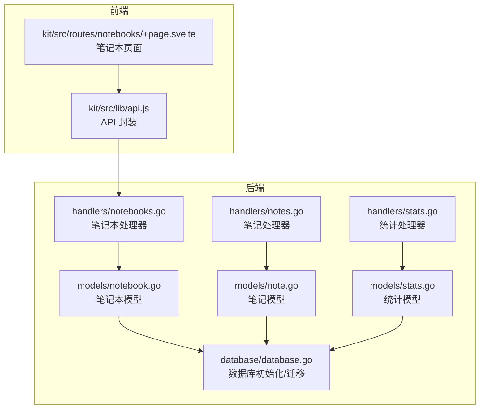
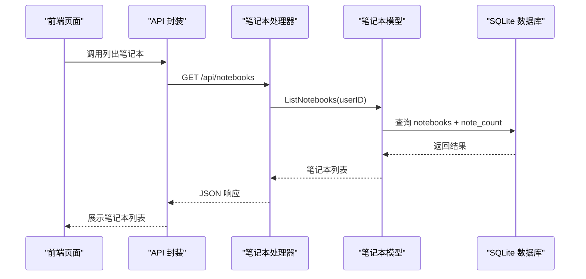
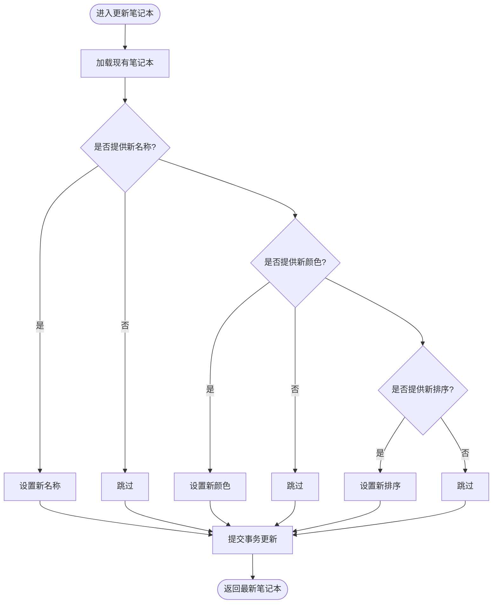
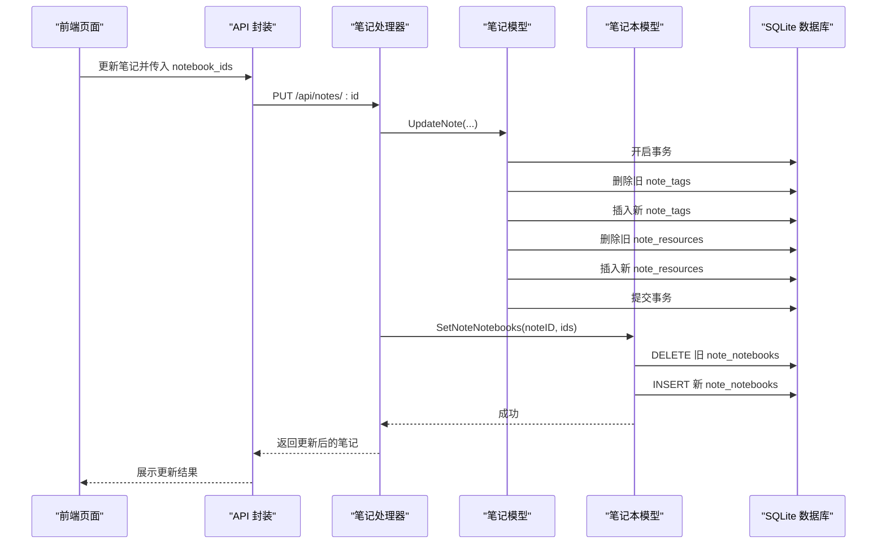
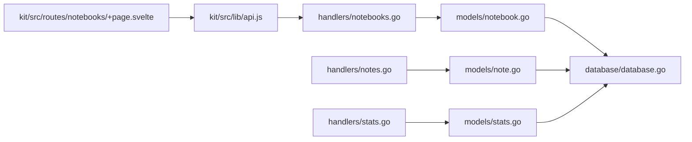

# 笔记本服务

<cite>
**本文引用的文件**
- [backend/handlers/notebooks.go](file://backend/handlers/notebooks.go)
- [backend/models/notebook.go](file://backend/models/notebook.go)
- [backend/handlers/notes.go](file://backend/handlers/notes.go)
- [backend/models/note.go](file://backend/models/note.go)
- [backend/database/database.go](file://backend/database/database.go)
- [backend/models/stats.go](file://backend/models/stats.go)
- [backend/handlers/stats.go](file://backend/handlers/stats.go)
- [kit/src/routes/notebooks/+page.svelte](file://kit/src/routes/notebooks/+page.svelte)
- [kit/src/lib/api.js](file://kit/src/lib/api.js)
</cite>

## 目录
1. [简介](#简介)
2. [项目结构](#项目结构)
3. [核心组件](#核心组件)
4. [架构总览](#架构总览)
5. [详细组件分析](#详细组件分析)
6. [依赖关系分析](#依赖关系分析)
7. [性能考量](#性能考量)
8. [故障排查指南](#故障排查指南)
9. [结论](#结论)
10. [附录](#附录)

## 简介
本文件面向 Memo Studio 的笔记本服务模块，系统性梳理笔记本的创建、重命名、删除、排序等业务规则，以及笔记本与笔记之间的多对多关联关系、批量笔记移动、笔记本内笔记排序、跨笔记本转移等操作流程。文档还覆盖笔记本组织结构（当前实现为线性列表，未发现嵌套/分组），权限控制（基于用户隔离与访问校验），统计功能（笔记数量、近7天新增/更新），并发与数据完整性约束，以及关键方法与数据处理逻辑的可视化说明。

## 项目结构
- 后端采用 Go + Gin 框架，模型层封装数据库访问，处理器层负责路由与参数校验。
- 数据库采用 SQLite，通过迁移脚本创建 notebooks 与 note_notebooks 关系表。
- 前端 Kit（SvelteKit）提供笔记本页面与 API 调用封装。

图表来源
- [backend/handlers/notebooks.go](file://backend/handlers/notebooks.go#L1-L161)
- [backend/models/notebook.go](file://backend/models/notebook.go#L1-L206)
- [backend/handlers/notes.go](file://backend/handlers/notes.go#L1-L513)
- [backend/models/note.go](file://backend/models/note.go#L1-L846)
- [backend/database/database.go](file://backend/database/database.go#L180-L209)
- [backend/models/stats.go](file://backend/models/stats.go#L1-L66)
- [backend/handlers/stats.go](file://backend/handlers/stats.go#L1-L24)
- [kit/src/routes/notebooks/+page.svelte](file://kit/src/routes/notebooks/+page.svelte#L1-L200)
- [kit/src/lib/api.js](file://kit/src/lib/api.js#L192-L223)

章节来源
- [backend/handlers/notebooks.go](file://backend/handlers/notebooks.go#L1-L161)
- [backend/models/notebook.go](file://backend/models/notebook.go#L1-L206)
- [backend/database/database.go](file://backend/database/database.go#L180-L209)
- [kit/src/routes/notebooks/+page.svelte](file://kit/src/routes/notebooks/+page.svelte#L1-L200)
- [kit/src/lib/api.js](file://kit/src/lib/api.js#L192-L223)

## 核心组件
- 笔记本处理器（handlers/notebooks.go）
  - 提供列出、获取、创建、更新、删除笔记本，以及列出某笔记本下的笔记等接口。
- 笔记本模型（models/notebook.go）
  - 实现笔记本列表、详情、创建、更新、删除、按笔记本查询笔记、统计笔记数量等。
- 笔记处理器（handlers/notes.go）
  - 提供笔记创建/更新时的笔记本 ID 列表设置，以及批量删除等。
- 笔记模型（models/note.go）
  - 提供笔记 CRUD、全文检索、标签/资源关联、位置信息等。
- 数据库与迁移（database/database.go）
  - 初始化 SQLite、启用外键、WAL、busy_timeout，执行迁移，创建 notebooks 与 note_notebooks 表及索引。
- 统计模型与处理器（models/stats.go、handlers/stats.go）
  - 提供用户维度的统计信息（笔记、标签、资源、笔记本、置顶、近7天新增/更新）。

章节来源
- [backend/handlers/notebooks.go](file://backend/handlers/notebooks.go#L12-L161)
- [backend/models/notebook.go](file://backend/models/notebook.go#L21-L206)
- [backend/handlers/notes.go](file://backend/handlers/notes.go#L175-L296)
- [backend/models/note.go](file://backend/models/note.go#L46-L168)
- [backend/database/database.go](file://backend/database/database.go#L18-L60)
- [backend/models/stats.go](file://backend/models/stats.go#L7-L66)
- [backend/handlers/stats.go](file://backend/handlers/stats.go#L11-L24)

## 架构总览
笔记本服务围绕“用户-笔记本-笔记”的三层关系展开，通过 note_notebooks 关系表实现多对多关联。处理器负责鉴权与参数校验，模型层封装 SQL 查询与事务，数据库层负责迁移与约束。

图表来源
- [kit/src/lib/api.js](file://kit/src/lib/api.js#L192-L195)
- [backend/handlers/notebooks.go](file://backend/handlers/notebooks.go#L12-L27)
- [backend/models/notebook.go](file://backend/models/notebook.go#L21-L46)

## 详细组件分析

### 笔记本 CRUD 与排序
- 列出笔记本
  - 按 sort_order 升序、id 升序排列，同时返回每个笔记本的笔记数量（通过 note_notebooks 统计）。
- 获取笔记本
  - 校验用户归属，返回笔记本详情与笔记数量。
- 创建笔记本
  - 参数校验与默认值处理（名称为空时使用默认名），插入 notebooks 表并返回最新记录。
- 更新笔记本
  - 支持名称、颜色、排序字段的可选更新，使用事务更新并返回最新记录。
- 删除笔记本
  - 仅删除笔记本记录，不删除笔记本身（保持数据完整性）。
- 排序
  - 通过 sort_order 字段控制顺序，列表接口按该字段升序返回。

图表来源
- [backend/models/notebook.go](file://backend/models/notebook.go#L85-L106)

章节来源
- [backend/handlers/notebooks.go](file://backend/handlers/notebooks.go#L12-L127)
- [backend/models/notebook.go](file://backend/models/notebook.go#L21-L111)

### 笔记本与笔记的关联关系
- 多对多关系
  - note_notebooks 关系表保存 note_id 与 notebook_id 的映射，支持同一笔记加入多个笔记本。
- 批量笔记移动
  - 通过 SetNoteNotebooks(noteID, notebookIDs) 实现：先清空旧关联，再插入新关联（忽略无效 ID）。
- 笔记本内笔记排序
  - ListNotesByNotebookID 按 pinned 降序、updated_at 降序返回，优先置顶笔记。
- 跨笔记本转移
  - 通过笔记更新接口传入新的 notebook_ids，内部调用 SetNoteNotebooks 完成转移。

图表来源
- [backend/handlers/notes.go](file://backend/handlers/notes.go#L232-L296)
- [backend/models/note.go](file://backend/models/note.go#L107-L168)
- [backend/models/notebook.go](file://backend/models/notebook.go#L130-L150)

章节来源
- [backend/models/notebook.go](file://backend/models/notebook.go#L113-L150)
- [backend/handlers/notes.go](file://backend/handlers/notes.go#L215-L296)
- [backend/models/note.go](file://backend/models/note.go#L107-L168)

### 笔记本组织结构
- 当前实现
  - 采用线性列表，通过 sort_order 控制顺序，未发现嵌套/分组层级结构。
- 前端展示
  - 前端页面支持笔记本选择、编辑（改名/改色）、删除，删除时提示“笔记不会被删除，仅解除与笔记本的关联”。

章节来源
- [backend/models/notebook.go](file://backend/models/notebook.go#L21-L46)
- [kit/src/routes/notebooks/+page.svelte](file://kit/src/routes/notebooks/+page.svelte#L125-L140)

### 权限控制
- 用户隔离
  - 所有笔记本与笔记查询均带有 user_id 过滤，确保数据隔离。
- 访问校验
  - 处理器统一通过 mustUserID 获取并校验用户身份，未授权请求返回 401。
- 笔记所有权
  - 笔记相关接口在更新/删除前检查笔记归属，防止越权访问。

章节来源
- [backend/handlers/notebooks.go](file://backend/handlers/notebooks.go#L13-L26)
- [backend/handlers/notes.go](file://backend/handlers/notes.go#L104-L129)

### 统计功能
- 用户统计
  - 统计项：笔记总数、标签数、资源数、笔记本数、置顶数、近7天新建数、近7天更新数。
- 前端展示
  - 前端页面展示统计卡片，包含笔记本数量等指标。

章节来源
- [backend/models/stats.go](file://backend/models/stats.go#L7-L66)
- [backend/handlers/stats.go](file://backend/handlers/stats.go#L11-L24)
- [kit/src/routes/stats/+page.svelte](file://kit/src/routes/stats/+page.svelte#L40-L79)

### 数据完整性约束与并发控制
- 外键约束
  - notebooks.user_id 引用 users(id)，notebooks 与 notes 的删除采用级联（notebooks 删除时不会影响 notes）。
  - note_notebooks 的 note_id、notebook_id 分别引用 notes(id)、notebooks(id)，删除时级联。
- 索引
  - notebooks(user_id)、note_notebooks(notebook_id) 等索引提升查询效率。
- 事务
  - 更新笔记本与批量笔记移动均使用事务，保证原子性。
- 并发与锁
  - SQLite 通过 WAL 模式与 busy_timeout 减少锁竞争；迁移与 DDL 在单连接上执行，避免 schema 可见性问题。

章节来源
- [backend/database/database.go](file://backend/database/database.go#L180-L209)
- [backend/models/notebook.go](file://backend/models/notebook.go#L130-L150)
- [backend/models/notebook.go](file://backend/models/notebook.go#L85-L106)

## 依赖关系分析

图表来源
- [backend/handlers/notebooks.go](file://backend/handlers/notebooks.go#L1-L161)
- [backend/models/notebook.go](file://backend/models/notebook.go#L1-L206)
- [backend/handlers/notes.go](file://backend/handlers/notes.go#L1-L513)
- [backend/models/note.go](file://backend/models/note.go#L1-L846)
- [backend/database/database.go](file://backend/database/database.go#L180-L209)
- [backend/models/stats.go](file://backend/models/stats.go#L1-L66)
- [backend/handlers/stats.go](file://backend/handlers/stats.go#L1-L24)
- [kit/src/routes/notebooks/+page.svelte](file://kit/src/routes/notebooks/+page.svelte#L1-L200)
- [kit/src/lib/api.js](file://kit/src/lib/api.js#L192-L223)

## 性能考量
- 查询优化
  - notebooks 与 note_notebooks 建有索引，按 user_id 与 notebook_id 查询高效。
  - 列表接口限制每页最大条数，避免一次性返回过多数据。
- 事务与批量
  - 批量笔记移动使用单事务，减少多次往返与中间状态。
- SQLite 特性
  - WAL 模式与 busy_timeout 降低锁等待时间；外键开启保证参照完整性。

章节来源
- [backend/database/database.go](file://backend/database/database.go#L47-L52)
- [backend/models/notebook.go](file://backend/models/notebook.go#L152-L194)
- [backend/models/notebook.go](file://backend/models/notebook.go#L130-L150)

## 故障排查指南
- 401 未认证
  - 前端检测到 401 自动跳转登录；后端 mustUserID 校验失败时返回 401。
- 404 笔记本不存在
  - 获取笔记本时若无匹配记录返回 404。
- 请求参数错误
  - 创建/更新笔记本时参数绑定失败返回 400。
- 数据库错误
  - 查询/更新失败返回 500，错误信息包含具体原因。
- 笔记本删除提示
  - 删除笔记本时前端提示“笔记不会被删除，仅解除与笔记本的关联”，确认后再执行。

章节来源
- [backend/handlers/notebooks.go](file://backend/handlers/notebooks.go#L30-L49)
- [backend/handlers/notebooks.go](file://backend/handlers/notebooks.go#L64-L81)
- [backend/handlers/notebooks.go](file://backend/handlers/notebooks.go#L83-L109)
- [backend/handlers/notebooks.go](file://backend/handlers/notebooks.go#L111-L127)
- [kit/src/routes/notebooks/+page.svelte](file://kit/src/routes/notebooks/+page.svelte#L125-L140)

## 结论
Memo Studio 的笔记本服务以 SQLite 为基础，通过 notebooks 与 note_notebooks 实现用户隔离的多对多关系。处理器层统一进行鉴权与参数校验，模型层封装事务与查询，满足创建、重命名、删除、排序、批量移动、跨笔记本转移等核心需求。当前未实现笔记本嵌套/分组，但通过 sort_order 与前端交互良好。统计与权限控制完善，数据完整性通过外键与事务保障。

## 附录
- 关键方法路径参考
  - 列出笔记本：[ListNotebooks](file://backend/models/notebook.go#L21-L46)
  - 获取笔记本：[GetNotebook](file://backend/models/notebook.go#L48-L65)
  - 创建笔记本：[CreateNotebook](file://backend/models/notebook.go#L67-L83)
  - 更新笔记本：[UpdateNotebook](file://backend/models/notebook.go#L85-L106)
  - 删除笔记本：[DeleteNotebook](file://backend/models/notebook.go#L108-L111)
  - 批量设置笔记笔记本：[SetNoteNotebooks](file://backend/models/notebook.go#L130-L150)
  - 按笔记本列出笔记：[ListNotesByNotebookID](file://backend/models/notebook.go#L152-L194)
  - 前端笔记本 API：[listNotebooks/createNotebook/updateNotebook/deleteNotebook](file://kit/src/lib/api.js#L192-L221)