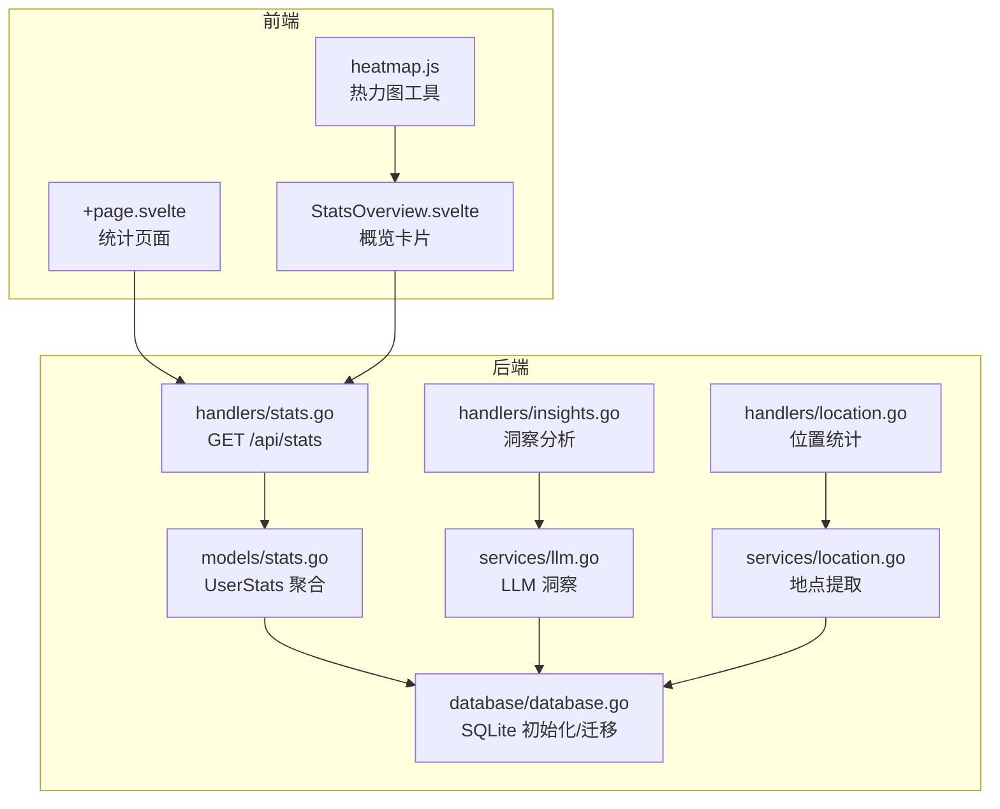
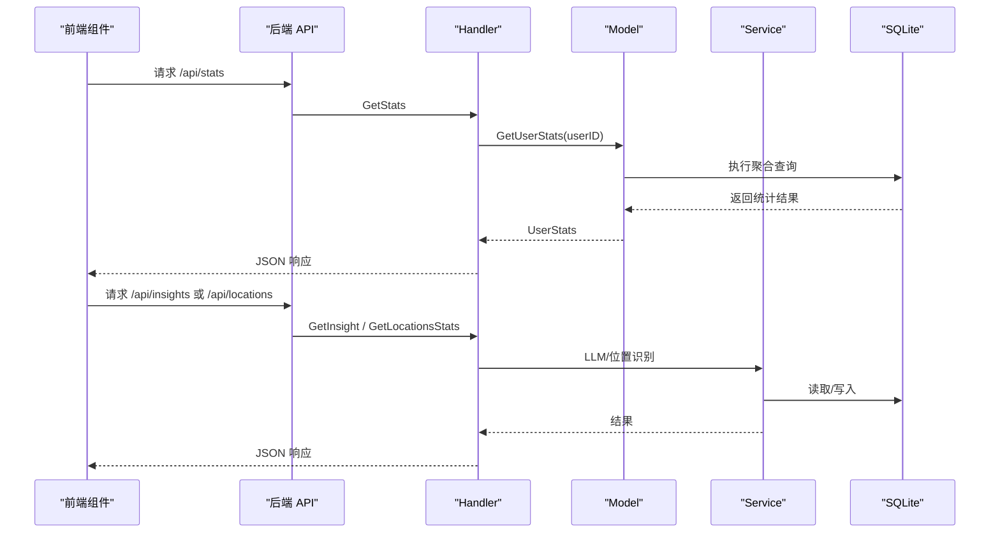
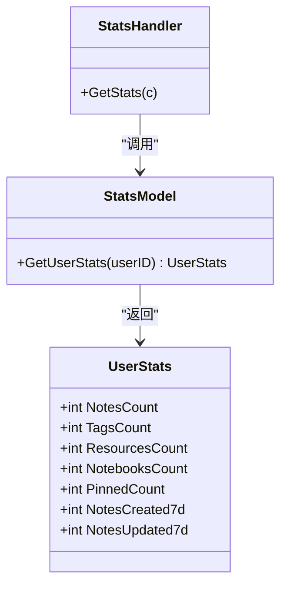
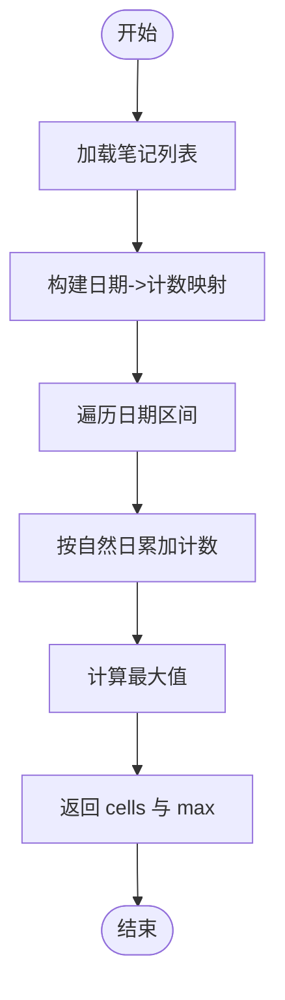
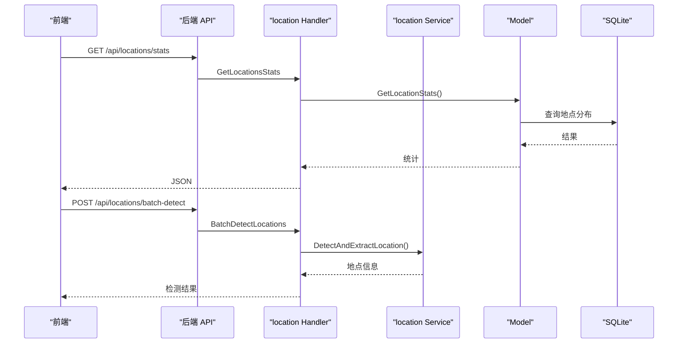
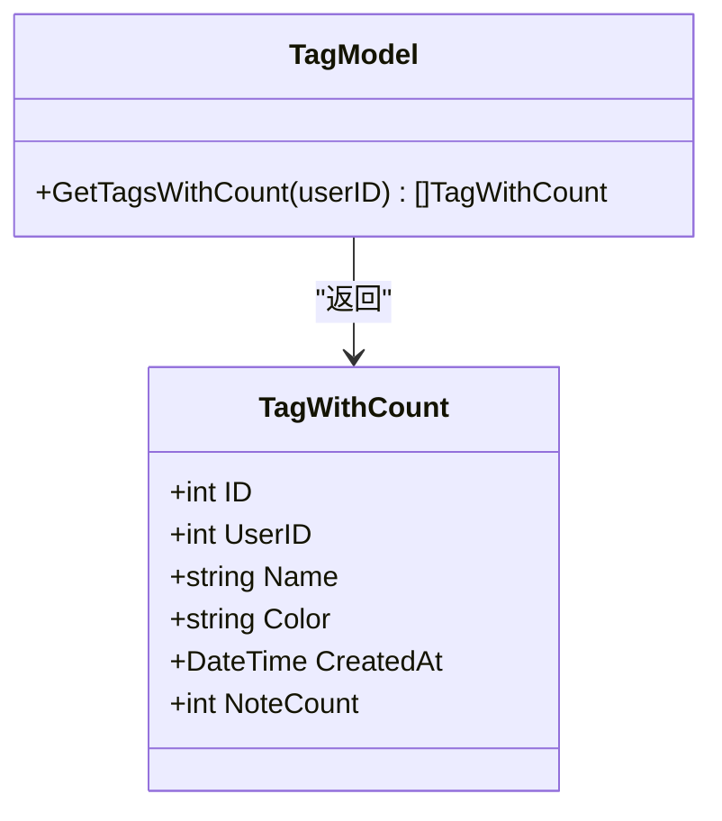
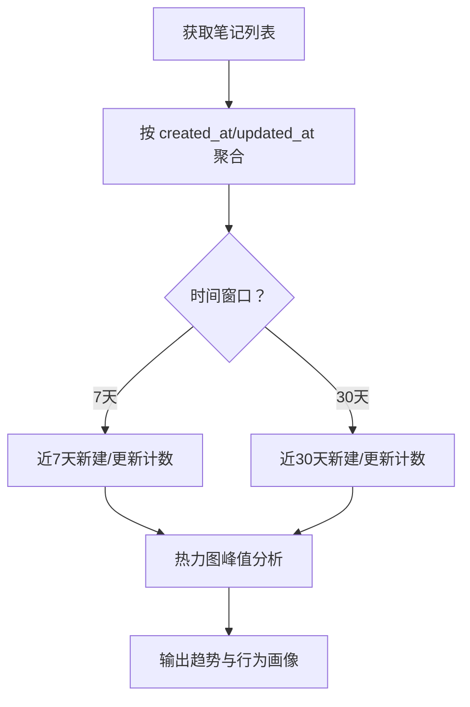
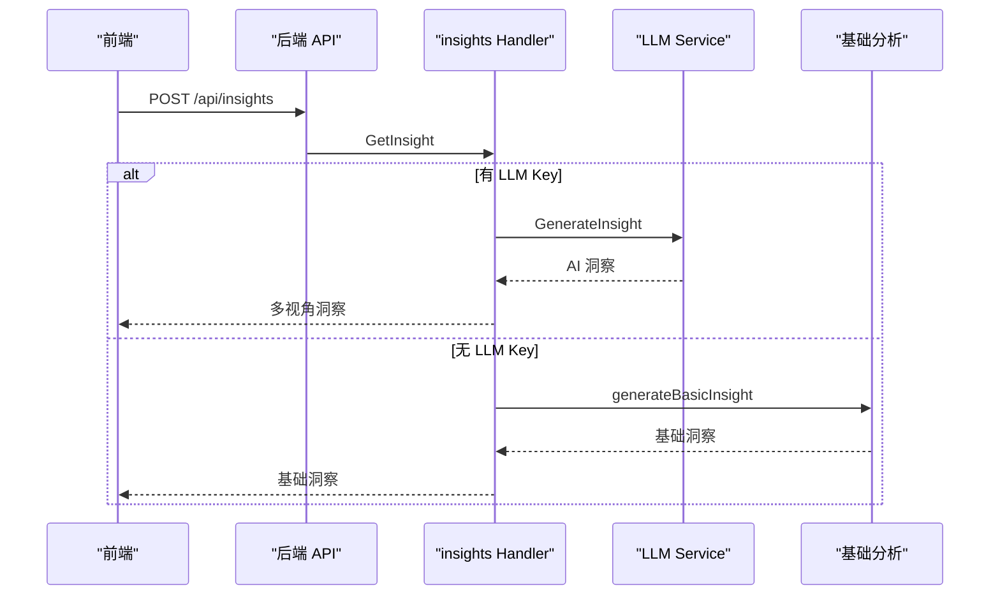
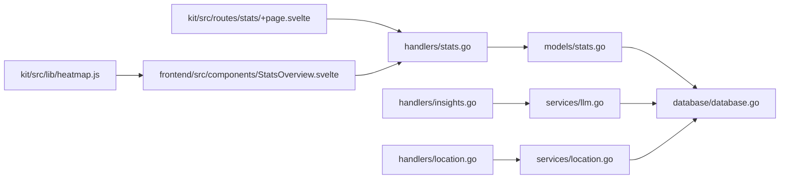

# 统计服务

<cite>
**本文引用的文件**
- [backend/handlers/stats.go](file://backend/handlers/stats.go)
- [backend/models/stats.go](file://backend/models/stats.go)
- [backend/handlers/insights.go](file://backend/handlers/insights.go)
- [backend/services/llm.go](file://backend/services/llm.go)
- [backend/handlers/location.go](file://backend/handlers/location.go)
- [backend/services/location.go](file://backend/services/location.go)
- [backend/models/note.go](file://backend/models/note.go)
- [backend/database/database.go](file://backend/database/database.go)
- [kit/src/lib/heatmap.js](file://kit/src/lib/heatmap.js)
- [frontend/src/components/StatsOverview.svelte](file://frontend/src/components/StatsOverview.svelte)
- [kit/src/routes/stats/+page.svelte](file://kit/src/routes/stats/+page.svelte)
</cite>

## 目录
1. [简介](#简介)
2. [项目结构](#项目结构)
3. [核心组件](#核心组件)
4. [架构总览](#架构总览)
5. [详细组件分析](#详细组件分析)
6. [依赖关系分析](#依赖关系分析)
7. [性能考量](#性能考量)
8. [故障排查指南](#故障排查指南)
9. [结论](#结论)
10. [附录](#附录)

## 简介
本文件系统性梳理 Memo Studio 的统计服务模块，覆盖笔记创建统计、活跃度分析、使用趋势计算、时间分析、位置统计、标签使用统计以及用户行为分析。文档结合后端 Handler、Model、Service 层与前端组件，给出数据流、处理逻辑、性能优化与实时更新机制的说明，并提供可视化图表帮助理解。

## 项目结构
统计服务涉及后端 API、数据模型与前端展示三层协同：
- 后端 Handler：提供 /api/stats、/api/insights、/api/locations 等接口
- 数据模型：封装 SQL 查询与聚合逻辑
- 服务层：位置识别、LLM 洞察等能力
- 前端：统计卡片、热力图、洞察视图等组件

**图表来源**
- [backend/handlers/stats.go](file://backend/handlers/stats.go#L11-L23)
- [backend/models/stats.go](file://backend/models/stats.go#L18-L65)
- [backend/handlers/insights.go](file://backend/handlers/insights.go#L68-L119)
- [backend/services/llm.go](file://backend/services/llm.go#L549-L591)
- [backend/handlers/location.go](file://backend/handlers/location.go#L155-L167)
- [backend/services/location.go](file://backend/services/location.go#L203-L221)
- [backend/database/database.go](file://backend/database/database.go#L20-L60)
- [kit/src/lib/heatmap.js](file://kit/src/lib/heatmap.js#L1-L38)
- [frontend/src/components/StatsOverview.svelte](file://frontend/src/components/StatsOverview.svelte#L1-L134)
- [kit/src/routes/stats/+page.svelte](file://kit/src/routes/stats/+page.svelte#L1-L155)

**章节来源**
- [backend/handlers/stats.go](file://backend/handlers/stats.go#L11-L23)
- [backend/models/stats.go](file://backend/models/stats.go#L18-L65)
- [backend/handlers/insights.go](file://backend/handlers/insights.go#L68-L119)
- [backend/services/llm.go](file://backend/services/llm.go#L549-L591)
- [backend/handlers/location.go](file://backend/handlers/location.go#L155-L167)
- [backend/services/location.go](file://backend/services/location.go#L203-L221)
- [backend/database/database.go](file://backend/database/database.go#L20-L60)
- [kit/src/lib/heatmap.js](file://kit/src/lib/heatmap.js#L1-L38)
- [frontend/src/components/StatsOverview.svelte](file://frontend/src/components/StatsOverview.svelte#L1-L134)
- [kit/src/routes/stats/+page.svelte](file://kit/src/routes/stats/+page.svelte#L1-L155)

## 核心组件
- 用户统计聚合：后端 Handler 调用 Model 获取用户维度统计（笔记总数、标签数、资源数、笔记本数、置顶数、近7天新建/更新数）
- 洞察分析：基于 LLM 的多视角分析（主题、情感、行动、趋势等），支持基础规则分析与 AI 结果回退
- 位置统计：地点提取、坐标映射、按地点筛选与统计
- 时间分析：前端热力图工具按日聚合，支持近 90 天/近一年等周期
- 标签统计：按用户聚合标签与使用次数
- 用户行为：基于笔记创建/更新时间、标签使用、位置标注等行为特征

**章节来源**
- [backend/handlers/stats.go](file://backend/handlers/stats.go#L11-L23)
- [backend/models/stats.go](file://backend/models/stats.go#L18-L65)
- [backend/handlers/insights.go](file://backend/handlers/insights.go#L297-L314)
- [backend/services/llm.go](file://backend/services/llm.go#L549-L591)
- [backend/handlers/location.go](file://backend/handlers/location.go#L155-L167)
- [backend/services/location.go](file://backend/services/location.go#L203-L221)
- [kit/src/lib/heatmap.js](file://kit/src/lib/heatmap.js#L1-L38)

## 架构总览
后端采用分层设计：Handler 负责请求解析与响应，Model 封装数据访问与聚合，Service 提供外部能力（LLM、位置识别）。前端通过 API 获取数据并渲染可视化组件。

**图表来源**
- [backend/handlers/stats.go](file://backend/handlers/stats.go#L11-L23)
- [backend/models/stats.go](file://backend/models/stats.go#L18-L65)
- [backend/handlers/insights.go](file://backend/handlers/insights.go#L68-L119)
- [backend/services/llm.go](file://backend/services/llm.go#L549-L591)
- [backend/handlers/location.go](file://backend/handlers/location.go#L155-L167)
- [backend/services/location.go](file://backend/services/location.go#L203-L221)
- [backend/database/database.go](file://backend/database/database.go#L20-L60)

## 详细组件分析

### 用户统计聚合（笔记创建统计、活跃度、7天趋势）
- Handler：解析用户上下文，调用 Model 获取统计
- Model：使用 SQL 聚合函数统计总数、置顶数、7天内新建/更新数
- 前端：统计页面与概览卡片展示关键指标

**图表来源**
- [backend/models/stats.go](file://backend/models/stats.go#L7-L16)
- [backend/models/stats.go](file://backend/models/stats.go#L18-L65)
- [backend/handlers/stats.go](file://backend/handlers/stats.go#L11-L23)

**章节来源**
- [backend/handlers/stats.go](file://backend/handlers/stats.go#L11-L23)
- [backend/models/stats.go](file://backend/models/stats.go#L18-L65)
- [kit/src/routes/stats/+page.svelte](file://kit/src/routes/stats/+page.svelte#L44-L74)
- [frontend/src/components/StatsOverview.svelte](file://frontend/src/components/StatsOverview.svelte#L17-L42)

### 时间分析与活跃度（按日/周/月、热力图、趋势）
- 前端热力图工具：按自然日聚合，支持近 90 天/近一年周期
- 后端未内置按周/月聚合接口，但前端可自行聚合
- 趋势：可结合近 7/30 天新建/更新数与热力图峰值分析

**图表来源**
- [kit/src/lib/heatmap.js](file://kit/src/lib/heatmap.js#L1-L38)

**章节来源**
- [kit/src/lib/heatmap.js](file://kit/src/lib/heatmap.js#L1-L38)
- [frontend/src/components/StatsOverview.svelte](file://frontend/src/components/StatsOverview.svelte#L17-L42)
- [kit/src/routes/stats/+page.svelte](file://kit/src/routes/stats/+page.svelte#L44-L74)

### 位置统计服务（地理分布、热门地点、旅行轨迹）
- Handler：提供位置统计、按地点筛选、批量检测位置
- Service：地点提取与坐标映射（模拟数据）
- Model：笔记位置字段与按地点查询

**图表来源**
- [backend/handlers/location.go](file://backend/handlers/location.go#L155-L167)
- [backend/handlers/location.go](file://backend/handlers/location.go#L169-L203)
- [backend/services/location.go](file://backend/services/location.go#L203-L221)
- [backend/models/note.go](file://backend/models/note.go#L760-L800)

**章节来源**
- [backend/handlers/location.go](file://backend/handlers/location.go#L155-L167)
- [backend/handlers/location.go](file://backend/handlers/location.go#L169-L203)
- [backend/services/location.go](file://backend/services/location.go#L65-L118)
- [backend/services/location.go](file://backend/services/location.go#L203-L221)
- [backend/models/note.go](file://backend/models/note.go#L21-L27)
- [backend/models/note.go](file://backend/models/note.go#L751-L758)
- [backend/models/note.go](file://backend/models/note.go#L760-L800)

### 标签使用统计（热度、频率、关联）
- Model：按用户聚合标签与使用次数
- 前端：展示标签列表与使用频次

**图表来源**
- [backend/models/note.go](file://backend/models/note.go#L37-L44)
- [backend/models/note.go](file://backend/models/note.go#L394-L424)

**章节来源**
- [backend/models/note.go](file://backend/models/note.go#L37-L44)
- [backend/models/note.go](file://backend/models/note.go#L394-L424)

### 用户行为分析（创作习惯、搜索模式、导入导出行为）
- 创作习惯：近 7/30 天新建/更新趋势、热力图峰值
- 搜索模式：全文检索（FTS5）支持，按内容检索
- 导入导出：Handler 提供导入/导出接口（统计侧可结合使用）

**图表来源**
- [backend/models/stats.go](file://backend/models/stats.go#L52-L63)
- [kit/src/lib/heatmap.js](file://kit/src/lib/heatmap.js#L1-L38)

**章节来源**
- [backend/models/stats.go](file://backend/models/stats.go#L52-L63)
- [backend/models/note.go](file://backend/models/note.go#L329-L392)
- [kit/src/lib/heatmap.js](file://kit/src/lib/heatmap.js#L1-L38)

### 洞察分析（多视角、AI 回退、对比分析）
- Handler：接收笔记内容与时间范围，判断是否启用 LLM
- Service：LLM 生成洞察（关键词、情感、趋势、建议）
- 回退：无 API Key 时使用基础规则分析（主题、情感、行动）

**图表来源**
- [backend/handlers/insights.go](file://backend/handlers/insights.go#L68-L119)
- [backend/services/llm.go](file://backend/services/llm.go#L549-L591)

**章节来源**
- [backend/handlers/insights.go](file://backend/handlers/insights.go#L68-L119)
- [backend/handlers/insights.go](file://backend/handlers/insights.go#L297-L314)
- [backend/handlers/insights.go](file://backend/handlers/insights.go#L386-L428)
- [backend/handlers/insights.go](file://backend/handlers/insights.go#L443-L478)
- [backend/handlers/insights.go](file://backend/handlers/insights.go#L480-L520)
- [backend/services/llm.go](file://backend/services/llm.go#L549-L591)

## 依赖关系分析
- Handler 依赖 Model 与 Service
- Model 依赖数据库连接与迁移脚本
- Service 依赖外部 LLM 与位置识别
- 前端依赖 API 与可视化工具

**图表来源**
- [backend/handlers/stats.go](file://backend/handlers/stats.go#L11-L23)
- [backend/models/stats.go](file://backend/models/stats.go#L18-L65)
- [backend/handlers/insights.go](file://backend/handlers/insights.go#L68-L119)
- [backend/services/llm.go](file://backend/services/llm.go#L549-L591)
- [backend/handlers/location.go](file://backend/handlers/location.go#L155-L167)
- [backend/services/location.go](file://backend/services/location.go#L203-L221)
- [backend/database/database.go](file://backend/database/database.go#L20-L60)
- [kit/src/routes/stats/+page.svelte](file://kit/src/routes/stats/+page.svelte#L10-L25)
- [frontend/src/components/StatsOverview.svelte](file://frontend/src/components/StatsOverview.svelte#L13-L42)
- [kit/src/lib/heatmap.js](file://kit/src/lib/heatmap.js#L1-L38)

**章节来源**
- [backend/handlers/stats.go](file://backend/handlers/stats.go#L11-L23)
- [backend/models/stats.go](file://backend/models/stats.go#L18-L65)
- [backend/handlers/insights.go](file://backend/handlers/insights.go#L68-L119)
- [backend/services/llm.go](file://backend/services/llm.go#L549-L591)
- [backend/handlers/location.go](file://backend/handlers/location.go#L155-L167)
- [backend/services/location.go](file://backend/services/location.go#L203-L221)
- [backend/database/database.go](file://backend/database/database.go#L20-L60)
- [kit/src/routes/stats/+page.svelte](file://kit/src/routes/stats/+page.svelte#L10-L25)
- [frontend/src/components/StatsOverview.svelte](file://frontend/src/components/StatsOverview.svelte#L13-L42)
- [kit/src/lib/heatmap.js](file://kit/src/lib/heatmap.js#L1-L38)

## 性能考量
- 数据库初始化与迁移：开启外键约束、WAL 日志模式、超时设置，减少锁竞争
- 聚合查询：使用 SQL 聚合函数一次性返回结果，避免多次往返
- 前端热力图：按天聚合，避免大列表重复计算
- LLM 调用：仅在具备 API Key 时启用，否则回退至基础规则分析
- 建议优化
  - 为 notes.created_at/updated_at 建立索引以加速 7/30 天统计
  - 对 location 字段建立索引以提升按地点查询性能
  - 对 tags.name 建立 per-user 唯一索引，避免重复扫描
  - 对 FTS5 notes_fts 建立触发器维护一致性，确保全文检索与写入一致

**章节来源**
- [backend/database/database.go](file://backend/database/database.go#L45-L52)
- [backend/database/database.go](file://backend/database/database.go#L180-L241)
- [backend/database/database.go](file://backend/database/database.go#L594-L647)
- [backend/models/stats.go](file://backend/models/stats.go#L52-L63)
- [backend/models/note.go](file://backend/models/note.go#L760-L800)

## 故障排查指南
- 统计接口 401/未登录：前端跳转登录页
- LLM 未配置：返回基础洞察或提示配置
- 位置识别未命中：检查内容中是否包含已知地点变体
- 数据库迁移失败：确认 SQLite 版本与 FTS5 支持情况

**章节来源**
- [kit/src/routes/stats/+page.svelte](file://kit/src/routes/stats/+page.svelte#L14-L22)
- [backend/handlers/insights.go](file://backend/handlers/insights.go#L96-L118)
- [backend/services/location.go](file://backend/services/location.go#L203-L221)
- [backend/database/database.go](file://backend/database/database.go#L20-L60)

## 结论
Memo Studio 的统计服务以 Handler-Model-Service 分层清晰、前后端协同完善。用户统计、时间活跃度、位置分布与标签使用等维度覆盖全面；洞察分析支持 AI 与基础规则双通道，具备良好的可扩展性与容错能力。建议进一步完善索引与缓存策略，持续优化大数据量下的查询性能。

## 附录
- 数据库初始化与迁移流程
- 热力图工具函数与颜色映射
- 前端统计页面与概览组件

**章节来源**
- [backend/database/database.go](file://backend/database/database.go#L20-L60)
- [kit/src/lib/heatmap.js](file://kit/src/lib/heatmap.js#L30-L36)
- [kit/src/routes/stats/+page.svelte](file://kit/src/routes/stats/+page.svelte#L1-L155)
- [frontend/src/components/StatsOverview.svelte](file://frontend/src/components/StatsOverview.svelte#L1-L134)