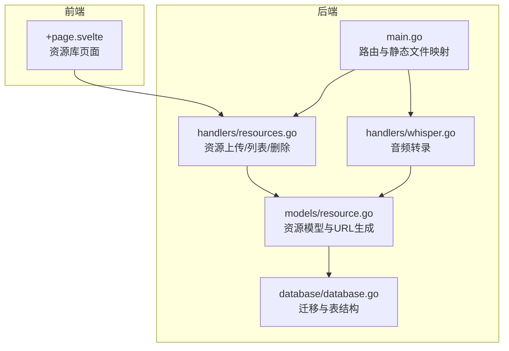
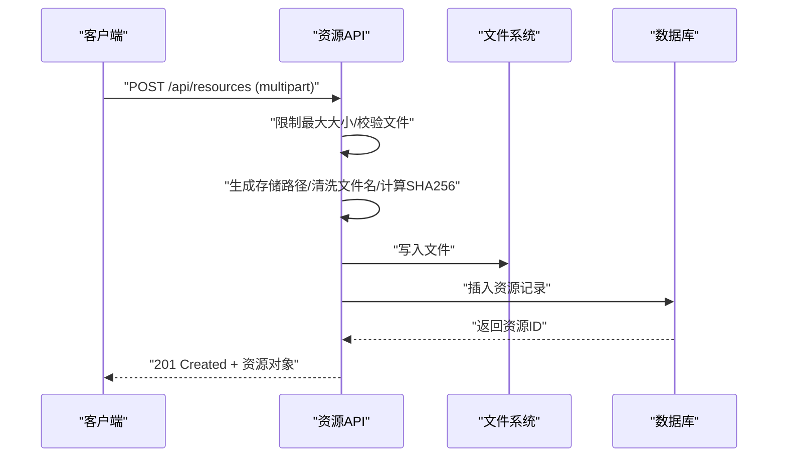
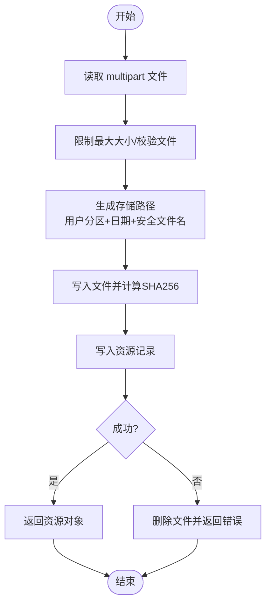
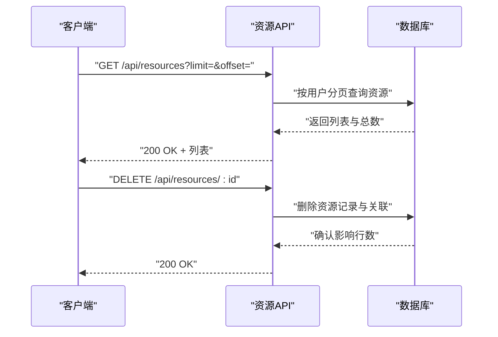
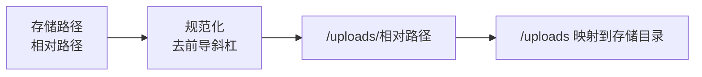
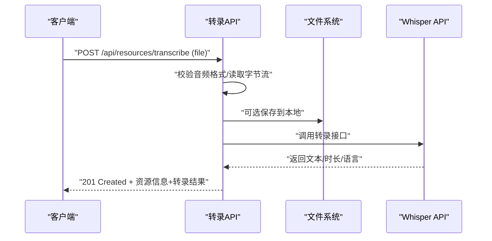
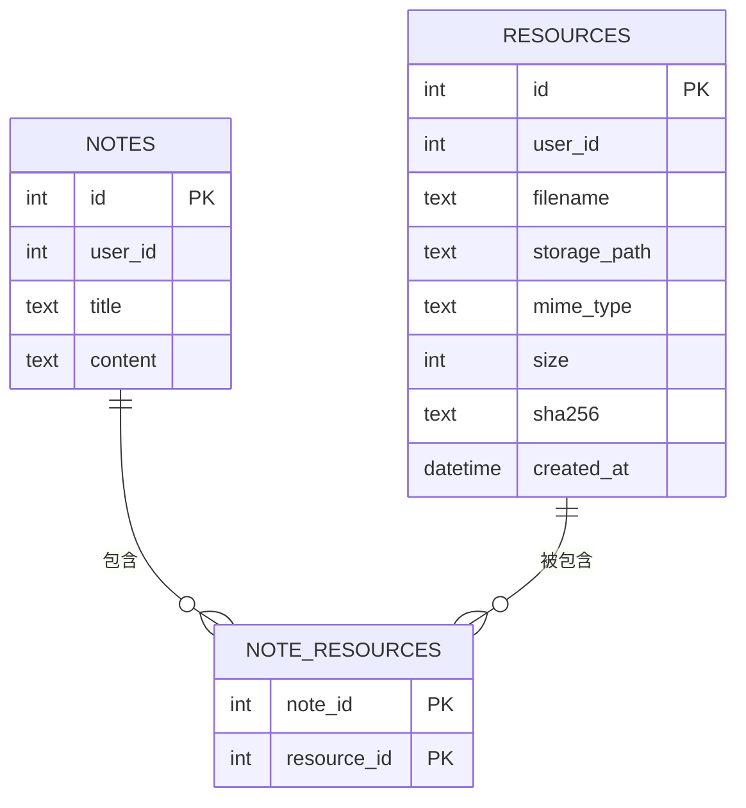
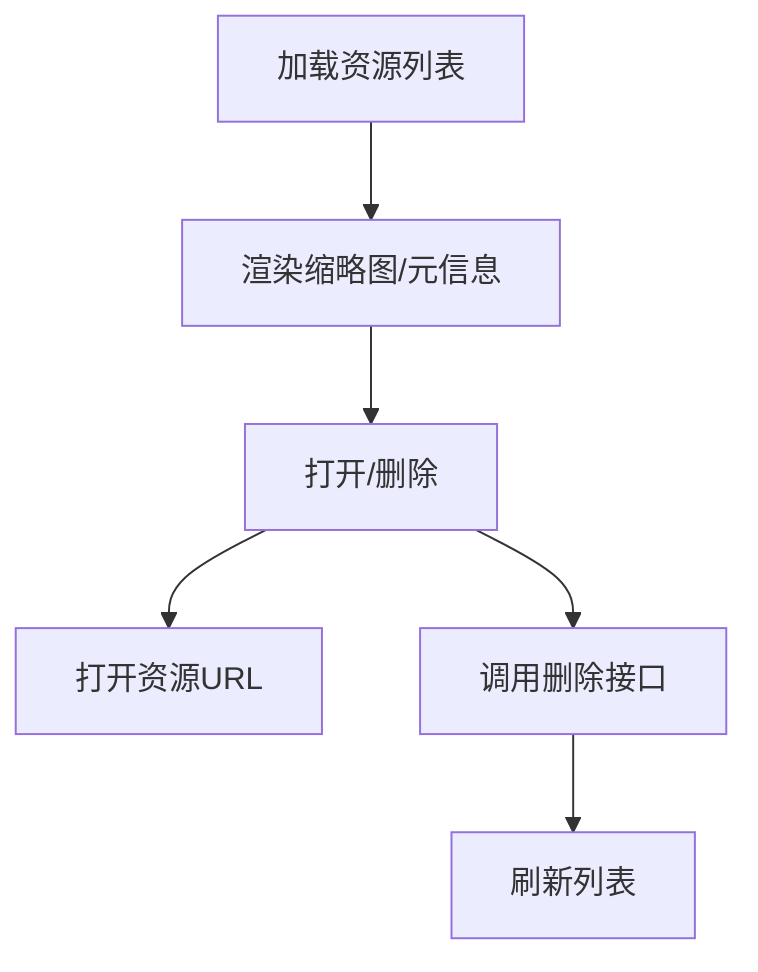
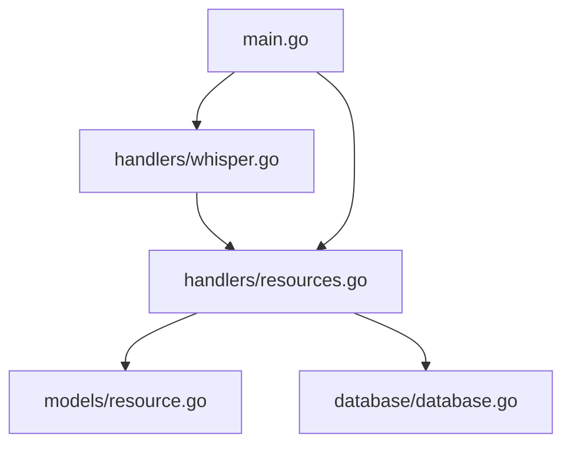

# 资源服务

<cite>
**本文档引用的文件**
- [backend/main.go](file://backend/main.go)
- [backend/handlers/resources.go](file://backend/handlers/resources.go)
- [backend/handlers/whisper.go](file://backend/handlers/whisper.go)
- [backend/models/resource.go](file://backend/models/resource.go)
- [backend/database/database.go](file://backend/database/database.go)
- [backend/handlers/api_test.go](file://backend/handlers/api_test.go)
- [kit/src/routes/resources/+page.svelte](file://kit/src/routes/resources/+page.svelte)
</cite>

## 目录
1. [简介](#简介)
2. [项目结构](#项目结构)
3. [核心组件](#核心组件)
4. [架构总览](#架构总览)
5. [详细组件分析](#详细组件分析)
6. [依赖分析](#依赖分析)
7. [性能考虑](#性能考虑)
8. [故障排查指南](#故障排查指南)
9. [结论](#结论)
10. [附录](#附录)

## 简介
本文件面向 Memo Studio 的资源服务模块，系统性梳理文件上传、存储、URL 生成、安全与权限控制、与笔记的关联关系、以及存储策略与清理机制。文档同时覆盖多媒体能力（图片、音频转录）与前端资源页面的展示逻辑，帮助开发者快速理解与扩展资源服务。

## 项目结构
资源服务涉及后端 API、数据库模式、静态文件服务与前端页面四个层面：
- 后端 API：提供资源上传、列表、删除等接口
- 数据库：resources 与 note_resources 关联表
- 静态文件服务：/uploads 映射到本地存储目录
- 前端：资源库页面展示与交互

图表来源
- [backend/main.go](file://backend/main.go#L87-L92)
- [backend/handlers/resources.go](file://backend/handlers/resources.go#L91-L155)
- [backend/handlers/whisper.go](file://backend/handlers/whisper.go#L31-L104)
- [backend/models/resource.go](file://backend/models/resource.go#L28-L34)
- [backend/database/database.go](file://backend/database/database.go#L408-L438)
- [kit/src/routes/resources/+page.svelte](file://kit/src/routes/resources/+page.svelte#L1-L200)

章节来源
- [backend/main.go](file://backend/main.go#L87-L92)
- [backend/handlers/resources.go](file://backend/handlers/resources.go#L91-L155)
- [backend/handlers/whisper.go](file://backend/handlers/whisper.go#L31-L104)
- [backend/models/resource.go](file://backend/models/resource.go#L28-L34)
- [backend/database/database.go](file://backend/database/database.go#L408-L438)
- [kit/src/routes/resources/+page.svelte](file://kit/src/routes/resources/+page.svelte#L1-L200)

## 核心组件
- 资源上传处理器：负责接收 multipart/form-data，进行大小限制、文件名清洗、存储路径生成、SHA256 计算、持久化与 URL 生成
- 音频转录处理器：对音频文件进行转录（可选），并返回文本、时长与语言
- 资源模型与数据库：定义资源结构、URL 规范化、资源列表与删除逻辑
- 静态文件服务：/uploads 映射到本地存储目录，实现资源下载
- 前端资源页面：展示资源列表、缩略图、分页与操作按钮

章节来源
- [backend/handlers/resources.go](file://backend/handlers/resources.go#L91-L155)
- [backend/handlers/whisper.go](file://backend/handlers/whisper.go#L31-L104)
- [backend/models/resource.go](file://backend/models/resource.go#L10-L76)
- [backend/main.go](file://backend/main.go#L87-L92)
- [kit/src/routes/resources/+page.svelte](file://kit/src/routes/resources/+page.svelte#L132-L172)

## 架构总览
资源服务的关键流程：
- 上传：客户端提交 multipart/form-data，后端解析文件、限制大小、生成存储路径、写入磁盘、计算哈希、入库并返回资源对象
- 列表：按用户分页查询资源，返回资源列表与总数
- 删除：按用户权限删除资源记录，物理文件由定时任务清理
- 静态服务：/uploads 映射到本地存储目录，直接提供文件下载
- 音频转录：可选调用外部 Whisper API，返回转录结果

图表来源
- [backend/handlers/resources.go](file://backend/handlers/resources.go#L91-L155)
- [backend/models/resource.go](file://backend/models/resource.go#L36-L56)

章节来源
- [backend/handlers/resources.go](file://backend/handlers/resources.go#L91-L155)
- [backend/models/resource.go](file://backend/models/resource.go#L36-L56)

## 详细组件分析

### 文件上传处理（上传资源）
- 输入与限制
  - 仅接受 multipart/form-data，file 字段必填
  - 请求体大小限制为 20MB
  - 空文件拒绝
- 存储路径与命名
  - 用户私有资源以 u{userID} 分区，公共资源以 public 分区
  - 路径按年/月/日组织
  - 文件名为 {安全名称}_{随机十六进制}.{扩展名}
  - 安全名称仅保留字母、数字、中文、连字符与下划线，其余替换为下划线
- 写入与校验
  - 写入磁盘时同时计算 SHA256
  - 入库失败时自动回滚删除文件
- 返回值
  - 返回资源对象，包含 URL（/uploads/...）

图表来源
- [backend/handlers/resources.go](file://backend/handlers/resources.go#L91-L155)
- [backend/handlers/resources.go](file://backend/handlers/resources.go#L197-L223)
- [backend/handlers/resources.go](file://backend/handlers/resources.go#L61-L78)
- [backend/models/resource.go](file://backend/models/resource.go#L36-L56)

章节来源
- [backend/handlers/resources.go](file://backend/handlers/resources.go#L91-L155)
- [backend/handlers/resources.go](file://backend/handlers/resources.go#L197-L223)
- [backend/handlers/resources.go](file://backend/handlers/resources.go#L61-L78)
- [backend/models/resource.go](file://backend/models/resource.go#L36-L56)

### 列表与删除（资源）
- 列表
  - 仅认证用户可访问
  - 支持 limit/offset 分页，默认 limit=20，上限 100
  - 返回资源列表与总数
- 删除
  - 仅资源所属用户可删除
  - 删除数据库记录，note_resources 关联行也删除
  - 物理文件由后台定时任务清理

图表来源
- [backend/handlers/resources.go](file://backend/handlers/resources.go#L157-L172)
- [backend/handlers/resources.go](file://backend/handlers/resources.go#L174-L195)
- [backend/models/resource.go](file://backend/models/resource.go#L117-L169)
- [backend/models/resource.go](file://backend/models/resource.go#L171-L186)

章节来源
- [backend/handlers/resources.go](file://backend/handlers/resources.go#L157-L172)
- [backend/handlers/resources.go](file://backend/handlers/resources.go#L174-L195)
- [backend/models/resource.go](file://backend/models/resource.go#L117-L169)
- [backend/models/resource.go](file://backend/models/resource.go#L171-L186)

### 静态文件服务与 URL 生成
- 静态服务
  - /uploads 映射到本地存储目录（可通过环境变量配置）
- URL 生成
  - 资源对象的 URL 为 /uploads/{相对存储路径}
  - 存储路径在入库时规范化，去除前导斜杠

图表来源
- [backend/models/resource.go](file://backend/models/resource.go#L22-L34)
- [backend/main.go](file://backend/main.go#L87-L92)

章节来源
- [backend/models/resource.go](file://backend/models/resource.go#L22-L34)
- [backend/main.go](file://backend/main.go#L87-L92)

### 音频转录（可选）
- 接口
  - 上传并转录：POST /api/resources/transcribe
  - 仅转录：POST /api/speech-to-text
- 支持格式
  - mp3, wav, m4a, ogg, webm, flac, mp4
- 流程
  - 读取文件字节流
  - 可选保存到本地存储
  - 调用 Whisper API（需配置 OPENAI_API_KEY 等）
  - 返回转录文本、时长与语言

图表来源
- [backend/handlers/whisper.go](file://backend/handlers/whisper.go#L31-L104)
- [backend/handlers/whisper.go](file://backend/handlers/whisper.go#L166-L175)
- [backend/handlers/whisper.go](file://backend/handlers/whisper.go#L218-L261)

章节来源
- [backend/handlers/whisper.go](file://backend/handlers/whisper.go#L31-L104)
- [backend/handlers/whisper.go](file://backend/handlers/whisper.go#L166-L175)
- [backend/handlers/whisper.go](file://backend/handlers/whisper.go#L218-L261)

### 资源与笔记的关联关系
- 关联表
  - note_resources：笔记与资源的多对多关联
- 查询
  - 通过 note_id 查询资源列表，按创建时间与 ID 排序
- 绑定与引用
  - 笔记创建/更新时可传入 resource_ids，实现附件绑定
  - 删除资源时同步清理 note_resources 关联

图表来源
- [backend/database/database.go](file://backend/database/database.go#L422-L429)
- [backend/models/resource.go](file://backend/models/resource.go#L78-L109)
- [backend/models/resource.go](file://backend/models/resource.go#L171-L186)

章节来源
- [backend/database/database.go](file://backend/database/database.go#L422-L429)
- [backend/models/resource.go](file://backend/models/resource.go#L78-L109)
- [backend/models/resource.go](file://backend/models/resource.go#L171-L186)

### 前端资源页面展示
- 展示逻辑
  - 列表：分页加载资源，显示缩略图（图片）、文件名、大小、创建时间
  - 操作：打开、删除
- 交互
  - 上传文件触发后端上传接口
  - 删除资源后刷新列表

图表来源
- [kit/src/routes/resources/+page.svelte](file://kit/src/routes/resources/+page.svelte#L132-L172)
- [kit/src/routes/resources/+page.svelte](file://kit/src/routes/resources/+page.svelte#L54-L69)

章节来源
- [kit/src/routes/resources/+page.svelte](file://kit/src/routes/resources/+page.svelte#L1-L200)
- [kit/src/routes/resources/+page.svelte](file://kit/src/routes/resources/+page.svelte#L54-L69)

## 依赖分析
- 组件耦合
  - handlers/resources.go 依赖 models/resource.go 与数据库
  - handlers/whisper.go 依赖 handlers/resources.go 的文件名清洗与存储工具
  - main.go 将 /uploads 映射到存储目录
- 外部依赖
  - Gin 路由框架
  - SQLite 数据库（通过 go-sqlite3）
  - 可选：OpenAI Whisper API（用于音频转录）

图表来源
- [backend/handlers/resources.go](file://backend/handlers/resources.go#L1-L20)
- [backend/models/resource.go](file://backend/models/resource.go#L1-L8)
- [backend/database/database.go](file://backend/database/database.go#L1-L16)
- [backend/handlers/whisper.go](file://backend/handlers/whisper.go#L1-L15)
- [backend/main.go](file://backend/main.go#L87-L92)

章节来源
- [backend/handlers/resources.go](file://backend/handlers/resources.go#L1-L20)
- [backend/models/resource.go](file://backend/models/resource.go#L1-L8)
- [backend/database/database.go](file://backend/database/database.go#L1-L16)
- [backend/handlers/whisper.go](file://backend/handlers/whisper.go#L1-L15)
- [backend/main.go](file://backend/main.go#L87-L92)

## 性能考虑
- 上传性能
  - 使用 io.Copy 将流式写入磁盘，避免一次性读入内存
  - SHA256 同时计算，减少一次 IO
- 存储布局
  - 按日期分层目录，降低单目录文件数量，提升文件系统性能
- 分页与查询
  - 列表接口限制每页最大条数，避免大分页带来的查询压力
- 静态服务
  - /uploads 直接映射到文件系统，利用操作系统缓存与内核零拷贝能力

章节来源
- [backend/handlers/resources.go](file://backend/handlers/resources.go#L61-L78)
- [backend/handlers/resources.go](file://backend/handlers/resources.go#L115-L137)
- [backend/models/resource.go](file://backend/models/resource.go#L117-L169)
- [backend/main.go](file://backend/main.go#L87-L92)

## 故障排查指南
- 上传失败
  - 检查 Content-Type 是否为 multipart/form-data
  - 确认文件大小未超过 20MB
  - 查看存储目录权限是否可写
- 资源不可见
  - 确认 /uploads 映射的存储目录正确
  - 检查资源 URL 是否为 /uploads/相对路径
- 删除后文件仍存在
  - 物理文件清理由定时任务完成，等待或手动清理
- 音频转录失败
  - 确认已设置 OPENAI_API_KEY 等必要环境变量
  - 检查网络连通性与 Whisper API 可用性

章节来源
- [backend/handlers/resources.go](file://backend/handlers/resources.go#L91-L155)
- [backend/models/resource.go](file://backend/models/resource.go#L28-L34)
- [backend/handlers/whisper.go](file://backend/handlers/whisper.go#L133-L141)

## 结论
资源服务模块围绕“安全、可控、可扩展”的目标设计：严格的上传限制与文件名清洗、清晰的存储路径与 URL 规范、完善的数据库关联与权限控制、以及可选的音频转录能力。结合前端资源页面，形成从上传、展示到删除的完整闭环。后续可在以下方面持续优化：引入恶意文件检测、访问鉴权细化、定期清理策略与配额管理、以及更丰富的多媒体处理能力。

## 附录

### 存储策略与清理机制
- 存储策略
  - 本地存储：通过环境变量指定存储根目录，默认 ./storage
  - 路径组织：用户分区 + 年/月/日 + 安全文件名 + 随机后缀
- 清理机制
  - 删除资源记录后，物理文件由定时任务清理
  - 建议配合配额与归档策略，避免无限增长

章节来源
- [backend/handlers/resources.go](file://backend/handlers/resources.go#L38-L43)
- [backend/handlers/resources.go](file://backend/handlers/resources.go#L115-L137)
- [backend/models/resource.go](file://backend/models/resource.go#L171-L186)

### 安全与权限控制
- 认证与授权
  - 列表与删除接口均要求认证
  - 删除仅限资源所属用户
- 安全措施
  - 上传大小限制
  - 文件名清洗，防止路径穿越与非法字符
  - SHA256 校验，便于完整性验证

章节来源
- [backend/handlers/resources.go](file://backend/handlers/resources.go#L22-L34)
- [backend/handlers/resources.go](file://backend/handlers/resources.go#L91-L155)
- [backend/handlers/resources.go](file://backend/handlers/resources.go#L174-L195)
- [backend/handlers/resources.go](file://backend/handlers/resources.go#L197-L223)

### API 示例（路径参考）
- 上传资源
  - 方法：POST
  - 路径：/api/resources
  - 参数：multipart/form-data，字段 file
  - 返回：201 Created + 资源对象
  - 参考：[backend/handlers/resources.go](file://backend/handlers/resources.go#L91-L155)
- 列表资源
  - 方法：GET
  - 路径：/api/resources?limit=&offset=
  - 返回：200 OK + 列表与总数
  - 参考：[backend/handlers/resources.go](file://backend/handlers/resources.go#L157-L172)
- 删除资源
  - 方法：DELETE
  - 路径：/api/resources/:id
  - 返回：200 OK
  - 参考：[backend/handlers/resources.go](file://backend/handlers/resources.go#L174-L195)
- 上传并转录
  - 方法：POST
  - 路径：/api/resources/transcribe
  - 返回：201 Created + 资源信息 + 转录结果
  - 参考：[backend/handlers/whisper.go](file://backend/handlers/whisper.go#L31-L104)
- 仅转录
  - 方法：POST
  - 路径：/api/speech-to-text
  - 返回：200 OK + 转录结果
  - 参考：[backend/handlers/whisper.go](file://backend/handlers/whisper.go#L106-L162)

### 单元测试参考
- 资源上传与笔记绑定
  - 上传资源 → 校验返回字段 → 校验文件落盘 → 创建笔记并绑定资源 → 列表与更新 → 删除笔记
  - 参考：[backend/handlers/api_test.go](file://backend/handlers/api_test.go#L113-L215)