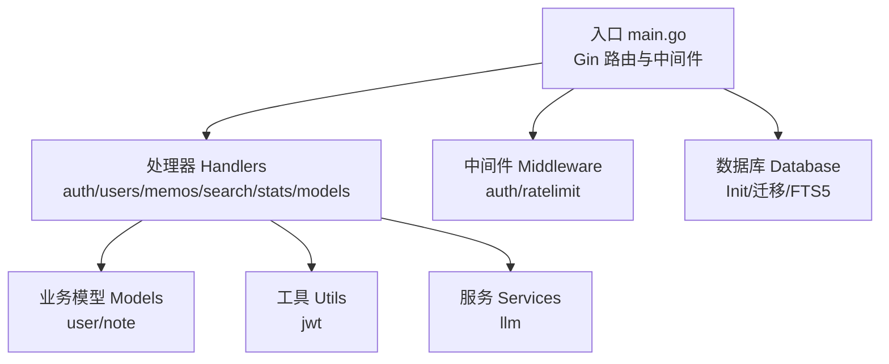
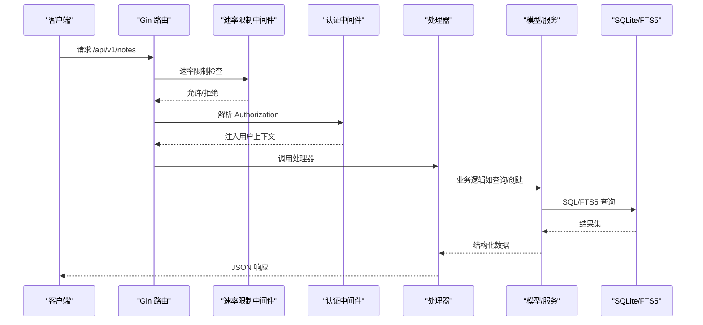
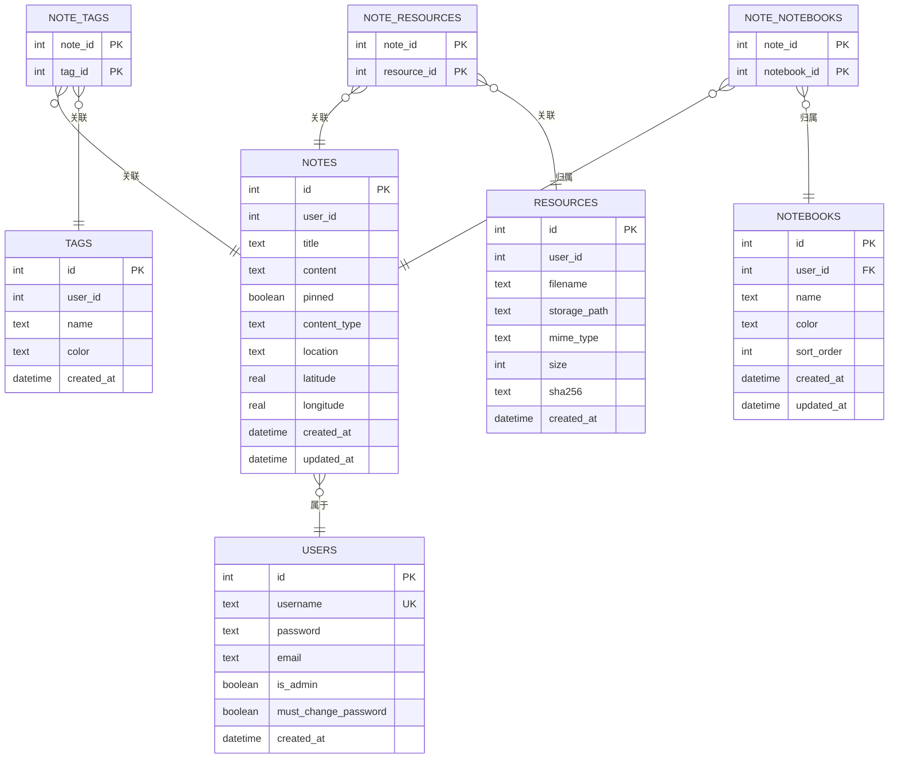
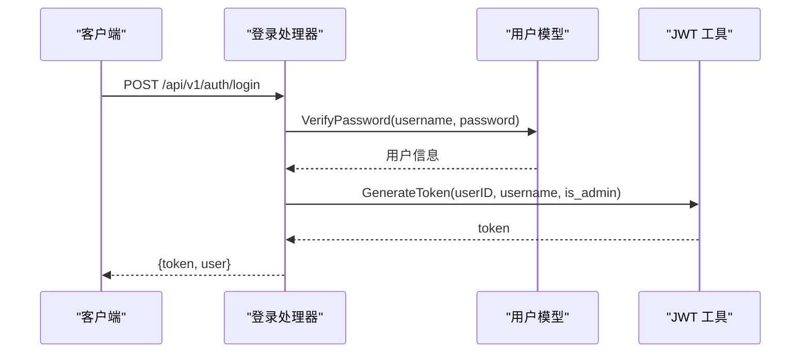
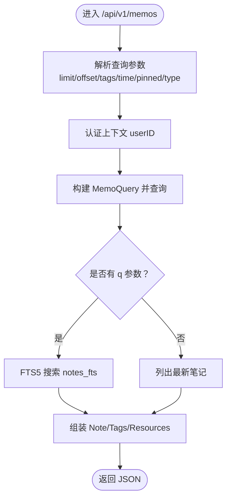
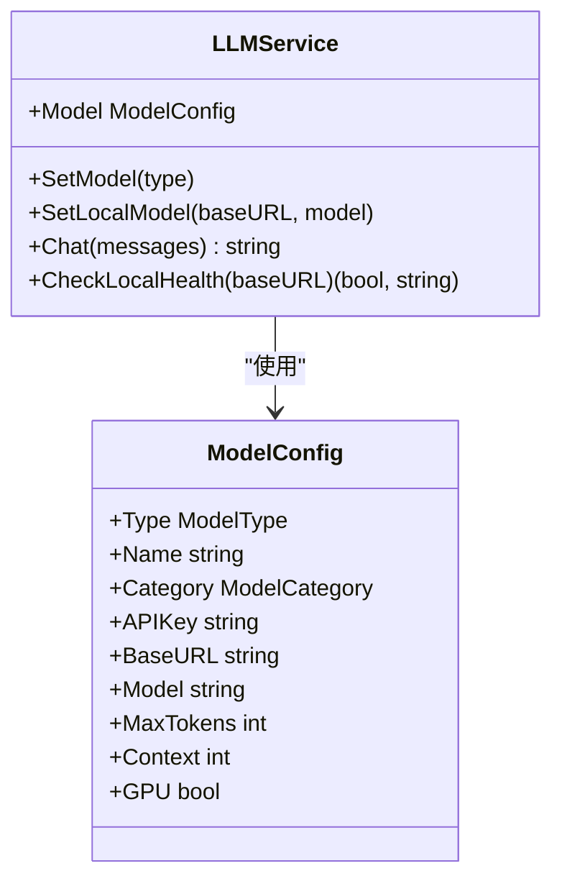
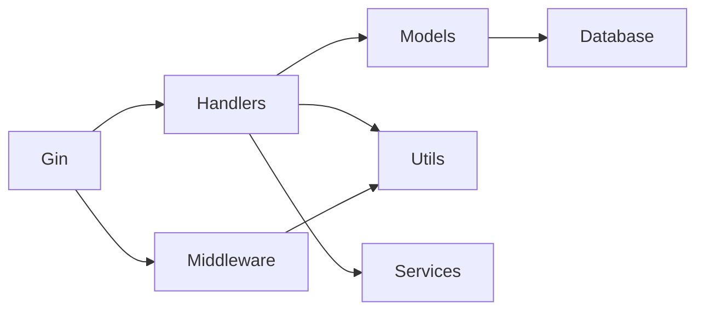

# 后端系统

<cite>
**本文引用的文件**
- [backend/main.go](file://backend/main.go)
- [backend/go.mod](file://backend/go.mod)
- [backend/database/database.go](file://backend/database/database.go)
- [backend/handlers/auth.go](file://backend/handlers/auth.go)
- [backend/handlers/users.go](file://backend/handlers/users.go)
- [backend/handlers/memos.go](file://backend/handlers/memos.go)
- [backend/handlers/search.go](file://backend/handlers/search.go)
- [backend/handlers/stats.go](file://backend/handlers/stats.go)
- [backend/handlers/models.go](file://backend/handlers/models.go)
- [backend/middleware/auth.go](file://backend/middleware/auth.go)
- [backend/middleware/ratelimit.go](file://backend/middleware/ratelimit.go)
- [backend/models/user.go](file://backend/models/user.go)
- [backend/models/note.go](file://backend/models/note.go)
- [backend/utils/jwt.go](file://backend/utils/jwt.go)
- [backend/services/llm.go](file://backend/services/llm.go)
</cite>

## 目录
1. [简介](#简介)
2. [项目结构](#项目结构)
3. [核心组件](#核心组件)
4. [架构总览](#架构总览)
5. [详细组件分析](#详细组件分析)
6. [依赖关系分析](#依赖关系分析)
7. [性能考虑](#性能考虑)
8. [故障排查指南](#故障排查指南)
9. [结论](#结论)
10. [附录](#附录)

## 简介
本文件为 Memo Studio 后端系统的全面技术文档，面向开发者与运维人员，系统性阐述基于 Go 语言的后端实现，包括：
- Gin 框架路由与中间件机制
- 数据库设计与 SQLite FTS5 全文检索
- RESTful API 设计与各模块接口规范
- 业务逻辑层（认证、笔记、资源、模型等）
- 安全机制（JWT、密码加密、权限控制、CORS）
- 性能与扩展建议

## 项目结构
后端采用模块化分层组织：
- 入口与路由：backend/main.go
- 中间件：backend/middleware/{auth.go, ratelimit.go}
- 处理器（Handlers）：backend/handlers/*.go
- 业务模型（Models）：backend/models/*.go
- 工具与服务：backend/utils/*, backend/services/*
- 数据库初始化与迁移：backend/database/database.go
- 依赖声明：backend/go.mod

图表来源
- [backend/main.go](file://backend/main.go#L28-L352)
- [backend/database/database.go](file://backend/database/database.go#L20-L60)
- [backend/middleware/auth.go](file://backend/middleware/auth.go#L12-L51)
- [backend/middleware/ratelimit.go](file://backend/middleware/ratelimit.go#L96-L121)

章节来源
- [backend/main.go](file://backend/main.go#L28-L352)
- [backend/go.mod](file://backend/go.mod#L1-L45)

## 核心组件
- 路由与中间件
  - Gin 路由组：/api/v1 与 /api（兼容旧版）
  - 中间件：认证中间件、管理员权限中间件、速率限制中间件
- 数据库与迁移
  - SQLite 初始化、PRAGMA 优化、多版本迁移
  - FTS5 全文检索虚拟表与触发器维护
- 处理器层
  - 认证与用户：登录、注册、个人信息、密码修改、管理员用户管理
  - 笔记与标签：CRUD、全文检索、随机回顾、位置信息
  - 资源与导入导出：资源上传、批量删除、导入导出
  - 统计与洞察：统计信息、AI 洞察与总结
  - 模型管理：云端/本地模型配置、健康检查、切换
- 业务模型与工具
  - 用户模型与密码加密（bcrypt）
  - 笔记模型、标签与资源关联
  - JWT 令牌生成与解析
  - LLM 服务封装（OpenAI/Claude/本地模型）

章节来源
- [backend/main.go](file://backend/main.go#L94-L196)
- [backend/database/database.go](file://backend/database/database.go#L62-L177)
- [backend/handlers/auth.go](file://backend/handlers/auth.go#L27-L53)
- [backend/handlers/users.go](file://backend/handlers/users.go#L37-L96)
- [backend/handlers/memos.go](file://backend/handlers/memos.go#L78-L137)
- [backend/middleware/auth.go](file://backend/middleware/auth.go#L12-L51)
- [backend/middleware/ratelimit.go](file://backend/middleware/ratelimit.go#L96-L121)
- [backend/models/user.go](file://backend/models/user.go#L22-L110)
- [backend/models/note.go](file://backend/models/note.go#L46-L105)
- [backend/utils/jwt.go](file://backend/utils/jwt.go#L29-L66)
- [backend/services/llm.go](file://backend/services/llm.go#L289-L336)

## 架构总览
后端采用“入口路由 → 中间件 → 处理器 → 模型/服务 → 数据库”的清晰分层，配合 Gin 的中间件链路实现认证、权限与速率限制，数据库层通过 FTS5 实现高性能全文检索。

图表来源
- [backend/main.go](file://backend/main.go#L94-L196)
- [backend/middleware/ratelimit.go](file://backend/middleware/ratelimit.go#L96-L121)
- [backend/middleware/auth.go](file://backend/middleware/auth.go#L12-L51)
- [backend/handlers/memos.go](file://backend/handlers/memos.go#L139-L188)
- [backend/models/note.go](file://backend/models/note.go#L329-L392)
- [backend/database/database.go](file://backend/database/database.go#L243-L374)

## 详细组件分析

### 路由与中间件
- 路由设计
  - /api/v1：新版 API，包含认证、用户、笔记、标签、资源、统计、导入导出、AI 洞察与模型管理
  - /api：兼容旧版 API，保留登录/注册与部分旧接口
  - 静态文件与 SPA 回退：嵌入式前端静态资源，非 /api 路径回退到 index.html
- 中间件
  - 认证中间件：提取 Bearer Token，解析 JWT，注入用户信息
  - 管理员中间件：校验 is_admin
  - 速率限制中间件：基于客户端 IP 的滑动窗口限流，全局默认 50 次/分钟

章节来源
- [backend/main.go](file://backend/main.go#L94-L196)
- [backend/middleware/auth.go](file://backend/middleware/auth.go#L12-L51)
- [backend/middleware/ratelimit.go](file://backend/middleware/ratelimit.go#L96-L121)

### 数据库与 FTS5 全文检索
- 初始化与 PRAGMA
  - 启用外键约束、WAL 日志模式、忙等待超时
- 迁移策略
  - 版本化迁移：v1（基础 schema/FTS5）、v2（notes 扩展字段）、v3（resources）、v4/v5（用户权限与引导）、v6（多用户隔离）、v7（标签唯一性变更）、v8（notebooks）、v9（位置字段）
- FTS5 设计
  - notes_fts 虚拟表，rowid 与 notes.id 对齐
  - 触发器维护：新增/删除/更新时同步到 FTS 表
  - 查询使用 bm25 排序，支持 limit/offset
- 索引与优化
  - notes_fts 使用 unicode61 分词器
  - notes 表与关联表建立必要索引（如 notebooks.user_id、note_notebooks.notebook_id）

图表来源
- [backend/database/database.go](file://backend/database/database.go#L243-L374)
- [backend/database/database.go](file://backend/database/database.go#L180-L209)
- [backend/database/database.go](file://backend/database/database.go#L211-L241)

章节来源
- [backend/database/database.go](file://backend/database/database.go#L20-L60)
- [backend/database/database.go](file://backend/database/database.go#L62-L177)
- [backend/database/database.go](file://backend/database/database.go#L243-L374)

### 认证与用户管理
- 认证流程
  - 登录：校验用户名/密码，生成 JWT（默认 24 小时）
  - 注册：密码加密存储，返回用户与令牌
  - 当前用户：从上下文读取用户信息
  - 修改密码：验证旧密码，bcrypt 加密新密码
- 权限控制
  - 管理员接口：AdminOnly 中间件
  - 用户管理：管理员可创建/更新/删除用户
- 安全要点
  - 生产环境必须设置 MEMO_JWT_SECRET
  - 密码使用 bcrypt 加密
  - 速率限制保护登录/注册

图表来源
- [backend/handlers/auth.go](file://backend/handlers/auth.go#L27-L53)
- [backend/models/user.go](file://backend/models/user.go#L78-L110)
- [backend/utils/jwt.go](file://backend/utils/jwt.go#L29-L49)

章节来源
- [backend/handlers/auth.go](file://backend/handlers/auth.go#L27-L53)
- [backend/handlers/users.go](file://backend/handlers/users.go#L37-L96)
- [backend/models/user.go](file://backend/models/user.go#L22-L110)
- [backend/utils/jwt.go](file://backend/utils/jwt.go#L11-L20)

### 笔记与标签系统
- 笔记 CRUD
  - 创建/更新：支持标题、内容、标签、置顶、内容类型、资源关联
  - 删除：支持单条与批量删除
  - 权限：旧数据 user_id 为空视为公共，否则需匹配当前用户
- 标签管理
  - 创建标签（若不存在）、更新、删除、合并
  - 标签唯一性：(user_id, name) 唯一
- 全文检索
  - /api/v1/search 与 /api/v1/memos?q=... 均调用 FTS5 查询
  - bm25 排序，支持 limit/offset
- 随机回顾
  - 支持按标签与时间窗口随机挑选笔记

图表来源
- [backend/handlers/memos.go](file://backend/handlers/memos.go#L78-L137)
- [backend/models/note.go](file://backend/models/note.go#L329-L392)

章节来源
- [backend/handlers/memos.go](file://backend/handlers/memos.go#L78-L278)
- [backend/models/note.go](file://backend/models/note.go#L46-L105)
- [backend/models/note.go](file://backend/models/note.go#L329-L392)

### 资源与导入导出
- 资源上传与管理
  - 上传资源、列出资源、删除资源
  - 语音转文本（独立端点）
- 导入导出
  - 导出笔记、导入笔记（处理器存在，具体实现视部署情况）

章节来源
- [backend/main.go](file://backend/main.go#L134-L151)

### 统计与洞察
- 统计信息
  - /api/v1/stats：按用户维度统计
- AI 洞察与总结
  - /api/v1/insights 与 /api/v1/summarize：基于 LLM 生成洞察与总结
  - 支持批量总结

章节来源
- [backend/handlers/stats.go](file://backend/handlers/stats.go#L11-L23)
- [backend/services/llm.go](file://backend/services/llm.go#L549-L591)
- [backend/services/llm.go](file://backend/services/llm.go#L605-L640)

### 模型管理与 LLM 服务
- 模型配置
  - 支持云端（OpenAI、Claude、GLM、Qwen 等）与本地（Ollama、LocalAI、LMStudio、AnythingLLM）
  - 通过环境变量切换模型与覆盖 BaseURL/Model/API Key
- 健康检查与连接测试
  - 检查本地模型服务可达性
- 处理器接口
  - 获取模型列表、设置当前模型、添加本地模型、健康检查、测试连接

图表来源
- [backend/services/llm.go](file://backend/services/llm.go#L377-L416)
- [backend/services/llm.go](file://backend/services/llm.go#L418-L435)

章节来源
- [backend/handlers/models.go](file://backend/handlers/models.go#L164-L233)
- [backend/handlers/models.go](file://backend/handlers/models.go#L341-L370)
- [backend/services/llm.go](file://backend/services/llm.go#L289-L336)

## 依赖关系分析
- 外部依赖
  - Gin、Gin CORS、JWT、SQLite3、bcrypt
- 内部模块耦合
  - Handlers 依赖 Models、Utils、Services
  - Models 依赖 Database
  - Middleware 依赖 Utils/JWT
  - Services 与 Handlers 协作提供 LLM 能力

图表来源
- [backend/go.mod](file://backend/go.mod#L5-L11)
- [backend/main.go](file://backend/main.go#L3-L21)

章节来源
- [backend/go.mod](file://backend/go.mod#L1-L45)
- [backend/main.go](file://backend/main.go#L3-L21)

## 性能考虑
- 数据库层
  - WAL 模式与 busy_timeout 提升并发写入稳定性
  - FTS5 使用 unicode61 分词器，bm25 排序提升检索质量
  - 建议在高并发场景下评估连接池与事务边界
- 应用层
  - 速率限制中间件防止滥用
  - 处理器层参数校验与早期返回减少无效负载
- 模型服务
  - 云端模型建议缓存热点请求，本地模型注意超时与健康检查

## 故障排查指南
- 认证失败
  - 检查 Authorization 头是否为 Bearer Token
  - 确认 MEMO_JWT_SECRET 已在生产环境设置
- 登录/注册被限流
  - 查看 X-RateLimit-* 响应头，等待冷却
- FTS5 相关错误
  - 确认编译标签 sqlite_fts5 已启用
  - 检查 notes_fts 触发器是否正确创建
- 用户权限错误
  - 管理员接口需 is_admin=true，旧 token 可能缺失该字段，中间件会兜底查询数据库

章节来源
- [backend/middleware/auth.go](file://backend/middleware/auth.go#L12-L51)
- [backend/utils/jwt.go](file://backend/utils/jwt.go#L11-L20)
- [backend/middleware/ratelimit.go](file://backend/middleware/ratelimit.go#L96-L121)
- [backend/database/database.go](file://backend/database/database.go#L243-L374)

## 结论
Memo Studio 后端以 Gin 为核心，结合中间件与清晰的分层设计，提供了完整的认证、笔记、标签、资源、统计与 AI 能力。数据库层通过 SQLite 与 FTS5 实现高效全文检索，配合迁移机制保障演进过程中的数据一致性。建议在生产环境中强化 CORS 与 JWT 配置，关注限流与数据库性能，持续优化模型服务的可用性与稳定性。

## 附录
- 环境变量
  - MEMO_ENV、GIN_MODE、MEMO_DB_PATH、MEMO_STORAGE_DIR、MEMO_JWT_SECRET、MEMO_CORS_ORIGINS
  - LLM_API_KEY、OPENAI_API_KEY、ANTHROPIC_API_KEY、DEEPSEEK_API_KEY、ZHIPU_API_KEY、LLM_MODEL_TYPE、LLM_BASE_URL、LLM_MODEL
  - MEMO_ADMIN_PASSWORD（用于引导默认管理员）
- 常用端点概览
  - 认证：POST /api/v1/auth/login, POST /api/v1/auth/register
  - 用户：GET/PUT /api/v1/users/me, PUT /api/v1/users/me/password
  - 笔记：GET/POST/PUT/DELETE /api/v1/memos
  - 标签：GET/POST/PUT/DELETE /api/v1/tags, POST /api/v1/tags/merge
  - 资源：GET/POST/DELETE /api/v1/resources, POST /api/v1/resources/transcribe
  - 统计：GET /api/v1/stats
  - 模型：GET/POST /api/v1/models*, /api/v1/models/available, /api/v1/models/test