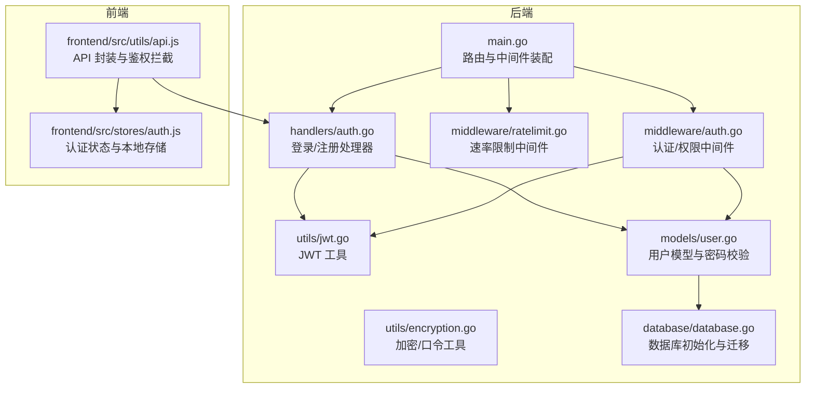
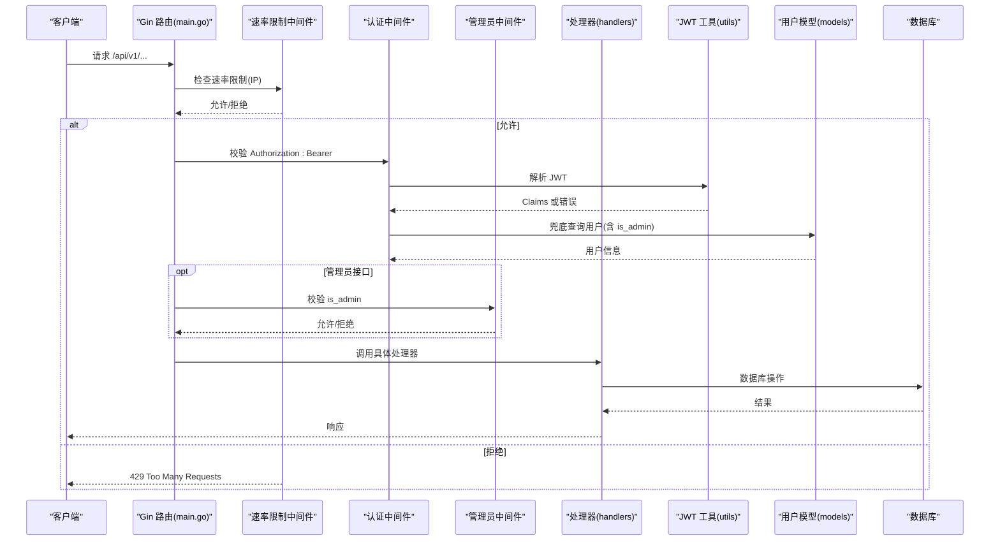
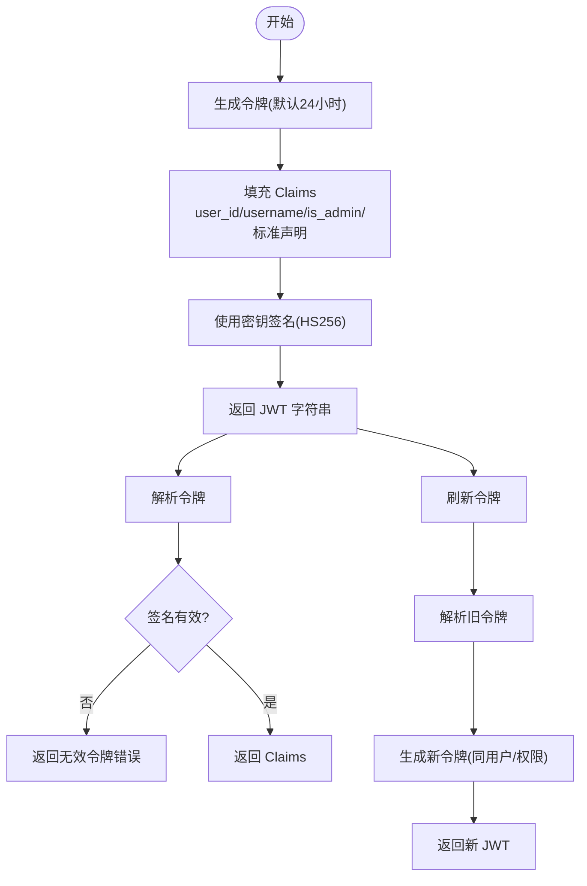
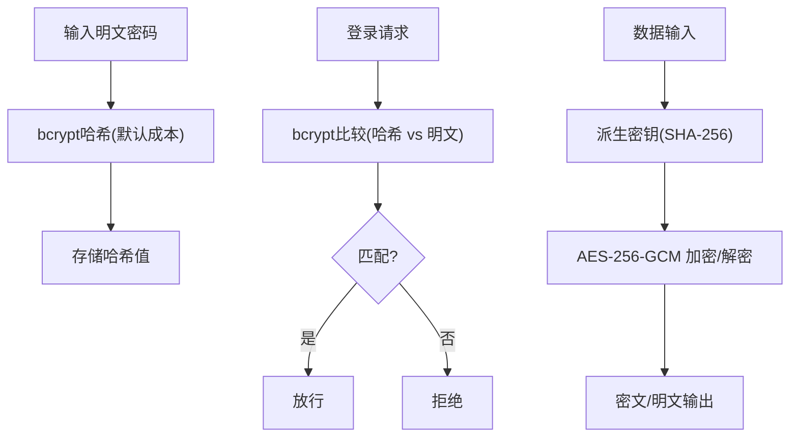
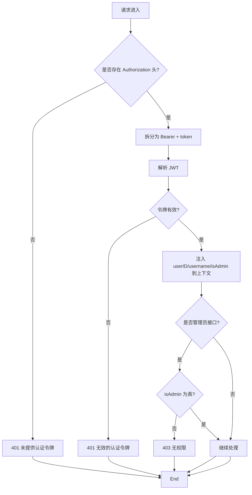
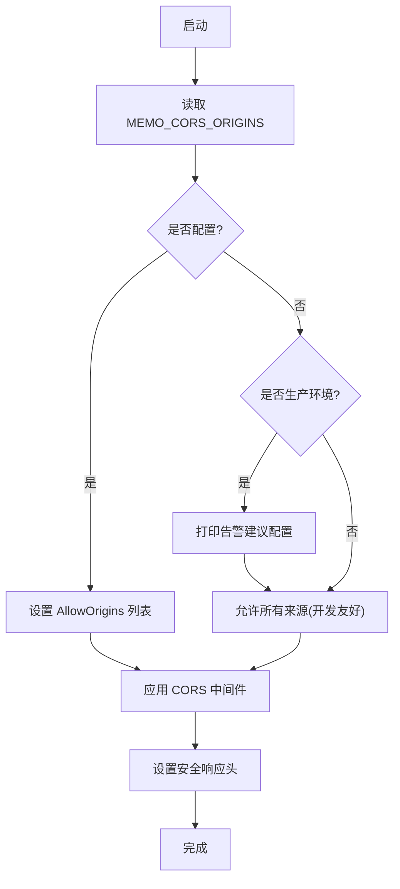
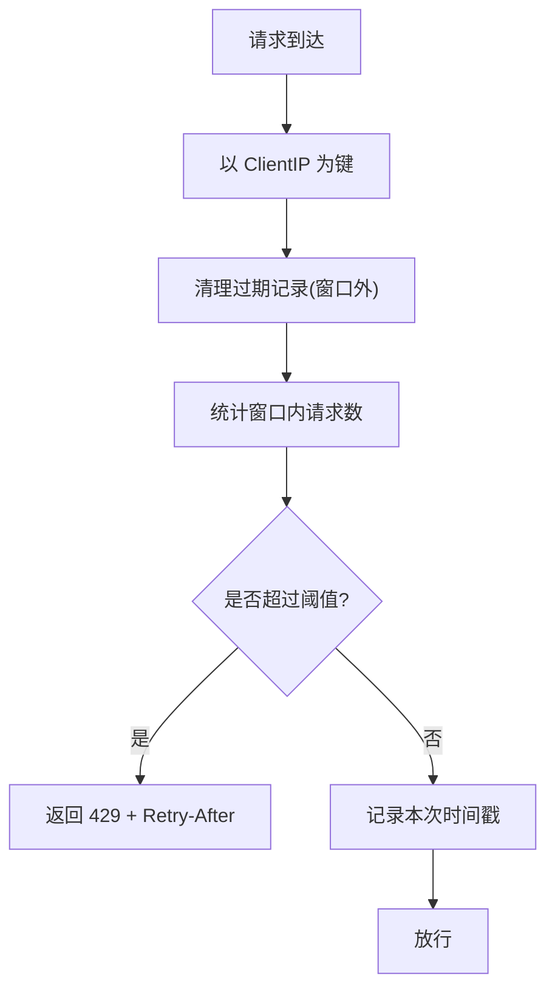
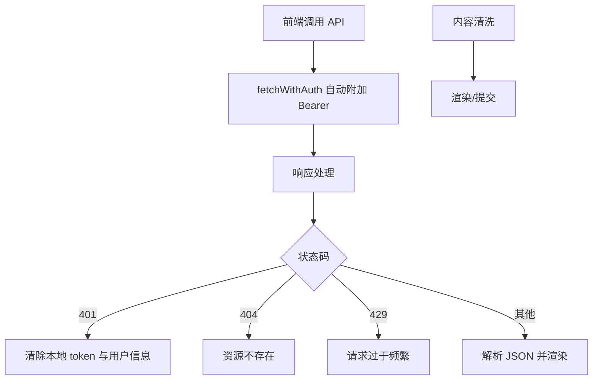
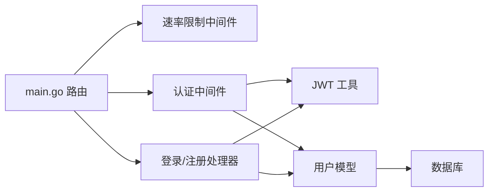

# 安全机制

<cite>
**本文引用的文件**
- [backend/main.go](file://backend/main.go)
- [.env.example](file://.env.example)
- [backend/utils/jwt.go](file://backend/utils/jwt.go)
- [backend/utils/encryption.go](file://backend/utils/encryption.go)
- [backend/middleware/auth.go](file://backend/middleware/auth.go)
- [backend/middleware/ratelimit.go](file://backend/middleware/ratelimit.go)
- [backend/handlers/auth.go](file://backend/handlers/auth.go)
- [backend/models/user.go](file://backend/models/user.go)
- [backend/database/database.go](file://backend/database/database.go)
- [frontend/src/utils/api.js](file://frontend/src/utils/api.js)
- [frontend/src/stores/auth.js](file://frontend/src/stores/auth.js)
</cite>

## 目录
1. [简介](#简介)
2. [项目结构](#项目结构)
3. [核心组件](#核心组件)
4. [架构总览](#架构总览)
5. [详细组件分析](#详细组件分析)
6. [依赖关系分析](#依赖关系分析)
7. [性能考量](#性能考量)
8. [故障排查指南](#故障排查指南)
9. [结论](#结论)
10. [附录](#附录)

## 简介
本文件系统化梳理 Memo Studio 的安全机制，覆盖认证授权、密码加密、权限控制、CORS 配置、速率限制、输入验证与清理、安全配置最佳实践以及应急响应要点。文档面向开发者与运维人员，既提供代码级细节，也给出可操作的实践建议。

## 项目结构
后端采用 Go + Gin 框架，前端使用 SvelteKit/SPA，安全相关能力主要集中在后端中间件、工具模块与路由层，前端负责携带令牌与错误处理。

**图表来源**
- [backend/main.go](file://backend/main.go#L46-L81)
- [backend/middleware/auth.go](file://backend/middleware/auth.go#L12-L52)
- [backend/middleware/ratelimit.go](file://backend/middleware/ratelimit.go#L96-L142)
- [backend/handlers/auth.go](file://backend/handlers/auth.go#L27-L93)
- [backend/utils/jwt.go](file://backend/utils/jwt.go#L29-L76)
- [backend/utils/encryption.go](file://backend/utils/encryption.go#L16-L107)
- [backend/models/user.go](file://backend/models/user.go#L22-L110)
- [backend/database/database.go](file://backend/database/database.go#L20-L60)
- [frontend/src/utils/api.js](file://frontend/src/utils/api.js#L52-L76)
- [frontend/src/stores/auth.js](file://frontend/src/stores/auth.js#L20-L75)

**章节来源**
- [backend/main.go](file://backend/main.go#L46-L81)
- [frontend/src/utils/api.js](file://frontend/src/utils/api.js#L52-L76)

## 核心组件
- JWT 认证与令牌管理：生成、解析、刷新，支持管理员标记与过期控制。
- 密码与数据安全：bcrypt 哈希、AES-GCM 加密、安全随机令牌生成。
- 权限控制：认证中间件与管理员专用中间件，结合数据库兜底管理员状态。
- CORS 与安全响应头：基于环境变量的白名单配置与通用安全头设置。
- 速率限制：基于内存的滑动窗口计数，支持全局与严格模式。
- 输入验证与清理：后端参数绑定与前端内容清洗，降低注入与异常风险。
- 安全配置：环境变量模板与生产环境提示。

**章节来源**
- [backend/utils/jwt.go](file://backend/utils/jwt.go#L22-L76)
- [backend/utils/encryption.go](file://backend/utils/encryption.go#L16-L107)
- [backend/middleware/auth.go](file://backend/middleware/auth.go#L12-L71)
- [backend/middleware/ratelimit.go](file://backend/middleware/ratelimit.go#L11-L143)
- [backend/main.go](file://backend/main.go#L46-L81)
- [frontend/src/utils/api.js](file://frontend/src/utils/api.js#L78-L104)

## 架构总览
下图展示从请求进入、认证授权、速率限制到业务处理的整体流程。

**图表来源**
- [backend/main.go](file://backend/main.go#L94-L196)
- [backend/middleware/ratelimit.go](file://backend/middleware/ratelimit.go#L96-L142)
- [backend/middleware/auth.go](file://backend/middleware/auth.go#L12-L71)
- [backend/utils/jwt.go](file://backend/utils/jwt.go#L51-L66)
- [backend/models/user.go](file://backend/models/user.go#L63-L76)
- [backend/handlers/auth.go](file://backend/handlers/auth.go#L27-L93)

## 详细组件分析

### JWT 认证机制
- 令牌生成
  - 默认有效期 24 小时，支持自定义过期时间。
  - Claims 包含用户 ID、用户名、管理员标识及标准声明（签发时间、生效时间等）。
- 令牌解析
  - 使用同一密钥进行签名验证；失败返回无效令牌错误。
- 令牌刷新
  - 基于解析现有令牌，生成新的同用户令牌，保持权限不变。
- 安全配置
  - 通过环境变量加载密钥；生产环境必须显式设置，否则启动即终止。
  - 启动时对生产环境缺失密钥进行告警提示。

**图表来源**
- [backend/utils/jwt.go](file://backend/utils/jwt.go#L29-L76)
- [.env.example](file://.env.example#L4-L6)

**章节来源**
- [backend/utils/jwt.go](file://backend/utils/jwt.go#L22-L76)
- [backend/main.go](file://backend/main.go#L324-L329)

### 密码加密策略
- bcrypt 哈希
  - 登录校验与注册创建均使用 bcrypt 对密码进行哈希存储。
  - 密码比较采用安全比较函数，避免时序攻击。
- AES-256-GCM 数据加密
  - 提供对称加密/解密工具，使用随机 Nonce 与 HKDF 风格的 SHA-256 派生密钥。
  - 当密钥为空时，透明返回明文，便于本地开发场景。
- 安全随机令牌
  - 使用加密安全的随机源生成令牌字符串，适用于一次性令牌等场景。

**图表来源**
- [backend/utils/encryption.go](file://backend/utils/encryption.go#L16-L107)
- [backend/models/user.go](file://backend/models/user.go#L22-L110)

**章节来源**
- [backend/utils/encryption.go](file://backend/utils/encryption.go#L16-L107)
- [backend/models/user.go](file://backend/models/user.go#L22-L110)

### 权限控制系统
- 认证中间件
  - 从 Authorization 头提取 Bearer 令牌并解析；失败返回 401。
  - 将用户信息注入上下文；兼容旧令牌中缺少管理员标记的情况，从数据库兜底。
- 管理员中间件
  - 仅允许 is_admin 为真的用户访问；未设置或为假则返回 403。
- 用户模型与权限
  - 用户表包含 is_admin 字段；迁移脚本引入该列并提供默认管理员策略。
  - 前端本地存储 token 与用户信息，配合拦截器自动附加 Authorization 头。

**图表来源**
- [backend/middleware/auth.go](file://backend/middleware/auth.go#L12-L71)
- [backend/models/user.go](file://backend/models/user.go#L63-L76)

**章节来源**
- [backend/middleware/auth.go](file://backend/middleware/auth.go#L12-L71)
- [backend/models/user.go](file://backend/models/user.go#L13-L20)
- [backend/database/database.go](file://backend/database/database.go#L440-L452)
- [frontend/src/stores/auth.js](file://frontend/src/stores/auth.js#L20-L75)
- [frontend/src/utils/api.js](file://frontend/src/utils/api.js#L52-L76)

### CORS 配置策略
- 白名单配置
  - 通过环境变量设置允许的来源列表；多个来源以逗号分隔。
  - 若未设置且处于生产环境，启动时打印告警建议配置。
- 安全头设置
  - 设置通用安全响应头：禁止 MIME 嗅探、限制内嵌、XSS 保护、搜索引擎不索引等。
- 预检请求处理
  - 中间件已启用 CORS，默认允许常见方法与头部，满足典型跨域场景。

**图表来源**
- [backend/main.go](file://backend/main.go#L55-L81)
- [.env.example](file://.env.example#L11-L12)

**章节来源**
- [backend/main.go](file://backend/main.go#L55-L81)
- [.env.example](file://.env.example#L11-L12)

### 速率限制机制
- 算法
  - 基于内存的滑动窗口计数，每个 IP 维护最近时间窗口内的请求时间戳。
- 限制策略
  - 全局速率限制：每分钟最多 50 次；严格速率限制：每分钟最多 30 次。
  - 超限时返回 429，并设置 Retry-After 与速率限制头。
- 并发与一致性
  - 使用互斥锁保护共享计数器，避免并发竞态。

**图表来源**
- [backend/middleware/ratelimit.go](file://backend/middleware/ratelimit.go#L11-L143)

**章节来源**
- [backend/middleware/ratelimit.go](file://backend/middleware/ratelimit.go#L11-L143)

### 输入验证与清理
- 后端
  - 使用框架内置绑定与校验，如登录/注册请求体字段必填与长度约束。
  - 用户名与密码在数据库层面进行哈希存储，避免明文落盘。
- 前端
  - 统一封装 fetchWithAuth 自动附加 Authorization 头。
  - 错误处理统一拦截 401/404/429 等状态并触发登出逻辑。
  - 内容清洗：对笔记内容进行类型与 JSON 安全化处理，防止异常对象或非法字符串污染渲染。

**图表来源**
- [frontend/src/utils/api.js](file://frontend/src/utils/api.js#L52-L76)
- [frontend/src/utils/api.js](file://frontend/src/utils/api.js#L34-L50)
- [frontend/src/utils/api.js](file://frontend/src/utils/api.js#L78-L104)

**章节来源**
- [backend/handlers/auth.go](file://backend/handlers/auth.go#L11-L93)
- [frontend/src/utils/api.js](file://frontend/src/utils/api.js#L34-L50)
- [frontend/src/utils/api.js](file://frontend/src/utils/api.js#L78-L104)

### 安全配置最佳实践
- 环境变量管理
  - 必填项：JWT 密钥（建议使用足够熵的随机值）。
  - 可选项：前端域名白名单、生产环境开关。
- 敏感信息保护
  - 生产环境必须设置 JWT 密钥；未设置时启动即告警。
  - 默认管理员密码策略：支持通过环境变量注入或首次启动随机生成并提示修改。
- 日志安全
  - 生产模式下避免输出调试日志；错误信息不泄露内部细节。
- 部署建议
  - 使用反向代理或 CDN 时，确保正确传递真实客户端 IP（速率限制依赖 ClientIP）。
  - 前端 CSP 由 SvelteKit 侧提供，后端响应头补充安全策略。

**章节来源**
- [.env.example](file://.env.example#L4-L15)
- [backend/main.go](file://backend/main.go#L324-L329)
- [backend/database/database.go](file://backend/database/database.go#L454-L540)

## 依赖关系分析
- 认证链路
  - 路由层挂载速率限制与认证中间件；处理器依赖 JWT 工具生成令牌，依赖用户模型进行密码校验与用户信息查询。
- 权限链路
  - 认证中间件解析 JWT 并将用户信息注入上下文；管理员中间件读取上下文中的管理员标记，必要时回查数据库。
- 数据流
  - 用户模型通过 bcrypt 与数据库交互；加密工具用于可选的数据保护场景。

**图表来源**
- [backend/main.go](file://backend/main.go#L94-L196)
- [backend/middleware/auth.go](file://backend/middleware/auth.go#L12-L71)
- [backend/middleware/ratelimit.go](file://backend/middleware/ratelimit.go#L96-L142)
- [backend/handlers/auth.go](file://backend/handlers/auth.go#L27-L93)
- [backend/utils/jwt.go](file://backend/utils/jwt.go#L29-L76)
- [backend/models/user.go](file://backend/models/user.go#L22-L110)
- [backend/database/database.go](file://backend/database/database.go#L20-L60)

**章节来源**
- [backend/main.go](file://backend/main.go#L94-L196)
- [backend/middleware/auth.go](file://backend/middleware/auth.go#L12-L71)
- [backend/middleware/ratelimit.go](file://backend/middleware/ratelimit.go#L96-L142)
- [backend/handlers/auth.go](file://backend/handlers/auth.go#L27-L93)
- [backend/utils/jwt.go](file://backend/utils/jwt.go#L29-L76)
- [backend/models/user.go](file://backend/models/user.go#L22-L110)
- [backend/database/database.go](file://backend/database/database.go#L20-L60)

## 性能考量
- JWT 解析与哈希
  - HS256 签名与 bcrypt 比较均为 CPU 密集型，但调用频次低，影响有限。
- 速率限制
  - 内存计数器与互斥锁带来较小开销；建议在高并发场景结合分布式缓存或限流网关。
- 数据库
  - bcrypt 成本因子默认值平衡了安全性与性能；可根据硬件能力调整。
- 前端
  - 统一错误处理减少重复逻辑，提升用户体验与稳定性。

## 故障排查指南
- 401 未提供/无效认证令牌
  - 检查前端是否正确保存与发送 Bearer 令牌；确认后端 JWT 密钥配置。
- 403 无权限
  - 确认用户是否具备管理员身份；若为旧令牌，检查数据库兜底逻辑是否生效。
- 429 请求过于频繁
  - 检查速率限制阈值与客户端退避策略；必要时降低请求频率或使用严格模式。
- CORS 跨域失败
  - 检查 MEMO_CORS_ORIGINS 是否包含当前前端域名；生产环境务必显式配置。
- 密码相关错误
  - bcrypt 比较失败通常表示用户名或密码错误；确认数据库中哈希值未被篡改。
- 启动告警
  - 生产环境未设置 JWT 密钥会触发告警；请尽快补齐并重启服务。

**章节来源**
- [backend/middleware/auth.go](file://backend/middleware/auth.go#L12-L71)
- [backend/middleware/ratelimit.go](file://backend/middleware/ratelimit.go#L96-L142)
- [backend/main.go](file://backend/main.go#L55-L81)
- [backend/utils/jwt.go](file://backend/utils/jwt.go#L13-L20)
- [backend/models/user.go](file://backend/models/user.go#L78-L110)

## 结论
Memo Studio 的安全体系以 JWT 认证为核心，辅以 bcrypt 密码哈希、AES 数据加密、严格的 CORS 与安全响应头、速率限制与前端统一错误处理。生产环境需重点落实 JWT 密钥与 CORS 白名单配置，配合数据库迁移与默认管理员策略，形成完整的安全闭环。

## 附录
- 环境变量清单
  - 必填：JWT 密钥
  - 可选：前端域名白名单、生产环境开关、管理员密码
- 建议的应急响应步骤
  - 发现异常：立即检查密钥与 CORS 配置、审计日志、回滚可疑变更。
  - 修复后：通知受影响用户重新登录，监控指标与告警。