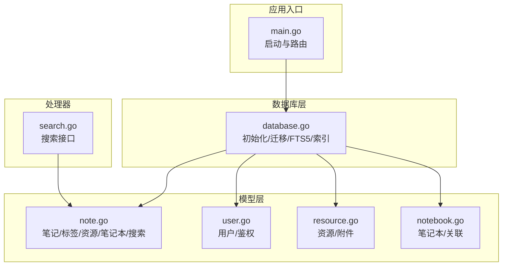
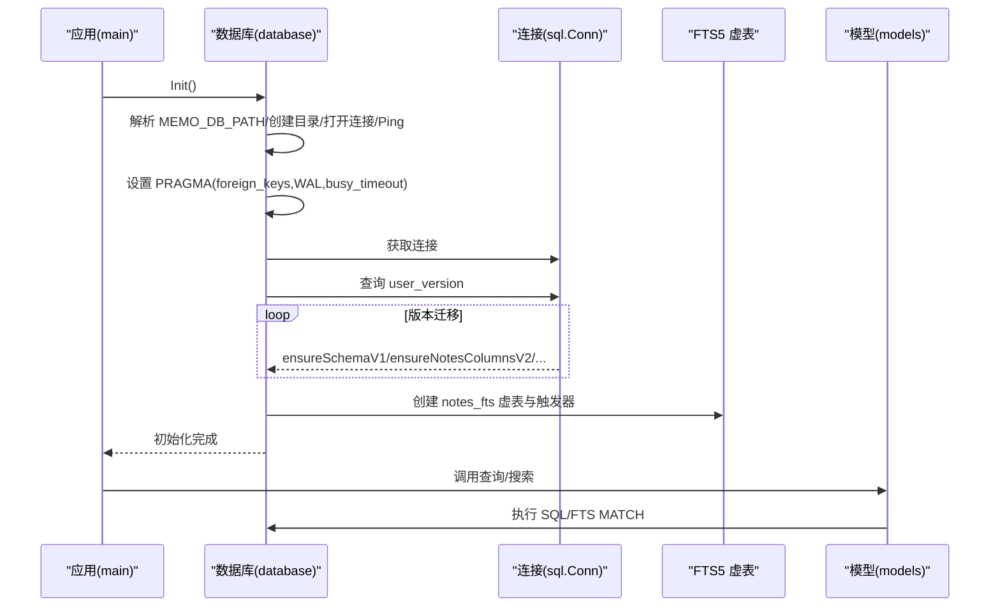
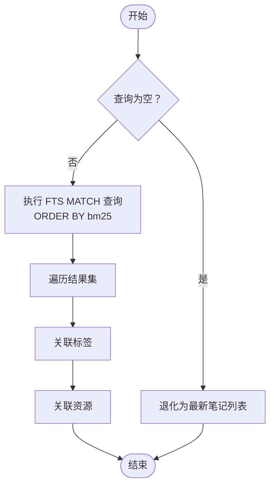
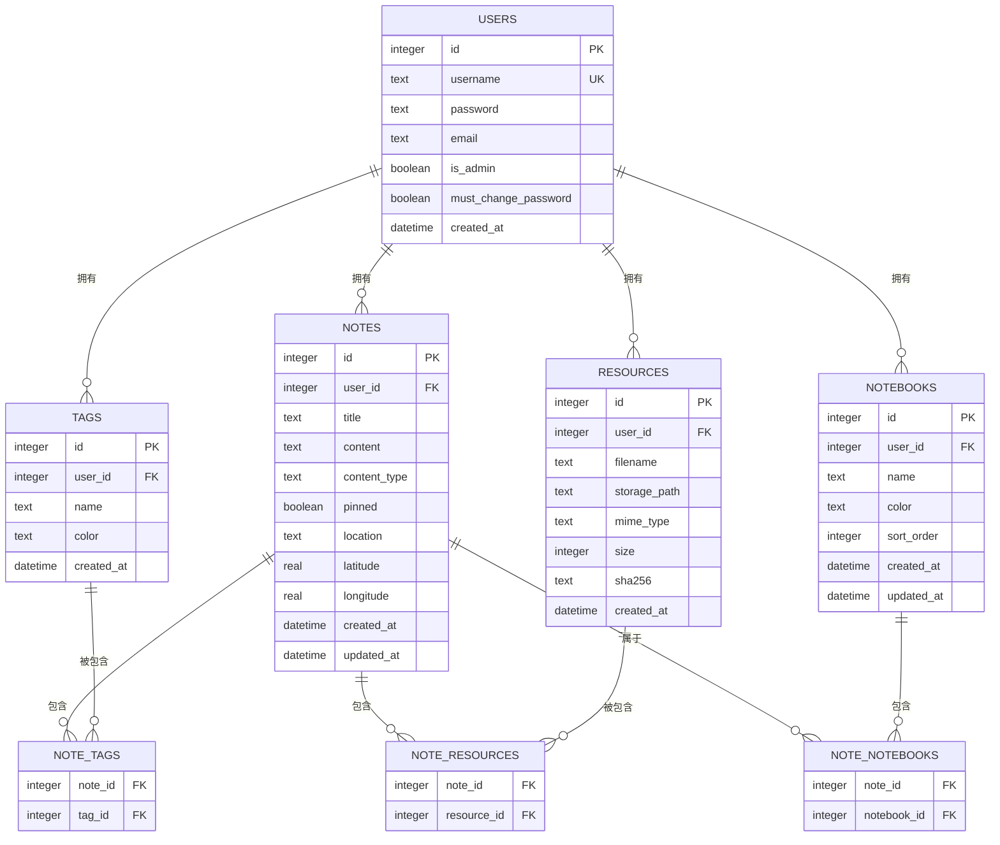
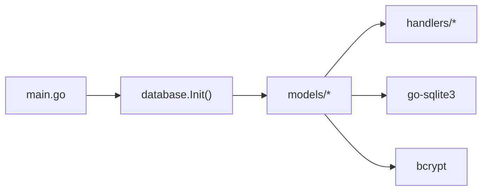

# 数据库设计

<cite>
**本文引用的文件**
- [database.go](file://backend/database/database.go)
- [database_test.go](file://backend/database/database_test.go)
- [note.go](file://backend/models/note.go)
- [user.go](file://backend/models/user.go)
- [resource.go](file://backend/models/resource.go)
- [notebook.go](file://backend/models/notebook.go)
- [search.go](file://backend/handlers/search.go)
- [init.sql](file://server/db/init.sql)
- [main.go](file://backend/main.go)
</cite>

## 目录
1. [简介](#简介)
2. [项目结构](#项目结构)
3. [核心组件](#核心组件)
4. [架构总览](#架构总览)
5. [详细组件分析](#详细组件分析)
6. [依赖分析](#依赖分析)
7. [性能考虑](#性能考虑)
8. [故障排查指南](#故障排查指南)
9. [结论](#结论)
10. [附录](#附录)

## 简介
本文件面向 Memo Studio 的数据库设计，系统性阐述 SQLite 初始化流程、表结构与索引策略、FTS5 全文搜索引擎实现、数据库迁移机制、表关系设计、数据完整性约束、性能优化建议以及最佳实践。文档基于仓库中的 Go 实现与模型代码进行归纳总结，帮助开发者与运维人员理解并维护数据库层。

## 项目结构
数据库相关的核心代码集中在后端模块中，主要文件如下：
- 初始化与迁移：backend/database/database.go
- 模型与查询：backend/models 下的 note.go、user.go、resource.go、notebook.go
- 搜索处理器：backend/handlers/search.go
- 旧版初始化脚本（server/db/init.sql）
- 应用入口：backend/main.go

图表来源
- [main.go](file://backend/main.go#L34-L37)
- [database.go](file://backend/database/database.go#L20-L60)
- [note.go](file://backend/models/note.go#L46-L105)
- [user.go](file://backend/models/user.go#L22-L44)
- [resource.go](file://backend/models/resource.go#L36-L56)
- [notebook.go](file://backend/models/notebook.go#L67-L83)
- [search.go](file://backend/handlers/search.go#L13-L43)

章节来源
- [main.go](file://backend/main.go#L28-L37)
- [database.go](file://backend/database/database.go#L20-L60)

## 核心组件
- 数据库初始化与连接配置
  - 支持通过环境变量 MEMO_DB_PATH 指定数据库路径，默认 ./notes.db
  - 自动创建目录、打开连接、Ping 检查
  - 设置关键 PRAGMA：外键开启、WAL 日志模式、忙等待超时
- 版本化迁移与 Schema 管理
  - 使用 PRAGMA user_version 维护版本，按版本顺序执行迁移
  - 支持多版本演进：基础 schema、扩展字段、资源表、用户权限、多用户隔离、标签唯一性、笔记本、位置字段
- FTS5 全文搜索
  - 虚拟表 notes_fts，rowid 与 notes.id 对齐
  - 通过触发器维护一致性（新增/删除/更新）
  - 提供 SearchNotes 查询，使用 bm25 排序
- 表关系与完整性
  - 笔记表 notes、标签表 tags、笔记-标签关联表 note_tags、用户表 users、资源表 resources、笔记-资源关联表 note_resources、笔记本 notebooks、笔记-笔记本关联表 note_notebooks
  - 外键约束与级联删除策略
- 性能与索引
  - 为关键查询建立索引（如 notebooks.user_id、note_notebooks.notebook_id、tags(user_id,name)）
  - 使用 WAL 模式提升并发读写性能
  - FTS5 使用 unicode61 分词器

章节来源
- [database.go](file://backend/database/database.go#L20-L60)
- [database.go](file://backend/database/database.go#L62-L178)
- [note.go](file://backend/models/note.go#L329-L392)

## 架构总览
下图展示数据库初始化、迁移、FTS5 与模型交互的整体流程。

图表来源
- [main.go](file://backend/main.go#L34-L37)
- [database.go](file://backend/database/database.go#L20-L60)
- [database.go](file://backend/database/database.go#L62-L178)
- [database.go](file://backend/database/database.go#L243-L374)

## 详细组件分析

### 数据库初始化与连接配置
- 环境变量 MEMO_DB_PATH 控制数据库文件路径，若未设置则默认 ./notes.db
- 自动创建数据库目录，避免首次运行失败
- 连接建立后执行 Ping 检查
- 设置关键 PRAGMA：
  - 外键约束开启（foreign_keys = ON）
  - WAL 日志模式（journal_mode = WAL）
  - 忙等待超时（busy_timeout = 5000）
- 迁移流程在单连接上下文中执行，避免 schema 可见性问题

章节来源
- [database.go](file://backend/database/database.go#L20-L60)

### 版本化迁移机制
- 使用 PRAGMA user_version 记录当前版本，按版本顺序依次执行迁移
- 主要版本与变更：
  - v1：基础 schema（notes、tags、users、FTS5 虚表与触发器）
  - v2：notes 扩展字段（pinned、content_type、user_id）
  - v3：resources 表与 note_resources 关联表
  - v4：users 增加 is_admin
  - v5：users 增加 must_change_password，并根据环境变量初始化默认管理员
  - v6：tags 增加 user_id 并迁移历史数据；notes.user_id 迁移至主用户
  - v7：移除 tags.name 全局 UNIQUE，改为 (user_id,name) 唯一（通过重建表实现）
  - v8：notebooks 表与 note_notebooks 关联表
  - v9：notes 增加 location/latitude/longitude 字段
- 迁移函数均在单连接上下文中执行，确保 DDL 一致性

章节来源
- [database.go](file://backend/database/database.go#L62-L178)
- [database.go](file://backend/database/database.go#L180-L209)
- [database.go](file://backend/database/database.go#L211-L241)
- [database.go](file://backend/database/database.go#L376-L406)
- [database.go](file://backend/database/database.go#L408-L438)
- [database.go](file://backend/database/database.go#L440-L540)
- [database.go](file://backend/database/database.go#L564-L591)
- [database.go](file://backend/database/database.go#L593-L647)

### FTS5 全文搜索引擎
- 虚拟表定义
  - notes_fts 使用 fts5，列：content（分词）、note_id（UNINDEXED）
  - 分词器：unicode61
- 触发器维护
  - notes_ai：新增笔记时向 FTS 插入对应行
  - notes_ad：删除笔记时从 FTS 删除对应行
  - notes_au：更新笔记时先删后插，保持一致性
- 搜索查询
  - SearchNotes 使用 MATCH 语法与 bm25 排序
  - 空查询退化为最新笔记列表
  - 支持 limit/offset 参数
- 兼容性注意
  - FTS5 需要在构建时启用 sqlite_fts5 tag

图表来源
- [note.go](file://backend/models/note.go#L329-L392)
- [database.go](file://backend/database/database.go#L254-L276)

章节来源
- [database.go](file://backend/database/database.go#L254-L276)
- [note.go](file://backend/models/note.go#L329-L392)

### 表关系设计
- 用户与笔记
  - users.id → notes.user_id（可为空，兼容旧数据）
- 笔记与标签
  - note_tags(note_id, tag_id) 作为多对多关联
  - tags.user_id 用于多用户隔离
- 笔记与资源
  - note_resources(note_id, resource_id) 作为多对多关联
- 笔记与笔记本
  - note_notebooks(note_id, notebook_id) 作为多对多关联
  - notebooks.user_id 用于多用户隔离

图表来源
- [database.go](file://backend/database/database.go#L243-L374)
- [database.go](file://backend/database/database.go#L180-L209)
- [database.go](file://backend/database/database.go#L408-L438)
- [database.go](file://backend/database/database.go#L564-L591)
- [notebook.go](file://backend/models/notebook.go#L21-L46)
- [resource.go](file://backend/models/resource.go#L36-L56)
- [note.go](file://backend/models/note.go#L46-L105)

章节来源
- [database.go](file://backend/database/database.go#L243-L374)
- [database.go](file://backend/database/database.go#L180-L209)
- [database.go](file://backend/database/database.go#L408-L438)
- [database.go](file://backend/database/database.go#L564-L591)
- [notebook.go](file://backend/models/notebook.go#L21-L46)
- [resource.go](file://backend/models/resource.go#L36-L56)
- [note.go](file://backend/models/note.go#L46-L105)

### 数据完整性约束与触发器
- 外键约束
  - notes.user_id → users(id)（SET NULL）
  - tags.user_id → users(id)（SET NULL）
  - resources.user_id → users(id)（SET NULL）
  - notebooks.user_id → users(id)（CASCADE）
  - note_tags(note_id/tag_id) → notes(id)/tags(id)（CASCADE）
  - note_resources(note_id/resource_id) → notes(id)/resources(id)（CASCADE）
  - note_notebooks(note_id/notebook_id) → notes(id)/notebooks(id)（CASCADE）
- 触发器
  - notes_ai/notes_ad/notes_au：维护 notes_fts 与 notes 的一致性
- 唯一性约束
  - tags(name) 全局唯一 → v7 改为 (user_id,name) 唯一
  - note_tags(note_id,tag_id) 复合主键
  - note_resources(note_id,resource_id) 复合主键
  - note_notebooks(note_id,notebook_id) 复合主键

章节来源
- [database.go](file://backend/database/database.go#L243-L374)
- [database.go](file://backend/database/database.go#L593-L647)
- [database.go](file://backend/database/database.go#L180-L209)
- [database.go](file://backend/database/database.go#L408-L438)

### 索引策略
- notebooks(user_id)
- note_notebooks(notebook_id)
- tags(user_id,name)
- notes(content_type)（建议：根据查询模式评估是否添加）
- notes(user_id)（建议：按用户隔离查询时评估）

章节来源
- [database.go](file://backend/database/database.go#L205-L207)
- [database.go](file://backend/database/database.go#L573-L574)
- [database.go](file://backend/database/database.go#L635-L636)
- [notebook.go](file://backend/models/notebook.go#L21-L46)

### 搜索与查询
- 搜索接口
  - handlers.search.go 将 /api/search 代理到 models.ListMemos（内部调用 SearchNotes）
- 查询行为
  - SearchNotes：FTS MATCH + bm25 排序，支持 limit/offset
  - 空查询：退化为最新笔记列表
- 位置查询
  - GetNotesByLocation：按 location 字段查询
- 随机复习
  - RandomNotes：按用户隔离、可选标签与时间窗口、随机排序

章节来源
- [search.go](file://backend/handlers/search.go#L13-L43)
- [note.go](file://backend/models/note.go#L329-L392)
- [note.go](file://backend/models/note.go#L760-L800)
- [note.go](file://backend/models/note.go#L439-L516)

### 用户与资源模型
- 用户模型
  - 支持密码哈希、管理员标志、必须改密标志
  - 提供创建、登录验证、密码修改等操作
- 资源模型
  - 资源表与笔记-资源关联表
  - 支持分页列出、删除资源（仅删除记录）

章节来源
- [user.go](file://backend/models/user.go#L13-L20)
- [user.go](file://backend/models/user.go#L22-L44)
- [user.go](file://backend/models/user.go#L78-L110)
- [resource.go](file://backend/models/resource.go#L10-L20)
- [resource.go](file://backend/models/resource.go#L36-L56)
- [resource.go](file://backend/models/resource.go#L117-L169)

### 笔记本模型
- 列出笔记本、获取笔记本详情、创建/更新/删除笔记本
- 设置笔记所属笔记本（SetNoteNotebooks），支持批量更新
- 按笔记本分页列出笔记并统计数量

章节来源
- [notebook.go](file://backend/models/notebook.go#L10-L19)
- [notebook.go](file://backend/models/notebook.go#L21-L46)
- [notebook.go](file://backend/models/notebook.go#L67-L83)
- [notebook.go](file://backend/models/notebook.go#L130-L150)
- [notebook.go](file://backend/models/notebook.go#L152-L194)
- [notebook.go](file://backend/models/notebook.go#L196-L206)

## 依赖分析
- 初始化依赖
  - main.go 在启动时调用 database.Init()
- 模块依赖
  - models 层依赖 database.DB
  - handlers 层依赖 models 层
- 外部依赖
  - go-sqlite3 驱动
  - bcrypt 用于密码哈希

图表来源
- [main.go](file://backend/main.go#L34-L37)
- [database.go](file://backend/database/database.go#L14-L16)
- [user.go](file://backend/models/user.go#L3-L11)

章节来源
- [main.go](file://backend/main.go#L34-L37)
- [database.go](file://backend/database/database.go#L14-L16)

## 性能考虑
- WAL 模式
  - 通过 PRAGMA journal_mode=WAL 提升并发读取性能
- 触发器与 FTS5
  - 触发器保证 FTS 与主表一致，但会带来写入开销；建议在高写入场景评估是否需要异步同步策略
- 查询优化
  - FTS MATCH + bm25 排序适合全文检索
  - 为高频查询字段（如 notes.user_id、tags.user_id、notebooks.user_id）建立索引
- 缓存机制
  - 可在应用层对热点查询结果进行缓存（如标签计数、热门标签）
- 连接与事务
  - 迁移在单连接执行，避免 schema 可见性问题
  - 批量操作建议使用事务（如创建笔记时的标签/资源关联）

章节来源
- [database.go](file://backend/database/database.go#L45-L51)
- [database.go](file://backend/database/database.go#L254-L276)
- [note.go](file://backend/models/note.go#L329-L392)

## 故障排查指南
- FTS5 未启用
  - 现象：创建 notes_fts 报错
  - 处理：以 sqlite_fts5 构建标签重新编译
- 触发器冲突
  - 现象：创建触发器失败
  - 处理：迁移逻辑会尝试删除现有触发器后再创建
- 默认管理员初始化
  - 现象：首次运行无管理员
  - 处理：设置 MEMO_ADMIN_PASSWORD 或允许自动生成随机密码并强制改密
- 数据迁移失败
  - 现象：user_version 升级中断
  - 处理：检查迁移函数与数据库权限，确认单连接上下文执行

章节来源
- [database.go](file://backend/database/database.go#L254-L276)
- [database.go](file://backend/database/database.go#L318-L349)
- [database.go](file://backend/database/database.go#L454-L540)
- [database_test.go](file://backend/database/database_test.go#L9-L33)

## 结论
Memo Studio 的数据库层采用 SQLite + FTS5 的组合，通过版本化迁移实现平滑演进，配合外键与触发器保障数据一致性。模型层围绕笔记、标签、资源、笔记本等实体组织，提供完整的 CRUD 与搜索能力。建议在生产环境中启用 WAL、合理建立索引、在应用层引入缓存，并持续关注 FTS5 的构建标签与性能表现。

## 附录
- 环境变量
  - MEMO_DB_PATH：数据库文件路径
  - MEMO_ADMIN_PASSWORD：初始化默认管理员密码
  - MEMO_STORAGE_DIR：资源存储目录
  - MEMO_CORS_ORIGINS：CORS 允许的来源
  - PORT：服务端口
- 最佳实践
  - 使用事务批量更新关联表
  - 为高频查询字段建立索引
  - 定期备份数据库文件
  - 在构建时启用 sqlite_fts5 以获得 FTS5 功能