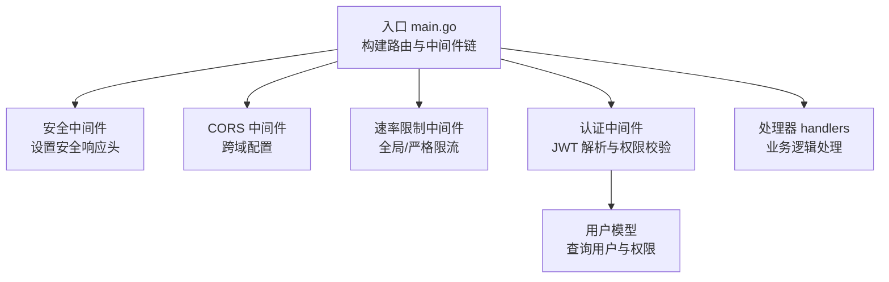
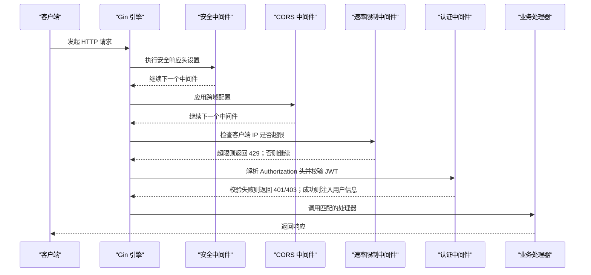
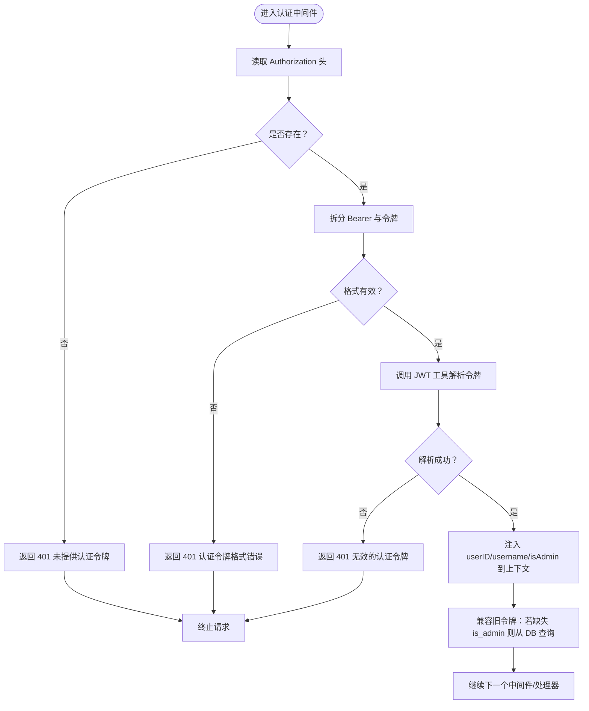
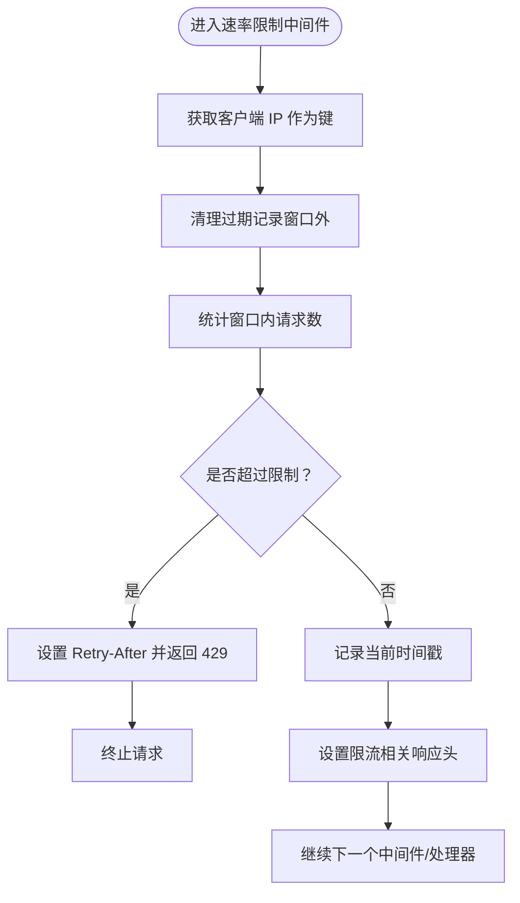
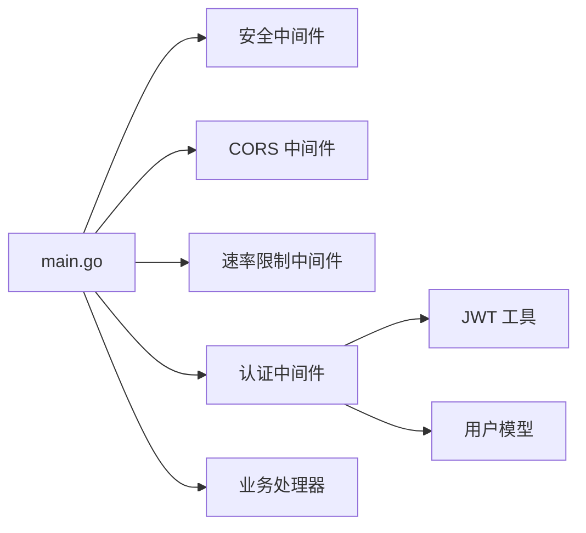

# 中间件机制

<cite>
**本文引用的文件**
- [backend/main.go](file://backend/main.go)
- [backend/middleware/auth.go](file://backend/middleware/auth.go)
- [backend/middleware/ratelimit.go](file://backend/middleware/ratelimit.go)
- [backend/utils/jwt.go](file://backend/utils/jwt.go)
- [backend/handlers/auth.go](file://backend/handlers/auth.go)
- [backend/models/user.go](file://backend/models/user.go)
- [.env.example](file://.env.example)
</cite>

## 目录
1. [简介](#简介)
2. [项目结构](#项目结构)
3. [核心组件](#核心组件)
4. [架构总览](#架构总览)
5. [详细组件分析](#详细组件分析)
6. [依赖关系分析](#依赖关系分析)
7. [性能考量](#性能考量)
8. [故障排查指南](#故障排查指南)
9. [结论](#结论)
10. [附录](#附录)

## 简介
本文件系统性梳理 Memo Studio 的中间件机制，重点覆盖以下方面：
- Gin 中间件链的构建与调用顺序
- 认证中间件（JWT 令牌解析、用户身份验证、权限检查）
- 速率限制中间件（请求计数算法、限流策略、配置参数）
- 安全中间件（安全响应头、XSS 防护、点击劫持防护）
- CORS 中间件配置（允许的源、方法、头信息）
- 中间件开发最佳实践与自定义中间件实现指南

## 项目结构
Memo Studio 后端采用 Gin 框架，中间件主要分布在以下位置：
- 全局安全中间件与 CORS 配置位于入口文件中
- 认证中间件与速率限制中间件位于独立包中
- JWT 工具函数封装于工具包
- 认证处理器与用户模型位于对应包中

图表来源
- [backend/main.go](file://backend/main.go#L46-L80)
- [backend/middleware/auth.go](file://backend/middleware/auth.go#L12-L52)
- [backend/middleware/ratelimit.go](file://backend/middleware/ratelimit.go#L96-L142)
- [backend/utils/jwt.go](file://backend/utils/jwt.go#L22-L66)
- [backend/models/user.go](file://backend/models/user.go#L46-L110)

章节来源
- [backend/main.go](file://backend/main.go#L28-L196)

## 核心组件
- 安全中间件：统一注入安全响应头，提升应用抗攻击能力
- CORS 中间件：基于环境变量灵活配置允许的源、方法与头
- 认证中间件：解析 Authorization 头中的 Bearer Token，校验 JWT 并将用户信息注入上下文
- 速率限制中间件：基于内存的滑动窗口计数算法，支持全局与严格两种策略
- JWT 工具：生成、解析与刷新令牌，支持自定义有效期

章节来源
- [backend/main.go](file://backend/main.go#L46-L80)
- [backend/middleware/auth.go](file://backend/middleware/auth.go#L12-L71)
- [backend/middleware/ratelimit.go](file://backend/middleware/ratelimit.go#L11-L142)
- [backend/utils/jwt.go](file://backend/utils/jwt.go#L22-L76)

## 架构总览
下图展示中间件链在请求生命周期中的执行顺序与职责分工。

图表来源
- [backend/main.go](file://backend/main.go#L46-L80)
- [backend/middleware/ratelimit.go](file://backend/middleware/ratelimit.go#L96-L142)
- [backend/middleware/auth.go](file://backend/middleware/auth.go#L12-L71)
- [backend/handlers/auth.go](file://backend/handlers/auth.go#L27-L53)

## 详细组件分析

### 认证中间件（JWT）
- 功能概述
  - 从请求头提取 Bearer 令牌
  - 使用 JWT 工具解析并校验签名与有效期
  - 将用户 ID、用户名与管理员标识注入上下文
  - 支持“仅管理员”权限检查中间件

- 关键流程
  - 解析 Authorization 头并校验格式
  - 调用 JWT 工具解析令牌，失败则返回 401
  - 将用户信息写入上下文，兼容旧令牌的管理员字段兜底
  - 通过后进入后续处理器

图表来源
- [backend/middleware/auth.go](file://backend/middleware/auth.go#L12-L52)
- [backend/utils/jwt.go](file://backend/utils/jwt.go#L51-L66)
- [backend/models/user.go](file://backend/models/user.go#L63-L76)

章节来源
- [backend/middleware/auth.go](file://backend/middleware/auth.go#L12-L71)
- [backend/utils/jwt.go](file://backend/utils/jwt.go#L22-L76)
- [backend/models/user.go](file://backend/models/user.go#L46-L110)

### 速率限制中间件（滑动窗口）
- 设计要点
  - 基于内存的滑动窗口计数算法
  - 以客户端 IP 为键进行限流
  - 提供全局限流与严格限流两种策略
  - 在响应头中暴露限流状态，便于监控

- 算法细节
  - 清理过期请求记录（窗口外）
  - 若当前窗口内请求数达到上限则拒绝
  - 记录本次请求时间戳并返回允许

图表来源
- [backend/middleware/ratelimit.go](file://backend/middleware/ratelimit.go#L28-L81)
- [backend/middleware/ratelimit.go](file://backend/middleware/ratelimit.go#L96-L142)

章节来源
- [backend/middleware/ratelimit.go](file://backend/middleware/ratelimit.go#L11-L142)

### 安全中间件（安全响应头）
- 注入的安全头
  - X-Content-Type-Options: nosniff
  - X-Frame-Options: SAMEORIGIN
  - X-XSS-Protection: 1; mode=block
  - X-Robots-Tag: noindex, nofollow

- 作用
  - 抑制浏览器类型嗅探与点击劫持
  - 启用 XSS 过滤保护
  - 防止搜索引擎索引

章节来源
- [backend/main.go](file://backend/main.go#L46-L53)

### CORS 中间件配置
- 配置来源
  - 通过环境变量 MEMO_CORS_ORIGINS 动态设置允许的源列表
  - 默认允许所有源（开发环境），生产环境建议显式配置
  - 允许的方法与头包含常见 API 场景

- 配置行为
  - 若设置了非空的源列表，则仅允许这些源
  - 若为空，则允许所有源（生产环境警告）
  - 方法与头默认允许 GET/POST/PUT/DELETE/OPTIONS 与常见头部

章节来源
- [backend/main.go](file://backend/main.go#L55-L80)
- [.env.example](file://.env.example#L11-L12)

### JWT 工具与令牌管理
- 结构与用途
  - Claims 包含用户 ID、用户名、管理员标识及标准声明
  - 支持生成默认 24 小时有效期的令牌
  - 支持自定义有效期
  - 支持解析与刷新令牌

- 安全注意
  - 生产环境必须设置 MEMO_JWT_SECRET
  - 入口处对生产模式进行校验

章节来源
- [backend/utils/jwt.go](file://backend/utils/jwt.go#L22-L76)
- [backend/main.go](file://backend/main.go#L324-L329)

### 认证处理器与用户模型
- 登录/注册处理器
  - 登录：验证凭据，生成 JWT 并返回
  - 注册：校验用户名与密码长度，创建用户并返回 JWT

- 用户模型
  - 提供按用户名/ID 查询用户
  - 密码使用 bcrypt 存储与校验
  - 管理员标识用于权限控制

章节来源
- [backend/handlers/auth.go](file://backend/handlers/auth.go#L27-L93)
- [backend/models/user.go](file://backend/models/user.go#L22-L110)

## 依赖关系分析
- 中间件链耦合
  - 安全中间件与 CORS 中间件对所有请求生效，优先级靠前
  - 速率限制中间件在公开接口组上应用，避免对健康检查与静态资源限流
  - 认证中间件在需要鉴权的路由组上应用，管理员权限中间件进一步约束

- 外部依赖
  - Gin 中间件机制与 gin-contrib/cors
  - JWT 解析库（golang-jwt）
  - 数据库访问（用户查询）

图表来源
- [backend/main.go](file://backend/main.go#L46-L80)
- [backend/middleware/auth.go](file://backend/middleware/auth.go#L12-L71)
- [backend/middleware/ratelimit.go](file://backend/middleware/ratelimit.go#L96-L142)
- [backend/utils/jwt.go](file://backend/utils/jwt.go#L22-L76)
- [backend/models/user.go](file://backend/models/user.go#L46-L110)

章节来源
- [backend/main.go](file://backend/main.go#L94-L196)

## 性能考量
- 速率限制
  - 内存存储的滑动窗口算法简单高效，适合中小规模并发
  - 对于高并发场景，建议引入分布式缓存（如 Redis）实现共享计数器
- 认证
  - JWT 解析为 CPU 密集型操作，建议在网关层或边缘缓存热点用户信息
  - 管理员标识兜底查询仅在旧令牌场景触发，应尽快迁移至新令牌
- CORS
  - 允许所有源会增加浏览器预检负担，生产环境建议明确配置允许源

## 故障排查指南
- 401 未提供认证令牌
  - 检查请求头 Authorization 是否存在且格式为 Bearer <token>
- 401 无效的认证令牌
  - 确认 MEMO_JWT_SECRET 设置正确
  - 核对令牌是否过期或被篡改
- 403 无权限
  - 确认用户具备管理员权限或使用正确的路由组
- 429 请求过于频繁
  - 检查客户端 IP 是否被限流
  - 调整速率限制策略或等待窗口重置
- CORS 错误
  - 检查 MEMO_CORS_ORIGINS 是否包含当前前端域名
  - 确认浏览器发起的请求方法与头是否在允许范围内

章节来源
- [backend/middleware/auth.go](file://backend/middleware/auth.go#L16-L36)
- [backend/middleware/auth.go](file://backend/middleware/auth.go#L54-L70)
- [backend/middleware/ratelimit.go](file://backend/middleware/ratelimit.go#L104-L112)
- [backend/main.go](file://backend/main.go#L55-L80)
- [backend/main.go](file://backend/main.go#L324-L329)

## 结论
Memo Studio 的中间件体系以 Gin 为核心，通过安全响应头、CORS、认证与速率限制四类中间件形成完整的请求治理链路。认证中间件基于 JWT 实现，结合用户模型完成身份与权限校验；速率限制中间件采用滑动窗口算法，兼顾易用性与可扩展性；安全与 CORS 中间件在入口层统一治理，提升整体安全性与跨域体验。建议在生产环境中强化令牌密钥管理、明确 CORS 配置，并根据业务规模考虑分布式限流方案。

## 附录

### 中间件开发最佳实践
- 明确职责边界：每个中间件只做一件事，避免过度耦合
- 保持幂等：中间件不应改变请求体与响应体，仅影响控制流
- 及时返回：遇到错误立即返回并终止链路
- 上下文传递：通过 gin.Context 传递必要数据，避免全局状态
- 可观测性：在关键节点输出日志或指标，便于排障
- 可测试性：为中间件编写单元测试，覆盖正常与异常路径

### 自定义中间件实现指南
- 定义函数签名
  - 返回 gin.HandlerFunc 类型
  - 在函数体内实现前置逻辑、调用 c.Next()、再实现后置逻辑
- 注册中间件
  - 全局注册：r.Use(...)
  - 分组注册：group.Use(...)
- 注意事项
  - 避免阻塞后续中间件或处理器
  - 正确设置响应头与状态码
  - 对外部依赖（如数据库、缓存）做好错误处理与降级