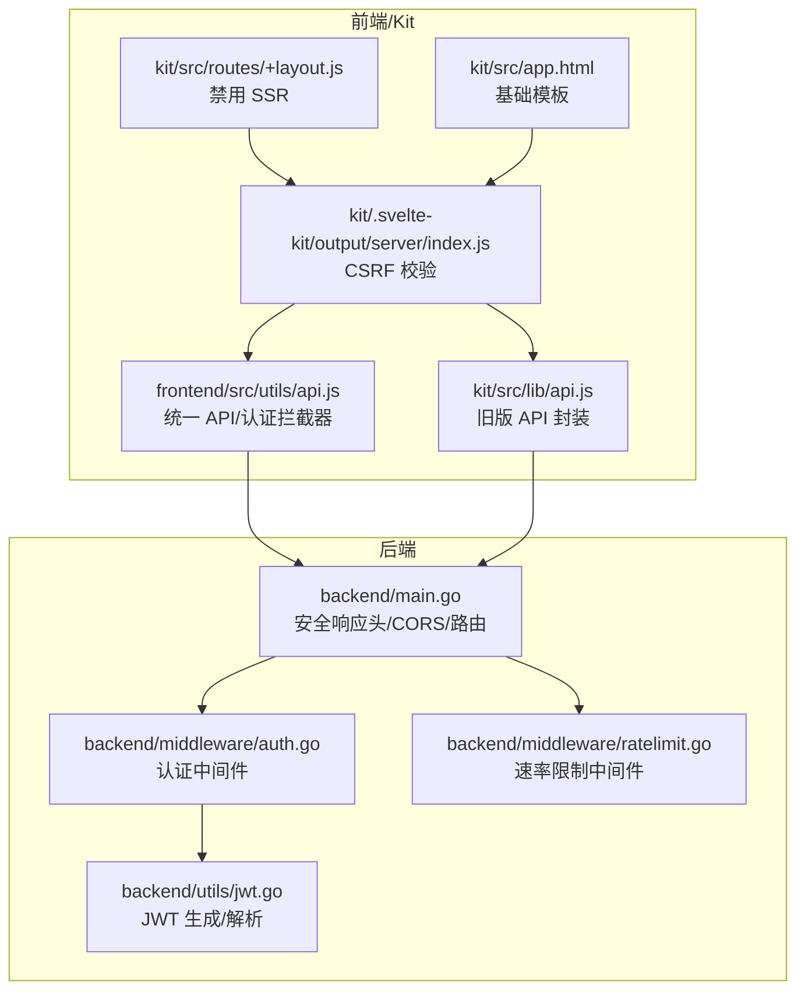
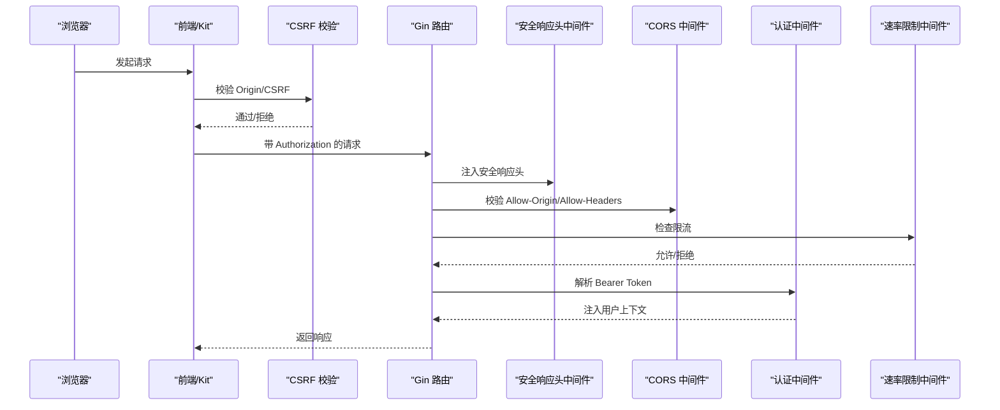
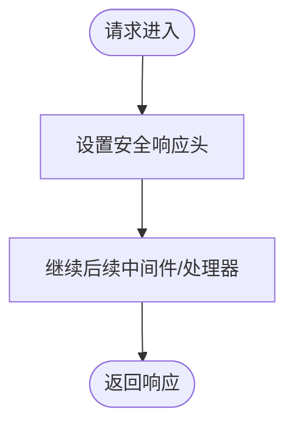
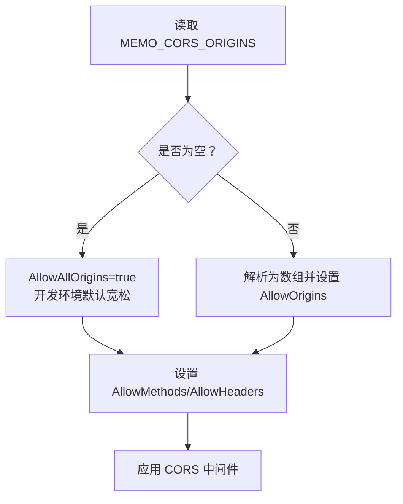
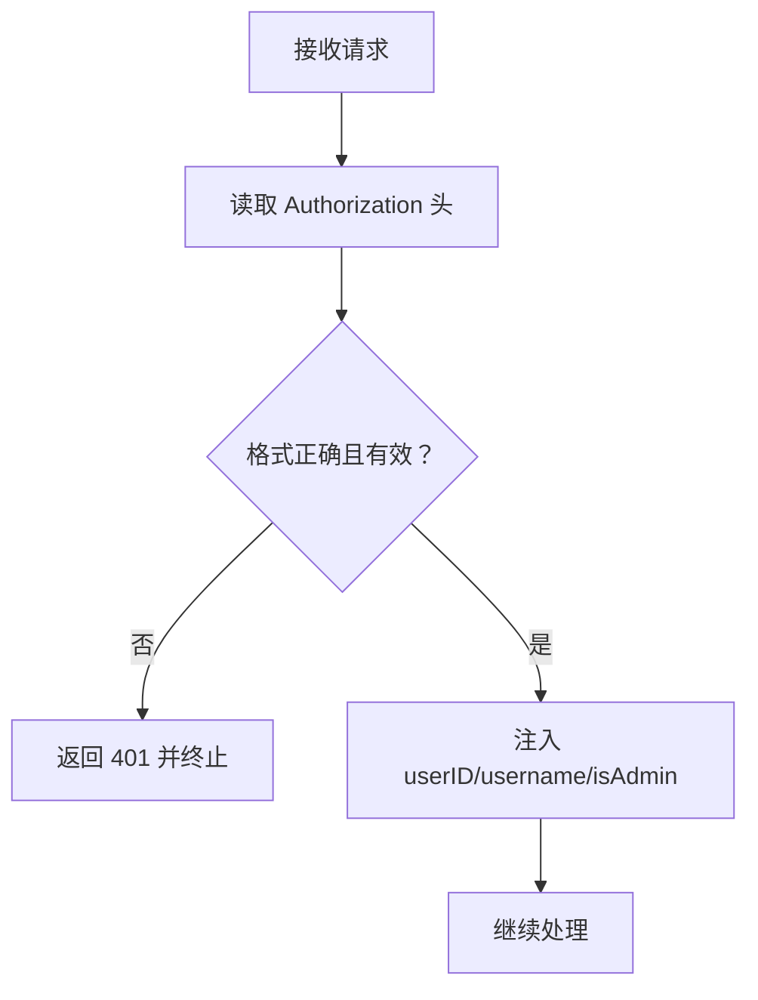
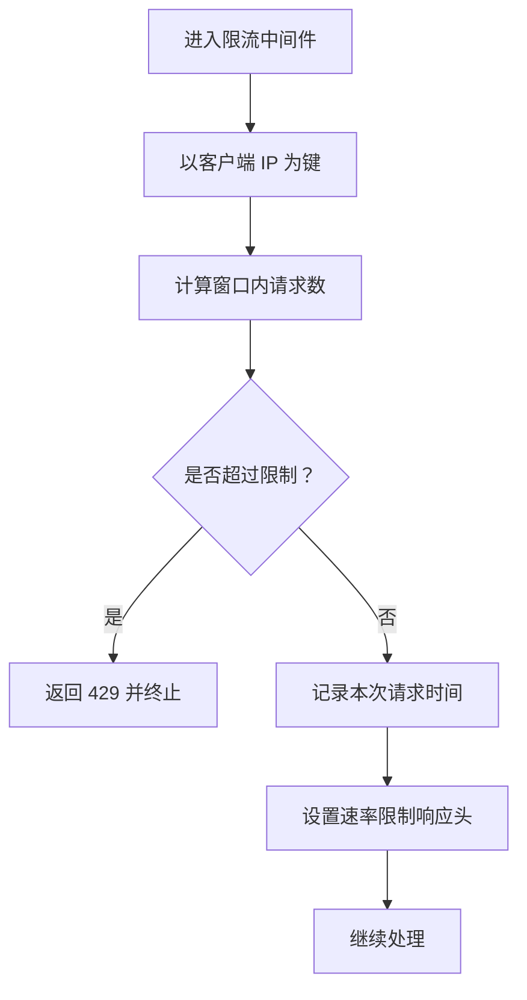
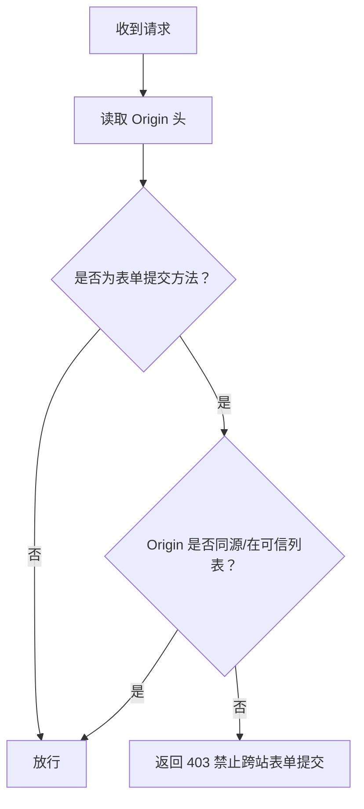
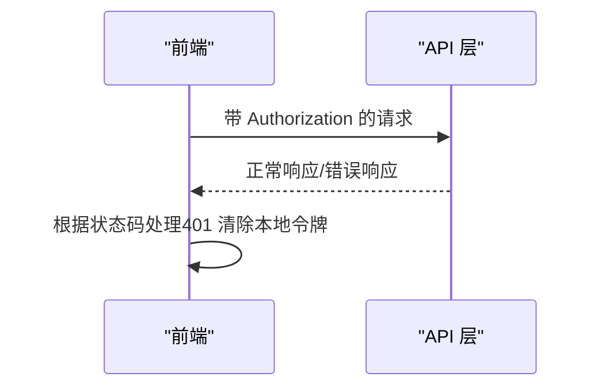
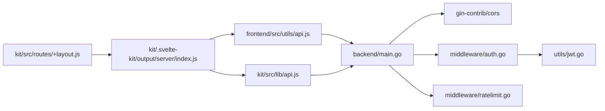

# 安全中间件

<cite>
**本文档引用的文件**
- [backend/main.go](file://backend/main.go)
- [backend/middleware/auth.go](file://backend/middleware/auth.go)
- [backend/middleware/ratelimit.go](file://backend/middleware/ratelimit.go)
- [backend/utils/jwt.go](file://backend/utils/jwt.go)
- [frontend/src/utils/api.js](file://frontend/src/utils/api.js)
- [kit/src/lib/api.js](file://kit/src/lib/api.js)
- [kit/.svelte-kit/output/server/index.js](file://kit/.svelte-kit/output/server/index.js)
- [kit/src/routes/+layout.js](file://kit/src/routes/+layout.js)
- [kit/src/app.html](file://kit/src/app.html)
- [README.md](file://README.md)
- [docs/README_CN.md](file://docs/README_CN.md)
- [docs/README_EN.md](file://docs/README_EN.md)
</cite>

## 目录
1. [简介](#简介)
2. [项目结构](#项目结构)
3. [核心组件](#核心组件)
4. [架构总览](#架构总览)
5. [详细组件分析](#详细组件分析)
6. [依赖关系分析](#依赖关系分析)
7. [性能考量](#性能考量)
8. [故障排查指南](#故障排查指南)
9. [结论](#结论)
10. [附录](#附录)

## 简介
本文件面向 Memo Studio 的安全中间件，系统性阐述后端安全响应头、CORS 配置、CSRF 防护以及速率限制等关键安全机制，并提供开发与生产环境的最佳实践与配置示例。文档同时结合前端与 SvelteKit 侧的安全实现，帮助读者全面理解端到端的安全策略。

## 项目结构
后端采用 Gin 框架，安全中间件主要集中在入口文件中集中配置，辅以认证与速率限制中间件。前端与 Kit 侧包含认证拦截器与 CSRF 校验逻辑，共同构成完整的安全体系。

**图表来源**
- [backend/main.go](file://backend/main.go#L46-L80)
- [backend/middleware/auth.go](file://backend/middleware/auth.go#L12-L52)
- [backend/middleware/ratelimit.go](file://backend/middleware/ratelimit.go#L96-L121)
- [backend/utils/jwt.go](file://backend/utils/jwt.go#L29-L66)
- [frontend/src/utils/api.js](file://frontend/src/utils/api.js#L53-L76)
- [kit/src/lib/api.js](file://kit/src/lib/api.js#L17-L33)
- [kit/.svelte-kit/output/server/index.js](file://kit/.svelte-kit/output/server/index.js#L3043-L3054)
- [kit/src/routes/+layout.js](file://kit/src/routes/+layout.js#L1-L4)
- [kit/src/app.html](file://kit/src/app.html#L1-L17)

**章节来源**
- [backend/main.go](file://backend/main.go#L28-L80)
- [kit/src/routes/+layout.js](file://kit/src/routes/+layout.js#L1-L4)

## 核心组件
- 安全响应头中间件：在每个请求上注入关键安全头，降低浏览器层面的安全风险。
- CORS 中间件：基于环境变量动态配置允许的源、方法与头部，兼顾开发便利与生产安全。
- 认证中间件：从 Authorization 头解析 Bearer Token，校验并注入用户上下文。
- 速率限制中间件：基于内存的滑动窗口限流，保护接口免受滥用。
- JWT 工具：生成与解析令牌，生产环境强制要求密钥配置。
- 前端认证拦截器：统一添加 Authorization 头，处理 401 等错误。
- SvelteKit CSRF 校验：对跨站表单提交进行来源检查与禁止策略。

**章节来源**
- [backend/main.go](file://backend/main.go#L46-L80)
- [backend/middleware/auth.go](file://backend/middleware/auth.go#L12-L52)
- [backend/middleware/ratelimit.go](file://backend/middleware/ratelimit.go#L96-L121)
- [backend/utils/jwt.go](file://backend/utils/jwt.go#L11-L20)
- [frontend/src/utils/api.js](file://frontend/src/utils/api.js#L53-L76)
- [kit/.svelte-kit/output/server/index.js](file://kit/.svelte-kit/output/server/index.js#L3043-L3054)

## 架构总览
下图展示从浏览器到后端的典型请求路径，以及各层安全机制的介入点。

**图表来源**
- [backend/main.go](file://backend/main.go#L46-L80)
- [backend/middleware/ratelimit.go](file://backend/middleware/ratelimit.go#L96-L121)
- [backend/middleware/auth.go](file://backend/middleware/auth.go#L12-L52)
- [kit/.svelte-kit/output/server/index.js](file://kit/.svelte-kit/output/server/index.js#L3043-L3054)

## 详细组件分析

### 安全响应头中间件
- X-Content-Type-Options：阻止 MIME 类型嗅探，降低误执行风险。
- X-Frame-Options：限制页面被嵌入到 <frame>/<iframe>，缓解点击劫持。
- X-XSS-Protection：启用浏览器 XSS 过滤（部分浏览器已弃用，仍有一定辅助作用）。
- X-Robots-Tag：防止搜索引擎索引敏感页面。
- 以上头在每个请求进入路由处理前统一注入，确保全局生效。

**图表来源**
- [backend/main.go](file://backend/main.go#L46-L53)

**章节来源**
- [backend/main.go](file://backend/main.go#L46-L53)

### CORS 配置
- 动态来源白名单：通过环境变量 MEMO_CORS_ORIGINS 传入逗号分隔的来源列表；若为空则默认允许所有来源（开发环境友好，生产环境建议明确配置）。
- 方法与头部：默认允许 GET、POST、PUT、DELETE、OPTIONS；允许 Origin、Content-Type、Accept、Authorization。
- 警告提示：生产环境未设置来源时输出警告，提醒配置以提升安全性。
- 速率限制与健康检查：公开的 /health 端点不加速率限制，其他公开路由（登录/注册）受速率限制保护。

**图表来源**
- [backend/main.go](file://backend/main.go#L55-L80)

**章节来源**
- [backend/main.go](file://backend/main.go#L55-L80)
- [README.md](file://README.md#L71-L71)
- [docs/README_CN.md](file://docs/README_CN.md#L470-L470)
- [docs/README_EN.md](file://docs/README_EN.md#L470-L470)

### 认证中间件与 JWT
- 请求头提取：从 Authorization 中提取 Bearer Token。
- 令牌校验：调用 JWT 工具解析并验证签名，失败则返回 401。
- 上下文注入：成功后将用户 ID、用户名、管理员标识注入到上下文中，供后续处理器使用。
- 管理员权限：额外的 AdminOnly 中间件用于限制仅管理员可访问的路由。

**图表来源**
- [backend/middleware/auth.go](file://backend/middleware/auth.go#L12-L52)
- [backend/utils/jwt.go](file://backend/utils/jwt.go#L51-L66)

**章节来源**
- [backend/middleware/auth.go](file://backend/middleware/auth.go#L12-L52)
- [backend/utils/jwt.go](file://backend/utils/jwt.go#L29-L66)

### 速率限制中间件
- 算法：基于内存的滑动窗口限流，默认每分钟 50 次；可通过 StrictRateLimitMiddleware 设置更严格的 30 次/分钟。
- 记录清理：每次检查会清理过期请求记录，保证窗口大小准确。
- 响应头：在允许请求中附加 X-RateLimit-Limit 与 X-RateLimit-Remaining，便于客户端感知配额。
- 拒绝策略：超过阈值时返回 429，并设置 Retry-After。

**图表来源**
- [backend/middleware/ratelimit.go](file://backend/middleware/ratelimit.go#L96-L121)

**章节来源**
- [backend/middleware/ratelimit.go](file://backend/middleware/ratelimit.go#L96-L121)

### CSRF 防护机制
- 来源检查：当启用 CSRF 校验时，对跨站的 POST/PUT/PATCH/DELETE 表单提交进行禁止，要求 Origin 必须与站点同源或在可信列表中。
- 错误处理：根据 Accept 头返回 JSON 或纯文本错误信息。
- 配置位置：CSRF 校验逻辑位于 SvelteKit 服务端代码中，与前端请求形成联动。

**图表来源**
- [kit/.svelte-kit/output/server/index.js](file://kit/.svelte-kit/output/server/index.js#L3043-L3054)

**章节来源**
- [kit/.svelte-kit/output/server/index.js](file://kit/.svelte-kit/output/server/index.js#L3043-L3054)

### 前端认证拦截器与错误处理
- 统一添加 Authorization 头：在请求头中自动带上 Bearer Token。
- 错误处理：针对 401、404、429 等状态码进行统一处理，触发登出或提示。
- 与后端配合：前端负责携带令牌，后端负责解析与校验，形成端到端的认证链路。

**图表来源**
- [frontend/src/utils/api.js](file://frontend/src/utils/api.js#L53-L76)
- [frontend/src/utils/api.js](file://frontend/src/utils/api.js#L34-L50)

**章节来源**
- [frontend/src/utils/api.js](file://frontend/src/utils/api.js#L53-L76)
- [frontend/src/utils/api.js](file://frontend/src/utils/api.js#L34-L50)

## 依赖关系分析
- 后端入口依赖 Gin、gin-contrib/cors，以及自定义中间件与工具模块。
- 认证中间件依赖 JWT 工具进行令牌解析。
- 前端与 Kit 侧通过统一 API 封装与 CSRF 校验协同工作。
- SSR 禁用：+layout.js 明确禁用 SSR，避免在服务端访问浏览器对象导致问题。

**图表来源**
- [backend/main.go](file://backend/main.go#L19-L21)
- [backend/middleware/auth.go](file://backend/middleware/auth.go#L3-L10)
- [backend/middleware/ratelimit.go](file://backend/middleware/ratelimit.go#L3-L9)
- [backend/utils/jwt.go](file://backend/utils/jwt.go#L3-L9)
- [frontend/src/utils/api.js](file://frontend/src/utils/api.js#L53-L76)
- [kit/src/lib/api.js](file://kit/src/lib/api.js#L17-L33)
- [kit/.svelte-kit/output/server/index.js](file://kit/.svelte-kit/output/server/index.js#L3043-L3054)
- [kit/src/routes/+layout.js](file://kit/src/routes/+layout.js#L1-L4)

**章节来源**
- [backend/main.go](file://backend/main.go#L19-L21)
- [backend/middleware/auth.go](file://backend/middleware/auth.go#L3-L10)
- [backend/middleware/ratelimit.go](file://backend/middleware/ratelimit.go#L3-L9)
- [backend/utils/jwt.go](file://backend/utils/jwt.go#L3-L9)
- [frontend/src/utils/api.js](file://frontend/src/utils/api.js#L53-L76)
- [kit/src/lib/api.js](file://kit/src/lib/api.js#L17-L33)
- [kit/.svelte-kit/output/server/index.js](file://kit/.svelte-kit/output/server/index.js#L3043-L3054)
- [kit/src/routes/+layout.js](file://kit/src/routes/+layout.js#L1-L4)

## 性能考量
- 内存限流：滑动窗口基于内存存储，适合中小规模并发；高并发场景建议引入分布式缓存（如 Redis）实现共享限流。
- CORS 配置：生产环境建议明确 AllowOrigins，减少预检请求的不确定性与网络往返。
- 安全头：仅做响应头注入，开销极低，建议始终开启。
- 前端拦截器：统一处理错误与令牌，减少重复逻辑，提升用户体验与稳定性。

## 故障排查指南
- CORS 相关
  - 现象：浏览器报跨域错误。
  - 排查：确认 MEMO_CORS_ORIGINS 是否包含当前前端域名；生产环境务必显式配置。
  - 参考：[backend/main.go](file://backend/main.go#L55-L80)
- 401 未授权
  - 现象：接口返回 401。
  - 排查：确认前端是否正确携带 Authorization 头；后端 JWT 密钥是否正确配置；令牌是否过期。
  - 参考：[frontend/src/utils/api.js](file://frontend/src/utils/api.js#L53-L76)，[backend/utils/jwt.go](file://backend/utils/jwt.go#L11-L20)
- 429 请求过于频繁
  - 现象：接口返回 429。
  - 排查：检查 X-RateLimit-Remaining 响应头；调整限流策略或客户端重试策略。
  - 参考：[backend/middleware/ratelimit.go](file://backend/middleware/ratelimit.go#L96-L121)
- CSRF 禁止跨站表单提交
  - 现象：POST/PUT/PATCH/DELETE 表单提交被 403 拒绝。
  - 排查：确认请求来源与站点同源或在可信列表；检查 Accept 头与错误响应类型。
  - 参考：[kit/.svelte-kit/output/server/index.js](file://kit/.svelte-kit/output/server/index.js#L3043-L3054)

**章节来源**
- [backend/main.go](file://backend/main.go#L55-L80)
- [backend/utils/jwt.go](file://backend/utils/jwt.go#L11-L20)
- [backend/middleware/ratelimit.go](file://backend/middleware/ratelimit.go#L96-L121)
- [frontend/src/utils/api.js](file://frontend/src/utils/api.js#L34-L50)
- [kit/.svelte-kit/output/server/index.js](file://kit/.svelte-kit/output/server/index.js#L3043-L3054)

## 结论
Memo Studio 的安全中间件通过“安全响应头 + CORS + 认证 + 速率限制 + CSRF 校验”的组合，构建了覆盖请求生命周期的多层防护。生产环境应严格配置 CORS 与 JWT 密钥，前端需正确传递令牌并处理错误；对于高并发场景，建议将限流策略迁移至分布式缓存，以获得更好的扩展性与一致性。

## 附录

### 配置示例与最佳实践
- 环境变量
  - MEMO_ENV：production
  - MEMO_JWT_SECRET：生产环境必须设置
  - MEMO_CORS_ORIGINS：生产环境建议显式设置，如 https://your.domain.com,https://nas.local
- 开发环境
  - CORS 默认允许所有来源，便于前后端联调。
  - 日志中会输出生产环境未设置 CORS 的警告，建议尽快补齐。
- 生产环境
  - 明确 AllowOrigins，仅允许受信域名。
  - 强制设置 MEMO_JWT_SECRET，避免致命错误。
  - 对公开端点启用速率限制，对敏感操作增加管理员权限校验。

**章节来源**
- [backend/main.go](file://backend/main.go#L324-L329)
- [backend/main.go](file://backend/main.go#L72-L77)
- [README.md](file://README.md#L71-L71)
- [docs/README_CN.md](file://docs/README_CN.md#L470-L470)
- [docs/README_EN.md](file://docs/README_EN.md#L470-L470)