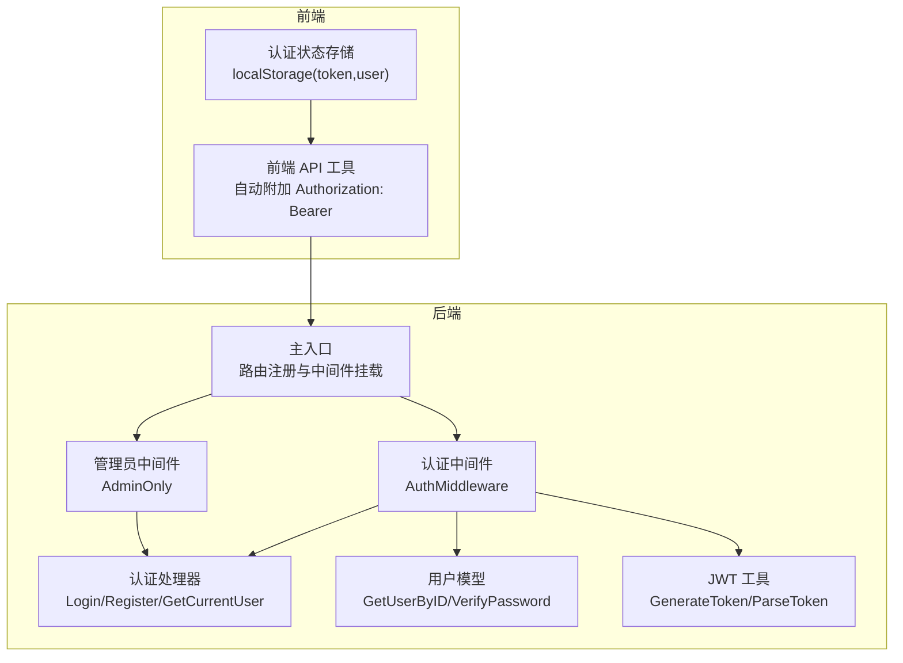
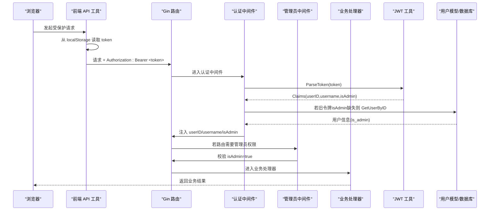
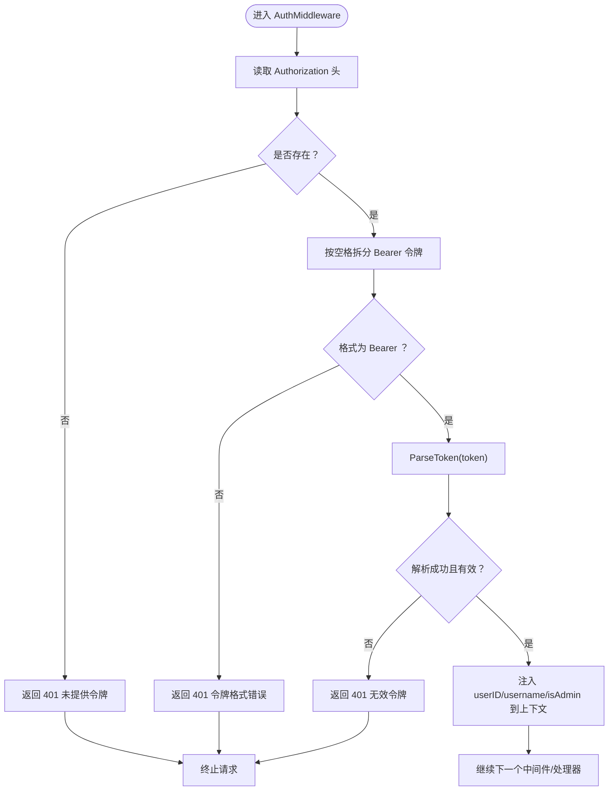
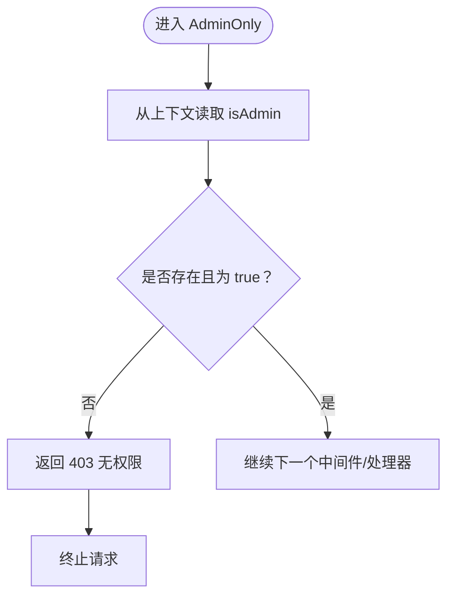
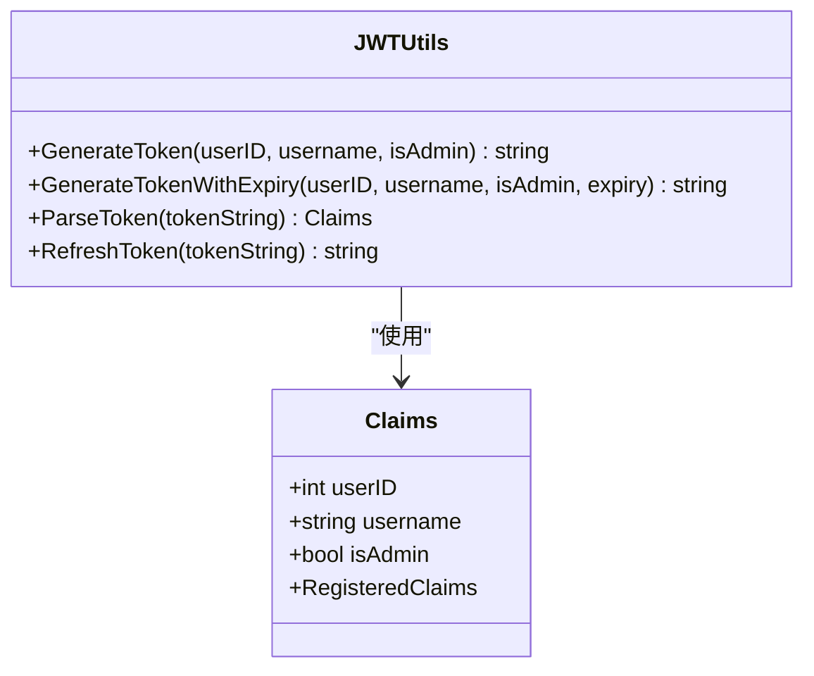
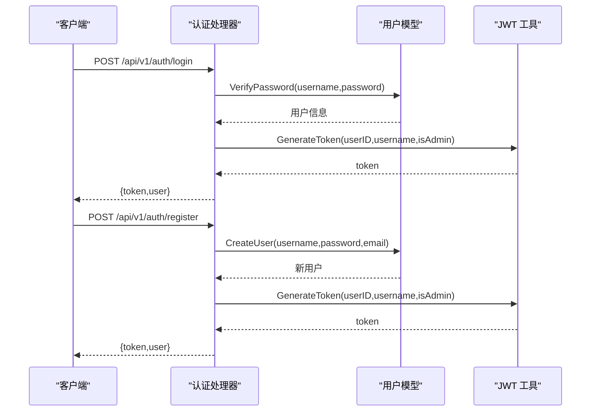
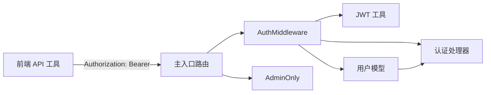

# 认证中间件

<cite>
**本文引用的文件**
- [backend/middleware/auth.go](file://backend/middleware/auth.go)
- [backend/utils/jwt.go](file://backend/utils/jwt.go)
- [backend/handlers/auth.go](file://backend/handlers/auth.go)
- [backend/models/user.go](file://backend/models/user.go)
- [backend/main.go](file://backend/main.go)
- [backend/handlers/api_test.go](file://backend/handlers/api_test.go)
- [frontend/src/utils/api.js](file://frontend/src/utils/api.js)
- [frontend/src/stores/auth.js](file://frontend/src/stores/auth.js)
</cite>

## 目录
1. [简介](#简介)
2. [项目结构](#项目结构)
3. [核心组件](#核心组件)
4. [架构总览](#架构总览)
5. [详细组件分析](#详细组件分析)
6. [依赖关系分析](#依赖关系分析)
7. [性能考量](#性能考量)
8. [故障排查指南](#故障排查指南)
9. [结论](#结论)
10. [附录](#附录)

## 简介
本文件面向 Memo Studio 的认证中间件，系统性阐述 JWT 令牌的提取、验证与解析流程，Bearer 令牌格式校验，令牌有效性判断，以及用户身份信息（userID、username、isAdmin）在请求上下文中的提取与传递机制。同时覆盖管理员权限检查中间件的设计与使用，认证失败的错误处理策略，并给出在路由中应用认证中间件的实际示例与最佳实践。

## 项目结构
认证相关的核心代码分布在后端中间件、工具库、处理器与模型层，前端通过统一 API 工具自动附加 Authorization 头部，形成“前端-后端-数据库”的完整认证链路。

图表来源
- [backend/main.go](file://backend/main.go#L94-L196)
- [backend/middleware/auth.go](file://backend/middleware/auth.go#L12-L70)
- [backend/handlers/auth.go](file://backend/handlers/auth.go#L27-L110)
- [backend/models/user.go](file://backend/models/user.go#L63-L110)
- [backend/utils/jwt.go](file://backend/utils/jwt.go#L22-L66)

章节来源
- [backend/main.go](file://backend/main.go#L94-L196)

## 核心组件
- 认证中间件 AuthMiddleware：负责从 Authorization 头提取并校验 Bearer 令牌，解析 JWT 并将用户信息注入上下文。
- 管理员中间件 AdminOnly：在上下文中读取 isAdmin 标识，进行权限判定。
- JWT 工具：生成与解析 JWT，包含密钥加载与签名验证。
- 认证处理器：登录、注册、获取当前用户等接口。
- 用户模型：用户查询与密码校验，用于兼容旧令牌的 isAdmin 回补。

章节来源
- [backend/middleware/auth.go](file://backend/middleware/auth.go#L12-L70)
- [backend/utils/jwt.go](file://backend/utils/jwt.go#L22-L66)
- [backend/handlers/auth.go](file://backend/handlers/auth.go#L27-L110)
- [backend/models/user.go](file://backend/models/user.go#L63-L110)

## 架构总览
下图展示从浏览器发起请求到后端中间件处理再到业务处理器的完整调用序列。

图表来源
- [backend/middleware/auth.go](file://backend/middleware/auth.go#L12-L70)
- [backend/utils/jwt.go](file://backend/utils/jwt.go#L51-L66)
- [backend/models/user.go](file://backend/models/user.go#L63-L76)
- [backend/handlers/auth.go](file://backend/handlers/auth.go#L95-L110)
- [frontend/src/utils/api.js](file://frontend/src/utils/api.js#L52-L76)

## 详细组件分析

### 认证中间件：AuthMiddleware
职责与流程：
- 从请求头 Authorization 中提取令牌，要求格式为 Bearer <token>。
- 使用 JWT 工具解析令牌，若解析失败或签名无效，返回未授权。
- 将 userID、username、isAdmin 写入上下文；对于旧令牌（不含 isAdmin），通过 GetUserByID 回补 isAdmin。
- 放行后续处理器。

图表来源
- [backend/middleware/auth.go](file://backend/middleware/auth.go#L13-L51)
- [backend/utils/jwt.go](file://backend/utils/jwt.go#L51-L66)

章节来源
- [backend/middleware/auth.go](file://backend/middleware/auth.go#L12-L51)

### 管理员中间件：AdminOnly
职责与流程：
- 从上下文读取 isAdmin。
- 若不存在或非 true，返回禁止访问。
- 放行后续处理器。

图表来源
- [backend/middleware/auth.go](file://backend/middleware/auth.go#L54-L70)

章节来源
- [backend/middleware/auth.go](file://backend/middleware/auth.go#L54-L70)

### JWT 工具：Claims 与令牌生命周期
- Claims 结构包含 userID、username、isAdmin 及标准声明（过期、签发、生效时间）。
- 生成令牌时设置默认 24 小时有效期，支持自定义过期时间。
- 解析令牌时使用相同密钥进行签名验证，确保令牌有效性。
- 生产环境必须设置 MEMO_JWT_SECRET 环境变量，否则初始化会报错。

图表来源
- [backend/utils/jwt.go](file://backend/utils/jwt.go#L22-L66)

章节来源
- [backend/utils/jwt.go](file://backend/utils/jwt.go#L22-L66)

### 认证处理器：登录、注册与当前用户
- 登录：校验用户名与密码，成功后生成 JWT 并返回 token 与用户信息。
- 注册：校验用户名与密码长度，创建用户并生成 JWT。
- 获取当前用户：从上下文读取 userID，查询用户并返回。

图表来源
- [backend/handlers/auth.go](file://backend/handlers/auth.go#L27-L93)
- [backend/models/user.go](file://backend/models/user.go#L78-L110)
- [backend/utils/jwt.go](file://backend/utils/jwt.go#L29-L49)

章节来源
- [backend/handlers/auth.go](file://backend/handlers/auth.go#L27-L110)
- [backend/models/user.go](file://backend/models/user.go#L78-L110)

### 路由与中间件应用示例
- 公开路由：登录/注册在 /api/v1 下使用速率限制中间件，无需认证。
- 受保护路由：在 /api/v1 下对所有需要认证的端点挂载 AuthMiddleware。
- 管理员路由：在 /api/v1 下对 /users 管理端点挂载 AdminOnly 中间件。

章节来源
- [backend/main.go](file://backend/main.go#L94-L196)

## 依赖关系分析
- 认证中间件依赖 JWT 工具进行令牌解析，并在旧令牌缺少 isAdmin 时回补用户信息。
- 业务处理器依赖用户模型进行密码校验与用户查询。
- 前端 API 工具自动在请求头附加 Authorization: Bearer token，确保每次受保护请求均携带令牌。

图表来源
- [frontend/src/utils/api.js](file://frontend/src/utils/api.js#L52-L76)
- [backend/main.go](file://backend/main.go#L94-L196)
- [backend/middleware/auth.go](file://backend/middleware/auth.go#L12-L70)
- [backend/utils/jwt.go](file://backend/utils/jwt.go#L51-L66)
- [backend/models/user.go](file://backend/models/user.go#L63-L110)
- [backend/handlers/auth.go](file://backend/handlers/auth.go#L27-L110)

章节来源
- [frontend/src/utils/api.js](file://frontend/src/utils/api.js#L52-L76)
- [backend/main.go](file://backend/main.go#L94-L196)
- [backend/middleware/auth.go](file://backend/middleware/auth.go#L12-L70)

## 性能考量
- 令牌解析为 O(1) 操作，主要开销在签名验证与可选的数据库回补查询。
- 数据库回补仅在旧令牌缺少 isAdmin 时触发，避免不必要的查询。
- 建议在高并发场景下：
  - 使用内存缓存短期用户信息（如 userID/username）以减少重复查询。
  - 控制令牌有效期，结合刷新策略降低频繁签发成本。
  - 在网关层统一做速率限制与安全头设置，减轻后端压力。

## 故障排查指南
常见错误与处理策略：
- 未提供认证令牌
  - 现象：返回 401 未提供认证令牌。
  - 排查：确认前端是否正确从 localStorage 读取 token 并附加到 Authorization 头。
  - 参考：[frontend/src/utils/api.js](file://frontend/src/utils/api.js#L52-L76)
- 令牌格式错误
  - 现象：返回 401 认证令牌格式错误。
  - 排查：确认 Authorization 头为 Bearer <token> 格式，不要遗漏 Bearer 或多余空格。
  - 参考：[backend/middleware/auth.go](file://backend/middleware/auth.go#L22-L28)
- 无效令牌（签名无效/过期）
  - 现象：返回 401 无效的认证令牌。
  - 排查：检查 MEMO_JWT_SECRET 是否正确设置；确认令牌未过期；核对签发方与接收方一致。
  - 参考：[backend/utils/jwt.go](file://backend/utils/jwt.go#L51-L66)
- 无权限（非管理员访问管理员端点）
  - 现象：返回 403 无权限。
  - 排查：确认用户 isAdmin 标志；检查路由是否正确挂载 AdminOnly。
  - 参考：[backend/middleware/auth.go](file://backend/middleware/auth.go#L54-L70)
- 旧令牌缺少 isAdmin
  - 现象：兼容逻辑会回补 isAdmin。
  - 排查：确认 GetUserByID 查询正常；避免旧令牌长期不刷新。
  - 参考：[backend/middleware/auth.go](file://backend/middleware/auth.go#L41-L48)

章节来源
- [backend/middleware/auth.go](file://backend/middleware/auth.go#L12-L70)
- [backend/utils/jwt.go](file://backend/utils/jwt.go#L51-L66)
- [frontend/src/utils/api.js](file://frontend/src/utils/api.js#L52-L76)

## 结论
Memo Studio 的认证中间件通过严格的 Bearer 令牌格式校验与 JWT 解析，结合上下文注入用户身份信息与管理员权限回补，实现了简洁可靠的认证与授权机制。配合前端统一的 Authorization 头注入与后端路由的中间件挂载，开发者可以快速、安全地为任意受保护端点添加认证与管理员权限控制。

## 附录

### 如何在路由中应用认证中间件
- 公开端点（无需认证）
  - 示例：登录/注册在 /api/v1 下使用速率限制中间件，无需 AuthMiddleware。
  - 参考：[backend/main.go](file://backend/main.go#L97-L102)
- 受保护端点（需要认证）
  - 示例：/api/v1/auth/me、/api/v1/memos、/api/v1/notes 等挂载 AuthMiddleware。
  - 参考：[backend/main.go](file://backend/main.go#L104-L196)
- 管理员端点（需要管理员权限）
  - 示例：/api/v1/users 下挂载 AdminOnly。
  - 参考：[backend/main.go](file://backend/main.go#L186-L195)

### 前端使用 Authorization 头的示例
- 前端 API 工具会在有 token 时自动附加 Authorization: Bearer <token>。
- 参考：[frontend/src/utils/api.js](file://frontend/src/utils/api.js#L52-L76)
- 认证状态存储在 localStorage，便于跨页面持久化。
- 参考：[frontend/src/stores/auth.js](file://frontend/src/stores/auth.js#L26-L56)

### 测试用例中的认证使用
- 测试通过构造 Bearer token 并设置 Authorization 头来访问受保护端点。
- 参考：[backend/handlers/api_test.go](file://backend/handlers/api_test.go#L86-L111)