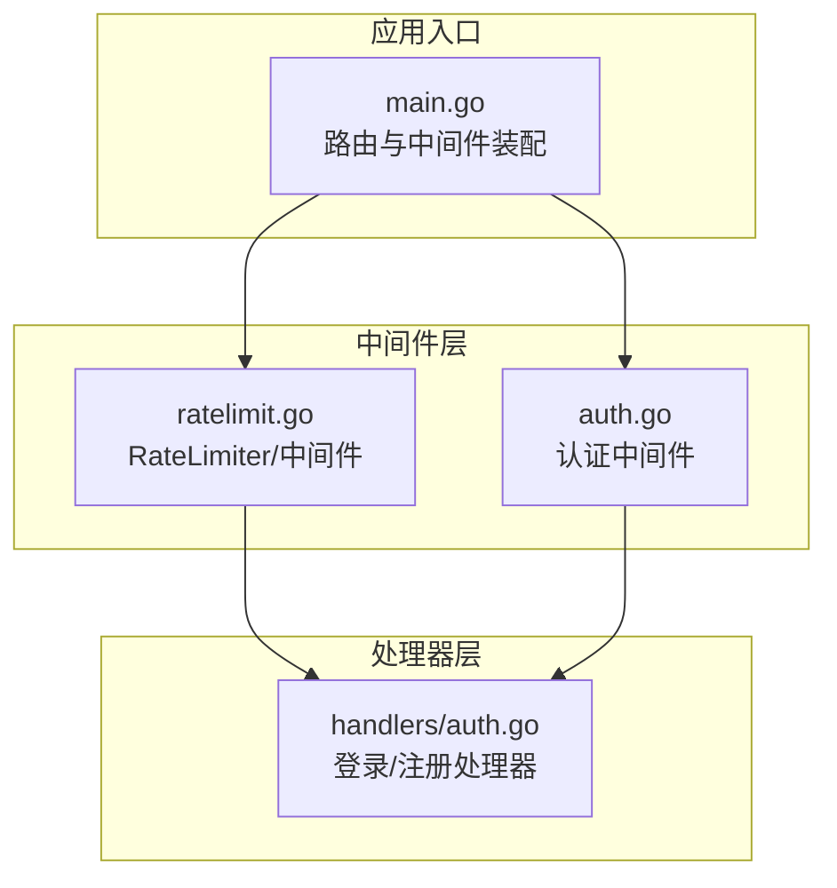
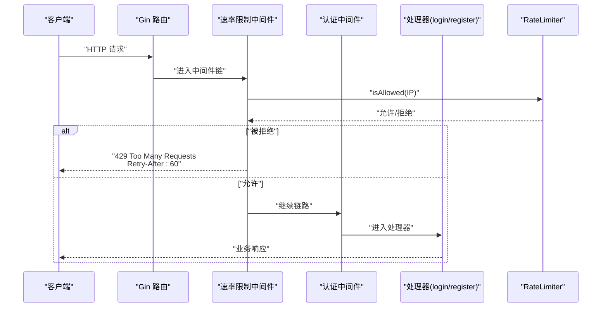
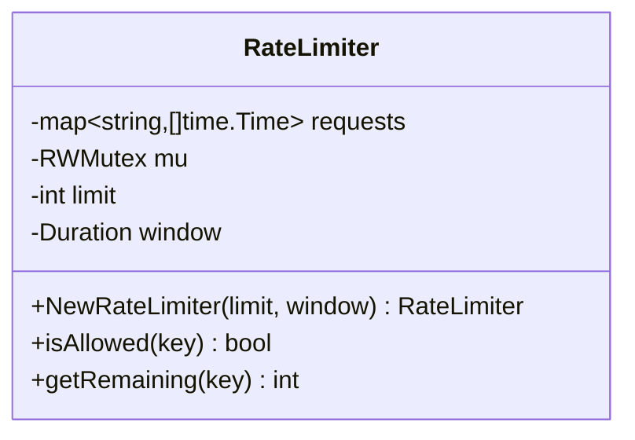
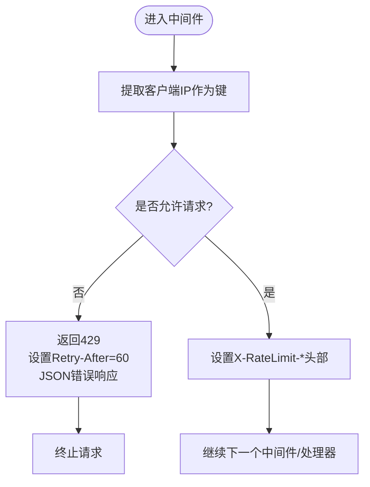
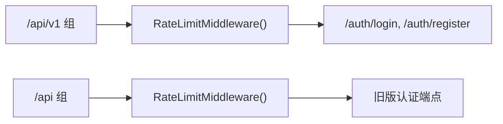
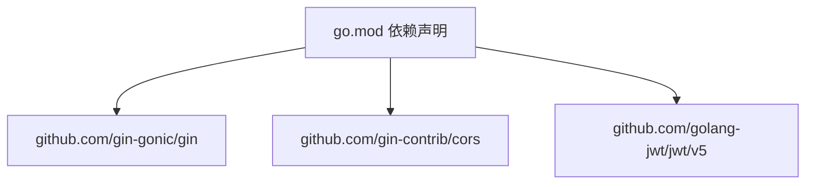

# 速率限制中间件

<cite>
**本文引用的文件**
- [backend/middleware/ratelimit.go](file://backend/middleware/ratelimit.go)
- [backend/main.go](file://backend/main.go)
- [backend/middleware/auth.go](file://backend/middleware/auth.go)
- [backend/handlers/auth.go](file://backend/handlers/auth.go)
- [backend/go.mod](file://backend/go.mod)
- [.env.example](file://.env.example)
</cite>

## 目录
1. [简介](#简介)
2. [项目结构](#项目结构)
3. [核心组件](#核心组件)
4. [架构总览](#架构总览)
5. [详细组件分析](#详细组件分析)
6. [依赖关系分析](#依赖关系分析)
7. [性能考量](#性能考量)
8. [故障排查指南](#故障排查指南)
9. [结论](#结论)
10. [附录](#附录)

## 简介
本文件面向 Memo Studio 的速率限制中间件，系统性阐述其请求频率限制的实现原理、计数器机制、时间窗口管理与限流算法；详解配置参数（最大请求数、时间窗口、IP 地址识别）；说明不同策略（基于 IP 的全局限制、严格策略、可扩展至基于用户/端点的策略）；并提供配置示例、最佳实践与限流触发时的响应处理与错误信息返回说明。文档同时给出代码级架构图与流程图，帮助开发者快速理解与正确使用。

## 项目结构
速率限制中间件位于后端 Go 项目中，采用 Gin 框架中间件模式接入路由组。整体结构如下：
- 中间件层：速率限制中间件定义于 middleware 包，提供全局与严格两种策略。
- 应用入口：main.go 中将速率限制中间件挂载到公开认证接口组，形成“按路由组”的策略差异化。
- 认证中间件：与速率限制中间件配合，先进行速率限制，再进行 JWT 校验。
- 依赖：Gin、Gin CORS、JWT 解析等。

图表来源
- [backend/main.go](file://backend/main.go#L95-L102)
- [backend/middleware/ratelimit.go](file://backend/middleware/ratelimit.go#L96-L121)
- [backend/middleware/auth.go](file://backend/middleware/auth.go#L12-L52)
- [backend/handlers/auth.go](file://backend/handlers/auth.go#L27-L53)

章节来源
- [backend/main.go](file://backend/main.go#L95-L102)
- [backend/middleware/ratelimit.go](file://backend/middleware/ratelimit.go#L96-L121)

## 核心组件
- RateLimiter 结构体：维护每个键（当前为客户端 IP）在时间窗口内的请求时间戳列表，并提供并发安全的判断与剩余配额计算。
- 全局速率限制中间件：对公开认证接口组统一施加速率限制。
- 严格速率限制中间件：用于更严格的场景（例如特定端点或用户组）。
- 认证中间件：在速率限制之后执行，确保只有通过速率限制的请求才能进入业务逻辑。

章节来源
- [backend/middleware/ratelimit.go](file://backend/middleware/ratelimit.go#L11-L26)
- [backend/middleware/ratelimit.go](file://backend/middleware/ratelimit.go#L96-L142)
- [backend/middleware/auth.go](file://backend/middleware/auth.go#L12-L52)

## 架构总览
下图展示速率限制中间件在请求生命周期中的作用位置与调用链路。

图表来源
- [backend/middleware/ratelimit.go](file://backend/middleware/ratelimit.go#L96-L121)
- [backend/middleware/auth.go](file://backend/middleware/auth.go#L12-L52)
- [backend/handlers/auth.go](file://backend/handlers/auth.go#L27-L53)

## 详细组件分析

### RateLimiter 数据结构与算法
- 键空间：以客户端 IP 为键，区分不同来源的请求。
- 计数器：每个键维护一个时间戳切片，表示该键在当前时间窗口内的请求时刻。
- 时间窗口：构造函数接收窗口时长，用于判定哪些请求仍有效。
- 并发安全：读写锁保护请求列表与统计。
- 判断逻辑：
  - 计算窗口起始时间；
  - 清理过期时间戳；
  - 若当前有效请求数已达上限，则拒绝；
  - 否则记录新请求并放行。
- 剩余配额：统计窗口内有效请求数，计算剩余配额。

图表来源
- [backend/middleware/ratelimit.go](file://backend/middleware/ratelimit.go#L11-L26)
- [backend/middleware/ratelimit.go](file://backend/middleware/ratelimit.go#L28-L81)

章节来源
- [backend/middleware/ratelimit.go](file://backend/middleware/ratelimit.go#L11-L26)
- [backend/middleware/ratelimit.go](file://backend/middleware/ratelimit.go#L28-L81)

### 速率限制中间件实现
- 全局策略：通过全局单例限流器，统一对外公开认证接口组施加速率限制。
- 严格策略：为更敏感的场景提供独立中间件，使用更小的配额与更短窗口。
- 响应头：在允许请求时设置限流相关头部，便于客户端感知配额状态。
- 触发限流：当请求被拒绝时，返回标准 429 状态码与错误码与提示信息，并设置 Retry-After。

图表来源
- [backend/middleware/ratelimit.go](file://backend/middleware/ratelimit.go#L96-L121)
- [backend/middleware/ratelimit.go](file://backend/middleware/ratelimit.go#L123-L142)

章节来源
- [backend/middleware/ratelimit.go](file://backend/middleware/ratelimit.go#L96-L121)
- [backend/middleware/ratelimit.go](file://backend/middleware/ratelimit.go#L123-L142)

### 在路由中的集成与策略差异
- 公开认证接口组：在 v1 组上统一挂载全局速率限制中间件，覆盖登录与注册端点。
- 旧版 API 兼容：同样在旧版 /api 组上挂载全局速率限制中间件。
- 认证链路：速率限制中间件在认证中间件之前执行，确保对未认证请求也进行限流。

图表来源
- [backend/main.go](file://backend/main.go#L95-L102)
- [backend/main.go](file://backend/main.go#L199-L205)

章节来源
- [backend/main.go](file://backend/main.go#L95-L102)
- [backend/main.go](file://backend/main.go#L199-L205)

### 配置参数与可扩展性
- 最大请求数（limit）：在构造限流器时指定，决定单位时间窗口内的最大请求数。
- 时间窗口（window）：在构造限流器时指定，决定统计窗口长度。
- IP 地址识别：中间件使用客户端 IP 作为键，实现基于来源的全局限速。
- 可扩展策略：
  - 基于用户：在中间件中从上下文取出用户 ID 作为键，即可实现基于用户的限流。
  - 基于端点：在中间件中根据请求路径选择不同的限流器实例，实现端点粒度限流。
  - 基于用户+端点：组合用户 ID 与路径作为复合键，实现更精细的限流。

章节来源
- [backend/middleware/ratelimit.go](file://backend/middleware/ratelimit.go#L19-L26)
- [backend/middleware/ratelimit.go](file://backend/middleware/ratelimit.go#L100-L102)

### 限流触发时的响应处理
- 状态码：429 Too Many Requests
- 响应头：
  - Retry-After：建议客户端等待秒数（当前固定为 60）
  - X-RateLimit-Limit：当前窗口限额（固定为 50）
  - X-RateLimit-Remaining：当前窗口剩余配额
- 错误信息：包含人类可读提示与错误码，便于前端与监控系统识别。

章节来源
- [backend/middleware/ratelimit.go](file://backend/middleware/ratelimit.go#L104-L117)

## 依赖关系分析
- Gin：中间件框架，提供中间件链与上下文访问。
- Gin CORS：跨域配置，不影响速率限制逻辑。
- JWT：认证中间件依赖 JWT 解析，速率限制在认证之前执行。

图表来源
- [backend/go.mod](file://backend/go.mod#L5-L11)

章节来源
- [backend/go.mod](file://backend/go.mod#L5-L11)

## 性能考量
- 内存占用：每个键维护一个时间戳切片，窗口越长、峰值并发越高，内存占用越大。可通过缩短窗口或限制键数量降低内存压力。
- 清理成本：每次请求都会清理过期时间戳，时间复杂度与窗口内有效请求数成正比。建议合理设置窗口大小与配额，避免过长窗口导致频繁扫描。
- 并发安全：使用读写锁，读多写少场景下读锁可并行，写锁串行更新，整体并发性能良好。
- 扩展建议：
  - 使用布隆过滤器或 LRU 缓存减少键数量；
  - 将热点键迁移至分布式缓存（如 Redis），实现跨节点共享；
  - 对不同端点采用不同窗口与配额，避免全局策略造成不必要的阻塞。

## 故障排查指南
- 429 频繁出现
  - 检查客户端是否在同一窗口内发起过多请求；
  - 查看 X-RateLimit-Remaining 是否接近 0；
  - 调整窗口或配额，或在中间件中引入用户键实现更细粒度限流。
- 响应头缺失
  - 确认中间件已正确挂载到目标路由组；
  - 检查中间件顺序，确保在认证中间件之前执行。
- 认证失败但被限流
  - 速率限制在认证之前执行，若被限流将直接返回 429；
  - 建议对认证端点单独评估配额，或在认证成功后再进行更严格的限流。

章节来源
- [backend/middleware/ratelimit.go](file://backend/middleware/ratelimit.go#L96-L121)
- [backend/middleware/auth.go](file://backend/middleware/auth.go#L12-L52)

## 结论
Memo Studio 的速率限制中间件采用简单高效的滑动窗口计数算法，以客户端 IP 为键实现全局限流。通过全局与严格两种策略，满足不同场景需求；结合响应头与标准错误码，便于客户端与监控系统感知与处理。建议在生产环境中根据端点特性与流量特征，进一步细化策略（基于用户、端点或复合键），并考虑引入分布式缓存以提升可扩展性。

## 附录

### 配置示例与最佳实践
- 全局公开认证接口限流
  - 在路由组上挂载全局速率限制中间件，覆盖登录与注册端点。
  - 适用于高并发公开接口，防止暴力破解与爬虫滥用。
- 严格策略端点
  - 对特定敏感端点使用严格速率限制中间件，降低配额与窗口，提升防护强度。
- 基于用户的限流
  - 在中间件中从上下文取出用户 ID 作为键，实现用户维度限流。
  - 适合付费用户与免费用户差异化配额。
- 基于端点的限流
  - 在中间件中根据请求路径选择不同限流器实例，实现端点粒度限流。
  - 适合不同业务端点的差异化保护策略。
- 响应处理与错误信息
  - 429 状态码 + Retry-After + X-RateLimit-* 头部 + 结构化错误对象（含错误码与提示）。

章节来源
- [backend/main.go](file://backend/main.go#L95-L102)
- [backend/main.go](file://backend/main.go#L199-L205)
- [backend/middleware/ratelimit.go](file://backend/middleware/ratelimit.go#L96-L121)