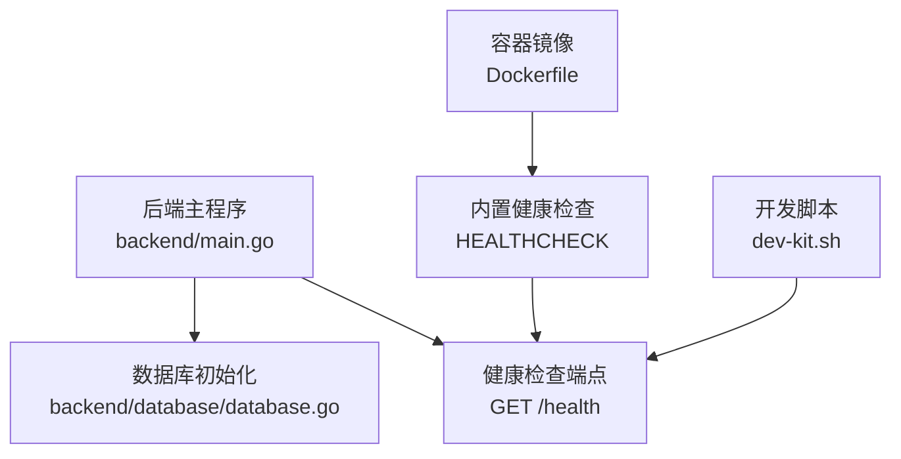
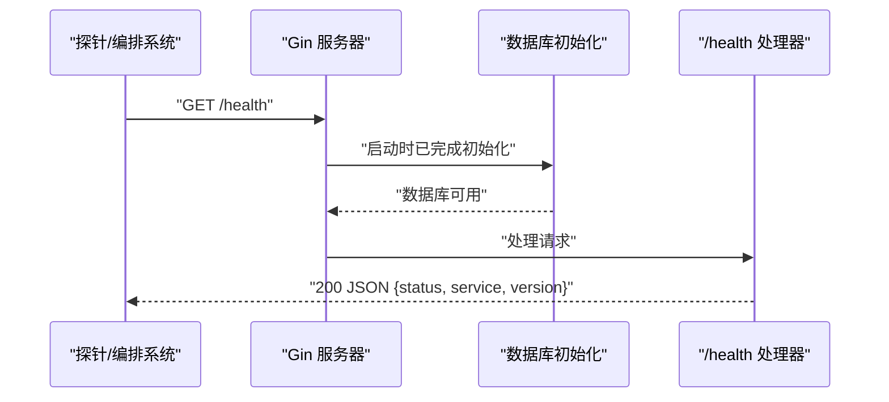
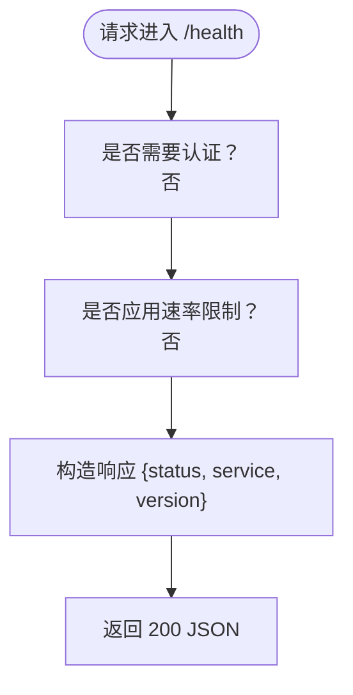
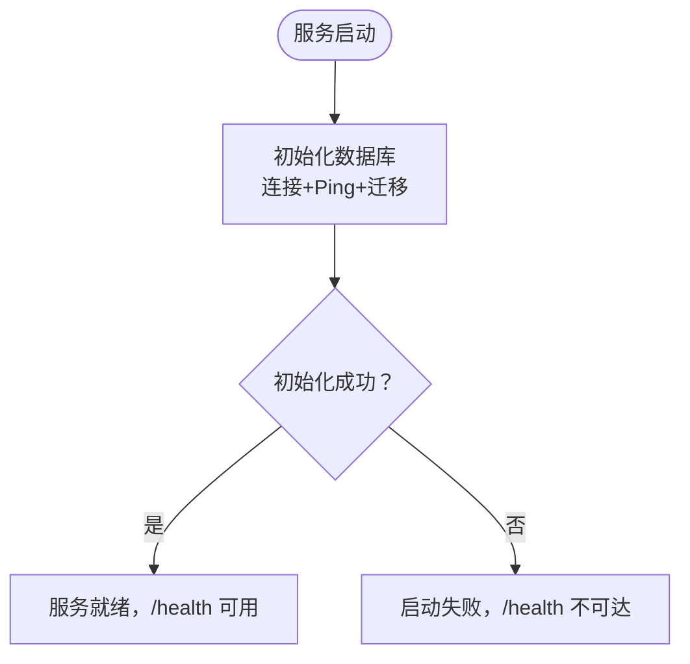
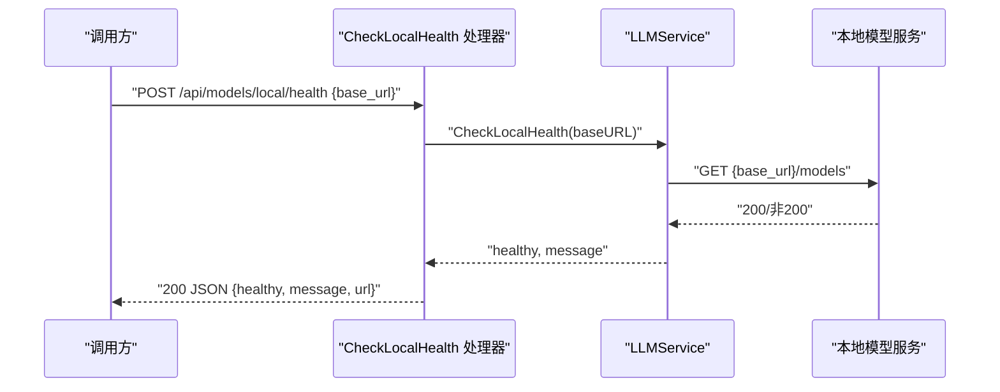
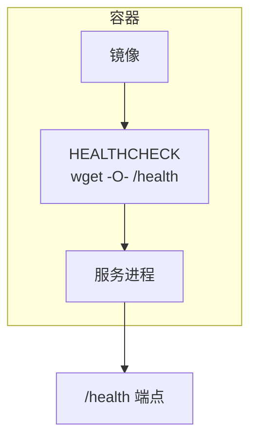
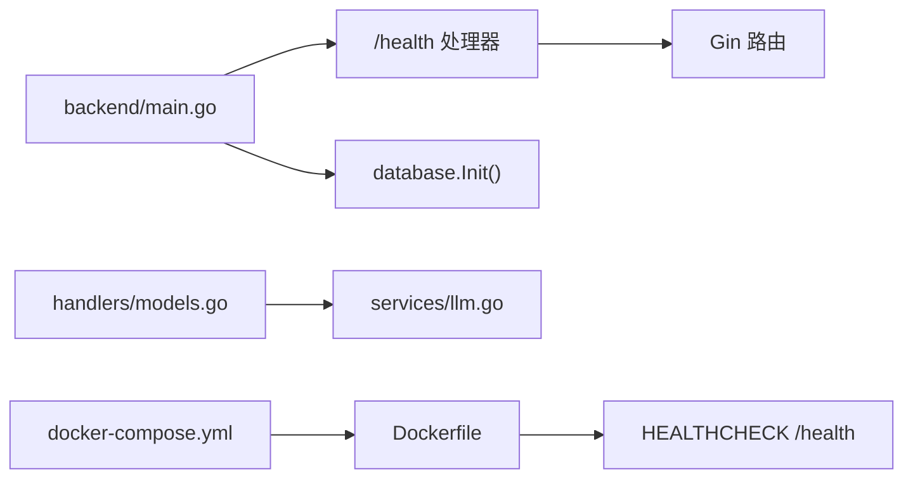

# 健康检查端点

<cite>
**本文引用的文件**
- [backend/main.go](file://backend/main.go)
- [backend/database/database.go](file://backend/database/database.go)
- [backend/services/llm.go](file://backend/services/llm.go)
- [backend/handlers/models.go](file://backend/handlers/models.go)
- [backend/middleware/ratelimit.go](file://backend/middleware/ratelimit.go)
- [Dockerfile](file://Dockerfile)
- [docker-compose.yml](file://docker-compose.yml)
- [.env.example](file://.env.example)
- [dev-kit.sh](file://dev-kit.sh)
</cite>

## 目录
1. [简介](#简介)
2. [项目结构](#项目结构)
3. [核心组件](#核心组件)
4. [架构总览](#架构总览)
5. [详细组件分析](#详细组件分析)
6. [依赖关系分析](#依赖关系分析)
7. [性能考量](#性能考量)
8. [故障排除指南](#故障排除指南)
9. [结论](#结论)
10. [附录](#附录)

## 简介
本文件围绕 Memo Studio 的健康检查端点 /health 进行系统化技术说明，涵盖设计目的、实现原理、响应格式、容器编排集成、扩展方法、访问控制与安全考虑，以及最佳实践与故障排除建议。/health 端点用于快速判断服务是否处于可接受的运行状态，是运维自动化、容器编排平台探针与可观测性的基础能力。

## 项目结构
- 后端采用 Go + Gin 框架，/health 端点在主入口中注册为公开、无速率限制的 GET 接口。
- 数据库初始化在启动阶段完成，确保 /health 能反映数据库可用性。
- 容器镜像通过 Dockerfile 配置了内置 HEALTHCHECK，使用 /health 进行健康探测。
- 开发脚本 dev-kit.sh 中也通过 /health 做启动就绪判定。

**图示来源**
- [backend/main.go](file://backend/main.go#L82-L85)
- [backend/database/database.go](file://backend/database/database.go#L20-L60)
- [Dockerfile](file://Dockerfile#L76-L77)
- [dev-kit.sh](file://dev-kit.sh#L74-L89)

**章节来源**
- [backend/main.go](file://backend/main.go#L82-L85)
- [backend/database/database.go](file://backend/database/database.go#L20-L60)
- [Dockerfile](file://Dockerfile#L76-L77)
- [dev-kit.sh](file://dev-kit.sh#L74-L89)

## 核心组件
- /health 端点：返回服务状态、服务名称与版本信息，便于自动化系统识别与告警。
- 数据库初始化：启动时建立数据库连接并执行迁移，/health 的可用性间接反映了数据库可用性。
- 速率限制中间件：/health 未应用速率限制，确保探针高频探测不会被限流。
- 容器健康检查：Dockerfile 中的 HEALTHCHECK 使用 /health 作为探测目标。
- 开发工具链：dev-kit.sh 在启动后轮询 /health，确认后端就绪。

**章节来源**
- [backend/main.go](file://backend/main.go#L82-L85)
- [backend/database/database.go](file://backend/database/database.go#L20-L60)
- [backend/middleware/ratelimit.go](file://backend/middleware/ratelimit.go#L96-L121)
- [Dockerfile](file://Dockerfile#L76-L77)
- [dev-kit.sh](file://dev-kit.sh#L74-L89)

## 架构总览
下图展示 /health 端点在系统中的位置与调用路径，以及与数据库初始化、容器健康检查的关系。

**图示来源**
- [backend/main.go](file://backend/main.go#L34-L37)
- [backend/main.go](file://backend/main.go#L82-L85)
- [Dockerfile](file://Dockerfile#L76-L77)

## 详细组件分析

### /health 端点设计与实现
- 注册位置：在主程序中以 GET 方法注册 /health。
- 认证与限流：未绑定认证中间件，未应用速率限制，保证探针可自由访问。
- 响应内容：包含状态、服务名称与版本信息，便于自动化识别。
- 错误处理：未显式返回错误码，仅在 404 时由通用 404 处理返回标准错误体。

**图示来源**
- [backend/main.go](file://backend/main.go#L82-L85)
- [backend/main.go](file://backend/main.go#L294-L316)

**章节来源**
- [backend/main.go](file://backend/main.go#L82-L85)
- [backend/main.go](file://backend/main.go#L294-L316)

### 响应格式说明
- 状态字段：表示服务整体健康状态。
- 服务名称：标识服务实例或组件名称。
- 版本信息：标识服务版本号。
- 典型响应：包含上述三要素，便于自动化系统解析与告警。

**章节来源**
- [backend/main.go](file://backend/main.go#L82-L85)

### 数据库可用性检测
- 启动流程：在主程序启动早期调用数据库初始化，内部执行连接测试与迁移。
- /health 与数据库：/health 本身不直接查询数据库，但数据库初始化成功与否直接影响服务可用性；若初始化失败，服务器启动即会失败，/health 亦不可达。

**图示来源**
- [backend/main.go](file://backend/main.go#L34-L37)
- [backend/database/database.go](file://backend/database/database.go#L20-L60)

**章节来源**
- [backend/main.go](file://backend/main.go#L34-L37)
- [backend/database/database.go](file://backend/database/database.go#L20-L60)

### 外部服务依赖检查（本地模型服务）
- 本地模型健康检查接口：提供 /api/models/local/health，用于检测本地 LLM 服务可用性。
- 实现机制：向传入的 baseURL + /models 发起 HTTP 请求，依据状态码判断健康状态。
- 与 /health 的关系：/health 为应用层健康指示，本地模型健康检查为业务层依赖探测，二者互补。

**图示来源**
- [backend/handlers/models.go](file://backend/handlers/models.go#L140-L162)
- [backend/services/llm.go](file://backend/services/llm.go#L517-L531)

**章节来源**
- [backend/handlers/models.go](file://backend/handlers/models.go#L140-L162)
- [backend/services/llm.go](file://backend/services/llm.go#L517-L531)

### 容器编排中的应用
- Dockerfile 中的 HEALTHCHECK 使用 /health 作为探测端点，周期性检查服务健康。
- docker-compose.yml 提供了生产环境常用环境变量示例，结合 HEALTHCHECK 实现编排平台的就绪/存活探针。
- 开发脚本 dev-kit.sh 在启动后轮询 /health，确保后端完全就绪后再启动前端。

**图示来源**
- [Dockerfile](file://Dockerfile#L76-L77)
- [docker-compose.yml](file://docker-compose.yml#L1-L25)
- [dev-kit.sh](file://dev-kit.sh#L74-L89)

**章节来源**
- [Dockerfile](file://Dockerfile#L76-L77)
- [docker-compose.yml](file://docker-compose.yml#L1-L25)
- [dev-kit.sh](file://dev-kit.sh#L74-L89)

### 访问控制与安全考虑
- /health 未绑定认证中间件，未应用速率限制，便于外部探针访问。
- 生产环境建议：
  - 明确 MEMO_CORS_ORIGINS，避免不必要的跨域放宽。
  - 设置 MEMO_JWT_SECRET，确保认证链路安全。
  - 在反向代理或网络层面限制 /health 的访问来源，仅允许监控/编排网络访问。
- 速率限制中间件未应用于 /health，避免探针被限流；如需防护，可在网关层或反向代理层增加策略。

**章节来源**
- [backend/main.go](file://backend/main.go#L82-L85)
- [backend/middleware/ratelimit.go](file://backend/middleware/ratelimit.go#L96-L121)
- [docker-compose.yml](file://docker-compose.yml#L7-L18)
- [.env.example](file://.env.example#L1-L16)

## 依赖关系分析
- /health 依赖于主程序路由注册与数据库初始化完成。
- 本地模型健康检查依赖 LLMService 与外部本地模型服务。
- 容器健康检查依赖 /health 端点与容器网络可达性。

**图示来源**
- [backend/main.go](file://backend/main.go#L34-L37)
- [backend/main.go](file://backend/main.go#L82-L85)
- [backend/handlers/models.go](file://backend/handlers/models.go#L140-L162)
- [backend/services/llm.go](file://backend/services/llm.go#L517-L531)
- [Dockerfile](file://Dockerfile#L76-L77)
- [docker-compose.yml](file://docker-compose.yml#L1-L25)

**章节来源**
- [backend/main.go](file://backend/main.go#L34-L37)
- [backend/main.go](file://backend/main.go#L82-L85)
- [backend/handlers/models.go](file://backend/handlers/models.go#L140-L162)
- [backend/services/llm.go](file://backend/services/llm.go#L517-L531)
- [Dockerfile](file://Dockerfile#L76-L77)
- [docker-compose.yml](file://docker-compose.yml#L1-L25)

## 性能考量
- /health 为轻量级端点，不涉及复杂业务逻辑与数据库查询，延迟低、资源占用小。
- 若未来扩展为多维度健康检查（如数据库连接池、外部服务连通性），建议：
  - 异步后台任务定期预热关键依赖，减少首次探测延迟。
  - 缓存最近一次健康检查结果，设定合理的过期时间。
  - 将外部依赖检查拆分为独立子指标，便于定位具体故障点。

## 故障排除指南
- /health 返回 404：
  - 检查路由是否正确注册，确认请求路径与方法。
  - 确认 NoRoute 逻辑未拦截 /health。
- 服务器启动失败：
  - 查看数据库初始化日志，确认数据库连接与迁移是否成功。
- 容器内健康检查失败：
  - 使用容器内 wget 或 curl 访问 /health，确认服务监听与端口映射正确。
  - 检查容器网络策略与防火墙规则。
- 开发脚本卡住：
  - 确认后端进程 PID 存活，查看 backend.log 最后日志。
  - 检查端口占用与依赖安装情况。

**章节来源**
- [backend/main.go](file://backend/main.go#L294-L316)
- [backend/database/database.go](file://backend/database/database.go#L20-L60)
- [Dockerfile](file://Dockerfile#L76-L77)
- [dev-kit.sh](file://dev-kit.sh#L74-L95)

## 结论
/health 端点为 Memo Studio 的健康监测提供了简洁而可靠的基础能力。它与数据库初始化、容器健康检查及开发工具链紧密协作，满足从本地开发到生产部署的多种场景需求。通过明确的响应格式与可扩展的外部依赖检查，/health 能够有效支撑自动化运维与可观测体系。

## 附录
- 环境变量参考：MEMO_JWT_SECRET、MEMO_CORS_ORIGINS、MEMO_ENV 等。
- 常用命令：docker-compose 启动、curl/wget 访问 /health、查看日志等。

**章节来源**
- [.env.example](file://.env.example#L1-L16)
- [docker-compose.yml](file://docker-compose.yml#L7-L18)