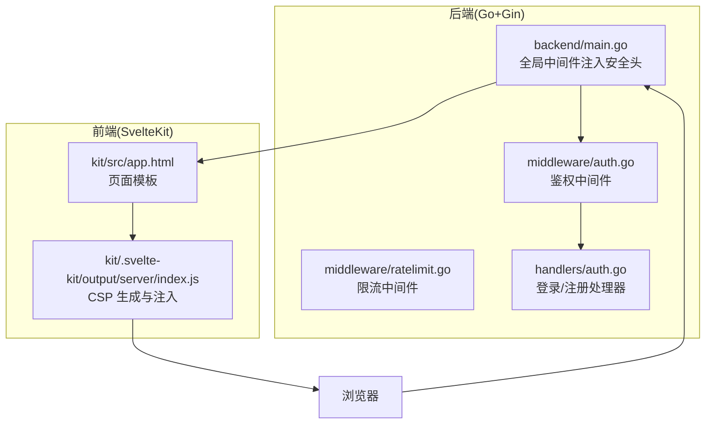
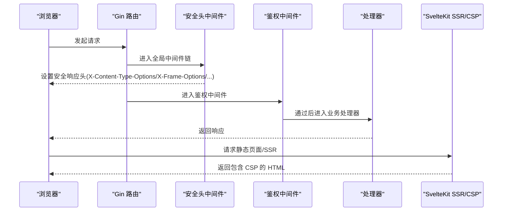
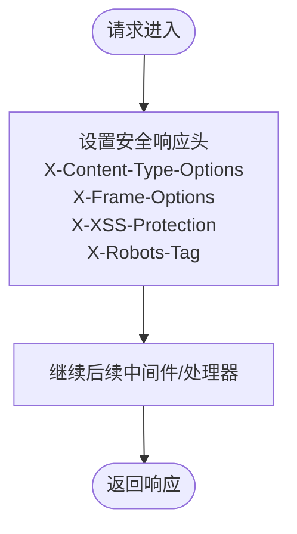
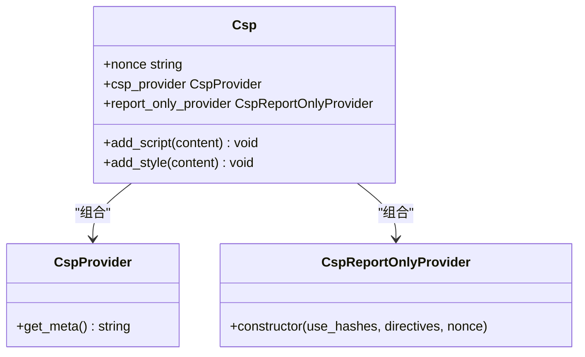
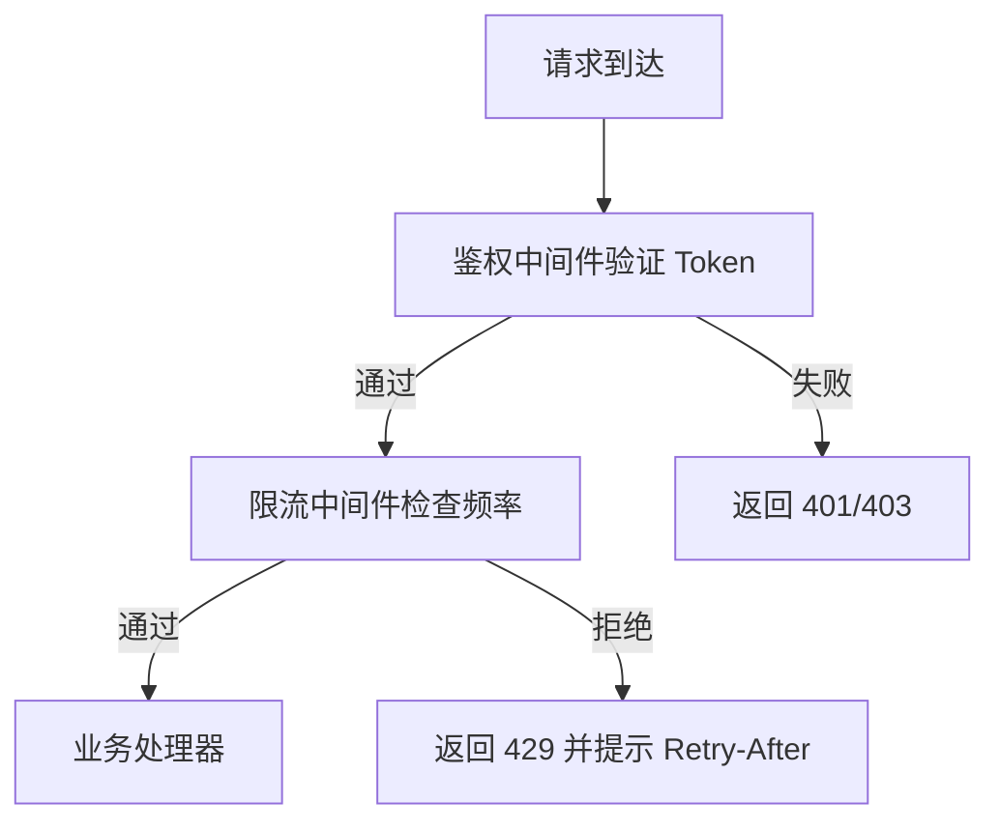
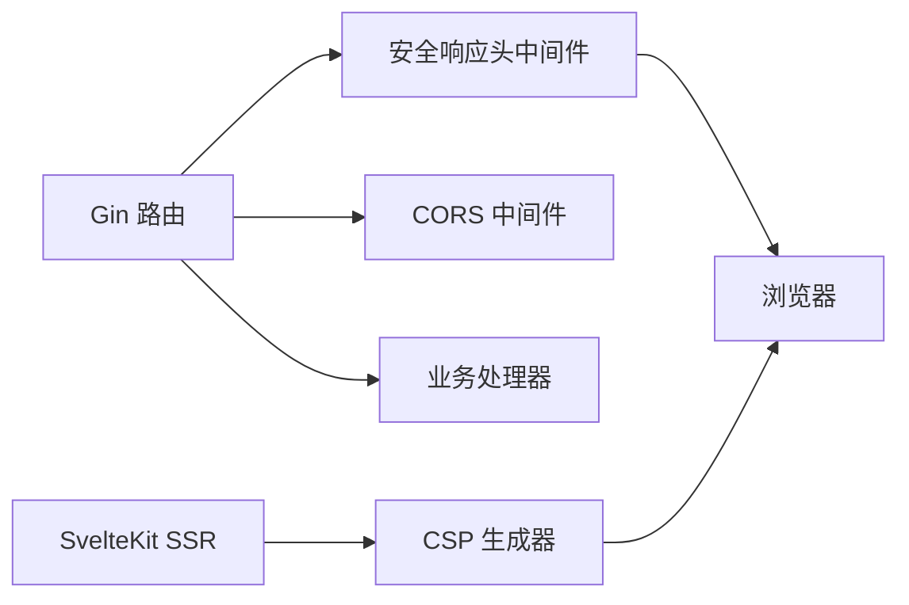

# 安全响应头配置

<cite>
**本文档引用的文件**
- [backend/main.go](file://backend/main.go)
- [kit/src/app.html](file://kit/src/app.html)
- [kit/.svelte-kit/output/server/index.js](file://kit/.svelte-kit/output/server/index.js)
- [.env.example](file://.env.example)
- [backend/go.mod](file://backend/go.mod)
- [backend/middleware/auth.go](file://backend/middleware/auth.go)
- [backend/middleware/ratelimit.go](file://backend/middleware/ratelimit.go)
- [backend/handlers/auth.go](file://backend/handlers/auth.go)
</cite>

## 目录
1. [简介](#简介)
2. [项目结构](#项目结构)
3. [核心组件](#核心组件)
4. [架构总览](#架构总览)
5. [详细组件分析](#详细组件分析)
6. [依赖关系分析](#依赖关系分析)
7. [性能考量](#性能考量)
8. [故障排查指南](#故障排查指南)
9. [结论](#结论)
10. [附录](#附录)

## 简介
本文件聚焦 Memo Studio 的安全响应头配置，系统性阐述以下头部的作用、配置方式、设置时机与全局应用机制，并对比生产与开发环境差异，说明其对浏览器行为与安全效果的影响，最后给出最佳实践与常见威胁防护建议。

## 项目结构
Memo Studio 采用前后端分离架构：
- 后端使用 Go + Gin 提供 API 与静态资源服务，统一注入安全响应头。
- 前端基于 SvelteKit，构建产物由后端托管，同时具备 CSP（内容安全策略）能力，可与后端安全头协同增强 XSS 防护。

**图表来源**
- [backend/main.go](file://backend/main.go#L46-L53)
- [kit/src/app.html](file://kit/src/app.html#L1-L17)
- [kit/.svelte-kit/output/server/index.js](file://kit/.svelte-kit/output/server/index.js#L1147-L1356)

**章节来源**
- [backend/main.go](file://backend/main.go#L1-L353)
- [kit/src/app.html](file://kit/src/app.html#L1-L17)
- [kit/.svelte-kit/output/server/index.js](file://kit/.svelte-kit/output/server/index.js#L1147-L1356)

## 核心组件
- 全局安全响应头中间件：在后端统一设置 X-Content-Type-Options、X-Frame-Options、X-XSS-Protection、X-Robots-Tag。
- 前端 CSP 生成器：根据 SvelteKit 配置动态生成 Content-Security-Policy 或 Report-Only 版本，必要时注入 nonce。
- 鉴权与限流：配合安全头共同降低 CSRF、XSS、暴力破解等风险。
- 环境变量：通过 .env.example 明确生产所需的关键安全配置项。

**章节来源**
- [backend/main.go](file://backend/main.go#L46-L53)
- [kit/.svelte-kit/output/server/index.js](file://kit/.svelte-kit/output/server/index.js#L1147-L1356)
- [.env.example](file://.env.example#L1-L16)

## 架构总览
下图展示浏览器请求在后端与前端之间的交互流程，以及安全响应头与 CSP 的注入时机。

**图表来源**
- [backend/main.go](file://backend/main.go#L46-L53)
- [backend/middleware/auth.go](file://backend/middleware/auth.go#L12-L52)
- [kit/.svelte-kit/output/server/index.js](file://kit/.svelte-kit/output/server/index.js#L1147-L1356)

## 详细组件分析

### 1) 安全响应头中间件（后端统一注入）
- 注入位置：在 Gin 路由初始化阶段，使用全局中间件对所有响应添加安全头。
- 头部作用：
  - X-Content-Type-Options: nosniff，阻止浏览器对响应 MIME 类型进行嗅探，降低 MIME 嗅探攻击风险。
  - X-Frame-Options: SAMEORIGIN，限制页面只能被同源页面嵌入，有效缓解点击劫持。
  - X-XSS-Protection: 1; mode=block，启用浏览器内置 XSS 过滤器并阻断可疑脚本。
  - X-Robots-Tag: noindex, nofollow，禁止搜索引擎索引与跟随，保护敏感页面。
- 设置时机：每次请求进入路由处理前，确保所有响应均携带这些头部。
- 环境差异：
  - 开发环境：默认开启日志与调试模式，但安全头仍会注入。
  - 生产环境：可通过环境变量 MEMO_ENV=production 控制运行模式，同时建议补充 JWT 密钥等关键配置。

**图表来源**
- [backend/main.go](file://backend/main.go#L46-L53)

**章节来源**
- [backend/main.go](file://backend/main.go#L28-L53)

### 2) 前端 CSP 生成与注入（SvelteKit）
- 功能概述：根据配置动态计算 CSP 指令，必要时注入 nonce，支持 report-only 模式。
- 关键逻辑：
  - 计算 script-src/style-src 是否需要 CSP（当存在非 unsafe-inline 或 strict-dynamic 时）。
  - 当使用 nonce 时，将 nonce 注入到 CSP 中，用于内联脚本与样式的白名单。
  - 支持生成 meta http-equiv="content-security-policy"，便于在模板中注入。
- 与后端安全头的关系：后端安全头提供基础防护，前端 CSP 提供更细粒度的资源加载控制，二者结合可显著降低 XSS 风险。

**图表来源**
- [kit/.svelte-kit/output/server/index.js](file://kit/.svelte-kit/output/server/index.js#L1147-L1356)

**章节来源**
- [kit/.svelte-kit/output/server/index.js](file://kit/.svelte-kit/output/server/index.js#L1147-L1356)

### 3) 页面模板与 CSP 注入点
- 页面模板：kit/src/app.html 作为 SvelteKit 输出 HTML 的模板入口，可与 CSP Provider 生成的 meta 标签配合。
- 实践建议：在模板中保留 CSP meta 注入点，确保 SSR 场景下也能生效。

**章节来源**
- [kit/src/app.html](file://kit/src/app.html#L1-L17)

### 4) 鉴权与限流中间件（辅助安全）
- 鉴权中间件：校验 Authorization 头，解析 JWT 并注入用户上下文，避免未授权访问导致的安全问题。
- 限流中间件：对公开接口（如登录/注册）实施速率限制，降低暴力破解与滥用风险。

**图表来源**
- [backend/middleware/auth.go](file://backend/middleware/auth.go#L12-L52)
- [backend/middleware/ratelimit.go](file://backend/middleware/ratelimit.go#L96-L121)

**章节来源**
- [backend/middleware/auth.go](file://backend/middleware/auth.go#L12-L52)
- [backend/middleware/ratelimit.go](file://backend/middleware/ratelimit.go#L96-L121)
- [backend/handlers/auth.go](file://backend/handlers/auth.go#L27-L53)

## 依赖关系分析
- 后端依赖：
  - Gin：提供路由与中间件机制，用于注入安全头与业务处理。
  - gin-contrib/cors：跨域配置，生产环境需明确配置允许来源。
  - golang-jwt：JWT 签发与校验，配合安全头提升会话安全。
- 前端依赖：
  - SvelteKit：提供 SSR 与 CSP 生成能力，与后端安全头形成互补。

**图表来源**
- [backend/go.mod](file://backend/go.mod#L5-L11)
- [backend/main.go](file://backend/main.go#L46-L80)

**章节来源**
- [backend/go.mod](file://backend/go.mod#L1-L45)
- [backend/main.go](file://backend/main.go#L46-L80)

## 性能考量
- 安全头注入为常量时间操作，几乎不影响请求处理耗时。
- CSP 计算与 nonce 注入仅在需要时触发，且仅影响包含内联脚本/样式的页面，整体开销可控。
- 在生产环境建议：
  - 固定运行模式（Release），减少调试输出带来的额外开销。
  - 合理配置 CORS，避免通配符带来的性能与安全风险。
  - 对热点接口启用缓存与限流，平衡安全与性能。

## 故障排查指南
- 现象：浏览器仍提示 MIME 类型嗅探或点击劫持风险
  - 检查后端是否正确注入 X-Content-Type-Options 与 X-Frame-Options。
  - 确认代理层未覆盖或移除这些头部。
- 现象：CSP 报告异常或内联脚本被阻断
  - 检查前端是否正确生成并注入 CSP，必要时使用 nonce。
  - 确认 CSP 指令未误配 unsafe-inline 导致策略失效。
- 现象：搜索引擎收录了不应索引的页面
  - 检查 X-Robots-Tag 是否正确设置为 noindex, nofollow。
  - 确认页面模板中未被其他元数据覆盖该头部。
- 现象：登录接口被暴力破解
  - 检查限流中间件是否生效，确认 Retry-After 头是否正确返回。
  - 确认鉴权中间件正常工作，避免未授权访问放大风险。

**章节来源**
- [backend/main.go](file://backend/main.go#L46-L53)
- [backend/middleware/ratelimit.go](file://backend/middleware/ratelimit.go#L96-L121)
- [kit/.svelte-kit/output/server/index.js](file://kit/.svelte-kit/output/server/index.js#L1147-L1356)

## 结论
Memo Studio 在后端统一注入关键安全响应头，在前端通过 SvelteKit 的 CSP 生成器实现细粒度的资源加载控制，二者协同有效降低了 MIME 嗅探、点击劫持、XSS 等常见威胁。生产环境应明确配置 CORS、JWT 密钥与运行模式，结合鉴权与限流中间件，形成完整的安全防护体系。

## 附录

### A. 安全响应头配置清单
- X-Content-Type-Options: nosniff
- X-Frame-Options: SAMEORIGIN
- X-XSS-Protection: 1; mode=block
- X-Robots-Tag: noindex, nofollow

**章节来源**
- [backend/main.go](file://backend/main.go#L46-L53)

### B. 生产与开发环境差异
- 运行模式：生产环境默认使用 Release 模式，减少调试输出。
- CORS：生产环境建议显式配置允许来源，避免使用通配符。
- 安全配置：生产环境必须设置 MEMO_JWT_SECRET 等关键变量。

**章节来源**
- [backend/main.go](file://backend/main.go#L28-L32)
- [backend/main.go](file://backend/main.go#L72-L77)
- [.env.example](file://.env.example#L4-L15)

### C. 最佳实践与常见威胁防护
- 防护 MIME 嗅探：始终设置 X-Content-Type-Options: nosniff。
- 防护点击劫持：设置 X-Frame-Options: SAMEORIGIN 或使用现代替代方案。
- 防护 XSS：启用 X-XSS-Protection 并结合 CSP，限制内联脚本与来源。
- 搜索引擎控制：对后台与敏感页面设置 X-Robots-Tag: noindex, nofollow。
- 会话安全：使用强 JWT 密钥，配合鉴权中间件与限流策略。
- 资源加载控制：前端使用 SvelteKit CSP，必要时注入 nonce，避免 unsafe-inline。

**章节来源**
- [backend/main.go](file://backend/main.go#L46-L53)
- [backend/middleware/auth.go](file://backend/middleware/auth.go#L12-L52)
- [backend/middleware/ratelimit.go](file://backend/middleware/ratelimit.go#L96-L121)
- [kit/.svelte-kit/output/server/index.js](file://kit/.svelte-kit/output/server/index.js#L1147-L1356)