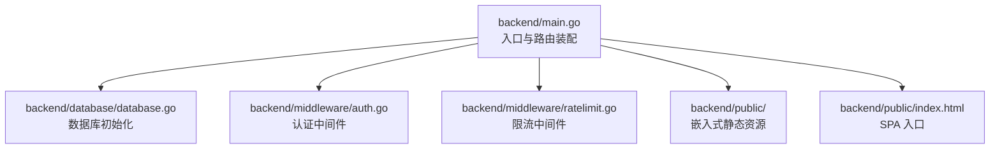
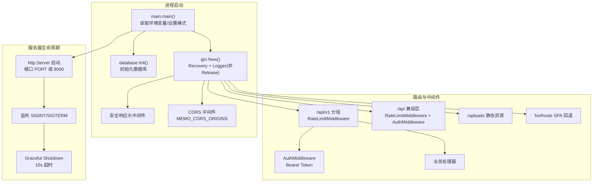
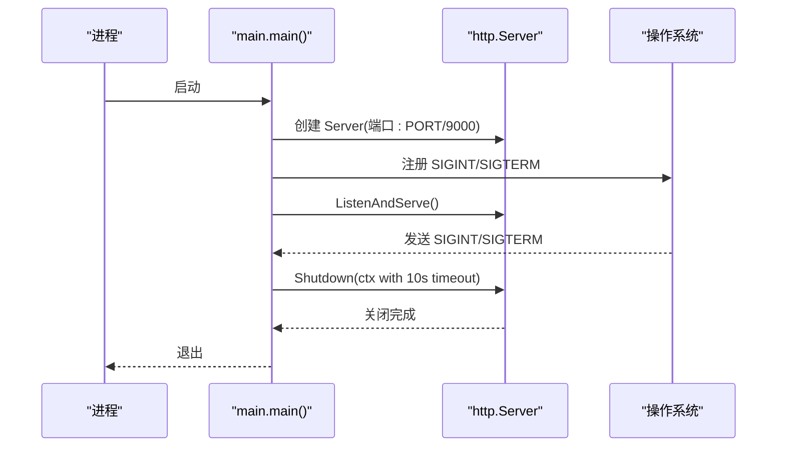
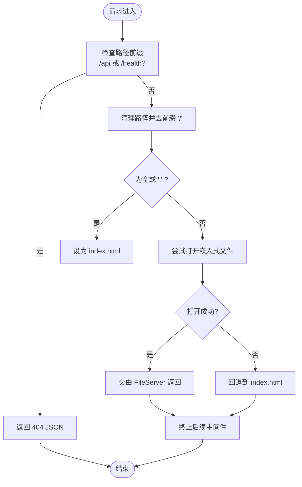
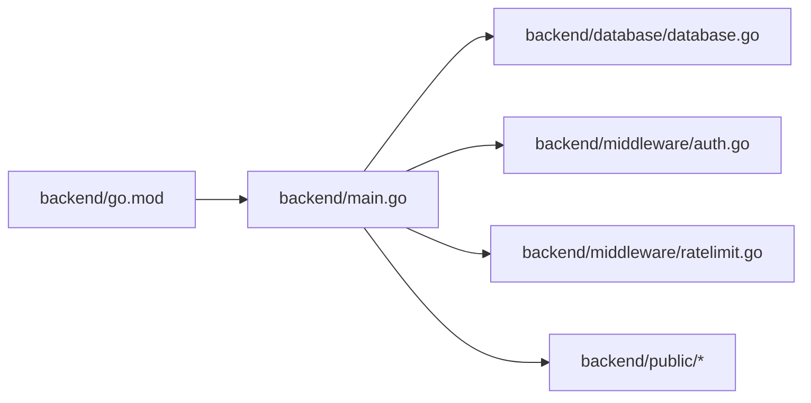

# 服务器启动与配置

<cite>
**本文引用的文件**
- [backend/main.go](file://backend/main.go)
- [backend/go.mod](file://backend/go.mod)
- [backend/database/database.go](file://backend/database/database.go)
- [backend/middleware/auth.go](file://backend/middleware/auth.go)
- [backend/middleware/ratelimit.go](file://backend/middleware/ratelimit.go)
- [backend/public/index.html](file://backend/public/index.html)
- [backend/start-dev.sh](file://backend/start-dev.sh)
- [backend/.air.toml](file://backend/.air.toml)
- [backend/README.md](file://backend/README.md)
- [start-prod.sh](file://start-prod.sh)
</cite>

## 目录
1. [简介](#简介)
2. [项目结构](#项目结构)
3. [核心组件](#核心组件)
4. [架构总览](#架构总览)
5. [组件详解](#组件详解)
6. [依赖关系分析](#依赖关系分析)
7. [性能考量](#性能考量)
8. [故障排查指南](#故障排查指南)
9. [结论](#结论)
10. [附录](#附录)

## 简介
本文件面向 Memo Studio 后端服务器启动与配置模块，围绕 Gin Web 框架初始化、运行模式与日志、恢复机制、服务器启动与优雅关闭、静态文件托管与 SPA 回退、环境变量配置与最佳实践进行系统化技术说明。读者可据此快速理解并正确部署生产环境，或在开发环境中高效迭代。

## 项目结构
后端采用 Go + Gin 架构，入口位于 backend/main.go，数据库初始化在 backend/database/database.go，认证与限流中间件分别在 backend/middleware/auth.go 与 backend/middleware/ratelimit.go。前端静态资源通过 Go 1.16+ 的 embed 机制内嵌至二进制，配合 Gin 的 NoRoute 实现 SPA 回退。

图表来源
- [backend/main.go](file://backend/main.go#L28-L352)
- [backend/database/database.go](file://backend/database/database.go#L20-L60)
- [backend/middleware/auth.go](file://backend/middleware/auth.go#L12-L52)
- [backend/middleware/ratelimit.go](file://backend/middleware/ratelimit.go#L96-L121)
- [backend/public/index.html](file://backend/public/index.html#L1-L49)

章节来源
- [backend/main.go](file://backend/main.go#L28-L352)
- [backend/database/database.go](file://backend/database/database.go#L20-L60)
- [backend/middleware/auth.go](file://backend/middleware/auth.go#L12-L52)
- [backend/middleware/ratelimit.go](file://backend/middleware/ratelimit.go#L96-L121)
- [backend/public/index.html](file://backend/public/index.html#L1-L49)

## 核心组件
- Gin 初始化与中间件链
  - 日志与恢复：开发模式默认开启 Logger，Release 模式关闭；统一启用 Recovery。
  - 安全响应头：统一注入 X-Content-Type-Options、X-Frame-Options、X-XSS-Protection、X-Robots-Tag。
  - CORS：支持 MEMO_CORS_ORIGINS 环境变量配置白名单，未配置时生产环境提示风险，默认 AllowAllOrigins。
- 路由分组与 API 版本
  - /api/v1 为主版本接口，公开登录/注册受速率限制保护，其余接口需认证。
  - /api 为旧版兼容层，逐步迁移中。
- 静态文件与 SPA 回退
  - /uploads 静态资源映射 MEMO_STORAGE_DIR（默认 ./storage）。
  - 嵌入式前端静态资源通过 embed FS 提供，NoRoute 实现 SPA 回退至 index.html。
- 服务器启动与优雅关闭
  - 默认端口 9000，可通过 PORT 覆盖；生产环境检查 MEMO_JWT_SECRET。
  - 信号处理：SIGINT/SIGTERM 触发优雅关闭，超时 10 秒强制退出。
- 数据库初始化
  - 支持 MEMO_DB_PATH（默认 ./notes.db），自动建表与多版本迁移。
- 中间件
  - 认证中间件：Authorization Bearer 校验，解析用户信息与管理员标识。
  - 速率限制：全局每分钟 50 次，Strict 模式 30 次；返回 X-RateLimit-* 头。

章节来源
- [backend/main.go](file://backend/main.go#L28-L352)
- [backend/database/database.go](file://backend/database/database.go#L20-L60)
- [backend/middleware/auth.go](file://backend/middleware/auth.go#L12-L52)
- [backend/middleware/ratelimit.go](file://backend/middleware/ratelimit.go#L96-L121)

## 架构总览
下图展示从进程启动到请求处理的关键路径，包括 Gin 初始化、中间件链、路由分组、静态资源与 SPA 回退、以及优雅关闭流程。

图表来源
- [backend/main.go](file://backend/main.go#L28-L352)
- [backend/database/database.go](file://backend/database/database.go#L20-L60)
- [backend/middleware/auth.go](file://backend/middleware/auth.go#L12-L52)
- [backend/middleware/ratelimit.go](file://backend/middleware/ratelimit.go#L96-L121)

## 组件详解

### Gin 初始化与运行模式
- 运行模式
  - 默认 Release 模式（当 GIN_MODE 未设置且 MEMO_ENV=production）。
  - 非 Release 模式自动启用 Logger，便于开发调试。
- 中间件链
  - Recovery：全局异常恢复，避免进程崩溃。
  - Logger：开发模式输出访问日志。
  - 安全响应头：统一注入安全相关头部，降低常见攻击面。
- CORS
  - 通过 MEMO_CORS_ORIGINS 传入逗号分隔的允许来源；若为空则生产环境提示风险，默认 AllowAllOrigins。
  - 允许方法与头部包含 Authorization、Content-Type、Accept、Origin 等常用项。

章节来源
- [backend/main.go](file://backend/main.go#L28-L80)

### 服务器启动与优雅关闭
- 端口配置
  - 优先读取 PORT 环境变量，未设置时默认 9000。
- 生产环境检查
  - MEMO_ENV=production 时，如未设置 MEMO_JWT_SECRET，记录告警提示。
- 优雅关闭
  - 监听 SIGINT/SIGTERM，收到信号后启动 10 秒超时优雅关闭，避免强制中断正在处理的请求。

图表来源
- [backend/main.go](file://backend/main.go#L318-L352)

章节来源
- [backend/main.go](file://backend/main.go#L318-L352)

### 静态文件托管与 SPA 回退
- 上传资源
  - /uploads 映射到 MEMO_STORAGE_DIR（默认 ./storage），用于附件访问。
- 嵌入式静态资源
  - 通过 go:embed 将 backend/public/* 内嵌为 FS，提供前端产物。
- SPA 回退
  - NoRoute 逻辑：对非 /api 与非 /health 请求，尝试匹配嵌入式文件；若不存在则回退到 index.html，实现前端路由回退。

图表来源
- [backend/main.go](file://backend/main.go#L285-L316)
- [backend/public/index.html](file://backend/public/index.html#L1-L49)

章节来源
- [backend/main.go](file://backend/main.go#L87-L92)
- [backend/main.go](file://backend/main.go#L285-L316)
- [backend/public/index.html](file://backend/public/index.html#L1-L49)

### 环境变量配置与最佳实践
- GIN_MODE
  - 控制 Gin 运行模式；未设置且 MEMO_ENV=production 时默认 Release。
- PORT
  - 服务器监听端口，默认 9000。
- MEMO_ENV
  - production 时启用 Release 模式并进行生产检查（如 MEMO_JWT_SECRET）。
- MEMO_CORS_ORIGINS
  - 逗号分隔的允许来源列表；未设置时生产环境默认 AllowAllOrigins 并给出安全告警。
- MEMO_STORAGE_DIR
  - /uploads 静态资源目录，默认 ./storage。
- MEMO_DB_PATH
  - SQLite 数据库文件路径，默认 ./notes.db。
- MEMO_JWT_SECRET
  - 生产环境必须设置，用于签发与验证 JWT。
- MEMO_ADMIN_PASSWORD
  - 初始化默认管理员或重置管理员密码；如未设置且无用户，将自动生成随机密码并记录日志。

最佳实践
- 生产环境务必设置 MEMO_JWT_SECRET 与 MEMO_CORS_ORIGINS，避免宽泛跨域。
- 使用独立存储目录 MEMO_STORAGE_DIR 并限制访问权限。
- 使用反向代理（如 Nginx/Caddy）暴露 HTTPS，后端仅监听内网或本地回环。
- 结合健康检查 /health 与进程监控，确保服务可用性。

章节来源
- [backend/main.go](file://backend/main.go#L28-L80)
- [backend/main.go](file://backend/main.go#L318-L329)
- [backend/database/database.go](file://backend/database/database.go#L20-L60)

### 中间件与安全
- 认证中间件
  - 校验 Authorization 头格式与有效性，解析用户身份与管理员标识，注入到上下文。
- 速率限制中间件
  - 全局每分钟 50 次（GetGlobalLimiter），Strict 模式 30 次；返回 X-RateLimit-Limit 与 X-RateLimit-Remaining 头。
- 安全响应头
  - 统一注入 nosniff、SAMEORIGIN、1; mode=block、noindex, nofollow 等头部。

章节来源
- [backend/middleware/auth.go](file://backend/middleware/auth.go#L12-L52)
- [backend/middleware/ratelimit.go](file://backend/middleware/ratelimit.go#L96-L121)
- [backend/main.go](file://backend/main.go#L46-L53)

### 开发与生产启动脚本
- 开发模式
  - 使用 air 热重载，自动安装依赖与代理配置，支持 SQLite FTS5 构建标签。
- 生产模式
  - 自动构建产物后启动，等待 /health 就绪后打开浏览器，支持 PID 管理与信号处理。

章节来源
- [backend/start-dev.sh](file://backend/start-dev.sh#L1-L45)
- [backend/.air.toml](file://backend/.air.toml#L1-L48)
- [start-prod.sh](file://start-prod.sh#L1-L63)

## 依赖关系分析
- 框架与库
  - Gin、CORS、JWT、SQLite3 等核心依赖在 go.mod 中声明。
- 运行时耦合
  - main.go 依赖 database.Init 完成 DB 连接与迁移；路由层依赖中间件提供认证与限流；静态资源依赖嵌入式 FS 与 NoRoute 回退。

图表来源
- [backend/go.mod](file://backend/go.mod#L5-L11)
- [backend/main.go](file://backend/main.go#L34-L37)
- [backend/database/database.go](file://backend/database/database.go#L20-L60)
- [backend/middleware/auth.go](file://backend/middleware/auth.go#L12-L52)
- [backend/middleware/ratelimit.go](file://backend/middleware/ratelimit.go#L96-L121)

章节来源
- [backend/go.mod](file://backend/go.mod#L5-L11)
- [backend/main.go](file://backend/main.go#L34-L37)

## 性能考量
- Gin 模式
  - Release 模式关闭日志与颜色输出，减少 CPU 与 I/O 开销。
- 中间件顺序
  - 将高频短路中间件（如速率限制）置于靠前位置，减少后续处理成本。
- 静态资源
  - 嵌入式资源避免磁盘 IO，NoRoute 仅在 SPA 场景触发，日常 API 请求不受影响。
- 数据库
  - WAL 模式、外键约束与合理的 busy_timeout 有助于并发与稳定性；注意 SQLite 的并发写入瓶颈，必要时引入只读副本或缓存层。

## 故障排查指南
- 服务器启动失败
  - 检查端口占用与权限；确认 PORT 设置；查看数据库初始化日志。
- CORS 问题
  - 确认 MEMO_CORS_ORIGINS 是否包含前端域名；生产环境务必显式配置。
- 静态资源 404
  - 确认 MEMO_STORAGE_DIR 可访问；检查嵌入式资源是否随二进制打包。
- 认证失败
  - 确认 Authorization 头格式为 Bearer Token；核对 MEMO_JWT_SECRET 一致性。
- 速率限制频繁触发
  - 调整限流阈值或针对特定端点降级；观察 X-RateLimit-* 头定位热点。
- 优雅关闭卡住
  - 检查是否有长时间阻塞请求；适当缩短业务处理耗时或增加超时配置。

章节来源
- [backend/main.go](file://backend/main.go#L318-L352)
- [backend/middleware/ratelimit.go](file://backend/middleware/ratelimit.go#L96-L121)
- [backend/middleware/auth.go](file://backend/middleware/auth.go#L12-L52)

## 结论
Memo Studio 后端以 Gin 为核心，结合嵌入式静态资源与 SPA 回退、完善的 CORS 与安全头、以及生产友好的优雅关闭机制，提供了简洁可靠的启动与配置体验。遵循本文的环境变量配置与最佳实践，可在开发与生产环境中稳定运行并具备良好扩展性。

## 附录
- 快速启动参考
  - 开发：使用 air 热重载，自动安装依赖与代理。
  - 生产：构建产物后启动，等待 /health 就绪并打开浏览器。
- 相关文件
  - 后端入口与路由：backend/main.go
  - 数据库初始化：backend/database/database.go
  - 认证与限流中间件：backend/middleware/auth.go、backend/middleware/ratelimit.go
  - 前端入口与静态资源：backend/public/index.html

章节来源
- [backend/README.md](file://backend/README.md#L17-L24)
- [backend/start-dev.sh](file://backend/start-dev.sh#L1-L45)
- [start-prod.sh](file://start-prod.sh#L1-L63)